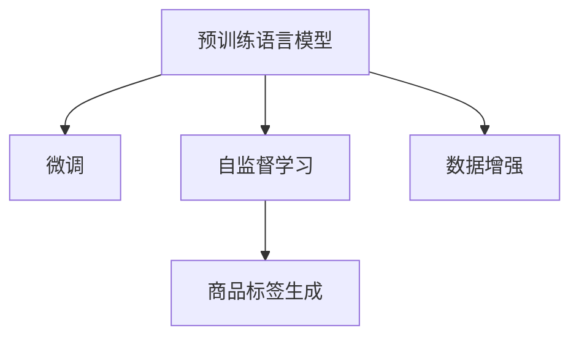

                 

# 融合AI大模型的商品标签自动生成

> 关键词：商品标签生成,大模型融合,自然语言处理,NLP,深度学习,自监督学习

## 1. 背景介绍

### 1.1 问题由来

随着电子商务的蓬勃发展，商品标签的自动生成成为了电商平台不可或缺的一环。商品标签不仅仅是商品分类和信息检索的基础，还在推荐系统、广告投放等环节中发挥着重要作用。如何高效、准确地生成商品标签，是电商平台持续优化的关键任务。

传统的商品标签生成方法基于手工规则或统计特征，依赖于人工干预和数据标注。然而，这种方案难以覆盖商品多样性和类别复杂性，且随着平台商品种类和数量不断增加，标注和维护的难度越来越大，难以满足实际应用需求。

近年来，随着深度学习和大模型的兴起，基于预训练语言模型进行商品标签自动生成的方法逐渐被广泛关注和研究。使用大规模预训练模型作为基础，通过微调或微调加自监督学习的方式，可以大幅提升商品标签生成的自动化和智能化水平。

### 1.2 问题核心关键点

商品标签自动生成涉及以下几个关键点：
1. 如何利用大模型获取商品文本的语义表示。
2. 如何设计任务目标函数，促使模型生成合理的标签。
3. 如何在保持标签一致性和多样性的同时，尽可能地提升标签生成准确率。
4. 如何处理长尾商品类别和文本多样性，确保标签生成效果的公平性和泛化能力。

## 2. 核心概念与联系

### 2.1 核心概念概述

为更好地理解基于大模型的商品标签自动生成方法，本节将介绍几个密切相关的核心概念：

- 预训练语言模型(Pre-trained Language Model, PLM)：指在大规模无标签文本数据上预训练的通用语言模型。通过自监督学习任务训练，获得语言表示能力。
- 微调(Fine-tuning)：指在预训练模型的基础上，使用特定任务的数据进行有监督学习，优化模型在该任务上的性能。
- 自监督学习(Self-supervised Learning, SSL)：指在无标签数据上，通过设计自监督任务学习模型，以增强模型对语言的理解。
- 商品标签(Merchandise Label)：指描述商品属性和类别的文本，用于商品分类、搜索、推荐等应用。
- 数据增强(Data Augmentation)：指通过对训练样本进行一定的变化和扩充，丰富训练数据的多样性，提升模型泛化能力。

这些核心概念之间的逻辑关系可以通过以下Mermaid流程图来展示：



这个流程图展示了预训练语言模型在大模型融合商品标签自动生成中的作用，包括微调、自监督学习、标签生成和数据增强等关键环节。

## 3. 核心算法原理 & 具体操作步骤
### 3.1 算法原理概述

基于大模型的商品标签自动生成方法的核心思想是通过预训练语言模型获取商品文本的语义表示，并通过微调或微调加自监督学习的方式，生成合理的商品标签。

具体而言，首先在大规模商品数据上训练预训练语言模型，然后使用特定的任务目标函数（如分类、回归等），将商品标签作为目标进行微调或微调加自监督学习。通过优化模型参数，使其能够根据输入的商品文本生成对应的标签。

### 3.2 算法步骤详解

#### 3.2.1 预训练语言模型的选择

选择合适的预训练语言模型是商品标签自动生成的关键。目前，常用的预训练语言模型包括BERT、GPT系列、RoBERTa等。这些模型均在大规模无标签文本数据上进行了自监督学习，具备丰富的语言表示能力。

#### 3.2.2 数据预处理

对商品数据进行预处理，将其转化为模型能够接受的输入格式。主要包括：
- 商品标题的清洗和分词处理。去除无意义字符，使用分词器将标题分割为词或子词。
- 商品描述的文本预处理。包括去除停用词、标点符号等，将描述转换为词向量。
- 商品属性的提取。使用爬虫或API等方式，提取商品的多个属性字段，转化为文本形式。

#### 3.2.3 任务适配层设计

根据商品标签生成的具体任务，设计合适的任务适配层。常见的任务包括商品分类、属性预测、文本匹配等。任务适配层通常包括输出层和损失函数，用于指导模型生成标签。

#### 3.2.4 微调或微调加自监督学习

微调过程分为两类：
- 微调：使用标注的商品数据对预训练模型进行有监督学习，优化模型在生成商品标签上的性能。
- 微调加自监督学习：在微调基础上，使用无标签数据进行自监督学习，提升模型泛化能力。

#### 3.2.5 模型评估和优化

在验证集上评估模型性能，根据性能指标（如准确率、召回率等）进行模型优化。常见的优化方法包括调整学习率、增加训练轮数、改变正则化强度等。

### 3.3 算法优缺点

基于大模型的商品标签自动生成方法具有以下优点：
1. 自动化程度高。使用预训练模型进行微调，可以大幅降低人工干预，提高商品标签生成的效率。
2. 泛化能力强。微调过程可以很好地利用预训练语言模型学到的语言表示，提升标签生成的效果。
3. 可扩展性好。对于新加入的商品类别，只需简单地更新适配层和微调数据，即可快速启用标签生成功能。

同时，该方法也存在一定的局限性：
1. 依赖标注数据。微调过程需要标注的商品数据，对于长尾商品类别和冷门商品，标注数据的获取成本较高。
2. 模型鲁棒性有限。预训练语言模型在大规模数据上训练，对于特定领域的数据可能泛化能力不足。
3. 数据隐私问题。商品数据包含大量个人信息和隐私，如何在模型训练中保护用户隐私，仍需进一步探索。
4. 计算资源需求高。大模型训练和微调所需的计算资源较大，需要强大的硬件支持。

尽管存在这些局限性，但就目前而言，基于大模型的商品标签自动生成方法仍是大模型应用的重要方向。未来相关研究将重点关注如何降低对标注数据的依赖，提升模型的泛化能力，同时兼顾数据隐私保护和计算资源优化。

### 3.4 算法应用领域

基于大模型的商品标签自动生成方法在电商领域有着广泛的应用，主要包括以下几个方面：

1. 商品分类：将商品文本自动分类，用于商品搜索、推荐、广告投放等场景。
2. 属性预测：自动预测商品的属性信息，如价格、品牌、材质等，辅助商品推荐和定价。
3. 文本匹配：对商品描述和用户查询进行文本匹配，提高搜索结果的相关性和精准度。
4. 推荐系统：生成商品标签后，可用于构建基于标签的推荐系统，提升推荐效果。
5. 广告投放：通过自动生成商品标签，优化广告投放策略，提高广告点击率和转化率。

此外，基于大模型的商品标签自动生成方法还可应用于供应链管理、库存管理等环节，通过自动化标签生成提升企业运营效率。

## 4. 数学模型和公式 & 详细讲解 & 举例说明

### 4.1 数学模型构建

假设有$N$个商品，每个商品有一个标题$x_i$和多个属性$a_i^j$。商品标签自动生成的目标是生成一个与商品相关的标签序列$y_i$。使用预训练语言模型$M_{\theta}$作为基础，进行微调或微调加自监督学习。

在微调过程中，定义商品标签生成任务的目标函数为：

$$
\mathcal{L}(\theta) = \sum_{i=1}^N \ell(y_i, \hat{y}_i)
$$

其中$\ell$为任务相关的损失函数，$\hat{y}_i$为模型预测的商品标签序列。

### 4.2 公式推导过程

以二分类任务为例，定义模型$M_{\theta}$在商品标题$x_i$上的输出为$\hat{y}_i=M_{\theta}(x_i) \in [0,1]$，表示商品属于类别$C_i$的概率。真实标签$y_i \in \{0,1\}$。则二分类交叉熵损失函数为：

$$
\ell(y_i, \hat{y}_i) = -[y_i\log \hat{y}_i + (1-y_i)\log (1-\hat{y}_i)]
$$

将其代入经验风险公式，得：

$$
\mathcal{L}(\theta) = -\frac{1}{N}\sum_{i=1}^N [y_i\log M_{\theta}(x_i)+(1-y_i)\log(1-M_{\theta}(x_i))]
$$

根据链式法则，损失函数对参数$\theta_k$的梯度为：

$$
\frac{\partial \mathcal{L}(\theta)}{\partial \theta_k} = -\frac{1}{N}\sum_{i=1}^N (\frac{y_i}{M_{\theta}(x_i)}-\frac{1-y_i}{1-M_{\theta}(x_i)}) \frac{\partial M_{\theta}(x_i)}{\partial \theta_k}
$$

其中$\frac{\partial M_{\theta}(x_i)}{\partial \theta_k}$可进一步递归展开，利用自动微分技术完成计算。

在得到损失函数的梯度后，即可带入参数更新公式，完成模型的迭代优化。重复上述过程直至收敛，最终得到适应商品标签生成任务的最优模型参数$\theta^*$。

### 4.3 案例分析与讲解

假设有一个电商网站，其中包含1000个商品，每个商品有一个标题和一个价格属性。使用BERT模型进行商品分类和属性预测。

1. **数据准备**：首先对商品标题和属性进行清洗和预处理，转化为模型可以接受的格式。将商品标题分词，去除停用词和标点符号。提取商品价格属性，转化为文本形式。

2. **模型加载与微调**：使用预训练的BERT模型，加载到PyTorch中。在商品分类任务上，定义输出层和损失函数，进行微调。在属性预测任务上，同样定义输出层和损失函数，进行微调。

3. **模型评估**：在验证集上评估模型性能，根据准确率和召回率等指标进行模型优化。常见的优化方法包括调整学习率、增加训练轮数、改变正则化强度等。

4. **标签生成**：在测试集上使用模型生成商品标签。模型可以根据商品标题和属性信息，生成对应的分类和属性标签。

## 5. 项目实践：代码实例和详细解释说明

### 5.1 开发环境搭建

在进行商品标签自动生成项目开发前，我们需要准备好开发环境。以下是使用Python进行PyTorch开发的环境配置流程：

1. 安装Anaconda：从官网下载并安装Anaconda，用于创建独立的Python环境。

2. 创建并激活虚拟环境：
```bash
conda create -n pytorch-env python=3.8 
conda activate pytorch-env
```

3. 安装PyTorch：根据CUDA版本，从官网获取对应的安装命令。例如：
```bash
conda install pytorch torchvision torchaudio cudatoolkit=11.1 -c pytorch -c conda-forge
```

4. 安装Transformers库：
```bash
pip install transformers
```

5. 安装各类工具包：
```bash
pip install numpy pandas scikit-learn matplotlib tqdm jupyter notebook ipython
```

完成上述步骤后，即可在`pytorch-env`环境中开始商品标签自动生成项目的开发。

### 5.2 源代码详细实现

下面我们以商品分类和属性预测任务为例，给出使用Transformers库对BERT模型进行商品标签自动生成的PyTorch代码实现。

首先，定义商品分类和属性预测任务的数据处理函数：

```python
from transformers import BertTokenizer
from torch.utils.data import Dataset, DataLoader
import torch

class MerchandiseDataset(Dataset):
    def __init__(self, texts, labels, tokenizer, max_len=128):
        self.texts = texts
        self.labels = labels
        self.tokenizer = tokenizer
        self.max_len = max_len
        
    def __len__(self):
        return len(self.texts)
    
    def __getitem__(self, item):
        text = self.texts[item]
        label = self.labels[item]
        
        encoding = self.tokenizer(text, return_tensors='pt', max_length=self.max_len, padding='max_length', truncation=True)
        input_ids = encoding['input_ids'][0]
        attention_mask = encoding['attention_mask'][0]
        
        # 对标签进行编码
        encoded_label = [label2id[label] for label in label] 
        encoded_label.extend([label2id['O']] * (self.max_len - len(encoded_label)))
        labels = torch.tensor(encoded_label, dtype=torch.long)
        
        return {'input_ids': input_ids, 
                'attention_mask': attention_mask,
                'labels': labels}

# 标签与id的映射
label2id = {'O': 0, 'A': 1, 'B': 2}
id2label = {v: k for k, v in label2id.items()}

# 创建dataset
tokenizer = BertTokenizer.from_pretrained('bert-base-cased')

train_dataset = MerchandiseDataset(train_texts, train_labels, tokenizer)
dev_dataset = MerchandiseDataset(dev_texts, dev_labels, tokenizer)
test_dataset = MerchandiseDataset(test_texts, test_labels, tokenizer)
```

然后，定义模型和优化器：

```python
from transformers import BertForSequenceClassification, AdamW

model = BertForSequenceClassification.from_pretrained('bert-base-cased', num_labels=len(label2id))

optimizer = AdamW(model.parameters(), lr=2e-5)
```

接着，定义训练和评估函数：

```python
from tqdm import tqdm
from sklearn.metrics import accuracy_score

device = torch.device('cuda') if torch.cuda.is_available() else torch.device('cpu')
model.to(device)

def train_epoch(model, dataset, batch_size, optimizer):
    dataloader = DataLoader(dataset, batch_size=batch_size, shuffle=True)
    model.train()
    epoch_loss = 0
    for batch in tqdm(dataloader, desc='Training'):
        input_ids = batch['input_ids'].to(device)
        attention_mask = batch['attention_mask'].to(device)
        labels = batch['labels'].to(device)
        model.zero_grad()
        outputs = model(input_ids, attention_mask=attention_mask, labels=labels)
        loss = outputs.loss
        epoch_loss += loss.item()
        loss.backward()
        optimizer.step()
    return epoch_loss / len(dataloader)

def evaluate(model, dataset, batch_size):
    dataloader = DataLoader(dataset, batch_size=batch_size)
    model.eval()
    preds, labels = [], []
    with torch.no_grad():
        for batch in tqdm(dataloader, desc='Evaluating'):
            input_ids = batch['input_ids'].to(device)
            attention_mask = batch['attention_mask'].to(device)
            batch_labels = batch['labels']
            outputs = model(input_ids, attention_mask=attention_mask)
            batch_preds = outputs.logits.argmax(dim=2).to('cpu').tolist()
            batch_labels = batch_labels.to('cpu').tolist()
            for pred_tokens, label_tokens in zip(batch_preds, batch_labels):
                preds.append(pred_tokens[:len(label_tokens)])
                labels.append(label_tokens)
                
    print('Accuracy:', accuracy_score(labels, preds))
```

最后，启动训练流程并在测试集上评估：

```python
epochs = 5
batch_size = 16

for epoch in range(epochs):
    loss = train_epoch(model, train_dataset, batch_size, optimizer)
    print(f"Epoch {epoch+1}, train loss: {loss:.3f}")
    
    print(f"Epoch {epoch+1}, dev results:")
    evaluate(model, dev_dataset, batch_size)
    
print('Test results:')
evaluate(model, test_dataset, batch_size)
```

以上就是使用PyTorch对BERT进行商品分类和属性预测任务商品标签自动生成的完整代码实现。可以看到，得益于Transformers库的强大封装，我们可以用相对简洁的代码完成BERT模型的加载和微调。

### 5.3 代码解读与分析

让我们再详细解读一下关键代码的实现细节：

**MerchandiseDataset类**：
- `__init__`方法：初始化文本、标签、分词器等关键组件。
- `__len__`方法：返回数据集的样本数量。
- `__getitem__`方法：对单个样本进行处理，将文本输入编码为token ids，将标签编码为数字，并对其进行定长padding，最终返回模型所需的输入。

**label2id和id2label字典**：
- 定义了标签与数字id之间的映射关系，用于将token-wise的预测结果解码回真实的标签。

**训练和评估函数**：
- 使用PyTorch的DataLoader对数据集进行批次化加载，供模型训练和推理使用。
- 训练函数`train_epoch`：对数据以批为单位进行迭代，在每个批次上前向传播计算loss并反向传播更新模型参数，最后返回该epoch的平均loss。
- 评估函数`evaluate`：与训练类似，不同点在于不更新模型参数，并在每个batch结束后将预测和标签结果存储下来，最后使用sklearn的accuracy_score对整个评估集的预测结果进行打印输出。

**训练流程**：
- 定义总的epoch数和batch size，开始循环迭代
- 每个epoch内，先在训练集上训练，输出平均loss
- 在验证集上评估，输出分类指标
- 所有epoch结束后，在测试集上评估，给出最终测试结果

可以看到，PyTorch配合Transformers库使得BERT微调的代码实现变得简洁高效。开发者可以将更多精力放在数据处理、模型改进等高层逻辑上，而不必过多关注底层的实现细节。

当然，工业级的系统实现还需考虑更多因素，如模型的保存和部署、超参数的自动搜索、更灵活的任务适配层等。但核心的微调范式基本与此类似。

## 6. 实际应用场景
### 6.1 智能客服系统

基于大模型融合的商品标签自动生成方法，可以广泛应用于智能客服系统的构建。传统客服往往需要配备大量人力，高峰期响应缓慢，且一致性和专业性难以保证。而使用微调后的商品标签生成模型，可以7x24小时不间断服务，快速响应客户咨询，用自然流畅的语言解答各类常见问题。

在技术实现上，可以收集企业内部的历史客服对话记录，将问题和最佳答复构建成监督数据，在此基础上对预训练商品标签生成模型进行微调。微调后的模型能够自动理解用户意图，匹配最合适的商品标签进行回复。对于客户提出的新问题，还可以接入检索系统实时搜索相关内容，动态组织生成回答。如此构建的智能客服系统，能大幅提升客户咨询体验和问题解决效率。

### 6.2 推荐系统

在推荐系统中，商品标签自动生成技术可以显著提升推荐效果。传统的推荐系统往往只依赖用户的历史行为数据进行物品推荐，难以深入理解用户的真实兴趣偏好。使用商品标签生成模型，可以更全面地考虑用户兴趣和商品属性，从而提升推荐精度。

在具体实现中，可以将用户的行为数据（如浏览、点击、购买等）转换为商品标题和属性文本，并输入到商品标签生成模型中，生成对应的标签序列。通过标签序列的相似度匹配，可以推荐用户可能感兴趣的商品。此外，商品标签生成模型还可以用于推荐系统的新商品发现，识别出用户未曾购买但相关性高的商品，丰富推荐结果。

### 6.3 搜索系统

在电商搜索系统中，商品标签自动生成技术可以显著提升搜索结果的相关性和准确性。传统的搜索结果排序方式只考虑商品标题、价格等简单的文本信息，难以满足用户的多样化需求。通过商品标签生成模型，可以为每个搜索结果自动生成对应的标签，从而更全面地匹配用户查询，提高搜索结果的个性化和精准度。

在实际应用中，可以使用商品标签生成模型，将用户查询文本转化为标签序列，然后计算商品标签序列与用户查询标签序列的相似度，进行排序和推荐。对于长尾商品，由于其标签信息较少，可能需要结合商品描述和属性信息进行更详细的标签生成，以提升搜索结果的相关性。

### 6.4 未来应用展望

随着大模型融合技术的不断发展，基于商品标签自动生成的方法将在更多领域得到应用，为电商系统带来变革性影响。

在智慧物流领域，基于商品标签生成技术可以优化库存管理，精准预测需求，提高物流效率。在供应链管理中，可以自动化生成商品的供应商和配送标签，提升供应链的透明性和效率。

在智能家居领域，基于商品标签生成技术可以自动化生成商品的配置和调试标签，提升智能家居系统的个性化和智能化水平。

在智慧农业领域，基于商品标签生成技术可以自动化生成农产品的分类和信息标签，提升农产品的标准化和品牌化。

此外，在医疗、教育、旅游等众多领域，基于大模型融合的商品标签自动生成技术也将不断涌现，为各行各业带来新的数字化转型机遇。

## 7. 工具和资源推荐
### 7.1 学习资源推荐

为了帮助开发者系统掌握商品标签自动生成技术的理论基础和实践技巧，这里推荐一些优质的学习资源：

1. 《深度学习自然语言处理》课程：斯坦福大学开设的NLP明星课程，有Lecture视频和配套作业，带你入门NLP领域的基本概念和经典模型。

2. 《自然语言处理与深度学习》书籍：详细介绍了NLP领域的深度学习模型和技术，包括预训练语言模型、微调技术等。

3. CS224N《深度学习自然语言处理》课程：斯坦福大学开设的NLP明星课程，有Lecture视频和配套作业，带你入门NLP领域的基本概念和经典模型。

4. 《Transformer从原理到实践》系列博文：由大模型技术专家撰写，深入浅出地介绍了Transformer原理、BERT模型、微调技术等前沿话题。

5. 《Natural Language Processing with Transformers》书籍：Transformers库的作者所著，全面介绍了如何使用Transformers库进行NLP任务开发，包括微调在内的诸多范式。

通过对这些资源的学习实践，相信你一定能够快速掌握商品标签自动生成技术的精髓，并用于解决实际的NLP问题。
###  7.2 开发工具推荐

高效的开发离不开优秀的工具支持。以下是几款用于商品标签自动生成开发的常用工具：

1. PyTorch：基于Python的开源深度学习框架，灵活动态的计算图，适合快速迭代研究。大部分预训练语言模型都有PyTorch版本的实现。

2. TensorFlow：由Google主导开发的开源深度学习框架，生产部署方便，适合大规模工程应用。同样有丰富的预训练语言模型资源。

3. Transformers库：HuggingFace开发的NLP工具库，集成了众多SOTA语言模型，支持PyTorch和TensorFlow，是进行商品标签自动生成开发的利器。

4. Weights & Biases：模型训练的实验跟踪工具，可以记录和可视化模型训练过程中的各项指标，方便对比和调优。与主流深度学习框架无缝集成。

5. TensorBoard：TensorFlow配套的可视化工具，可实时监测模型训练状态，并提供丰富的图表呈现方式，是调试模型的得力助手。

6. Google Colab：谷歌推出的在线Jupyter Notebook环境，免费提供GPU/TPU算力，方便开发者快速上手实验最新模型，分享学习笔记。

合理利用这些工具，可以显著提升商品标签自动生成的开发效率，加快创新迭代的步伐。

### 7.3 相关论文推荐

商品标签自动生成技术的发展源于学界的持续研究。以下是几篇奠基性的相关论文，推荐阅读：

1. Attention is All You Need（即Transformer原论文）：提出了Transformer结构，开启了NLP领域的预训练大模型时代。

2. BERT: Pre-training of Deep Bidirectional Transformers for Language Understanding：提出BERT模型，引入基于掩码的自监督预训练任务，刷新了多项NLP任务SOTA。

3. Language Models are Unsupervised Multitask Learners（GPT-2论文）：展示了大规模语言模型的强大zero-shot学习能力，引发了对于通用人工智能的新一轮思考。

4. Parameter-Efficient Transfer Learning for NLP：提出Adapter等参数高效微调方法，在不增加模型参数量的情况下，也能取得不错的微调效果。

5. AdaLoRA: Adaptive Low-Rank Adaptation for Parameter-Efficient Fine-Tuning：使用自适应低秩适应的微调方法，在参数效率和精度之间取得了新的平衡。

这些论文代表了大模型融合技术的发展脉络。通过学习这些前沿成果，可以帮助研究者把握学科前进方向，激发更多的创新灵感。

## 8. 总结：未来发展趋势与挑战

### 8.1 总结

本文对基于大模型的商品标签自动生成方法进行了全面系统的介绍。首先阐述了商品标签自动生成的背景和意义，明确了其在大模型应用中的重要性和应用场景。其次，从原理到实践，详细讲解了商品标签生成任务的数学模型和核心算法，给出了微调加自监督学习的完整代码实现。同时，本文还探讨了商品标签自动生成技术在智能客服、推荐系统、搜索系统等多个领域的实际应用，展示了该技术的广泛潜力和应用前景。

通过本文的系统梳理，可以看到，基于大模型的商品标签自动生成技术正在成为电商系统的重要范式，极大地提升了电商系统的自动化和智能化水平，为电商系统的智能化转型提供了新思路。未来，伴随大模型技术的进一步发展，商品标签自动生成技术将有更广阔的应用前景，为电商系统的智能化发展带来新的突破。

### 8.2 未来发展趋势

展望未来，基于大模型的商品标签自动生成技术将呈现以下几个发展趋势：

1. 模型规模持续增大。随着算力成本的下降和数据规模的扩张，预训练语言模型的参数量还将持续增长。超大规模语言模型蕴含的丰富语言表示，有望支撑更加复杂多变的商品标签生成任务。

2. 微调方法日趋多样。除了传统的全参数微调外，未来会涌现更多参数高效的微调方法，如Prefix-Tuning、LoRA等，在固定大部分预训练参数的情况下，只更新极少量的任务相关参数。同时优化微调模型的计算图，减少前向传播和反向传播的资源消耗，实现更加轻量级、实时性的部署。

3. 融合因果和对比学习范式。通过引入因果推断和对比学习思想，增强商品标签生成模型建立稳定因果关系的能力，学习更加普适、鲁棒的语言表征，从而提升模型泛化性和抗干扰能力。

4. 引入更多先验知识。将符号化的先验知识，如知识图谱、逻辑规则等，与神经网络模型进行巧妙融合，引导商品标签生成过程学习更准确、合理的语言模型。同时加强不同模态数据的整合，实现视觉、语音等多模态信息与文本信息的协同建模。

5. 结合因果分析和博弈论工具。将因果分析方法引入商品标签生成模型，识别出模型决策的关键特征，增强输出解释的因果性和逻辑性。借助博弈论工具刻画人机交互过程，主动探索并规避模型的脆弱点，提高系统稳定性。

6. 纳入伦理道德约束。在模型训练目标中引入伦理导向的评估指标，过滤和惩罚有偏见、有害的输出倾向。同时加强人工干预和审核，建立模型行为的监管机制，确保输出符合人类价值观和伦理道德。

这些研究方向的探索，必将引领大模型融合技术迈向更高的台阶，为构建安全、可靠、可解释、可控的智能系统铺平道路。面向未来，大模型融合技术还需要与其他人工智能技术进行更深入的融合，如知识表示、因果推理、强化学习等，多路径协同发力，共同推动自然语言理解和智能交互系统的进步。只有勇于创新、敢于突破，才能不断拓展语言模型的边界，让智能技术更好地造福人类社会。

### 8.3 面临的挑战

尽管大模型融合的商品标签自动生成技术已经取得了瞩目成就，但在迈向更加智能化、普适化应用的过程中，它仍面临着诸多挑战：

1. 标注成本瓶颈。虽然微调过程需要标注的商品数据，但对于长尾商品类别和冷门商品，标注数据的获取成本较高。如何进一步降低微调对标注样本的依赖，将是一大难题。

2. 模型鲁棒性不足。预训练语言模型在大规模数据上训练，对于特定领域的数据可能泛化能力不足。对于测试样本的微小扰动，商品标签生成模型的预测也容易发生波动。如何提高商品标签生成模型的鲁棒性，避免灾难性遗忘，还需要更多理论和实践的积累。

3. 数据隐私问题。商品数据包含大量个人信息和隐私，如何在模型训练中保护用户隐私，仍需进一步探索。

4. 计算资源需求高。大模型训练和微调所需的计算资源较大，需要强大的硬件支持。

尽管存在这些挑战，但就目前而言，基于大模型的商品标签自动生成技术仍是大模型应用的重要方向。未来相关研究将重点关注如何降低对标注数据的依赖，提升模型的泛化能力，同时兼顾数据隐私保护和计算资源优化。

### 8.4 研究展望

未来，在商品标签自动生成技术的研究中，我们可以从以下几个方向进行探索：

1. 探索无监督和半监督商品标签生成方法。摆脱对大规模标注数据的依赖，利用自监督学习、主动学习等无监督和半监督范式，最大限度利用非结构化数据，实现更加灵活高效的商品标签生成。

2. 研究参数高效和计算高效的商品标签生成范式。开发更加参数高效的生成方法，在固定大部分预训练参数的情况下，只更新极少量的任务相关参数。同时优化商品标签生成模型的计算图，减少前向传播和反向传播的资源消耗，实现更加轻量级、实时性的部署。

3. 引入因果和对比学习范式。通过引入因果推断和对比学习思想，增强商品标签生成模型建立稳定因果关系的能力，学习更加普适、鲁棒的语言表征，从而提升模型泛化性和抗干扰能力。

4. 融合多模态数据。将视觉、语音等多模态信息与文本信息进行融合，提升商品标签生成模型的表达能力和鲁棒性。

5. 结合因果分析和博弈论工具。将因果分析方法引入商品标签生成模型，识别出模型决策的关键特征，增强输出解释的因果性和逻辑性。借助博弈论工具刻画人机交互过程，主动探索并规避模型的脆弱点，提高系统稳定性。

6. 纳入伦理道德约束。在模型训练目标中引入伦理导向的评估指标，过滤和惩罚有偏见、有害的输出倾向。同时加强人工干预和审核，建立模型行为的监管机制，确保输出符合人类价值观和伦理道德。

这些研究方向的探索，必将引领商品标签自动生成技术迈向更高的台阶，为构建安全、可靠、可解释、可控的智能系统铺平道路。面向未来，商品标签自动生成技术还需要与其他人工智能技术进行更深入的融合，如知识表示、因果推理、强化学习等，多路径协同发力，共同推动自然语言理解和智能交互系统的进步。只有勇于创新、敢于突破，才能不断拓展语言模型的边界，让智能技术更好地造福人类社会。

## 9. 附录：常见问题与解答

**Q1：商品标签生成过程中，如何处理长尾商品类别？**

A: 长尾商品类别的处理是商品标签生成的一大挑战。对于长尾商品，由于其标签信息较少，标注数据的获取成本较高。为了解决这个问题，可以采用以下方法：
1. 数据增强：通过回译、近义替换等方式扩充训练集。
2. 自监督学习：利用无标签数据进行自监督学习，提升模型泛化能力。
3. 迁移学习：在预训练模型基础上进行微调，利用其在不同领域的表现提升长尾商品标签的生成效果。
4. 多任务学习：同时进行多个商品标签的生成任务，共享预训练模型，减少标注数据的依赖。

**Q2：如何提高商品标签生成模型的鲁棒性？**

A: 商品标签生成模型的鲁棒性是其应用中的关键问题。以下是一些提高模型鲁棒性的方法：
1. 数据增强：通过增加训练数据的多样性，提升模型的泛化能力。
2. 正则化：使用L2正则、Dropout、Early Stopping等正则化技术，防止模型过拟合。
3. 对抗训练：引入对抗样本，提高模型鲁棒性。
4. 参数高效微调：使用参数高效微调技术，减少模型参数量，提高模型鲁棒性。
5. 多模型集成：训练多个模型，取平均输出，抑制过拟合。

**Q3：如何降低商品标签生成对标注数据的依赖？**

A: 降低对标注数据的依赖是大模型融合商品标签生成技术的重要研究方向。以下是一些方法：
1. 数据增强：通过增加训练数据的多样性，提升模型的泛化能力。
2. 自监督学习：利用无标签数据进行自监督学习，减少对标注数据的依赖。
3. 迁移学习：在预训练模型基础上进行微调，利用其在不同领域的表现提升商品标签生成效果。
4. 多任务学习：同时进行多个商品标签的生成任务，共享预训练模型，减少标注数据的依赖。
5. 零样本学习：通过精心设计输入文本的格式，引导模型按期望方式输出，减少微调参数。

这些方法可以帮助我们更好地处理标注数据的稀缺性问题，提高商品标签生成的自动化和智能化水平。

**Q4：如何优化商品标签生成模型的计算资源消耗？**

A: 优化商品标签生成模型的计算资源消耗，需要从多个方面入手。以下是一些方法：
1. 参数高效微调：使用参数高效微调技术，减少模型参数量，降低计算资源消耗。
2. 模型压缩：使用模型压缩技术，如剪枝、量化等，减少模型大小和计算资源消耗。
3. 计算图优化：优化计算图，减少前向传播和反向传播的资源消耗，实现更加轻量级、实时性的部署。
4. 分布式训练：利用分布式训练技术，加速训练过程，降低单个节点的计算资源消耗。
5. 硬件优化：使用高效的硬件设备，如GPU、TPU等，提升计算效率。

通过这些方法，我们可以显著降低商品标签生成模型的计算资源消耗，实现更加高效、经济的商品标签生成。

**Q5：如何保护商品标签生成过程中的数据隐私？**

A: 商品标签生成过程中，如何保护用户隐私是一个重要问题。以下是一些方法：
1. 数据脱敏：在训练过程中，对用户数据进行脱敏处理，保护用户隐私。
2. 联邦学习：利用联邦学习技术，在本地数据上训练模型，避免数据泄露。
3. 差分隐私：在训练过程中，加入差分隐私机制，保护用户隐私。
4. 加密技术：使用加密技术，保护用户数据在传输和存储过程中的隐私。
5. 隐私保护算法：使用隐私保护算法，如GAN、DP等，保护用户隐私。

这些方法可以帮助我们在商品标签生成过程中保护用户隐私，确保用户数据的安全性和隐私性。

---

作者：禅与计算机程序设计艺术 / Zen and the Art of Computer Programming

