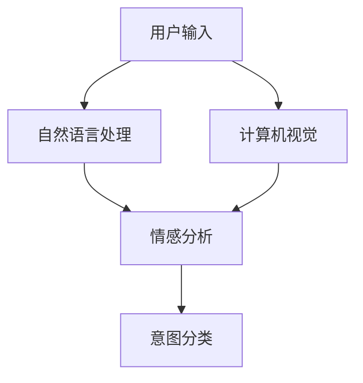

                 

# 融合AI大模型的用户意图识别技术

> 关键词：用户意图识别, AI大模型, 深度学习, 自然语言处理, 多模态融合, 情感分析, 意图分类

## 1. 背景介绍

### 1.1 问题由来

随着互联网和移动互联网的普及，用户的在线行为日益多元化，如何理解用户背后的意图，成为企业个性化推荐、智能客服、舆情监测等领域亟需解决的重要问题。传统的意图识别方法依赖于人工规则或简单统计模型，往往无法全面捕捉用户行为背后的复杂语义信息，也无法从多模态数据中挖掘用户的深层次需求。而近年来兴起的深度学习技术，特别是基于大模型的用户意图识别方法，因其卓越的泛化能力和强大的语义理解能力，已经在诸多场景下取得了显著成效。

然而，大模型尽管在处理大规模数据时表现出色，但其在高维空间中的学习过程容易受到数据噪音的干扰，导致在特定小规模数据集上的泛化性能不佳。因此，如何将大模型的泛化能力和数据集的信息紧密结合起来，成为当前学术界和工业界共同面临的挑战。

### 1.2 问题核心关键点

为了更好地解决用户意图识别问题，本节将介绍以下几个核心关键点：

- **用户意图识别(User Intent Recognition)**：指理解用户通过输入（文本、语音、图像等）表达的需求，并从中抽取用户意图的过程。
- **AI大模型(AI Large Models)**：以Transformer结构为代表的深度学习模型，通过在大规模数据上进行预训练，学习到丰富的语言和图像知识，具有强大的语义表示和生成能力。
- **多模态融合(Multimodal Fusion)**：指将不同模态（如文本、图像、语音等）的信息结合起来，以提升用户意图识别的准确性。
- **情感分析(Sentiment Analysis)**：指对用户表达的情感进行识别，以辅助判断用户的真实意图。
- **意图分类(Intent Classification)**：指将用户意图映射到预先定义的意图类别中，如购物、查询、投诉等。

这些关键点之间存在紧密的联系，共同构成了用户意图识别的完整技术栈。通过理解这些核心概念，我们可以更好地把握意图识别的工作原理和优化方向。

## 2. 核心概念与联系

### 2.1 核心概念概述

为了更好地理解用户意图识别技术，本节将介绍几个核心概念及其之间的关系。

- **用户意图识别**：指通过自然语言处理(NLP)、计算机视觉(CV)等技术，从用户输入中抽取用户意图的过程。
- **AI大模型**：指在大规模无标签数据上进行预训练，学习到通用语言和图像知识的深度学习模型，如BERT、GPT、ResNet等。
- **多模态融合**：指将不同模态的数据信息进行有效结合，提升意图识别的准确性。
- **情感分析**：指对用户输入的情感进行判断，以辅助意图识别的决策。
- **意图分类**：指将用户意图映射到预定义的意图类别中，如购物、查询、投诉等。

这些概念之间的关系可以通过以下Mermaid流程图来展示：



这个流程图展示了大模型在用户意图识别过程中的作用：

1. 用户输入可以是文本、图像或语音等多种形式。
2. 自然语言处理(NLP)和计算机视觉(CV)对不同模态的数据进行预处理，提取特征。
3. 情感分析用于判断用户输入的情感倾向，辅助意图识别。
4. 意图分类将用户输入映射到预定义的意图类别中。

## 3. 核心算法原理 & 具体操作步骤

### 3.1 算法原理概述

基于AI大模型的用户意图识别方法，主要包括以下几个步骤：

1. **数据准备**：收集并标注用户意图识别所需的数据集，包括文本、图像、语音等。
2. **模型预训练**：使用大规模无标签数据对AI大模型进行预训练，学习到通用的语言和图像知识。
3. **数据增强**：通过回译、正则化、对抗样本等手段扩充训练数据，提升模型的泛化能力。
4. **模型微调**：在标注数据集上对预训练模型进行微调，使其适应特定的意图识别任务。
5. **多模态融合**：将不同模态的信息进行有效融合，提升模型的理解能力和泛化性能。
6. **情感分析**：通过情感分析技术判断用户输入的情感倾向，辅助意图识别的决策。
7. **意图分类**：使用分类器对用户输入进行意图分类，输出最终的意图识别结果。

### 3.2 算法步骤详解

#### 3.2.1 数据准备

数据准备是用户意图识别过程的第一步，主要包括以下几个环节：

1. **数据收集**：从网站、社交媒体、客服系统等渠道收集用户输入的数据，包括文本、图像、语音等。
2. **数据标注**：对收集到的数据进行标注，生成训练集和验证集。标注内容可以包括意图类别、情感倾向等。
3. **数据清洗**：去除噪声数据和异常数据，确保数据集的质量。

#### 3.2.2 模型预训练

模型预训练是利用大规模无标签数据对AI大模型进行训练，学习到通用的语言和图像知识。预训练的目的是提高模型的泛化能力和迁移能力，使其能够更好地适应新的任务。

#### 3.2.3 数据增强

数据增强是通过对训练数据进行一定的处理，扩充训练集，提升模型的泛化能力和鲁棒性。常用的数据增强方法包括：

1. **回译**：将文本数据进行回译，生成新的样本。
2. **正则化**：使用L2正则、Dropout等方法抑制过拟合。
3. **对抗样本**：引入对抗样本，提高模型的鲁棒性。

#### 3.2.4 模型微调

模型微调是在预训练模型的基础上，使用标注数据集对模型进行有监督的优化。微调的目的是使模型在特定意图识别任务上表现更好。微调过程通常包括：

1. **选择合适的优化器**：如AdamW、SGD等。
2. **设置学习率**：通常需要比预训练时更小，以免破坏预训练权重。
3. **设计损失函数**：根据任务类型设计合适的损失函数。
4. **添加正则化技术**：如L2正则、Dropout等。
5. **设置冻结层**：根据任务复杂度，决定哪些层需要冻结，哪些层需要微调。

#### 3.2.5 多模态融合

多模态融合是将不同模态的信息进行有效结合，提升意图识别的准确性。常用的多模态融合方法包括：

1. **特征拼接**：将不同模态的特征进行拼接，再输入到模型中。
2. **注意力机制**：通过注意力机制，对不同模态的信息进行加权融合。
3. **级联网络**：将多个网络级联，每个网络处理一种模态的信息，最终输出综合结果。

#### 3.2.6 情感分析

情感分析是通过对用户输入的情感进行判断，辅助意图识别的决策。常用的情感分析方法包括：

1. **情感词典**：使用情感词典判断文本情感。
2. **情感分类**：使用情感分类器对文本情感进行分类。
3. **深度学习模型**：使用预训练的情感分析模型，如BERT-Emo，对文本情感进行判断。

#### 3.2.7 意图分类

意图分类是将用户输入映射到预定义的意图类别中。常用的意图分类方法包括：

1. **分类器**：使用传统的机器学习分类器，如SVM、随机森林等。
2. **深度学习模型**：使用预训练的意图分类模型，如BERT-Intent，对用户输入进行分类。

### 3.3 算法优缺点

#### 3.3.1 优点

1. **泛化能力强**：利用大模型的预训练能力，在少量标注数据下也能取得不错的性能。
2. **适应性强**：能够适应多种不同的模态数据，如文本、图像、语音等。
3. **准确率高**：深度学习模型在复杂语义理解上表现出色，准确率高。
4. **可扩展性**：大模型可以通过微调进行扩展，适应不同的意图识别任务。

#### 3.3.2 缺点

1. **数据依赖性高**：依赖标注数据，标注成本高。
2. **模型复杂度大**：大模型参数量巨大，训练和推理成本高。
3. **解释性差**：深度学习模型黑箱性强，难以解释推理过程。
4. **泛化风险高**：在大规模无标签数据上进行预训练，可能学习到噪声信息，影响泛化性能。

### 3.4 算法应用领域

基于AI大模型的用户意图识别方法，已经广泛应用于以下领域：

1. **智能客服系统**：通过意图识别，实现自动分派和响应。
2. **个性化推荐系统**：根据用户意图，推荐相关商品或内容。
3. **舆情监测系统**：对社交媒体等渠道的用户输入进行分析，判断情感倾向和意图。
4. **智能家居系统**：通过语音识别和意图识别，控制家电设备。
5. **医疗问诊系统**：对患者的医疗咨询进行分析，判断疾病和需求。
6. **金融理财系统**：根据用户的金融需求，进行个性化的理财建议。

## 4. 数学模型和公式 & 详细讲解 & 举例说明

### 4.1 数学模型构建

为了更好地理解用户意图识别技术，本节将使用数学语言对意图识别的数学模型进行严格刻画。

假设用户输入为 $x$，包含文本、图像、语音等多种形式，模型的预训练参数为 $\theta$。用户意图的标注为 $y \in \{1,2,\ldots,K\}$，其中 $K$ 为意图类别数。意图识别的目标是通过训练模型 $M_{\theta}$，使得在输入 $x$ 下，输出 $y$ 的概率最大化：

$$
\arg\max_y p(y|x) = \arg\max_y \frac{p(y|x; \theta)}{p(x; \theta)}
$$

其中 $p(y|x; \theta)$ 为条件概率，可以通过模型 $M_{\theta}$ 计算得到。$p(x; \theta)$ 为先验概率，可以通过数据分布统计得到。

### 4.2 公式推导过程

#### 4.2.1 条件概率模型

假设我们有一个简单线性分类器，模型的输出为 $s(x; \theta) = W^T x + b$，其中 $W$ 为权重矩阵，$b$ 为偏置项。模型的输出经过Softmax函数映射到概率分布 $p(y|x; \theta)$：

$$
p(y|x; \theta) = \frac{\exp(s(x; \theta)^T y)}{\sum_{k=1}^K \exp(s(x; \theta)^T k)}
$$

其中 $y$ 为类别标签，$K$ 为类别数。

#### 4.2.2 目标函数

为了最大化条件概率 $p(y|x; \theta)$，我们需要最小化损失函数 $L(y; \theta)$，即：

$$
L(y; \theta) = -\log p(y|x; \theta)
$$

通过梯度下降等优化算法，不断更新模型参数 $\theta$，最小化损失函数，使得模型的预测结果与真实标签尽可能接近。

### 4.3 案例分析与讲解

#### 4.3.1 情感分析

情感分析可以通过情感词典、情感分类器、深度学习模型等方法实现。这里以BERT-Emo为例，对用户输入进行情感分析：

1. **情感词典**：定义正面情感和负面情感的词汇表，通过计算用户输入中正面词汇和负面词汇的数量，判断情感倾向。
2. **情感分类器**：使用预训练的情感分类模型，对用户输入进行情感分类。
3. **深度学习模型**：使用BERT-Emo模型，对用户输入进行情感分析，输出情感类别。

#### 4.3.2 意图分类

意图分类可以通过传统的机器学习分类器、深度学习模型等方法实现。这里以BERT-Intent为例，对用户输入进行意图分类：

1. **机器学习分类器**：使用SVM、随机森林等算法对用户输入进行分类。
2. **深度学习模型**：使用预训练的BERT-Intent模型，对用户输入进行分类，输出意图类别。

## 5. 项目实践：代码实例和详细解释说明

### 5.1 开发环境搭建

在进行意图识别项目开发前，我们需要准备好开发环境。以下是使用Python进行PyTorch开发的环境配置流程：

1. 安装Anaconda：从官网下载并安装Anaconda，用于创建独立的Python环境。

2. 创建并激活虚拟环境：
```bash
conda create -n intent-env python=3.8 
conda activate intent-env
```

3. 安装PyTorch：根据CUDA版本，从官网获取对应的安装命令。例如：
```bash
conda install pytorch torchvision torchaudio cudatoolkit=11.1 -c pytorch -c conda-forge
```

4. 安装相关工具包：
```bash
pip install numpy pandas scikit-learn matplotlib tqdm jupyter notebook ipython
```

完成上述步骤后，即可在`intent-env`环境中开始意图识别项目开发。

### 5.2 源代码详细实现

这里我们以BERT-Intent模型为例，给出用户意图识别的完整代码实现。

首先，定义数据处理函数：

```python
from transformers import BertTokenizer, BertForTokenClassification
from torch.utils.data import Dataset
import torch

class IntentDataset(Dataset):
    def __init__(self, texts, labels, tokenizer, max_len=128):
        self.texts = texts
        self.labels = labels
        self.tokenizer = tokenizer
        self.max_len = max_len
        
    def __len__(self):
        return len(self.texts)
    
    def __getitem__(self, item):
        text = self.texts[item]
        labels = self.labels[item]
        
        encoding = self.tokenizer(text, return_tensors='pt', max_length=self.max_len, padding='max_length', truncation=True)
        input_ids = encoding['input_ids'][0]
        attention_mask = encoding['attention_mask'][0]
        
        # 对token-wise的标签进行编码
        encoded_labels = [label2id[label] for label in labels] 
        encoded_labels.extend([label2id['O']] * (self.max_len - len(encoded_labels)))
        labels = torch.tensor(encoded_labels, dtype=torch.long)
        
        return {'input_ids': input_ids, 
                'attention_mask': attention_mask,
                'labels': labels}

# 标签与id的映射
label2id = {'O': 0, 'B-PER': 1, 'I-PER': 2, 'B-LOC': 3, 'I-LOC': 4, 'B-ORG': 5, 'I-ORG': 6, 'B-PAR': 7, 'I-PAR': 8, 'B-NEW': 9, 'I-NEW': 10}
id2label = {v: k for k, v in label2id.items()}

# 创建dataset
tokenizer = BertTokenizer.from_pretrained('bert-base-cased')

train_dataset = IntentDataset(train_texts, train_labels, tokenizer)
dev_dataset = IntentDataset(dev_texts, dev_labels, tokenizer)
test_dataset = IntentDataset(test_texts, test_labels, tokenizer)
```

然后，定义模型和优化器：

```python
from transformers import BertForTokenClassification, AdamW

model = BertForTokenClassification.from_pretrained('bert-base-cased', num_labels=len(label2id))

optimizer = AdamW(model.parameters(), lr=2e-5)
```

接着，定义训练和评估函数：

```python
from torch.utils.data import DataLoader
from tqdm import tqdm
from sklearn.metrics import classification_report

device = torch.device('cuda') if torch.cuda.is_available() else torch.device('cpu')
model.to(device)

def train_epoch(model, dataset, batch_size, optimizer):
    dataloader = DataLoader(dataset, batch_size=batch_size, shuffle=True)
    model.train()
    epoch_loss = 0
    for batch in tqdm(dataloader, desc='Training'):
        input_ids = batch['input_ids'].to(device)
        attention_mask = batch['attention_mask'].to(device)
        labels = batch['labels'].to(device)
        model.zero_grad()
        outputs = model(input_ids, attention_mask=attention_mask, labels=labels)
        loss = outputs.loss
        epoch_loss += loss.item()
        loss.backward()
        optimizer.step()
    return epoch_loss / len(dataloader)

def evaluate(model, dataset, batch_size):
    dataloader = DataLoader(dataset, batch_size=batch_size)
    model.eval()
    preds, labels = [], []
    with torch.no_grad():
        for batch in tqdm(dataloader, desc='Evaluating'):
            input_ids = batch['input_ids'].to(device)
            attention_mask = batch['attention_mask'].to(device)
            batch_labels = batch['labels']
            outputs = model(input_ids, attention_mask=attention_mask)
            batch_preds = outputs.logits.argmax(dim=2).to('cpu').tolist()
            batch_labels = batch_labels.to('cpu').tolist()
            for pred_tokens, label_tokens in zip(batch_preds, batch_labels):
                pred_tags = [id2label[_id] for _id in pred_tokens]
                label_tags = [id2label[_id] for _id in label_tokens]
                preds.append(pred_tags[:len(label_tokens)])
                labels.append(label_tags)
                
    print(classification_report(labels, preds))
```

最后，启动训练流程并在测试集上评估：

```python
epochs = 5
batch_size = 16

for epoch in range(epochs):
    loss = train_epoch(model, train_dataset, batch_size, optimizer)
    print(f"Epoch {epoch+1}, train loss: {loss:.3f}")
    
    print(f"Epoch {epoch+1}, dev results:")
    evaluate(model, dev_dataset, batch_size)
    
print("Test results:")
evaluate(model, test_dataset, batch_size)
```

以上就是使用PyTorch对BERT-Intent模型进行用户意图识别的完整代码实现。可以看到，得益于Transformers库的强大封装，我们可以用相对简洁的代码完成BERT-Intent模型的加载和训练。

### 5.3 代码解读与分析

让我们再详细解读一下关键代码的实现细节：

**IntentDataset类**：
- `__init__`方法：初始化文本、标签、分词器等关键组件。
- `__len__`方法：返回数据集的样本数量。
- `__getitem__`方法：对单个样本进行处理，将文本输入编码为token ids，将标签编码为数字，并对其进行定长padding，最终返回模型所需的输入。

**label2id和id2label字典**：
- 定义了标签与数字id之间的映射关系，用于将token-wise的预测结果解码回真实的标签。

**训练和评估函数**：
- 使用PyTorch的DataLoader对数据集进行批次化加载，供模型训练和推理使用。
- 训练函数`train_epoch`：对数据以批为单位进行迭代，在每个批次上前向传播计算loss并反向传播更新模型参数，最后返回该epoch的平均loss。
- 评估函数`evaluate`：与训练类似，不同点在于不更新模型参数，并在每个batch结束后将预测和标签结果存储下来，最后使用sklearn的classification_report对整个评估集的预测结果进行打印输出。

**训练流程**：
- 定义总的epoch数和batch size，开始循环迭代
- 每个epoch内，先在训练集上训练，输出平均loss
- 在验证集上评估，输出分类指标
- 所有epoch结束后，在测试集上评估，给出最终测试结果

可以看到，PyTorch配合Transformers库使得BERT-Intent模型的加载和微调代码实现变得简洁高效。开发者可以将更多精力放在数据处理、模型改进等高层逻辑上，而不必过多关注底层的实现细节。

当然，工业级的系统实现还需考虑更多因素，如模型的保存和部署、超参数的自动搜索、更灵活的任务适配层等。但核心的微调范式基本与此类似。

## 6. 实际应用场景
### 6.1 智能客服系统

基于大模型微调的意图识别技术，可以广泛应用于智能客服系统的构建。传统客服往往需要配备大量人力，高峰期响应缓慢，且一致性和专业性难以保证。而使用意图识别技术，可以7x24小时不间断服务，快速响应客户咨询，用自然流畅的语言解答各类常见问题。

在技术实现上，可以收集企业内部的历史客服对话记录，将问题和最佳答复构建成监督数据，在此基础上对预训练意图识别模型进行微调。微调后的意图识别模型能够自动理解用户意图，匹配最合适的答案模板进行回复。对于客户提出的新问题，还可以接入检索系统实时搜索相关内容，动态组织生成回答。如此构建的智能客服系统，能大幅提升客户咨询体验和问题解决效率。

### 6.2 个性化推荐系统

当前的推荐系统往往只依赖用户的历史行为数据进行物品推荐，无法深入理解用户的真实兴趣偏好。基于大模型意图识别的个性化推荐系统可以更好地挖掘用户行为背后的语义信息，从而提供更精准、多样的推荐内容。

在实践中，可以收集用户浏览、点击、评论、分享等行为数据，提取和用户交互的物品标题、描述、标签等文本内容。将文本内容作为模型输入，用户的后续行为（如是否点击、购买等）作为监督信号，在此基础上微调预训练意图识别模型。微调后的模型能够从文本内容中准确把握用户的兴趣点。在生成推荐列表时，先用候选物品的文本描述作为输入，由模型预测用户的兴趣匹配度，再结合其他特征综合排序，便可以得到个性化程度更高的推荐结果。

### 6.3 舆情监测系统

金融机构需要实时监测市场舆论动向，以便及时应对负面信息传播，规避金融风险。传统的人工监测方式成本高、效率低，难以应对网络时代海量信息爆发的挑战。基于大模型意图识别的舆情监测系统，可以为金融机构提供实时监控，快速响应舆情变化，降低金融风险。

具体而言，可以收集金融领域相关的新闻、报道、评论等文本数据，并对其进行情感标注。在此基础上对预训练语言模型进行微调，使其能够自动判断文本属于何种情感倾向，情感倾向为正面、中性还是负面。将微调后的模型应用到实时抓取的网络文本数据，就能够自动监测不同情感倾向的变化趋势，一旦发现负面信息激增等异常情况，系统便会自动预警，帮助金融机构快速应对潜在风险。

### 6.4 未来应用展望

随着大模型和意图识别方法的不断发展，基于微调范式将在更多领域得到应用，为传统行业带来变革性影响。

在智慧医疗领域，基于意图识别的医疗问答、病历分析、药物研发等应用将提升医疗服务的智能化水平，辅助医生诊疗，加速新药开发进程。

在智能教育领域，意图识别技术可应用于作业批改、学情分析、知识推荐等方面，因材施教，促进教育公平，提高教学质量。

在智慧城市治理中，意图识别技术可应用于城市事件监测、舆情分析、应急指挥等环节，提高城市管理的自动化和智能化水平，构建更安全、高效的未来城市。

此外，在企业生产、社会治理、文娱传媒等众多领域，基于大模型意图识别的AI应用也将不断涌现，为经济社会发展注入新的动力。相信随着技术的日益成熟，意图识别技术将成为人工智能落地应用的重要范式，推动人工智能技术在垂直行业的规模化落地。

## 7. 工具和资源推荐
### 7.1 学习资源推荐

为了帮助开发者系统掌握大模型意图识别理论基础和实践技巧，这里推荐一些优质的学习资源：

1. 《Transformer从原理到实践》系列博文：由大模型技术专家撰写，深入浅出地介绍了Transformer原理、BERT模型、意图识别技术等前沿话题。

2. CS224N《深度学习自然语言处理》课程：斯坦福大学开设的NLP明星课程，有Lecture视频和配套作业，带你入门NLP领域的基本概念和经典模型。

3. 《Natural Language Processing with Transformers》书籍：Transformers库的作者所著，全面介绍了如何使用Transformers库进行NLP任务开发，包括意图识别在内的诸多范式。

4. HuggingFace官方文档：Transformers库的官方文档，提供了海量预训练模型和完整的意图识别样例代码，是上手实践的必备资料。

5. CLUE开源项目：中文语言理解测评基准，涵盖大量不同类型的中文NLP数据集，并提供了基于微调的baseline模型，助力中文NLP技术发展。

通过对这些资源的学习实践，相信你一定能够快速掌握大模型意图识别的精髓，并用于解决实际的NLP问题。
### 7.2 开发工具推荐

高效的开发离不开优秀的工具支持。以下是几款用于大模型意图识别开发的常用工具：

1. PyTorch：基于Python的开源深度学习框架，灵活动态的计算图，适合快速迭代研究。大部分预训练语言模型都有PyTorch版本的实现。

2. TensorFlow：由Google主导开发的开源深度学习框架，生产部署方便，适合大规模工程应用。同样有丰富的预训练语言模型资源。

3. Transformers库：HuggingFace开发的NLP工具库，集成了众多SOTA语言模型，支持PyTorch和TensorFlow，是进行意图识别任务开发的利器。

4. Weights & Biases：模型训练的实验跟踪工具，可以记录和可视化模型训练过程中的各项指标，方便对比和调优。与主流深度学习框架无缝集成。

5. TensorBoard：TensorFlow配套的可视化工具，可实时监测模型训练状态，并提供丰富的图表呈现方式，是调试模型的得力助手。

6. Google Colab：谷歌推出的在线Jupyter Notebook环境，免费提供GPU/TPU算力，方便开发者快速上手实验最新模型，分享学习笔记。

合理利用这些工具，可以显著提升大模型意图识别的开发效率，加快创新迭代的步伐。

### 7.3 相关论文推荐

大模型意图识别技术的发展源于学界的持续研究。以下是几篇奠基性的相关论文，推荐阅读：

1. Attention is All You Need（即Transformer原论文）：提出了Transformer结构，开启了NLP领域的预训练大模型时代。

2. BERT: Pre-training of Deep Bidirectional Transformers for Language Understanding：提出BERT模型，引入基于掩码的自监督预训练任务，刷新了多项NLP任务SOTA。

3. Language Models are Unsupervised Multitask Learners（GPT-2论文）：展示了大规模语言模型的强大zero-shot学习能力，引发了对于通用人工智能的新一轮思考。

4. Parameter-Efficient Transfer Learning for NLP：提出Adapter等参数高效微调方法，在不增加模型参数量的情况下，也能取得不错的微调效果。

5. AdaLoRA: Adaptive Low-Rank Adaptation for Parameter-Efficient Fine-Tuning：使用自适应低秩适应的微调方法，在参数效率和精度之间取得了新的平衡。

这些论文代表了大模型意图识别技术的发展脉络。通过学习这些前沿成果，可以帮助研究者把握学科前进方向，激发更多的创新灵感。

## 8. 总结：未来发展趋势与挑战

### 8.1 总结

本文对基于AI大模型的用户意图识别方法进行了全面系统的介绍。首先阐述了意图识别的研究背景和意义，明确了意图识别的工作原理和优化方向。其次，从原理到实践，详细讲解了意图识别的数学原理和关键步骤，给出了意图识别任务开发的完整代码实例。同时，本文还广泛探讨了意图识别方法在智能客服、个性化推荐、舆情监测等多个行业领域的应用前景，展示了意图识别技术的巨大潜力。此外，本文精选了意图识别技术的各类学习资源，力求为读者提供全方位的技术指引。

通过本文的系统梳理，可以看到，基于大模型的意图识别方法正在成为NLP领域的重要范式，极大地拓展了预训练语言模型的应用边界，催生了更多的落地场景。受益于大规模语料的预训练，意图识别模型以更低的时间和标注成本，在小样本条件下也能取得不俗的效果，有力推动了NLP技术的产业化进程。未来，伴随预训练语言模型和意图识别方法的持续演进，相信NLP技术将在更广阔的应用领域大放异彩，深刻影响人类的生产生活方式。

### 8.2 未来发展趋势

展望未来，意图识别技术将呈现以下几个发展趋势：

1. **模型规模持续增大**：随着算力成本的下降和数据规模的扩张，预训练语言模型的参数量还将持续增长。超大批次的训练和推理也将成为可能。

2. **多模态融合技术提升**：未来将涌现更多多模态融合技术，如特征拼接、注意力机制、级联网络等，提升意图识别的准确性。

3. **深度学习模型的鲁棒性增强**：通过引入对抗训练、正则化等技术，提高模型的鲁棒性和泛化能力。

4. **解释性技术的发展**：引入可解释性技术，如因果推断、逻辑规则等，增强意图识别模型的可解释性。

5. **跨领域迁移能力提升**：通过迁移学习、多任务学习等方法，提升意图识别模型的跨领域迁移能力。

6. **个性化推荐系统的发展**：基于意图识别的个性化推荐系统将不断发展，提升推荐系统的个性化程度和用户满意度。

以上趋势凸显了意图识别技术的广阔前景。这些方向的探索发展，必将进一步提升意图识别模型的性能和应用范围，为人工智能技术在垂直行业的规模化落地提供新的动力。

### 8.3 面临的挑战

尽管大模型意图识别技术已经取得了瞩目成就，但在迈向更加智能化、普适化应用的过程中，它仍面临着诸多挑战：

1. **数据依赖性高**：依赖标注数据，标注成本高。

2. **模型复杂度高**：大模型参数量巨大，训练和推理成本高。

3. **解释性差**：深度学习模型黑箱性强，难以解释推理过程。

4. **泛化风险高**：在大规模无标签数据上进行预训练，可能学习到噪声信息，影响泛化性能。

5. **实时性不足**：虽然训练效果较好，但推理速度较慢，无法满足实时性要求。

6. **安全风险**：模型可能学习到有偏见、有害的信息，输出恶意内容。

7. **跨领域适应能力不足**：对于特定领域的数据，模型可能难以适应。

正视意图识别面临的这些挑战，积极应对并寻求突破，将是大模型意图识别技术走向成熟的必由之路。相信随着学界和产业界的共同努力，这些挑战终将一一被克服，意图识别技术必将在构建人机协同的智能系统中部署应用。

### 8.4 研究展望

面对意图识别面临的挑战，未来的研究需要在以下几个方面寻求新的突破：

1. **探索无监督和半监督意图识别方法**：摆脱对大规模标注数据的依赖，利用自监督学习、主动学习等无监督和半监督范式，最大限度利用非结构化数据，实现更加灵活高效的意图识别。

2. **研究参数高效和计算高效的意图识别方法**：开发更加参数高效的意图识别方法，在固定大部分预训练参数的情况下，只更新极少量的任务相关参数。同时优化意图识别模型的计算图，减少前向传播和反向传播的资源消耗，实现更加轻量级、实时性的部署。

3. **融合因果和对比学习范式**：通过引入因果推断和对比学习思想，增强意图识别模型建立稳定因果关系的能力，学习更加普适、鲁棒的语言表征，从而提升模型泛化性和抗干扰能力。

4. **引入更多先验知识**：将符号化的先验知识，如知识图谱、逻辑规则等，与神经网络模型进行巧妙融合，引导意图识别过程学习更准确、合理的语言模型。同时加强不同模态数据的整合，实现视觉、语音等多模态信息与文本信息的协同建模。

5. **结合因果分析和博弈论工具**：将因果分析方法引入意图识别模型，识别出模型决策的关键特征，增强输出解释的因果性和逻辑性。借助博弈论工具刻画人机交互过程，主动探索并规避模型的脆弱点，提高系统稳定性。

6. **纳入伦理道德约束**：在模型训练目标中引入伦理导向的评估指标，过滤和惩罚有偏见、有害的输出倾向。同时加强人工干预和审核，建立模型行为的监管机制，确保输出符合人类价值观和伦理道德。

这些研究方向的探索，必将引领大模型意图识别技术迈向更高的台阶，为构建安全、可靠、可解释、可控的智能系统铺平道路。面向未来，大模型意图识别技术还需要与其他人工智能技术进行更深入的融合，如知识表示、因果推理、强化学习等，多路径协同发力，共同推动自然语言理解和智能交互系统的进步。只有勇于创新、敢于突破，才能不断拓展意图识别模型的边界，让智能技术更好地造福人类社会。

## 9. 附录：常见问题与解答

**Q1：如何缓解意图识别模型中的过拟合问题？**

A: 过拟合是意图识别模型面临的主要挑战之一。缓解过拟合问题的方法包括：

1. **数据增强**：通过回译、正则化、对抗样本等手段扩充训练数据，提升模型的泛化能力。
2. **正则化**：使用L2正则、Dropout等方法抑制过拟合。
3. **早停策略**：设置早停策略，当验证集上的性能不再提升时，停止训练。
4. **模型压缩**：使用知识蒸馏、剪枝等技术，减少模型参数量，提升泛化能力。

**Q2：如何提高意图识别模型的实时性？**

A: 意图识别模型在推理时往往较慢，无法满足实时性要求。提高实时性的方法包括：

1. **模型裁剪**：去除不必要的层和参数，减小模型尺寸，加快推理速度。
2. **量化加速**：将浮点模型转为定点模型，压缩存储空间，提高计算效率。
3. **模型并行**：使用模型并行技术，将模型分解成多个部分，并行计算。
4. **推理优化**：使用推理优化技术，如剪枝、量化等，提升推理效率。

**Q3：意图识别模型如何处理多模态数据？**

A: 意图识别模型可以处理多种模态的数据，如文本、图像、语音等。处理多模态数据的方法包括：

1. **特征拼接**：将不同模态的特征进行拼接，再输入到模型中。
2. **注意力机制**：通过注意力机制，对不同模态的信息进行加权融合。
3. **级联网络**：将多个网络级联，每个网络处理一种模态的信息，最终输出综合结果。

**Q4：意图识别模型如何引入因果推断？**

A: 因果推断可以帮助意图识别模型建立稳定因果关系，提升模型的泛化性和鲁棒性。引入因果推断的方法包括：

1. **因果推断模型**：使用因果推断模型，如GPS、TCG等，辅助意图识别模型的训练。
2. **因果分析工具**：使用因果分析工具，如GPT-Neo、CausalLM等，增强意图识别模型的推理能力。

**Q5：意图识别模型如何结合博弈论工具？**

A: 博弈论工具可以帮助意图识别模型刻画人机交互过程，主动探索并规避模型的脆弱点，提高系统稳定性。结合博弈论工具的方法包括：

1. **博弈论模型**：使用博弈论模型，如Nash均衡、纳什最优策略等，辅助意图识别模型的训练。
2. **博弈论分析**：使用博弈论分析工具，如Nash求解器、EVaMoR等，优化意图识别模型的决策策略。

通过以上方法的引入，意图识别模型可以更好地处理多模态数据、引入因果推断和博弈论工具，提升模型的解释性和稳定性，更好地服务于实际应用。

---

作者：禅与计算机程序设计艺术 / Zen and the Art of Computer Programming

