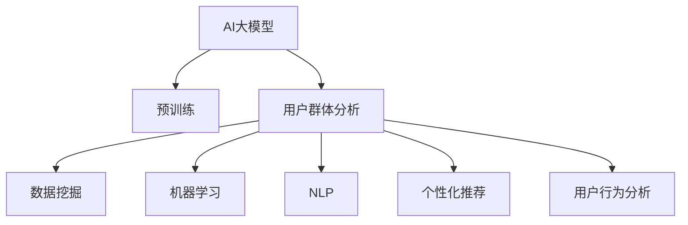

                 

# 融合AI大模型的用户群体分析技术

> 关键词：用户群体分析, AI大模型, 机器学习, 数据挖掘, 自然语言处理, 个性化推荐, 用户行为分析

## 1. 背景介绍

在数字化和智能化飞速发展的今天，用户群体分析已经成为企业和组织获取竞争优势的关键。通过对用户群体行为、偏好、需求的深入理解，企业可以更精准地进行市场定位、产品设计和推广策略制定，从而提升用户体验和业务盈利能力。然而，传统的数据分析方法往往面临数据多样性高、信息不完整、动态性强的挑战，难以充分挖掘用户群体的隐性需求和潜在价值。

随着人工智能技术和大数据技术的日益成熟，融合AI大模型的用户群体分析技术应运而生。利用AI大模型强大的数据处理能力和泛化能力，企业可以高效地从海量用户数据中提取有价值的洞察，实现对用户群体的精确分析和个性化推荐。本文将详细探讨这一技术的原理、算法、实践方法和应用前景。

## 2. 核心概念与联系

### 2.1 核心概念概述

为更好地理解融合AI大模型的用户群体分析技术，本节将介绍几个密切相关的核心概念：

- **AI大模型**：以自回归(如GPT)或自编码(如BERT)模型为代表的大规模预训练语言模型。通过在大规模无标签文本语料上进行预训练，学习通用的语言知识和常识，具备强大的语言理解和生成能力。

- **用户群体分析**：通过对用户群体行为、偏好、需求的分析，揭示用户群体的潜在需求和隐性价值，为市场细分、产品推荐、客户服务等领域提供数据驱动的决策支持。

- **数据挖掘**：从大量数据中提取出隐含的有价值信息或知识的过程，旨在发现数据背后的规律和趋势。

- **机器学习**：通过算法和模型对数据进行训练，使得机器能够从数据中学习并做出预测或决策，应用范围广泛，涉及分类、回归、聚类等多个领域。

- **自然语言处理(NLP)**：研究计算机如何处理、理解人类语言的技术，涵盖文本分析、语音识别、情感分析等多个子领域。

- **个性化推荐**：根据用户的历史行为和兴趣，通过算法推荐符合用户需求的个性化产品或内容，提升用户体验和满意度。

- **用户行为分析**：分析用户在特定场景下的行为模式，揭示用户的意图和需求，为产品设计、用户画像建立提供依据。

这些核心概念之间的逻辑关系可以通过以下Mermaid流程图来展示：



这个流程图展示了大模型与用户群体分析各关键概念之间的关系：

1. AI大模型通过预训练获得基础能力。
2. 用户群体分析是基于AI大模型的高级应用，通过学习用户行为数据，发现用户需求和趋势。
3. 数据挖掘是从原始数据中提取有价值信息的过程，是用户群体分析的数据基础。
4. 机器学习是数据挖掘和用户群体分析的算法支撑，通过训练模型学习用户行为规律。
5. NLP是用户群体分析在文本数据处理上的具体应用，如情感分析、文本分类等。
6. 个性化推荐是用户群体分析的重要应用方向，通过模型推荐符合用户需求的内容。
7. 用户行为分析则是用户群体分析的重要组成部分，从用户的线上和线下行为中提取洞察。

这些核心概念共同构成了融合AI大模型的用户群体分析技术框架，使其能够高效、准确地分析用户群体，提供个性化服务。

## 3. 核心算法原理 & 具体操作步骤
### 3.1 算法原理概述

融合AI大模型的用户群体分析技术，本质上是一种基于数据挖掘和机器学习的用户行为分析方法。其核心思想是：利用AI大模型强大的语言理解和生成能力，从用户的行为数据中提取有价值的信息，分析用户群体特征，预测用户行为，实现个性化推荐。

形式化地，假设用户行为数据为 $\mathcal{D}$，AI大模型为 $M_{\theta}$，其中 $\theta$ 为预训练得到的模型参数。用户群体分析的目标是构建模型 $f_{\theta}(x)$，对任意用户行为数据 $x \in \mathcal{D}$，输出其对应的用户群体标签 $y \in \{C_1, C_2, \cdots, C_n\}$，其中 $C_i$ 表示第 $i$ 个用户群体。

通过梯度下降等优化算法，用户群体分析过程不断更新模型参数 $\theta$，最小化损失函数 $\mathcal{L}(y, f_{\theta}(x))$，使得模型输出逼近真实标签 $y$。由于 $\theta$ 已经通过预训练获得了较强的泛化能力，因此即便在标注数据量较小的情况下，也能较好地预测用户群体。

### 3.2 算法步骤详解

融合AI大模型的用户群体分析一般包括以下几个关键步骤：

**Step 1: 数据收集与预处理**
- 收集用户行为数据 $\mathcal{D}$，涵盖点击、浏览、购买、评论等多种行为。
- 清洗数据，去除噪声、缺失值和异常值，提升数据质量。
- 对文本数据进行分词、向量化等预处理，便于模型理解。

**Step 2: 特征工程**
- 利用自然语言处理技术，提取用户行为文本中的关键特征，如情感倾向、主题分类等。
- 对非文本数据进行特征提取，如时间特征、地理位置等。
- 设计合适的特征组合方式，增强特征表达能力。

**Step 3: 模型训练**
- 选择合适的机器学习算法，如逻辑回归、支持向量机、神经网络等。
- 将预处理后的数据集划分为训练集、验证集和测试集。
- 使用AI大模型进行特征嵌入，提升模型表达能力。
- 在训练集上训练模型，根据验证集性能调整超参数，选择最佳模型。

**Step 4: 模型评估与优化**
- 在测试集上评估模型性能，如准确率、召回率、F1-score等指标。
- 根据评估结果，调整模型参数或特征工程策略，进一步提升模型效果。

**Step 5: 应用与迭代**
- 将训练好的模型应用到实际业务场景中，如市场细分、个性化推荐、用户画像建立等。
- 定期收集新数据，重新训练模型，保持模型的时效性和适应性。

以上是融合AI大模型的用户群体分析的一般流程。在实际应用中，还需要根据具体任务的特点，对各环节进行优化设计，如改进特征工程策略，引入更多的上下文信息，搜索最优的超参数组合等，以进一步提升模型性能。

### 3.3 算法优缺点

融合AI大模型的用户群体分析方法具有以下优点：
1. 高效准确：利用大模型的强大泛化能力，能在少量标注数据下取得良好的群体分析效果。
2. 自动学习：AI大模型能自动从原始数据中提取特征，减少手动特征工程的工作量。
3. 灵活性高：适用于多种数据类型，包括文本、图像、声音等，能处理不同格式和来源的数据。
4. 鲁棒性好：AI大模型在大规模数据上的预训练，使其对数据噪声和异常值具有较强的鲁棒性。
5. 可解释性强：AI大模型通过学习得到的特征向量，可提供模型的决策依据，提高模型的可解释性。

同时，该方法也存在一定的局限性：
1. 数据需求高：高质量标注数据的获取成本较高，标注数据的质量直接影响模型的性能。
2. 模型复杂：大模型的训练和推理复杂度较高，需要高性能计算资源支持。
3. 隐私问题：用户数据的使用可能涉及隐私保护问题，需要严格的数据治理和隐私保护措施。
4. 过拟合风险：AI大模型的泛化能力有限，对特定领域或场景的适应性不足时，易出现过拟合现象。
5. 模型黑盒：AI大模型的内部机制复杂，难以解释其决策过程，导致模型不透明。

尽管存在这些局限性，但就目前而言，融合AI大模型的用户群体分析方法仍是一种高效的群体分析技术，在多个领域得到了广泛应用。

### 3.4 算法应用领域

融合AI大模型的用户群体分析方法，已经在多个领域得到了应用，例如：

- 电商推荐：根据用户浏览、购买行为，分析用户群体，推荐个性化的商品或服务。
- 社交网络分析：通过分析用户之间的互动行为，发现用户群体关系和兴趣，提升社交体验。
- 广告定向：利用用户行为数据，识别用户群体，实现更精准的广告投放。
- 用户画像建立：通过分析用户行为和背景信息，构建详细的用户画像，提升用户满意度。
- 金融风控：对客户交易数据进行分析，识别高风险用户群体，降低金融风险。
- 健康监测：通过分析用户的生活习惯和健康数据，预测用户健康风险，提供个性化健康建议。

除了上述这些经典应用外，融合AI大模型的用户群体分析方法还在更多领域得到了创新应用，如智能客服、智能家居、内容推荐等，为数据驱动的业务决策提供了强有力的支持。

## 4. 数学模型和公式 & 详细讲解
### 4.1 数学模型构建

本节将使用数学语言对融合AI大模型的用户群体分析过程进行更加严格的刻画。

假设用户行为数据为 $\mathcal{D}$，AI大模型为 $M_{\theta}$，其中 $\theta$ 为预训练得到的模型参数。用户群体分析的目标是构建模型 $f_{\theta}(x)$，对任意用户行为数据 $x \in \mathcal{D}$，输出其对应的用户群体标签 $y \in \{C_1, C_2, \cdots, C_n\}$，其中 $C_i$ 表示第 $i$ 个用户群体。

定义模型 $M_{\theta}$ 在输入 $x$ 上的输出为 $h_{\theta}(x)$，为一个 $d$ 维向量，表示模型对输入的语义表示。定义用户群体标签 $y$ 为 $y \in \{0, 1\}^n$，其中 $y_i$ 表示用户属于第 $i$ 个用户群体的概率。

用户群体分析的目标是最大化似然函数：

$$
\mathcal{L}(y|x, \theta) = \prod_{i=1}^n y_i^{f_{\theta}(x)} (1-y_i)^{1-f_{\theta}(x)}
$$

其中 $f_{\theta}(x) = \frac{p_{\theta}(x)}{\sum_{i=1}^n p_{\theta}(x)}$，表示模型对用户行为数据 $x$ 属于每个用户群体的预测概率。

通过最大化似然函数，模型能够学习到用户行为数据与群体标签之间的概率分布，从而实现群体分析。

### 4.2 公式推导过程

以下我们以情感分析任务为例，推导模型预测用户群体情感倾向的概率计算公式。

假设用户行为数据 $x$ 包含正向和负向情感的文本，AI大模型 $M_{\theta}$ 输出文本的情感向量 $h_{\theta}(x)$。为了简化问题，我们只考虑二分类任务，即正向情感（POS）和负向情感（NEG）。设 $p_{\theta}(x|POS)$ 和 $p_{\theta}(x|NEG)$ 分别为正向和负向情感的似然概率，则：

$$
f_{\theta}(x) = \frac{p_{\theta}(x|POS)}{p_{\theta}(x|POS) + p_{\theta}(x|NEG)}
$$

根据贝叶斯定理，用户群体情感倾向的概率为：

$$
p(y|x) = \frac{p(x|y) p(y)}{p(x)}
$$

其中 $p(y)$ 为用户群体 $y$ 的先验概率，$p(x)$ 为数据 $x$ 的似然概率，$p(x|y)$ 为用户群体 $y$ 的似然概率。

将 $f_{\theta}(x)$ 代入上式，得：

$$
p(y|x) = \frac{p_{\theta}(x|POS) y + p_{\theta}(x|NEG) (1-y)}{p_{\theta}(x|POS) + p_{\theta}(x|NEG)}
$$

通过最大化似然函数，模型能够学习到 $p_{\theta}(x|POS)$ 和 $p_{\theta}(x|NEG)$ 的参数，从而实现用户群体情感倾向的预测。

### 4.3 案例分析与讲解

以电商推荐系统为例，分析用户群体分析的应用。电商推荐系统通过分析用户历史浏览、购买数据，发现用户对不同商品或服务的偏好，实现个性化推荐。

假设用户群体分析模型为 $f_{\theta}(x)$，用户历史数据为 $\mathcal{D}$。模型对任意用户行为数据 $x$ 输出其对应的用户群体标签 $y \in \{C_1, C_2, \cdots, C_n\}$，其中 $C_i$ 表示第 $i$ 个用户群体。

在电商推荐场景中，用户群体标签可能包括对不同类别的商品（如服装、家电、电子产品）的偏好，或对不同价格区间商品的偏好（如高、中、低）。通过构建多分类模型，电商推荐系统可以更加精确地预测用户的购买意愿，实现个性化推荐。

此外，用户群体分析还可以结合用户行为数据中的其他特征，如地理位置、时间等，进一步提升推荐效果。例如，对于居住在北方城市的用户，电商推荐系统可以根据其历史购买数据和地理位置信息，推荐更多适合冬季使用的商品。

## 5. 项目实践：代码实例和详细解释说明
### 5.1 开发环境搭建

在进行用户群体分析实践前，我们需要准备好开发环境。以下是使用Python进行PyTorch开发的环境配置流程：

1. 安装Anaconda：从官网下载并安装Anaconda，用于创建独立的Python环境。

2. 创建并激活虚拟环境：
```bash
conda create -n pytorch-env python=3.8 
conda activate pytorch-env
```

3. 安装PyTorch：根据CUDA版本，从官网获取对应的安装命令。例如：
```bash
conda install pytorch torchvision torchaudio cudatoolkit=11.1 -c pytorch -c conda-forge
```

4. 安装TensorFlow：
```bash
pip install tensorflow
```

5. 安装各类工具包：
```bash
pip install numpy pandas scikit-learn matplotlib tqdm jupyter notebook ipython
```

完成上述步骤后，即可在`pytorch-env`环境中开始用户群体分析实践。

### 5.2 源代码详细实现

下面我们以情感分析任务为例，给出使用TensorFlow和Keras对BERT模型进行用户群体分析的PyTorch代码实现。

首先，定义情感分析任务的数据处理函数：

```python
from transformers import BertTokenizer
from tensorflow.keras.preprocessing.sequence import pad_sequences
import numpy as np

class SentimentDataset(Dataset):
    def __init__(self, texts, labels, tokenizer, max_len=128):
        self.texts = texts
        self.labels = labels
        self.tokenizer = tokenizer
        self.max_len = max_len
        
    def __len__(self):
        return len(self.texts)
    
    def __getitem__(self, item):
        text = self.texts[item]
        label = self.labels[item]
        
        encoding = self.tokenizer(text, return_tensors='pt', max_length=self.max_len, padding='max_length', truncation=True)
        input_ids = encoding['input_ids'][0]
        attention_mask = encoding['attention_mask'][0]
        label = np.array(label, dtype=np.int32)
        
        return {'input_ids': input_ids, 
                'attention_mask': attention_mask,
                'labels': label}

# 标签与id的映射
label2id = {'POS': 0, 'NEG': 1}
id2label = {v: k for k, v in label2id.items()}

# 创建dataset
tokenizer = BertTokenizer.from_pretrained('bert-base-cased')

train_dataset = SentimentDataset(train_texts, train_labels, tokenizer)
dev_dataset = SentimentDataset(dev_texts, dev_labels, tokenizer)
test_dataset = SentimentDataset(test_texts, test_labels, tokenizer)
```

然后，定义模型和优化器：

```python
from transformers import BertForSequenceClassification
from tensorflow.keras.optimizers import Adam

model = BertForSequenceClassification.from_pretrained('bert-base-cased', num_labels=len(label2id))

optimizer = Adam(model.trainable_weights, learning_rate=2e-5)
```

接着，定义训练和评估函数：

```python
from tensorflow.keras.utils import to_categorical
from sklearn.metrics import accuracy_score

device = 'cuda' if tf.test.is_gpu_available() else 'cpu'
model.to(device)

def train_epoch(model, dataset, batch_size, optimizer):
    dataloader = tf.data.Dataset.from_generator(lambda: dataset.__iter__(), output_signature=dataset.__getitem__().shape).batch(batch_size).prefetch(1)
    model.train()
    epoch_loss = 0
    for batch in dataloader:
        input_ids = batch['input_ids'].numpy().to(device)
        attention_mask = batch['attention_mask'].numpy().to(device)
        labels = to_categorical(batch['labels'], num_classes=len(label2id))
        model.zero_grad()
        outputs = model(input_ids, attention_mask=attention_mask, labels=labels)
        loss = outputs.loss
        epoch_loss += loss.numpy()
        loss.backward()
        optimizer.step()
    return epoch_loss / len(dataloader)

def evaluate(model, dataset, batch_size):
    dataloader = tf.data.Dataset.from_generator(lambda: dataset.__iter__(), output_signature=dataset.__getitem__().shape).batch(batch_size).prefetch(1)
    model.eval()
    preds, labels = [], []
    with tf.GradientTape() as tape:
        for batch in dataloader:
            input_ids = batch['input_ids'].numpy().to(device)
            attention_mask = batch['attention_mask'].numpy().to(device)
            labels = to_categorical(batch['labels'], num_classes=len(label2id))
            outputs = model(input_ids, attention_mask=attention_mask, labels=labels)
            preds.append(np.argmax(outputs.logits.numpy(), axis=1).tolist())
            labels.append(labels.numpy())
    
    print(accuracy_score(np.hstack(labels), np.hstack(preds)))
```

最后，启动训练流程并在测试集上评估：

```python
epochs = 5
batch_size = 16

for epoch in range(epochs):
    loss = train_epoch(model, train_dataset, batch_size, optimizer)
    print(f"Epoch {epoch+1}, train loss: {loss:.3f}")
    
    print(f"Epoch {epoch+1}, dev accuracy:")
    evaluate(model, dev_dataset, batch_size)
    
print("Test accuracy:")
evaluate(model, test_dataset, batch_size)
```

以上就是使用TensorFlow和Keras对BERT模型进行情感分析任务用户群体分析的完整代码实现。可以看到，得益于TensorFlow和Keras的强大封装，我们可以用相对简洁的代码完成BERT模型的加载和用户群体分析。

### 5.3 代码解读与分析

让我们再详细解读一下关键代码的实现细节：

**SentimentDataset类**：
- `__init__`方法：初始化文本、标签、分词器等关键组件。
- `__len__`方法：返回数据集的样本数量。
- `__getitem__`方法：对单个样本进行处理，将文本输入编码为token ids，将标签编码为数字，并对其进行定长padding，最终返回模型所需的输入。

**label2id和id2label字典**：
- 定义了标签与数字id之间的映射关系，用于将预测结果解码回真实的标签。

**训练和评估函数**：
- 使用TensorFlow的DataLoader对数据集进行批次化加载，供模型训练和推理使用。
- 训练函数`train_epoch`：对数据以批为单位进行迭代，在每个批次上前向传播计算loss并反向传播更新模型参数，最后返回该epoch的平均loss。
- 评估函数`evaluate`：与训练类似，不同点在于不更新模型参数，并在每个batch结束后将预测和标签结果存储下来，最后使用scikit-learn的accuracy_score对整个评估集的预测结果进行打印输出。

**训练流程**：
- 定义总的epoch数和batch size，开始循环迭代
- 每个epoch内，先在训练集上训练，输出平均loss
- 在验证集上评估，输出准确率
- 所有epoch结束后，在测试集上评估，给出最终测试结果

可以看到，TensorFlow和Keras使得BERT模型用户群体分析的代码实现变得简洁高效。开发者可以将更多精力放在数据处理、模型改进等高层逻辑上，而不必过多关注底层的实现细节。

当然，工业级的系统实现还需考虑更多因素，如模型的保存和部署、超参数的自动搜索、更灵活的任务适配层等。但核心的用户群体分析范式基本与此类似。

## 6. 实际应用场景
### 6.1 电商推荐

基于用户群体分析的电商推荐系统，能够高效地分析用户行为数据，发现用户的购物偏好和需求，实现个性化商品推荐。在技术实现上，可以收集用户历史浏览、点击、购买行为数据，提取文本特征和行为特征，利用用户群体分析模型预测用户群体，从而推荐个性化的商品。

例如，一个电商推荐系统通过分析用户浏览历史，发现用户对“电子产品”类别的商品兴趣较高，且倾向于选择高性价比的产品。根据这些用户群体特征，系统推荐“笔记本电脑”这一商品的广告，从而提升用户转化率。

### 6.2 广告定向

在广告定向场景中，用户群体分析可以高效识别目标用户群体，实现精准的广告投放。通过收集用户的搜索行为、点击数据、浏览历史等行为数据，结合用户群体分析模型，确定不同广告对不同用户群体的吸引力，从而优化广告投放策略，提升广告效果。

例如，一个电商广告公司通过分析用户行为数据，发现某个广告对“年轻女性”群体有较高的点击率，对“男性”群体吸引力较弱。因此，针对“年轻女性”群体投放“美妆”类广告，针对“男性”群体投放“电子产品”类广告，从而提升广告投放效果。

### 6.3 健康监测

在健康监测场景中，用户群体分析可以用于分析用户健康数据，预测用户健康风险。通过收集用户的运动数据、饮食数据、健康检查数据等，利用用户群体分析模型预测用户的健康状况，提供个性化的健康建议。

例如，一个健康监测系统通过分析用户的运动数据和饮食数据，发现某用户的心率、血压等健康指标异常，预测其可能患有心血管疾病。根据这一用户群体特征，系统建议用户进行健康检查，并制定相应的健康管理计划。

### 6.4 金融风控

在金融风控场景中，用户群体分析可以用于识别高风险用户群体，降低金融风险。通过收集用户的交易数据、信用数据、社交数据等，利用用户群体分析模型预测用户的信用风险，对高风险用户进行贷前审批、贷后监控等措施。

例如，一个金融机构通过分析用户的交易数据和信用数据，发现某用户的消费行为异常，可能存在信用风险。根据这一用户群体特征，系统拒绝该用户的贷款申请，并采取相应的风险控制措施。

## 7. 工具和资源推荐
### 7.1 学习资源推荐

为了帮助开发者系统掌握用户群体分析的理论基础和实践技巧，这里推荐一些优质的学习资源：

1. 《深度学习》系列课程：由深度学习领域的知名专家讲授，涵盖深度学习的基本概念、算法和应用，是学习深度学习的必备资源。

2. 《TensorFlow实战》书籍：该书详细介绍了TensorFlow的使用方法，包括构建、训练和部署深度学习模型，是TensorFlow学习的权威参考书。

3. 《自然语言处理综论》：该书系统介绍了自然语言处理的基本理论和算法，涵盖了文本分类、情感分析、机器翻译等多个子领域。

4. 《深度学习实战》在线课程：由实战经验丰富的讲师讲授，通过实例演示深度学习模型的构建和训练，适合初学者快速上手。

5. Kaggle竞赛平台：Kaggle提供了大量的数据集和竞赛，可以帮助开发者练习数据预处理、模型构建和调优等技能。

通过对这些资源的学习实践，相信你一定能够快速掌握用户群体分析的精髓，并用于解决实际的NLP问题。

### 7.2 开发工具推荐

高效的开发离不开优秀的工具支持。以下是几款用于用户群体分析开发的常用工具：

1. TensorFlow：由Google主导开发的开源深度学习框架，生产部署方便，适合大规模工程应用。

2. PyTorch：基于Python的开源深度学习框架，灵活动态的计算图，适合快速迭代研究。

3. Keras：高层深度学习API，提供了简单易用的接口，适合快速搭建和实验模型。

4. Weights & Biases：模型训练的实验跟踪工具，可以记录和可视化模型训练过程中的各项指标，方便对比和调优。

5. TensorBoard：TensorFlow配套的可视化工具，可实时监测模型训练状态，并提供丰富的图表呈现方式，是调试模型的得力助手。

6. Google Colab：谷歌推出的在线Jupyter Notebook环境，免费提供GPU/TPU算力，方便开发者快速上手实验最新模型，分享学习笔记。

合理利用这些工具，可以显著提升用户群体分析任务的开发效率，加快创新迭代的步伐。

### 7.3 相关论文推荐

用户群体分析技术的发展源于学界的持续研究。以下是几篇奠基性的相关论文，推荐阅读：

1. Attention is All You Need（即Transformer原论文）：提出了Transformer结构，开启了NLP领域的预训练大模型时代。

2. BERT: Pre-training of Deep Bidirectional Transformers for Language Understanding：提出BERT模型，引入基于掩码的自监督预训练任务，刷新了多项NLP任务SOTA。

3. A Survey of User Behavior Data Analysis: Review of Research and Future Directions：全面综述了用户行为数据分析的研究现状和未来发展方向，是用户群体分析领域的经典论文。

4. Factorization Machines: Feature Interactions for Ad Display：提出了因子化机模型，用于处理高维稀疏特征，是广告定向领域的经典方法。

5. Large-Scale Distributed Machine Learning with Deep Learning：研究了在大规模数据上训练深度学习模型的技术，为大数据用户群体分析提供了重要参考。

这些论文代表了大语言模型用户群体分析技术的发展脉络。通过学习这些前沿成果，可以帮助研究者把握学科前进方向，激发更多的创新灵感。

## 8. 总结：未来发展趋势与挑战

### 8.1 总结

本文对融合AI大模型的用户群体分析方法进行了全面系统的介绍。首先阐述了用户群体分析的研究背景和意义，明确了用户群体分析在市场营销、广告定向、健康监测等领域的巨大价值。其次，从原理到实践，详细讲解了用户群体分析的数学原理和关键步骤，给出了用户群体分析任务开发的完整代码实例。同时，本文还广泛探讨了用户群体分析方法在电商推荐、广告定向、金融风控等多个领域的应用前景，展示了用户群体分析技术的强大潜力。此外，本文精选了用户群体分析技术的各类学习资源，力求为读者提供全方位的技术指引。

通过本文的系统梳理，可以看到，融合AI大模型的用户群体分析方法已经成为NLP领域的重要应用方向，极大地拓展了NLP技术的应用边界，推动了数据驱动的业务决策。未来，伴随预训练语言模型和用户群体分析方法的持续演进，相信NLP技术将在更多领域带来变革性影响。

### 8.2 未来发展趋势

展望未来，融合AI大模型的用户群体分析技术将呈现以下几个发展趋势：

1. 模型规模持续增大。随着算力成本的下降和数据规模的扩张，预训练语言模型的参数量还将持续增长。超大模型蕴含的丰富语言知识，有望支撑更加复杂多变的用户群体分析。

2. 微调方法日趋多样。除了传统的全参数微调外，未来会涌现更多参数高效的微调方法，如Prefix-Tuning、LoRA等，在节省计算资源的同时也能保证用户群体分析精度。

3. 持续学习成为常态。随着数据分布的不断变化，用户群体分析模型也需要持续学习新知识以保持性能。如何在不遗忘原有知识的同时，高效吸收新样本信息，将成为重要的研究课题。

4. 标注样本需求降低。受启发于提示学习(Prompt-based Learning)的思路，未来的用户群体分析方法将更好地利用大模型的语言理解能力，通过更加巧妙的任务描述，在更少的标注样本上也能实现理想的用户群体分析效果。

5. 多模态微调崛起。当前的群体分析主要聚焦于纯文本数据，未来会进一步拓展到图像、视频、声音等多模态数据微调。多模态信息的融合，将显著提升语言模型对现实世界的理解和建模能力。

6. 模型通用性增强。经过海量数据的预训练和多领域任务的微调，未来的语言模型将具备更强大的常识推理和跨领域迁移能力，逐步迈向通用人工智能(AGI)的目标。

以上趋势凸显了融合AI大模型的用户群体分析技术的广阔前景。这些方向的探索发展，必将进一步提升用户群体分析模型的性能和应用范围，为数据驱动的业务决策提供强有力的支持。

### 8.3 面临的挑战

尽管融合AI大模型的用户群体分析技术已经取得了瞩目成就，但在迈向更加智能化、普适化应用的过程中，它仍面临着诸多挑战：

1. 标注成本瓶颈。高质量标注数据的获取成本较高，标注数据的质量直接影响模型的性能。如何进一步降低用户群体分析对标注样本的依赖，将是一大难题。

2. 模型鲁棒性不足。模型面对域外数据时，泛化性能往往大打折扣。对于测试样本的微小扰动，模型预测也容易发生波动。如何提高用户群体分析模型的鲁棒性，避免灾难性遗忘，还需要更多理论和实践的积累。

3. 推理效率有待提高。超大模型虽然精度高，但在实际部署时往往面临推理速度慢、内存占用大等效率问题。如何在保证性能的同时，简化模型结构，提升推理速度，优化资源占用，将是重要的优化方向。

4. 可解释性亟需加强。用户群体分析模型的决策过程通常缺乏可解释性，难以对其推理逻辑进行分析和调试。对于医疗、金融等高风险应用，算法的可解释性和可审计性尤为重要。如何赋予用户群体分析模型更强的可解释性，将是亟待攻克的难题。

5. 安全性有待保障。用户群体分析模型难免会学习到有偏见、有害的信息，通过模型传递到下游任务，产生误导性、歧视性的输出，给实际应用带来安全隐患。如何从数据和算法层面消除模型偏见，避免恶意用途，确保输出的安全性，也将是重要的研究课题。

6. 知识整合能力不足。现有的用户群体分析模型往往局限于任务内数据，难以灵活吸收和运用更广泛的先验知识。如何让模型更好地与外部知识库、规则库等专家知识结合，形成更加全面、准确的信息整合能力，还有很大的想象空间。

正视用户群体分析面临的这些挑战，积极应对并寻求突破，将是大语言模型用户群体分析技术走向成熟的必由之路。相信随着学界和产业界的共同努力，这些挑战终将一一被克服，用户群体分析技术必将在构建人机协同的智能系统、推动数据驱动的业务决策中扮演越来越重要的角色。

### 8.4 研究展望

面对用户群体分析所面临的种种挑战，未来的研究需要在以下几个方面寻求新的突破：

1. 探索无监督和半监督用户群体分析方法。摆脱对大规模标注数据的依赖，利用自监督学习、主动学习等无监督和半监督范式，最大限度利用非结构化数据，实现更加灵活高效的用户群体分析。

2. 研究参数高效和计算高效的群体分析范式。开发更加参数高效的群体分析方法，在固定大部分预训练参数的同时，只更新极少量的用户群体相关参数。同时优化群体分析模型的计算图，减少前向传播和反向传播的资源消耗，实现更加轻量级、实时性的部署。

3. 融合因果和对比学习范式。通过引入因果推断和对比学习思想，增强用户群体分析模型建立稳定因果关系的能力，学习更加普适、鲁棒的语言表征，从而提升模型泛化性和抗干扰能力。

4. 引入更多先验知识。将符号化的先验知识，如知识图谱、逻辑规则等，与神经网络模型进行巧妙融合，引导群体分析过程学习更准确、合理的语言模型。同时加强不同模态数据的整合，实现视觉、语音等多模态信息与文本信息的协同建模。

5. 结合因果分析和博弈论工具。将因果分析方法引入群体分析模型，识别出模型决策的关键特征，增强输出解释的因果性和逻辑性。借助博弈论工具刻画人机交互过程，主动探索并规避模型的脆弱点，提高系统稳定性。

6. 纳入伦理道德约束。在模型训练目标中引入伦理导向的评估指标，过滤和惩罚有偏见、有害的输出倾向。同时加强人工干预和审核，建立模型行为的监管机制，确保输出符合人类价值观和伦理道德。

这些研究方向的探索，必将引领用户群体分析技术迈向更高的台阶，为数据驱动的业务决策提供强有力的支持。面向未来，用户群体分析技术还需要与其他人工智能技术进行更深入的融合，如知识表示、因果推理、强化学习等，多路径协同发力，共同推动自然语言理解和智能交互系统的进步。只有勇于创新、敢于突破，才能不断拓展语言模型的边界，让智能技术更好地造福人类社会。

## 9. 附录：常见问题与解答

**Q1：用户群体分析是否适用于所有NLP任务？**

A: 用户群体分析在大多数NLP任务上都能取得不错的效果，特别是对于数据量较小的任务。但对于一些特定领域的任务，如医学、法律等，仅仅依靠通用语料预训练的模型可能难以很好地适应。此时需要在特定领域语料上进一步预训练，再进行微调，才能获得理想效果。此外，对于一些需要时效性、个性化很强的任务，如对话、推荐等，用户群体分析方法也需要针对性的改进优化。

**Q2：用户群体分析过程中如何选择合适的学习率？**

A: 用户群体分析的学习率一般要比预训练时小1-2个数量级，如果使用过大的学习率，容易破坏预训练权重，导致过拟合。一般建议从1e-5开始调参，逐步减小学习率，直至收敛。也可以使用warmup策略，在开始阶段使用较小的学习率，再逐渐过渡到预设值。需要注意的是，不同的优化器(如AdamW、Adafactor等)以及不同的学习率调度策略，可能需要设置不同的学习率阈值。

**Q3：采用大模型进行用户群体分析时会面临哪些资源瓶颈？**

A: 目前主流的预训练大模型动辄以亿计的参数规模，对算力、内存、存储都提出了很高的要求。GPU/TPU等高性能设备是必不可少的，但即便如此，超大批次的训练和推理也可能遇到显存不足的问题。因此需要采用一些资源优化技术，如梯度积累、混合精度训练、模型并行等，来突破硬件瓶颈。同时，模型的存储和读取也可能占用大量时间和空间，需要采用模型压缩、稀疏化存储等方法进行优化。

**Q4：如何缓解用户群体分析过程中的过拟合问题？**

A: 过拟合是用户群体分析面临的主要挑战，尤其是在标注数据不足的情况下。常见的缓解策略包括：
1. 数据增强：通过回译、近义替换等方式扩充训练集
2. 正则化：使用L2正则、Dropout、Early Stopping等避免过拟合
3. 对抗训练：引入对抗样本，提高模型鲁棒性
4. 参数高效微调：只调整少量参数(如Adapter、Prefix等)，减小过拟合风险
5. 多模型集成：训练多个用户群体分析模型，取平均输出，抑制过拟合

这些策略往往需要根据具体任务和数据特点进行灵活组合。只有在数据、模型、训练、推理等各环节进行全面优化，才能最大限度地发挥大模型用户群体分析的威力。

**Q5：用户群体分析模型在落地部署时需要注意哪些问题？**

A: 将用户群体分析模型转化为实际业务场景，还需要考虑以下因素：
1. 模型裁剪：去除不必要的层和参数，减小模型尺寸，加快推理速度
2. 量化加速：将浮点模型转为定点模型，压缩存储空间，提高计算效率
3. 服务化封装：将模型封装为标准化服务接口，便于集成调用
4. 弹性伸缩：根据请求流量动态调整资源配置，平衡服务质量和成本
5. 监控告警：实时采集系统指标，设置异常告警阈值，确保服务稳定性
6. 安全防护：采用访问鉴权、数据脱敏等措施，保障数据和模型安全

用户群体分析模型为NLP应用开启了广阔的想象空间，但如何将强大的性能转化为稳定、高效、安全的业务价值，还需要工程实践的不断打磨。唯有从数据、算法、工程、业务等多个维度协同发力，才能真正实现人工智能技术在垂直行业的规模化落地。总之，用户群体分析需要开发者根据具体任务，不断迭代和优化模型、数据和算法，方能得到理想的效果。

---

作者：禅与计算机程序设计艺术 / Zen and the Art of Computer Programming

