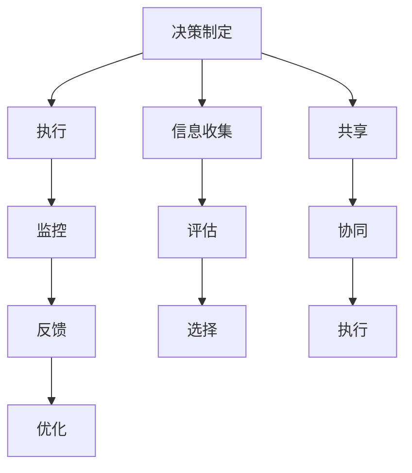

                 

# 行动体系与管理效率的关系

## 1. 背景介绍

在快速变化的商业环境中，企业必须不断调整策略以保持竞争力。然而，繁琐的流程和繁琐的决策过程可能会减缓企业响应市场变化的速度。这就需要一个有效的行动体系，以确保决策能够快速转化为实际行动，从而提高管理效率。

本文章旨在探讨行动体系与管理效率之间的关系，以及如何建立和管理一个有效的行动体系。我们将在本文中讨论行动体系的组成部分，其工作原理，以及如何通过设计和管理行动体系来提高企业效率。

## 2. 核心概念与联系

### 2.1 核心概念概述

为了更好地理解行动体系，我们将介绍几个关键概念：

- **行动体系（Action System）**：这是一个组织中用于管理和执行决策的系统，通常包括决策制定、决策执行、监控和反馈等环节。
- **管理效率（Management Efficiency）**：这是指组织能够快速、有效地完成任务和目标的能力。
- **决策（Decision Making）**：决策过程包括识别问题、收集信息、评估选项和做出决定等步骤。
- **执行（Execution）**：决策的执行是将决策转化为实际行动的过程。
- **监控和反馈（Monitoring and Feedback）**：监控和反馈机制确保决策和执行的有效性，并根据结果进行调整。

这些概念之间存在着密切的联系，通过有效的行动体系，组织可以更高效地做出决策并执行这些决策，从而提高管理效率。

### 2.2 核心概念原理和架构的 Mermaid 流程图



此流程图展示了行动体系的工作流程：

1. 从信息收集开始，通过评估选择不同的决策。
2. 将决策传达给执行团队，并监控执行进度和结果。
3. 根据监控和反馈结果，优化决策和执行流程。

## 3. 核心算法原理 & 具体操作步骤

### 3.1 算法原理概述

行动体系的算法原理包括以下几个方面：

- **数据收集**：收集与决策相关的信息。
- **决策制定**：使用数据和历史决策来制定新的决策。
- **执行规划**：规划执行步骤并分配资源。
- **执行监控**：监控执行进度和结果，并及时调整。
- **反馈机制**：根据执行结果提供反馈，优化决策过程。

### 3.2 算法步骤详解

#### 3.2.1 数据收集

数据收集是决策制定的基础。需要收集与决策相关的所有信息，包括市场数据、财务数据、客户反馈等。

#### 3.2.2 决策制定

基于收集到的数据，使用决策模型（如决策树、贝叶斯网络等）来制定决策。可以使用定性和定量方法来综合考虑所有因素。

#### 3.2.3 执行规划

根据决策结果，制定执行计划，包括分配资源、设置里程碑和确定关键绩效指标（KPI）。

#### 3.2.4 执行监控

使用执行管理系统（如Jira、Asana等）来监控执行进度和结果。需要确保所有团队成员都了解任务的优先级和截止日期。

#### 3.2.5 反馈机制

根据执行结果提供反馈，用于优化决策和执行流程。可以使用回顾会议或分析工具（如Kendall-Wartell指数）来评估执行效果。

### 3.3 算法优缺点

#### 3.3.1 优点

1. **提高效率**：通过系统化管理决策和执行，可以减少人为错误，提高效率。
2. **一致性**：确保所有团队成员遵循相同的流程和标准。
3. **可追踪性**：能够追踪决策和执行的每个步骤，确保透明度。
4. **灵活性**：可以根据执行结果进行调整和优化。

#### 3.3.2 缺点

1. **复杂性**：建立和管理行动体系需要投入大量资源和时间。
2. **初期成本**：需要购买和部署软件工具，并培训员工。
3. **依赖技术**：系统的成功依赖于员工的技能和工具的有效使用。
4. **变化适应性**：行动体系需要定期更新和调整以适应组织的变化。

### 3.4 算法应用领域

行动体系适用于各种类型的组织，包括制造、零售、金融、政府等。其应用领域包括：

- **项目管理**：监控项目进度和结果，提供反馈以优化项目管理流程。
- **运营管理**：监控生产过程和供应链，确保高效运营。
- **人力资源管理**：管理招聘、培训和员工绩效，确保人力资源的高效利用。
- **市场营销**：制定和执行市场策略，监控市场反应和销售结果。

## 4. 数学模型和公式 & 详细讲解 & 举例说明

### 4.1 数学模型构建

行动体系的数学模型通常包括以下组成部分：

- **输入**：决策的相关数据，如市场数据、财务数据、客户反馈等。
- **决策函数**：根据输入数据，使用决策模型（如贝叶斯网络、决策树等）来制定决策。
- **执行函数**：根据决策结果，使用执行规划来分配资源和设置里程碑。
- **监控函数**：使用执行管理系统来监控执行进度和结果，并根据结果提供反馈。

### 4.2 公式推导过程

设决策模型为$f$，执行规划模型为$g$，监控函数为$h$，反馈机制为$l$，行动体系的总效果为$E$。

$$
E = f(input) + g(f(input)) + h(g(f(input))) + l(h(g(f(input))))
$$

其中，$input$为输入数据。

### 4.3 案例分析与讲解

以一家零售企业的行动体系为例：

1. **数据收集**：收集市场趋势、销售数据和客户反馈。
2. **决策制定**：使用贝叶斯网络分析销售数据和市场趋势，制定新的促销策略。
3. **执行规划**：根据促销策略，规划广告投放、库存管理和物流配送。
4. **执行监控**：使用执行管理系统监控广告效果和库存水平，并根据结果调整策略。
5. **反馈机制**：根据监控结果，提供反馈以优化促销策略和执行流程。

通过这个过程，零售企业能够快速响应市场变化，提高销售和客户满意度。

## 5. 项目实践：代码实例和详细解释说明

### 5.1 开发环境搭建

为了实现行动体系，需要以下开发环境：

- **编程语言**：Python。
- **数据处理工具**：Pandas、NumPy。
- **决策建模工具**：Scikit-learn。
- **执行管理工具**：Jira、Asana。

### 5.2 源代码详细实现

以下是一个基于Python的决策模型的示例代码：

```python
from sklearn.ensemble import DecisionTreeClassifier
from sklearn.model_selection import train_test_split
import pandas as pd

# 加载数据
data = pd.read_csv('sales_data.csv')

# 分割数据集
X_train, X_test, y_train, y_test = train_test_split(data.drop('sales', axis=1), data['sales'], test_size=0.2)

# 创建决策树模型
model = DecisionTreeClassifier()

# 训练模型
model.fit(X_train, y_train)

# 预测并评估
y_pred = model.predict(X_test)
print('Accuracy:', model.score(X_test, y_test))
```

### 5.3 代码解读与分析

该代码示例展示了如何使用Scikit-learn库中的决策树模型进行数据建模和评估。步骤如下：

1. 加载数据集。
2. 将数据集分割为训练集和测试集。
3. 创建决策树模型。
4. 训练模型。
5. 使用测试集评估模型的准确性。

## 6. 实际应用场景

### 6.1 制造业

制造业中的行动体系可以确保生产线高效运转和产品质量控制。通过监控生产数据和设备状态，及时调整生产流程，以避免停机和废品。

### 6.2 医疗行业

医疗行业中的行动体系可以确保病人得到及时的治疗和关注。通过监控病人的健康数据，及时调整治疗方案，以提高治愈率。

### 6.3 政府管理

政府管理中的行动体系可以确保政策实施的有效性和透明度。通过监控政策执行情况和公共反馈，及时调整政策，以提高公共服务的效率。

### 6.4 未来应用展望

未来，行动体系将更加智能化和自动化。通过引入AI和大数据分析技术，行动体系将能够更好地预测和优化决策和执行流程，提高管理效率。

## 7. 工具和资源推荐

### 7.1 学习资源推荐

- **《行动系统管理》**：这是一本关于行动体系管理的经典书籍，提供了丰富的理论和实践案例。
- **《敏捷项目管理》**：介绍敏捷项目管理方法，适用于需要快速响应的组织。
- **Coursera《行动系统设计》课程**：提供系统设计和实施行动体系的在线课程。

### 7.2 开发工具推荐

- **Jira**：一个流行的项目管理工具，可以帮助组织协调决策和执行过程。
- **Asana**：另一个项目管理工具，适用于中小型组织的行动体系。
- **Kendall-Wartell指数**：一个用于评估行动体系效果的工具。

### 7.3 相关论文推荐

- **《行动系统设计原理》**：一篇关于行动体系设计的学术论文，提供了系统设计的理论框架。
- **《行动体系实施案例分析》**：一篇关于行动体系实施案例的论文，展示了实际应用中的成功经验。

## 8. 总结：未来发展趋势与挑战

### 8.1 研究成果总结

通过研究和实践行动体系，企业能够提高决策和执行效率，从而提高整体管理效率。行动体系的核心在于数据收集、决策制定、执行规划、执行监控和反馈机制的协同工作。

### 8.2 未来发展趋势

未来，行动体系将更加智能化、自动化和数据驱动。人工智能和大数据分析技术将帮助企业更好地预测和优化决策和执行流程。

### 8.3 面临的挑战

行动体系仍然面临一些挑战，如数据质量、系统复杂性、员工技能和成本等。需要持续投入资源和技术来应对这些挑战。

### 8.4 研究展望

未来的研究将集中在以下几个方向：

- **自动化决策**：引入AI技术，自动化决策过程。
- **跨部门协作**：加强跨部门协作，提高行动体系的协调性。
- **实时监控**：实现实时监控和反馈机制，及时调整决策和执行流程。
- **数据治理**：加强数据治理，确保数据质量和安全性。

通过这些研究方向，企业将能够更好地利用行动体系来提高管理效率，应对市场变化和挑战。

## 9. 附录：常见问题与解答

**Q1：如何设计一个高效的行动体系？**

A: 设计高效的行动体系需要考虑以下几个因素：

1. **明确目标**：确保所有团队成员了解行动体系的目标和预期结果。
2. **数据驱动**：收集高质量的数据，并使用科学的方法进行决策。
3. **跨部门协作**：加强跨部门协作，确保决策和执行的协调性。
4. **灵活性**：确保行动体系能够适应组织的变化和市场变化。
5. **持续改进**：定期回顾和优化行动体系，以提高效率和效果。

**Q2：如何评估行动体系的效果？**

A: 评估行动体系的效果可以使用以下指标：

1. **决策时间**：从决策制定到执行的时间。
2. **执行效率**：执行任务所需的时间。
3. **质量指标**：任务完成的质量，如客户满意度、生产效率等。
4. **成本效益**：行动体系的投入产出比。

**Q3：如何应对行动体系中的挑战？**

A: 应对行动体系中的挑战需要综合考虑以下几个方面：

1. **数据治理**：确保数据质量和安全。
2. **系统集成**：整合不同部门的工具和流程。
3. **员工培训**：培训员工使用行动体系中的工具和技术。
4. **持续改进**：定期评估和优化行动体系，以提高效率和效果。

---

作者：禅与计算机程序设计艺术 / Zen and the Art of Computer Programming

