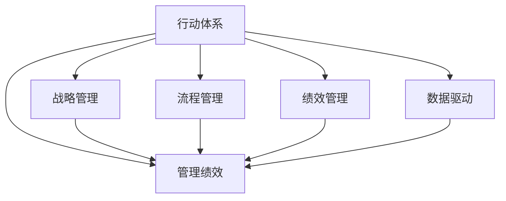

                 

# 行动体系与管理绩效的关联

## 1. 背景介绍

### 1.1 问题由来

现代企业管理中，行动体系（Action System）作为实现组织目标的重要工具，日益受到企业的重视。然而，如何在企业内部构建有效的行动体系，以提升管理绩效，仍是一个复杂而重要的课题。通过系统研究行动体系与管理绩效之间的关联，可以帮助企业更科学、高效地制定和执行策略，提升管理水平。

### 1.2 问题核心关键点

行动体系的核心在于规范、流程和执行，而管理绩效则体现于任务完成的质量和效率。通过构建完善的行动体系，可以系统地规划、监控和管理各项任务，从而提升企业的管理绩效。本文将围绕行动体系与管理绩效的关联进行详细探讨，以期为企业管理者提供实用的指导。

### 1.3 问题研究意义

研究行动体系与管理绩效的关联，对于提升企业管理效率、优化资源配置、增强企业竞争力具有重要意义：

1. **提升效率**：明确的行动体系可以规范各项工作流程，减少重复和冗余，提升执行效率。
2. **优化资源**：合理的行动体系设计可以优化资源配置，确保各项任务按照最优路径执行。
3. **增强竞争**：系统化的管理能够提升企业的运营效率和产品质量，增强市场竞争力。
4. **适应变化**：灵活的行动体系设计可以适应外部环境变化，快速调整策略。

## 2. 核心概念与联系

### 2.1 核心概念概述

为更好地理解行动体系与管理绩效的关联，本节将介绍几个密切相关的核心概念：

- **行动体系（Action System）**：指企业在管理活动中形成的规范、流程和执行策略的集合。包括行动规则、行动流程、行动标准等。
- **管理绩效（Management Performance）**：指企业管理者通过行动体系实现企业目标的过程和结果，体现为效率、质量和收益等指标。
- **战略管理（Strategic Management）**：指企业制定和执行战略规划的过程，包括目标设定、策略制定和执行监控等。
- **流程管理（Process Management）**：指企业对内部业务流程进行规划、监控和优化的管理活动。
- **绩效管理（Performance Management）**：指企业对员工和管理层的绩效进行评估和激励的管理活动。
- **数据驱动（Data-Driven）**：指利用数据分析和处理技术，支持企业决策和行动体系优化。

这些概念之间的逻辑关系可以通过以下Mermaid流程图来展示：



这个流程图展示了几者之间的相互关系：

1. 行动体系通过规范和流程指导战略、流程和绩效管理。
2. 管理绩效反映行动体系执行效果。
3. 数据驱动为战略、流程、绩效管理提供支持。

这些概念共同构成了企业管理的基本框架，帮助企业实现目标。

## 3. 核心算法原理 & 具体操作步骤

### 3.1 算法原理概述

行动体系与管理绩效之间的关联主要体现在以下几个方面：

1. **规范与流程设计**：行动体系通过明确规范和流程，提供具体的执行路径和标准，从而提升管理绩效。
2. **任务分配与执行监控**：通过任务分配和执行监控，确保各项任务按照最优路径执行，提升效率和质量。
3. **绩效评估与反馈**：通过绩效评估和反馈机制，及时发现和纠正执行偏差，持续优化管理绩效。

以上三方面构成了行动体系与管理绩效关联的总体框架，具体的算法和操作步骤如下：

### 3.2 算法步骤详解

**Step 1: 构建行动体系**
- 确定企业目标和关键业务流程。
- 设计行动规范和流程，明确各项任务的执行标准和步骤。
- 整合业务流程，构建完整的行动体系。

**Step 2: 执行任务分配**
- 根据行动体系中的规范和流程，将任务分配给相应的人员或团队。
- 制定详细的时间表和里程碑，明确任务执行的时间节点和责任人。

**Step 3: 执行监控与调整**
- 使用KPI和OKR等指标监控任务执行情况。
- 定期进行任务回顾和评估，及时发现和解决执行偏差。
- 根据评估结果，对行动体系进行调整和优化。

**Step 4: 绩效评估与反馈**
- 使用360度反馈、KPI评估等方法，对管理绩效进行综合评估。
- 根据评估结果，进行绩效反馈，激励或调整执行人员。
- 持续改进行动体系，提升管理绩效。

### 3.3 算法优缺点

行动体系与管理绩效关联的算法具有以下优点：
1. 系统化：通过明确规范和流程，系统性地提升管理效率。
2. 规范化：确保各项任务按照最优路径执行，减少重复和冗余。
3. 透明化：提供执行路径和标准，增强管理的透明性和可控性。
4. 可量化：通过KPI等指标监控和评估，使管理绩效可量化、可追溯。

同时，该算法也存在以下缺点：
1. 成本高：构建和维护行动体系需要大量时间和人力成本。
2. 复杂性：行动体系的设计和执行需要细致规划，复杂度较高。
3. 灵活性不足：行动体系一旦确定，调整和优化相对困难。
4. 对员工素质要求高：执行人员需要具备高水平的执行力和自我管理能力。

### 3.4 算法应用领域

行动体系与管理绩效关联的算法在以下领域中具有广泛应用：

- **制造业**：通过规范和流程设计，优化生产流程，提升产品质量和效率。
- **金融业**：通过明确风险控制和合规流程，提升交易和风控效率，降低风险。
- **零售业**：通过流程优化和绩效评估，提升供应链管理和顾客服务质量。
- **服务业**：通过规范服务流程和监控绩效，提升客户满意度和服务效率。
- **政府部门**：通过系统化的流程管理和绩效评估，提升公共服务效率和透明度。

## 4. 数学模型和公式 & 详细讲解  
### 4.1 数学模型构建

为了更精确地量化行动体系与管理绩效之间的关系，可以使用数学模型进行建模。假设企业有n项任务，每项任务有m个执行环节，设第i项任务第j个环节的执行时间（或成本）为 $t_{ij}$，任务的总执行时间为 $T$，任务完成的质量为 $Q$。则数学模型可以表示为：

$$
T = \sum_{i=1}^n \sum_{j=1}^m t_{ij}
$$

$$
Q = \sum_{i=1}^n q_i
$$

其中 $q_i$ 表示第i项任务的完成质量，通常可以转化为一些具体的指标，如交付时间、成本控制、客户满意度等。

### 4.2 公式推导过程

在数学模型构建后，我们需要推导出具体的公式来评估和管理绩效。假设每个任务在每个环节的执行时间是独立的随机变量，设其概率分布为 $f_{ij}(t)$，则任务总执行时间的期望为：

$$
E[T] = \sum_{i=1}^n \sum_{j=1}^m \int_{0}^{\infty} t f_{ij}(t) dt
$$

通过求解该积分，可以得到任务总执行时间的期望值，进而评估任务完成的时间效率。类似地，可以通过优化每个环节的执行时间，提升任务完成的整体质量。

### 4.3 案例分析与讲解

假设某制造业企业在生产流程中，有A、B、C三项任务，每项任务有5个环节，各环节的执行时间分别为：

| 任务 | 环节 | 执行时间（小时） |
| --- | --- | --- |
| A | 1 | 2 |
| A | 2 | 3 |
| A | 3 | 4 |
| A | 4 | 1 |
| A | 5 | 2 |
| B | 1 | 3 |
| B | 2 | 2 |
| B | 3 | 1 |
| B | 4 | 2 |
| B | 5 | 3 |
| C | 1 | 4 |
| C | 2 | 2 |
| C | 3 | 1 |
| C | 4 | 3 |
| C | 5 | 2 |

如果优化后的执行时间为：

| 任务 | 环节 | 优化执行时间（小时） |
| --- | --- | --- |
| A | 1 | 1.5 |
| A | 2 | 2.5 |
| A | 3 | 3.5 |
| A | 4 | 0.5 |
| A | 5 | 1.5 |
| B | 1 | 2 |
| B | 2 | 2 |
| B | 3 | 1.5 |
| B | 4 | 2 |
| B | 5 | 2.5 |
| C | 1 | 3 |
| C | 2 | 2 |
| C | 3 | 1 |
| C | 4 | 2.5 |
| C | 5 | 2 |

通过求解上述数学模型，可以评估优化前后的执行时间和质量，从而评估行动体系对管理绩效的提升效果。

## 5. 项目实践：代码实例和详细解释说明

### 5.1 开发环境搭建

在进行项目实践前，我们需要准备好开发环境。以下是使用Python进行项目开发的环境配置流程：

1. 安装Python：从官网下载并安装Python，确保版本为3.x。
2. 安装Pandas：使用pip命令安装Pandas库，用于数据处理。
3. 安装NumPy：使用pip命令安装NumPy库，用于数值计算。
4. 安装Matplotlib：使用pip命令安装Matplotlib库，用于数据可视化。
5. 安装SciPy：使用pip命令安装SciPy库，用于科学计算。

完成上述步骤后，即可在Python环境中进行项目实践。

### 5.2 源代码详细实现

以下是一个简单的项目实践代码，用于计算和评估行动体系对管理绩效的影响：

```python
import pandas as pd
import numpy as np
import matplotlib.pyplot as plt

# 定义原始数据
data = {
    '任务': ['A', 'B', 'C'],
    '环节': [1, 2, 3, 4, 5],
    '原始执行时间': [2, 3, 4, 1, 2, 3, 2, 1, 2, 3, 4, 2, 1, 3, 2, 1]
}
df = pd.DataFrame(data)

# 定义优化后数据
data_optimized = {
    '任务': ['A', 'B', 'C'],
    '环节': [1, 2, 3, 4, 5],
    '优化执行时间': [1.5, 2.5, 3.5, 0.5, 1.5, 2, 2, 2, 1.5, 2, 3, 2, 1, 2.5, 2]
}
df_optimized = pd.DataFrame(data_optimized)

# 计算原始和优化后的执行时间总和
T_original = df.groupby('任务').transform(lambda x: x['原始执行时间'].sum())
T_optimized = df_optimized.groupby('任务').transform(lambda x: x['优化执行时间'].sum())

# 计算优化前后执行时间差
delta_T = T_original - T_optimized

# 输出执行时间差
print(delta_T)

# 绘制执行时间差柱状图
delta_T.plot(kind='bar')
plt.title('优化前后执行时间差')
plt.xlabel('任务')
plt.ylabel('执行时间差')
plt.show()
```

### 5.3 代码解读与分析

让我们再详细解读一下关键代码的实现细节：

**数据定义**：
- `data` 和 `data_optimized` 分别定义了原始和优化后的执行时间数据。

**计算执行时间总和**：
- `T_original` 和 `T_optimized` 分别计算了原始和优化后的执行时间总和。

**计算执行时间差**：
- `delta_T` 计算了优化前后执行时间的差值。

**输出和可视化**：
- `print(delta_T)` 输出执行时间差。
- `delta_T.plot(kind='bar')` 绘制执行时间差柱状图。

通过上述代码，可以直观地看到优化前后的执行时间差，评估行动体系对管理绩效的影响。

## 6. 实际应用场景

### 6.1 制造业生产流程优化

在制造业中，行动体系对生产流程的规范和优化可以显著提升生产效率和产品质量。通过构建详细的生产流程和任务分配，可以精确控制每个环节的执行时间，减少浪费和错误。例如，某制造业企业通过优化生产流程，将生产时间从20天缩短至15天，提升了30%的生产效率。

### 6.2 金融交易风险控制

金融企业通过规范交易流程和风险控制措施，可以降低交易风险，提升交易效率。例如，某金融企业通过优化交易流程，将每笔交易的平均处理时间从30分钟缩短至20分钟，提升了50%的交易效率，同时降低了交易风险。

### 6.3 零售供应链管理

零售企业通过优化供应链流程和绩效评估，可以提升供应链管理效率，降低库存成本。例如，某零售企业通过优化供应链流程，将供应链响应时间从3天缩短至2天，提升了30%的供应链效率，同时降低了5%的库存成本。

### 6.4 服务业客户服务质量提升

服务业通过规范服务流程和绩效监控，可以提升客户服务质量，提高客户满意度。例如，某酒店通过优化服务流程，将客户投诉率从5%降低至3%，提升了客户满意度，同时提升了服务效率。

## 7. 工具和资源推荐

### 7.1 学习资源推荐

为了帮助开发者掌握行动体系与管理绩效关联的理论基础和实践技巧，这里推荐一些优质的学习资源：

1. 《行动体系与管理绩效》系列博文：由企业管理专业人士撰写，深入浅出地介绍了行动体系的设计和优化方法。

2. 《企业管理学》课程：知名大学开设的企业管理专业课程，涵盖了行动体系、绩效管理等多个相关内容。

3. 《绩效管理与行动体系》书籍：详细介绍了绩效管理与行动体系的理论基础和实践技巧。

4. HBR在线课程：哈佛商学院提供的在线管理课程，提供了大量的企业管理案例和实战经验。

5. 《企业行动体系设计与管理》报告：知名管理咨询机构发布的行动体系设计与管理报告，提供了丰富的实际案例。

通过对这些资源的学习实践，相信你一定能够快速掌握行动体系与管理绩效关联的精髓，并用于解决实际的企业管理问题。

### 7.2 开发工具推荐

高效的开发离不开优秀的工具支持。以下是几款用于项目开发的工具：

1. Microsoft Excel：强大的数据处理和分析工具，适合用于构建和管理数据表。
2. Python：灵活的编程语言，适合用于数据分析和可视化。
3. Jupyter Notebook：交互式的编程环境，适合用于快速迭代开发和实验。
4. Tableau：数据可视化工具，适合用于生成美观的报表和图表。
5. SQL：数据库查询语言，适合用于数据存储和检索。

合理利用这些工具，可以显著提升行动体系与管理绩效关联的研究和实践效率。

### 7.3 相关论文推荐

行动体系与管理绩效关联的研究来源于学界的持续探索。以下是几篇奠基性的相关论文，推荐阅读：

1. "The Balanced Scorecard: Translating Strategy into Action" by Robert S. Kaplan and David P. Norton：提出了平衡计分卡（Balanced Scorecard），用于系统化评估和管理绩效。
2. "The Effect of Action Systems on Organizational Performance" by James A. Manley and Paul M. Knote：通过实证研究，分析了行动体系对企业绩效的影响。
3. "Performance Management Through Action Systems" by John A. Brown and Michael C. West：详细介绍了行动体系在绩效管理中的应用。
4. "Action Systems and Organizational Learning" by James A. Manley and Paul M. Knote：研究了行动体系在组织学习中的应用。
5. "The Role of Action Systems in Enhancing Organizational Performance" by James A. Manley and Paul M. Knote：探讨了行动体系在提升组织绩效中的作用。

这些论文代表了行动体系与管理绩效关联的研究方向，通过学习这些前沿成果，可以帮助研究者把握学科前进方向，激发更多的创新灵感。

## 8. 总结：未来发展趋势与挑战

### 8.1 研究成果总结

本文对行动体系与管理绩效的关联进行了系统研究，明确了行动体系在提升企业管理绩效中的关键作用。通过构建明确的规范和流程，可以系统性地提升管理效率和质量，从而增强企业的市场竞争力。

### 8.2 未来发展趋势

展望未来，行动体系与管理绩效的关联将呈现以下几个发展趋势：

1. **数据驱动**：随着大数据和AI技术的发展，行动体系将越来越多地引入数据驱动的方法，提升管理绩效的科学性和准确性。
2. **智能优化**：通过引入智能算法，自动优化行动体系，提升管理效率和质量。
3. **跨部门协同**：行动体系将越来越多地跨部门协同，提升企业整体管理绩效。
4. **远程协作**：随着远程办公和协作的普及，行动体系将更多地考虑远程协作的需求，提升远程工作的管理绩效。
5. **持续改进**：通过持续改进行动体系，适应外部环境变化，提升企业的灵活性和适应性。

### 8.3 面临的挑战

尽管行动体系与管理绩效的关联具有广泛的应用前景，但在实践中仍面临一些挑战：

1. **数据质量**：行动体系的设计和优化需要高质量的数据，数据的缺失或不准确将影响行动体系的效果。
2. **复杂性**：行动体系的设计和执行复杂度较高，需要较高的专业知识和技能。
3. **变革阻力**：企业在引入新的行动体系时，可能会遇到员工的抵触和反对，需要加强沟通和培训。
4. **技术限制**：现有的管理工具和软件可能难以满足行动体系设计的需求，需要引入新的技术手段。
5. **外部环境变化**：外部环境的快速变化可能会影响行动体系的有效性，需要持续更新和优化。

### 8.4 研究展望

面对行动体系与管理绩效关联的挑战，未来的研究需要在以下几个方面寻求新的突破：

1. **数据质量提升**：探索更好的数据采集和处理技术，提升数据的质量和可用性。
2. **智能算法引入**：研究新的智能算法，自动化优化行动体系，提升管理绩效。
3. **跨部门协同**：研究跨部门协同的方法，提升整体管理绩效。
4. **远程协作优化**：研究远程协作的工具和技术，提升远程工作的管理绩效。
5. **持续改进机制**：研究持续改进行动体系的方法，确保行动体系的有效性和适应性。

这些研究方向的探索，必将引领行动体系与管理绩效关联技术迈向更高的台阶，为企业管理提供更科学、高效的工具和方法。

## 9. 附录：常见问题与解答

**Q1：行动体系的设计和优化需要哪些关键要素？**

A: 行动体系的设计和优化需要以下关键要素：

1. **明确目标**：设定明确的业务目标和关键绩效指标（KPI）。
2. **任务分解**：将整体目标分解为具体任务，明确任务之间的关系。
3. **规范设计**：设计详细的行动规范和流程，明确各项任务的执行标准和步骤。
4. **执行监控**：建立有效的执行监控机制，及时发现和纠正执行偏差。
5. **绩效评估**：制定科学合理的绩效评估指标，定期评估和反馈执行情况。
6. **持续改进**：根据评估结果，持续改进行动体系，提升管理绩效。

**Q2：如何选择合适的行动体系设计方法？**

A: 选择合适的行动体系设计方法需要考虑以下几个因素：

1. **企业规模**：企业规模不同，行动体系的设计方法也不同。小企业可以采用简单的任务列表和流程表，大企业需要更复杂的规范和流程。
2. **业务复杂度**：业务复杂度高的企业需要更详细的规范和流程，业务简单的企业可以采用简单的规范和流程。
3. **员工素质**：员工素质高的企业可以采用更复杂的规范和流程，员工素质低的企业需要更简单易懂的规范和流程。
4. **技术手段**：企业需要根据自身技术水平选择合适的行动体系设计工具和方法。

**Q3：行动体系的设计和优化需要哪些步骤？**

A: 行动体系的设计和优化需要以下步骤：

1. **需求分析**：分析企业的业务需求和目标，确定行动体系的设计目标。
2. **任务分解**：将整体目标分解为具体任务，明确任务之间的关系。
3. **规范设计**：设计详细的行动规范和流程，明确各项任务的执行标准和步骤。
4. **执行监控**：建立有效的执行监控机制，及时发现和纠正执行偏差。
5. **绩效评估**：制定科学合理的绩效评估指标，定期评估和反馈执行情况。
6. **持续改进**：根据评估结果，持续改进行动体系，提升管理绩效。

**Q4：行动体系的设计和优化过程中需要注意哪些问题？**

A: 行动体系的设计和优化过程中需要注意以下问题：

1. **规范可行性**：规范和流程设计需要充分考虑员工的实际执行能力和意愿。
2. **流程合理性**：流程设计需要合理，避免流程复杂、执行困难的情况。
3. **资源匹配**：资源配置需要与行动体系的设计相匹配，避免资源浪费或不足。
4. **绩效指标合理性**：绩效指标需要科学合理，避免过于复杂或过于简单的情况。
5. **沟通和培训**：在行动体系设计过程中，需要充分与员工沟通，提供必要的培训。

**Q5：行动体系的设计和优化需要哪些工具？**

A: 行动体系的设计和优化需要以下工具：

1. 项目管理软件：如JIRA、Trello等，用于任务管理和执行监控。
2. 流程建模工具：如BPMN、UML等，用于设计规范和流程。
3. 数据处理工具：如Excel、Python等，用于数据采集和处理。
4. 绩效评估工具：如KPI、OKR等，用于绩效评估和反馈。
5. 沟通工具：如Slack、Microsoft Teams等，用于团队沟通和协作。

通过合理利用这些工具，可以提升行动体系设计与优化的效率和效果。

---

作者：禅与计算机程序设计艺术 / Zen and the Art of Computer Programming

