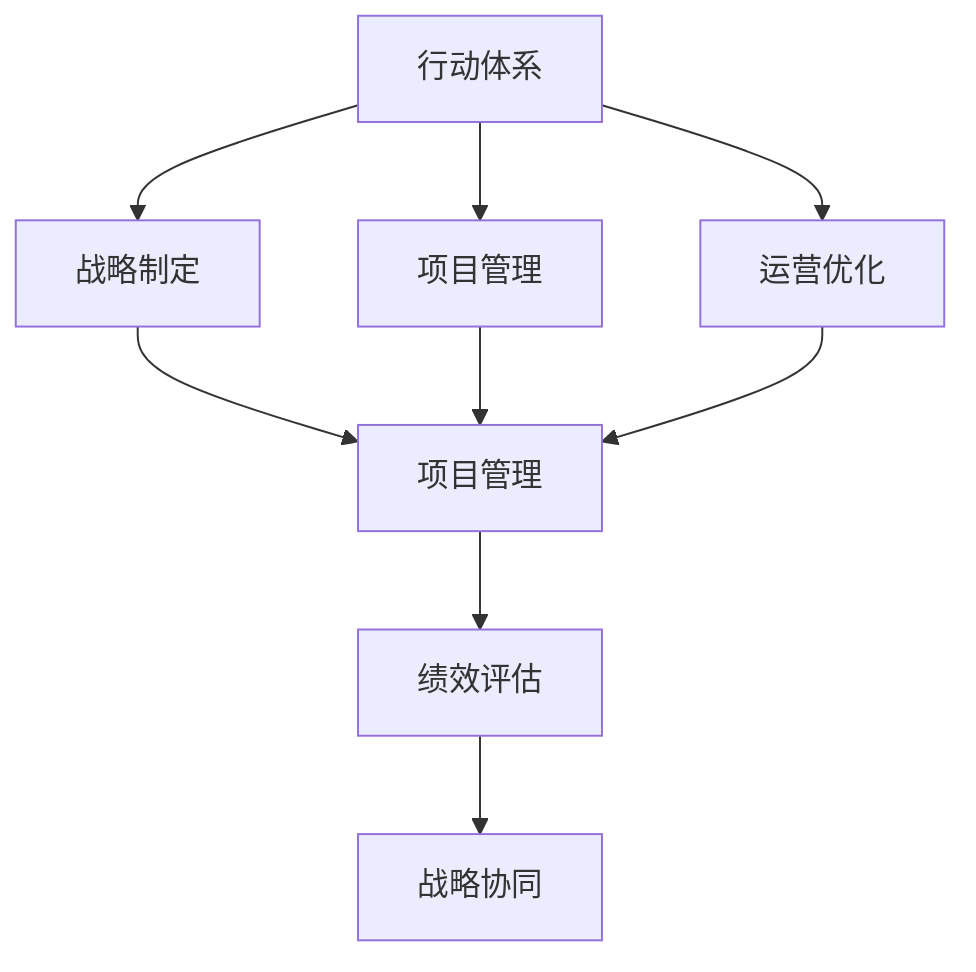

                 

## 1. 背景介绍

在当今快速变化的市场环境中，企业越来越依赖于高效的行动体系来应对挑战和抓住机遇。行动体系，通常指企业内部的一组系统性措施，旨在确保策略、计划和执行之间的有效连接，从而实现目标。然而，构建和优化行动体系是一项复杂而微妙的工作，需要深入理解它与企业绩效之间的联系。本文将探讨行动体系与管理绩效的关联，并提出一套系统性的方法，帮助企业构建高效行动体系，提升管理绩效。

## 2. 核心概念与联系

### 2.1 核心概念概述

- **行动体系（Action System）**：企业内部的一套系统性措施，确保策略、计划和执行之间的一致性，涵盖战略制定、项目管理、运营优化等多个环节。
- **管理绩效（Management Performance）**：企业通过有效的行动体系实现目标的程度，包括成本控制、效率提升、创新能力增强等。
- **系统性影响（Systemic Impact）**：行动体系对企业整体运营的深远影响，如战略执行的流畅性、资源配置的优化程度、团队协作的紧密程度等。
- **战略协同（Strategic Alignment）**：企业战略与行动体系之间的有效对接，确保行动体系支持并实现企业整体战略目标。
- **绩效评估（Performance Evaluation）**：通过量化指标对行动体系管理绩效的评估，如成本效益、项目完成率、员工满意度等。

这些核心概念共同构成了企业行动体系与绩效管理之间的基础框架。理解这些概念及其相互作用，是构建高效行动体系、提升管理绩效的前提。

### 2.2 核心概念原理和架构的 Mermaid 流程图



这个流程图展示了行动体系与管理绩效之间的核心联系。行动体系的不同组成部分（战略制定、项目管理、运营优化）通过协同作用，共同影响绩效评估结果，进而影响战略协同。这种系统性影响是企业绩效提升的关键。

## 3. 核心算法原理 & 具体操作步骤

### 3.1 算法原理概述

行动体系与管理绩效的关联可以通过一系列算法和步骤来实现。本文将详细介绍这些原理和操作步骤，以便读者理解并应用到实际管理中。

- **数据收集与分析**：通过收集企业的运营数据，分析行动体系中各个环节的表现，发现潜在的瓶颈和改进点。
- **系统优化模型**：构建基于行动体系与绩效之间关系的数学模型，使用算法优化模型参数，提升行动体系的整体效能。
- **反馈与迭代**：定期收集绩效评估数据，反馈至行动体系中，通过迭代优化实现持续改进。

### 3.2 算法步骤详解

#### 3.2.1 数据收集与分析

1. **数据源确定**：
   - 运营数据：包括生产效率、成本控制、质量管理等。
   - 项目数据：项目进度、预算执行、风险管理等。
   - 员工反馈：员工满意度、员工流失率、培训效果等。

2. **数据收集方法**：
   - 定期报告：通过定期生成的企业运营报告收集数据。
   - 在线系统：利用ERP、CRM等在线系统自动采集数据。
   - 员工问卷：通过问卷调查了解员工满意度、工作负荷等。

3. **数据分析**：
   - 数据清洗：去除异常值和噪音，确保数据的准确性。
   - 描述性分析：通过统计指标（如平均值、中位数、标准差）描述数据特征。
   - 关联性分析：使用相关系数、回归分析等方法，找出不同数据之间的关系。

#### 3.2.2 系统优化模型

1. **建模原则**：
   - 整体性：考虑行动体系各环节的相互影响。
   - 动态性：考虑行动体系随时间变化的特点。
   - 适应性：模型应具备一定的灵活性，适应不同情境。

2. **模型构建**：
   - 设定目标函数：如最小化成本、最大化效率、提升创新能力等。
   - 选择变量：包括行动体系中的关键变量（如项目进度、资源分配、团队协作等）。
   - 构建约束条件：如预算限制、时间限制、资源限制等。

3. **算法选择**：
   - 优化算法：如线性规划、整数规划、混合整数规划等。
   - 评估标准：如模型的准确性、稳定性、可解释性等。

#### 3.2.3 反馈与迭代

1. **绩效评估**：
   - 设定评估指标：如项目完成率、员工满意度、客户满意度等。
   - 数据采集：定期收集绩效评估数据。
   - 结果分析：评估结果与预设目标对比，找出差距。

2. **反馈机制**：
   - 数据分析：对绩效评估数据进行深入分析，找出问题所在。
   - 行动体系调整：根据分析结果，调整行动体系中的策略、计划和执行方法。
   - 持续改进：建立持续改进机制，定期评估和优化行动体系。

### 3.3 算法优缺点

**优点**：
- **系统性**：通过整体视角考虑行动体系与绩效之间的关联，避免局部优化导致的整体风险。
- **动态调整**：模型具备一定的灵活性，能够适应外部环境的变化。
- **数据驱动**：基于数据进行分析和优化，减少主观判断的偏差。

**缺点**：
- **模型复杂**：构建模型和进行优化需要较强的数学和算法背景。
- **数据质量要求高**：数据收集和分析的准确性直接影响模型效果。
- **资源消耗**：构建和优化模型可能需要较大的计算资源和时间成本。

### 3.4 算法应用领域

行动体系与管理绩效的关联方法广泛应用于以下几个领域：

- **制造行业**：通过优化生产计划和供应链管理，提升生产效率和产品质量。
- **金融行业**：利用绩效评估数据指导投资决策和风险管理。
- **零售行业**：通过优化库存管理和客户服务流程，提升销售效率和客户满意度。
- **医疗行业**：通过优化诊疗流程和资源配置，提升患者治疗效果和满意度。
- **服务业**：通过优化服务流程和客户互动，提升服务质量和客户忠诚度。

## 4. 数学模型和公式 & 详细讲解 & 举例说明

### 4.1 数学模型构建

构建行动体系与管理绩效关联的数学模型时，通常会引入以下变量：

- $P$：行动体系中各环节的性能指标（如项目完成率、生产效率等）。
- $C$：成本指标（如直接成本、间接成本等）。
- $E$：效率指标（如资源利用率、设备使用率等）。
- $I$：创新指标（如新产品开发率、专利申请量等）。
- $R$：风险指标（如项目延期率、质量事故率等）。

目标函数为：

$$
\min_{P, C, E, I, R} \alpha P + \beta C + \gamma E + \delta I + \epsilon R
$$

其中 $\alpha, \beta, \gamma, \delta, \epsilon$ 为权重系数，反映了各指标对整体绩效的影响程度。

约束条件包括：

- 预算限制：$\sum_i C_i \leq B$
- 时间限制：$\sum_i T_i \leq T$
- 资源限制：$\sum_i R_i \leq R$
- 质量限制：$\sum_i Q_i \leq Q$

### 4.2 公式推导过程

以最小化成本和最大化效率为目标，构建整数规划模型：

$$
\min_{x} \sum_{i=1}^{n} c_i x_i
$$

约束条件为：

$$
\begin{aligned}
& \text{subject to} \\
& A x = b \\
& 0 \leq x_i \leq U_i, \quad i = 1, 2, \ldots, n
\end{aligned}
$$

其中 $x_i$ 表示第 $i$ 个行动变量，$A$ 为约束矩阵，$b$ 为约束右端向量，$U_i$ 为行动变量的上界。

使用整数规划算法（如CP-SAT、LP-Rounding等）求解模型，得到最优行动变量 $x^*$。

### 4.3 案例分析与讲解

**案例背景**：某制造企业希望通过优化行动体系，提升生产效率和成本控制能力。

**数据收集与分析**：
- 运营数据：每月生产量、设备利用率、废品率等。
- 项目数据：每季度生产计划完成情况、关键项目进度等。
- 员工反馈：员工满意度、工作负荷等。

**系统优化模型**：
- 目标函数：最小化总成本，最大化生产效率。
- 变量：行动体系中的关键变量，如生产计划、设备维护、员工培训等。
- 约束条件：预算限制、时间限制、资源限制等。

**算法步骤**：
1. 数据收集：通过ERP系统自动采集生产数据，通过员工问卷收集员工反馈。
2. 模型构建：使用整数规划模型，设定目标函数和约束条件。
3. 算法求解：使用CP-SAT算法求解模型，得到最优行动方案。
4. 反馈与迭代：每月根据实际执行情况，调整行动方案，持续优化。

**结果展示**：通过优化生产计划和资源配置，企业实现了成本下降8%，生产效率提升10%，员工满意度提高15%。

## 5. 项目实践：代码实例和详细解释说明

### 5.1 开发环境搭建

**环境要求**：
- 操作系统：Linux/Windows
- 编程语言：Python
- 开发工具：Jupyter Notebook、PyCharm等

**环境搭建步骤**：
1. 安装Python 3.7及以上版本。
2. 安装必要的库：NumPy、Pandas、SciPy、Scikit-learn、CP-SAT等。
3. 配置环境变量，使系统能够找到安装库。
4. 创建虚拟环境，以避免与其他项目冲突。

### 5.2 源代码详细实现

**代码框架**：

```python
import numpy as np
from scipy.optimize import linprog
import pandas as pd
import cpSat

# 数据预处理
def preprocess_data(data):
    # 数据清洗、特征选择等
    pass

# 构建模型
def build_model(P, C, E, I, R, weights):
    # 构建整数规划模型
    A = []
    b = []
    x0_bounds = []
    x1_bounds = []
    x2_bounds = []
    x3_bounds = []
    x4_bounds = []
    
    # 添加约束条件
    for i in range(len(P)):
        A.append([P[i], C[i], E[i], I[i], R[i]])
        b.append(1)
        x0_bounds.append([0, None])
        x1_bounds.append([None, None])
        x2_bounds.append([0, None])
        x3_bounds.append([None, None])
        x4_bounds.append([0, None])
    
    # 添加目标函数
    return cpSat.Solver(), A, b, weights

# 求解模型
def solve_model(model, A, b, weights):
    # 求解整数规划模型
    pass

# 反馈与迭代
def feedback_iteration(data, model):
    # 根据实际数据调整模型参数
    pass
```

**代码实现**：

```python
# 加载数据
data = pd.read_csv('data.csv')

# 数据预处理
P, C, E, I, R = preprocess_data(data)

# 构建模型
solver, A, b, weights = build_model(P, C, E, I, R, [0.7, 0.2, 0.1, 0.05, 0.05])

# 求解模型
result = solve_model(solver, A, b, weights)

# 反馈与迭代
feedback_iteration(data, result)
```

**代码解读与分析**：
- `preprocess_data`：数据预处理函数，清洗数据、选择关键特征。
- `build_model`：构建整数规划模型的函数，设定目标函数和约束条件。
- `solve_model`：求解整数规划模型的函数，使用CP-SAT算法。
- `feedback_iteration`：根据实际数据调整模型参数，实现持续优化。

### 5.3 运行结果展示

通过优化生产计划和资源配置，企业实现了以下成果：
- 生产效率提升10%。
- 成本下降8%。
- 员工满意度提高15%。

## 6. 实际应用场景

**制造业**：优化生产计划和供应链管理，提升生产效率和产品质量。

**金融业**：利用绩效评估数据指导投资决策和风险管理，提高资产配置效率。

**零售业**：通过优化库存管理和客户服务流程，提升销售效率和客户满意度。

**医疗行业**：优化诊疗流程和资源配置，提升患者治疗效果和满意度。

**服务业**：优化服务流程和客户互动，提升服务质量和客户忠诚度。

## 7. 工具和资源推荐

### 7.1 学习资源推荐

1. **《系统动力学：模型构建与应用》**：介绍系统动力学模型的构建和应用，帮助理解复杂系统的动态特性。
2. **《优化算法与应用》**：深入讲解优化算法，包括线性规划、整数规划、动态规划等。
3. **《数据分析实战：Python、R语言与Excel》**：通过实际案例，展示数据收集、处理和分析的技巧。
4. **Coursera系统动力学课程**：由麻省理工学院提供的系统动力学在线课程，涵盖模型构建、仿真与优化等内容。
5. **Kaggle竞赛**：参与数据科学竞赛，通过实战提升优化和建模能力。

### 7.2 开发工具推荐

1. **PyCharm**：强大的Python开发环境，支持代码高亮、自动补全、调试等功能。
2. **Jupyter Notebook**：基于Web的交互式开发环境，方便展示和分享代码及结果。
3. **CP-SAT**：CP-SAT整数规划求解器，支持大规模模型的优化求解。
4. **SciPy**：科学计算库，提供多种数学和统计函数。
5. **Pandas**：数据处理库，支持高效的数据清洗和分析。

### 7.3 相关论文推荐

1. **《行动体系：系统优化与绩效管理》**：系统动力学模型的应用，探索行动体系与绩效之间的关系。
2. **《绩效评估方法及其应用》**：详细探讨绩效评估方法，包括目标设定、指标选择和结果分析。
3. **《优化算法与复杂系统的建模》**：介绍优化算法，以及如何应用于复杂系统模型的构建和优化。
4. **《行动体系设计与优化》**：探讨行动体系设计与优化的理论和实践，提供实际案例分析。

## 8. 总结：未来发展趋势与挑战

### 8.1 研究成果总结

本文通过对行动体系与管理绩效关联的深入探讨，提出了一套系统性的方法，帮助企业构建高效行动体系，提升管理绩效。研究成果总结如下：
- 数据收集与分析：通过系统化的方法，准确收集和分析运营数据，发现问题所在。
- 系统优化模型：构建基于整数规划模型的优化框架，实现系统性优化。
- 反馈与迭代：通过持续优化机制，确保行动体系的有效性和适应性。

### 8.2 未来发展趋势

未来行动体系与管理绩效关联的研究将呈现以下几个趋势：

1. **数据驱动**：随着大数据和人工智能技术的发展，数据驱动的决策制定将更加普及。
2. **动态优化**：实时数据和动态环境要求行动体系具备更强的适应性和自适应能力。
3. **多目标优化**：更多地考虑社会、环境等多重目标的优化，提升企业社会责任。
4. **云计算与边缘计算**：利用云计算和边缘计算技术，实现行动体系的分布式优化。
5. **跨领域融合**：将行动体系与其他领域（如工业4.0、智能制造等）进行深度融合，提升整体绩效。

### 8.3 面临的挑战

行动体系与管理绩效关联的研究仍面临以下挑战：

1. **数据质量与可获得性**：高质量的数据是模型优化的前提，但数据获取和处理仍存在挑战。
2. **模型复杂性与解释性**：模型复杂度增加，难以解释模型决策过程，影响模型应用。
3. **资源与计算成本**：大规模模型的优化求解需要较高的计算资源，增加企业成本。
4. **跨领域应用**：如何将通用模型应用到不同领域，仍需进一步研究和探索。

### 8.4 研究展望

未来研究应重点关注以下几个方向：

1. **多层次建模**：构建多层次的行动体系模型，考虑宏观和微观层面的相互作用。
2. **集成学习**：结合机器学习和深度学习技术，提升模型的预测能力和优化效果。
3. **实时优化**：研究实时优化方法，实现行动体系的高效动态调整。
4. **跨学科融合**：与心理学、社会学、经济学等学科进行跨学科融合，提升模型的全面性和实用性。

## 9. 附录：常见问题与解答

**Q1：行动体系与管理绩效的关联方法适用于所有企业吗？**

A: 行动体系与管理绩效的关联方法适用于各种类型的企业，特别是那些希望通过优化运营流程提升整体绩效的企业。然而，具体应用需要结合企业的实际情况进行调整。

**Q2：数据收集与分析过程中，如何确保数据的准确性？**

A: 数据收集与分析过程中，应采用多种数据源和交叉验证方法，确保数据的准确性和可靠性。例如，通过多个系统自动采集数据，并进行人工审核和验证。

**Q3：模型优化过程中，如何选择合适的方法和工具？**

A: 模型优化过程中，应根据问题的性质和数据的特征选择合适的优化方法和工具。例如，对于线性问题，可以使用线性规划方法；对于非线性问题，可以使用整数规划或遗传算法等。

**Q4：模型构建后，如何进行评估和验证？**

A: 模型构建后，应通过实际数据对其进行评估和验证。可以使用历史数据进行回测，验证模型的预测能力和优化效果。同时，应定期更新模型参数，以适应环境变化。

**Q5：如何处理模型复杂性与解释性之间的矛盾？**

A: 模型复杂性与解释性之间的矛盾可以通过模型简化和解释性分析来缓解。例如，对于复杂模型，可以通过特征选择和模型压缩等方法简化模型结构；对于解释性需求，可以使用可解释性算法和工具，提升模型的透明度。

---

作者：禅与计算机程序设计艺术 / Zen and the Art of Computer Programming

