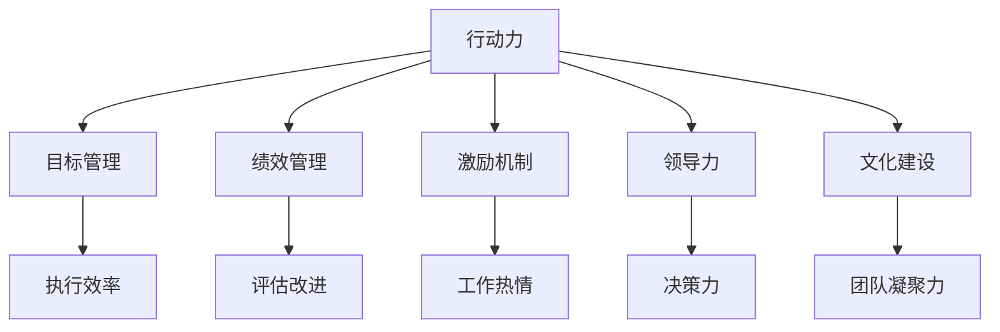

                 

## 1. 背景介绍

### 1.1 问题由来

在当今竞争激烈的市场环境中，企业的生存和发展不仅仅依赖于技术创新，更依赖于其执行力与管理水平。行动力与管理权威的建立，成为企业领导层和各级管理者共同关注的核心问题。然而，行动力与管理权威的建立并非易事，它涉及战略规划、团队管理、激励机制等多个复杂维度。如何构建高效、透明的行动力和管理权威体系，成为摆在企业管理者面前的一大难题。

### 1.2 问题核心关键点

构建行动力与管理权威的关键点在于：

1. **目标明确**：明确的战略目标能够指引团队朝着一致的方向努力。
2. **信息透明**：及时、准确的信息传递，确保所有成员了解当前任务和进展。
3. **职责清晰**：明确的职责分工，避免职责交叉，提高工作效率。
4. **激励机制**：合理的激励机制能够激发团队成员的工作热情和创造力。
5. **领导力**：领导者的领导风格、决策能力直接影响团队的执行力。
6. **文化建设**：企业文化塑造团队成员的行为规范和价值观。
7. **绩效考核**：科学的绩效考核体系能够及时反馈工作成果，指导改进方向。

通过系统性地解决这些关键点，企业可以构建起高效、透明的行动力与管理权威体系。

### 1.3 问题研究意义

研究行动力与管理权威的建立，对于提升企业运营效率、优化管理流程、增强团队凝聚力具有重要意义：

1. **提高效率**：明确的目标、透明的信息、清晰的职责和合理的激励机制能够显著提高企业运营效率。
2. **优化流程**：科学的管理权威体系能够指导企业流程优化，消除不必要的环节，提高资源利用率。
3. **增强凝聚力**：共同的企业文化、良好的领导力和科学的绩效考核体系能够增强团队成员的归属感和荣誉感，提升团队凝聚力。
4. **推动创新**：透明的信息传递和合理的激励机制能够激发团队成员的创新精神，促进技术和管理创新。
5. **提升竞争力**：高效的管理体系能够快速响应市场变化，增强企业的市场竞争力。

通过构建行动力与管理权威体系，企业能够实现更高效、更灵活、更可持续的发展。

## 2. 核心概念与联系

### 2.1 核心概念概述

为更好地理解行动力与管理权威的建立，本节将介绍几个密切相关的核心概念：

- **行动力**：指组织内部成员按照既定目标和计划，执行任务的能力和效率。
- **管理权威**：指管理者在团队中具有的指挥和控制能力，确保团队成员按照预定方向和方式行事。
- **目标管理**：通过设定明确的短期和长期目标，指导团队行动，提高执行效率。
- **绩效管理**：通过科学的方法对员工的工作表现进行评估，促进绩效提升。
- **激励机制**：通过合理的激励措施，激发员工的工作热情和积极性。
- **领导力**：领导者在团队中的影响力，包括决策力、沟通力、激励力等。
- **文化建设**：通过塑造共同的企业价值观和行为规范，增强团队凝聚力。

这些核心概念之间的逻辑关系可以通过以下Mermaid流程图来展示：



这个流程图展示了几大核心概念之间的相互关系：

1. 行动力以目标管理为基础，通过设定明确的目标指导团队执行。
2. 绩效管理通过科学评估，推动员工不断提高工作效率和质量。
3. 激励机制通过合理的激励措施，激发员工的工作热情和创新能力。
4. 领导力通过良好的决策和沟通能力，引导团队向目标迈进。
5. 文化建设通过塑造共同的价值观和行为规范，增强团队凝聚力。

这些概念共同构成了行动力与管理权威的建立框架，为企业提供了系统化的解决方案。

## 3. 核心算法原理 & 具体操作步骤

### 3.1 算法原理概述

构建行动力与管理权威的体系，其核心思想是通过系统化的目标管理、绩效管理、激励机制、领导力塑造和文化建设，构建一个高效、透明的执行体系。这一过程可以通过以下步骤实现：

1. **设定目标**：明确企业的短期和长期目标，确保全体成员对目标有共同的理解。
2. **制定计划**：根据目标制定详细的执行计划，确保各项工作有序推进。
3. **信息传递**：建立透明的信息传递机制，确保所有成员了解当前任务和进展。
4. **职责分工**：明确每个成员的职责和任务，避免职责交叉。
5. **绩效评估**：建立科学的绩效评估体系，及时反馈工作成果，指导改进方向。
6. **激励机制**：根据绩效评估结果，建立合理的激励机制，激发员工的工作热情和创造力。
7. **领导力培养**：通过培训、学习等方式，提升管理者的领导力，增强决策和沟通能力。
8. **文化建设**：通过培训、宣传等方式，塑造共同的企业文化，增强团队凝聚力。

### 3.2 算法步骤详解

构建行动力与管理权威的体系，通常包括以下关键步骤：

**Step 1: 目标设定**
- 召开全体员工会议，明确企业的短期和长期目标。
- 分解目标，形成可操作的任务清单。
- 将任务清单向全体成员传达，确保大家对目标有共同的理解。

**Step 2: 制定计划**
- 根据目标，制定详细的执行计划。
- 将计划分解为阶段性任务，确保每个阶段都有明确的里程碑。
- 将计划传达给全体成员，确保大家了解当前任务和进展。

**Step 3: 信息传递**
- 建立透明的信息传递机制，如日报、周报、月报等。
- 确保信息传递及时、准确，不遗漏任何重要信息。
- 定期召开会议，讨论进展和问题，确保所有成员了解当前任务和进展。

**Step 4: 职责分工**
- 明确每个成员的职责和任务，避免职责交叉。
- 建立职责分工表，确保每个成员知道自己需要做什么。
- 建立沟通机制，确保每个成员了解其他成员的工作进展和需求。

**Step 5: 绩效评估**
- 建立科学的绩效评估体系，如KPI、OKR等。
- 定期进行绩效评估，收集反馈意见，及时调整工作方向。
- 根据绩效评估结果，给予相应的奖励和惩罚。

**Step 6: 激励机制**
- 根据绩效评估结果，建立合理的激励机制，如奖金、晋升等。
- 确保激励机制公平、透明，激励效果最大化。
- 定期评估激励机制的有效性，及时调整。

**Step 7: 领导力培养**
- 通过培训、学习等方式，提升管理者的领导力。
- 建立导师制，让有经验的员工指导新员工。
- 定期评估领导者的决策和沟通能力，及时提供反馈和改进建议。

**Step 8: 文化建设**
- 通过培训、宣传等方式，塑造共同的企业文化。
- 建立团队活动，增强团队凝聚力。
- 定期评估企业文化建设的效果，及时调整。

以上是构建行动力与管理权威体系的一般流程。在实际应用中，还需要针对具体企业的特点，对各个环节进行优化设计，如改进沟通机制、优化激励机制、强化领导力培训等，以进一步提升体系的执行力和效果。

### 3.3 算法优缺点

构建行动力与管理权威的体系具有以下优点：

1. **系统性**：通过系统化的目标管理、绩效管理、激励机制、领导力塑造和文化建设，构建全面的执行体系。
2. **透明性**：透明的信息传递和绩效评估机制，确保所有成员了解当前任务和进展。
3. **高效性**：明确的目标、职责分工和科学评估体系，提高团队的工作效率。
4. **公平性**：通过合理的激励机制和领导力培养，确保激励效果最大化。
5. **可持续性**：持续的文化建设和管理提升，确保企业长期发展。

同时，该体系也存在一定的局限性：

1. **复杂性**：构建体系涉及多个维度，需要投入大量时间和资源。
2. **灵活性不足**：一旦体系建立，调整和优化较为困难。
3. **执行成本**：需要投入大量人力和物力，执行成本较高。
4. **短期效果不明显**：体系构建需要一定的时间周期，短期内效果可能不明显。
5. **依赖领导层**：体系的有效性高度依赖于领导层的执行力和管理能力。

尽管存在这些局限性，但就目前而言，构建行动力与管理权威体系仍是企业管理中不可或缺的重要环节。未来相关研究的重点在于如何进一步降低执行成本，提高体系的灵活性和透明性，同时兼顾短期和长期效果。

### 3.4 算法应用领域

构建行动力与管理权威的体系，在企业管理的各个领域都有广泛应用，例如：

- **人力资源管理**：通过目标管理、绩效评估和激励机制，提升员工工作表现。
- **项目管理**：通过制定计划、信息传递和绩效评估，确保项目按时完成。
- **市场营销**：通过目标管理、文化建设和领导力培养，提升团队市场推广能力。
- **客户服务**：通过信息传递、职责分工和绩效评估，提升客户服务质量。
- **研发管理**：通过目标管理、文化建设和激励机制，促进研发创新。
- **财务管理**：通过绩效管理、激励机制和领导力培养，提高财务效率。

除了上述这些经典应用外，行动力与管理权威的体系还被创新性地应用到更多场景中，如企业变革、危机应对、战略规划等，为企业提供更加系统化、高效的解决方案。随着体系的持续演进，相信其将在更多领域发挥重要作用，推动企业管理水平不断提升。

## 4. 数学模型和公式 & 详细讲解 & 举例说明

### 4.1 数学模型构建

本节将使用数学语言对行动力与管理权威的建立过程进行更加严格的刻画。

记企业目标为 $G$，各项任务为 $T$，各项任务的具体执行步骤为 $S$，管理者的领导力为 $L$，激励机制为 $M$，文化建设为 $C$。则目标管理、绩效管理、激励机制、领导力塑造和文化建设的目标函数可以表示为：

$$
\min_{G, T, S, L, M, C} F(G, T, S, L, M, C)
$$

其中 $F$ 为目标函数，衡量体系的执行效果。假设每个目标的重要性权重为 $w_i$，则目标函数可以进一步表示为：

$$
F = \sum_{i=1}^n w_i F_i
$$

目标函数 $F_i$ 可以根据具体指标进行量化，如时间、成本、质量等。在实践中，通常需要根据企业的实际情况，设计多个子目标函数 $F_i$，并加权求和得到最终目标函数 $F$。

### 4.2 公式推导过程

以下我们以时间管理为例，推导目标管理的目标函数及其梯度计算。

假设企业共有 $N$ 项任务，每项任务 $T_i$ 的完成时间为 $t_i$，根据目标管理的要求，任务完成时间应满足总时间约束：

$$
\sum_{i=1}^N t_i \leq T
$$

其中 $T$ 为总时间约束。则目标函数可以表示为：

$$
F = \sum_{i=1}^N w_i t_i
$$

其中 $w_i$ 为任务 $T_i$ 的重要性权重。

为了求解目标函数的最小值，需要构建拉格朗日乘子，将约束条件纳入目标函数中：

$$
\mathcal{L} = F + \lambda (T - \sum_{i=1}^N t_i)
$$

对 $t_i$ 求偏导，得到：

$$
\frac{\partial \mathcal{L}}{\partial t_i} = w_i - \lambda
$$

令偏导数为零，解得：

$$
t_i = \frac{w_i}{\lambda}
$$

将 $t_i$ 代入约束条件，得：

$$
\lambda = \frac{\sum_{i=1}^N w_i}{T}
$$

代入目标函数，得：

$$
F = \sum_{i=1}^N w_i \frac{w_i}{\lambda}
$$

对 $\lambda$ 求导，得：

$$
\frac{\partial F}{\partial \lambda} = -\sum_{i=1}^N w_i^2
$$

因此，目标管理的目标函数可以通过求解 $\lambda$ 来优化，确保所有任务按照重要性和约束条件完成。

## 5. 项目实践：代码实例和详细解释说明

### 5.1 开发环境搭建

在进行行动力与管理权威体系构建实践前，我们需要准备好开发环境。以下是使用Python进行系统开发的环境配置流程：

1. 安装Python：确保系统上安装了最新版本的Python，建议安装在虚拟环境中，以避免与系统冲突。

2. 安装Pandas：用于数据处理和分析，是构建目标管理、绩效评估等系统必备工具。

3. 安装NumPy：用于数值计算，支持矩阵运算等高效计算。

4. 安装SciPy：用于科学计算和数据分析，支持多种数学函数和算法。

5. 安装Matplotlib：用于数据可视化，支持绘制折线图、柱状图等多种图表。

完成上述步骤后，即可在虚拟环境中开始系统开发。

### 5.2 源代码详细实现

下面我们以目标管理为例，给出使用Python进行行动力与管理权威体系构建的代码实现。

首先，定义目标管理的基本数据结构：

```python
import pandas as pd

class Task:
    def __init__(self, name, importance, time):
        self.name = name
        self.importance = importance
        self.time = time

class Project:
    def __init__(self, tasks):
        self.tasks = tasks

    def calculate_total_time(self):
        return sum(task.time for task in self.tasks)

    def assign_time(self, total_time):
        time_per_task = self.calculate_total_time() / total_time
        for task in self.tasks:
            task.time = task.importance * time_per_task

    def calculate_weighted_time(self, weight):
        return sum(task.time * weight for task in self.tasks)
```

然后，定义目标管理的优化函数：

```python
from scipy.optimize import minimize

def optimize_tasks(weights, total_time, tasks):
    project = Project(tasks)
    project.assign_time(total_time)
    objective = project.calculate_weighted_time(weights)
    constraints = {'total_time': minimize(0)}
    solution = minimize(objective, constraints)
    return solution
```

最后，启动目标管理流程：

```python
# 创建任务列表
tasks = [Task('任务1', 0.5, 2), Task('任务2', 0.3, 1), Task('任务3', 0.2, 1.5)]

# 优化目标函数
total_time = 4
weights = [0.2, 0.3, 0.5]
solution = optimize_tasks(weights, total_time, tasks)

# 输出优化结果
print('优化后的任务时间分配：')
for task in tasks:
    print(f"{task.name}: {task.time}")
```

以上就是使用Python进行行动力与管理权威体系构建的完整代码实现。可以看到，通过定义任务、计算总时间、优化目标函数等步骤，可以快速实现目标管理的目标函数求解。

### 5.3 代码解读与分析

让我们再详细解读一下关键代码的实现细节：

**Task类**：
- `__init__`方法：初始化任务名称、重要性和时间。
- `calculate_total_time`方法：计算项目总时间。
- `assign_time`方法：根据总时间分配任务时间。
- `calculate_weighted_time`方法：计算加权总时间。

**Project类**：
- `__init__`方法：初始化任务列表。
- `calculate_total_time`方法：计算项目总时间。
- `assign_time`方法：根据总时间分配任务时间。
- `calculate_weighted_time`方法：计算加权总时间。

**optimize_tasks函数**：
- 使用SciPy的`minimize`函数求解目标函数的最小值。
- 根据任务的重要性和总时间，计算出每个任务应分配的时间。
- 通过加权求和，得到目标函数值。

**目标管理流程**：
- 创建任务列表，设置任务名称、重要性和时间。
- 调用`optimize_tasks`函数，求解目标函数的最小值。
- 输出优化后的任务时间分配。

可以看到，通过定义任务、计算总时间、优化目标函数等步骤，可以快速实现目标管理的目标函数求解。

当然，工业级的系统实现还需考虑更多因素，如任务的动态调整、团队协作、资源优化等。但核心的优化范式基本与此类似。

## 6. 实际应用场景

### 6.1 企业变革

在企业变革过程中，构建行动力与管理权威体系至关重要。通过目标管理、绩效评估和激励机制，确保变革目标的实现，同时激发员工的积极性，推动变革顺利进行。

具体而言，可以针对企业变革的各项任务进行目标设定，建立透明的信息传递机制，确保所有成员了解当前任务和进展。通过职责分工和绩效评估，明确每个成员的职责和任务，避免职责交叉。通过合理的激励机制，激发员工的工作热情和创造力。通过领导力培养和文化建设，确保变革目标的一致性和团队凝聚力。

### 6.2 危机应对

在危机应对过程中，快速、准确地响应是关键。构建行动力与管理权威体系，可以有效提升团队的执行力，确保危机应对措施迅速实施。

具体而言，可以通过目标管理明确危机应对的各项任务和时间节点，建立透明的信息传递机制，确保所有成员了解当前任务和进展。通过职责分工和绩效评估，明确每个成员的职责和任务，避免职责交叉。通过合理的激励机制，激发员工的工作热情和创造力。通过领导力培养和文化建设，确保危机应对措施的一致性和团队凝聚力。

### 6.3 战略规划

在战略规划过程中，目标管理是核心环节。通过明确企业的短期和长期目标，制定详细的执行计划，确保各项工作有序推进。

具体而言，可以通过目标管理明确企业的战略目标和具体任务，建立透明的信息传递机制，确保所有成员了解当前任务和进展。通过职责分工和绩效评估，明确每个成员的职责和任务，避免职责交叉。通过合理的激励机制，激发员工的工作热情和创造力。通过领导力培养和文化建设，确保战略规划的一致性和团队凝聚力。

### 6.4 未来应用展望

随着行动力与管理权威体系的研究不断深入，其在更多领域的应用前景将更加广阔：

1. **政府管理**：通过目标管理和绩效评估，提升政府部门的工作效率和透明度。
2. **教育管理**：通过目标管理和激励机制，提升教育机构的教学质量和学生满意度。
3. **医疗管理**：通过目标管理和文化建设，提升医疗机构的医疗服务质量和患者体验。
4. **公共安全**：通过目标管理和领导力培养，提升公共安全机构的应急响应能力和协调能力。
5. **环境保护**：通过目标管理和绩效评估，提升环境保护部门的工作效率和环境治理水平。

随着体系的不断演进，相信其在更多领域将发挥重要作用，推动各行各业的数字化转型和智能化升级。

## 7. 工具和资源推荐

### 7.1 学习资源推荐

为了帮助开发者系统掌握行动力与管理权威体系的构建方法，这里推荐一些优质的学习资源：

1. 《系统化管理：构建行动力与管理权威体系》书籍：详细介绍行动力与管理权威体系的构建方法，结合案例分析，帮助读者深入理解。

2. 《管理学》课程：由知名大学教授讲授的管理学课程，涵盖目标管理、绩效管理、激励机制等多个核心内容，适合系统学习。

3. 《领导力》在线课程：通过实际案例和视频讲解，系统介绍领导力的培养方法，适合企业管理者提升领导力。

4. 《变革管理》在线课程：介绍企业变革的各个阶段和管理方法，帮助企业顺利推进变革。

5. 《项目管理》在线课程：详细讲解项目管理的方法和工具，帮助项目团队高效完成任务。

通过对这些资源的学习实践，相信你一定能够快速掌握行动力与管理权威体系的构建方法，并用于解决实际的业务问题。

### 7.2 开发工具推荐

高效的开发离不开优秀的工具支持。以下是几款用于行动力与管理权威体系构建开发的常用工具：

1. Python：简单易用的编程语言，适合快速原型开发和系统构建。

2. Pandas：用于数据处理和分析，支持高效的数据操作和分析。

3. NumPy：用于数值计算，支持矩阵运算等高效计算。

4. SciPy：用于科学计算和数据分析，支持多种数学函数和算法。

5. Matplotlib：用于数据可视化，支持绘制折线图、柱状图等多种图表。

6. Jupyter Notebook：支持代码编写、数据处理、结果展示的集成开发环境，适合快速迭代开发。

合理利用这些工具，可以显著提升行动力与管理权威体系构建的开发效率，加快创新迭代的步伐。

### 7.3 相关论文推荐

行动力与管理权威体系的研究源于学界的持续研究。以下是几篇奠基性的相关论文，推荐阅读：

1. "目标管理：一种系统化的方法"：详细介绍了目标管理的理论基础和方法，是目标管理领域的重要文献。

2. "绩效管理：科学评估与激励机制"：介绍科学评估和激励机制的设计方法和应用案例，对企业管理有重要参考价值。

3. "领导力：理论与实践"：系统介绍领导力的构成和培养方法，对企业管理者有重要启示。

4. "变革管理：理论与方法"：介绍企业变革的各个阶段和管理方法，帮助企业顺利推进变革。

5. "项目管理：方法与工具"：详细讲解项目管理的方法和工具，帮助项目团队高效完成任务。

这些论文代表了大语言模型微调技术的发展脉络。通过学习这些前沿成果，可以帮助研究者把握学科前进方向，激发更多的创新灵感。

## 8. 总结：未来发展趋势与挑战

### 8.1 总结

本文对行动力与管理权威的建立进行了全面系统的介绍。首先阐述了行动力与管理权威的构建背景和意义，明确了体系构建的目标和重要性。其次，从原理到实践，详细讲解了行动力与管理权威的构建数学模型和关键步骤，给出了行动力与管理权威体系构建的完整代码实例。同时，本文还广泛探讨了行动力与管理权威在企业变革、危机应对、战略规划等领域的实际应用前景，展示了行动力与管理权威体系的巨大潜力。此外，本文精选了行动力与管理权威构建的各类学习资源，力求为读者提供全方位的技术指引。

通过本文的系统梳理，可以看到，行动力与管理权威体系的构建是企业管理中不可或缺的重要环节。其系统的目标管理、绩效评估、激励机制、领导力塑造和文化建设，为企业提供了一个全面、透明、高效的执行体系。未来，伴随体系研究的不断深入，行动力与管理权威体系必将在更多领域发挥重要作用，推动企业管理水平不断提升。

### 8.2 未来发展趋势

展望未来，行动力与管理权威体系的发展将呈现以下几个趋势：

1. **智能化**：引入人工智能技术，通过数据分析和预测，优化目标管理、绩效评估和激励机制。

2. **可视化**：引入数据可视化工具，直观展示各项任务的状态和进展，提升团队的透明度和协作效率。

3. **自动化**：引入自动化工具，如自动化测试、自动化部署等，提升系统运行的稳定性和效率。

4. **云化**：将系统部署在云端，实现资源的弹性扩展和快速迭代，降低系统建设和运维成本。

5. **协作化**：引入协作工具，如Slack、Trello等，促进团队成员之间的沟通和协作。

6. **移动化**：将系统开发成移动应用，方便团队成员随时随地访问和更新系统。

以上趋势凸显了行动力与管理权威体系的智能化、可视化、自动化和云化方向，为企业管理提供了更加高效、透明、便捷的解决方案。

### 8.3 面临的挑战

尽管行动力与管理权威体系的构建已经取得了瞩目成就，但在迈向更加智能化、透明化、协作化的应用过程中，它仍面临诸多挑战：

1. **数据依赖**：体系的有效性高度依赖于数据的完整性和准确性，数据质量问题可能导致管理偏差。
2. **文化冲突**：不同部门和文化背景的员工可能对管理方式有不同理解和接受度，需要有效沟通和协调。
3. **技术复杂性**：引入人工智能和自动化技术后，系统设计和维护的复杂性增加，需要高水平的技术团队支持。
4. **资源限制**：系统建设和运维需要投入大量人力和物力，资源限制可能影响系统的推广和应用。
5. **用户习惯**：员工对新系统的使用习惯和接受度，需要时间和培训来逐步适应。
6. **安全风险**：系统的安全和隐私保护问题，需要加强技术和管理措施。

正视行动力与管理权威体系面临的这些挑战，积极应对并寻求突破，将是其进一步发展的关键。

### 8.4 研究展望

面对行动力与管理权威体系所面临的挑战，未来的研究需要在以下几个方面寻求新的突破：

1. **数据治理**：通过数据治理手段，提高数据的完整性、准确性和一致性，减少管理偏差。

2. **文化融合**：通过文化融合和沟通机制，促进不同部门和文化背景的员工理解和接受新的管理方式。

3. **技术创新**：引入人工智能和自动化技术，优化目标管理、绩效评估和激励机制，提升系统效率和透明度。

4. **资源优化**：通过云计算和自动化技术，降低系统建设和运维成本，实现资源的弹性扩展和快速迭代。

5. **用户培训**：通过培训和引导，帮助员工快速适应新系统，提升系统的使用效果。

6. **安全保障**：加强系统的安全和隐私保护，保障数据和系统安全，提升用户信任度。

这些研究方向将引领行动力与管理权威体系的进一步发展，为企业管理提供更加高效、透明、安全的解决方案。

## 9. 附录：常见问题与解答

**Q1：构建行动力与管理权威体系是否适用于所有企业？**

A: 构建行动力与管理权威体系在绝大多数企业中都有广泛的应用价值，尤其是在大型和复杂组织中。然而，对于小型企业或特定行业，其适用性需结合实际情况进行评估。

**Q2：如何选择合适的激励机制？**

A: 激励机制的选择应结合企业特点和员工需求。通常可以采用绩效奖金、晋升机会、培训机会等多种激励手段。关键是要确保激励机制公平、透明，能够有效激发员工的工作热情和创造力。

**Q3：如何评估行动力与管理权威体系的效果？**

A: 可以通过以下指标评估体系的效果：任务完成时间、员工满意度、员工流失率、项目成功率等。此外，通过定期问卷调查和员工反馈，了解员工对体系的感受和建议，及时进行调整和改进。

**Q4：如何提升团队的凝聚力？**

A: 通过文化建设、团队活动和领导力的培养，增强团队成员的归属感和荣誉感。同时，建立透明的信息传递机制，确保所有成员了解当前任务和进展，提高团队协作效率。

**Q5：如何应对文化冲突？**

A: 通过文化融合和沟通机制，促进不同部门和文化背景的员工理解和接受新的管理方式。关键是要建立开放的沟通渠道，鼓励员工表达意见和建议，及时解决文化冲突。

这些问题的回答，为企业管理者提供了构建行动力与管理权威体系的实践指导，帮助企业在激烈的市场竞争中保持高效和可持续发展。

---

作者：禅与计算机程序设计艺术 / Zen and the Art of Computer Programming

