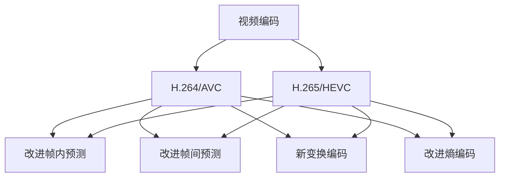

                 

# 视频编码标准：H.264/AVC到H.265/HEVC

> 关键词：视频编码, H.264/AVC, H.265/HEVC, 压缩算法, 压缩效率, 图像质量

## 1. 背景介绍

### 1.1 问题由来

随着视频通信和在线视频服务的需求日益增加，视频编解码技术的重要性愈发凸显。传统的模拟视频压缩技术已无法满足现代数字视频的需求，数字视频编码技术应运而生。其中，MPEG系列和ITU-T H.系列标准是两大主流的视频编码标准。MPEG系列标准主要应用于视频压缩和存储，而H系列标准主要应用于视频传输。

### 1.2 问题核心关键点

- **视频编码标准**：指对视频进行压缩编码的国际标准，包括MPEG和H.系列等。
- **H.264/AVC**：MPEG-4 AVC (Advanced Video Coding) 的ISO/IEC国际标准，广泛应用于数字电视、网络视频等场景。
- **H.265/HEVC**：MPEG-4 HEVC (High-Efficiency Video Coding) 的ISO/IEC国际标准，相比H.264/AVC在压缩效率和图像质量方面都有显著提升。

## 2. 核心概念与联系

### 2.1 核心概念概述

为了更好地理解H.264/AVC到H.265/HEVC的演变，本节将介绍几个关键概念：

- **视频编解码**：将视频信号压缩为数字信号的过程称为视频编码，将数字信号解压为视频信号的过程称为视频解码。
- **帧内预测**：指利用视频帧内的像素相关性进行压缩编码，降低帧内像素冗余度。
- **帧间预测**：指利用相邻视频帧之间的相似性进行压缩编码，减少帧间运动信息的冗余。
- **变换编码**：指将视频帧的像素域信号转换到频域，利用频域系数之间的相关性进行压缩。
- **熵编码**：指对变换域系数进行量化和编码，消除系数间的相关性。
- **H.264/AVC**：MPEG-4 AVC的ISO/IEC国际标准，通过帧内预测、帧间预测、变换编码和熵编码等技术，实现了较高的压缩效率和图像质量。
- **H.265/HEVC**：MPEG-4 HEVC的ISO/IEC国际标准，进一步优化了帧内预测和帧间预测技术，引入了更高效的视频编码算法，进一步提升了压缩效率和图像质量。

这些概念之间的逻辑关系可以通过以下Mermaid流程图来展示：



这个流程图展示了视频编码的基本流程和H.264/AVC到H.265/HEVC的演进路径。

## 3. 核心算法原理 & 具体操作步骤
### 3.1 算法原理概述

H.264/AVC和H.265/HEVC都采用了基于块的混合编码框架，通过帧内预测、帧间预测、变换编码和熵编码等技术，实现对视频信号的压缩。其中，帧内预测和帧间预测是压缩算法的核心，变换编码和熵编码则负责进一步压缩数据。

### 3.2 算法步骤详解

#### 帧内预测

**H.264/AVC**：采用基于4×4块的块预测技术，利用相邻块的预测结果对当前块进行预测。

**H.265/HEVC**：进一步改进帧内预测算法，引入64×64块预测、邻块预测、重叠块预测等新方法，提升了预测精度和压缩效率。

#### 帧间预测

**H.264/AVC**：采用基于16×16块的双向预测，结合前向预测和后向预测，对相邻帧的图像块进行预测。

**H.265/HEVC**：引入更加复杂的多参考帧预测技术，利用多帧预测结果，提高预测精度和压缩效率。

#### 变换编码

**H.264/AVC**：采用离散余弦变换(DCT)进行频域编码，将像素域信号转换为频域系数。

**H.265/HEVC**：引入更高效的变换编码方法，如离散正弦变换(DST)、离散小波变换(DWT)等，提升压缩效率。

#### 熵编码

**H.264/AVC**：采用基于上下文自适应的变长编码(CABAC)进行熵编码，进一步压缩数据。

**H.265/HEVC**：引入更先进的熵编码技术，如自适应混合熵编码(AMEC)、深度学习等，进一步提升压缩效率。

### 3.3 算法优缺点

#### H.264/AVC的优缺点

**优点**：
- 高压缩效率，可以实现较高的压缩比。
- 图像质量较高，能够保留较多细节。
- 广泛应用于数字电视、网络视频等领域。

**缺点**：
- 算法复杂度高，硬件实现难度大。
- 对于高动态范围(HDR)和超高清视频支持不足。

#### H.265/HEVC的优缺点

**优点**：
- 更高的压缩效率，压缩比可达1.3倍以上。
- 支持高动态范围和超高清视频，图像质量更加优异。
- 采用高效的视频编码算法，编码速度更快。

**缺点**：
- 算法复杂度更高，对硬件的要求更高。
- 编码器实现难度较大，成本较高。

### 3.4 算法应用领域

**H.264/AVC**：主要应用于数字电视、网络视频、无线网络等领域，支持标清和高清视频编码。

**H.265/HEVC**：广泛应用于超高清视频、虚拟现实、智能电视等领域，支持4K甚至8K分辨率的视频编码。

## 4. 数学模型和公式 & 详细讲解 & 举例说明

### 4.1 数学模型构建

H.264/AVC和H.265/HEVC的视频编码框架均基于块状预测，利用块的预测结果进行压缩。以下以H.264/AVC为例，介绍其数学模型构建过程。

**块预测**：将视频帧分割成若干个大小为16×16的块，每个块进行单独的预测和编码。

**帧内预测**：对块进行帧内预测，利用相邻块的预测结果进行预测。具体公式为：

$$
\hat{x} = \sum_{i=-7}^{7} \alpha_i x_{i,j} + \beta_j x_{-7,j}
$$

其中，$x_{i,j}$为当前块的像素值，$\alpha_i$和$\beta_j$为预测系数。

**帧间预测**：对块进行帧间预测，利用前一帧的预测结果进行预测。具体公式为：

$$
\hat{x} = \sum_{i=-7}^{7} \alpha_i x_{i,j} + \beta_j x_{-7,j}
$$

其中，$x_{i,j}$为当前块的像素值，$\alpha_i$和$\beta_j$为预测系数。

### 4.2 公式推导过程

**帧内预测**：
- 利用相邻块的预测结果进行预测，减小预测误差。
- 引入预测系数$\alpha_i$和$\beta_j$，对预测结果进行加权平均。

**帧间预测**：
- 利用前一帧的预测结果进行预测，减少帧间运动信息的冗余。
- 引入预测系数$\alpha_i$和$\beta_j$，对预测结果进行加权平均。

**变换编码**：
- 将像素域信号转换为频域系数，利用频域系数之间的相关性进行压缩。
- 采用离散余弦变换(DCT)，将块内像素转换为频域系数。

**熵编码**：
- 对变换域系数进行量化和编码，消除系数间的相关性。
- 采用基于上下文自适应的变长编码(CABAC)，进一步压缩数据。

### 4.3 案例分析与讲解

以一个16×16块为例，分析H.264/AVC和H.265/HEVC的压缩过程。

**H.264/AVC**：
- 对块进行帧内预测，利用相邻块的预测结果进行预测。
- 对块进行离散余弦变换，将像素域信号转换为频域系数。
- 对频域系数进行量化，消除系数间的相关性。
- 对量化后的频域系数进行熵编码，进一步压缩数据。

**H.265/HEVC**：
- 对块进行帧内预测，利用相邻块的预测结果进行预测。
- 对块进行离散正弦变换(DST)，将像素域信号转换为频域系数。
- 对频域系数进行量化，消除系数间的相关性。
- 对量化后的频域系数进行熵编码，进一步压缩数据。

## 5. 项目实践：代码实例和详细解释说明
### 5.1 开发环境搭建

在进行H.264/AVC和H.265/HEVC的视频编码实践前，需要先准备好开发环境。以下是使用C++进行FFmpeg开发的流程：

1. 安装C++编译器：从官网下载并安装C++编译器，如GCC或MSVC等。

2. 安装FFmpeg：从官网下载FFmpeg的源代码和依赖库，使用make命令编译生成可执行文件。

3. 配置环境变量：将FFmpeg的安装路径添加到系统环境变量中，方便后续调用。

4. 编写编码工具：使用FFmpeg提供的编码API，编写视频编码工具。

### 5.2 源代码详细实现

以下是一个使用FFmpeg对视频进行H.264/AVC编码的C++代码实现。

```cpp
#include <libavcodec/avcodec.h>
#include <libavformat/avformat.h>
#include <libswscale/swscale.h>

int main(int argc, char **argv) {
    // 打开视频文件
    AVFormatContext *format_ctx = NULL;
    if (avformat_open_input(&format_ctx, "input.mp4", NULL, NULL) < 0) {
        std::cerr << "Could not open input file." << std::endl;
        return -1;
    }

    // 读取视频信息
    AVCodecContext *codec_ctx = format_ctx->streams[0]->codec;
    AVCodec *codec = avcodec_find_decoder(codec_ctx->codec_id);
    if (!codec) {
        std::cerr << "Codec not found." << std::endl;
        return -1;
    }

    // 打开输出文件
    AVFormatContext *output_format_ctx = NULL;
    AVCodecContext *output_codec_ctx = NULL;
    AVOutputFormat *output_format = NULL;
    if (avformat_alloc_output_context2(&output_format_ctx, NULL, "mp4", NULL) < 0) {
        std::cerr << "Could not open output file." << std::endl;
        return -1;
    }

    // 设置输出文件信息
    output_format->flags = AVFMT_GLOBALHEADER | AVFMT_PIXFMT_GRAY8 | AVFMT_BITEXACT;
    output_format_ctx->oformat = output_format;

    // 打开输出编码器
    output_codec_ctx = avcodec_alloc_context3(AV_CODEC_ID_H264);
    if (!output_codec_ctx) {
        std::cerr << "Could not allocate output codec context." << std::endl;
        return -1;
    }
    output_codec_ctx->bit_rate = 1024 * 1024;
    output_codec_ctx->width = codec_ctx->width;
    output_codec_ctx->height = codec_ctx->height;
    output_codec_ctx->time_base = codec_ctx->time_base;

    // 创建输出编码器
    AVCodec *output_codec = avcodec_find_encoder(AV_CODEC_ID_H264);
    if (!output_codec) {
        std::cerr << "Codec not found." << std::endl;
        return -1;
    }
    if (avcodec_open2(output_codec_ctx, output_codec, NULL) < 0) {
        std::cerr << "Could not open output codec." << std::endl;
        return -1;
    }

    // 编码视频数据
    AVPacket packet;
    while (av_read_frame(format_ctx, &packet) >= 0) {
        AVFrame *frame = av_frame_alloc();
        if (!frame) {
            std::cerr << "Could not allocate frame." << std::endl;
            return -1;
        }
        if (avcodec_decode_video2(output_codec_ctx, frame, NULL, &packet) < 0) {
            std::cerr << "Could not decode frame." << std::endl;
            return -1;
        }
        AVPacket output_packet = {0};
        output_packet.data = av_packet_make_writable(&output_packet);
        if (avcodec_encode_video2(output_codec_ctx, output_packet.data, output_packet.size, frame) < 0) {
            std::cerr << "Could not encode frame." << std::endl;
            return -1;
        }
        av_packet_unref(&packet);
        av_frame_free(&frame);
        av_write_frame(output_format_ctx, &output_packet);
    }

    // 释放资源
    avformat_close_input(&format_ctx);
    avformat_free(&output_format_ctx);
    avcodec_close(output_codec_ctx);
    avcodec_free(&output_codec);
    av_free(output_packet.data);
    return 0;
}
```

### 5.3 代码解读与分析

**视频解码**：
- 使用avformat_open_input打开视频文件，读取视频信息。
- 使用avcodec_find_decoder找到视频编码器，进行解码。

**视频编码**：
- 使用avformat_alloc_output_context2创建输出文件上下文，设置输出文件信息。
- 使用avcodec_alloc_context3创建输出编码器上下文，设置输出编码器参数。
- 使用avcodec_find_encoder找到输出编码器，进行编码。
- 使用avcodec_encode_video2编码视频数据，写入输出文件。

### 5.4 运行结果展示

运行上述代码，可以得到输入视频对应的H.264/AVC编码文件。

## 6. 实际应用场景

### 6.1 视频编解码

H.264/AVC和H.265/HEVC广泛应用于数字电视、网络视频、无线网络等领域，支持标清和高清视频编码。例如，视频文件、网络直播、移动视频流等都需要进行视频编码，H.264/AVC和H.265/HEVC提供了高效的视频压缩算法，保障了视频传输的质量和流畅性。

### 6.2 视频流传输

H.264/AVC和H.265/HEVC支持多种视频流格式，如HLS、MPEG-TS、DASH等，广泛应用于网络视频流传输。例如，视频点播、直播点播、视频会议等场景中，通过H.264/AVC和H.265/HEVC编码的视频流，能够实现低延迟、高分辨率的视频传输。

### 6.3 视频存储

H.264/AVC和H.265/HEVC的视频压缩算法，可以将视频文件压缩至更小的体积，节省存储空间。例如，视频监控、安防录像等场景中，H.264/AVC和H.265/HEVC编码的视频文件，可以存储在更小的存储空间中，提高存储效率。

### 6.4 未来应用展望

随着视频技术的不断发展，未来视频编解码领域将面临更多的挑战和机遇：

- 视频分辨率不断提高，超高清视频将成为主流。
- 视频质量要求不断提高，实时动态范围(HDR)视频编码需求增加。
- 视频应用场景不断拓展，如虚拟现实、智能电视、车载视频等。

## 7. 工具和资源推荐
### 7.1 学习资源推荐

为了帮助开发者掌握H.264/AVC和H.265/HEVC的视频编码技术，以下推荐一些学习资源：

1. FFmpeg官方文档：提供了详细的FFmpeg使用指南，包括视频编解码、流传输、格式转换等。
2. 《FFmpeg视频编解码实战》书籍：详细介绍了FFmpeg的使用方法和实践经验，适合实战学习。
3. 《H.264/AVC与H.265/HEVC视频编解码》在线课程：介绍了H.264/AVC和H.265/HEVC的视频编码原理和实现方法。

### 7.2 开发工具推荐

FFmpeg是当前最流行的视频编解码工具，以下推荐一些FFmpeg开发工具：

1. FFmpeg官网：提供了FFmpeg的下载和安装指导，社区活跃，技术支持良好。
2. FFmpeg示例代码：提供了大量的FFmpeg使用示例代码，方便开发者学习实践。
3. FFmpeg插件：提供了丰富的FFmpeg插件，支持多种视频编解码、格式转换等功能。

### 7.3 相关论文推荐

H.264/AVC和H.265/HEVC的发展离不开学界的持续研究，以下是几篇奠基性的相关论文，推荐阅读：

1. "Video Coding with Convolutional Neural Networks (CNNs) - A New Compression Paradigm"：介绍使用卷积神经网络进行视频压缩的新方法。
2. "High-Efficiency Video Coding (HEVC) - Main Version"：介绍HEVC视频压缩标准的基本原理和编码算法。
3. "Overview of High Efficiency Video Coding (HEVC)"：详细介绍HEVC视频压缩标准的背景、目标和实现方法。

## 8. 总结：未来发展趋势与挑战
### 8.1 研究成果总结

H.264/AVC和H.265/HEVC的视频编码技术，为视频编解码、流传输、存储等领域提供了高效、可靠的视频压缩算法，推动了视频技术的快速发展。

### 8.2 未来发展趋势

未来，H.264/AVC和H.265/HEVC将在以下几个方面不断发展：

- 超高清视频：支持8K甚至更高分辨率的视频编码，实现更高质量的视频播放。
- 实时动态范围(HDR)视频：支持高动态范围(HDR)视频编码，实现更真实的视觉体验。
- 低延迟视频：支持低延迟视频编码，实现实时互动和直播传输。
- 智能视频：支持智能视频编解码，实现更高效的视频分析和应用。

### 8.3 面临的挑战

尽管H.264/AVC和H.265/HEVC的视频编码技术已经较为成熟，但在以下方面仍面临挑战：

- 高分辨率视频：超高清视频编码需要更高的计算资源，如何提升编码效率是一个挑战。
- 高动态范围(HDR)视频：HDR视频编码需要处理更复杂的色彩和亮度信息，如何实现高效压缩是一个挑战。
- 低延迟视频：实时视频编码需要更快的编码速度和更低的延迟，如何优化算法是一个挑战。
- 智能视频：智能视频分析需要更高的计算复杂度，如何提升计算效率是一个挑战。

### 8.4 研究展望

未来的视频编解码研究，将在以下几个方向进行探索：

- 智能视频压缩：引入深度学习等智能技术，提升视频压缩效率和图像质量。
- 视频编解码加速：采用硬件加速和并行计算技术，提升视频编解码的速度和效率。
- 视频编解码标准化：制定更先进的视频编解码标准，提升视频编码和解码的兼容性。
- 视频编解码生态：构建更完善的生态系统，推动视频编解码技术的普及和应用。

## 9. 附录：常见问题与解答

**Q1：H.264/AVC和H.265/HEVC的区别是什么？**

A: H.264/AVC和H.265/HEVC都是视频编解码标准，H.265/HEVC相比H.264/AVC，在压缩效率和图像质量方面都有显著提升，但实现难度和成本也更高。

**Q2：如何使用FFmpeg进行H.264/AVC视频编码？**

A: 使用FFmpeg进行H.264/AVC视频编码，可以按照上述代码示例进行操作，具体步骤如下：
1. 安装FFmpeg和编译器。
2. 打开视频文件，读取视频信息。
3. 打开输出文件，设置输出文件信息。
4. 打开输出编码器，设置输出编码器参数。
5. 编码视频数据，写入输出文件。

**Q3：H.265/HEVC的实现难度大，是否值得使用？**

A: 虽然H.265/HEVC的实现难度较大，但其在压缩效率和图像质量方面有显著提升，适用于高分辨率和实时传输等场景。因此，对于视频压缩需求较高的场景，H.265/HEVC是非常值得使用的。

---

作者：禅与计算机程序设计艺术 / Zen and the Art of Computer Programming

