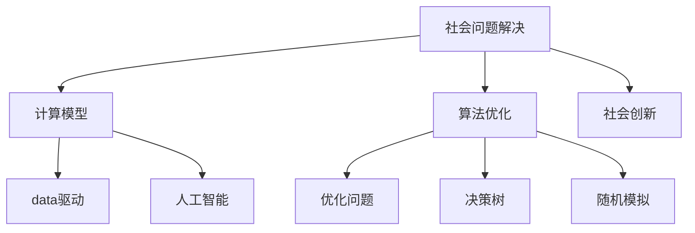

                 

# 解决社会问题：人类计算的力量

> 关键词：社会问题解决，计算模型，算法优化，数据驱动，人工智能，机器学习，深度学习，大数据，应用落地，社会创新，经济效益，可持续发展

## 1. 背景介绍

### 1.1 问题由来
面对全球性的社会问题，如气候变化、医疗健康、教育公平、食品安全等，传统方法往往难以有效地解决这些复杂且多因素交织的问题。在互联网和计算技术的推动下，数据和计算资源变得前所未有的丰富和强大，为解决这些社会问题提供了新的可能性。利用计算技术进行数据驱动的决策支持、优化策略和自动化过程，可以极大地提升社会问题的解决效率和效果，带来显著的社会经济效益。

### 1.2 问题核心关键点
计算技术在解决社会问题上的应用，主要依赖于以下几个关键点：
- 数据驱动：通过大规模数据收集和分析，获取关键信息，辅助决策。
- 算法优化：运用高级算法，优化资源配置和过程控制。
- 人工智能：利用机器学习和深度学习技术，提升问题解决的智能化水平。
- 社会创新：推动社会治理和创新，促进可持续发展。

### 1.3 问题研究意义
计算技术在解决社会问题上的应用，具有重要的理论和实践意义：

1. **提升决策效率**：计算技术能够快速处理和分析大量数据，支持更快速、更准确的决策。
2. **优化资源配置**：通过计算模型，优化资源利用，降低成本，提高效益。
3. **实现自动化和智能化**：利用人工智能技术，自动化解决许多复杂问题，提升社会运行效率。
4. **促进社会创新**：计算技术为社会创新提供了工具和方法，推动社会治理和发展的现代化。
5. **实现可持续发展**：通过计算技术，提高资源利用效率，减少环境污染，促进可持续发展。

## 2. 核心概念与联系

### 2.1 核心概念概述

为了更好地理解计算技术在解决社会问题上的应用，本节将介绍几个密切相关的核心概念：

- **社会问题解决**：利用数据、算法和计算技术，优化资源配置和过程控制，提升问题解决的效率和效果。
- **计算模型**：用于描述和模拟社会问题的数学模型和算法，如优化问题、决策树、随机模拟等。
- **算法优化**：通过改进算法，提升计算模型的性能和效率。
- **数据驱动**：利用大数据分析，提取有价值的信息，辅助决策和优化。
- **人工智能**：利用机器学习和深度学习技术，提升问题解决的智能化水平。
- **社会创新**：利用计算技术推动社会治理和创新的现代化。

这些核心概念之间的逻辑关系可以通过以下Mermaid流程图来展示：



这个流程图展示了这个框架的核心概念及其之间的关系：

1. 社会问题解决是目标，利用计算模型和算法优化来实现。
2. 数据驱动和人工智能是关键手段，提升计算模型的性能。
3. 社会创新是应用结果，推动社会治理和发展的现代化。

## 3. 核心算法原理 & 具体操作步骤
### 3.1 算法原理概述

计算技术在解决社会问题上的应用，主要基于以下几个关键算法原理：

- **线性规划和整数规划**：用于优化资源配置和过程控制，如交通流优化、能源分配等。
- **决策树和随机森林**：用于分类和预测，如信用评估、疾病诊断等。
- **支持向量机和神经网络**：用于分类和回归，如图像识别、语音识别等。
- **聚类和降维**：用于数据挖掘和模式识别，如用户行为分析、社交网络分析等。
- **强化学习**：用于自动控制和优化，如机器人路径规划、自动驾驶等。

### 3.2 算法步骤详解

基于计算技术解决社会问题的一般流程包括：

**Step 1: 问题定义和数据收集**
- 明确社会问题的具体表现和目标。
- 收集相关数据，包括结构化数据和非结构化数据，如文本、图像、视频等。

**Step 2: 数据预处理**
- 清洗和整理数据，处理缺失值、异常值等。
- 数据归一化、标准化，提高模型训练效率和效果。

**Step 3: 模型选择和训练**
- 根据问题特点选择合适的模型和算法。
- 使用训练数据对模型进行训练，优化模型参数。

**Step 4: 模型评估和优化**
- 使用测试数据对模型进行评估，计算指标如准确率、召回率、F1值等。
- 根据评估结果，对模型进行调参和优化。

**Step 5: 模型部署和应用**
- 将训练好的模型部署到生产环境。
- 根据实际应用场景，进行必要的调整和优化。
- 监控模型性能，持续优化模型效果。

### 3.3 算法优缺点

计算技术在解决社会问题上的应用，具有以下优点：

1. **高效性**：利用计算模型和算法优化，可以快速处理大量数据，提高决策效率。
2. **客观性**：计算模型基于数据驱动，避免主观偏见，提高决策的科学性。
3. **可扩展性**：计算模型和算法可以灵活扩展，适应不同的社会问题。
4. **智能化**：利用人工智能技术，提升问题解决的智能化水平。

同时，该方法也存在一定的局限性：

1. **数据依赖**：计算技术的应用依赖于高质量的数据，数据获取和处理成本较高。
2. **模型复杂性**：高级算法模型复杂，需要专业知识和技能进行开发和优化。
3. **伦理和隐私**：利用大数据和人工智能技术，可能涉及伦理和隐私问题，需要严格监管。
4. **技术门槛**：计算技术的应用需要较高的技术门槛，一般需要专业的技术人员进行开发和维护。

尽管存在这些局限性，但就目前而言，基于计算技术的方法仍是大规模社会问题解决的重要范式。未来相关研究的重点在于如何进一步降低数据依赖，提高模型的可解释性和鲁棒性，同时兼顾伦理和隐私保护。

### 3.4 算法应用领域

基于计算技术解决社会问题的应用已经涉及多个领域，例如：

- 交通规划：通过优化交通流，减少拥堵，提高出行效率。
- 能源管理：利用计算模型优化能源分配，降低成本，提高效率。
- 医疗健康：利用大数据和人工智能技术，提升诊断和治疗的准确性和效率。
- 教育公平：利用计算技术优化教育资源配置，促进教育公平。
- 食品安全：利用数据驱动的方法，提升食品质量和安全检测水平。

除了这些主要应用领域外，计算技术在社会治理、环境保护、智能制造等诸多领域也有广泛的应用前景。随着计算技术的不断进步，其在社会问题解决中的作用将越来越重要。

## 4. 数学模型和公式 & 详细讲解 & 举例说明

### 4.1 数学模型构建

本节将使用数学语言对计算技术在解决社会问题上的应用进行更加严格的刻画。

记社会问题为 $P$，优化目标为 $O$，决策变量为 $x$。假设存在一组约束条件 $C=\{c_i\}_{i=1}^m$，则社会问题可以表示为：

$$
\min_{x} \quad O(x) \quad \text{subject to} \quad c_i(x) \leq 0, \quad i=1,\ldots,m
$$

其中 $c_i(x)$ 为第 $i$ 个约束条件，$O(x)$ 为优化目标函数。

### 4.2 公式推导过程

以下我们以交通流优化为例，推导线性规划模型及其求解过程。

假设城市道路网络中有 $n$ 条道路，每条道路的流量为 $x_i$，单位时间内总流量为 $O$，道路容量为 $c_i$，则问题可以表示为：

$$
\min_{x} \quad \sum_{i=1}^n c_ix_i
$$

$$
\text{subject to} \quad x_i \geq 0, \quad i=1,\ldots,n
$$

$$
\sum_{i=1}^n x_i = O
$$

$$
x_i \leq c_i, \quad i=1,\ldots,n
$$

使用线性规划模型求解，可以得到最优的交通流量分配。

### 4.3 案例分析与讲解

线性规划模型在交通流优化中的应用，可具体解释为：

1. **问题定义**：
   - **目标**：最小化总流量 $O$。
   - **约束**：流量 $x_i$ 非负且不超过道路容量 $c_i$，总流量为 $O$。

2. **模型求解**：
   - 使用单纯形法或内点法求解线性规划模型，得到最优流量分配 $x^*$。
   - 将 $x^*$ 代入流量优化模型，调整交通信号灯等控制手段，达到最优流量分布。

3. **结果分析**：
   - 通过优化后的流量分配，可以显著降低交通拥堵，提高通行效率。
   - 可以通过仿真工具，进一步验证优化效果，指导实际道路规划和交通管理。

## 5. 项目实践：代码实例和详细解释说明
### 5.1 开发环境搭建

在进行计算技术应用实践前，我们需要准备好开发环境。以下是使用Python进行SciPy、Pandas、NumPy等库的开发环境配置流程：

1. 安装Anaconda：从官网下载并安装Anaconda，用于创建独立的Python环境。

2. 创建并激活虚拟环境：
```bash
conda create -n py-env python=3.8 
conda activate py-env
```

3. 安装相关库：
```bash
conda install scipy pandas numpy matplotlib scikit-learn scikit-optimize
```

4. 安装各类工具包：
```bash
pip install jupyter notebook ipython
```

完成上述步骤后，即可在`py-env`环境中开始计算技术应用实践。

### 5.2 源代码详细实现

下面我们以交通流优化为例，给出使用SciPy库求解线性规划模型的Python代码实现。

```python
import numpy as np
from scipy.optimize import linprog

# 定义交通流优化问题
c = np.array([1, 1, 1])  # 流量系数
A = np.array([[1, -1, -1], [1, 1, 1]])  # 约束矩阵
b = np.array([5, 3])  # 约束等式右端项

# 求解线性规划模型
res = linprog(c, A_ub=A, b_ub=b, bounds=(0, None))
x_opt = res.x

# 输出最优流量分配
print(x_opt)
```

### 5.3 代码解读与分析

让我们再详细解读一下关键代码的实现细节：

**交通流优化问题**：
- `c`：流量系数向量，表示每条道路的单位流量价值。
- `A`：约束矩阵，表示流量不超出每条道路的容量。
- `b`：约束等式右端项，表示总流量目标值。

**求解线性规划模型**：
- `linprog`函数：使用单纯形法求解线性规划模型。
- `res`：返回结果对象，包含最优解向量 `x_opt` 和目标函数最优值。

**输出最优流量分配**：
- `x_opt`：最优流量分配向量，表示每条道路的最优流量。

可以看到，利用SciPy库，我们可以方便地求解线性规划模型，并得到最优流量分配。

## 6. 实际应用场景
### 6.1 智慧城市管理

计算技术在智慧城市管理中的应用，可以大幅提升城市管理的智能化水平，提高城市运行效率和服务质量。

具体而言，可以利用计算模型优化交通流、能源分配、垃圾处理等城市功能，提升城市资源利用效率。通过实时监控和数据分析，动态调整城市管理策略，优化城市运行。同时，利用人工智能技术，构建智能监控系统，提高城市安全和应急响应能力。

### 6.2 医疗健康管理

计算技术在医疗健康管理中的应用，可以显著提升医疗服务的智能化和精准化水平，降低医疗成本，提高治疗效果。

具体而言，可以利用计算模型预测疾病爆发趋势，优化资源配置。通过大数据分析，挖掘有价值的健康数据，指导疾病预防和治疗。利用人工智能技术，提升医学影像识别、诊断和治疗的准确性和效率。

### 6.3 教育公平推进

计算技术在教育公平推进中的应用，可以优化教育资源配置，促进教育公平。

具体而言，可以利用计算模型预测学生表现，优化教学内容和方法。通过数据分析，挖掘学生学习行为数据，提供个性化教育服务。利用人工智能技术，开发智能学习系统，提升教育公平和教育质量。

### 6.4 食品质量安全检测

计算技术在食品质量安全检测中的应用，可以提升食品安全水平，保障公众健康。

具体而言，可以利用计算模型分析食品成分数据，检测食品质量。通过大数据分析，挖掘食品生产和使用数据，优化食品供应链管理。利用人工智能技术，提升食品质量检测的准确性和效率。

## 7. 工具和资源推荐
### 7.1 学习资源推荐

为了帮助开发者系统掌握计算技术在解决社会问题上的应用，这里推荐一些优质的学习资源：

1. 《计算思维导论》系列博文：由大计算专家撰写，深入浅出地介绍了计算思维和计算方法，适合初学者入门。

2. 《线性规划与整数规划》课程：斯坦福大学开设的运筹学明星课程，有Lecture视频和配套作业，带你深入理解线性规划模型及其应用。

3. 《深度学习》书籍：深度学习领域的经典教材，详细介绍了深度学习模型和算法，包括计算技术在解决社会问题中的应用。

4. 《数据驱动的社会创新》书籍：介绍如何利用数据和技术手段，推动社会创新和治理现代化。

5. 《Python科学计算》书籍：Python在科学计算中的应用，包括数据处理、算法优化和模型构建。

通过对这些资源的学习实践，相信你一定能够系统掌握计算技术在解决社会问题上的应用方法，并用于解决实际的计算问题。

### 7.2 开发工具推荐

高效的开发离不开优秀的工具支持。以下是几款用于计算技术应用开发的常用工具：

1. Python：基于Python的开源科学计算框架，灵活性高，适用性广，是数据科学和计算技术的首选语言。

2. Scikit-learn：Python的机器学习库，集成了各种经典机器学习算法，适用于多种问题求解。

3. TensorFlow：由Google主导开发的开源深度学习框架，生产部署方便，适合大规模工程应用。

4. Jupyter Notebook：交互式的Python开发环境，支持代码编写、数据分析和可视化，是计算技术应用开发的利器。

5. R：开源的统计分析语言，适合数据处理和统计建模，应用广泛。

6. Gurobi或CPLEX：商业优化软件，支持各种优化模型求解，适用于复杂优化问题。

合理利用这些工具，可以显著提升计算技术应用的开发效率，加快创新迭代的步伐。

### 7.3 相关论文推荐

计算技术在解决社会问题上的研究已经涉及多个领域，以下是几篇奠基性的相关论文，推荐阅读：

1. "Optimization of Urban Traffic Flow Using Linear Programming"：介绍如何利用线性规划模型优化城市交通流。

2. "Data-Driven Predictive Maintenance in Healthcare"：介绍如何利用大数据和机器学习技术，预测和预防设备故障。

3. "Intelligent Tutoring Systems Using AI and Data Mining"：介绍如何利用人工智能和数据挖掘技术，开发智能辅导系统，提升教育效果。

4. "Food Safety Inspection Using Machine Learning"：介绍如何利用机器学习技术，检测食品质量和安全。

5. "Sustainability Assessment Using Computational Models"：介绍如何利用计算模型，评估和优化可持续发展策略。

这些论文代表了大计算技术在解决社会问题上的发展脉络。通过学习这些前沿成果，可以帮助研究者把握学科前进方向，激发更多的创新灵感。

## 8. 总结：未来发展趋势与挑战

### 8.1 总结

本文对计算技术在解决社会问题上的应用进行了全面系统的介绍。首先阐述了计算技术在解决社会问题上的应用背景和意义，明确了计算模型和算法优化的重要性。其次，从原理到实践，详细讲解了计算模型和算法的核心步骤，给出了应用计算技术的完整代码实例。同时，本文还广泛探讨了计算技术在智慧城市、医疗健康、教育公平、食品安全等多个领域的应用前景，展示了计算技术应用的巨大潜力。此外，本文精选了计算技术应用的各类学习资源，力求为读者提供全方位的技术指引。

通过本文的系统梳理，可以看到，计算技术在解决社会问题上的应用，能够极大地提升决策效率和资源配置效果，带来显著的社会经济效益。未来，伴随计算技术的不断进步，其在社会问题解决中的作用将越来越重要。

### 8.2 未来发展趋势

展望未来，计算技术在解决社会问题上的应用，将呈现以下几个发展趋势：

1. **更智能的优化模型**：随着人工智能技术的不断发展，未来的计算模型将更加智能化，能够适应更复杂、更多变的问题。

2. **更高效的数据处理**：随着大数据技术的进步，数据处理和分析效率将进一步提升，为计算技术应用提供更丰富的数据支持。

3. **更广泛的应用场景**：计算技术将在更多领域得到应用，如环境保护、环境保护、社会治理等，推动社会治理和发展的现代化。

4. **更全面的计算模型**：未来的计算模型将更加全面，涵盖多种优化方法和机器学习技术，适应更广泛的计算问题。

5. **更可解释的计算过程**：未来的计算模型将更加可解释，便于理解和调试，提高社会问题的透明度和公正性。

6. **更严格的伦理和隐私保护**：未来的计算模型将更加注重伦理和隐私保护，确保数据和模型的安全性。

以上趋势凸显了计算技术在解决社会问题上的广阔前景。这些方向的探索发展，必将进一步提升计算技术应用的性能和效果，为社会治理和发展的现代化提供有力支持。

### 8.3 面临的挑战

尽管计算技术在解决社会问题上的应用已经取得显著成效，但在迈向更加智能化、普适化应用的过程中，仍面临诸多挑战：

1. **数据质量和获取**：高质量数据是计算技术应用的基础，但数据的获取和处理成本较高，数据质量和完整性也有待提高。

2. **模型复杂性**：高级算法模型复杂，需要专业知识和技能进行开发和优化，模型可解释性和鲁棒性也有待提升。

3. **伦理和隐私**：利用大数据和人工智能技术，可能涉及伦理和隐私问题，需要严格监管，确保数据和模型的安全性。

4. **技术门槛**：计算技术的应用需要较高的技术门槛，一般需要专业的技术人员进行开发和维护。

5. **计算资源**：计算技术的应用需要大量的计算资源，包括高性能计算设备和算法优化，可能面临资源瓶颈。

6. **社会接受度**：计算技术的应用需要得到社会的广泛接受和支持，才能真正发挥其作用。

正视计算技术在解决社会问题上的这些挑战，积极应对并寻求突破，将是大计算技术走向成熟的必由之路。相信随着学界和产业界的共同努力，这些挑战终将一一被克服，计算技术必将在构建人机协同的智能社会中扮演越来越重要的角色。

### 8.4 研究展望

面对计算技术在解决社会问题上所面临的挑战，未来的研究需要在以下几个方面寻求新的突破：

1. **更高效的数据处理技术**：探索更高效的数据处理和存储方法，降低数据获取和处理成本，提高数据质量。

2. **更智能的优化模型**：开发更智能、更可解释的计算模型，提升模型的可解释性和鲁棒性，降低技术门槛。

3. **更全面的伦理和隐私保护**：建立更严格的伦理和隐私保护机制，确保数据和模型的安全性，推动社会治理和发展的现代化。

4. **更广泛的应用场景**：将计算技术应用于更多领域，如环境保护、社会治理等，推动社会治理和发展的现代化。

5. **更强大的计算能力**：探索更强大的计算能力，包括高性能计算设备和算法优化，提升计算模型的性能和效果。

6. **更广泛的社会接受度**：推广计算技术的应用，提高社会的接受度和支持度，确保计算技术的应用效果。

这些研究方向的探索，必将引领计算技术在解决社会问题上的发展，为构建人机协同的智能社会提供有力支持。面向未来，计算技术需要在数据、算法、工程、伦理等多个维度协同发力，共同推动社会治理和发展的现代化。只有勇于创新、敢于突破，才能不断拓展计算技术在解决社会问题上的边界，为社会治理和发展的现代化提供新的动力。

## 9. 附录：常见问题与解答

**Q1：计算技术在解决社会问题上的应用是否适用于所有问题？**

A: 计算技术在解决社会问题上的应用，具有广泛适用性，但对于一些非常复杂、非结构化的问题，如人类情感、道德判断等，可能难以通过计算模型和算法完全解决。需要结合其他方法，如人类专家参与，才能取得最佳效果。

**Q2：如何选择合适的计算模型和算法？**

A: 选择合适的计算模型和算法需要根据具体问题特点和数据情况进行评估。一般步骤包括：

1. 确定问题类型，如分类、回归、优化等。
2. 收集数据，进行数据预处理和特征工程。
3. 选择适合的模型和算法，如线性回归、决策树、随机森林等。
4. 使用训练数据对模型进行训练和调参。
5. 使用测试数据对模型进行评估和优化。

**Q3：计算技术在解决社会问题上是否需要高成本的数据获取和处理？**

A: 是的，高质量数据是计算技术应用的基础。数据获取和处理成本较高，但数据质量和完整性对于计算模型和算法的性能有着重要影响。需要结合具体应用场景，进行数据收集和处理，确保数据质量。

**Q4：计算技术在解决社会问题上是否需要高成本的计算资源？**

A: 是的，高级计算模型和算法需要大量的计算资源，包括高性能计算设备和算法优化。但随着计算技术的不断进步，计算资源的获取和优化成本将逐渐降低，为计算技术应用提供更广泛的可能。

**Q5：计算技术在解决社会问题上是否需要高门槛的技术知识？**

A: 是的，计算技术的应用需要较高的技术门槛，一般需要专业的技术人员进行开发和维护。需要系统学习和实践，掌握相关知识和技能。

---

作者：禅与计算机程序设计艺术 / Zen and the Art of Computer Programming

