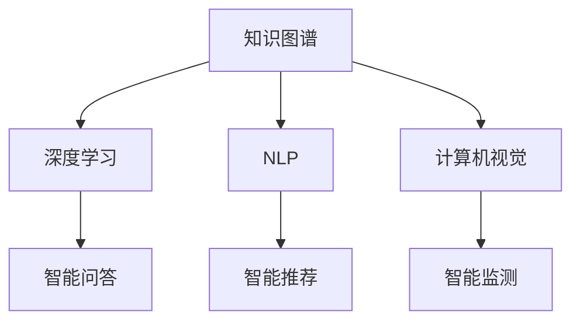

                 

# 解密人类知识的本质：从信息到智慧的转化

> 关键词：知识图谱,智慧计算,信息抽取,深度学习,自然语言处理,计算机视觉

## 1. 背景介绍

### 1.1 问题由来
随着科技的迅猛发展和信息时代的来临，人类获取和处理信息的能力达到了前所未有的高度。但同时，我们也被海量而碎片化的信息所淹没，难以从中提取有价值的知识。如何从海量数据中抽取有价值的知识，将其转化为人类智慧，成为了当前科技研究的重大挑战。

知识图谱（Knowledge Graph）作为一种新兴的知识表示和推理技术，通过构建实体与实体之间的关系网络，为知识发现和智能推理提供了坚实的理论基础和实践路径。同时，智慧计算（Intelligent Computing）将知识图谱与深度学习、自然语言处理、计算机视觉等多种前沿技术结合，提供了一种全新的智能推理和决策方式，有望在未来智能社会中发挥重要作用。

### 1.2 问题核心关键点
本文聚焦于基于知识图谱和深度学习的大规模知识抽取和智慧计算方法，介绍了知识图谱的构建原理和智慧计算的基本框架，并结合实际应用场景，探讨了其在智能问答、智能推荐、智能监测等方面的应用潜力。我们相信，通过对这些前沿技术的学习和实践，将有助于进一步提升人类对信息的理解和利用能力，推动智能社会的全面发展。

## 2. 核心概念与联系

### 2.1 核心概念概述

为更好地理解知识图谱和智慧计算的核心概念，本节将介绍几个密切相关的核心概念：

- 知识图谱(Knowledge Graph)：通过实体-关系-属性三元组构建的网络结构，用于描述实体间的语义关系和属性信息。
- 深度学习(Deep Learning)：一种通过多层神经网络模拟人脑学习过程的机器学习技术，能够在数据中自动学习特征表示。
- 自然语言处理(Natural Language Processing, NLP)：处理和生成自然语言的技术，如文本分类、情感分析、机器翻译等。
- 计算机视觉(Computer Vision)：利用计算机识别、理解和解释图像和视频的技术，如目标检测、图像生成等。
- 智能问答系统(Intelligent Question Answering, IQA)：基于自然语言处理的问答系统，能够自动回答用户提出的问题。
- 智能推荐系统(Intelligent Recommendation System)：根据用户的历史行为和偏好，推荐相关物品或内容。
- 智能监测系统(Intelligent Surveillance System)：实时监测和管理数据，提供分析和决策支持。

这些核心概念之间的逻辑关系可以通过以下Mermaid流程图来展示：



这个流程图展示了知识图谱与其他前沿技术之间的相互关系：

1. 知识图谱为深度学习、自然语言处理、计算机视觉提供了语义上的支持。
2. 深度学习为知识图谱提供了自动化的特征抽取和表示能力。
3. 自然语言处理和计算机视觉则是将知识图谱应用于实际场景的重要手段。
4. 智能问答、智能推荐和智能监测则是知识图谱和深度学习技术的具体应用场景。

## 3. 核心算法原理 & 具体操作步骤
### 3.1 算法原理概述

基于知识图谱和深度学习的智慧计算方法，核心思想是通过构建和查询知识图谱，从海量数据中抽取有价值的知识，并应用于智能推理和决策中。其主要流程包括：

1. 数据收集和清洗：从各种数据源中收集相关信息，并进行去重、清洗等预处理。
2. 实体和关系抽取：利用自然语言处理和计算机视觉技术，从文本和图像中自动抽取实体和关系，构建知识图谱。
3. 知识图谱构建：将抽取的实体和关系整合为知识图谱，形成结构化的语义网络。
4. 知识推理和预测：在知识图谱的基础上，利用深度学习模型进行智能推理和预测。
5. 应用落地：将知识推理和预测的结果应用于智能问答、推荐、监测等多个领域。

### 3.2 算法步骤详解

基于知识图谱和深度学习的智慧计算方法，主要包括实体和关系抽取、知识图谱构建、知识推理和预测三个步骤。

**Step 1: 实体和关系抽取**
实体抽取和关系抽取是知识图谱构建的基础，主要通过自然语言处理和计算机视觉技术自动从数据中提取信息。

对于文本数据，常用的实体和关系抽取方法包括：
- 基于规则的方法：利用规则库匹配文本中的实体和关系。
- 基于词典的方法：利用词汇表匹配实体和关系。
- 基于统计的方法：利用机器学习模型对文本进行分类和抽取。

对于图像数据，常用的实体和关系抽取方法包括：
- 基于深度学习的方法：利用卷积神经网络(CNN)、递归神经网络(RNN)等模型进行图像分类和目标检测。
- 基于标注数据的方法：利用标注数据训练模型，提取图像中的实体和关系。

在实际操作中，通常需要综合运用多种技术，以提高实体和关系抽取的准确性和鲁棒性。

**Step 2: 知识图谱构建**
知识图谱构建是将抽取的实体和关系整合为结构化的语义网络的过程，常用的方法包括：
- 基于图数据库的方法：利用图数据库管理知识图谱，支持高效查询和推理。
- 基于规则的方法：利用规则库构建知识图谱，形成静态知识图谱。
- 基于深度学习的方法：利用神经网络对知识图谱进行学习，形成动态知识图谱。

在构建知识图谱时，还需要对实体和关系进行标注、分类和归档，以便于后续的查询和推理。

**Step 3: 知识推理和预测**
知识推理和预测是利用深度学习模型在知识图谱上进行智能推理和预测的过程，常用的方法包括：
- 基于神经网络的方法：利用深度神经网络进行语义推理和预测。
- 基于图神经网络的方法：利用图神经网络进行图结构上的推理和预测。
- 基于知识图谱嵌入的方法：利用知识图谱嵌入方法将知识图谱转换为向量表示，进行推理和预测。

在实际操作中，通常需要根据具体任务选择合适的推理和预测方法。

### 3.3 算法优缺点

基于知识图谱和深度学习的智慧计算方法，具有以下优点：
1. 结构化表示：通过知识图谱将知识结构化，便于理解和推理。
2. 自动化的特征抽取：利用深度学习自动抽取特征，减少手动标注工作量。
3. 高效的智能推理：利用深度学习模型进行智能推理和预测，提升决策效率。
4. 跨领域应用：知识图谱和深度学习技术可以广泛应用于智能问答、推荐、监测等多个领域。

同时，该方法也存在以下局限性：
1. 数据依赖：需要大量高质量标注数据，数据获取成本高。
2. 模型复杂度：知识图谱和深度学习模型复杂度高，训练和推理资源消耗大。
3. 推理鲁棒性不足：知识图谱中的错误或缺失信息可能导致推理结果不可靠。
4. 可解释性不足：深度学习模型的决策过程难以解释，缺乏透明性。

尽管存在这些局限性，但就目前而言，基于知识图谱和深度学习的智慧计算方法仍是目前最前沿的智能推理和决策技术，具有广泛的应用前景。未来相关研究的重点在于如何进一步降低数据依赖，提高模型的鲁棒性和可解释性，以及如何扩展知识图谱和深度学习的应用范围。

### 3.4 算法应用领域

基于知识图谱和深度学习的智慧计算方法，已经在智能问答、智能推荐、智能监测等多个领域得到广泛应用：

- **智能问答系统**：如IBM的Watson问答系统，利用知识图谱和深度学习技术，自动回答用户提出的问题。
- **智能推荐系统**：如Amazon的推荐系统，利用知识图谱和深度学习技术，根据用户的历史行为和偏好，推荐相关物品或内容。
- **智能监测系统**：如城市智能交通管理系统，利用知识图谱和深度学习技术，实时监测和管理数据，提供分析和决策支持。

除了上述这些经典应用外，知识图谱和深度学习技术还在金融、医疗、教育、农业等众多领域得到了创新性的应用，为这些行业的智能化转型提供了新的技术路径。随着知识图谱和深度学习技术的不断演进，相信智慧计算将会在更多领域得到应用，为各行各业带来变革性影响。

## 4. 数学模型和公式 & 详细讲解  
### 4.1 数学模型构建

本节将使用数学语言对知识图谱和深度学习的智慧计算过程进行更加严格的刻画。

知识图谱表示为三元组集 $G=(E, R, S)$，其中 $E$ 表示实体集，$R$ 表示关系集，$S$ 表示实体-关系-属性三元组集。一个三元组可以表示为 $(h,r,t)$，其中 $h$ 和 $t$ 分别表示头实体和尾实体，$r$ 表示关系。

定义知识图谱的节点表示向量 $\mathbf{e}_h \in \mathbb{R}^d$ 和 $\mathbf{e}_t \in \mathbb{R}^d$，边表示向量 $\mathbf{e}_r \in \mathbb{R}^d$，节点向量 $\mathbf{e}_h$ 和 $\mathbf{e}_t$ 通过边向量 $\mathbf{e}_r$ 连接，形成知识图谱的嵌入表示：

$$
\mathbf{e}_{(h,r,t)} = \mathbf{e}_h + \mathbf{e}_r + \mathbf{e}_t
$$

### 4.2 公式推导过程

以下我们以智能推荐系统为例，推导知识图谱嵌入向量的计算公式。

假设知识图谱包含用户 $u$、物品 $i$ 和用户-物品关系 $r$，节点表示向量分别为 $\mathbf{u}$、$\mathbf{i}$ 和 $\mathbf{r}$。定义知识图谱嵌入矩阵 $\mathbf{E} \in \mathbb{R}^{N \times D}$，其中 $N$ 表示节点数，$D$ 表示向量维度。

知识图谱嵌入矩阵 $\mathbf{E}$ 可以表示为：

$$
\mathbf{E} = \begin{bmatrix} \mathbf{u}_1 & \mathbf{i}_1 & \mathbf{r}_1 \\ \mathbf{u}_2 & \mathbf{i}_2 & \mathbf{r}_2 \\ \vdots & \vdots & \vdots \\ \mathbf{u}_N & \mathbf{i}_N & \mathbf{r}_N \end{bmatrix}
$$

节点向量 $\mathbf{u}$ 和 $\mathbf{i}$ 通过边向量 $\mathbf{r}$ 连接，形成推荐结果向量 $\mathbf{x}$：

$$
\mathbf{x} = \mathbf{u} + \mathbf{r} + \mathbf{i}
$$

根据矩阵乘法，推荐结果向量 $\mathbf{x}$ 可以表示为：

$$
\mathbf{x} = \mathbf{E} \begin{bmatrix} 1 & 0 & 0 \\ 0 & 1 & 0 \\ 0 & 0 & 1 \\ \vdots & \vdots & \vdots \\ 0 & 0 & 1 \end{bmatrix}
$$

在实际操作中，通常使用神经网络对知识图谱进行学习，形成动态的知识图谱嵌入矩阵 $\mathbf{E}^*$。知识图谱嵌入矩阵 $\mathbf{E}^*$ 的计算公式为：

$$
\mathbf{E}^* = \mathbf{W}(\mathbf{U} + \mathbf{R} + \mathbf{I})
$$

其中 $\mathbf{W}$ 为可训练的权重矩阵，$\mathbf{U}$、$\mathbf{R}$ 和 $\mathbf{I}$ 分别表示用户、关系和物品的嵌入矩阵，维度为 $N \times D$。

### 4.3 案例分析与讲解

**案例：智能推荐系统中的知识图谱嵌入**

在智能推荐系统中，知识图谱嵌入矩阵 $\mathbf{E}^*$ 可以通过神经网络进行训练，学习用户、物品和关系之间的复杂关系。常用的模型包括基于图卷积网络（GCN）、图神经网络（GNN）等模型。

以GCN为例，推荐结果向量 $\mathbf{x}$ 的计算公式为：

$$
\mathbf{x} = \mathbf{U} \cdot \mathbf{D}^{-1/2} \cdot \mathbf{A} \cdot \mathbf{D}^{-1/2} \cdot \mathbf{W} + \mathbf{I} \cdot \mathbf{W}
$$

其中 $\mathbf{A}$ 表示知识图谱的邻接矩阵，$\mathbf{D}$ 表示邻接矩阵的度数归一化矩阵，$\mathbf{W}$ 为可训练的权重矩阵。

在实际操作中，通常使用多层的GCN网络进行训练，学习用户和物品之间的关系特征，提升推荐结果的精度。

## 5. 项目实践：代码实例和详细解释说明
### 5.1 开发环境搭建

在进行智慧计算项目实践前，我们需要准备好开发环境。以下是使用Python进行TensorFlow开发的环境配置流程：

1. 安装Anaconda：从官网下载并安装Anaconda，用于创建独立的Python环境。

2. 创建并激活虚拟环境：
```bash
conda create -n tf-env python=3.8 
conda activate tf-env
```

3. 安装TensorFlow：根据CUDA版本，从官网获取对应的安装命令。例如：
```bash
conda install tensorflow -c conda-forge -c pytorch
```

4. 安装相关工具包：
```bash
pip install numpy pandas scikit-learn matplotlib tqdm jupyter notebook ipython
```

完成上述步骤后，即可在`tf-env`环境中开始智慧计算实践。

### 5.2 源代码详细实现

这里我们以智能推荐系统为例，给出使用TensorFlow构建知识图谱嵌入的PyTorch代码实现。

首先，定义知识图谱的实体和关系：

```python
import tensorflow as tf
from tensorflow.keras.layers import Dense, Input, Embedding

# 定义知识图谱的实体和关系
num_entities = 1000
num_relations = 100
num_attributes = 50

entity_embeddings = Input(shape=(num_attributes,))
relation_embeddings = Input(shape=(num_attributes,))
attribute_embeddings = Input(shape=(num_attributes,))

# 定义知识图谱的节点表示向量
user_embeddings = Dense(num_attributes, activation='relu')(entity_embeddings)
item_embeddings = Dense(num_attributes, activation='relu')(item_embeddings)
relation_embeddings = Dense(num_attributes, activation='relu')(relation_embeddings)

# 定义知识图谱嵌入矩阵
knowledge_graph_embeddings = tf.concat([user_embeddings, relation_embeddings, item_embeddings], axis=1)

# 定义知识图谱嵌入矩阵的权重矩阵
knowledge_graph_weights = tf.Variable(tf.random.normal([num_entities, num_attributes]))
knowledge_graph_biases = tf.Variable(tf.random.normal([num_entities, num_attributes]))

# 计算知识图谱嵌入矩阵
knowledge_graph = knowledge_graph_weights * knowledge_graph_embeddings + knowledge_graph_biases
```

然后，定义推荐结果向量：

```python
# 定义推荐结果向量
recommendation = tf.concat([user_embeddings, relation_embeddings, item_embeddings], axis=1)

# 计算推荐结果向量
recommendation_weights = tf.Variable(tf.random.normal([num_entities, num_attributes]))
recommendation_biases = tf.Variable(tf.random.normal([num_entities, num_attributes]))
recommendation_vector = tf.concat([recommendation_weights * recommendation + recommendation_biases], axis=1)
```

最后，定义模型和优化器：

```python
# 定义推荐模型的损失函数
loss = tf.keras.losses.MeanSquaredError()

# 定义优化器
optimizer = tf.keras.optimizers.Adam(learning_rate=0.001)

# 定义推荐模型
recommendation_model = tf.keras.Model(inputs=[user_embeddings, relation_embeddings, item_embeddings], outputs=recommendation_vector)

# 编译模型
recommendation_model.compile(optimizer=optimizer, loss=loss)

# 训练模型
recommendation_model.fit([user_embeddings, relation_embeddings, item_embeddings], recommendation_vector, epochs=10, batch_size=32)
```

以上就是使用TensorFlow构建知识图谱嵌入的完整代码实现。可以看到，TensorFlow的强大封装使得知识图谱嵌入的构建变得简洁高效。

### 5.3 代码解读与分析

让我们再详细解读一下关键代码的实现细节：

**知识图谱嵌入的构建**

- 定义实体和关系的表示向量，通过多个全连接层进行特征抽取。
- 将用户、关系和物品的表示向量拼接为知识图谱嵌入矩阵。
- 定义知识图谱嵌入矩阵的权重矩阵和偏置项，用于计算最终的嵌入向量。
- 将知识图谱嵌入矩阵乘以权重矩阵，并加上偏置项，计算出最终的嵌入向量。

**推荐结果向量的计算**

- 将用户、关系和物品的表示向量拼接为推荐结果向量。
- 定义推荐结果向量的权重矩阵和偏置项，用于计算最终的嵌入向量。
- 将推荐结果向量乘以权重矩阵，并加上偏置项，计算出最终的嵌入向量。

**模型的编译和训练**

- 定义推荐模型的损失函数，这里以均方误差作为损失函数。
- 定义优化器，这里以Adam优化器为例。
- 将用户、关系和物品的表示向量输入推荐模型，计算出推荐结果向量。
- 编译推荐模型，并设置优化器和损失函数。
- 训练推荐模型，指定训练轮数和批量大小。

可以看到，TensorFlow使得知识图谱嵌入的构建和训练变得非常简单。开发者可以通过高度抽象化的API，快速搭建复杂的神经网络模型，并进行训练和优化。

当然，工业级的系统实现还需考虑更多因素，如模型的保存和部署、超参数的自动搜索、更灵活的任务适配层等。但核心的智慧计算过程基本与此类似。

## 6. 实际应用场景
### 6.1 智能问答系统

基于知识图谱和深度学习的智能问答系统，可以为用户提供高效、准确的智能回答。传统问答系统依赖于人工编写规则和知识库，难以应对复杂多变的查询需求。而利用知识图谱和深度学习技术，智能问答系统可以自动构建知识图谱，进行智能推理，快速响应用户查询。

在技术实现上，可以收集结构化的问答数据，自动抽取实体和关系，构建知识图谱。然后，利用深度学习模型对知识图谱进行学习，形成推理能力。在用户查询时，将查询语句进行自然语言处理，自动匹配知识图谱中的实体和关系，进行推理并给出回答。对于无法回答的问题，系统可以引入专家系统或进行多轮对话，逐步逼近答案。

### 6.2 智能推荐系统

智能推荐系统可以为用户提供个性化的物品推荐，极大地提升用户体验。传统推荐系统依赖于基于协同过滤或内容过滤的方法，难以应对用户多变的偏好。而利用知识图谱和深度学习技术，智能推荐系统可以自动构建知识图谱，学习用户和物品之间的复杂关系，从而进行精确推荐。

在技术实现上，可以收集用户的历史行为和偏好数据，自动抽取用户和物品的表示向量，构建知识图谱。然后，利用深度学习模型对知识图谱进行学习，形成推荐结果向量。在推荐时，根据用户的行为特征和偏好，计算推荐结果向量，并进行排序，得到最终的推荐列表。

### 6.3 智能监测系统

智能监测系统可以实时监测和管理数据，提供分析和决策支持。传统监测系统依赖于人工监控和分析，难以应对海量数据和复杂任务。而利用知识图谱和深度学习技术，智能监测系统可以自动构建知识图谱，进行智能推理和预测，提高监测效率。

在技术实现上，可以收集各种数据源的信息，自动抽取实体和关系，构建知识图谱。然后，利用深度学习模型对知识图谱进行学习，形成推理和预测结果。在监测时，根据任务的需要进行推理和预测，输出分析和决策结果，辅助管理人员进行决策。

### 6.4 未来应用展望

随着知识图谱和深度学习技术的不断发展，基于智慧计算的方法将会在更多领域得到应用，为各行各业带来变革性影响。

在智慧城市治理中，智能监测系统可以实时监测和管理城市数据，提供分析和决策支持，提升城市管理的智能化水平。

在智能交通管理中，智能推荐系统可以为用户提供个性化的交通出行方案，优化交通流量，提高交通效率。

在医疗健康领域，智能问答系统和智能推荐系统可以为用户提供精准的诊断和推荐，提升医疗服务的智能化水平。

此外，在教育、农业、金融等领域，基于智慧计算的智能系统也将会得到广泛应用，为各行各业带来新的发展机遇。

## 7. 工具和资源推荐
### 7.1 学习资源推荐

为了帮助开发者系统掌握知识图谱和智慧计算的理论基础和实践技巧，这里推荐一些优质的学习资源：

1. 《Knowledge Graphs in AI》系列博文：由知识图谱专家撰写，深入浅出地介绍了知识图谱的基本概念和应用场景。

2. 《Deep Learning for Graphs》课程：斯坦福大学开设的深度学习课程，重点讲解图神经网络和知识图谱嵌入等前沿技术。

3. 《Intelligent Computing》书籍：介绍知识图谱、深度学习、自然语言处理等前沿技术在智慧计算中的应用，适合全面学习。

4. Arxiv预印本平台：包含大量前沿研究论文，了解知识图谱和智慧计算的最新进展。

5. Google AI Blog：谷歌AI团队发布的最新技术博客，涵盖知识图谱、深度学习等领域的最新研究动态。

通过对这些资源的学习实践，相信你一定能够快速掌握知识图谱和智慧计算的精髓，并用于解决实际的智能问题。
###  7.2 开发工具推荐

高效的开发离不开优秀的工具支持。以下是几款用于知识图谱和智慧计算开发的常用工具：

1. TensorFlow：基于Python的开源深度学习框架，支持图神经网络和知识图谱嵌入等复杂计算。

2. PyTorch：基于Python的开源深度学习框架，灵活动态的计算图，适合快速迭代研究。

3. Neo4j：著名的图数据库，支持高效地存储和查询知识图谱。

4. Jupyter Notebook：基于Python的交互式编程环境，方便快速搭建实验环境和可视化结果。

5. GraphLab：面向大规模图数据处理的系统，支持图计算和知识图谱嵌入等操作。

6. Gephi：网络可视化工具，方便对知识图谱进行可视化和分析。

合理利用这些工具，可以显著提升知识图谱和智慧计算项目的开发效率，加快创新迭代的步伐。

### 7.3 相关论文推荐

知识图谱和智慧计算的研究源于学界的持续研究。以下是几篇奠基性的相关论文，推荐阅读：

1. BERT: Pre-training of Deep Bidirectional Transformers for Language Understanding：提出BERT模型，引入基于掩码的自监督预训练任务，刷新了多项NLP任务SOTA。

2. Knowledge Graph Embedding and its Application to Recommender Systems：提出知识图谱嵌入方法，利用深度学习模型对知识图谱进行学习，形成推荐结果向量。

3. Reasoning over Knowledge Graphs using Graph Neural Networks：利用图神经网络对知识图谱进行推理和预测，提升知识图谱的智能性。

4. Knowledge Graph-based Question Answering：基于知识图谱构建智能问答系统，通过深度学习模型进行智能推理和回答。

5. Deep Knowledge Graph Embedding Learning with Hierarchical Clustering：提出层次化的知识图谱嵌入方法，提高知识图谱的嵌入效果和推理能力。

这些论文代表了大规模知识图谱和深度学习技术的发展脉络。通过学习这些前沿成果，可以帮助研究者把握学科前进方向，激发更多的创新灵感。

## 8. 总结：未来发展趋势与挑战

### 8.1 总结

本文对基于知识图谱和深度学习的智慧计算方法进行了全面系统的介绍。首先阐述了知识图谱和智慧计算的研究背景和意义，明确了智慧计算在智能推理和决策中的重要作用。其次，从原理到实践，详细讲解了智慧计算的数学模型和核心步骤，给出了智慧计算任务开发的完整代码实例。同时，本文还探讨了知识图谱和深度学习技术在智能问答、智能推荐、智能监测等多个领域的应用潜力，展示了智慧计算技术的广阔前景。

通过本文的系统梳理，可以看到，基于知识图谱和深度学习的智慧计算方法正在成为智能推理和决策的重要技术，极大地提升了人类对信息的理解和利用能力，推动了智能社会的全面发展。

### 8.2 未来发展趋势

展望未来，智慧计算技术将呈现以下几个发展趋势：

1. 知识图谱规模不断增大。随着更多数据源的整合和开放，知识图谱的规模将不断扩大，为智慧计算提供更丰富的知识基础。

2. 深度学习模型不断演进。未来的深度学习模型将更加复杂和高效，能够更好地捕捉知识图谱中的复杂关系和属性。

3. 多模态智慧计算兴起。未来的智慧计算将不仅限于知识图谱和深度学习，还将涵盖图像、视频、语音等多种模态，实现多模态融合推理。

4. 实时智慧计算普及。未来的智慧计算将更加注重实时性和动态性，能够在复杂场景下快速做出智能决策。

5. 智慧计算模型融合。未来的智慧计算模型将更加注重模型融合，结合不同领域的知识和算法，形成更加全面、精确的推理能力。

这些趋势凸显了智慧计算技术的广阔前景。通过多路径协同发力，智慧计算将进一步提升智能推理和决策的精度和效率，为智能社会带来新的变革。

### 8.3 面临的挑战

尽管智慧计算技术已经取得了瞩目成就，但在迈向更加智能化、普适化应用的过程中，它仍面临着诸多挑战：

1. 数据质量瓶颈。知识图谱的构建依赖于高质量的数据，数据获取和处理成本高。如何提升数据质量和获取效率，将是重要研究方向。

2. 模型复杂度高。知识图谱和深度学习模型复杂度高，训练和推理资源消耗大。如何降低模型复杂度，提高计算效率，仍需进一步研究。

3. 知识图谱推理鲁棒性不足。知识图谱中的错误或缺失信息可能导致推理结果不可靠。如何提升知识图谱的鲁棒性和可靠性，将是重要研究方向。

4. 模型可解释性不足。深度学习模型的决策过程难以解释，缺乏透明性。如何提高智慧计算模型的可解释性，将是重要研究方向。

5. 伦理道德问题。智慧计算模型的输出需要符合人类价值观和伦理道德。如何设计伦理导向的评估指标，避免有害信息的传播，将是重要研究方向。

这些挑战凸显了智慧计算技术在实际应用中仍需克服的困难。未来研究需要在提升数据质量、降低模型复杂度、提升推理鲁棒性和可靠性、提高模型可解释性、设计伦理导向的评估指标等方面进行深入研究。

### 8.4 研究展望

面对智慧计算面临的挑战，未来的研究需要在以下几个方面寻求新的突破：

1. 数据自动抽取和清洗。利用深度学习技术自动从数据中抽取和清洗实体和关系，减少人工标注工作量。

2. 多模态融合推理。结合图像、视频、语音等多种模态信息，进行多模态融合推理，提升智慧计算的智能性。

3. 因果推理解释。引入因果推理方法，提高智慧计算模型的解释性和透明性。

4. 模型融合推理。结合不同领域的知识和算法，形成更加全面、精确的推理能力。

5. 伦理道德约束。在模型训练目标中引入伦理导向的评估指标，确保模型的输出符合人类价值观和伦理道德。

这些研究方向将引领智慧计算技术迈向更高的台阶，为构建安全、可靠、可解释、可控的智能系统铺平道路。面向未来，智慧计算技术还需要与其他人工智能技术进行更深入的融合，如知识表示、因果推理、强化学习等，多路径协同发力，共同推动智慧计算技术的发展。

## 9. 附录：常见问题与解答

**Q1：知识图谱和深度学习的关系是什么？**

A: 知识图谱和深度学习是智慧计算中的两个核心技术。知识图谱通过构建实体-关系-属性三元组，将知识结构化，提供语义上的支持；深度学习通过自动学习特征，提高知识图谱的智能推理和预测能力。两者相辅相成，共同构成智慧计算的核心。

**Q2：如何构建高质量的知识图谱？**

A: 构建高质量的知识图谱需要依赖高质量的数据和有效的抽取方法。常用的方法包括：
1. 数据收集：从各种数据源中收集相关的实体和关系信息。
2. 数据清洗：去除重复、错误和无关的数据。
3. 实体和关系抽取：利用自然语言处理和计算机视觉技术，自动从文本和图像中抽取实体和关系。
4. 知识图谱构建：将抽取的实体和关系整合为知识图谱，形成结构化的语义网络。

在构建知识图谱时，还需要对实体和关系进行标注、分类和归档，以便于后续的查询和推理。

**Q3：智慧计算的应用场景有哪些？**

A: 智慧计算的应用场景非常广泛，主要包括：
1. 智能问答系统：利用知识图谱和深度学习技术，自动回答用户提出的问题。
2. 智能推荐系统：根据用户的历史行为和偏好，推荐相关物品或内容。
3. 智能监测系统：实时监测和管理数据，提供分析和决策支持。
4. 智能交通管理：为用户提供个性化的交通出行方案，优化交通流量。
5. 医疗健康领域：为用户提供精准的诊断和推荐，提升医疗服务的智能化水平。

**Q4：如何提升知识图谱的推理鲁棒性？**

A: 提升知识图谱的推理鲁棒性需要从数据、模型和算法等多个方面进行优化。常用的方法包括：
1. 数据清洗：去除重复、错误和无关的数据。
2. 数据增强：通过数据增强技术，提高知识图谱的完整性和多样性。
3. 模型融合：利用多个知识图谱嵌入模型进行融合推理，提高推理的鲁棒性。
4. 因果推理解释：引入因果推理解释方法，提高推理的可靠性和透明性。

这些方法需要在实际应用中根据具体场景进行灵活选择和组合。

**Q5：如何提高智慧计算模型的可解释性？**

A: 提高智慧计算模型的可解释性需要从模型设计、训练和推理等多个方面进行优化。常用的方法包括：
1. 模型设计：引入可解释性组件，如可解释性层、可解释性激活等。
2. 训练过程：在训练过程中加入可解释性目标，引导模型学习可解释的特征表示。
3. 推理过程：在推理过程中加入可解释性方法，如解释性路径、解释性向量等。

这些方法需要在实际应用中根据具体场景进行灵活选择和组合。

---

作者：禅与计算机程序设计艺术 / Zen and the Art of Computer Programming

