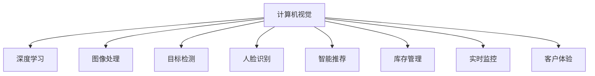

                 

# 计算机视觉在零售业中的创新应用

> 关键词：计算机视觉, 零售业, 自动化, 智能推荐, 库存管理, 实时监控, 客户体验, 深度学习

## 1. 背景介绍

### 1.1 问题由来
近年来，随着零售行业的数字化转型加速，计算机视觉技术在其中的创新应用层出不穷。从智能货架到自动补货，从库存监控到客户体验优化，计算机视觉在零售业的各个环节都发挥着关键作用。然而，技术的迅速迭代和数据量的爆炸式增长，对开发者和零售商都提出了更高的要求。如何在有限资源下，最大化计算机视觉技术在零售业中的效益，成为当下迫切需要解决的问题。

### 1.2 问题核心关键点
计算机视觉技术在零售业中的应用，主要围绕以下几个核心关键点展开：

- 提高运营效率：通过自动化、智能化手段，优化库存管理、补货、盘点等流程，减少人力成本和运营时间。
- 提升客户体验：利用人脸识别、行为分析等技术，提供个性化推荐、导购、防盗等增值服务，增强顾客满意度。
- 优化营销策略：借助视觉分析技术，深入洞察消费者行为和需求，精准制定营销方案，提升销售转化率。
- 强化质量控制：通过图像识别和质量检测技术，实时监控商品品质，确保产品质量和一致性。

这些关键点共同构成了计算机视觉在零售业中的核心价值，并驱动了相关技术的不断创新和发展。

### 1.3 问题研究意义
研究计算机视觉在零售业中的应用，不仅有助于推动零售行业实现数字化、智能化转型，还有助于优化供应链管理，提升用户体验，促进零售业的整体竞争力和可持续发展。具体意义包括：

- 降低运营成本：通过技术自动化，减少人工操作，降低运营费用和错误率。
- 提高决策精度：利用大数据和深度学习技术，提供更精准的分析和决策支持。
- 增强市场响应：快速准确地获取市场反馈和消费者行为数据，及时调整策略。
- 强化品牌形象：通过高质量的视觉内容和智能推荐，提升品牌影响力和顾客忠诚度。

## 2. 核心概念与联系

### 2.1 核心概念概述

为更好地理解计算机视觉技术在零售业中的应用，本节将介绍几个密切相关的核心概念：

- 计算机视觉(Computer Vision)：利用计算机技术模拟人类视觉系统，进行图像识别、物体检测、场景分析等操作。
- 深度学习(Deep Learning)：一种基于神经网络的机器学习范式，通过多层非线性变换，实现特征提取和模式识别。
- 图像处理(Image Processing)：对原始图像进行增强、去噪、分割等预处理操作，提高后续分析的准确性和效率。
- 目标检测(Object Detection)：在图像中定位并识别出特定对象，常用于货架监控、库存盘点等场景。
- 人脸识别(Face Recognition)：通过深度学习模型，识别并验证人脸信息，用于顾客身份验证、行为分析等。
- 智能推荐(Intelligent Recommendation)：基于用户行为和商品属性，推荐最适合的商品，提升销售转化率。
- 库存管理(Inventory Management)：通过计算机视觉技术监控商品数量和状态，实时调整补货策略，降低库存成本。
- 实时监控(Real-time Monitoring)：利用摄像头和图像分析，实时监控场景，提供实时数据支持。
- 客户体验(Customer Experience)：通过视觉技术和智能服务，提升顾客购物体验，增强品牌忠诚度。

这些核心概念之间的逻辑关系可以通过以下Mermaid流程图来展示：



这个流程图展示了计算机视觉技术在零售业中的核心概念及其之间的关系：

1. 计算机视觉作为基础，通过深度学习、图像处理等技术手段，提供图像分析能力。
2. 目标检测、人脸识别等技术，在特定场景下应用计算机视觉，实现自动化和智能化。
3. 智能推荐、库存管理等应用，则直接利用计算机视觉的分析结果，优化零售业务流程。
4. 实时监控和客户体验，通过计算机视觉技术提供实时数据支持，提升用户互动体验。

## 3. 核心算法原理 & 具体操作步骤
### 3.1 算法原理概述

计算机视觉在零售业的应用，通常基于以下算法原理：

- **图像采集与预处理**：利用摄像头、传感器等设备，采集商品、货架、顾客等场景的实时图像数据，并进行去噪、增强、分割等预处理操作，提高图像质量。
- **目标检测**：在预处理后的图像中，应用深度学习模型（如Faster R-CNN、YOLO、SSD等），定位并识别出目标对象，如商品、人脸、顾客等。
- **行为分析**：通过目标检测和跟踪，分析顾客在货架前的行为模式，如浏览、挑选、购买等，用于个性化推荐和防盗。
- **质量检测**：利用图像处理和深度学习技术，对商品进行外观检查，识别出质量问题或损坏商品，确保商品一致性和质量。
- **库存管理**：通过目标检测和实时监控，自动记录商品库存变化，提供库存预警和补货建议。

这些算法原理通过计算机视觉技术和深度学习模型，实现了对零售场景的全面监控和分析，为零售业务的优化提供了强大的技术支持。

### 3.2 算法步骤详解

以智能推荐系统为例，展示计算机视觉在零售业中具体的应用步骤：

**Step 1: 数据收集与预处理**
- 收集顾客在商场内各区域的行为图像数据。
- 对图像进行去噪、增强、分割等预处理操作，提高图像质量。

**Step 2: 特征提取与行为分析**
- 应用深度学习模型（如CNN、RNN等），从预处理后的图像中提取特征。
- 分析顾客的行为模式，如浏览商品、结账等，用于个性化推荐。

**Step 3: 推荐生成与展示**
- 根据顾客的行为数据和商品属性，生成个性化的商品推荐列表。
- 将推荐结果展示在顾客的显示屏或商场内的智能广告屏上，提升购物体验。

**Step 4: 效果评估与优化**
- 收集顾客对推荐结果的反馈数据。
- 分析推荐效果，优化推荐模型和策略。

### 3.3 算法优缺点

计算机视觉在零售业中的应用具有以下优点：

- **效率高**：自动化处理流程，减少人工操作，提高运营效率。
- **准确性高**：深度学习和图像处理技术的支持，提高了分析和识别的准确性。
- **实时性**：实时监控和分析，及时提供决策支持。

同时，计算机视觉在零售业中也存在一些局限性：

- **成本高**：需要高精度的摄像头和计算设备，初期投资较大。
- **数据依赖**：数据质量对算法效果影响大，需要高质量的数据集。
- **技术复杂**：深度学习模型和图像处理技术的复杂度较高，对开发者要求高。

### 3.4 算法应用领域

计算机视觉技术在零售业中的应用领域广泛，包括：

- 货架监控：通过目标检测技术，实时监控商品状态，减少缺货和滞销。
- 库存盘点：利用图像处理和计算机视觉技术，自动盘点库存，提升盘点效率。
- 顾客行为分析：通过人脸识别和行为分析，提供个性化推荐和防盗服务。
- 商品质量检测：对商品进行外观检查，识别出质量问题或损坏商品。
- 顾客体验优化：通过视觉内容和智能服务，提升顾客购物体验。

这些应用领域展示了计算机视觉技术在零售业的广阔前景和深远影响。

## 4. 数学模型和公式 & 详细讲解  
### 4.1 数学模型构建

计算机视觉在零售业的应用，通常依赖于以下数学模型：

- **卷积神经网络(CNN)**：用于图像特征提取和分类。
- **循环神经网络(RNN)**：用于行为模式分析和时间序列预测。
- **目标检测算法**：如Faster R-CNN、YOLO、SSD等，用于定位和识别目标对象。
- **人脸识别算法**：如FaceNet、DeepFace等，用于人脸特征提取和识别。

以智能推荐系统为例，展示深度学习模型的构建：

- **输入层**：顾客的行为图像数据，经过预处理后输入模型。
- **隐藏层**：通过卷积层和池化层，提取图像特征。
- **输出层**：根据顾客的行为模式，生成个性化的商品推荐列表。

### 4.2 公式推导过程

以目标检测算法为例，展示常见目标检测算法的推导过程：

- **Faster R-CNN**：应用RPN网络生成候选框，通过RoI池化层提取特征，最终经过全连接层分类和回归得到目标边界框。
- **YOLO**：将图像划分为多个网格，每个网格预测边界框和分类结果，通过非极大值抑制(NMS)合并重叠框。
- **SSD**：应用多个特征图，不同尺度的候选框，通过深度网络分类和回归得到目标边界框。

### 4.3 案例分析与讲解

以智能推荐系统为例，展示计算机视觉在实际应用中的案例分析：

- **案例背景**：某大型购物中心引入计算机视觉技术，通过分析顾客行为，实现个性化推荐。
- **数据收集**：安装摄像头，记录顾客在商场内的行为图像数据。
- **模型构建**：利用CNN提取图像特征，RNN分析顾客行为模式，生成个性化推荐列表。
- **效果评估**：通过A/B测试，评估推荐系统的实际效果，优化推荐算法和策略。

## 5. 项目实践：代码实例和详细解释说明
### 5.1 开发环境搭建

在进行计算机视觉项目开发前，我们需要准备好开发环境。以下是使用Python进行OpenCV和PyTorch开发的环境配置流程：

1. 安装Anaconda：从官网下载并安装Anaconda，用于创建独立的Python环境。
2. 创建并激活虚拟环境：
```bash
conda create -n cv-env python=3.8 
conda activate cv-env
```
3. 安装OpenCV和PyTorch：
```bash
pip install opencv-python
pip install torch torchvision
```
4. 安装相关库：
```bash
pip install matplotlib numpy pandas
```
完成上述步骤后，即可在`cv-env`环境中开始计算机视觉项目开发。

### 5.2 源代码详细实现

下面以智能货架监控系统为例，展示计算机视觉项目开发的完整代码实现。

**1. 图像采集**

```python
import cv2
import numpy as np

cap = cv2.VideoCapture(0)

while True:
    ret, frame = cap.read()
    if not ret:
        break
    
    gray = cv2.cvtColor(frame, cv2.COLOR_BGR2GRAY)
    cv2.imshow('frame', gray)
    
    if cv2.waitKey(1) == ord('q'):
        break

cap.release()
cv2.destroyAllWindows()
```

**2. 目标检测**

```python
import cv2
import numpy as np
from cv2.dnn import Net

net = cv2.dnn.readNetFromCaffe('deploy.prototxt', 'model.caffemodel')
classifier = cv2.CascadeClassifier('haarcascade_frontalface_default.xml')

def detect_objects(frame):
    blob = cv2.dnn.blobFromImage(frame, 1.0, (300, 300), (104.0, 177.0, 123.0), swapRB=True, crop=False)
    net.setInput(blob)
    detections = net.forward()
    
    for i in range(detections.shape[2]):
        confidence = detections[0, 0, i, 2]
        if confidence > 0.5:
            x, y, w, h = detections[0, 0, i, 3:7] * np.array([frame.shape[1], frame.shape[0], frame.shape[1], frame.shape[0]])
            x, y, w, h = int(x), int(y), int(w), int(h)
            cv2.rectangle(frame, (x, y), (x+w, y+h), (0, 255, 0), 2)
    
    return frame

while True:
    ret, frame = cap.read()
    if not ret:
        break
    
    processed_frame = detect_objects(frame)
    cv2.imshow('frame', processed_frame)
    
    if cv2.waitKey(1) == ord('q'):
        break

cap.release()
cv2.destroyAllWindows()
```

**3. 图像处理**

```python
import cv2
import numpy as np

cap = cv2.VideoCapture(0)

while True:
    ret, frame = cap.read()
    if not ret:
        break
    
    gray = cv2.cvtColor(frame, cv2.COLOR_BGR2GRAY)
    gray = cv2.GaussianBlur(gray, (5, 5), 0)
    gray = cv2.Canny(gray, 50, 150)
    
    cv2.imshow('frame', gray)
    
    if cv2.waitKey(1) == ord('q'):
        break

cap.release()
cv2.destroyAllWindows()
```

**4. 行为分析**

```python
import cv2
import numpy as np
import pyzbar.pyzbar as pyzbar

cap = cv2.VideoCapture(0)

while True:
    ret, frame = cap.read()
    if not ret:
        break
    
    decoded = pyzbar.decode(frame)
    
    for bar in decoded:
        data = bar.data.decode('utf-8')
        cv2.putText(frame, data, (bar.x, bar.y - 10), cv2.FONT_HERSHEY_PLAIN, 2, (0, 255, 0), 2)
    
    cv2.imshow('frame', frame)
    
    if cv2.waitKey(1) == ord('q'):
        break

cap.release()
cv2.destroyAllWindows()
```

### 5.3 代码解读与分析

让我们再详细解读一下关键代码的实现细节：

**图像采集**：
- 使用OpenCV库，通过摄像头设备捕捉实时视频流。
- 对视频流进行图像采集，显示在窗口中。
- 按'q'键退出采集流程。

**目标检测**：
- 读取预训练的Faster R-CNN模型和配置文件。
- 定义目标检测器，用于在图像中定位目标对象。
- 对实时视频流中的每一帧进行目标检测，并在检测到目标时，用矩形框标出目标位置。
- 检测结果显示在窗口中。

**图像处理**：
- 对实时视频流进行灰度转换、高斯模糊和边缘检测等预处理操作，提高图像质量。
- 将处理后的图像显示在窗口中。
- 按'q'键退出处理流程。

**行为分析**：
- 利用pyzbar库，对图像进行二维码解码，提取数据信息。
- 在检测到二维码时，将其数据信息显示在图像上。
- 处理后的图像显示在窗口中。
- 按'q'键退出行为分析流程。

## 6. 实际应用场景
### 6.1 智能货架监控

通过计算机视觉技术，零售商可以实现智能货架监控，实时监控商品状态，减少缺货和滞销。

**实际应用**：
- 在每个货架上安装摄像头，实时采集商品图像数据。
- 利用目标检测技术，自动检测商品数量和位置。
- 根据检测结果，生成补货建议，自动调整库存水平。
- 通过数据分析，优化商品摆放策略，提升货架利用率。

**技术实现**：
- 实时图像采集和预处理。
- 应用目标检测算法，如Faster R-CNN、YOLO等，定位商品位置和数量。
- 生成补货建议和库存预警。
- 优化商品摆放策略，提升货架利用率。

### 6.2 库存盘点

通过计算机视觉技术，零售商可以自动盘点库存，提升盘点效率和准确性。

**实际应用**：
- 利用摄像头，对整个仓库进行全面扫描。
- 通过目标检测技术，自动记录商品数量和位置。
- 生成盘点报告，及时发现库存异常。
- 自动生成补货建议，优化库存管理。

**技术实现**：
- 实时图像采集和预处理。
- 应用目标检测算法，如Faster R-CNN、YOLO等，定位商品位置和数量。
- 生成盘点报告，及时发现库存异常。
- 自动生成补货建议，优化库存管理。

### 6.3 顾客行为分析

通过计算机视觉技术，零售商可以分析顾客行为，提供个性化推荐和防盗服务。

**实际应用**：
- 在商场内安装摄像头，记录顾客行为图像数据。
- 利用行为分析技术，识别顾客行为模式，如浏览、挑选、结账等。
- 根据顾客行为模式，生成个性化推荐列表。
- 利用人脸识别技术，进行身份验证和防盗监控。

**技术实现**：
- 实时图像采集和预处理。
- 应用行为分析算法，如CNN、RNN等，分析顾客行为模式。
- 生成个性化推荐列表，展示在显示屏上。
- 利用人脸识别技术，进行身份验证和防盗监控。

### 6.4 商品质量检测

通过计算机视觉技术，零售商可以实现商品质量检测，确保商品一致性和质量。

**实际应用**：
- 对商品进行图像采集和预处理。
- 利用图像处理技术，识别商品外观缺陷和质量问题。
- 自动记录质量检测结果，生成质量报告。
- 根据质量检测结果，自动进行商品筛选和处理。

**技术实现**：
- 实时图像采集和预处理。
- 应用图像处理算法，如边缘检测、形态学操作等，识别商品外观缺陷和质量问题。
- 自动记录质量检测结果，生成质量报告。
- 根据质量检测结果，自动进行商品筛选和处理。

### 6.5 顾客体验优化

通过计算机视觉技术，零售商可以优化顾客体验，提升顾客满意度。

**实际应用**：
- 在商场内安装智能显示屏，展示个性化的推荐信息。
- 利用图像处理技术，实时监控顾客行为，分析顾客需求。
- 根据顾客需求，提供定制化的服务。
- 利用人脸识别技术，进行身份验证和个性化服务。

**技术实现**：
- 实时图像采集和预处理。
- 应用图像处理算法，如人脸识别、行为分析等，实时监控顾客行为，分析顾客需求。
- 根据顾客需求，提供定制化的服务。
- 利用人脸识别技术，进行身份验证和个性化服务。

## 7. 工具和资源推荐
### 7.1 学习资源推荐

为了帮助开发者系统掌握计算机视觉在零售业中的应用，这里推荐一些优质的学习资源：

1. 《计算机视觉：算法与应用》系列书籍：详细讲解计算机视觉的原理、算法和应用实例。
2. Coursera《计算机视觉》课程：由斯坦福大学教授主讲，深入浅出地介绍计算机视觉的基本概念和前沿技术。
3. PyImageSearch博客：提供丰富的图像处理和计算机视觉教程，涵盖深度学习、目标检测等关键技术。
4. Kaggle计算机视觉竞赛：参与实际项目，锻炼算法实现和数据处理能力。

通过对这些资源的学习实践，相信你一定能够快速掌握计算机视觉在零售业中的核心技术，并用于解决实际的零售问题。

### 7.2 开发工具推荐

高效的开发离不开优秀的工具支持。以下是几款用于计算机视觉项目开发的常用工具：

1. OpenCV：开源计算机视觉库，提供丰富的图像处理和计算机视觉功能。
2. PyTorch：基于Python的深度学习框架，灵活动态的计算图，适合快速迭代研究。
3. TensorFlow：由Google主导开发的深度学习框架，生产部署方便，适合大规模工程应用。
4. Visual Studio Code：轻量级代码编辑器，支持Python、C++等多种编程语言。
5. Anaconda：科学计算平台，提供强大的虚拟环境管理功能和大量科学计算库。
6. Matplotlib：Python的绘图库，用于生成高质量的图像和图表。

合理利用这些工具，可以显著提升计算机视觉项目开发的效率，加快创新迭代的步伐。

### 7.3 相关论文推荐

计算机视觉在零售业的研究源于学界的持续研究。以下是几篇奠基性的相关论文，推荐阅读：

1. "Convolutional Neural Networks for Visual Recognition"：深度学习在计算机视觉中的经典论文。
2. "R-CNN: Rich Feature Hierarchies for Accurate Object Detection and Semantic Segmentation"：目标检测算法R-CNN的奠基论文。
3. "YOLO: Real-Time Object Detection"：目标检测算法YOLO的奠基论文。
4. "Single Image Haze Removal Using Dark Channel Prior"：图像去雾算法的经典论文。
5. "DeepFace: Closing the Gap to Human-Level Performance in Face Verification"：人脸识别算法DeepFace的奠基论文。

这些论文代表了大规模计算机视觉技术的发展脉络。通过学习这些前沿成果，可以帮助研究者把握学科前进方向，激发更多的创新灵感。

## 8. 总结：未来发展趋势与挑战
### 8.1 研究成果总结

本文对计算机视觉在零售业中的应用进行了全面系统的介绍。首先阐述了计算机视觉技术在零售业中的研究背景和意义，明确了计算机视觉技术在零售业中的核心价值。其次，从原理到实践，详细讲解了计算机视觉的算法原理和操作步骤，给出了计算机视觉项目开发的完整代码实例。同时，本文还广泛探讨了计算机视觉技术在零售业的实际应用场景，展示了计算机视觉技术的广泛前景和深远影响。

通过本文的系统梳理，可以看到，计算机视觉技术在零售业中的潜力巨大，已经广泛应用于货架监控、库存盘点、顾客行为分析、商品质量检测等多个领域，为零售业的数字化、智能化转型提供了强大的技术支持。未来，伴随计算机视觉技术和深度学习模型的不断进步，计算机视觉技术必将在零售业中发挥更加重要的作用。

### 8.2 未来发展趋势

展望未来，计算机视觉在零售业的应用将呈现以下几个发展趋势：

1. **自动化程度提升**：随着自动化技术的不断进步，计算机视觉在零售业的自动化程度将进一步提升，如自动补货、智能盘点等。
2. **数据融合与共享**：计算机视觉技术将与物联网、大数据等技术结合，实现数据的全面融合和共享，提升零售业务管理的整体效率。
3. **个性化服务增强**：通过深度学习技术，计算机视觉将提供更精准、个性化的推荐和服务，提升顾客购物体验。
4. **多模态融合**：计算机视觉技术与语音识别、自然语言处理等技术结合，实现多模态信息融合，提升整体用户体验。
5. **实时性提升**：随着边缘计算和云平台的发展，计算机视觉技术的实时性将进一步提升，实现实时监控和分析。

这些趋势将进一步推动计算机视觉技术在零售业中的应用，为零售业的数字化、智能化转型提供更强大的技术支持。

### 8.3 面临的挑战

尽管计算机视觉在零售业中的应用已经取得了显著成就，但在迈向更加智能化、普适化应用的过程中，它仍面临着诸多挑战：

1. **数据质量与标注成本**：高质量的数据集和标注数据对计算机视觉算法的准确性至关重要。但数据获取和标注成本高，制约了计算机视觉技术在零售业中的普及。
2. **技术复杂度**：计算机视觉技术和深度学习模型的复杂度较高，对开发者的技术水平要求高。
3. **计算资源需求**：计算机视觉技术需要高性能的计算设备和存储设备，初期投资较大。
4. **隐私与安全**：计算机视觉技术在零售业中的应用涉及到大量个人隐私数据，数据安全和隐私保护成为重要挑战。
5. **算法鲁棒性**：计算机视觉算法在面对复杂的零售场景时，鲁棒性和泛化能力不足，需要进一步优化和改进。

正视计算机视觉面临的这些挑战，积极应对并寻求突破，将是大规模计算机视觉技术走向成熟的必由之路。相信随着学界和产业界的共同努力，这些挑战终将一一被克服，计算机视觉技术必将在构建人机协同的智能时代中扮演越来越重要的角色。

### 8.4 研究展望

面对计算机视觉在零售业中的应用面临的种种挑战，未来的研究需要在以下几个方面寻求新的突破：

1. **数据增强与预处理**：开发更多高质量的数据增强方法，利用合成数据提升模型鲁棒性。
2. **模型优化与压缩**：优化深度学习模型结构，降低计算资源需求，提升模型实时性。
3. **隐私保护与安全**：引入隐私保护技术和加密算法，确保数据安全。
4. **跨领域融合**：将计算机视觉技术与其他人工智能技术进行更深入的融合，如语音识别、自然语言处理等，实现多模态信息的整合。
5. **算法鲁棒性与泛化能力**：研究鲁棒性更强的算法，提升模型在复杂场景下的泛化能力。

这些研究方向的探索，将引领计算机视觉技术在零售业中的应用走向更高的台阶，为零售业的发展带来更多的创新和机遇。

## 9. 附录：常见问题与解答

**Q1：计算机视觉在零售业中的应用是否可以涵盖所有场景？**

A: 计算机视觉在零售业中的应用，主要依赖于图像和视频数据的处理和分析，存在一定的局限性。对于一些需要多模态数据融合的场景，如语音识别和自然语言处理，计算机视觉技术可能需要与其他技术结合使用。此外，计算机视觉技术在面对复杂环境和光线变化时，鲁棒性仍需进一步提升。

**Q2：如何选择合适的计算机视觉算法？**

A: 选择合适的计算机视觉算法，需要根据具体的场景和需求进行评估。一般建议从以下几个方面考虑：
1. 数据量与标注成本：数据量大、标注成本低的场景，适合使用目标检测算法，如Faster R-CNN、YOLO等。
2. 实时性与计算资源：需要实时处理和低计算资源的场景，适合使用轻量级算法，如MobileNet、SqueezeNet等。
3. 精度要求：对精度要求高的场景，适合使用深度学习模型，如CNN、RNN等。
4. 应用场景：如货架监控、库存盘点、行为分析等场景，需要结合具体需求选择合适的算法。

**Q3：计算机视觉在零售业中需要考虑哪些技术因素？**

A: 计算机视觉在零售业中需要考虑以下技术因素：
1. 图像采集与预处理：图像采集设备的分辨率、帧率等参数，图像预处理算法，如去噪、增强、分割等。
2. 目标检测与行为分析：目标检测算法，如Faster R-CNN、YOLO等，行为分析算法，如CNN、RNN等。
3. 质量检测与商品管理：图像处理算法，如边缘检测、形态学操作等，商品管理算法，如库存监控、补货建议等。
4. 顾客体验与个性化服务：行为分析算法，如人脸识别、行为模式分析等，个性化服务算法，如推荐系统、身份验证等。
5. 系统集成与优化：系统架构设计，数据流优化，算力分配等。

**Q4：计算机视觉在零售业中的应用是否需要不断更新算法？**

A: 计算机视觉在零售业中的应用需要不断更新算法，以应对数据分布的变化和新技术的发展。具体而言，需要关注以下几个方面：
1. 数据变化：数据分布的变化可能影响模型的性能，需要定期重新训练或微调模型。
2. 新技术：随着新技术的不断发展，新的算法和模型不断涌现，需要及时引入新技术提升系统性能。
3. 硬件更新：硬件设备的升级可能带来性能提升，需要根据硬件更新调整算法和模型。
4. 用户需求：用户需求的变化可能影响算法和模型的设计，需要不断优化和改进。

**Q5：计算机视觉在零售业中的应用是否需要跨部门协作？**

A: 计算机视觉在零售业中的应用需要跨部门协作，以实现数据的全面融合和技术的有效整合。具体而言，需要关注以下几个方面：
1. 数据共享：不同部门之间需要共享数据，实现数据的全面融合。
2. 技术整合：不同技术之间需要整合，实现技术的有效应用。
3. 业务协同：不同业务之间需要协同，实现业务的全面优化。
4. 安全保障：跨部门协作需要确保数据安全和隐私保护。

**Q6：计算机视觉在零售业中的应用是否需要考虑伦理和法律问题？**

A: 计算机视觉在零售业中的应用需要考虑伦理和法律问题，以确保技术的合法性和公平性。具体而言，需要关注以下几个方面：
1. 隐私保护：确保用户数据的安全和隐私保护。
2. 算法公正：确保算法不带有偏见，对所有用户公平。
3. 数据公平：确保数据来源公平，不带有歧视性。
4. 合规性：确保技术应用符合法律法规，不违反伦理规范。

总之，计算机视觉在零售业中的应用需要综合考虑技术、数据、业务、法律等多个因素，以实现技术的全面应用和业务的全面优化。

---

作者：禅与计算机程序设计艺术 / Zen and the Art of Computer Programming

