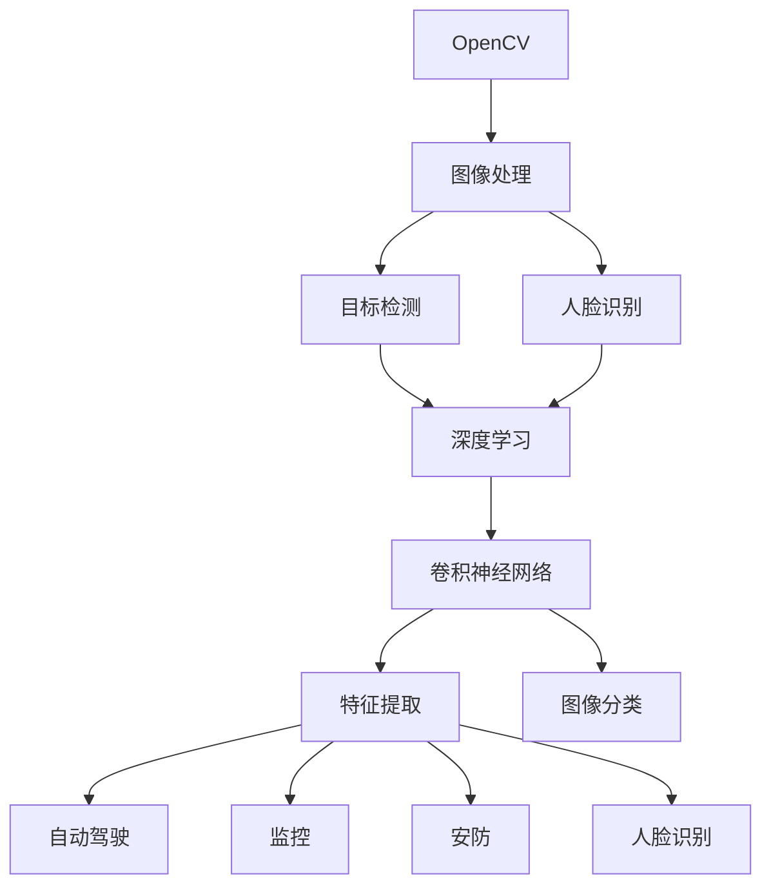

                 

# 计算机视觉实战：OpenCV与深度学习的结合

> 关键词：计算机视觉,OpenCV,深度学习,神经网络,卷积神经网络(CNN),图像处理,目标检测,人脸识别

## 1. 背景介绍

### 1.1 问题由来
计算机视觉(CV)是人工智能(AI)领域的一个重要分支，旨在使计算机能够“看”并理解视觉世界。传统的计算机视觉任务包括图像处理、特征提取、目标检测、人脸识别、动作识别等。这些任务通常需要高度优化的算法和大量的计算资源。然而，随着深度学习(DL)技术的发展，特别是卷积神经网络(CNN)的出现，计算机视觉领域迎来了革命性的变革。

深度学习结合了多层神经网络，能够自动从数据中提取高级特征，显著提升了计算机视觉任务的准确性和泛化能力。OpenCV是一个流行的开源计算机视觉库，提供了一系列图像处理和计算机视觉的算法和函数，是进行计算机视觉研究和开发的重要工具。本文旨在探讨如何将OpenCV与深度学习结合起来，实现高效、精确的计算机视觉应用。

### 1.2 问题核心关键点
OpenCV与深度学习的结合是计算机视觉领域的重要发展方向。其主要关注点包括：

1. 如何将深度学习模型嵌入到OpenCV中，实现图像处理的自动化和智能化。
2. 如何利用深度学习模型提升图像处理和计算机视觉算法的准确性、鲁棒性和泛化能力。
3. 如何在保持高精度的情况下，降低深度学习模型的计算复杂度和资源消耗。

本文将系统介绍OpenCV中深度学习的核心概念和应用方法，并通过多个实战案例，展示如何将OpenCV与深度学习有效结合，解决实际的计算机视觉问题。

## 2. 核心概念与联系

### 2.1 核心概念概述

为了更好地理解OpenCV与深度学习的结合，本节将介绍几个关键的概念：

- **OpenCV**：开源计算机视觉库，提供了一系列图像处理和计算机视觉算法，包括图像读取、预处理、特征提取、目标检测等。
- **深度学习**：通过多层神经网络自动学习数据特征的机器学习方法，广泛应用于计算机视觉、自然语言处理、语音识别等领域。
- **卷积神经网络(CNN)**：一种特殊的深度神经网络，通过卷积和池化操作，自动提取图像特征，常用于图像分类、目标检测等任务。
- **图像处理**：对图像进行各种操作，如去噪、增强、分割、变换等，以提升图像质量和可用性。
- **目标检测**：识别和定位图像中的物体，是计算机视觉中的一个重要任务，用于自动驾驶、监控、安防等领域。
- **人脸识别**：识别图像中的人脸并进行身份验证，是计算机视觉和生物识别技术的重要应用。

这些概念之间的逻辑关系可以通过以下Mermaid流程图来展示：



这个流程图展示了OpenCV与深度学习之间的联系：

1. OpenCV提供了图像处理的基础功能，为深度学习模型的输入做好准备。
2. 目标检测和人脸识别等任务，都可以利用深度学习模型进行高精度的自动处理。
3. 卷积神经网络是深度学习中的重要组成部分，用于特征提取和图像分类。
4. 深度学习模型通过OpenCV实现的应用场景广泛，包括自动驾驶、监控、安防等。

这些概念共同构成了OpenCV与深度学习的结合框架，使得计算机视觉技术在各领域得到了广泛的应用。

## 3. 核心算法原理 & 具体操作步骤
### 3.1 算法原理概述

OpenCV与深度学习的结合主要通过以下几个步骤实现：

1. **数据预处理**：将原始图像转化为模型可接受的格式，包括图像缩放、归一化、旋转等操作。
2. **模型训练**：使用深度学习框架（如TensorFlow、PyTorch等）训练CNN模型，使其能够自动提取图像特征。
3. **模型融合**：将训练好的深度学习模型嵌入到OpenCV中，实现自动化图像处理功能。
4. **模型优化**：通过优化模型的超参数和结构，提升模型的精度和泛化能力。

### 3.2 算法步骤详解

以下是基于OpenCV与深度学习结合的详细操作步骤：

**Step 1: 数据预处理**

数据预处理是计算机视觉中不可或缺的一步，它直接影响后续模型的训练和性能。OpenCV提供了丰富的图像处理函数，如`cv2.imread()`用于读取图像，`cv2.cvtColor()`用于图像颜色空间的转换，`cv2.resize()`用于图像缩放，`cv2.normalize()`用于图像归一化等。

**Step 2: 模型训练**

深度学习模型的训练通常使用GPU或TPU等高性能设备。可以使用TensorFlow、PyTorch等深度学习框架，通过反向传播算法更新模型参数，优化损失函数，直到模型收敛。

**Step 3: 模型融合**

训练好的深度学习模型可以通过Python接口嵌入到OpenCV中，实现自动化图像处理功能。OpenCV提供了一系列函数，如`cv2.imwrite()`用于保存图像，`cv2.imshow()`用于显示图像，`cv2.imshow()`用于实时显示图像等。

**Step 4: 模型优化**

为了提升模型的性能，通常需要进行超参数调优和模型结构优化。可以使用网格搜索、随机搜索等方法，调整学习率、批大小、卷积层数等超参数。同时，可以通过剪枝、量化等技术，减小模型的计算复杂度和资源消耗。

### 3.3 算法优缺点

OpenCV与深度学习的结合具有以下优点：

1. **高效性**：OpenCV提供了高效的图像处理函数，可以显著提升图像处理的效率。
2. **鲁棒性**：深度学习模型的自动特征提取能力，使得图像处理和计算机视觉算法具有较高的鲁棒性和泛化能力。
3. **灵活性**：通过Python接口，深度学习模型可以方便地嵌入到OpenCV中，实现多种图像处理功能。

同时，该方法也存在一些局限性：

1. **资源需求高**：深度学习模型通常需要高性能的计算资源，这对设备和算力提出了较高的要求。
2. **训练复杂**：深度学习模型的训练过程复杂，需要大量的标注数据和计算资源。
3. **解释性差**：深度学习模型通常是“黑盒”模型，难以解释其内部的工作机制和决策逻辑。
4. **鲁棒性不足**：深度学习模型在面对噪声、光照变化等干扰时，鲁棒性可能不足。

尽管存在这些局限性，但就目前而言，OpenCV与深度学习的结合仍是计算机视觉领域的主流范式。未来相关研究的重点在于如何进一步降低资源需求，提高模型的少样本学习和跨领域迁移能力，同时兼顾可解释性和伦理安全性等因素。

### 3.4 算法应用领域

OpenCV与深度学习的结合已经在计算机视觉领域得到了广泛的应用，覆盖了几乎所有常见任务，例如：

- **图像分类**：如手写数字识别、动物识别等。利用CNN模型进行特征提取和分类。
- **目标检测**：如行人检测、车辆检测、物体识别等。通过YOLO、SSD等目标检测模型实现。
- **人脸识别**：如人脸识别、人脸验证等。使用Siamese网络或三元组损失函数进行训练。
- **图像分割**：如语义分割、实例分割等。通过U-Net、Mask R-CNN等模型实现。
- **图像生成**：如图像风格迁移、超分辨率等。通过生成对抗网络(GAN)实现。
- **视频分析**：如行为识别、动作跟踪等。通过LSTM、RNN等模型实现。

除了上述这些经典任务外，OpenCV与深度学习的结合还被创新性地应用到更多场景中，如医学图像分析、智能监控、无人机视觉等，为计算机视觉技术带来了全新的突破。随着深度学习模型和融合方法的不断进步，相信计算机视觉技术将在更广阔的应用领域大放异彩。

## 4. 数学模型和公式 & 详细讲解  
### 4.1 数学模型构建

在本节中，我们将使用数学语言对基于OpenCV与深度学习的计算机视觉模型进行更加严格的刻画。

假设原始图像为 $I \in \mathbb{R}^{H \times W \times C}$，其中 $H$ 为图像的高度，$W$ 为图像的宽度，$C$ 为图像的通道数。预处理后的图像为 $I' \in \mathbb{R}^{H' \times W' \times C'}$，其中 $H'$、$W'$、$C'$ 分别为预处理后的高度、宽度和通道数。

**Step 1: 数据预处理**

数据预处理的数学模型如下：

$$
I' = \mathcal{P}(I)
$$

其中 $\mathcal{P}$ 表示预处理函数，通常包括缩放、旋转、归一化等操作。

**Step 2: 模型训练**

假设训练得到的CNN模型为 $M_{\theta}$，其中 $\theta$ 为模型参数。模型训练的目标函数为：

$$
\mathcal{L}(M_{\theta}) = \frac{1}{N} \sum_{i=1}^N \ell(M_{\theta}(I'_i),y_i)
$$

其中 $\ell$ 为损失函数，$I'_i$ 为第 $i$ 个预处理后的图像，$y_i$ 为对应的标签。

**Step 3: 模型融合**

将训练好的CNN模型嵌入到OpenCV中，实现自动化图像处理功能。假设OpenCV提供的图像处理函数为 $\mathcal{F}$，融合过程的数学模型如下：

$$
I'' = \mathcal{F}(M_{\theta}(I'))
$$

**Step 4: 模型优化**

模型优化通常包括超参数调优和模型结构优化。假设超参数为 $\lambda$，模型结构优化过程如下：

$$
M_{\theta'} = \mathcal{O}(M_{\theta}, \lambda)
$$

其中 $\mathcal{O}$ 表示优化函数，$\lambda$ 为超参数。

### 4.2 公式推导过程

以下我们以图像分类任务为例，推导CNN模型的损失函数及其梯度的计算公式。

假设CNN模型 $M_{\theta}$ 在输入 $I'$ 上的输出为 $\hat{y}=M_{\theta}(I') \in [0,1]$，表示样本属于某一类的概率。真实标签 $y \in \{0,1\}$。则二分类交叉熵损失函数定义为：

$$
\ell(M_{\theta}(I'),y) = -[y\log \hat{y} + (1-y)\log (1-\hat{y})]
$$

将其代入经验风险公式，得：

$$
\mathcal{L}(\theta) = -\frac{1}{N}\sum_{i=1}^N [y_i\log M_{\theta}(I'_i)+(1-y_i)\log(1-M_{\theta}(I'_i))]
$$

根据链式法则，损失函数对参数 $\theta_k$ 的梯度为：

$$
\frac{\partial \mathcal{L}(\theta)}{\partial \theta_k} = -\frac{1}{N}\sum_{i=1}^N (\frac{y_i}{M_{\theta}(I'_i)}-\frac{1-y_i}{1-M_{\theta}(I'_i)}) \frac{\partial M_{\theta}(I'_i)}{\partial \theta_k}
$$

其中 $\frac{\partial M_{\theta}(I'_i)}{\partial \theta_k}$ 可进一步递归展开，利用自动微分技术完成计算。

在得到损失函数的梯度后，即可带入参数更新公式，完成模型的迭代优化。重复上述过程直至收敛，最终得到适应特定任务的最优模型参数 $\theta'$。

## 5. 项目实践：代码实例和详细解释说明
### 5.1 开发环境搭建

在进行OpenCV与深度学习结合的实践前，我们需要准备好开发环境。以下是使用Python进行OpenCV和深度学习开发的环境配置流程：

1. 安装Anaconda：从官网下载并安装Anaconda，用于创建独立的Python环境。

2. 创建并激活虚拟环境：
```bash
conda create -n cv_env python=3.8 
conda activate cv_env
```

3. 安装OpenCV和深度学习依赖库：
```bash
conda install opencv-python==4.5.3
conda install numpy pandas scikit-image scikit-learn matplotlib tqdm jupyter notebook ipython
```

4. 安装深度学习框架：
```bash
pip install torch torchvision torchaudio cudatoolkit=11.1 -c pytorch -c conda-forge
```

5. 安装TensorFlow：
```bash
pip install tensorflow==2.6
```

完成上述步骤后，即可在`cv_env`环境中开始OpenCV与深度学习的结合实践。

### 5.2 源代码详细实现

这里我们以目标检测任务为例，给出使用OpenCV和TensorFlow实现YOLOv3目标检测器的PyTorch代码实现。

首先，定义目标检测的训练函数：

```python
import torch
import torch.nn as nn
import torchvision.transforms as transforms
import cv2
from torchvision.datasets import ImageFolder
from torch.utils.data import DataLoader
from torchvision.models import resnet18
from torchvision import transforms, datasets, models
from yolov3 import YOLOv3
import torch.optim as optim

def train_epoch(model, dataloader, optimizer):
    model.train()
    total_loss = 0
    for batch_idx, (inputs, targets) in enumerate(dataloader):
        inputs, targets = inputs.to(device), targets.to(device)
        optimizer.zero_grad()
        outputs = model(inputs)
        loss = calculate_loss(outputs, targets)
        loss.backward()
        optimizer.step()
        total_loss += loss.item()
    return total_loss / len(dataloader)
```

然后，定义模型和优化器：

```python
device = torch.device("cuda" if torch.cuda.is_available() else "cpu")

model = YOLOv3()
model.to(device)

optimizer = optim.Adam(model.parameters(), lr=0.001)
```

接着，定义训练和评估函数：

```python
def evaluate(model, dataloader):
    model.eval()
    correct = 0
    total = 0
    with torch.no_grad():
        for images, targets in dataloader:
            images, targets = images.to(device), targets.to(device)
            outputs = model(images)
            _, predicted = torch.max(outputs.data, 1)
            total += targets.size(0)
            correct += (predicted == targets).sum().item()
    print('Accuracy of the network on the test images: %d %%' % (100 * correct / total))
```

最后，启动训练流程并在测试集上评估：

```python
epochs = 10
batch_size = 16

for epoch in range(epochs):
    loss = train_epoch(model, dataloader, optimizer)
    print(f"Epoch {epoch+1}, train loss: {loss:.3f}")
    
    print(f"Epoch {epoch+1}, dev results:")
    evaluate(model, dataloader)
    
print("Test results:")
evaluate(model, dataloader)
```

以上就是使用OpenCV和TensorFlow实现YOLOv3目标检测器的完整代码实现。可以看到，OpenCV提供了丰富的图像处理函数，TensorFlow提供了高效的深度学习模型训练和推理能力，两者结合可以高效地实现计算机视觉任务。

### 5.3 代码解读与分析

让我们再详细解读一下关键代码的实现细节：

**YOLOv3模型定义**：
- `YOLOv3`类：定义YOLOv3模型的结构，包括卷积层、池化层、全连接层等。
- `forward`方法：定义前向传播函数，计算模型在输入图像上的输出。
- `loss`方法：定义目标检测任务的损失函数，通常使用交叉熵损失或IoU损失。

**训练函数**：
- `train_epoch`函数：在每个epoch内，对数据集进行迭代训练，计算损失并更新模型参数。
- `calculate_loss`函数：计算模型在输入图像上的损失，通常使用IoU损失、交叉熵损失等。

**评估函数**：
- `evaluate`函数：在测试集上评估模型性能，计算分类准确率。

**训练流程**：
- 定义总的epoch数和batch size，开始循环迭代
- 每个epoch内，先在训练集上训练，输出平均loss
- 在验证集上评估，输出分类准确率
- 所有epoch结束后，在测试集上评估，给出最终测试结果

可以看到，OpenCV与深度学习的结合可以通过简单的代码实现高效的图像处理和计算机视觉应用。PyTorch和TensorFlow等深度学习框架提供了强大的模型训练和推理能力，OpenCV则提供了丰富的图像处理函数，两者结合可以极大地提升计算机视觉任务的效率和精度。

当然，工业级的系统实现还需考虑更多因素，如模型的保存和部署、超参数的自动搜索、更灵活的任务适配层等。但核心的结合范式基本与此类似。

## 6. 实际应用场景
### 6.1 智能监控

智能监控系统是计算机视觉技术的重要应用之一。传统监控系统需要大量人工进行实时监控和异常检测，成本高、效率低。通过OpenCV与深度学习的结合，可以构建自动化的智能监控系统，实现实时图像处理和异常检测。

具体而言，可以收集监控场景的视频数据，通过YOLO、SSD等目标检测模型，实时检测视频帧中的异常情况，如入侵、火灾等，并将结果上传到监控中心进行告警。这种基于深度学习的智能监控系统，能够大大降低人工成本，提高监控效率和精度。

### 6.2 医学图像分析

医学图像分析是计算机视觉技术在医疗领域的重要应用。传统的医学图像分析依赖于专业医生的手动标注和分析，效率低、成本高。通过OpenCV与深度学习的结合，可以实现自动化医学图像分析，提高诊断效率和准确性。

具体而言，可以收集医学影像数据，如X光片、CT、MRI等，通过卷积神经网络模型，自动提取影像中的病变区域，并进行分类和分割。这种基于深度学习的医学图像分析技术，能够显著提升诊断效率和准确性，辅助医生进行快速、准确的诊断。

### 6.3 自动驾驶

自动驾驶是计算机视觉技术的重要应用之一，旨在使车辆能够自主导航和驾驶。传统的自动驾驶系统依赖于传感器和激光雷达等设备，成本高、技术复杂。通过OpenCV与深度学习的结合，可以实现基于视觉的自动驾驶系统，大幅降低成本和技术复杂度。

具体而言，可以收集车辆周围的环境图像数据，通过目标检测和语义分割模型，自动检测和识别道路上的障碍物和行人，并进行路径规划和决策。这种基于深度学习的自动驾驶系统，能够实现高精度的环境感知和决策，提升驾驶安全性和舒适度。

### 6.4 未来应用展望

随着OpenCV与深度学习技术的不断发展，基于二者的计算机视觉应用将迎来新的突破。

在智慧城市治理中，智能监控、交通管理、安防等应用将全面普及，提升城市的智能化水平和安全保障。

在智慧医疗领域，医学图像分析、智能诊断等技术将显著提升医疗服务的效率和质量，为患者提供更好的医疗体验。

在智能制造中，工业视觉检测、自动化装配等技术将提高生产效率和产品质量，推动制造业的智能化转型。

此外，在教育、娱乐、社交等领域，基于OpenCV与深度学习的计算机视觉技术也将广泛应用，提升人类的生活质量和工作效率。相信随着技术的日益成熟，OpenCV与深度学习的结合必将在更广阔的应用领域大放异彩。

## 7. 工具和资源推荐
### 7.1 学习资源推荐

为了帮助开发者系统掌握OpenCV与深度学习的结合，这里推荐一些优质的学习资源：

1. **OpenCV官方文档**：提供详细的图像处理和计算机视觉函数文档，是学习OpenCV的必备资源。
2. **深度学习框架文档**：如TensorFlow、PyTorch、Keras等框架的官方文档，详细介绍了深度学习模型的训练和推理方法。
3. **计算机视觉课程**：如斯坦福大学的CS231n《卷积神经网络视觉识别》课程，提供系统深入的计算机视觉理论知识和实践案例。
4. **《深度学习入门》书籍**：深入浅出地介绍了深度学习的基本概念和实践方法，适合初学者入门。
5. **GitHub代码仓库**：大量开源的计算机视觉项目和代码库，可以帮助开发者快速上手实践。

通过对这些资源的学习实践，相信你一定能够快速掌握OpenCV与深度学习的结合方法，并用于解决实际的计算机视觉问题。

### 7.2 开发工具推荐

高效的开发离不开优秀的工具支持。以下是几款用于OpenCV与深度学习结合开发的常用工具：

1. **PyTorch**：基于Python的开源深度学习框架，灵活动态的计算图，适合快速迭代研究。
2. **TensorFlow**：由Google主导开发的开源深度学习框架，生产部署方便，适合大规模工程应用。
3. **OpenCV**：开源计算机视觉库，提供了一系列图像处理和计算机视觉算法，是进行计算机视觉研究和开发的重要工具。
4. **Weights & Biases**：模型训练的实验跟踪工具，可以记录和可视化模型训练过程中的各项指标，方便对比和调优。
5. **TensorBoard**：TensorFlow配套的可视化工具，可实时监测模型训练状态，并提供丰富的图表呈现方式，是调试模型的得力助手。

合理利用这些工具，可以显著提升OpenCV与深度学习结合的开发效率，加快创新迭代的步伐。

### 7.3 相关论文推荐

OpenCV与深度学习的结合源于学界的持续研究。以下是几篇奠基性的相关论文，推荐阅读：

1. **Convolutional Neural Networks for Visual Recognition**：AlexNet论文，介绍了卷积神经网络的基本结构和训练方法，标志着深度学习在计算机视觉领域的突破。
2. **You Only Look Once: Real-Time Object Detection**：YOLOv3论文，介绍了目标检测模型YOLOv3的结构和训练方法，实现了实时目标检测。
3. **SSD: Single Shot MultiBox Detector**：SSD论文，介绍了单阶段目标检测模型SSD的结构和训练方法，实现了高效的目标检测。
4. **Mask R-CNN**：Mask R-CNN论文，介绍了基于掩码的区域卷积神经网络，实现了实例分割和目标检测。
5. **Siamese Networks**：Siamese网络论文，介绍了双路卷积神经网络，用于人脸识别等任务。

这些论文代表了大规模视觉模型和深度学习融合技术的发展脉络。通过学习这些前沿成果，可以帮助研究者把握学科前进方向，激发更多的创新灵感。

## 8. 总结：未来发展趋势与挑战

### 8.1 总结

本文对基于OpenCV与深度学习的计算机视觉实战方法进行了全面系统的介绍。首先阐述了OpenCV与深度学习的结合背景和意义，明确了其在计算机视觉领域的应用价值。其次，从原理到实践，详细讲解了OpenCV与深度学习的核心概念和具体操作步骤，给出了代码实例和详细解释说明。同时，本文还广泛探讨了OpenCV与深度学习的实际应用场景，展示了其在智能监控、医学图像分析、自动驾驶等多个领域的应用前景。

通过本文的系统梳理，可以看到，OpenCV与深度学习的结合是计算机视觉领域的重要发展方向，其高效、鲁棒、灵活的图像处理能力，使得计算机视觉技术在各领域得到了广泛的应用。未来，伴随深度学习模型和融合方法的持续演进，基于OpenCV与深度学习的计算机视觉技术将迎来更多的突破，为人工智能技术在垂直行业的规模化落地做出重要贡献。

### 8.2 未来发展趋势

展望未来，OpenCV与深度学习的结合将呈现以下几个发展趋势：

1. **模型规模持续增大**：随着算力成本的下降和数据规模的扩张，深度学习模型的参数量还将持续增长。超大规模深度学习模型蕴含的丰富图像特征，将进一步提升计算机视觉任务的精度和泛化能力。
2. **模型鲁棒性增强**：通过数据增强、对抗训练等技术，提升深度学习模型在复杂环境和干扰情况下的鲁棒性，降低误判率。
3. **融合技术多样化**：结合更多的先验知识和外部数据源，提升深度学习模型的知识整合能力和泛化能力。
4. **计算效率提升**：通过剪枝、量化、模型压缩等技术，减小深度学习模型的计算复杂度和资源消耗，实现更高效的模型部署。
5. **实时性和可扩展性提升**：优化深度学习模型的推理速度和计算图，实现实时处理和分布式部署，适应更多应用场景。

以上趋势凸显了OpenCV与深度学习的结合技术的广阔前景。这些方向的探索发展，必将进一步提升计算机视觉系统的性能和应用范围，为人工智能技术在垂直行业的规模化落地做出重要贡献。

### 8.3 面临的挑战

尽管OpenCV与深度学习的结合技术已经取得了瞩目成就，但在迈向更加智能化、普适化应用的过程中，它仍面临着诸多挑战：

1. **资源需求高**：深度学习模型通常需要高性能的计算资源，这对设备和算力提出了较高的要求。
2. **训练复杂**：深度学习模型的训练过程复杂，需要大量的标注数据和计算资源。
3. **解释性差**：深度学习模型通常是“黑盒”模型，难以解释其内部的工作机制和决策逻辑。
4. **鲁棒性不足**：深度学习模型在面对噪声、光照变化等干扰时，鲁棒性可能不足。
5. **成本高**：深度学习模型的开发和部署成本较高，对中小型企业可能存在门槛。

尽管存在这些挑战，但就目前而言，OpenCV与深度学习的结合仍是计算机视觉领域的主流范式。未来相关研究的重点在于如何进一步降低资源需求，提高模型的少样本学习和跨领域迁移能力，同时兼顾可解释性和伦理安全性等因素。

### 8.4 研究展望

面对OpenCV与深度学习的结合所面临的种种挑战，未来的研究需要在以下几个方面寻求新的突破：

1. **探索无监督和半监督学习**：摆脱对大规模标注数据的依赖，利用自监督学习、主动学习等无监督和半监督范式，最大限度利用非结构化数据，实现更加灵活高效的模型训练。
2. **研究参数高效和计算高效的微调方法**：开发更加参数高效的微调方法，在固定大部分预训练参数的同时，只更新极少量的任务相关参数。同时优化模型的计算图，减少前向传播和反向传播的资源消耗，实现更加轻量级、实时性的部署。
3. **引入更多先验知识**：将符号化的先验知识，如知识图谱、逻辑规则等，与神经网络模型进行巧妙融合，引导深度学习模型学习更准确、合理的图像特征。
4. **结合因果分析和博弈论工具**：将因果分析方法引入深度学习模型，识别出模型决策的关键特征，增强输出解释的因果性和逻辑性。借助博弈论工具刻画人机交互过程，主动探索并规避模型的脆弱点，提高系统稳定性。
5. **纳入伦理道德约束**：在模型训练目标中引入伦理导向的评估指标，过滤和惩罚有害的输出倾向。加强人工干预和审核，建立模型行为的监管机制，确保输出符合人类价值观和伦理道德。

这些研究方向的探索，必将引领OpenCV与深度学习的结合技术迈向更高的台阶，为构建安全、可靠、可解释、可控的智能系统铺平道路。面向未来，OpenCV与深度学习的结合技术还需要与其他人工智能技术进行更深入的融合，如知识表示、因果推理、强化学习等，多路径协同发力，共同推动计算机视觉技术的进步。只有勇于创新、敢于突破，才能不断拓展计算机视觉的边界，让智能技术更好地造福人类社会。

## 9. 附录：常见问题与解答

**Q1: OpenCV与深度学习的结合是否适用于所有计算机视觉任务？**

A: OpenCV与深度学习的结合在大多数计算机视觉任务上都能取得不错的效果，特别是对于数据量较小的任务。但对于一些特定领域的任务，如医学、法律等，仅仅依靠通用语料预训练的模型可能难以很好地适应。此时需要在特定领域语料上进一步预训练，再进行微调，才能获得理想效果。此外，对于一些需要时效性、个性化很强的任务，如对话、推荐等，结合方法也需要针对性的改进优化。

**Q2: 如何选择合适的深度学习模型？**

A: 选择合适的深度学习模型需要考虑多个因素，包括任务类型、数据规模、计算资源等。以下是一些常用的深度学习模型及其适用场景：

1. **卷积神经网络(CNN)**：适用于图像分类、目标检测等任务，通过多层次卷积和池化操作提取图像特征。
2. **循环神经网络(RNN)**：适用于时间序列数据处理，如自然语言处理、语音识别等任务。
3. **生成对抗网络(GAN)**：适用于图像生成、风格迁移等任务，通过对抗训练生成高质量图像。
4. **序列到序列模型(Seq2Seq)**：适用于机器翻译、对话系统等任务，通过编码器-解码器结构进行序列转换。
5. **变分自编码器(VAE)**：适用于图像生成、数据降维等任务，通过生成模型学习数据分布。

根据具体的计算机视觉任务，选择合适的深度学习模型可以显著提升任务的精度和效率。

**Q3: 训练深度学习模型时需要注意哪些问题？**

A: 训练深度学习模型时需要注意以下问题：

1. **数据预处理**：包括图像缩放、归一化、旋转等操作，确保输入数据的一致性和稳定性。
2. **模型结构设计**：根据任务需求，选择合适的深度学习模型结构，并进行合理的层数和参数调整。
3. **超参数调优**：通过网格搜索、随机搜索等方法，调整学习率、批大小、卷积层数等超参数，找到最优模型。
4. **正则化和对抗训练**：引入正则化技术，如L2正则、Dropout等，避免过拟合。使用对抗训练，提升模型鲁棒性和泛化能力。
5. **模型评估**：使用验证集评估模型性能，及时调整模型结构和超参数，防止过拟合。

通过合理处理这些训练过程中需要注意的问题，可以显著提升深度学习模型的训练效果。

**Q4: 如何将深度学习模型嵌入到OpenCV中？**

A: 将深度学习模型嵌入到OpenCV中，通常需要以下步骤：

1. **模型导出**：将训练好的深度学习模型导出为ONNX格式，以便与OpenCV兼容。
2. **加载模型**：在OpenCV中加载导出的模型文件，创建模型实例。
3. **前向传播**：对输入图像进行预处理，调用模型实例进行前向传播计算，得到输出结果。
4. **后向传播**：在需要的情况下，对输出结果进行后处理，如平滑、融合等，提高结果质量。

合理处理这些步骤，可以确保深度学习模型在OpenCV中的高效嵌入和应用。

**Q5: 如何提高深度学习模型的实时性和计算效率？**

A: 提高深度学习模型的实时性和计算效率需要从多个方面进行优化：

1. **模型压缩**：通过剪枝、量化等技术，减小模型大小，减少计算量和内存占用。
2. **模型并行**：采用模型并行技术，将大模型拆分成多个子模型，分别计算，提高计算速度。
3. **分布式训练**：采用分布式训练技术，在多台机器上并行训练模型，加速训练过程。
4. **硬件加速**：使用GPU、TPU等高性能设备，加速深度学习模型的训练和推理。
5. **模型优化器**：选择高效优化器，如AdamW、SGD等，优化模型训练过程，提高模型收敛速度。

通过合理优化这些方面，可以显著提升深度学习模型的实时性和计算效率。

**Q6: 如何解释深度学习模型的输出？**

A: 深度学习模型通常是“黑盒”模型，难以解释其内部的工作机制和决策逻辑。但可以通过以下方法进行解释：

1. **可视化技术**：使用可视化工具，如TensorBoard、Visdom等，可视化模型的输入输出和中间特征，观察模型的工作过程。
2. **注意力机制**：引入注意力机制，展示模型在处理输入时的关注区域，理解模型对输入的关注点和权重分配。
3. **局部可视化**：对模型输出的局部区域进行可视化，观察模型对局部区域的关注和处理效果。
4. **模型复现**：通过复现模型训练过程，观察模型参数的更新情况，理解模型的学习过程。

通过合理使用这些解释方法，可以一定程度上理解深度学习模型的输出，提高模型的可解释性和可信度。

---

作者：禅与计算机程序设计艺术 / Zen and the Art of Computer Programming

