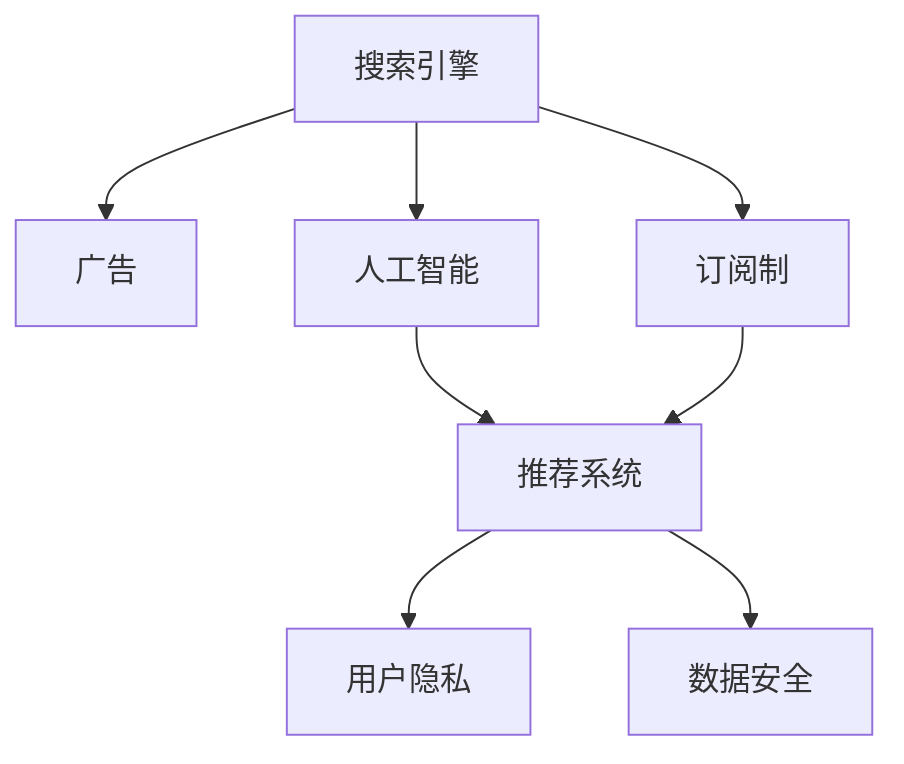

                 

# 订阅制vs广告：AI搜索引擎的商业模式之争

> 关键词：人工智能(AI),搜索引擎,商业模式,订阅制,广告,技术创新,用户隐私,数据安全

## 1. 背景介绍

搜索引擎作为互联网时代的重要基础设施，已深度融入人们的日常生活和工作。传统上，搜索引擎依赖于广告收入维持运营。但随着人工智能技术的蓬勃发展，基于AI的搜索引擎逐渐兴起，其商业模式开始出现新的变化。本文将聚焦于订阅制与广告两种商业模式的对比，探讨在AI技术的加持下，搜索引擎的商业模式如何演进，及其对用户体验和数据安全的影响。

### 1.1 问题由来

搜索引擎的商业模式，历来以广告收入为主。通过展示与搜索请求相关的广告，搜索引擎公司获取广告点击费，从而实现盈利。然而，这种方式在用户隐私、广告质量和用户体验等方面存在一定的局限性。随着AI技术的兴起，基于AI的搜索引擎开始尝试通过订阅制或AI算法优化广告投放等方式，为用户提供更优质的服务，并探索新的商业模式。

### 1.2 问题核心关键点

AI技术的应用，特别是深度学习、自然语言处理和推荐系统的引入，为搜索引擎的商业模式创新提供了可能。但随之而来的问题是，如何兼顾商业利益、用户隐私和数据安全，如何在个性化推荐和广告投放之间找到平衡，如何通过技术创新最大化用户体验和广告效果。

## 2. 核心概念与联系

### 2.1 核心概念概述

为更好地理解搜索引擎的商业模式创新，本节将介绍几个密切相关的核心概念：

- 搜索引擎(Search Engine)：提供关键字查询并返回网页的在线服务，是互联网信息检索的主要工具。
- 广告(Advertising)：通过展示与搜索请求相关的广告，获取广告收入。
- 订阅制(Subscription)：用户支付固定费用，获取持续的搜索引擎服务。
- 人工智能(AI)：利用机器学习和深度学习技术，实现信息检索和推荐优化。
- 推荐系统(Recommendation System)：通过分析用户行为和偏好，提供个性化搜索结果。
- 用户隐私(User Privacy)：用户在搜索过程中产生的数据，需要得到妥善保护。
- 数据安全(Data Security)：确保数据在传输和存储过程中不被泄露或篡改。

这些核心概念之间的逻辑关系可以通过以下Mermaid流程图来展示：



这个流程图展示了一些核心概念及其之间的关系：

1. 搜索引擎通过广告和订阅制获取收入，但其中广告与订阅制有显著区别。
2. AI技术可以优化广告投放，同时为用户提供个性化服务。
3. 推荐系统通过分析用户行为，提高广告和搜索结果的匹配度。
4. 用户隐私和数据安全是AI和推荐系统的基础保障。
5. 订阅制为AI技术的应用提供了稳定的用户群体和数据源。

这些概念共同构成了搜索引擎的商业模式基础，其相互关系决定了未来的发展方向。

## 3. 核心算法原理 & 具体操作步骤
### 3.1 算法原理概述

搜索引擎的商业模式创新，主要集中在如何通过AI技术优化广告和推荐系统，同时兼顾用户隐私和数据安全。以下将分别介绍基于广告和订阅制的核心算法原理。

### 3.2 算法步骤详解

#### 3.2.1 基于广告的搜索引擎算法步骤

1. **广告投放模型构建**：
   - 使用机器学习模型（如线性回归、随机森林、神经网络等）预测广告的点击率（CTR）。
   - 通过用户行为数据、网页特征等因素训练模型，预测用户对不同广告的兴趣程度。

2. **广告投放优化**：
   - 使用强化学习算法（如Q-learning、Deep Q-Networks等）优化广告投放策略。
   - 通过不断迭代，最大化广告点击率和转化率，减少用户的不良体验。

3. **用户隐私保护**：
   - 采用差分隐私技术，限制对用户数据的直接使用，保护用户隐私。
   - 使用联邦学习（Federated Learning）技术，在用户端进行模型训练，避免集中存储用户数据。

4. **数据安全措施**：
   - 使用加密技术（如SSL/TLS、HMAC等）保障数据在传输过程中的安全。
   - 采用访问控制和审计机制，确保只有授权用户可以访问敏感数据。

#### 3.2.2 基于订阅制的搜索引擎算法步骤

1. **用户数据分析**：
   - 收集订阅用户的搜索历史、点击行为等数据，分析用户兴趣和偏好。
   - 通过用户画像和行为轨迹，预测用户未来可能的需求。

2. **个性化推荐系统构建**：
   - 使用协同过滤、内容推荐、混合推荐等技术，根据用户历史行为推荐相关内容。
   - 引入深度学习模型（如BERT、GPT等），提取文本语义信息，提升推荐质量。

3. **订阅服务优化**：
   - 根据用户订阅类型和消费行为，动态调整搜索结果和广告投放。
   - 提供高级定制化服务，如搜索结果排序、定制化广告等，满足不同用户的需求。

4. **用户隐私和数据安全保障**：
   - 采用去标识化技术，保护用户搜索记录和个人隐私。
   - 使用区块链技术（如IPFS）存储用户数据，确保数据的不可篡改和透明性。

### 3.3 算法优缺点

#### 3.3.1 基于广告的搜索引擎

**优点**：
1. **收入稳定**：通过广告投放获取大量收入，运营压力较小。
2. **流量较大**：用户流量大，广告展示机会多。
3. **用户多样性**：广告触达不同用户，提升广告效果。

**缺点**：
1. **用户隐私问题**：广告的精准投放可能侵犯用户隐私。
2. **广告质量参差不齐**：部分广告质量不高，影响用户体验。
3. **广告过度干扰**：广告数量过多，影响搜索结果的清晰度。

#### 3.3.2 基于订阅制的搜索引擎

**优点**：
1. **用户忠诚度高**：订阅制用户粘性高，数据质量好。
2. **推荐系统精准**：个性化推荐提升用户体验和满意度。
3. **隐私控制力强**：用户数据掌握在自己手中，隐私保护力度大。

**缺点**：
1. **收入不稳定**：订阅制用户数有限，难以覆盖所有用户。
2. **技术门槛高**：需要构建复杂的推荐系统和隐私保护机制。
3. **用户忠诚度风险**：用户可能因服务不满或价格问题流失。

### 3.4 算法应用领域

基于AI的搜索引擎技术，广泛应用于各种场景，如电子商务、金融服务、在线教育等。这些技术在实际应用中，通过优化广告投放、个性化推荐等方式，提升了用户体验，拓展了商业价值。

## 4. 数学模型和公式 & 详细讲解 & 举例说明

### 4.1 数学模型构建

为更好地理解搜索引擎的算法原理，以下将介绍一些常用的数学模型。

#### 4.1.1 广告投放模型

广告投放模型主要关注如何通过机器学习预测广告的点击率（CTR）。这里以线性回归模型为例，定义广告特征向量 $\mathbf{x}_i$ 和广告点击向量 $\mathbf{y}_i$，线性回归模型如下：

$$
\hat{y}_i = \mathbf{w}^T \mathbf{x}_i + b
$$

其中 $\mathbf{w}$ 为模型参数，$b$ 为偏置项。

在实际应用中，可以使用随机梯度下降（SGD）等优化算法，最小化损失函数：

$$
\mathcal{L}(\mathbf{w},b) = \frac{1}{2N} \sum_{i=1}^N (\hat{y}_i - y_i)^2
$$

#### 4.1.2 推荐系统模型

推荐系统通常使用协同过滤、内容推荐、混合推荐等技术，其中协同过滤的矩阵分解模型为例：

设用户-商品矩阵为 $R$，矩阵分解模型将 $R$ 分解为 $U$ 和 $V$ 两个低秩矩阵：

$$
R \approx UV^T
$$

其中 $U$ 和 $V$ 均为低秩矩阵，$U$ 的每一行为用户向量，$V$ 的每一列为商品向量。推荐系统预测用户对商品 $j$ 的评分 $r_{uj}$ 为：

$$
\hat{r}_{uj} = u_u^T v_j
$$

其中 $u_u$ 为第 $u$ 个用户向量，$v_j$ 为第 $j$ 个商品向量。

### 4.2 公式推导过程

#### 4.2.1 广告投放模型的推导

线性回归模型的损失函数推导如下：

根据样本 $(x_i,y_i)$ 的损失函数为：

$$
\ell_i = (\hat{y}_i - y_i)^2
$$

因此，整体损失函数为：

$$
\mathcal{L}(\mathbf{w},b) = \frac{1}{2N} \sum_{i=1}^N \ell_i = \frac{1}{2N} \sum_{i=1}^N (\hat{y}_i - y_i)^2
$$

通过最小化损失函数，求解 $\mathbf{w}$ 和 $b$。

#### 4.2.2 推荐系统模型的推导

设用户-商品矩阵为 $R$，采用矩阵分解模型，假设 $R$ 可以分解为 $U$ 和 $V$ 两个低秩矩阵：

$$
R \approx UV^T
$$

其中 $U$ 和 $V$ 均为低秩矩阵，$U$ 的每一行为用户向量，$V$ 的每一列为商品向量。

推荐系统预测用户对商品 $j$ 的评分 $r_{uj}$ 为：

$$
\hat{r}_{uj} = u_u^T v_j
$$

其中 $u_u$ 为第 $u$ 个用户向量，$v_j$ 为第 $j$ 个商品向量。

### 4.3 案例分析与讲解

#### 4.3.1 广告投放模型的案例分析

假设某电商网站通过机器学习模型预测用户的点击率（CTR），训练数据集包含广告特征 $x$ 和用户点击标签 $y$。采用线性回归模型：

$$
\hat{y}_i = \mathbf{w}^T \mathbf{x}_i + b
$$

模型训练的目标是最小化损失函数：

$$
\mathcal{L}(\mathbf{w},b) = \frac{1}{2N} \sum_{i=1}^N (\hat{y}_i - y_i)^2
$$

使用随机梯度下降（SGD）算法求解：

$$
\mathbf{w} \leftarrow \mathbf{w} - \eta \nabla_{\mathbf{w}} \mathcal{L}(\mathbf{w},b) - \eta \lambda \mathbf{w}
$$

其中 $\eta$ 为学习率，$\lambda$ 为正则化系数。

#### 4.3.2 推荐系统模型的案例分析

某视频网站采用矩阵分解模型进行推荐，设用户-视频矩阵为 $R$，假设 $R$ 可以分解为 $U$ 和 $V$ 两个低秩矩阵：

$$
R \approx UV^T
$$

其中 $U$ 和 $V$ 均为低秩矩阵，$U$ 的每一行为用户向量，$V$ 的每一列为视频向量。

推荐系统预测用户对视频 $j$ 的评分 $r_{uj}$ 为：

$$
\hat{r}_{uj} = u_u^T v_j
$$

其中 $u_u$ 为第 $u$ 个用户向量，$v_j$ 为第 $j$ 个视频向量。

通过最小化均方误差损失函数，求解 $U$ 和 $V$：

$$
\mathcal{L}(U,V) = \frac{1}{2N} \sum_{u=1}^U \sum_{j=1}^J (r_{uj} - \hat{r}_{uj})^2
$$

## 5. 项目实践：代码实例和详细解释说明
### 5.1 开发环境搭建

在进行搜索引擎算法实践前，我们需要准备好开发环境。以下是使用Python进行TensorFlow开发的环境配置流程：

1. 安装Anaconda：从官网下载并安装Anaconda，用于创建独立的Python环境。

2. 创建并激活虚拟环境：
```bash
conda create -n tensorflow-env python=3.8 
conda activate tensorflow-env
```

3. 安装TensorFlow：根据CUDA版本，从官网获取对应的安装命令。例如：
```bash
conda install tensorflow-gpu=2.6 -c pytorch -c conda-forge
```

4. 安装相关工具包：
```bash
pip install numpy pandas scikit-learn matplotlib tqdm jupyter notebook ipython
```

完成上述步骤后，即可在`tensorflow-env`环境中开始搜索引擎算法实践。

### 5.2 源代码详细实现

这里我们以推荐系统为例，给出使用TensorFlow实现协同过滤模型的PyTorch代码实现。

首先，定义推荐系统的用户-商品矩阵和模型参数：

```python
import tensorflow as tf
import numpy as np

# 生成随机用户-商品矩阵
R = np.random.rand(100, 100)
U = np.random.rand(100, 10)
V = np.random.rand(10, 100)

# 定义模型参数
w = tf.Variable(tf.random.normal([10, 100]))
b = tf.Variable(tf.random.normal([1]))
```

然后，定义推荐系统的损失函数和优化器：

```python
# 定义均方误差损失函数
def loss_function(R_hat):
    return tf.reduce_mean(tf.square(R_hat - R))

# 定义优化器
optimizer = tf.optimizers.Adam(learning_rate=0.01)
```

接着，定义训练和评估函数：

```python
# 定义推荐系统训练函数
def train_step(R_hat):
    with tf.GradientTape() as tape:
        loss_value = loss_function(R_hat)
    gradients = tape.gradient(loss_value, [U, V, w, b])
    optimizer.apply_gradients(zip(gradients, [U, V, w, b]))

# 定义推荐系统评估函数
def evaluate_step(R_hat):
    mse = loss_function(R_hat)
    print("Mean Squared Error:", mse.numpy())
```

最后，启动训练流程并在测试集上评估：

```python
# 训练模型
R_hat = U @ V
for i in range(100):
    train_step(R_hat)
    if i % 10 == 0:
        evaluate_step(R_hat)
```

以上就是使用TensorFlow实现协同过滤模型的代码实例。可以看到，TensorFlow提供了强大的数值计算和优化能力，使得推荐系统的实现变得简洁高效。

### 5.3 代码解读与分析

让我们再详细解读一下关键代码的实现细节：

**R、U和V的生成**：
- 使用numpy生成随机用户-商品矩阵 $R$，初始化用户向量 $U$ 和商品向量 $V$。

**模型参数定义**：
- 定义模型参数 $w$ 和 $b$，用于优化目标函数。

**损失函数定义**：
- 使用均方误差损失函数衡量推荐结果与真实结果之间的差异。

**优化器定义**：
- 使用Adam优化器，设定学习率为0.01。

**训练函数实现**：
- 使用梯度下降算法，对模型参数进行优化，最小化损失函数。

**评估函数实现**：
- 计算推荐结果与真实结果之间的均方误差，评估模型性能。

**训练流程**：
- 训练模型 $R$ 次，每10次训练输出一次均方误差，监控模型性能。

可以看到，TensorFlow提供了一站式解决方案，使得推荐系统等复杂算法的实现变得简单明了。

当然，工业级的系统实现还需考虑更多因素，如模型的保存和部署、超参数的自动搜索、更灵活的任务适配层等。但核心的算法原理基本与此类似。

## 6. 实际应用场景
### 6.1 智能推荐系统

基于推荐系统的搜索引擎，可以广泛应用于电商、视频、音乐等推荐场景。通过分析用户的历史行为和兴趣，推荐系统能够提供个性化的商品、视频和音乐，提升用户体验和满意度。

在技术实现上，可以通过协同过滤、内容推荐、深度学习等技术构建推荐系统。通过微调模型参数，提升推荐准确性和效果。推荐系统可以在用户端实时计算推荐结果，动态调整推荐内容，提升推荐效果。

### 6.2 广告定向投放

基于广告投放的搜索引擎，能够根据用户搜索行为精准投放广告，提升广告效果。通过优化广告投放模型，提升广告点击率和转化率，减少无效广告展示，降低广告成本。

在广告投放过程中，可以使用深度学习模型预测广告的点击率，通过优化算法调整广告投放策略。通过引入差分隐私技术，保护用户隐私，避免数据泄露风险。

### 6.3 实时搜索优化

基于订阅制的搜索引擎，能够根据用户行为和偏好，提供定制化的搜索结果和广告。通过优化推荐系统，提升搜索结果的个性化和相关性，减少用户查询时间和广告干扰。

在实时搜索优化过程中，可以使用深度学习模型分析用户行为，动态调整搜索结果排序和广告投放。通过订阅制的费用分摊方式，保障用户搜索体验，提升搜索引擎的稳定性和覆盖面。

### 6.4 未来应用展望

随着AI技术的不断发展，搜索引擎的商业模式也将迎来新的变革。未来，AI技术将在以下几个方面带来新的突破：

1. **多模态融合**：将文本、图像、视频等多种模态数据融合，提升搜索引擎的全面性和泛化能力。
2. **语义理解**：通过深度学习模型实现更精准的语义理解，提升搜索结果的准确性和相关性。
3. **个性化推荐**：引入推荐系统的多臂老虎机算法，提升个性化推荐的效率和效果。
4. **隐私保护**：通过区块链等技术，确保用户数据的透明性和安全性。
5. **智能客服**：通过自然语言处理技术，构建智能客服系统，提升用户体验和运营效率。

这些技术的发展，将进一步拓展搜索引擎的商业模式和应用场景，为用户提供更优质的搜索体验。

## 7. 工具和资源推荐
### 7.1 学习资源推荐

为了帮助开发者系统掌握搜索引擎的算法原理和实践技巧，这里推荐一些优质的学习资源：

1. 《深度学习入门：基于Python的理论与实现》系列博文：由深度学习专家撰写，深入浅出地介绍了深度学习的基本理论和实践方法。

2. CS223《机器学习》课程：斯坦福大学开设的机器学习课程，讲解了机器学习的基础算法和应用。

3. 《TensorFlow实战》书籍：TensorFlow官方书籍，详细介绍了TensorFlow框架的使用方法和最佳实践。

4. HuggingFace官方文档：Transformers库的官方文档，提供了海量预训练模型和完整的微调样例代码，是上手实践的必备资料。

5. TAC会议论文集：自然语言处理领域的顶级会议论文集，收录了大量关于推荐系统和广告投放的最新研究成果。

通过对这些资源的学习实践，相信你一定能够快速掌握搜索引擎的核心算法和实现方法，并用于解决实际的搜索问题。
###  7.2 开发工具推荐

高效的开发离不开优秀的工具支持。以下是几款用于搜索引擎算法开发的常用工具：

1. TensorFlow：由Google主导开发的开源深度学习框架，生产部署方便，适合大规模工程应用。

2. PyTorch：基于Python的开源深度学习框架，灵活动态的计算图，适合快速迭代研究。大部分预训练语言模型都有PyTorch版本的实现。

3. Transformers库：HuggingFace开发的NLP工具库，集成了众多SOTA语言模型，支持PyTorch和TensorFlow，是进行搜索引擎算法开发的利器。

4. Weights & Biases：模型训练的实验跟踪工具，可以记录和可视化模型训练过程中的各项指标，方便对比和调优。与主流深度学习框架无缝集成。

5. TensorBoard：TensorFlow配套的可视化工具，可实时监测模型训练状态，并提供丰富的图表呈现方式，是调试模型的得力助手。

6. Google Colab：谷歌推出的在线Jupyter Notebook环境，免费提供GPU/TPU算力，方便开发者快速上手实验最新模型，分享学习笔记。

合理利用这些工具，可以显著提升搜索引擎算法的开发效率，加快创新迭代的步伐。

### 7.3 相关论文推荐

搜索引擎算法的发展源于学界的持续研究。以下是几篇奠基性的相关论文，推荐阅读：

1. AdaGrad：Adaptive Subgradient Methods for Online Learning and Stochastic Optimization：提出AdaGrad算法，优化深度学习模型的参数更新。

2. RNN: Recurrent Neural Network：提出递归神经网络，用于序列数据建模。

3. CNN: Convolutional Neural Networks：提出卷积神经网络，用于图像和视频等模态数据的处理。

4. Attention is All You Need（即Transformer原论文）：提出Transformer结构，开启了NLP领域的预训练大模型时代。

5. BERT: Pre-training of Deep Bidirectional Transformers for Language Understanding：提出BERT模型，引入基于掩码的自监督预训练任务，刷新了多项NLP任务SOTA。

6. SVM: Support Vector Machine：提出支持向量机，用于分类和回归任务的建模。

这些论文代表了大模型和搜索引擎算法的发展脉络。通过学习这些前沿成果，可以帮助研究者把握学科前进方向，激发更多的创新灵感。

## 8. 总结：未来发展趋势与挑战
### 8.1 总结

本文对基于AI的搜索引擎的商业模式创新进行了全面系统的介绍。首先阐述了搜索引擎的商业模式基础和AI技术的应用，明确了广告和订阅制这两种商业模式的利弊。其次，从原理到实践，详细讲解了广告投放和推荐系统的算法原理和关键步骤，给出了搜索引擎算法开发的完整代码实例。同时，本文还广泛探讨了搜索引擎算法在智能推荐、广告定向、实时搜索等实际应用场景中的落地情况，展示了AI技术在搜索引擎领域的应用前景。此外，本文精选了搜索引擎算法的各类学习资源，力求为读者提供全方位的技术指引。

通过本文的系统梳理，可以看到，基于AI的搜索引擎正在成为互联网信息检索的重要技术手段，其商业模式也在不断演变。从广告到订阅制的转变，反映了用户需求和市场竞争的变化，同时也凸显了AI技术在提升用户体验和商业价值方面的巨大潜力。未来，随着AI技术的进一步发展，搜索引擎的商业模式将更加多元化和智能化，为用户提供更优质的搜索服务。

### 8.2 未来发展趋势

展望未来，搜索引擎的商业模式将呈现以下几个发展趋势：

1. **多模态融合**：将文本、图像、视频等多种模态数据融合，提升搜索引擎的全面性和泛化能力。
2. **语义理解**：通过深度学习模型实现更精准的语义理解，提升搜索结果的准确性和相关性。
3. **个性化推荐**：引入推荐系统的多臂老虎机算法，提升个性化推荐的效率和效果。
4. **隐私保护**：通过区块链等技术，确保用户数据的透明性和安全性。
5. **智能客服**：通过自然语言处理技术，构建智能客服系统，提升用户体验和运营效率。

以上趋势凸显了搜索引擎的商业模式将更加多元化和智能化，为用户带来更优质的搜索体验。

### 8.3 面临的挑战

尽管搜索引擎算法已经取得了瞩目成就，但在迈向更加智能化、普适化应用的过程中，它仍面临着诸多挑战：

1. **用户隐私问题**：AI技术在提升用户体验的同时，也可能侵犯用户隐私。如何在隐私保护和用户体验之间找到平衡，是一个亟待解决的问题。
2. **广告质量问题**：广告的精准投放可能带来过度干扰和广告质量不高等问题，影响用户体验。如何优化广告投放策略，提高广告质量，是一个重要课题。
3. **算法公平性问题**：算法可能存在偏见，导致搜索结果和广告投放不公平。如何构建公平的推荐系统，是一个需要长期关注的问题。
4. **计算资源消耗**：大规模AI算法的实现需要大量计算资源，如何优化算法性能，降低资源消耗，是一个重要的研究方向。
5. **技术可解释性问题**：AI算法的黑盒特性可能带来一定的可解释性问题。如何提升算法的可解释性，增强用户信任，是一个值得探索的方向。

这些挑战需要在算法设计、数据处理、用户隐私保护等方面进行全面考虑，只有通过多方协作，才能更好地应对未来的挑战，推动搜索引擎算法的发展。

### 8.4 研究展望

面向未来，搜索引擎算法的研发需要从以下几个方向寻求新的突破：

1. **多模态融合**：将文本、图像、视频等多种模态数据融合，提升搜索引擎的全面性和泛化能力。
2. **语义理解**：通过深度学习模型实现更精准的语义理解，提升搜索结果的准确性和相关性。
3. **个性化推荐**：引入推荐系统的多臂老虎机算法，提升个性化推荐的效率和效果。
4. **隐私保护**：通过区块链等技术，确保用户数据的透明性和安全性。
5. **智能客服**：通过自然语言处理技术，构建智能客服系统，提升用户体验和运营效率。

这些研究方向将引领搜索引擎算法的发展方向，为用户提供更优质的搜索服务。

## 9. 附录：常见问题与解答
**Q1：搜索引擎算法中的推荐系统是如何工作的？**

A: 推荐系统通过分析用户的历史行为和兴趣，预测用户未来可能的需求，从而推荐相关的商品、视频、音乐等内容。推荐系统的核心算法包括协同过滤、内容推荐、混合推荐等。其中协同过滤模型将用户-商品矩阵分解为低秩矩阵，计算用户对商品的评分；内容推荐模型通过分析商品特征，推荐相似的商品；混合推荐模型结合多种算法，提升推荐效果。推荐系统通常在用户端实时计算推荐结果，动态调整推荐内容，提升推荐效果。

**Q2：如何评估推荐系统的性能？**

A: 推荐系统的性能评估通常使用均方误差（MSE）、均方根误差（RMSE）等指标。同时，可以通过用户满意度调查、点击率（CTR）等指标评估推荐系统的效果。在实际应用中，还需要考虑推荐系统对不同用户群体的覆盖率和公平性。

**Q3：基于订阅制的搜索引擎和基于广告的搜索引擎有哪些区别？**

A: 基于订阅制的搜索引擎主要通过订阅费获取收入，提供定制化的搜索结果和广告。基于广告的搜索引擎主要通过展示广告获取收入，提供精准的广告投放。两者在商业模式、用户体验、数据隐私等方面存在显著差异。订阅制的搜索引擎能够提供更个性化的服务，但需要固定的订阅费用；广告制的搜索引擎能够通过精准投放提升广告效果，但可能带来过度干扰和隐私风险。

**Q4：如何构建高效的用户行为分析模型？**

A: 构建高效的用户行为分析模型，需要选择合适的特征工程和算法。可以使用协同过滤、内容推荐、深度学习等技术，分析用户的历史行为和兴趣，预测用户未来可能的需求。在实际应用中，还需要考虑用户行为的多样性和动态性，通过实时数据流处理和模型更新，提升推荐效果。

**Q5：如何保护用户隐私和数据安全？**

A: 保护用户隐私和数据安全是搜索引擎算法的重要保障。可以通过差分隐私技术限制对用户数据的直接使用，保护用户隐私；使用联邦学习技术在用户端进行模型训练，避免集中存储用户数据；使用加密技术保障数据在传输和存储过程中的安全。在实际应用中，还需要考虑用户数据的多样性和动态性，通过实时数据流处理和模型更新，提升推荐效果。

通过本文的系统梳理，可以看到，基于AI的搜索引擎算法在推荐系统、广告投放、实时搜索等方面已经取得了显著进展。未来，随着AI技术的进一步发展，搜索引擎的商业模式将更加多元化和智能化，为用户带来更优质的搜索服务。

