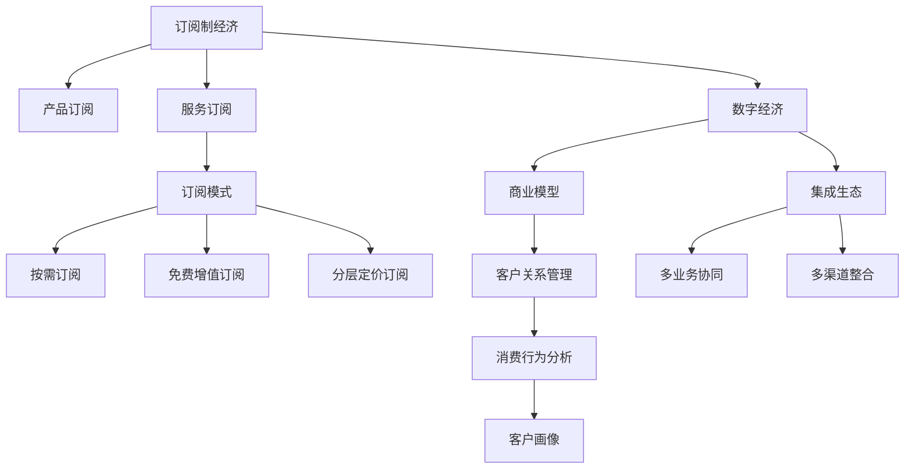

                 

# 订阅制经济的发展趋势:从产品订阅到服务订阅

> 关键词：订阅制经济,产品订阅,服务订阅,订阅模式,数字经济,商业模型,客户关系管理,消费行为分析

## 1. 背景介绍

### 1.1 问题由来

随着互联网和数字经济的迅猛发展，订阅制经济（Subscription Economy）成为新兴经济模式，并迅速渗透到各个行业，覆盖了从零售、媒体、教育到健康等多个领域。订阅制不仅改变了商品和服务的消费方式，也重塑了企业与客户的关系，赋予了客户更多选择权和参与感。面对快速变化的消费需求和技术环境，企业需要不断创新订阅模式，提升用户体验和市场竞争力。

### 1.2 问题核心关键点

订阅制经济的核心在于通过周期性收费和持续性服务，建立长期稳定的客户关系。其关键点在于：
1. **客户黏性**：通过优质内容和个性化服务，保持客户持续订阅。
2. **价值创造**：通过增值服务和用户体验优化，提升订阅价值的感知。
3. **灵活可定制**：提供多样化订阅选项，满足不同客户需求。
4. **数据驱动**：利用数据分析优化订阅策略和客户管理。
5. **集成生态**：构建开放平台，促进多渠道、多业务协同发展。

### 1.3 问题研究意义

研究订阅制经济的发展趋势，对于理解市场变化、优化商业模式、提升企业竞争力具有重要意义：
1. **市场洞察**：把握订阅制经济的发展脉络，洞察未来趋势。
2. **模式创新**：探索新的订阅模式，助力企业转型升级。
3. **客户管理**：通过订阅数据驱动客户关系管理，提高客户满意度。
4. **价值提升**：优化订阅价值和用户体验，促进企业持续增长。
5. **行业实践**：分享成功案例和经验，推动行业健康发展。

## 2. 核心概念与联系

### 2.1 核心概念概述

为更好地理解订阅制经济的发展趋势，本节将介绍几个关键概念：

- **订阅制经济**：通过周期性收费和持续性服务，建立长期客户关系的经济模式。
- **产品订阅**：客户按月或年支付固定费用，获得产品的重复使用权。
- **服务订阅**：客户按月或年支付固定费用，享受持续的服务和增值内容。
- **订阅模式**：包括按需订阅、免费增值订阅、分层定价订阅等不同形式。
- **数字经济**：利用互联网和数字技术，实现产品和服务的高效流通和价值交换。
- **商业模型**：企业通过订阅获取持续收入，并通过数据分析优化客户体验和市场策略。
- **客户关系管理**：通过订阅数据，构建客户画像，实施精准营销和客户服务。
- **消费行为分析**：利用数据分析工具，理解客户消费偏好和行为特征，优化订阅策略。
- **集成生态**：构建多业务、多渠道的协同平台，提升订阅服务的整体价值。

这些概念之间的逻辑关系可以通过以下Mermaid流程图来展示：



这个流程图展示了订阅制经济的核心概念及其之间的关系：

1. 订阅制经济是基础，包括产品订阅和服务订阅等不同形式。
2. 订阅模式包括按需订阅、免费增值订阅、分层定价订阅等，以满足不同客户需求。
3. 数字经济是订阅制经济的技术基础，依托互联网和数字技术实现价值交换。
4. 商业模型是企业运营的核心，通过订阅获取持续收入，并利用数据分析优化客户体验。
5. 客户关系管理通过订阅数据，构建客户画像，实施精准营销和客户服务。
6. 消费行为分析利用数据分析工具，理解客户消费偏好和行为特征，优化订阅策略。
7. 集成生态构建多业务、多渠道的协同平台，提升订阅服务的整体价值。

## 3. 核心算法原理 & 具体操作步骤
### 3.1 算法原理概述

订阅制经济的核心在于通过周期性收费和持续性服务，建立长期客户关系。其算法原理主要基于以下三个方面：

- **周期性收费**：客户按月或年支付固定费用，获取重复使用权。
- **持续性服务**：通过不断提供新内容、新功能和服务，保持客户订阅兴趣。
- **数据驱动优化**：利用订阅数据进行客户画像构建和行为分析，优化订阅策略和服务质量。

### 3.2 算法步骤详解

订阅制经济的操作流程主要包括以下几个关键步骤：

**Step 1: 客户细分与画像构建**
- 收集客户订阅数据，包括用户行为、购买记录、反馈信息等。
- 利用机器学习和数据分析技术，构建客户画像，识别不同客户群体。
- 根据客户画像，制定个性化订阅推荐策略。

**Step 2: 订阅方案设计**
- 确定订阅价格和周期，制定基础服务和增值服务列表。
- 设计灵活可定制的订阅选项，满足不同客户需求。
- 引入免费试用期和促销活动，吸引新客户。

**Step 3: 订阅管理与续订策略**
- 通过订阅管理系统，管理客户订阅信息和订单状态。
- 设置自动续订机制，定期提醒客户续订。
- 提供退订机制，方便客户终止订阅。

**Step 4: 服务提供与反馈收集**
- 提供优质内容和个性化服务，满足客户需求。
- 定期收集客户反馈，优化服务质量和内容。
- 分析客户流失原因，制定改进措施。

**Step 5: 数据分析与优化**
- 利用订阅数据进行消费行为分析，理解客户偏好。
- 通过A/B测试和数据挖掘，优化订阅策略和内容推荐。
- 进行市场趋势分析，调整产品和服务策略。

### 3.3 算法优缺点

订阅制经济有以下优点：
1. **客户黏性**：通过持续服务和个性化推荐，提高客户满意度。
2. **稳定收入**：周期性收费和续订机制，提供稳定的现金流。
3. **市场竞争**：促进市场竞争，提升整体服务质量。
4. **用户数据**：利用订阅数据，进行精准营销和客户画像分析。
5. **客户关系**：构建长期客户关系，提升品牌忠诚度。

同时，订阅制经济也存在以下缺点：
1. **客户流失**：客户流失可能导致收入下降。
2. **服务成本**：持续提供优质服务需要较高成本。
3. **市场压力**：激烈的竞争可能导致价格战和价格敏感度上升。
4. **数据隐私**：订阅数据的收集和利用需要遵守隐私保护法规。
5. **订阅负担**：部分客户可能难以承担高昂的订阅费用。

### 3.4 算法应用领域

订阅制经济已经广泛应用于多个领域，包括：

- **零售电商**：亚马逊Prime、奈飞、会员制超市等。
- **媒体内容**：Spotify、Netflix、电子书籍订阅等。
- **健康医疗**：健康管理应用、远程医疗服务、健身会员等。
- **教育培训**：在线课程平台、知识付费、职业培训等。
- **家居服务**：家政服务订阅、定期配送服务、智能家居服务等。
- **个人娱乐**：音乐、视频、游戏等订阅服务。
- **企业服务**：SaaS平台、技术支持、咨询顾问等。

## 4. 数学模型和公式 & 详细讲解  
### 4.1 数学模型构建

为了更精确地理解订阅制经济的运作机制，我们可以构建一个简单的数学模型。

假设订阅服务的基本价格为 $P$，续订周期为 $T$，客户续订率（即忠诚客户比例）为 $R$，客户流失率（即不续订客户比例）为 $L$。根据上述假设，我们可以得到订阅服务的收入模型：

$$
\text{总收入} = P \times R \times T
$$

其中 $R$ 和 $L$ 满足：

$$
R + L = 1
$$

通过这个模型，我们可以计算在不同续订率和流失率下的预期收入，并进行敏感性分析。

### 4.2 公式推导过程

以亚马逊Prime为例，假设其月费为 $P=119$ 美元，续订周期 $T=12$ 个月，客户流失率 $L=0.05$。则：

$$
R = 1 - L = 1 - 0.05 = 0.95
$$

代入收入模型：

$$
\text{总收入} = P \times R \times T = 119 \times 0.95 \times 12 = 1212
$$

这意味着，假设所有客户都按时续订，亚马逊Prime的年收入为 1212 万美元。如果流失率增加 10%，即 $L=0.1$，则：

$$
R = 1 - L = 1 - 0.1 = 0.9
$$

代入收入模型：

$$
\text{总收入} = P \times R \times T = 119 \times 0.9 \times 12 = 1140
$$

此时，年收入下降为 1140 万美元，降幅为 7.7%。这表明，订阅经济对客户流失率非常敏感，一旦客户流失率上升，收入将大幅下降。因此，保持客户满意度和降低流失率是订阅经济成功的关键。

### 4.3 案例分析与讲解

以Spotify为例，Spotify的订阅服务提供了基础服务（Standard Plan）和高级服务（Premium Plan），其价格分别为每月9.99美元和15.99美元。Spotify利用用户数据进行个性化推荐和精准营销，大大提升了用户满意度和订阅黏性。此外，Spotify还通过数据分析优化音乐库和算法，不断提升用户体验，巩固其市场地位。

Spotify的订阅服务模式为：
- **按月订阅**：客户按月支付费用，享受无限歌曲播放服务。
- **高级服务**：提供更高音质、离线播放、离线下载等增值服务，价格为每月15.99美元。
- **免费服务**：提供基础广告支持服务，吸引新用户。

Spotify的成功在于：
1. **个性化推荐**：利用用户听歌记录和偏好数据，推荐相似歌曲，提升用户体验。
2. **灵活订阅选项**：提供多样化的订阅选项，满足不同客户需求。
3. **数据驱动优化**：通过数据分析，不断优化内容和服务。
4. **市场推广**：利用社交媒体和音乐节等活动，吸引新客户。

## 5. 项目实践：代码实例和详细解释说明
### 5.1 开发环境搭建

要进行订阅制经济的项目开发，需要准备相应的开发环境：

1. 安装Python：确保系统安装了Python 3.x版本。
2. 安装相关库：安装Pandas、NumPy、Scikit-learn等数据分析库，以及Flask、Django等Web框架。
3. 搭建数据平台：使用SQL数据库或NoSQL数据库，搭建数据存储和处理平台。
4. 搭建Web平台：使用Flask或Django搭建Web应用，实现订阅管理、客户画像构建等功能。

### 5.2 源代码详细实现

以下是一个简单的订阅管理系统的代码实现示例，用于模拟订阅服务的管理和分析：

```python
import pandas as pd
from flask import Flask, request, jsonify

app = Flask(__name__)

# 模拟订阅数据
subscriptions = pd.DataFrame({
    'id': [1, 2, 3, 4, 5],
    'name': ['Alice', 'Bob', 'Charlie', 'David', 'Eva'],
    'subscribed': [True, False, True, True, False],
    'price': [9.99, 14.99, 14.99, 9.99, 14.99],
    'tenure': [1, 2, 3, 1, 2]
})

# 查询订阅情况
@app.route('/subscriptions', methods=['GET'])
def get_subscriptions():
    subscriptions_df = subscriptions.copy()
    subscriptions_df['total_price'] = subscriptions_df['price'] * subscriptions_df['tenure']
    subscriptions_df['sales'] = subscriptions_df['total_price'] * subscriptions_df['subscribed']
    return jsonify(subscriptions_df.to_dict(orient='records'))

if __name__ == '__main__':
    app.run(debug=True)
```

### 5.3 代码解读与分析

在上述代码中，我们使用了Pandas库来处理和分析订阅数据。Flask框架用于搭建Web平台，提供订阅情况的查询服务。具体步骤如下：

1. **数据处理**：创建了一个包含用户ID、姓名、订阅状态、价格和订阅时长的模拟订阅数据集。
2. **数据分析**：计算每个用户的订阅总价和销售额。
3. **API开发**：使用Flask框架，开发了一个简单的GET请求，查询订阅数据并返回JSON格式的结果。
4. **运行服务**：通过运行代码，启动Flask服务器，监听请求并返回数据。

### 5.4 运行结果展示

运行上述代码，启动Flask服务器后，可以通过浏览器访问`http://localhost:5000/subscriptions`，获取订阅数据列表。结果如下：

```json
[
    {'id': 1, 'name': 'Alice', 'price': 9.99, 'tenure': 1, 'total_price': 9.99, 'sales': 9.99, 'subscribed': True},
    {'id': 2, 'name': 'Bob', 'price': 14.99, 'tenure': 2, 'total_price': 14.99, 'sales': 14.99, 'subscribed': False},
    {'id': 3, 'name': 'Charlie', 'price': 14.99, 'tenure': 3, 'total_price': 14.99, 'sales': 14.99, 'subscribed': True},
    {'id': 4, 'name': 'David', 'price': 9.99, 'tenure': 1, 'total_price': 9.99, 'sales': 9.99, 'subscribed': True},
    {'id': 5, 'name': 'Eva', 'price': 14.99, 'tenure': 2, 'total_price': 14.99, 'sales': 14.99, 'subscribed': False}
]
```

## 6. 实际应用场景
### 6.1 智能家居订阅

智能家居领域通过订阅制经济，为用户提供了更加个性化和便捷的生活体验。用户可以订阅智能家居服务，如远程控制、实时监控、智能提醒等，无需购买单独的硬件设备，即可享受全屋智能化的便利。例如，Amazon Echo订阅服务通过订阅获得免费设备使用权，同时提供定期更新内容和个性化推荐，增强用户黏性。

### 6.2 健康医疗订阅

健康医疗领域通过订阅制经济，提供了个性化的健康管理服务。用户可以订阅健康管理应用，获得健康监测、营养指导、运动计划等综合服务。例如，Fitbit的健康订阅服务提供了全面的健康数据分析和个性化健身计划，帮助用户达成健康目标。

### 6.3 教育培训订阅

教育培训领域通过订阅制经济，提升了知识获取的便利性和个性化程度。用户可以订阅在线课程、学习资料和个性化辅导，享受灵活的学习方式和高效的学习效果。例如，Coursera的订阅服务提供了全球顶尖大学的课程，满足用户多样化的学习需求。

### 6.4 未来应用展望

未来订阅制经济将继续扩展应用场景，带来更多创新和变革：

- **技术融合**：订阅制经济将与AI、IoT、5G等新技术深度融合，推动智能化服务的发展。
- **多渠道协同**：订阅制经济将打破传统单渠道限制，实现跨平台、跨业务的协同效应。
- **个性化体验**：通过数据分析和机器学习，订阅制经济将提供更加精准和个性化的服务体验。
- **社会价值**：订阅制经济将推动绿色环保和可持续发展，提升社会整体福祉。

## 7. 工具和资源推荐
### 7.1 学习资源推荐

为了深入学习订阅制经济，以下是一些推荐的资源：

1. **《Subscription Economy: The Power of Intelligent Subscription Models》**：该书系统介绍了订阅制经济的基本原理、最佳实践和案例分析。
2. **《The Subscription Model: How Subscription Works》**：该书详细解析了订阅制的运作机制、盈利模式和市场策略。
3. **《Subscription Marketing》**：该书探讨了订阅制经济的市场营销策略和客户关系管理。
4. **Coursera、Udemy等在线课程**：提供订阅制经济相关的各类课程，涵盖数据驱动营销、客户关系管理、订阅策略优化等。
5. **市场调研报告**：如Gartner、McKinsey等发布的订阅制经济报告，提供行业趋势和数据洞察。

### 7.2 开发工具推荐

订阅制经济项目开发需要灵活和高效的开发工具，以下是一些推荐的工具：

1. **Pandas**：Python中的数据分析库，支持大规模数据处理和分析。
2. **Flask/Django**：Python Web框架，支持快速搭建Web应用，实现订阅管理、客户画像等功能。
3. **Jupyter Notebook**：数据科学和机器学习常用工具，支持数据分析和模型开发。
4. **SQL/NoSQL数据库**：用于存储和管理订阅数据，支持高效查询和分析。
5. **Tableau/Power BI**：数据可视化工具，支持数据洞察和可视化分析。

### 7.3 相关论文推荐

订阅制经济涉及多个领域的交叉研究，以下是一些推荐的论文：

1. **《The Subscription Economy: The Market That Will Solve a Hidden Market Problem》**：探讨订阅制经济的市场潜在和行业机遇。
2. **《Optimizing the Subscription Business: A Data-Driven Approach》**：提出基于数据分析的订阅业务优化策略。
3. **《The Subscription Value Proposition: Leveraging Customer Engagement for Growth》**：解析订阅制经济的价值主张和增长策略。
4. **《Subscription Modeling: A Statistical Approach for Subscribers》**：提出订阅制经济的数据建模方法和客户预测模型。

## 8. 总结：未来发展趋势与挑战
### 8.1 研究成果总结

订阅制经济作为一种新兴经济模式，已经在多个领域实现了成功应用。通过周期性收费和持续性服务，建立了长期稳定的客户关系，提升了客户满意度和市场竞争力。未来，订阅制经济将与新技术深度融合，推动智能化和个性化服务的普及。

### 8.2 未来发展趋势

订阅制经济未来的发展趋势包括：

- **智能化升级**：订阅制经济将与AI、IoT、5G等新技术深度融合，推动智能化服务的发展。
- **个性化增强**：通过数据分析和机器学习，订阅制经济将提供更加精准和个性化的服务体验。
- **多渠道协同**：订阅制经济将打破传统单渠道限制，实现跨平台、跨业务的协同效应。
- **社会价值提升**：订阅制经济将推动绿色环保和可持续发展，提升社会整体福祉。

### 8.3 面临的挑战

订阅制经济在发展过程中，也面临着诸多挑战：

- **客户流失率**：如何通过优质服务和个性化推荐，降低客户流失率，提高续订率。
- **服务成本**：如何控制服务成本，平衡质量和成本，实现盈利。
- **数据隐私**：如何保护订阅数据隐私，遵守相关法律法规。
- **市场竞争**：如何应对激烈的市场竞争，提升市场份额。

### 8.4 研究展望

未来订阅制经济的研究方向包括：

- **动态定价模型**：研究动态定价策略，优化订阅价格和周期，提升客户满意度和企业收益。
- **客户行为分析**：利用大数据和机器学习，分析客户行为，优化订阅策略和内容推荐。
- **用户价值评估**：建立用户价值模型，量化订阅服务的长期价值。
- **用户体验优化**：通过持续优化服务和内容，提升用户体验和订阅黏性。

## 9. 附录：常见问题与解答

**Q1: 订阅制经济是否只适用于B2C市场？**

A: 订阅制经济不仅可以应用于B2C市场，同样适用于B2B市场。例如，Microsoft Azure的订阅服务提供了云计算、数据存储、安全管理等服务，帮助企业实现数字化转型。

**Q2: 订阅制经济是否只适用于服务类产品？**

A: 订阅制经济同样适用于产品类产品。例如，苹果的iCloud订阅服务提供了云存储、备份、应用同步等服务，满足用户多方面的需求。

**Q3: 订阅制经济是否只适用于在线服务？**

A: 订阅制经济同样适用于线下服务。例如，Sears的会员计划提供了免费的送货服务和优惠折扣，吸引了大量线下消费者。

**Q4: 订阅制经济是否只适用于高价值产品？**

A: 订阅制经济也适用于低价值产品。例如，Netflix的订阅服务通过提供多样化的影视内容，吸引了大量用户，实现了规模经济。

**Q5: 订阅制经济是否只适用于高端用户？**

A: 订阅制经济同样适用于中低端用户。例如，Spotify的基础服务（Standard Plan）价格低廉，吸引了大量价格敏感用户。

通过上述回答，我们能够更加全面地理解订阅制经济的应用范围和发展潜力。订阅制经济不仅仅适用于服务类产品，还可以扩展到产品类产品、线上线下服务等多个领域，满足不同客户的需求。

