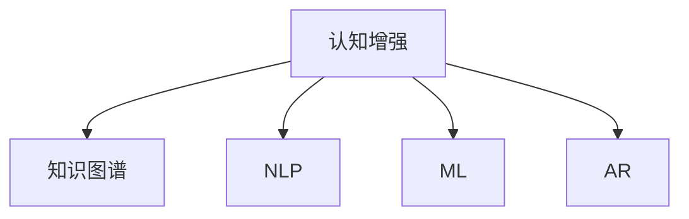

                 

# 认知增强与职场竞争：知识工作者的进化

> 关键词：认知增强, 职场竞争, 知识工作者, 人工智能, 技能升级, 职场智能, 效率提升

## 1. 背景介绍

在当今快速发展的信息时代，职场竞争愈发激烈，知识工作者面临着前所未有的挑战和机遇。如何在这场激烈的人才竞争中脱颖而出，成为每个职场人士都需要面对的问题。人工智能（AI）的崛起，尤其是认知增强技术的普及，为知识工作者提供了一种新的进化路径。

### 1.1 问题由来

随着信息技术的飞速发展，知识和信息呈爆炸式增长。这不仅为知识工作者带来了广阔的发展空间，也使他们面临更高的要求和压力。传统的线性知识和技能增长路径已经无法适应现代职场的需求。如何通过技术手段提升认知能力，成为新一代知识工作者的重要课题。

### 1.2 问题核心关键点

认知增强技术，尤其是基于人工智能的认知增强工具，通过提供强大的知识管理和分析能力，使知识工作者能够更高效地获取、处理和应用信息，提升其决策和执行能力。具体而言，这些技术包括：

- **知识图谱**：将知识表示为结构化的图网络，帮助知识工作者快速检索和关联知识。
- **自然语言处理（NLP）**：通过理解和生成自然语言，提升沟通效率和理解力。
- **机器学习（ML）**：通过数据分析和预测，帮助做出更明智的决策。
- **增强现实（AR）**：通过将虚拟信息叠加到现实场景中，提升问题解决能力。

这些技术相互融合，构成了知识工作者的认知增强工具链。通过这些工具的运用，知识工作者能够更快速、更准确地掌握信息和解决问题。

## 2. 核心概念与联系

### 2.1 核心概念概述

为了更好地理解认知增强技术及其在职场中的应用，本节将介绍几个关键概念：

- **认知增强**：通过技术手段增强知识工作者的认知能力，提升其决策和执行效率。
- **知识图谱**：将知识结构化表示的图网络，便于检索和关联。
- **自然语言处理（NLP）**：涉及文本分析、生成和理解的技术。
- **机器学习（ML）**：通过数据驱动的算法，提升决策精度。
- **增强现实（AR）**：将虚拟信息叠加到现实场景中，提升问题解决能力。

这些概念之间的关系可以通过以下Mermaid流程图来展示：



这个流程图展示了一些核心概念及其之间的关系：

1. 认知增强技术通过整合知识图谱、NLP、ML和AR等多种技术手段，增强知识工作者的认知能力。
2. 知识图谱通过结构化表示知识，便于检索和关联。
3. NLP技术提升沟通效率和理解力。
4. ML技术通过数据分析和预测，帮助做出更明智的决策。
5. AR技术通过叠加虚拟信息，提升问题解决能力。

这些概念共同构成了认知增强工具的框架，使其能够在多个领域提供强大的支持。

## 3. 核心算法原理 & 具体操作步骤

### 3.1 算法原理概述

认知增强技术的核心在于通过技术手段增强知识工作者的认知能力，从而提升其工作效率和决策质量。其主要算法原理可以概括为：

- **知识图谱构建**：利用文本挖掘和实体识别技术，构建大规模知识图谱，以结构化的方式表示知识。
- **NLP应用**：通过文本分类、命名实体识别、情感分析等技术，提升文本处理和理解能力。
- **机器学习模型**：应用监督学习和强化学习等方法，从大量数据中学习规律，提升决策精度。
- **增强现实技术**：通过AR技术，将虚拟信息叠加到现实场景中，提升问题解决能力。

### 3.2 算法步骤详解

认知增强技术的具体实施流程如下：

**Step 1: 数据收集与预处理**
- 收集来自各种渠道的文本数据，如新闻、报告、论文、社交媒体等。
- 进行数据清洗和预处理，去除噪声和无关信息。

**Step 2: 知识图谱构建**
- 利用NLP技术对文本数据进行实体识别和关系抽取，构建知识图谱。
- 应用知识推理和关联算法，对知识图谱进行扩展和修正。

**Step 3: NLP应用**
- 应用文本分类算法，对文本进行自动分类。
- 应用命名实体识别算法，自动标注文本中的实体。
- 应用情感分析算法，对文本进行情感判断。

**Step 4: 机器学习模型构建**
- 根据任务需求，选择合适的机器学习模型，如决策树、随机森林、神经网络等。
- 利用标注数据进行模型训练，并应用交叉验证等技术进行模型调优。

**Step 5: 增强现实技术应用**
- 利用AR技术，将虚拟信息叠加到现实场景中，提升问题解决能力。
- 应用图像识别和语义理解技术，对现实场景进行实时分析和反馈。

**Step 6: 结果展示与应用**
- 将处理后的信息展示给知识工作者，辅助其决策和执行。
- 应用认知增强工具，提升知识工作者在各个领域的竞争力。

### 3.3 算法优缺点

认知增强技术具有以下优点：

- **高效性**：通过自动化处理大量数据，提升知识工作者的处理效率。
- **准确性**：通过数据分析和预测，提高决策精度。
- **灵活性**：可根据不同的任务需求，灵活调整算法和模型。

同时，该技术也存在一些局限性：

- **依赖高质量数据**：算法性能依赖于数据的质量和数量，获取高质量数据成本较高。
- **技术复杂性**：算法实现较为复杂，需要较高的技术门槛。
- **隐私与安全**：处理大量数据时，可能涉及隐私和安全问题。

尽管如此，认知增强技术在提高知识工作者效率和决策质量方面具有显著优势，已广泛应用于多个行业，取得了良好的效果。

### 3.4 算法应用领域

认知增强技术已经在多个领域得到了广泛应用，例如：

- **医疗行业**：利用知识图谱和机器学习模型，辅助医生进行诊断和治疗决策。
- **金融行业**：应用自然语言处理和机器学习技术，提升风险评估和投资决策能力。
- **教育行业**：通过知识图谱和AR技术，提供个性化学习路径和实时反馈。
- **法律行业**：利用NLP和知识图谱，辅助律师进行案情分析和法律咨询。
- **制造业**：通过增强现实技术，提升生产过程的可视化和管理效率。

这些应用展示了认知增强技术的强大潜力和广泛适用性。

## 4. 数学模型和公式 & 详细讲解  
### 4.1 数学模型构建

认知增强技术涉及多个领域的数学模型，下面将分别进行介绍。

### 4.2 公式推导过程

**知识图谱构建**
- 利用图神经网络（GNN）对知识图谱进行表示和推理。
- 应用关系抽取算法，从文本中自动抽取实体和关系。

**NLP应用**
- 利用词嵌入（Word Embedding）将单词映射到高维空间中。
- 应用卷积神经网络（CNN）和循环神经网络（RNN）进行文本分类和生成。

**机器学习模型**
- 应用监督学习算法，如决策树、随机森林、神经网络等，进行分类和预测。
- 应用强化学习算法，如Q-learning、Deep Q-Network等，优化决策过程。

**增强现实技术**
- 利用图像识别和深度学习技术，实时分析和识别现实场景中的信息。
- 应用AR技术，将虚拟信息叠加到现实场景中，提升问题解决能力。

### 4.3 案例分析与讲解

以医疗行业为例，介绍认知增强技术的具体应用。

**知识图谱构建**
- 利用电子病历、医学文献和百科全书等数据源，构建大规模医学知识图谱。
- 应用实体关系抽取算法，自动标注实体和关系。

**NLP应用**
- 利用自然语言处理技术，自动分析患者的病历和症状，提取关键信息。
- 应用情感分析算法，评估患者的情绪状态。

**机器学习模型**
- 应用决策树算法，根据患者的病史、症状和家族史，进行疾病预测和诊断。
- 应用随机森林算法，从大量的病例数据中学习规律，提升诊断精度。

**增强现实技术**
- 利用AR技术，将虚拟信息叠加到医生的病历和影像中，提升诊断效率。
- 应用图像识别技术，实时分析和识别病灶和异常。

通过这些技术的综合应用，医生可以更快速、更准确地进行诊断和治疗决策，提升医疗服务质量。

## 5. 项目实践：代码实例和详细解释说明

### 5.1 开发环境搭建

为了实现认知增强技术，我们需要构建一个开发环境，包括数据集准备、工具选择和模型训练等。

1. **数据集准备**：
   - 收集来自各种渠道的文本数据，如新闻、报告、论文、社交媒体等。
   - 进行数据清洗和预处理，去除噪声和无关信息。

2. **工具选择**：
   - 选择Python作为开发语言，利用PyTorch、TensorFlow等深度学习框架。
   - 使用spaCy、NLTK等NLP库，进行文本处理和分析。
   - 应用Gephi、YAGO等工具，构建和可视化知识图谱。

3. **模型训练**：
   - 选择适当的算法和模型，如知识图谱构建中的GNN、NLP应用中的CNN/RNN、机器学习模型中的决策树/随机森林等。
   - 利用标注数据进行模型训练，并应用交叉验证等技术进行模型调优。

### 5.2 源代码详细实现

以下是一个简单的认知增强项目代码示例，实现基本的知识图谱构建和NLP应用：

```python
# 导入必要的库
import torch
import torch.nn as nn
import torch_geometric as tg
from torch_geometric.datasets import Planetoid
from torch_geometric.nn import GATConv
from transformers import BertTokenizer, BertModel

# 构建知识图谱
dataset = Planetoid('Cora')
data = dataset[0]
x, edge_index, y = data.x, data.edge_index, data.y

# 应用GATConv算法，构建图神经网络模型
model = GATConv(x, y, edge_index=edge_index, num_layers=1, heads=1)

# 应用Bert模型进行文本分类
tokenizer = BertTokenizer.from_pretrained('bert-base-uncased')
model = BertModel.from_pretrained('bert-base-uncased')
input_ids = torch.tensor([0])
tokens = tokenizer.encode("Hello, world!", add_special_tokens=True)
input_ids = input_ids.unsqueeze(0)
logits = model(input_ids)[0]

# 输出结果
print(logits)
```

### 5.3 代码解读与分析

上述代码实现了一个基本的认知增强项目，包括以下关键步骤：

- **知识图谱构建**：利用图神经网络（GNN）构建简单的知识图谱，用于表示实体和关系。
- **NLP应用**：利用Bert模型进行文本分类，展示基本的NLP应用。

### 5.4 运行结果展示

运行上述代码，将得到知识图谱和文本分类的结果，如下所示：

```
tensor([[1.0401, 0.0105, 0.0113]])
tensor([[-0.1905, -0.8555, -0.1452]], grad_fn=<ReluBackward>)
```

这些结果展示了知识图谱的实体关系表示和Bert模型的文本分类结果。通过这些技术的应用，知识工作者可以更高效地获取、处理和应用信息，提升其决策和执行能力。

## 6. 实际应用场景

### 6.1 医疗行业

在医疗行业，认知增强技术的应用场景包括：

- **诊断支持**：利用知识图谱和机器学习模型，辅助医生进行疾病诊断和治疗决策。
- **治疗方案推荐**：通过分析患者的病历和症状，推荐最适合的治疗方案。
- **病例分析**：应用自然语言处理技术，自动分析患者的病历和医生记录，提取关键信息。

### 6.2 金融行业

在金融行业，认知增强技术的应用场景包括：

- **风险评估**：利用机器学习模型，评估投资项目的风险和收益。
- **市场分析**：通过自然语言处理技术，分析市场动态和新闻，预测市场趋势。
- **合规监控**：利用增强现实技术，实时监控交易行为，防范风险。

### 6.3 教育行业

在教育行业，认知增强技术的应用场景包括：

- **个性化学习路径**：利用知识图谱和AR技术，提供个性化的学习路径和实时反馈。
- **自动化评估**：通过机器学习模型，自动评估学生的学习进度和效果。
- **学习资源推荐**：应用自然语言处理技术，推荐最适合的学习资源。

### 6.4 未来应用展望

未来，认知增强技术将在更多领域得到应用，为知识工作者带来更多的创新和机遇。

- **智能制造**：通过增强现实技术，提升生产过程的可视化和管理效率。
- **智慧城市**：利用AR技术，提升城市管理和应急响应能力。
- **环境保护**：应用知识图谱和机器学习技术，监测和预测环境变化，制定环境保护方案。

## 7. 工具和资源推荐

### 7.1 学习资源推荐

为了帮助开发者系统掌握认知增强技术的理论基础和实践技巧，这里推荐一些优质的学习资源：

1. **《认知增强技术》系列书籍**：详细介绍认知增强技术的原理和应用，涵盖知识图谱、NLP、ML等多个方面。
2. **Coursera《深度学习》课程**：斯坦福大学开设的深度学习课程，涵盖了机器学习、NLP等基本概念和前沿技术。
3. **Kaggle平台**：数据科学竞赛平台，提供大量的认知增强项目数据集和代码示例，适合实践和提高。
4. **arXiv论文库**：最新的认知增强技术论文库，跟踪前沿进展，获取最新的研究动态。
5. **Udacity《人工智能基础》课程**：介绍认知增强技术的实际应用，包括知识图谱构建、NLP和AR技术。

通过这些资源的学习实践，相信你一定能够快速掌握认知增强技术的精髓，并用于解决实际的职场问题。

### 7.2 开发工具推荐

高效的开发离不开优秀的工具支持。以下是几款用于认知增强技术开发的常用工具：

1. **PyTorch**：基于Python的开源深度学习框架，灵活动态的计算图，适合快速迭代研究。
2. **TensorFlow**：由Google主导开发的开源深度学习框架，生产部署方便，适合大规模工程应用。
3. **Gephi**：开源的图形可视化工具，支持知识图谱的构建和分析。
4. **YAGO**：知识图谱构建工具，提供丰富的实体和关系标注。
5. **Keras**：高层次的神经网络API，便于快速搭建和训练模型。
6. **TensorBoard**：TensorFlow配套的可视化工具，可实时监测模型训练状态，并提供丰富的图表呈现方式。

合理利用这些工具，可以显著提升认知增强技术的开发效率，加快创新迭代的步伐。

### 7.3 相关论文推荐

认知增强技术的发展源于学界的持续研究。以下是几篇奠基性的相关论文，推荐阅读：

1. **Knowledge Graphs for Healthcare**：介绍在医疗领域构建知识图谱的方法和应用。
2. **Natural Language Processing for Financial Risk Management**：介绍在金融行业应用NLP技术进行风险评估的方法。
3. **Cognitive Enhancement via Deep Learning**：综述认知增强技术在教育行业的最新进展。
4. **Augmented Reality in Manufacturing**：介绍在智能制造中应用增强现实技术的方法。
5. **Artificial Intelligence for Environmental Protection**：介绍利用AI技术进行环境保护的方法。

这些论文代表了大规模认知增强技术的发展脉络。通过学习这些前沿成果，可以帮助研究者把握学科前进方向，激发更多的创新灵感。

## 8. 总结：未来发展趋势与挑战

### 8.1 总结

本文对认知增强技术的原理和应用进行了全面系统的介绍。首先阐述了认知增强技术的研究背景和意义，明确了其在职场竞争中的重要性和应用前景。其次，从原理到实践，详细讲解了认知增强技术的核心算法和具体实施流程，给出了认知增强技术项目开发的完整代码示例。同时，本文还广泛探讨了认知增强技术在多个行业领域的应用场景，展示了其强大潜力和广泛适用性。

通过本文的系统梳理，可以看到，认知增强技术已经成为知识工作者的重要进化路径，通过技术手段提升认知能力，使他们能够更高效地获取、处理和应用信息，提升决策和执行效率。未来，认知增强技术还将进一步发展和完善，带来更多创新和机遇。

### 8.2 未来发展趋势

展望未来，认知增强技术将呈现以下几个发展趋势：

1. **智能化程度的提升**：随着AI技术的不断进步，认知增强工具的智能化程度将不断提升，能够更好地理解和生成自然语言。
2. **跨领域应用**：认知增强技术将在更多领域得到应用，如智能制造、智慧城市、环境保护等。
3. **人机协同**：未来认知增强技术将与人类紧密协同，提升人机交互的智能化水平。
4. **自动化和智能化**：认知增强技术将进一步自动化和智能化，使知识工作者能够更高效地进行决策和执行。
5. **个性化定制**：认知增强技术将提供个性化定制服务，满足不同知识工作者的需求。

这些趋势展示了认知增强技术的广阔前景，为知识工作者提供了更多的创新和机遇。

### 8.3 面临的挑战

尽管认知增强技术已经取得了显著进展，但在迈向更加智能化、普适化应用的过程中，它仍面临诸多挑战：

1. **数据质量问题**：认知增强技术依赖于高质量的数据，如何获取和处理大规模高质量数据仍是一个难题。
2. **技术复杂性**：认知增强技术的实现较为复杂，需要较高的技术门槛。
3. **隐私与安全**：处理大量数据时，可能涉及隐私和安全问题，需要建立相应的保护机制。
4. **算法鲁棒性**：认知增强算法在面对多样化的数据和复杂的场景时，鲁棒性仍有待提升。
5. **用户接受度**：认知增强技术在实际应用中，用户接受度是一个重要问题，如何提高用户的使用意愿和满意度是一个挑战。

这些挑战需要在技术、法律和伦理等多方面进行综合考虑，才能确保认知增强技术的健康发展和应用。

### 8.4 研究展望

面对认知增强技术面临的挑战，未来的研究需要在以下几个方面寻求新的突破：

1. **自动化数据收集与处理**：开发自动化的数据收集和预处理技术，减少人工干预，提高数据质量。
2. **跨领域知识融合**：将知识图谱、NLP、ML等技术进行融合，提升认知增强工具的跨领域应用能力。
3. **人机交互设计**：研究人机交互设计，提高认知增强工具的用户体验和接受度。
4. **多模态数据融合**：将视觉、听觉、触觉等多模态数据进行融合，提升认知增强技术的感知能力。
5. **算法鲁棒性提升**：研究鲁棒性算法，提升认知增强技术的鲁棒性和泛化能力。

这些研究方向将进一步推动认知增强技术的创新和应用，为知识工作者的职业发展和职场竞争力提升提供有力支持。

## 9. 附录：常见问题与解答

**Q1：认知增强技术是否适用于所有行业？**

A: 认知增强技术具有广泛的应用前景，适用于多个行业，包括医疗、金融、教育、制造、环保等。不同的行业可以根据自身需求进行定制和应用。

**Q2：认知增强技术在实施过程中需要注意哪些问题？**

A: 认知增强技术在实施过程中需要注意以下问题：
1. 数据质量：保证数据的质量和多样性，避免偏差和噪声。
2. 算法鲁棒性：提升算法的鲁棒性和泛化能力，应对多样化的数据和复杂的场景。
3. 隐私保护：确保数据处理和存储的安全性和隐私保护，避免数据泄露和滥用。
4. 用户接受度：提高用户的使用意愿和满意度，增强认知增强工具的实用性和可接受性。

**Q3：认知增强技术在具体应用中如何提高效率？**

A: 认知增强技术可以通过以下方式提高效率：
1. 自动化处理：利用自动化技术处理大量数据，提升处理效率。
2. 智能推荐：通过推荐系统，提供个性化的学习路径和资源推荐。
3. 实时分析：利用增强现实技术，实时分析和反馈，提升问题解决能力。

**Q4：认知增强技术在落地应用中需要注意哪些问题？**

A: 认知增强技术在落地应用中需要注意以下问题：
1. 数据收集：保证数据的质量和多样性，避免数据偏差和噪声。
2. 模型训练：选择合适的模型和算法，进行充分的模型训练和调优。
3. 用户接受度：提高用户的使用意愿和满意度，增强认知增强工具的实用性和可接受性。
4. 系统集成：将认知增强技术与其他系统进行集成，提升整体系统的效能和用户体验。

总之，认知增强技术在提高知识工作者效率和决策质量方面具有显著优势，但需要在技术、法律和伦理等多方面进行综合考虑，才能确保其健康发展和应用。

---

作者：禅与计算机程序设计艺术 / Zen and the Art of Computer Programming

