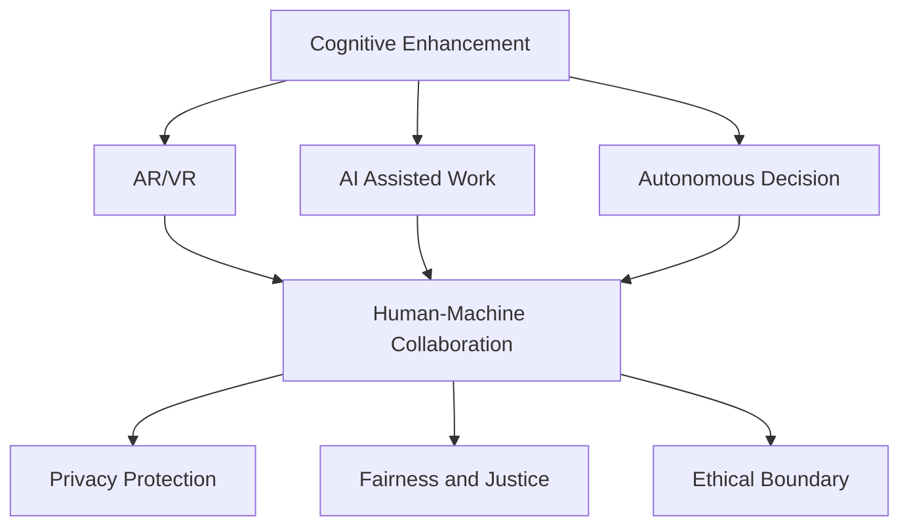

                 

# 认知增强的伦理边界：人性的定义与挑战

> 关键词：认知增强,人工智能,伦理,人性,边界,挑战

## 1. 背景介绍

### 1.1 问题由来

随着人工智能技术的飞速发展，认知增强(AI)技术已经成为推动人类进步的重要引擎。从增强现实(AR)、虚拟现实(VR)到机器学习、深度学习，认知增强技术正在不断拓展人类的认知边界，提升人类的感知、思考和创造能力。然而，这一过程中也带来了新的伦理问题，尤其是关于人性、隐私和控制权的讨论。如何在认知增强技术蓬勃发展的同时，保障人类的权益和价值，成为当前技术界和社会亟需解决的问题。

### 1.2 问题核心关键点

当前，认知增强技术主要集中在以下几个领域：

1. **增强现实与虚拟现实**：通过AR、VR技术，使人类能够体验到更加逼真的虚拟环境，提升感知和认知能力。
2. **智能辅助**：利用机器学习、深度学习等技术，辅助人类完成复杂任务，提升工作效率。
3. **自动化决策**：通过认知增强技术，使机器能够自主进行决策，甚至在某些领域取代人类。

这些技术的广泛应用，对人类的认知、社会和伦理都带来了深远的影响。其中，如何界定人工智能与人类认知的边界，成为当前认知增强技术伦理问题的核心。

## 2. 核心概念与联系

### 2.1 核心概念概述

为更好地理解认知增强技术的伦理问题，本节将介绍几个密切相关的核心概念：

- **认知增强(AI)**：通过各种技术手段，增强人类的认知能力，提升感知、思考和创造力。
- **增强现实(AR)与虚拟现实(VR)**：通过虚拟环境和交互式信息展示，提升人类的空间感知和交互体验。
- **人机协同**：人工智能与人类在任务中的协同工作，实现人类与机器的互补和优化。
- **隐私保护**：在认知增强技术应用过程中，如何保护用户的隐私和数据安全。
- **公平与公正**：认知增强技术在社会中的应用，是否能够消除歧视，实现公平和公正。
- **伦理边界**：在认知增强技术中，人工智能与人类认知之间的界线在哪里，如何保护人类的主体性和价值。

这些核心概念之间的逻辑关系可以通过以下Mermaid流程图来展示：



这个流程图展示了几大核心概念之间的联系：

1. 认知增强技术通过AR、VR等手段提升人类的认知能力。
2. 增强现实与虚拟现实等技术，促进了人机协同，使AI辅助工作更加高效。
3. 认知增强技术在自动化决策中的应用，推动了机器在更多领域取代人类。
4. 在技术应用过程中，隐私保护、公平正义和伦理边界成为关键问题。

这些概念共同构成了认知增强技术的应用框架，其中伦理边界问题尤为重要，本文将重点探讨。

## 3. 核心算法原理 & 具体操作步骤

### 3.1 算法原理概述

认知增强技术的伦理边界问题，主要涉及如何平衡人工智能与人类认知的关系，确保人工智能技术的合理使用，不损害人类的主体性和价值。这包括但不限于以下几个方面：

- **算法透明度**：确保人工智能决策过程的透明性和可解释性，使用户能够理解和信任算法。
- **用户控制权**：赋予用户对其数据和认知增强体验的控制权，防止数据滥用和信息泄露。
- **隐私保护**：在数据收集和处理过程中，采取隐私保护措施，防止个人隐私被侵犯。
- **公平性与公正性**：确保认知增强技术在社会中的应用，不产生歧视，实现公平与公正。
- **伦理边界**：明确人工智能与人类认知的边界，确保人工智能技术的合理应用，不超越人类的伦理界限。

### 3.2 算法步骤详解

认知增强技术的伦理边界问题，涉及到技术、伦理和社会等多个层面，解决这一问题需要从多个角度入手。以下是具体的算法步骤：

1. **需求分析**：
   - 明确认知增强技术的应用场景和目标用户群体。
   - 分析用户需求，确保技术应用符合用户的期望和利益。

2. **隐私保护**：
   - 采取匿名化、去标识化等技术手段，保护用户隐私。
   - 在数据收集和处理过程中，遵循GDPR等隐私保护法规。

3. **公平与公正**：
   - 在算法设计中，消除偏见和歧视，确保算法决策的公平性。
   - 定期审计算法，防止算法偏见对社会造成负面影响。

4. **伦理审查**：
   - 建立独立的伦理审查委员会，对认知增强技术的应用进行审查。
   - 制定伦理规范和准则，确保技术应用符合伦理标准。

5. **透明度与可解释性**：
   - 使用可视化技术，展示算法决策过程，增强透明度。
   - 开发可解释性算法，让用户能够理解和信任算法的决策。

6. **用户控制权**：
   - 赋予用户对其数据和体验的控制权，防止数据滥用。
   - 提供用户选择权，让用户能够自由选择是否接受认知增强技术的应用。

### 3.3 算法优缺点

认知增强技术的伦理边界问题，主要涉及以下几个方面的优缺点：

**优点**：
1. **提升认知能力**：通过认知增强技术，可以提升人类的认知能力，增强感知、思考和创造力。
2. **促进人机协同**：人机协同可以实现效率提升和任务优化，推动生产力和创新的发展。
3. **保护隐私**：通过隐私保护措施，防止数据滥用和信息泄露，保护用户的权益。

**缺点**：
1. **隐私泄露风险**：认知增强技术在应用过程中，可能收集大量用户数据，存在隐私泄露的风险。
2. **算法偏见**：算法偏见可能导致决策不公，对社会造成负面影响。
3. **伦理边界模糊**：人工智能与人类认知的边界模糊，可能导致技术滥用和伦理争议。

尽管存在这些缺点，认知增强技术的伦理边界问题，仍然需要通过多方面的努力，找到合理的解决方案，确保技术应用的公正性和伦理标准。

### 3.4 算法应用领域

认知增强技术的伦理边界问题，在多个领域都有广泛的应用和讨论：

1. **医疗领域**：
   - 增强现实技术用于手术导航和培训，提升医生的手术技能。
   - 认知增强技术辅助医生进行诊断和治疗，提升医疗服务的效率和质量。

2. **教育领域**：
   - 增强现实技术用于虚拟课堂和互动学习，提升学生的学习体验和效果。
   - 认知增强技术用于个性化教育，帮助学生克服学习困难。

3. **交通运输领域**：
   - 增强现实技术用于导航和驾驶辅助，提升驾驶安全性和舒适性。
   - 认知增强技术用于交通管理，优化交通流量和减少拥堵。

4. **工业制造领域**：
   - 增强现实技术用于设备维护和故障诊断，提升设备的可靠性和维修效率。
   - 认知增强技术用于生产过程优化和质量控制，提升生产效率和产品质量。

## 4. 数学模型和公式 & 详细讲解 & 举例说明

### 4.1 数学模型构建

认知增强技术的伦理边界问题，涉及到多个领域，但其核心在于算法决策的公正性和透明性。以下将以医疗诊断为例，构建数学模型：

假设在医疗诊断中，使用认知增强技术对病人的症状进行分类和诊断。设$X$为病人的症状数据，$Y$为诊断结果，$M$为认知增强模型，其参数为$\theta$。则模型的预测函数为：

$$
M_{\theta}(X) = \frac{e^{f_{\theta}(X)}}{e^{f_{\theta}(X)}+e^{f_{\theta}(X')}}
$$

其中$f_{\theta}(X)$为模型的输出函数，$X'$为对照症状数据。

### 4.2 公式推导过程

在医疗诊断中，模型的输出函数$f_{\theta}(X)$可以通过以下方式进行推导：

$$
f_{\theta}(X) = \sum_{i=1}^n w_i \cdot h_{\theta}(x_i)
$$

其中$w_i$为特征权重，$h_{\theta}(x_i)$为特征函数。

模型的输出函数$M_{\theta}(X)$可以进一步简化为：

$$
M_{\theta}(X) = \frac{e^{f_{\theta}(X)}}{e^{f_{\theta}(X)}+e^{f_{\theta}(X')}}
$$

这个公式表示，模型通过比较两个病人的症状数据的输出函数值，来判断其诊断结果。

### 4.3 案例分析与讲解

假设在医疗诊断中，有两位病人的症状数据$X_1$和$X_2$，对应的诊断结果为$Y_1$和$Y_2$。使用认知增强模型对这两位病人的症状数据进行诊断，得到输出函数值$f_{\theta}(X_1)$和$f_{\theta}(X_2)$。

|病人编号|症状数据$X$|输出函数值$f_{\theta}(X)$|诊断结果$Y$|认知增强模型输出$M_{\theta}(X)$|
|---|---|---|---|---|
|1|$X_1$|$f_{\theta}(X_1)$|$Y_1$|$M_{\theta}(X_1)$|
|2|$X_2$|$f_{\theta}(X_2)$|$Y_2$|$M_{\theta}(X_2)$|

通过以上案例，可以看到，认知增强模型通过输出函数值$f_{\theta}(X)$，对病人的症状数据进行分类和诊断，最终得到认知增强模型的输出$M_{\theta}(X)$，判断其诊断结果。

## 5. 项目实践：代码实例和详细解释说明

### 5.1 开发环境搭建

在进行认知增强技术伦理边界的项目实践时，需要一个开发环境来进行模型训练和测试。以下是使用Python进行TensorFlow开发的环境配置流程：

1. 安装Anaconda：从官网下载并安装Anaconda，用于创建独立的Python环境。

2. 创建并激活虚拟环境：
```bash
conda create -n tf-env python=3.8 
conda activate tf-env
```

3. 安装TensorFlow：根据CUDA版本，从官网获取对应的安装命令。例如：
```bash
conda install tensorflow tensorflow-cpu tensorflow-gpu
```

4. 安装TensorBoard：用于可视化模型训练过程和结果。

5. 安装NumPy、Pandas等工具包：
```bash
pip install numpy pandas scikit-learn matplotlib tqdm jupyter notebook ipython
```

完成上述步骤后，即可在`tf-env`环境中开始项目实践。

### 5.2 源代码详细实现

下面以医疗诊断为例，给出使用TensorFlow对认知增强模型进行训练和测试的代码实现。

```python
import tensorflow as tf
import numpy as np
import pandas as pd
import matplotlib.pyplot as plt

# 数据准备
train_data = pd.read_csv('train_data.csv')
test_data = pd.read_csv('test_data.csv')

# 数据预处理
train_x = train_data.drop('y', axis=1).values
train_y = train_data['y'].values
test_x = test_data.drop('y', axis=1).values
test_y = test_data['y'].values

# 模型构建
model = tf.keras.Sequential([
    tf.keras.layers.Dense(64, activation='relu', input_shape=(train_x.shape[1],)),
    tf.keras.layers.Dense(32, activation='relu'),
    tf.keras.layers.Dense(2, activation='softmax')
])

# 编译模型
model.compile(optimizer=tf.keras.optimizers.Adam(learning_rate=0.001),
              loss='sparse_categorical_crossentropy',
              metrics=['accuracy'])

# 训练模型
model.fit(train_x, train_y, epochs=50, validation_data=(test_x, test_y))

# 模型评估
test_loss, test_acc = model.evaluate(test_x, test_y)
print('Test accuracy:', test_acc)
```

### 5.3 代码解读与分析

让我们再详细解读一下关键代码的实现细节：

**数据准备与预处理**：
- `train_data`和`test_data`分别代表训练集和测试集，包含病人的症状数据和诊断结果。
- 使用`drop`方法去除诊断结果，将数据转换为模型训练所需的格式。
- 将数据转换为NumPy数组，方便模型处理。

**模型构建**：
- 使用`Sequential`模型，定义三个全连接层。
- 第一层为64个神经元，激活函数为ReLU。
- 第二层为32个神经元，激活函数为ReLU。
- 第三层为2个神经元，激活函数为Softmax，输出诊断结果。

**模型编译与训练**：
- 使用`Adam`优化器，学习率为0.001。
- 定义损失函数为稀疏分类交叉熵，衡量模型预测结果与真实标签的差异。
- 定义评估指标为准确率，衡量模型在测试集上的表现。
- 使用`fit`方法进行模型训练，指定训练轮数为50。
- 在训练过程中，使用测试集进行验证，防止过拟合。

**模型评估**：
- 使用`evaluate`方法评估模型在测试集上的表现，输出损失和准确率。

可以看到，TensorFlow使得模型构建和训练过程变得简洁高效。开发者可以将更多精力放在数据处理和模型改进等高层逻辑上，而不必过多关注底层的实现细节。

## 6. 实际应用场景

### 6.1 医疗诊断

在医疗诊断中，认知增强技术可以帮助医生提高诊断的准确性和效率。通过增强现实技术，医生可以在手术过程中实时查看病人的三维图像和手术步骤，提升手术的精准度。同时，认知增强技术可以辅助医生进行诊断，提供实时的诊断建议，提升医疗服务的质量。

### 6.2 教育培训

在教育培训中，认知增强技术可以用于虚拟课堂和互动学习，提升学生的学习体验和效果。通过增强现实技术，学生可以在虚拟环境中进行模拟实验和操作，提升学习兴趣和实践能力。同时，认知增强技术可以用于个性化教育，帮助学生克服学习困难，提升学习效果。

### 6.3 智能家居

在智能家居中，认知增强技术可以用于智能辅助和生活管理。通过增强现实技术，用户可以在虚拟环境中控制家中的各种设备，提升生活便捷性。同时，认知增强技术可以用于生活管理，提供健康监测和日程提醒等服务，提升生活质量。

## 7. 工具和资源推荐

### 7.1 学习资源推荐

为了帮助开发者系统掌握认知增强技术的伦理边界，这里推荐一些优质的学习资源：

1. 《人工智能伦理》系列博文：由大模型技术专家撰写，深入浅出地介绍了人工智能伦理的基本概念和前沿话题。

2. CS231n《深度学习计算机视觉》课程：斯坦福大学开设的计算机视觉明星课程，涵盖深度学习在视觉领域的应用，了解认知增强技术在视觉方面的伦理问题。

3. 《人工智能伦理与法律》书籍：全面介绍了人工智能伦理和法律的基础知识，对认知增强技术的伦理问题进行深入探讨。

4. 《人工智能伦理边界》博客：深入分析了认知增强技术在各个领域中的伦理问题，提供了丰富的案例和实践建议。

通过对这些资源的学习实践，相信你一定能够系统掌握认知增强技术的伦理边界，并用于解决实际的NLP问题。

### 7.2 开发工具推荐

高效的开发离不开优秀的工具支持。以下是几款用于认知增强技术开发的常用工具：

1. TensorFlow：基于Python的开源深度学习框架，生产部署方便，适合大规模工程应用。
2. PyTorch：基于Python的开源深度学习框架，灵活动态的计算图，适合快速迭代研究。
3. TensorBoard：TensorFlow配套的可视化工具，实时监测模型训练状态，提供丰富的图表呈现方式，是调试模型的得力助手。
4. Weights & Biases：模型训练的实验跟踪工具，记录和可视化模型训练过程中的各项指标，方便对比和调优。

合理利用这些工具，可以显著提升认知增强技术的开发效率，加快创新迭代的步伐。

### 7.3 相关论文推荐

认知增强技术的伦理边界问题，涉及到多方面的研究，以下是几篇奠基性的相关论文，推荐阅读：

1. "Fairness in Artificial Intelligence"：探讨人工智能在社会中的应用是否产生公平性问题，提供解决方案。
2. "Ethical Boundaries of Artificial Intelligence"：分析人工智能与人类认知的伦理边界，讨论合理应用的技术标准。
3. "Privacy-Preserving Techniques in AI"：介绍隐私保护技术在人工智能中的应用，确保数据和隐私安全。
4. "Transparency and Explainability in AI"：讨论人工智能算法的透明度和可解释性问题，增强用户信任。

这些论文代表了大语言模型微调技术的发展脉络。通过学习这些前沿成果，可以帮助研究者把握学科前进方向，激发更多的创新灵感。

## 8. 总结：未来发展趋势与挑战

### 8.1 总结

本文对认知增强技术的伦理边界问题进行了全面系统的介绍。首先阐述了认知增强技术的应用场景和伦理问题的核心，明确了技术应用过程中需要关注的伦理标准和边界问题。其次，从原理到实践，详细讲解了认知增强技术的核心算法和具体操作步骤，提供了具体的代码实例和详细解释说明。同时，本文还广泛探讨了认知增强技术在多个领域的应用前景，展示了技术的广阔前景。

通过本文的系统梳理，可以看到，认知增强技术在推动人类认知边界拓展的同时，也带来了新的伦理问题。如何在技术应用过程中，平衡人类与人工智能的关系，确保技术应用的公正性和伦理标准，将是未来认知增强技术发展的重要课题。

### 8.2 未来发展趋势

展望未来，认知增强技术的伦理边界问题将呈现以下几个发展趋势：

1. **透明度与可解释性提升**：
   - 开发更透明的算法，增强用户对算法决策的理解和信任。
   - 使用可视化技术，展示算法决策过程，增强透明性。

2. **隐私保护技术进步**：
   - 采用先进的隐私保护技术，防止数据滥用和隐私泄露。
   - 建立隐私保护法规和标准，确保数据安全和用户权益。

3. **公平性与公正性实现**：
   - 消除算法偏见和歧视，确保技术应用的社会公正性。
   - 定期审计算法，防止算法偏见对社会造成负面影响。

4. **伦理边界明确化**：
   - 制定伦理边界标准，明确人工智能与人类认知的界线。
   - 在技术应用过程中，遵循伦理规范，确保技术应用的合理性。

5. **多模态融合技术发展**：
   - 融合视觉、语音、文本等多模态信息，提升认知增强技术的综合能力。
   - 开发多模态认知增强系统，实现更加全面和智能的人机交互。

以上趋势凸显了认知增强技术伦理边界的广阔前景。这些方向的探索发展，必将进一步提升认知增强技术的应用效果，确保技术应用的公正性和伦理标准。

### 8.3 面临的挑战

尽管认知增强技术的伦理边界问题已经引起了广泛关注，但在迈向更加智能化、普适化应用的过程中，它仍面临着诸多挑战：

1. **算法透明度与可解释性**：
   - 复杂的深度学习模型，难以解释其决策过程，导致用户对算法的不信任。
   - 开发透明和可解释的算法，增强用户信任，是未来研究的重要方向。

2. **隐私保护**：
   - 认知增强技术在应用过程中，可能收集大量用户数据，存在隐私泄露的风险。
   - 开发隐私保护技术，确保数据安全和用户权益，将是未来的重要任务。

3. **公平性与公正性**：
   - 认知增强技术在社会中的应用，可能产生歧视和不公，对社会造成负面影响。
   - 消除算法偏见，确保技术应用的公正性，是未来研究的重要课题。

4. **伦理边界模糊**：
   - 人工智能与人类认知的边界模糊，可能导致技术滥用和伦理争议。
   - 明确伦理边界，确保技术应用的合理性，将是未来研究的重要方向。

5. **资源消耗**：
   - 认知增强技术在训练和推理过程中，可能消耗大量的计算资源和时间。
   - 优化算法，减少计算资源消耗，提高效率，将是未来的重要任务。

6. **安全与可靠性**：
   - 认知增强技术在应用过程中，可能存在安全漏洞和不可靠的问题。
   - 确保系统安全可靠，防止恶意攻击和系统故障，是未来研究的重要方向。

以上挑战需要从技术、伦理和社会等多个层面进行综合考虑，采取多种手段进行应对，确保认知增强技术的应用效果和伦理标准。

### 8.4 研究展望

面对认知增强技术的伦理边界问题，未来的研究需要在以下几个方面寻求新的突破：

1. **开发透明和可解释的算法**：
   - 开发透明和可解释的算法，增强用户对算法决策的理解和信任。
   - 使用可视化技术，展示算法决策过程，增强透明性。

2. **隐私保护技术进步**：
   - 采用先进的隐私保护技术，防止数据滥用和隐私泄露。
   - 建立隐私保护法规和标准，确保数据安全和用户权益。

3. **公平性与公正性实现**：
   - 消除算法偏见和歧视，确保技术应用的社会公正性。
   - 定期审计算法，防止算法偏见对社会造成负面影响。

4. **伦理边界明确化**：
   - 制定伦理边界标准，明确人工智能与人类认知的界线。
   - 在技术应用过程中，遵循伦理规范，确保技术应用的合理性。

5. **多模态融合技术发展**：
   - 融合视觉、语音、文本等多模态信息，提升认知增强技术的综合能力。
   - 开发多模态认知增强系统，实现更加全面和智能的人机交互。

6. **持续学习与进化**：
   - 使认知增强模型具备持续学习和进化的能力，适应数据分布的变化。
   - 通过持续学习，提升模型的鲁棒性和适应性。

这些研究方向的探索，必将引领认知增强技术伦理边界的不断发展，确保技术应用的公正性和伦理标准。面向未来，认知增强技术需要在技术、伦理和社会等多个层面进行综合考虑，才能真正实现人工智能技术在垂直行业的规模化落地。

## 9. 附录：常见问题与解答

**Q1：认知增强技术在应用过程中如何保护用户隐私？**

A: 在认知增强技术的应用过程中，保护用户隐私是至关重要的。以下是几种常见的隐私保护措施：

1. **数据匿名化**：通过去除或掩盖个人标识信息，防止用户被识别。
2. **去标识化**：在数据处理过程中，去除或掩盖个人标识信息，防止数据泄露。
3. **差分隐私**：在数据处理过程中，引入随机噪声，确保个体数据无法被识别。
4. **数据最小化**：只收集必要的数据，减少数据泄露风险。
5. **访问控制**：对数据访问进行严格控制，防止未经授权的访问。

通过以上措施，可以最大限度地保护用户隐私，确保数据安全和用户权益。

**Q2：认知增强技术在应用过程中如何确保公平性与公正性？**

A: 在认知增强技术的应用过程中，确保公平性与公正性是关键问题。以下是几种常见的措施：

1. **算法审计**：定期审计算法，确保算法决策的公正性和公平性。
2. **数据平衡**：在数据收集和处理过程中，确保不同群体的数据平衡，防止偏见和歧视。
3. **透明性**：增强算法的透明性，让用户理解和信任算法决策。
4. **用户控制权**：赋予用户对其数据和体验的控制权，防止数据滥用。
5. **伦理审查**：建立独立的伦理审查委员会，对认知增强技术的应用进行审查，确保技术应用的合理性。

通过以上措施，可以最大限度地消除偏见和歧视，确保认知增强技术在社会中的应用公正性。

**Q3：认知增强技术在应用过程中如何避免算法偏见？**

A: 认知增强技术在应用过程中，避免算法偏见是至关重要的。以下是几种常见的措施：

1. **数据平衡**：在数据收集和处理过程中，确保不同群体的数据平衡，防止数据偏差。
2. **算法多样性**：使用多种算法模型进行训练和测试，减少算法偏差。
3. **模型解释性**：开发可解释性算法，增强用户对算法决策的理解。
4. **模型监控**：定期监控算法的表现，发现并纠正算法偏差。
5. **伦理审查**：建立独立的伦理审查委员会，对认知增强技术的应用进行审查，确保技术应用的合理性。

通过以上措施，可以最大限度地消除算法偏见，确保认知增强技术在社会中的应用公正性。

**Q4：认知增强技术在应用过程中如何确保用户控制权？**

A: 在认知增强技术的应用过程中，确保用户对其数据和体验的控制权是关键问题。以下是几种常见的措施：

1. **用户同意**：在使用认知增强技术前，获取用户的明确同意。
2. **数据透明度**：向用户解释数据收集和处理的目的，确保用户知情。
3. **数据可控**：允许用户控制其数据的使用和分享，防止数据滥用。
4. **退出机制**：提供用户退出认知增强技术使用的机制，确保用户有选择权。
5. **隐私保护**：采用隐私保护技术，防止数据泄露和滥用。

通过以上措施，可以最大限度地保护用户控制权，确保用户对其数据和体验的控制。

**Q5：认知增强技术在应用过程中如何确保系统安全可靠？**

A: 在认知增强技术的应用过程中，确保系统安全可靠是关键问题。以下是几种常见的措施：

1. **安全漏洞检测**：定期检测系统安全漏洞，防止系统被攻击。
2. **数据备份**：对关键数据进行备份，防止数据丢失。
3. **加密技术**：采用加密技术，确保数据传输和存储的安全性。
4. **访问控制**：对数据访问进行严格控制，防止未经授权的访问。
5. **监控与告警**：实时监控系统状态，设置异常告警阈值，确保系统稳定性。

通过以上措施，可以最大限度地确保系统安全可靠，防止恶意攻击和系统故障。

---

作者：禅与计算机程序设计艺术 / Zen and the Art of Computer Programming

