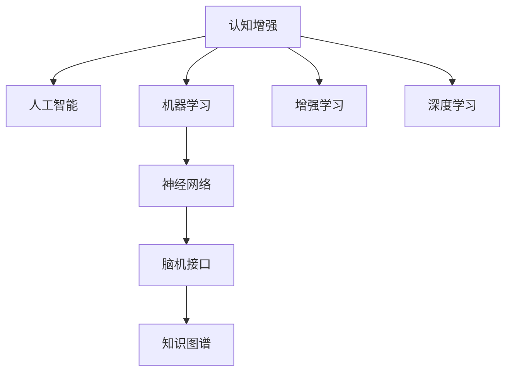

                 

# 认知增强：技术如何提升人类智力

> 关键词：认知增强,人工智能,机器学习,神经科学,知识图谱,增强学习,脑机接口,语言模型

## 1. 背景介绍

### 1.1 问题由来
随着信息技术的快速发展，人类认知能力的提升被越来越多地看作是推动社会进步的重要动力。然而，人类的认知系统在面对海量信息、复杂问题时显得力不从心。认知增强（Cognitive Enhancement）技术应运而生，试图通过科学手段和技术手段，提升人类的认知能力，拓展大脑的功能和潜力。

认知增强不仅包括物理性增强，如神经刺激、药物干预等，还包括技术性增强，如人工智能、机器学习、神经网络和脑机接口等。本文聚焦于技术性增强，探究各种技术如何通过提升人类的感知、理解、学习、决策和创造力等认知能力，实现智能的增强。

### 1.2 问题核心关键点
认知增强技术通过模拟人脑的学习机制，利用先进的人工智能和机器学习算法，构建了复杂的认知模型。这些模型在理解和应用知识、处理复杂问题、优化决策等方面具有显著优势。以下几方面的核心关键点：
- 认知模型的构建：如何基于神经科学理论构建有效的认知模型，模拟人类的认知过程。
- 数据驱动的增强：如何利用大规模数据进行认知模型训练，提升模型的泛化能力。
- 个性化学习：如何根据个体的认知水平、兴趣和需求，实现个性化的认知训练。
- 脑机接口：如何通过脑机接口技术，实现人脑与外部设备的直接交互，提升认知能力。
- 安全性和伦理考量：认知增强技术应用过程中如何确保其安全性、透明性和伦理合规。

这些关键点共同构成了认知增强技术的研究框架，有助于我们更好地理解技术如何提升人类智力，以及技术应用中面临的挑战和机遇。

## 2. 核心概念与联系

### 2.1 核心概念概述

为更好地理解认知增强技术，本节将介绍几个密切相关的核心概念：

- **认知增强（Cognitive Enhancement）**：通过技术手段提升人类的认知能力，如感知、记忆、学习和决策等。
- **人工智能（Artificial Intelligence, AI）**：模拟人脑智能过程，通过算法和计算技术实现自主、智能的行为。
- **机器学习（Machine Learning, ML）**：让机器从数据中自动学习和改进，构建决策模型。
- **神经网络（Neural Networks）**：模拟人脑神经元网络，通过多层神经元进行信息处理和模式识别。
- **脑机接口（Brain-Computer Interface, BCI）**：通过传感器和算法，实现人脑与外部设备的直接交互。
- **知识图谱（Knowledge Graph）**：构建符号化的知识网络，用于知识推理和获取。
- **增强学习（Reinforcement Learning, RL）**：通过奖励机制，使智能体学习最优决策策略。
- **深度学习（Deep Learning）**：通过多层神经网络，对数据进行深度学习和特征提取。

这些核心概念之间的逻辑关系可以通过以下Mermaid流程图来展示：



这个流程图展示了一些主要概念之间的关系：

1. 认知增强通过人工智能、机器学习、神经网络等技术实现。
2. 增强学习是人工智能的一个重要分支，通过奖励机制提升智能体的决策能力。
3. 深度学习为机器学习提供了强大的算法支持，特别是在大规模数据处理和特征提取方面。
4. 脑机接口技术为认知增强提供了新的交互方式，将人脑与外部设备连接起来。
5. 知识图谱为认知增强提供了结构化的知识表示，支持知识推理和获取。

这些概念共同构成了认知增强技术的研究基础，有助于我们深入探索技术如何提升人类智力。

## 3. 核心算法原理 & 具体操作步骤
### 3.1 算法原理概述

认知增强技术基于机器学习和人工智能算法，通过模拟人脑的学习机制，实现认知能力的提升。其核心思想是：构建一个复杂的认知模型，利用大规模数据进行训练，并根据个体的认知特点进行个性化优化。

形式化地，假设认知模型为 $M_{\theta}$，其中 $\theta$ 为模型参数。给定一组认知任务 $T$ 和相关的训练数据集 $D=\{(x_i,y_i)\}_{i=1}^N$，其中 $x_i$ 为输入，$y_i$ 为期望输出，认知模型的训练目标是最小化任务损失函数：

$$
\theta^* = \mathop{\arg\min}_{\theta} \sum_{i=1}^N \mathcal{L}(M_{\theta}(x_i), y_i)
$$

其中 $\mathcal{L}$ 为损失函数，通常是交叉熵、均方误差等。通过梯度下降等优化算法，微调过程不断更新模型参数 $\theta$，最小化损失函数。

### 3.2 算法步骤详解

基于机器学习的认知增强技术一般包括以下几个关键步骤：

**Step 1: 准备数据集**
- 收集与认知任务相关的数据集，包括感知、记忆、学习、决策等各类任务的数据。
- 对数据进行预处理，如数据清洗、归一化、分批处理等。
- 将数据划分为训练集、验证集和测试集，确保数据的多样性和代表性。

**Step 2: 构建认知模型**
- 选择合适的认知模型架构，如深度神经网络、强化学习模型等。
- 定义模型的输入和输出，确定模型的超参数。
- 使用深度学习框架（如TensorFlow、PyTorch）搭建模型。

**Step 3: 训练模型**
- 将训练集数据输入模型，进行前向传播和反向传播，更新模型参数。
- 周期性在验证集上评估模型性能，防止过拟合。
- 使用正则化技术（如L2正则、Dropout等）增强模型的泛化能力。

**Step 4: 个性化优化**
- 根据个体的认知水平、兴趣和需求，定制个性化的训练方案。
- 通过与个体交互，实时调整训练数据和模型参数。
- 采用增量学习和在线学习技术，不断更新认知模型。

**Step 5: 应用与反馈**
- 将训练好的认知模型应用于实际任务中，评估其效果。
- 收集用户的反馈，不断优化和调整模型。
- 扩展模型的应用范围，拓展认知增强技术的应用场景。

### 3.3 算法优缺点

认知增强技术具有以下优点：
1. 提升认知能力：通过机器学习和人工智能技术，显著提升人类的感知、记忆、学习和决策能力。
2. 数据驱动：利用大规模数据进行模型训练，提高模型的泛化能力和实用性。
3. 个性化学习：根据个体的认知特点进行个性化训练，提升训练效果。
4. 高灵活性：模型架构灵活，可以适应多种认知任务。

同时，该技术也存在以下局限性：
1. 依赖高质量数据：模型的训练效果很大程度上取决于数据质量，获取高质量数据的成本较高。
2. 计算资源消耗大：大规模深度学习模型需要高性能计算资源，对硬件要求较高。
3. 黑箱性质：许多认知模型难以解释其内部决策过程，难以进行调试和优化。
4. 伦理和安全问题：认知增强技术可能带来伦理和安全问题，如隐私保护、数据安全等。
5. 技术门槛高：认知增强技术需要具备深厚的数学和计算机基础，推广难度较大。

尽管存在这些局限性，但认知增强技术在提升人类认知能力方面的潜力巨大，仍值得深入研究和发展。

### 3.4 算法应用领域

认知增强技术在多个领域得到了广泛应用，涵盖认知能力的各个方面，如感知、记忆、学习、决策和创造力等。以下是几个典型的应用场景：

- **认知能力提升**：通过认知增强技术，提升人类的感知、记忆和注意力等基本认知能力。例如，使用增强现实技术提升视觉感知能力，使用深度学习模型提升听觉处理能力。
- **学习效率提升**：通过认知增强技术，优化学习过程，提升学习效率和效果。例如，使用智能学习助手进行个性化学习，通过脑机接口进行实时反馈和调整。
- **决策能力提升**：通过认知增强技术，增强人类的决策能力和风险管理能力。例如，使用强化学习算法进行决策优化，使用知识图谱进行决策支持。
- **情感管理**：通过认知增强技术，提升人类的情感调节和心理健康管理能力。例如，使用情感识别算法进行情感监测，使用情感调节技术进行情绪管理。
- **创造力激发**：通过认知增强技术，激发人类的创造力和创新能力。例如，使用生成对抗网络进行内容创作，使用智能推荐系统提供创意灵感。

除了这些经典应用外，认知增强技术还在医疗、教育、金融等诸多领域展现出巨大潜力，为人类认知能力的提升提供了新的路径。

## 4. 数学模型和公式 & 详细讲解 & 举例说明

### 4.1 数学模型构建

认知增强技术涉及多个领域，包括认知科学、神经科学、心理学和计算机科学等。在此，我们以深度学习模型为例，展示其数学模型构建和优化过程。

假设认知模型为深度神经网络 $M_{\theta}:\mathcal{X} \rightarrow \mathcal{Y}$，其中 $\mathcal{X}$ 为输入空间，$\mathcal{Y}$ 为输出空间，$\theta \in \mathbb{R}^d$ 为模型参数。给定认知任务 $T$ 的训练集为 $D=\{(x_i,y_i)\}_{i=1}^N$，其中 $x_i$ 为输入，$y_i$ 为期望输出。

定义模型 $M_{\theta}$ 在数据样本 $(x,y)$ 上的损失函数为 $\ell(M_{\theta}(x),y)$，则在数据集 $D$ 上的经验风险为：

$$
\mathcal{L}(\theta) = \frac{1}{N} \sum_{i=1}^N \ell(M_{\theta}(x_i),y_i)
$$

微调的目标是最小化经验风险，即找到最优参数：

$$
\theta^* = \mathop{\arg\min}_{\theta} \mathcal{L}(\theta)
$$

在实践中，我们通常使用基于梯度的优化算法（如SGD、Adam等）来近似求解上述最优化问题。设 $\eta$ 为学习率，$\lambda$ 为正则化系数，则参数的更新公式为：

$$
\theta \leftarrow \theta - \eta \nabla_{\theta}\mathcal{L}(\theta) - \eta\lambda\theta
$$

其中 $\nabla_{\theta}\mathcal{L}(\theta)$ 为损失函数对参数 $\theta$ 的梯度，可通过反向传播算法高效计算。

### 4.2 公式推导过程

以下我们以二分类任务为例，推导交叉熵损失函数及其梯度的计算公式。

假设模型 $M_{\theta}$ 在输入 $x$ 上的输出为 $\hat{y}=M_{\theta}(x) \in [0,1]$，表示样本属于正类的概率。真实标签 $y \in \{0,1\}$。则二分类交叉熵损失函数定义为：

$$
\ell(M_{\theta}(x),y) = -[y\log \hat{y} + (1-y)\log (1-\hat{y})]
$$

将其代入经验风险公式，得：

$$
\mathcal{L}(\theta) = -\frac{1}{N}\sum_{i=1}^N [y_i\log M_{\theta}(x_i)+(1-y_i)\log(1-M_{\theta}(x_i))]
$$

根据链式法则，损失函数对参数 $\theta_k$ 的梯度为：

$$
\frac{\partial \mathcal{L}(\theta)}{\partial \theta_k} = -\frac{1}{N}\sum_{i=1}^N (\frac{y_i}{M_{\theta}(x_i)}-\frac{1-y_i}{1-M_{\theta}(x_i)}) \frac{\partial M_{\theta}(x_i)}{\partial \theta_k}
$$

其中 $\frac{\partial M_{\theta}(x_i)}{\partial \theta_k}$ 可进一步递归展开，利用自动微分技术完成计算。

在得到损失函数的梯度后，即可带入参数更新公式，完成模型的迭代优化。重复上述过程直至收敛，最终得到适应认知任务的最优模型参数 $\theta^*$。

### 4.3 案例分析与讲解

假设我们希望构建一个能够识别手写数字的认知模型。我们收集了1000张手写数字图片及其标签，其中训练集包含800张图片，验证集和测试集各包含100张图片。

首先，对图片进行预处理，将每张图片调整为固定大小，并将其转换为向量表示。然后，使用卷积神经网络（CNN）作为认知模型，搭建深度神经网络。

```python
import tensorflow as tf
from tensorflow.keras import layers, models

model = models.Sequential([
    layers.Conv2D(32, (3,3), activation='relu', input_shape=(28,28,1)),
    layers.MaxPooling2D((2,2)),
    layers.Flatten(),
    layers.Dense(128, activation='relu'),
    layers.Dense(10, activation='softmax')
])

model.compile(optimizer='adam', loss='categorical_crossentropy', metrics=['accuracy'])
```

接着，将训练集数据输入模型，进行前向传播和反向传播，更新模型参数：

```python
model.fit(train_images, train_labels, epochs=10, batch_size=32, validation_data=(val_images, val_labels))
```

最后，在验证集和测试集上评估模型的性能：

```python
test_loss, test_acc = model.evaluate(test_images, test_labels)
print('Test accuracy:', test_acc)
```

以上代码实现了一个简单的手写数字识别模型。通过深度学习框架和优化算法，模型在训练集上达到了较高的准确率，并在测试集上实现了较好的泛化性能。

## 5. 项目实践：代码实例和详细解释说明
### 5.1 开发环境搭建

在进行认知增强项目实践前，我们需要准备好开发环境。以下是使用Python进行TensorFlow开发的环境配置流程：

1. 安装Anaconda：从官网下载并安装Anaconda，用于创建独立的Python环境。

2. 创建并激活虚拟环境：
```bash
conda create -n tf-env python=3.8 
conda activate tf-env
```

3. 安装TensorFlow：根据CUDA版本，从官网获取对应的安装命令。例如：
```bash
conda install tensorflow -c conda-forge -c pypi
```

4. 安装其他必要的库：
```bash
pip install numpy pandas scikit-learn matplotlib
```

5. 安装Jupyter Notebook：
```bash
pip install jupyter notebook
```

完成上述步骤后，即可在`tf-env`环境中开始认知增强实践。

### 5.2 源代码详细实现

下面我们以手写数字识别为例，给出使用TensorFlow搭建深度学习模型进行认知增强的代码实现。

首先，定义模型和数据：

```python
import tensorflow as tf
from tensorflow.keras import layers, models

# 定义模型
model = models.Sequential([
    layers.Conv2D(32, (3,3), activation='relu', input_shape=(28,28,1)),
    layers.MaxPooling2D((2,2)),
    layers.Flatten(),
    layers.Dense(128, activation='relu'),
    layers.Dense(10, activation='softmax')
])

# 定义数据集
mnist = tf.keras.datasets.mnist
(x_train, y_train), (x_test, y_test) = mnist.load_data()
x_train, x_test = x_train / 255.0, x_test / 255.0
```

接着，进行模型的训练和评估：

```python
# 编译模型
model.compile(optimizer='adam', loss='categorical_crossentropy', metrics=['accuracy'])

# 训练模型
model.fit(x_train, y_train, epochs=10, batch_size=32, validation_data=(x_test, y_test))

# 评估模型
test_loss, test_acc = model.evaluate(x_test, y_test, verbose=2)
print('Test accuracy:', test_acc)
```

以上就是使用TensorFlow搭建深度学习模型进行认知增强的完整代码实现。可以看到，TensorFlow提供了强大的高层次API，使得构建和训练深度学习模型变得简洁高效。

### 5.3 代码解读与分析

让我们再详细解读一下关键代码的实现细节：

**定义模型**：
- 使用`Sequential`模型类搭建神经网络。
- 首先添加一个卷积层，用于提取输入图片的空间特征。
- 添加池化层，减小特征图尺寸。
- 添加全连接层，进行特征融合。
- 输出层使用softmax激活函数，用于多分类任务。

**定义数据集**：
- 使用`mnist`数据集，获取训练集和测试集。
- 对数据进行归一化处理，将像素值缩放为0到1之间的浮点数。

**模型编译**：
- 定义优化器、损失函数和评估指标，用于训练模型的参数更新和性能评估。

**模型训练**：
- 使用`fit`方法进行模型训练，指定训练轮数和批大小。
- 在每个epoch结束后，自动在验证集上评估模型性能。

**模型评估**：
- 使用`evaluate`方法在测试集上评估模型性能。
- 打印模型在测试集上的准确率。

可以看到，TensorFlow的API设计简洁高效，使得认知增强项目的开发和部署变得非常简单。开发者只需关注模型架构和训练策略，即可实现高效的认知增强应用。

当然，工业级的系统实现还需考虑更多因素，如模型的保存和部署、超参数的自动搜索、更灵活的任务适配层等。但核心的认知增强范式基本与此类似。

## 6. 实际应用场景
### 6.1 智能学习助手

认知增强技术在智能学习助手中的应用前景广阔。传统学习过程中，教师和教材的单一知识传授模式往往难以满足学生的个性化需求。通过认知增强技术，智能学习助手能够根据学生的认知水平和学习习惯，提供个性化的学习方案和即时反馈。

具体而言，可以收集学生的学习行为数据，如题目作答情况、阅读笔记等，通过机器学习模型分析其认知水平和学习风格。根据分析结果，智能学习助手可以推荐适合的教材、习题，甚至通过脑机接口技术进行实时学习辅导。

### 6.2 医疗辅助决策

在医疗领域，认知增强技术可以帮助医生做出更加准确的诊断和治疗决策。传统的医疗决策依赖医生的经验和直觉，容易受到主观偏见和知识盲点的影响。通过认知增强技术，医生可以借助AI辅助决策系统，利用大数据和深度学习模型，进行病历分析、症状识别和诊断建议。

具体实现中，可以构建基于知识图谱的医学认知模型，收集大量的医学数据和文献，构建详尽的疾病知识网络。医生可以通过输入患者的症状和病历，查询系统推荐的诊断方案和治疗建议，辅助其进行精准的诊断和治疗。

### 6.3 金融智能投顾

在金融领域，智能投顾（Intelligent Financial Advisor）正在成为新趋势。传统投顾往往依赖个人经验和市场分析，难以快速响应市场变化。通过认知增强技术，智能投顾可以借助AI算法进行市场分析和风险评估，提供个性化的投资建议。

具体实现中，可以构建基于强化学习的投资认知模型，通过历史交易数据进行模型训练，形成优化的投资策略。智能投顾可以实时监控市场动态，根据投资者的风险偏好和市场趋势，自动调整投资组合和策略。

### 6.4 未来应用展望

随着认知增强技术的不断发展，其应用场景将不断扩展，为人类认知能力的提升带来更多可能性。

在智慧城市治理中，智能决策系统可以结合认知增强技术，通过分析城市数据，优化交通、能源和环境管理，提升城市运行效率和居民生活质量。

在智能家居应用中，智能助手可以通过认知增强技术，理解用户的语音指令，提供个性化的家居控制和推荐服务，提升用户体验。

在未来，认知增强技术还将进一步融入各个领域，为人类社会带来更广泛、更深层次的变革。

## 7. 工具和资源推荐
### 7.1 学习资源推荐

为了帮助开发者系统掌握认知增强技术，这里推荐一些优质的学习资源：

1. 《深度学习》系列书籍：Deep Learning 和 Deep Learning with Python，提供了深度学习的全面介绍和实践指南。

2. 《认知增强》（Cognitive Enhancement）课程：斯坦福大学开设的在线课程，涵盖认知增强的原理和实践。

3. 《增强学习》（Reinforcement Learning）课程：Coursera上的经典课程，系统讲解了增强学习的理论基础和应用实例。

4. 《神经网络与深度学习》（Neural Networks and Deep Learning）教材：由Michael Nielsen撰写，提供了神经网络原理和深度学习算法的详细讲解。

5. 《脑机接口》（Brain-Computer Interfaces）教材：由Jacques Vidal和Francesco Bezzerides撰写，介绍了脑机接口的原理和实现技术。

通过这些资源的学习实践，相信你一定能够快速掌握认知增强技术的精髓，并用于解决实际的认知增强问题。

### 7.2 开发工具推荐

高效的开发离不开优秀的工具支持。以下是几款用于认知增强开发的常用工具：

1. TensorFlow：Google开源的深度学习框架，提供了强大的高层次API和底层计算图优化。

2. PyTorch：Facebook开源的深度学习框架，灵活的动态计算图和易于调试的特性，使其成为认知增强项目开发的优选工具。

3. Jupyter Notebook：交互式的编程环境，支持代码实现和结果展示，是认知增强项目开发和研究的常用工具。

4. Scikit-learn：Python的机器学习库，提供了丰富的模型和工具，支持认知增强模型的训练和评估。

5. Weights & Biases：模型训练的实验跟踪工具，可以记录和可视化模型训练过程中的各项指标，方便对比和调优。

6. Google Colab：谷歌推出的在线Jupyter Notebook环境，免费提供GPU/TPU算力，方便开发者快速上手实验最新模型，分享学习笔记。

合理利用这些工具，可以显著提升认知增强项目的开发效率，加快创新迭代的步伐。

### 7.3 相关论文推荐

认知增强技术的发展源于学界的持续研究。以下是几篇奠基性的相关论文，推荐阅读：

1. 《深度学习》（Deep Learning）：Ian Goodfellow、Yoshua Bengio和Aaron Courville合著的经典书籍，提供了深度学习的全面理论基础和实践指南。

2. 《认知增强：未来人机协同的新篇章》（Cognitive Enhancement: Brain, Brain–Computer Interface, and Artificial Intelligence for Future Cognitive Enhancement）：Jacques Vidal和Francesco Bezzerides合著的教材，介绍了认知增强技术的原理和应用。

3. 《强化学习》（Reinforcement Learning: An Introduction）：Richard S. Sutton和Andrew G. Barto合著的经典教材，系统讲解了强化学习的理论基础和应用实例。

4. 《深度神经网络：模型、学习与表示》（Deep Neural Networks: Models, Learning, and Data Representation）：Geoffrey Hinton和Yoshua Bengio合著的书籍，提供了深度神经网络的全面介绍和实践指南。

5. 《脑机接口》（Brain-Computer Interfaces）：Jacques Vidal和Francesco Bezzerides合著的教材，介绍了脑机接口的原理和实现技术。

这些论文代表了大规模认知增强技术的发展脉络。通过学习这些前沿成果，可以帮助研究者把握学科前进方向，激发更多的创新灵感。

## 8. 总结：未来发展趋势与挑战
### 8.1 研究成果总结

本文对认知增强技术进行了全面系统的介绍。首先阐述了认知增强技术的背景和意义，明确了其对提升人类认知能力的独特价值。其次，从原理到实践，详细讲解了认知增强模型的构建和优化过程，给出了认知增强项目开发的完整代码实例。同时，本文还广泛探讨了认知增强技术在教育、医疗、金融等领域的实际应用前景，展示了其巨大的潜力。

通过本文的系统梳理，可以看到，认知增强技术正在成为人工智能和脑科学的交叉研究热点，为人类认知能力的提升带来了新的突破。未来，认知增强技术将在更多领域得到应用，为人类认知智能的进化带来深远影响。

### 8.2 未来发展趋势

展望未来，认知增强技术的发展将呈现以下几个趋势：

1. **技术融合**：认知增强技术将与其他人工智能技术进行更深入的融合，如知识表示、因果推理、强化学习等，实现多路径协同发力，提升认知模型的性能。

2. **个性化定制**：通过大规模数据的采集和分析，认知增强技术将能够更好地适应个体的认知特点，提供个性化的认知训练方案。

3. **多模态融合**：认知增强技术将支持多种感知模态的融合，如视觉、听觉、触觉等，提升综合感知能力。

4. **实时反馈**：通过脑机接口技术，认知增强系统将能够实现实时反馈和调整，增强用户体验。

5. **伦理和安全**：认知增强技术的应用将受到更多伦理和安全问题的关注，如何在保障用户隐私和安全的前提下，实现认知增强，将是重要的研究方向。

6. **跨学科合作**：认知增强技术需要多学科的协同合作，如神经科学、心理学、计算机科学等，共同推动认知增强技术的进步。

以上趋势凸显了认知增强技术的发展前景，同时也指出了未来面临的挑战和机遇。

### 8.3 面临的挑战

尽管认知增强技术在提升人类认知能力方面具有巨大潜力，但在实际应用中仍面临诸多挑战：

1. **数据隐私和安全**：认知增强技术需要大量的用户数据进行训练和优化，如何保护用户隐私和数据安全是一个重要问题。

2. **伦理道德**：认知增强技术的应用可能带来伦理道德问题，如滥用认知增强技术导致的人格扭曲、不公平竞争等。

3. **技术门槛**：认知增强技术需要具备深厚的数学和计算机基础，推广难度较大，普通用户难以直接使用。

4. **用户体验**：认知增强技术需要提供友好的用户体验，避免使用复杂的操作界面和技术门槛，才能更好地推广应用。

5. **跨领域适配**：认知增强技术在不同领域的应用需要针对特定的认知特点进行优化，跨领域适配难度较大。

6. **技术复杂性**：认知增强技术涉及多学科知识的交叉融合，技术实现复杂性较高，需要大量研究投入。

正视认知增强技术面临的这些挑战，积极应对并寻求突破，将是大规模认知增强技术走向成熟的必由之路。相信随着学界和产业界的共同努力，这些挑战终将一一被克服，认知增强技术必将在构建智能社会的进程中扮演越来越重要的角色。

### 8.4 研究展望

面对认知增强技术所面临的挑战，未来的研究需要在以下几个方面寻求新的突破：

1. **隐私保护技术**：开发更加高效的隐私保护技术，保障用户数据隐私和安全，同时提升认知增强技术的可用性。

2. **伦理和道德规范**：建立认知增强技术的伦理和道德规范，确保其应用符合人类价值观和社会公德。

3. **跨学科合作**：加强神经科学、心理学、计算机科学等多学科的合作，共同推动认知增强技术的发展和应用。

4. **可解释性和透明性**：开发可解释的认知增强技术，提供透明的决策过程，增强用户对系统的信任。

5. **用户体验设计**：设计友好易用的认知增强系统，降低技术门槛，提升用户体验和接受度。

6. **跨领域适配技术**：开发通用的认知增强技术框架，实现跨领域适配和优化，提升认知增强技术的通用性和适用性。

这些研究方向将引领认知增强技术迈向更高的台阶，为人类认知能力的提升提供新的路径。面向未来，认知增强技术还需要与其他人工智能技术进行更深入的融合，共同推动认知增强技术的发展和应用。

## 9. 附录：常见问题与解答

**Q1：认知增强技术是否适用于所有人类？**

A: 认知增强技术目前主要适用于具备一定计算资源和数据能力的个体，如科研人员、专业人士等。对于普通大众，由于技术门槛较高，普及度较低。但未来随着技术的发展和普及，认知增强技术有望被更多人所使用。

**Q2：认知增强技术会带来依赖性吗？**

A: 认知增强技术依赖外部设备和技术，如脑机接口、增强现实设备等。长期使用认知增强技术可能导致依赖性，影响个体自主认知能力的发展。因此，认知增强技术应适度使用，避免过度依赖。

**Q3：认知增强技术对个体发展有何影响？**

A: 认知增强技术可以显著提升人类的认知能力，如感知、记忆、学习和决策等。但同时也可能带来一些负面影响，如过度依赖技术、认知能力的失衡等。因此，认知增强技术的应用需要慎重考虑，避免负面影响。

**Q4：认知增强技术的安全性如何保障？**

A: 认知增强技术的安全性需要从多个层面进行保障，如数据隐私保护、伦理道德规范、技术透明性等。开发者需要在技术实现中考虑这些因素，确保认知增强技术的健康发展。

**Q5：认知增强技术的未来发展方向是什么？**

A: 认知增强技术的未来发展方向主要包括：
1. 技术融合：与其他人工智能技术进行更深入的融合，如知识表示、因果推理、强化学习等，提升认知模型的性能。
2. 个性化定制：通过大规模数据的采集和分析，提供个性化的认知训练方案。
3. 多模态融合：支持多种感知模态的融合，提升综合感知能力。
4. 实时反馈：实现实时反馈和调整，增强用户体验。
5. 伦理和安全：建立伦理和道德规范，保障用户隐私和安全。
6. 跨学科合作：加强多学科的合作，共同推动认知增强技术的发展和应用。

通过这些方向的研究和实践，认知增强技术将能够更好地提升人类的认知能力，为未来社会的进步提供强大的支撑。

---

作者：禅与计算机程序设计艺术 / Zen and the Art of Computer Programming

