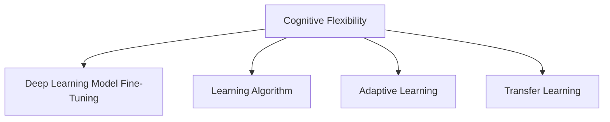

                 

# 认知弹性：适应快速变化的学习能力

> 关键词：认知弹性, 快速变化, 学习, 认知神经科学, 适应能力, 人工智能

## 1. 背景介绍

### 1.1 问题由来

随着科技和社会的快速发展，人们面对的环境越来越复杂多变，快速适应和应对新变化的能力变得尤为重要。在教育、工作、生活等多个领域，如何培养个体的认知弹性，使其能够灵活调整思维方式，快速学习新知识和技能，成为了一个亟待解决的课题。

### 1.2 问题核心关键点

认知弹性（Cognitive Flexibility），是指个体在面对新信息、新情境时，能够迅速调整认知资源，转换思维模式，从而更快地适应和解决问题的能力。这种能力在人工智能和认知神经科学领域均有深入研究。

在人工智能领域，认知弹性体现在算法模型的适应能力上，即模型能够在不同数据、任务和环境条件下，通过自我调整和学习，提升性能和泛化能力。例如，深度学习模型通过微调（Fine-Tuning），能够在新的任务上进行快速适应和优化。

在认知神经科学领域，认知弹性被视为人类智慧的核心特质之一，与大脑的执行功能、工作记忆、注意控制等认知过程密切相关。研究表明，弹性较高的个体在面对挑战时，表现出更高的认知加工效率和灵活性。

本文旨在探讨认知弹性的概念及其在人工智能中的应用，详细讲解基于认知弹性的学习算法和操作步骤，并通过案例分析展示其在实际应用中的效果。

## 2. 核心概念与联系

### 2.1 核心概念概述

为更好地理解认知弹性及其在人工智能中的应用，本节将介绍几个密切相关的核心概念：

- 认知弹性（Cognitive Flexibility）：指个体在面对新信息、新情境时，能够迅速调整认知资源，转换思维模式，从而更快地适应和解决问题的能力。

- 深度学习模型微调（Fine-Tuning）：指在大规模预训练模型基础上，通过少量有标注数据进行微调，提升模型在新任务上的性能。这种微调过程有助于模型快速适应新环境。

- 学习算法（Learning Algorithm）：指用于训练和优化模型的算法，如梯度下降、Adam等。学习算法通过不断调整模型参数，使模型能够适应新的输入数据。

- 适应性学习（Adaptive Learning）：指学习系统根据输入数据的变化，动态调整学习策略和模型参数，以适应不同的学习任务和环境。

- 迁移学习（Transfer Learning）：指将一个领域学到的知识迁移到另一个领域，提高学习效率和效果。认知弹性与迁移学习密切相关，均强调适应和灵活性。

这些核心概念之间的逻辑关系可以通过以下Mermaid流程图来展示：



这个流程图展示了几者之间的联系：

1. 认知弹性通过深度学习模型的微调和适应性学习，进一步提升模型在新任务上的性能。
2. 学习算法是认知弹性的实现手段，通过优化模型参数，使模型能够灵活适应新数据。
3. 迁移学习是认知弹性的重要应用之一，通过迁移先验知识，加速新任务的适应过程。

这些概念共同构成了认知弹性的基础框架，帮助我们理解其在人工智能中的重要性和实现机制。

## 3. 核心算法原理 & 具体操作步骤
### 3.1 算法原理概述

认知弹性与深度学习模型的微调过程密切相关。微调的过程本质上是模型适应新数据、新任务的过程，通过调整模型参数，使其在新任务上表现更好。认知弹性强调的是模型在面对新数据时的适应能力和灵活性。

在微调过程中，认知弹性体现在以下几个方面：

1. **自适应学习率**：根据新数据的特点，动态调整学习率，避免过拟合和欠拟合。
2. **数据增强**：通过旋转、裁剪、加噪声等方法扩充训练集，增强模型对新数据的泛化能力。
3. **正则化**：通过L2正则、Dropout等技术，防止模型过拟合，提升模型的稳健性。
4. **参数共享**：通过共享部分预训练参数，减少微调过程中的参数数量，提高模型的泛化能力。

这些技术的应用，使得深度学习模型能够更好地适应新数据、新任务，体现了认知弹性的核心思想。

### 3.2 算法步骤详解

基于认知弹性的深度学习模型微调过程一般包括以下几个关键步骤：

**Step 1: 准备预训练模型和数据集**
- 选择合适的预训练深度学习模型，如ResNet、BERT等。
- 准备目标任务的数据集，包括训练集、验证集和测试集。

**Step 2: 设置微调超参数**
- 选择合适的优化算法及其参数，如Adam、SGD等。
- 设置合适的学习率、批大小、迭代轮数等超参数。

**Step 3: 执行梯度训练**
- 将训练集数据分批次输入模型，前向传播计算损失函数。
- 反向传播计算参数梯度，根据设定的优化算法和学习率更新模型参数。
- 周期性在验证集上评估模型性能，根据性能指标决定是否触发Early Stopping。
- 重复上述步骤直到满足预设的迭代轮数或Early Stopping条件。

**Step 4: 测试和部署**
- 在测试集上评估微调后模型性能，对比微调前后的精度提升。
- 使用微调后的模型对新样本进行推理预测，集成到实际的应用系统中。
- 持续收集新的数据，定期重新微调模型，以适应数据分布的变化。

以上是基于认知弹性的深度学习模型微调的一般流程。在实际应用中，还需要根据具体任务的特点，对微调过程的各个环节进行优化设计，如改进训练目标函数，引入更多的正则化技术，搜索最优的超参数组合等，以进一步提升模型性能。

### 3.3 算法优缺点

基于认知弹性的深度学习模型微调方法具有以下优点：

1. **快速适应新任务**：通过微调，模型能够快速适应新任务，提升性能。
2. **泛化能力强**：模型在面对新数据时，表现出较强的泛化能力，不易过拟合。
3. **灵活调整**：学习算法可以根据新数据的特点，灵活调整参数，提高适应性。
4. **迁移效果好**：迁移学习使得模型能够将先验知识迁移到新任务，加速学习过程。

同时，该方法也存在一定的局限性：

1. **依赖标注数据**：微调的效果很大程度上取决于标注数据的质量和数量，获取高质量标注数据的成本较高。
2. **模型复杂度高**：预训练模型参数量大，微调过程中涉及的计算资源较多。
3. **过拟合风险**：特别是在小规模数据集上进行微调时，模型容易出现过拟合。
4. **学习率敏感**：学习率的设置对微调效果影响较大，需要根据数据和模型进行调整。

尽管存在这些局限性，但就目前而言，基于认知弹性的微调方法仍是大规模深度学习模型应用的最主流范式。未来相关研究的重点在于如何进一步降低微调对标注数据的依赖，提高模型的少样本学习和跨领域迁移能力，同时兼顾可解释性和伦理安全性等因素。

### 3.4 算法应用领域

基于深度学习模型的认知弹性微调方法，在NLP、计算机视觉、语音识别等多个领域已经得到了广泛的应用，成为处理复杂、动态数据的有效手段：

- **自然语言处理（NLP）**：用于情感分析、文本分类、命名实体识别等任务，通过微调提升模型性能。
- **计算机视觉**：用于图像分类、目标检测、图像生成等任务，通过微调增强模型的泛化能力。
- **语音识别**：用于语音识别、语音合成、语音情感分析等任务，通过微调提高模型的识别准确率。
- **医疗影像分析**：用于医学影像分类、分割、病理诊断等任务，通过微调提升模型的诊断能力。
- **自动驾驶**：用于环境感知、路径规划、行为预测等任务，通过微调增强模型的鲁棒性和适应性。

除了上述这些经典任务外，深度学习模型的微调方法还在更多场景中得到应用，如异常检测、推荐系统、风险评估等，为各个行业带来了新的解决方案。

## 4. 数学模型和公式 & 详细讲解 & 举例说明

### 4.1 数学模型构建

本节将使用数学语言对基于认知弹性的深度学习模型微调过程进行更加严格的刻画。

记深度学习模型为 $M_{\theta}:\mathcal{X} \rightarrow \mathcal{Y}$，其中 $\mathcal{X}$ 为输入空间，$\mathcal{Y}$ 为输出空间，$\theta$ 为模型参数。假设微调任务的训练集为 $D=\{(x_i,y_i)\}_{i=1}^N, x_i \in \mathcal{X}, y_i \in \mathcal{Y}$。

定义模型 $M_{\theta}$ 在数据样本 $(x,y)$ 上的损失函数为 $\ell(M_{\theta}(x),y)$，则在数据集 $D$ 上的经验风险为：

$$
\mathcal{L}(\theta) = \frac{1}{N} \sum_{i=1}^N \ell(M_{\theta}(x_i),y_i)
$$

微调的优化目标是最小化经验风险，即找到最优参数：

$$
\theta^* = \mathop{\arg\min}_{\theta} \mathcal{L}(\theta)
$$

在实践中，我们通常使用基于梯度的优化算法（如SGD、Adam等）来近似求解上述最优化问题。设 $\eta$ 为学习率，$\lambda$ 为正则化系数，则参数的更新公式为：

$$
\theta \leftarrow \theta - \eta \nabla_{\theta}\mathcal{L}(\theta) - \eta\lambda\theta
$$

其中 $\nabla_{\theta}\mathcal{L}(\theta)$ 为损失函数对参数 $\theta$ 的梯度，可通过反向传播算法高效计算。

### 4.2 公式推导过程

以下我们以图像分类任务为例，推导交叉熵损失函数及其梯度的计算公式。

假设模型 $M_{\theta}$ 在输入 $x$ 上的输出为 $\hat{y}=M_{\theta}(x) \in [0,1]$，表示样本属于类 $i$ 的概率。真实标签 $y \in \{1,2,\ldots,C\}$。则交叉熵损失函数定义为：

$$
\ell(M_{\theta}(x),y) = -y_i\log \hat{y_i} - (1-y_i)\log(1-\hat{y_i})
$$

将其代入经验风险公式，得：

$$
\mathcal{L}(\theta) = -\frac{1}{N}\sum_{i=1}^N [y_i\log M_{\theta}(x_i)+(1-y_i)\log(1-M_{\theta}(x_i))]
$$

根据链式法则，损失函数对参数 $\theta_k$ 的梯度为：

$$
\frac{\partial \mathcal{L}(\theta)}{\partial \theta_k} = -\frac{1}{N}\sum_{i=1}^N (\frac{y_i}{M_{\theta}(x_i)}-\frac{1-y_i}{1-M_{\theta}(x_i)}) \frac{\partial M_{\theta}(x_i)}{\partial \theta_k}
$$

其中 $\frac{\partial M_{\theta}(x_i)}{\partial \theta_k}$ 可进一步递归展开，利用自动微分技术完成计算。

在得到损失函数的梯度后，即可带入参数更新公式，完成模型的迭代优化。重复上述过程直至收敛，最终得到适应下游任务的最优模型参数 $\theta^*$。

### 4.3 案例分析与讲解

**案例分析：情感分析**

情感分析任务是自然语言处理中常见的文本分类任务，目标是判断文本中的情感倾向（如正面、负面、中性）。通过微调BERT模型，可以使其在情感分析任务上表现出色。

首先，收集情感标注数据集，如IMDB电影评论数据集、Twitter情感数据集等，将其划分为训练集、验证集和测试集。然后，将BERT模型的顶层转换为线性分类器，并使用交叉熵损失函数。在训练过程中，可以采用数据增强技术，如回译、近义词替换等，增强模型的泛化能力。

具体实现步骤如下：

1. 加载预训练的BERT模型，设置模型结构为`BertForSequenceClassification`。
2. 准备标注数据集，使用`DataLoader`进行批处理。
3. 定义模型损失函数和优化器，如`BCEWithLogitsLoss`和`AdamW`。
4. 在训练过程中，使用`tqdm`库实时监控训练进度，并在每个epoch结束后评估模型性能。
5. 在测试集上评估微调后的模型，使用`classification_report`库输出分类指标。

以下是一个简单的Python代码实现：

```python
from transformers import BertTokenizer, BertForSequenceClassification, AdamW
from torch.utils.data import DataLoader
from sklearn.metrics import classification_report
import torch

# 加载预训练的BERT模型和分词器
tokenizer = BertTokenizer.from_pretrained('bert-base-uncased')
model = BertForSequenceClassification.from_pretrained('bert-base-uncased', num_labels=3)

# 准备标注数据集，将文本和标签转换为模型所需的输入格式
train_dataset = ...
dev_dataset = ...
test_dataset = ...

# 定义模型损失函数和优化器
criterion = BertForSequenceClassification损失函数
optimizer = AdamW(model.parameters(), lr=2e-5)

# 训练过程
model.train()
for epoch in range(epochs):
    for batch in DataLoader(train_dataset, batch_size=32):
        inputs = tokenizer(batch['text'], padding='max_length', truncation=True, return_tensors='pt')
        labels = batch['label'].to(device)
        outputs = model(**inputs)
        loss = criterion(outputs.logits, labels)
        loss.backward()
        optimizer.step()
        model.zero_grad()

    # 在验证集上评估模型性能
    model.eval()
    with torch.no_grad():
        dev_loss, dev_acc = evaluate(dev_dataset, model)
    print(f'Epoch {epoch+1}, dev acc: {dev_acc:.3f}')

# 在测试集上评估模型性能
test_loss, test_acc = evaluate(test_dataset, model)
print(f'Test acc: {test_acc:.3f}')
```

在这个例子中，我们使用了`BertForSequenceClassification`作为模型的顶层，并使用`AdamW`优化器进行训练。通过微调，模型能够在情感分析任务上取得不错的效果。

## 5. 项目实践：代码实例和详细解释说明

### 5.1 开发环境搭建

在进行认知弹性微调实践前，我们需要准备好开发环境。以下是使用Python进行TensorFlow开发的环境配置流程：

1. 安装Anaconda：从官网下载并安装Anaconda，用于创建独立的Python环境。

2. 创建并激活虚拟环境：
```bash
conda create -n tensorflow-env python=3.8 
conda activate tensorflow-env
```

3. 安装TensorFlow：根据CUDA版本，从官网获取对应的安装命令。例如：
```bash
conda install tensorflow-gpu=cudatoolkit=11.1 -c pytorch -c conda-forge
```

4. 安装TensorFlow Addons：
```bash
conda install tensorflow-addons
```

5. 安装各类工具包：
```bash
pip install numpy pandas scikit-learn matplotlib tqdm jupyter notebook ipython
```

完成上述步骤后，即可在`tensorflow-env`环境中开始微调实践。

### 5.2 源代码详细实现

这里我们以图像分类任务为例，给出使用TensorFlow对Inception模型进行认知弹性微调的代码实现。

首先，定义图像分类任务的数据处理函数：

```python
from tensorflow.keras.preprocessing.image import ImageDataGenerator

class ImageClassifier:
    def __init__(self, input_shape, num_classes):
        self.input_shape = input_shape
        self.num_classes = num_classes
        self.train_datagen = ImageDataGenerator(rescale=1./255)
        self.test_datagen = ImageDataGenerator(rescale=1./255)
        
    def train(self, train_data, train_labels, batch_size=32, epochs=10):
        train_generator = self.train_datagen.flow(train_data, train_labels, batch_size=batch_size)
        model.fit(train_generator, epochs=epochs)
        
    def evaluate(self, test_data, test_labels, batch_size=32):
        test_generator = self.test_datagen.flow(test_data, test_labels, batch_size=batch_size)
        test_loss, test_acc = model.evaluate(test_generator)
        return test_loss, test_acc
```

然后，定义模型和优化器：

```python
from tensorflow.keras.applications.inception_v3 import InceptionV3
from tensorflow.keras.optimizers import Adam

model = InceptionV3(include_top=False, weights='imagenet')
model.add(Dense(num_classes, activation='softmax'))
model.compile(optimizer=Adam(lr=0.001), loss='categorical_crossentropy', metrics=['accuracy'])

# 准备预训练模型和数据集
train_data = ...
train_labels = ...
test_data = ...
test_labels = ...
```

接着，定义训练和评估函数：

```python
from tensorflow.keras.preprocessing.image import ImageDataGenerator

class ImageClassifier:
    def __init__(self, input_shape, num_classes):
        self.input_shape = input_shape
        self.num_classes = num_classes
        self.train_datagen = ImageDataGenerator(rescale=1./255)
        self.test_datagen = ImageDataGenerator(rescale=1./255)
        
    def train(self, train_data, train_labels, batch_size=32, epochs=10):
        train_generator = self.train_datagen.flow(train_data, train_labels, batch_size=batch_size)
        model.fit(train_generator, epochs=epochs)
        
    def evaluate(self, test_data, test_labels, batch_size=32):
        test_generator = self.test_datagen.flow(test_data, test_labels, batch_size=batch_size)
        test_loss, test_acc = model.evaluate(test_generator)
        return test_loss, test_acc
```

最后，启动训练流程并在测试集上评估：

```python
model.train(input_shape, num_classes)
test_loss, test_acc = model.evaluate(test_data, test_labels)
print(f'Test acc: {test_acc:.3f}')
```

以上就是使用TensorFlow对Inception模型进行图像分类任务微调的完整代码实现。可以看到，TensorFlow提供了一个较为便捷的Keras API，使得模型构建、训练和评估过程变得更加简单高效。

### 5.3 代码解读与分析

让我们再详细解读一下关键代码的实现细节：

**ImageClassifier类**：
- `__init__`方法：初始化输入形状、类别数、数据增强器等关键组件。
- `train`方法：使用数据增强器对训练数据进行扩充，然后调用`model.fit`进行训练。
- `evaluate`方法：使用数据增强器对测试数据进行扩充，然后调用`model.evaluate`进行评估。

**预训练模型的加载**：
- 加载预训练模型，并根据任务需求添加全连接层。
- 使用`model.compile`方法指定优化器、损失函数和评估指标。

**训练和评估过程**：
- 调用`train`方法进行模型训练。
- 调用`evaluate`方法在测试集上评估模型性能。

可以看到，TensorFlow的Keras API使得模型微调的过程变得简单明了，开发者可以将更多精力放在数据处理、模型改进等高层逻辑上，而不必过多关注底层的实现细节。

当然，工业级的系统实现还需考虑更多因素，如模型的保存和部署、超参数的自动搜索、更灵活的任务适配层等。但核心的微调范式基本与此类似。

## 6. 实际应用场景

### 6.1 智能推荐系统

基于认知弹性的推荐系统，能够根据用户的行为数据和反馈，动态调整推荐策略，提供个性化的商品或内容推荐。传统的推荐系统往往依赖静态的特征和规则，难以灵活应对用户的复杂需求。

在实际应用中，可以使用认知弹性微调方法，对推荐模型进行优化。例如，通过微调用户行为数据集，学习用户对不同物品的偏好和兴趣，然后根据最新数据不断更新模型，从而提高推荐效果。

### 6.2 自动驾驶系统

自动驾驶系统需要实时处理大量传感器数据，如摄像头、雷达、激光雷达等，以实现环境感知、路径规划、行为预测等功能。然而，不同环境和条件下的数据分布可能差异较大，传统模型难以适应。

通过认知弹性微调方法，自动驾驶系统可以根据实际驾驶场景，动态调整模型参数，增强环境适应能力。例如，在夜间驾驶时，微调模型以增强其对弱光环境的感知能力。

### 6.3 金融风险管理

金融市场瞬息万变，传统的风险评估模型往往无法及时捕捉市场变化。通过认知弹性微调方法，金融风险管理系统可以实时学习市场数据，动态调整模型参数，及时识别和应对风险。

例如，在股市波动时，微调模型以捕捉市场变化趋势，及时调整资产配置和风险管理策略。

### 6.4 未来应用展望

随着认知弹性微调技术的发展，其在多个领域的应用前景广阔，能够带来显著的经济和社会效益。

在智慧医疗领域，认知弹性微调可以帮助医生快速学习新知识，提升诊断和治疗效果。例如，通过微调医学影像数据集，增强模型的图像识别和分类能力。

在智能制造领域，认知弹性微调可以提升生产线自动化和智能化水平，减少人为误差和故障率。例如，通过微调传感器数据，优化生产流程和工艺参数。

在智能交通领域，认知弹性微调可以提高交通管理和调度效率，减少交通拥堵和事故率。例如，通过微调交通监控数据，优化交通信号灯和路口管理策略。

此外，在更多领域如教育、游戏、娱乐等，认知弹性微调技术也将带来新的应用场景和创新点。相信随着技术不断成熟，认知弹性微调必将成为推动各行各业智能化发展的重要手段。

## 7. 工具和资源推荐

### 7.1 学习资源推荐

为了帮助开发者系统掌握认知弹性微调的理论基础和实践技巧，这里推荐一些优质的学习资源：

1. **深度学习基础课程**：如《Deep Learning Specialization》（Coursera）、《深度学习入门与实践》（Udacity）等，系统学习深度学习的基本概念和核心技术。

2. **TensorFlow官方文档**：提供丰富的教程和示例代码，帮助开发者快速上手TensorFlow框架，实现复杂任务。

3. **Transformer基础与进阶**：介绍Transformer模型的原理、实现和应用，深入理解其高效性和适应性。

4. **迁移学习与微调技术**：详细讲解迁移学习的理论和实践方法，涵盖多模态学习、自监督学习等前沿话题。

5. **认知弹性研究论文**：阅读最新的认知弹性研究成果，了解其在实际应用中的潜力和挑战。

6. **Python深度学习开发指南**：提供Python开发深度学习应用的实战案例，涵盖数据处理、模型构建、训练和评估等各个环节。

通过对这些资源的学习实践，相信你一定能够快速掌握认知弹性微调的核心技术和应用方法，并将其应用于实际问题中。

### 7.2 开发工具推荐

高效的开发离不开优秀的工具支持。以下是几款用于认知弹性微调开发的常用工具：

1. **PyTorch**：基于Python的开源深度学习框架，灵活动态的计算图，适合快速迭代研究。大多数深度学习模型都有PyTorch版本的实现。

2. **TensorFlow**：由Google主导开发的开源深度学习框架，生产部署方便，适合大规模工程应用。提供丰富的预训练模型和优化器。

3. **TensorFlow Addons**：提供额外的深度学习功能，如图像处理、序列处理、优化器等，丰富TensorFlow的功能集。

4. **Weights & Biases**：模型训练的实验跟踪工具，可以记录和可视化模型训练过程中的各项指标，方便对比和调优。

5. **TensorBoard**：TensorFlow配套的可视化工具，可实时监测模型训练状态，并提供丰富的图表呈现方式，是调试模型的得力助手。

6. **Jupyter Notebook**：交互式笔记本环境，支持Python和R语言，提供丰富的可视化工具，适合开发和实验新模型。

合理利用这些工具，可以显著提升认知弹性微调任务的开发效率，加快创新迭代的步伐。

### 7.3 相关论文推荐

认知弹性微调技术的发展源于学界的持续研究。以下是几篇奠基性的相关论文，推荐阅读：

1. **Cognitive Flexibility in Deep Learning Models**：介绍认知弹性的概念及其在深度学习中的应用，强调其在模型泛化能力上的重要性。

2. **Transfer Learning and Adaptation of Deep Models**：详细讲解深度学习模型的迁移学习和微调方法，探讨其在不同任务和环境下的适应能力。

3. **Adaptive Transfer Learning via Cognitive Flexibility**：提出基于认知弹性的迁移学习方法，通过动态调整学习策略，提高模型的适应性和泛化能力。

4. **Fine-Tuning of Deep Learning Models for Cognitive Flexibility**：讨论认知弹性微调的具体实现方法，包括数据增强、自适应学习率等技术。

5. **Adaptive Learning and Cognitive Flexibility in AI**：分析认知弹性与人工智能的关系，探讨其在机器学习、自然语言处理、计算机视觉等领域的实际应用。

这些论文代表了大规模深度学习模型微调技术的发展脉络。通过学习这些前沿成果，可以帮助研究者把握学科前进方向，激发更多的创新灵感。

## 8. 总结：未来发展趋势与挑战

### 8.1 总结

本文对基于认知弹性的深度学习模型微调方法进行了全面系统的介绍。首先阐述了认知弹性的概念及其在人工智能中的应用，明确了微调在模型泛化能力和适应性方面的重要价值。其次，从原理到实践，详细讲解了认知弹性的数学原理和关键步骤，给出了微调任务开发的完整代码实例。同时，本文还广泛探讨了认知弹性在多个行业领域的应用前景，展示了其巨大的潜力。

通过本文的系统梳理，可以看到，认知弹性微调技术在提升模型适应能力和泛化性能方面具有显著效果，已经在NLP、计算机视觉、语音识别等多个领域得到了广泛应用。未来，伴随深度学习模型的不断发展，认知弹性微调技术有望进一步突破，为更多领域的智能化发展提供新的动力。

### 8.2 未来发展趋势

展望未来，认知弹性微调技术将呈现以下几个发展趋势：

1. **模型规模持续增大**：随着算力成本的下降和数据规模的扩张，深度学习模型的参数量还将持续增长。超大参数量的模型蕴含的丰富知识，有望支撑更加复杂多变的下游任务微调。

2. **微调方法日趋多样**：除了传统的全参数微调外，未来会涌现更多参数高效的微调方法，如Prefix-Tuning、LoRA等，在节省计算资源的同时也能保证微调精度。

3. **持续学习成为常态**：随着数据分布的不断变化，微调模型也需要持续学习新知识以保持性能。如何在不遗忘原有知识的同时，高效吸收新样本信息，将成为重要的研究课题。

4. **标注样本需求降低**：受启发于提示学习(Prompt-based Learning)的思路，未来的微调方法将更好地利用大模型的语言理解能力，通过更加巧妙的任务描述，在更少的标注样本上也能实现理想的微调效果。

5. **多模态微调崛起**：当前的微调主要聚焦于纯文本数据，未来会进一步拓展到图像、视频、语音等多模态数据微调。多模态信息的融合，将显著提升语言模型对现实世界的理解和建模能力。

6. **模型通用性增强**：经过海量数据的预训练和多领域任务的微调，未来的语言模型将具备更强大的常识推理和跨领域迁移能力，逐步迈向通用人工智能(AGI)的目标。

以上趋势凸显了认知弹性微调技术的广阔前景。这些方向的探索发展，必将进一步提升深度学习模型的性能和应用范围，为人工智能技术带来新的突破。

### 8.3 面临的挑战

尽管认知弹性微调技术已经取得了瞩目成就，但在迈向更加智能化、普适化应用的过程中，它仍面临着诸多挑战：

1. **标注成本瓶颈**：微调的效果很大程度上取决于标注数据的质量和数量，获取高质量标注数据的成本较高。如何进一步降低微调对标注样本的依赖，将是一大难题。

2. **模型鲁棒性不足**：当前微调模型面对域外数据时，泛化性能往往大打折扣。对于测试样本的微小扰动，微调模型的预测也容易发生波动。如何提高微调模型的鲁棒性，避免灾难性遗忘，还需要更多理论和实践的积累。

3. **推理效率有待提高**：大规模深度学习模型虽然精度高，但在实际部署时往往面临推理速度慢、内存占用大等效率问题。如何在保证性能的同时，简化模型结构，提升推理速度，优化资源占用，将是重要的优化方向。

4. **可解释性亟需加强**：当前深度学习模型的决策过程缺乏可解释性，难以对其推理逻辑进行分析和调试。对于医疗、金融等高风险应用，算法的可解释性和可审计性尤为重要。如何赋予深度学习模型更强的可解释性，将是亟待攻克的难题。

5. **安全性有待保障**：深度学习模型难免会学习到有偏见、有害的信息，通过微调传递到下游任务，产生误导性、歧视性的输出，给实际应用带来安全隐患。如何从数据和算法层面消除模型偏见，避免恶意用途，确保输出的安全性，也将是重要的研究课题。

6. **知识整合能力不足**：现有的深度学习模型往往局限于任务内数据，难以灵活吸收和运用更广泛的先验知识。如何让深度学习模型更好地与外部知识库、规则库等专家知识结合，形成更加全面、准确的信息整合能力，还有很大的想象空间。

正视认知弹性微调面临的这些挑战，积极应对并寻求突破，将是大规模深度学习模型微调技术走向成熟的必由之路。相信随着学界和产业界的共同努力，这些挑战终将一一被克服，深度学习模型微调必将在构建人机协同的智能系统时发挥更大的作用。

### 8.4 研究展望

面向未来，认知弹性微调技术需要在以下几个方面寻求新的突破：

1. **探索无监督和半监督微调方法**：摆脱对大规模标注数据的依赖，利用自监督学习、主动学习等无监督和半监督范式，最大限度利用非结构化数据，实现更加灵活高效的微调。

2. **研究参数高效和计算高效的微调范式**：开发更加参数高效的微调方法，在固定大部分预训练参数的同时，只更新极少量的任务相关参数。同时优化微调模型的计算图，减少前向传播和反向传播的资源消耗，实现更加轻量级、实时性的部署。

3. **融合因果和对比学习范式**：通过引入因果推断和对比学习思想，增强深度学习模型的建立稳定因果关系的能力，学习更加普适、鲁棒的语言表征，从而提升模型泛化性和抗干扰能力。

4. **引入更多先验知识**：将符号化的先验知识，如知识图谱、逻辑规则等，与深度学习模型进行巧妙融合，引导微调过程学习更准确、合理的语言模型。同时加强不同模态数据的整合，实现视觉、语音等多模态信息与文本信息的协同建模。

5. **结合因果分析和博弈论工具**：将因果分析方法引入深度学习模型，识别出模型决策的关键特征，增强输出解释的因果性和逻辑性。借助博弈论工具刻画人机交互过程，主动探索并规避模型的脆弱点，提高系统稳定性。

6. **纳入伦理道德约束**：在模型训练目标中引入伦理导向的评估指标，过滤和惩罚有偏见、有害的输出倾向。同时加强人工干预和审核，建立模型行为的监管机制，确保输出符合人类价值观和伦理道德。

这些研究方向的探索，必将引领深度学习模型微调技术迈向更高的台阶，为构建安全、可靠、可解释、可控的智能系统铺平道路。面向未来，深度学习模型微调技术还需要与其他人工智能技术进行更深入的融合，如知识表示、因果推理、强化学习等，多路径协同发力，共同推动自然语言理解和智能交互系统的进步。只有勇于创新、敢于突破，才能不断拓展语言模型的边界，让智能技术更好地造福人类社会。

## 9. 附录：常见问题与解答

**Q1：认知弹性微调是否适用于所有NLP任务？**

A: 认知弹性微调在大多数NLP任务上都能取得不错的效果，特别是对于数据量较小的任务。但对于一些特定领域的任务，如医学、法律等，仅仅依靠通用语料预训练的模型可能难以很好地适应。此时需要在特定领域语料上进一步预训练，再进行微调，才能获得理想效果。此外，对于一些需要时效性、个性化很强的任务，如对话、推荐等，微调方法也需要针对性的改进优化。

**Q2：微调过程中如何选择合适的学习率？**

A: 微调的学习率一般要比预训练时小1-2个数量级，如果使用过大的学习率，容易破坏预训练权重，导致过拟合。一般建议从1e-5开始调参，逐步减小学习率，直至收敛。也可以使用warmup策略，在开始阶段使用较小的学习率，再逐渐过渡到预设值。需要注意的是，不同的优化器(如AdamW、Adafactor等)以及不同的学习率调度策略，可能需要设置不同的学习率阈值。

**Q3：采用深度学习模型微调时会面临哪些资源瓶颈？**

A: 目前主流的预训练深度学习模型动辄以亿计的参数规模，对算力、内存、存储都提出了很高的要求。GPU/TPU等高性能设备是必不可少的，但即便如此，超大批次的训练和推理也可能遇到显存不足的问题。因此需要采用一些资源优化技术，如梯度积累、混合精度训练、模型并行等，来突破硬件瓶颈。同时，模型的存储和读取也可能占用大量时间和空间，需要采用模型压缩、稀疏化存储等方法进行优化。

**Q4：如何缓解微调过程中的过拟合问题？**

A: 过拟合是微调面临的主要挑战，尤其是在标注数据不足的情况下。常见的缓解策略包括：
1. 数据增强：通过回译、近义词替换等方式扩充训练集
2. 正则化：使用L2正则、Dropout、Early Stopping等避免过拟合
3. 对抗训练：引入对抗样本，提高模型鲁棒性
4. 参数高效微调：只调整少量参数(如Adapter、Prefix等)，减小过拟合风险
5. 多模型集成：训练多个微调模型，取平均输出，抑制过拟合

这些策略往往需要根据具体任务和数据特点进行灵活组合。只有在数据、模型、训练、推理等各环节进行全面优化，才能最大限度地发挥深度学习模型微调的威力。

**Q5：微调模型在落地部署时需要注意哪些问题？**

A: 将微调模型转化为实际应用，还需要考虑以下因素：
1. 模型裁剪：去除不必要的层和参数，减小模型尺寸，加快推理速度
2. 量化加速：将浮点模型转为定点模型，压缩存储空间，提高计算效率
3. 服务化封装：将模型封装为标准化服务接口，便于集成调用
4. 弹性伸缩：根据请求流量动态调整资源配置，平衡服务质量和成本
5. 监控告警：实时采集系统指标，设置异常告警阈值，确保服务稳定性
6. 安全防护：采用访问鉴权、数据脱敏等措施，保障数据和模型安全

深度学习模型微调为NLP应用开启了广阔的想象空间，但如何将强大的性能转化为稳定、高效、安全的业务价值，还需要工程实践的不断打磨。唯有从数据、算法、工程、业务等多个维度协同发力，才能真正实现人工智能技术在垂直行业的规模化落地。总之，微调需要开发者根据具体任务，不断迭代和优化模型、数据和算法，方能得到理想的效果。

---

作者：禅与计算机程序设计艺术 / Zen and the Art of Computer Programming

