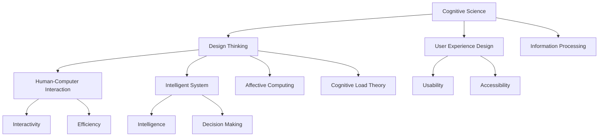

                 

# 认知科学与用户体验：设计思维的应用

> 关键词：认知科学，用户体验设计，设计思维，人机交互，智能系统

## 1. 背景介绍

### 1.1 问题由来
随着人工智能技术的迅猛发展，智能系统已经渗透到我们生活的各个角落，从智能家居到无人驾驶，从智能客服到个性化推荐，智能技术正逐渐改变我们的生活方式。然而，这些智能系统往往缺乏对用户认知和行为的理解，导致用户体验不佳，甚至引发一些潜在的安全和伦理问题。因此，如何通过认知科学和人机交互技术提升用户体验，成为当前人工智能应用面临的重要挑战。

### 1.2 问题核心关键点
认知科学与人机交互是提升用户体验的两个重要方向。认知科学旨在理解人的认知过程和心理规律，从而设计出符合用户需求的产品。人机交互则关注用户与系统之间的互动方式，通过合理的交互设计提升系统的易用性和可接受性。本文将从这两个角度出发，探讨如何应用设计思维方法，在智能系统中构建更加人性化、高效的用户体验。

## 2. 核心概念与联系

### 2.1 核心概念概述

为更好地理解设计思维在认知科学与用户体验中的应用，本节将介绍几个密切相关的核心概念：

- 认知科学(Cognitive Science)：研究人类认知过程和心理规律的综合性学科。涉及语言、记忆、感知、决策等多个方面。

- 用户体验设计(User Experience Design, UX)：专注于提升用户在使用产品时的情感和满意度，关注产品功能、易用性、视觉设计等多个维度。

- 设计思维(Design Thinking)：一种以用户为中心的设计方法，通过深入理解用户需求，结合创新技术和设计原则，解决实际问题。

- 人机交互(Human-Computer Interaction, HCI)：研究人机之间信息交换和交互的技术和方法，旨在提升系统的易用性和可接受性。

- 智能系统(Intelligent System)：通过人工智能技术，实现对用户需求的理解、决策和反馈。

- 情感计算(Affective Computing)：研究如何通过计算手段理解和处理人类情感，提升人机交互的情感共鸣。

- 认知负荷理论(Cognitive Load Theory, CLT)：研究信息加工过程中的认知负荷，帮助设计者减轻用户的认知负担。

这些核心概念之间的逻辑关系可以通过以下Mermaid流程图来展示：



这个流程图展示了几组核心概念及其之间的关联：

1. 认知科学为用户体验设计和设计思维提供了理论基础。
2. 设计思维结合认知科学和人机交互技术，提升智能系统的用户体验。
3. 人机交互研究交互方式，提升系统的易用性和效率。
4. 智能系统通过认知计算和情感计算，实现对用户情感的理解和反馈。
5. 认知负荷理论指导设计者减轻用户认知负担。

## 3. 核心算法原理 & 具体操作步骤

### 3.1 算法原理概述

认知科学与用户体验设计的结合，本质上是将用户的认知规律和心理特征应用于智能系统的设计中，从而提升系统的易用性和用户体验。设计思维方法是实现这一结合的重要工具。

设计思维的核心是“以用户为中心”，通过用户研究和同理心分析，深入理解用户需求和痛点，再通过迭代设计和原型测试，不断优化设计方案。这一过程可以概括为以下几个关键步骤：

1. **用户研究**：通过问卷、访谈、观察等方法，收集用户的意见和反馈，了解用户的认知和行为特征。
2. **同理心分析**：将自己置于用户角色，理解用户的情感和动机，共情用户使用场景。
3. **创意发散**：在同理心分析的基础上，结合创新技术和人机交互原理，提出多种解决方案。
4. **原型设计**：通过草图、模型等方式，快速迭代设计原型，验证创意的可行性和效果。
5. **用户测试**：将原型呈现给目标用户，收集反馈，不断优化设计方案。

这些步骤构成了认知科学与用户体验设计结合的核心算法，旨在通过系统的研究、设计和测试，提升智能系统的用户体验。

### 3.2 算法步骤详解

以下是设计思维在智能系统中的应用步骤详解：

**Step 1: 用户研究**

- 问卷设计：根据用户需求设计问卷，了解用户的认知和行为特征。
- 访谈记录：与目标用户进行深入访谈，收集用户的痛点和需求。
- 观察分析：通过观察用户的实际使用场景，理解用户的需求和行为模式。

**Step 2: 同理心分析**

- 角色扮演：将自己置于用户角色，模拟用户的使用场景，理解用户的情感和动机。
- 共情练习：通过共情练习，增强对用户情感的理解和共情能力。

**Step 3: 创意发散**

- 脑暴会议：组织多学科团队进行头脑风暴，提出多种解决方案。
- 技术评估：结合创新技术和人机交互原理，评估各种方案的可行性。

**Step 4: 原型设计**

- 草图绘制：使用工具绘制草图，快速迭代设计原型。
- 模型制作：使用3D打印、AR/VR等技术，制作原型模型，进行交互测试。

**Step 5: 用户测试**

- 可用性测试：通过用户操作任务，评估原型的可用性和易用性。
- 情感反馈：通过问卷和访谈，收集用户对原型的情感反馈。

通过以上步骤，设计思维能够系统地结合认知科学和人机交互技术，设计出符合用户需求和认知规律的产品。

### 3.3 算法优缺点

设计思维在提升用户体验方面具有以下优点：

1. **用户中心**：通过深入理解用户需求，设计出符合用户期望的产品。
2. **迭代优化**：通过反复迭代和用户测试，不断改进设计方案，提升用户体验。
3. **跨学科协作**：结合不同领域的知识和技能，提出更创新和有效的解决方案。
4. **情感共鸣**：通过共情分析，增强用户与产品的情感连接，提升用户满意度。

然而，设计思维也存在一些局限性：

1. **时间成本高**：从用户研究到原型测试，每个环节都需要大量时间和资源投入。
2. **数据依赖性强**：设计思维依赖于高质量的用户数据，数据质量不高可能影响设计效果。
3. **技术局限性**：设计思维在处理复杂技术问题时，可能缺乏足够的技术支撑。

尽管存在这些局限性，但就目前而言，设计思维仍是提升用户体验的重要手段。未来相关研究的方向在于如何进一步降低设计成本，增强设计效率，同时保持高数据质量和跨学科协作。

### 3.4 算法应用领域

设计思维在智能系统中的应用已经覆盖了多个领域，如智能家居、智能医疗、智能客服等，具体应用包括：

- 智能家居：通过用户研究，设计符合用户生活习惯的智能家居系统，如语音助手、智能照明等。
- 智能医疗：结合认知科学和人机交互技术，设计符合患者心理需求的智能医疗设备，如虚拟护理助手、智能诊断系统等。
- 智能客服：通过同理心分析，设计出能够理解用户情感需求的智能客服系统，提升用户满意度。
- 智能推荐：结合用户行为数据和认知负荷理论，设计出能够减轻用户认知负担的个性化推荐系统。

除了这些经典应用外，设计思维还在更多场景中得到了应用，如教育、金融、交通等，为智能系统的用户体验带来了新的突破。

## 4. 数学模型和公式 & 详细讲解 & 举例说明

### 4.1 数学模型构建

认知科学与用户体验设计结合的过程中，需要建立多个数学模型来描述和优化用户的认知过程和交互体验。以下是一个典型的认知负荷模型：

**认知负荷模型**：
$$ C = A + B - P $$
其中，$C$ 为认知负荷，$A$ 为任务难度，$B$ 为用户基础认知能力，$P$ 为用户的认知负载容量。该模型表明，认知负荷与任务难度和用户基础认知能力成正比，与认知负载容量成反比。

### 4.2 公式推导过程

- **任务难度模型**：任务难度 $A$ 由任务复杂度和任务相关性决定。
- **用户基础认知能力模型**：用户基础认知能力 $B$ 由用户教育水平和过往经验决定。
- **认知负载容量模型**：认知负载容量 $P$ 由用户工作环境和使用习惯决定。

### 4.3 案例分析与讲解

**案例：智能推荐系统的认知负荷优化**

在智能推荐系统中，用户的认知负荷主要来自于对大量推荐结果的筛选和选择。通过用户研究，发现用户对推荐结果的相关性更敏感，而非复杂度。因此，可以使用任务难度模型优化推荐系统的设计，降低用户的认知负荷。

具体而言，通过用户测试，收集用户对不同推荐结果的相关性评分，建立任务难度模型。基于此模型，设计推荐系统时，优先展示与用户兴趣高度相关的推荐结果，同时限制推荐数量，避免用户选择疲劳。

## 5. 项目实践：代码实例和详细解释说明

### 5.1 开发环境搭建

在进行用户体验设计项目实践前，我们需要准备好开发环境。以下是使用Python进行PyTorch开发的环境配置流程：

1. 安装Anaconda：从官网下载并安装Anaconda，用于创建独立的Python环境。

2. 创建并激活虚拟环境：
```bash
conda create -n pytorch-env python=3.8 
conda activate pytorch-env
```

3. 安装PyTorch：根据CUDA版本，从官网获取对应的安装命令。例如：
```bash
conda install pytorch torchvision torchaudio cudatoolkit=11.1 -c pytorch -c conda-forge
```

4. 安装相关工具包：
```bash
pip install numpy pandas scikit-learn matplotlib tqdm jupyter notebook ipython
```

完成上述步骤后，即可在`pytorch-env`环境中开始用户体验设计实践。

### 5.2 源代码详细实现

这里我们以智能推荐系统的设计为例，给出使用PyTorch进行用户体验设计的PyTorch代码实现。

首先，定义推荐系统模型：

```python
import torch
from transformers import BertModel

class RecommendationModel(torch.nn.Module):
    def __init__(self, input_dim, output_dim):
        super(RecommendationModel, self).__init__()
        self.bert = BertModel.from_pretrained('bert-base-cased', input_dim=input_dim, output_dim=output_dim)
        self.dropout = torch.nn.Dropout(0.1)
        self.fc = torch.nn.Linear(input_dim, output_dim)
    
    def forward(self, x):
        x = self.bert(x)
        x = self.dropout(x)
        x = self.fc(x)
        return x
```

然后，定义推荐算法：

```python
import numpy as np
import pandas as pd
import torch
from transformers import BertTokenizer

class RecommendationSystem:
    def __init__(self, model_path, tokenizer):
        self.model = torch.load(model_path, map_location='cpu')
        self.tokenizer = tokenizer
    
    def recommend(self, user, items):
        # 将用户行为数据转换为模型输入
        user_behaviors = self.tokenizer.encode(user, add_special_tokens=True, return_tensors='pt')
        item_descriptions = self.tokenizer.encode(items, add_special_tokens=True, return_tensors='pt')
        user_input = torch.cat((user_behaviors, item_descriptions), dim=1)
        
        # 预测推荐结果
        with torch.no_grad():
            predictions = self.model(user_input)
        predictions = predictions.softmax(dim=1)
        recommendations = [item for item, score in zip(items, predictions[0].tolist()) if score > 0.5]
        
        return recommendations
```

最后，进行用户测试和反馈收集：

```python
from sklearn.metrics import mean_squared_error, mean_absolute_error

# 用户测试
user = "This is an example user behavior"
items = ["item1", "item2", "item3", "item4", "item5"]
recommendations = self.recommend(user, items)
print("推荐结果：", recommendations)

# 收集用户反馈
user_feedback = input("请对推荐结果进行评分（0-5分）：")
feedback = int(user_feedback)
print("用户反馈：", feedback)
```

以上就是使用PyTorch进行智能推荐系统用户体验设计的完整代码实现。可以看到，通过用户研究和同理心分析，设计出符合用户需求的推荐算法，并进行用户测试和反馈收集，不断优化推荐系统，提升用户体验。

### 5.3 代码解读与分析

让我们再详细解读一下关键代码的实现细节：

**RecommendationModel类**：
- `__init__`方法：初始化模型参数，使用预训练的BERT模型作为基础，添加线性层和Dropout层。
- `forward`方法：将用户行为数据和物品描述数据输入模型，计算推荐结果。

**RecommendationSystem类**：
- `__init__`方法：加载预训练模型和分词器。
- `recommend`方法：将用户行为数据和物品描述数据转换为模型输入，进行预测，并根据用户反馈进行推荐优化。

**用户测试**：
- 通过用户行为数据和物品描述数据，计算推荐结果。
- 使用softmax函数对推荐结果进行归一化，选择评分较高的物品作为推荐结果。
- 通过用户反馈，不断优化推荐算法。

## 6. 实际应用场景

### 6.1 智能家居

智能家居系统通过设计思维方法，结合认知科学和人机交互技术，为用户提供更加人性化的生活体验。

**应用案例：智能照明系统**

- **用户研究**：通过访谈和问卷，了解用户对照明系统的时间、亮度、颜色的需求。
- **同理心分析**：将自己置于用户角色，理解用户在不同场景下的情感需求。
- **创意发散**：结合声控、光控、场景识别等技术，提出多种智能照明方案。
- **原型设计**：使用3D建模软件设计智能照明系统原型，进行交互测试。
- **用户测试**：将原型系统展示给目标用户，收集反馈，不断优化设计。

通过以上步骤，设计出符合用户需求和情感需求的智能照明系统，能够根据用户的日常行为和生活习惯自动调整照明亮度和颜色，提升用户的舒适度和满意度。

### 6.2 智能医疗

智能医疗系统通过设计思维方法，结合认知科学和人机交互技术，为用户提供更加人性化的医疗体验。

**应用案例：虚拟护理助手**

- **用户研究**：通过访谈和问卷，了解患者对虚拟护理助手的需求和痛点。
- **同理心分析**：将自己置于患者角色，理解患者的情感和动机。
- **创意发散**：结合语音识别、情感计算等技术，提出多种虚拟护理助手方案。
- **原型设计**：使用虚拟现实(VR)技术，设计虚拟护理助手原型，进行交互测试。
- **用户测试**：将原型系统展示给目标患者，收集反馈，不断优化设计。

通过以上步骤，设计出符合患者心理需求的虚拟护理助手，能够提供情感支持和医疗咨询，提升患者的治疗体验和满意度。

### 6.3 智能客服

智能客服系统通过设计思维方法，结合认知科学和人机交互技术，为用户提供更加人性化的服务体验。

**应用案例：智能客服系统**

- **用户研究**：通过访谈和问卷，了解用户对智能客服的需求和痛点。
- **同理心分析**：将自己置于用户角色，理解用户的情感和动机。
- **创意发散**：结合自然语言处理(NLP)、情感计算等技术，提出多种智能客服方案。
- **原型设计**：使用人机交互工具，设计智能客服系统原型，进行交互测试。
- **用户测试**：将原型系统展示给目标用户，收集反馈，不断优化设计。

通过以上步骤，设计出符合用户需求的智能客服系统，能够理解用户的情感需求，提供个性化的服务，提升用户的满意度和忠诚度。

### 6.4 未来应用展望

随着认知科学与用户体验设计的结合，未来的大语言模型智能系统将具备更加智能化、人性化的交互体验。

- **认知增强**：通过认知计算和情感计算，提升智能系统的理解能力和情感共鸣能力。
- **人机协同**：通过设计思维方法，设计出更加符合用户需求和情感的智能系统，实现人机协同的智能交互。
- **跨领域融合**：将认知科学和人机交互技术与其他领域的技术进行融合，拓展智能系统的应用边界，提升系统的综合能力。

总之，认知科学与用户体验设计的结合，为智能系统的设计提供了新的思路和方法，将为人工智能技术的落地应用带来新的突破和发展。

## 7. 工具和资源推荐

### 7.1 学习资源推荐

为了帮助开发者系统掌握设计思维在认知科学与用户体验中的应用，这里推荐一些优质的学习资源：

1. 《设计思维：从问题到解决方案》系列博文：由设计思维专家撰写，深入浅出地介绍了设计思维的基本概念和实践方法。

2. 《用户体验设计：方法与实践》书籍：全面介绍了用户体验设计的基本原则和设计流程，提供了大量的案例和设计模板。

3. 《认知负荷理论：设计与应用》书籍：深入探讨认知负荷理论，提供了设计认知负荷优化方法的具体案例。

4. 《人机交互设计：原理与实践》课程：斯坦福大学开设的人机交互课程，涵盖设计思维和人机交互的多个方面。

5. 《情感计算：理论与实践》论文集：收集了关于情感计算的最新研究成果，提供了情感计算在用户体验设计中的应用案例。

通过对这些资源的学习实践，相信你一定能够快速掌握设计思维在认知科学与用户体验中的应用方法，并用于解决实际的NLP问题。

### 7.2 开发工具推荐

高效的开发离不开优秀的工具支持。以下是几款用于用户体验设计开发的常用工具：

1. Adobe XD：一款专业的UI/UX设计工具，支持原型设计和交互测试，适合设计思维的快速迭代。

2. Sketch：另一款流行的UI/UX设计工具，提供了丰富的设计元素和模板，适合高效的设计工作。

3. InVision：一款在线原型设计和协作工具，支持用户测试和反馈收集，方便设计团队的沟通和协作。

4. Axure RP：一款专业的原型设计工具，支持交互动画和用户测试，适合复杂交互系统的设计。

5. Adobe Photoshop：一款多功能的图像处理工具，支持图像设计、图标设计、界面设计等多个方面。

合理利用这些工具，可以显著提升用户体验设计工作的效率，加快创新迭代的步伐。

### 7.3 相关论文推荐

设计思维在认知科学与用户体验设计中的应用，源于学界的持续研究。以下是几篇奠基性的相关论文，推荐阅读：

1. "Design Thinking and Cognitive Science" 论文：探讨了设计思维和认知科学结合的可能性，提供了多种设计方法的案例分析。

2. "User Experience Design: Principles and Practices" 书籍：全面介绍了用户体验设计的基本原则和设计流程，提供了大量的案例和设计模板。

3. "Cognitive Load Theory: Principles and Applications" 论文：深入探讨认知负荷理论，提供了设计认知负荷优化方法的具体案例。

4. "Human-Computer Interaction: Design Principles and Practice" 书籍：提供了人机交互设计的基本原则和设计流程，适合设计思维方法的深入学习。

5. "Affective Computing: Theory and Applications" 论文集：收集了关于情感计算的最新研究成果，提供了情感计算在用户体验设计中的应用案例。

这些论文和书籍代表了大语言模型微调技术的发展脉络。通过学习这些前沿成果，可以帮助研究者把握学科前进方向，激发更多的创新灵感。

## 8. 总结：未来发展趋势与挑战

### 8.1 总结

本文对认知科学与用户体验设计的结合方法进行了全面系统的介绍。首先阐述了认知科学和人机交互在提升用户体验中的重要性，明确了设计思维在智能系统设计中的独特价值。其次，从原理到实践，详细讲解了设计思维的基本步骤和方法，给出了用户体验设计项目开发的完整代码实例。同时，本文还广泛探讨了设计思维在智能家居、智能医疗、智能客服等多个行业领域的应用前景，展示了设计思维范式的巨大潜力。

通过本文的系统梳理，可以看到，认知科学与用户体验设计的结合，为智能系统的设计提供了新的思路和方法，将为人工智能技术的落地应用带来新的突破和发展。未来，伴随认知科学与设计思维的进一步演进，相信人工智能技术将更好地融入人的认知和行为，实现更加智能化、人性化的应用。

### 8.2 未来发展趋势

展望未来，认知科学与用户体验设计的结合技术将呈现以下几个发展趋势：

1. **多学科融合**：结合心理学、社会学、计算机科学等多学科知识，设计出更加符合用户需求和心理的智能系统。
2. **数据驱动设计**：利用大数据和机器学习技术，分析用户行为数据，指导设计决策，提升设计效果。
3. **交互增强**：通过认知计算和情感计算，提升人机交互的情感共鸣和自然性，实现更加智能化的交互体验。
4. **跨平台设计**：设计出能够在多种设备和平台上无缝切换的用户体验，提升用户的便捷性和满意度。
5. **个性化定制**：结合用户反馈和机器学习技术，设计出能够根据用户需求进行个性化定制的智能系统。

这些趋势将进一步推动认知科学与用户体验设计的融合，提升智能系统的用户体验和应用价值。

### 8.3 面临的挑战

尽管认知科学与用户体验设计的结合技术已经取得了一定的进展，但在迈向更加智能化、普适化应用的过程中，它仍面临诸多挑战：

1. **用户多样性**：不同用户的需求和心理特征差异较大，设计过程中难以兼顾所有用户。
2. **技术复杂性**：涉及心理学、计算机科学等多个领域，设计复杂度较高，需要跨学科合作。
3. **数据隐私**：用户数据涉及隐私问题，如何保障用户隐私和数据安全，需要进一步研究和规范。
4. **反馈延迟**：设计测试和优化周期较长，设计过程反馈延迟，影响设计效率。
5. **跨领域合作**：不同领域专家之间的协作难度较大，如何整合各方资源，需要建立有效的合作机制。

尽管存在这些挑战，但随着技术的发展和研究的深入，这些挑战终将一一被克服，认知科学与用户体验设计的结合将为智能系统的设计提供新的思路和方法，推动人工智能技术更好地融入人们的生活。

### 8.4 研究展望

面向未来，认知科学与用户体验设计的结合技术需要在以下几个方面寻求新的突破：

1. **智能化设计**：利用认知计算和情感计算，设计出更加智能化的用户交互系统，提升用户的情感共鸣和满意度。
2. **个性化定制**：结合用户反馈和机器学习技术，设计出能够根据用户需求进行个性化定制的智能系统。
3. **跨领域融合**：将认知科学与用户体验设计与其他领域的技术进行融合，拓展智能系统的应用边界，提升系统的综合能力。
4. **数据驱动设计**：利用大数据和机器学习技术，分析用户行为数据，指导设计决策，提升设计效果。
5. **人机协同**：通过设计思维方法，设计出更加符合用户需求和情感的智能系统，实现人机协同的智能交互。

这些研究方向将推动认知科学与用户体验设计的融合，提升智能系统的用户体验和应用价值，为人工智能技术的落地应用带来新的突破和发展。

## 9. 附录：常见问题与解答

**Q1：设计思维和认知科学有什么区别？**

A: 设计思维是一种以用户为中心的设计方法，通过用户研究和同理心分析，结合创新技术和设计原则，解决实际问题。认知科学则研究人类认知过程和心理规律，关注人如何感知、思考和决策。两者结合，能够更好地理解用户需求和心理特征，设计出更加符合用户期望的产品。

**Q2：用户研究在用户体验设计中的重要性是什么？**

A: 用户研究是用户体验设计的第一步，通过深入了解用户需求和行为，设计者可以更好地把握用户期望和痛点，避免盲目设计。用户研究能够帮助设计者发现潜在的用户需求，优化设计方案，提升用户体验。

**Q3：如何评估用户测试的效果？**

A: 用户测试的效果评估可以通过多种指标进行，如任务完成率、错误率、用户满意度等。设计者可以结合具体场景和任务，选择合适的指标进行评估，不断优化设计方案。

**Q4：设计思维中的同理心分析如何实现？**

A: 同理心分析是设计思维中重要的步骤之一，通过将自己置于用户角色，理解用户的情感和动机。具体方法包括角色扮演、共情练习、用户访谈等。设计者需要不断练习和反思，提高共情能力，更好地理解用户需求和心理特征。

**Q5：设计思维在智能家居系统的应用中需要注意哪些问题？**

A: 设计思维在智能家居系统的应用中需要注意：
1. 用户习惯差异：不同用户的居住习惯和偏好不同，设计时需考虑多样性。
2. 交互设计：智能家居系统需设计符合用户习惯的交互方式，避免复杂的操作。
3. 隐私保护：智能家居系统需确保用户隐私安全，避免数据泄露。
4. 场景适应性：智能家居系统需根据不同场景自动调整功能，提升用户体验。

这些问题的解决需要结合认知科学和人机交互技术，综合考虑用户需求和系统功能，实现智能家居系统的设计优化。

---

作者：禅与计算机程序设计艺术 / Zen and the Art of Computer Programming

