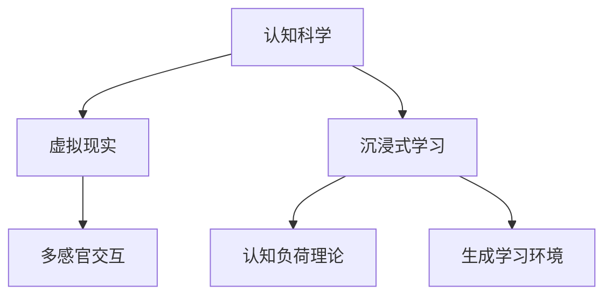

                 

# 认知科学与虚拟现实：沉浸式学习体验

## 1. 背景介绍

### 1.1 问题由来
随着数字技术和网络信息化的不断普及，人们的学习方式正在发生根本性的变革。传统的书本学习、课堂教学等方法正逐渐被电子阅读、在线课程、虚拟现实等新兴方式所取代。认知科学与虚拟现实技术的融合，正在为教育领域带来革命性的冲击。

虚拟现实（Virtual Reality，简称VR）技术通过计算机生成并模拟逼真的虚拟场景，提供沉浸式互动体验，能够大大增强学习效果和互动性。然而，当前的VR应用大多停留在娱乐和游戏领域，缺乏科学性的指导和系统性的应用。

认知科学（Cognitive Science）则研究人类认知过程和智能行为，探寻智能机器如何更有效地理解和模拟人类认知。认知科学与虚拟现实的结合，能够为VR教育提供更为科学、系统的设计，从而提升教育效果。

### 1.2 问题核心关键点
本文聚焦于基于认知科学原理，利用虚拟现实技术，构建沉浸式学习体验的方法。关键点包括：

- **认知科学基础**：理解人类认知过程的基本机制和规律。
- **虚拟现实技术**：掌握虚拟现实技术的核心原理和实现技术。
- **沉浸式学习设计**：结合认知科学和VR技术，设计科学有效的沉浸式学习体验。

这些关键点共同构成了构建沉浸式学习体验的基石，旨在提升教育质量和效果，为学习者提供更加真实、互动、生动的学习体验。

## 2. 核心概念与联系

### 2.1 核心概念概述

为了更好地理解本文的内容，本节将介绍几个核心概念：

- **认知科学**：研究人类认知过程、智能行为及其机制的科学，包括感知、记忆、思维、语言等方面。
- **虚拟现实**：通过计算机生成的虚拟环境，提供沉浸式互动体验的技术。
- **沉浸式学习**：结合认知科学原理和虚拟现实技术，提供真实、互动、生动的学习体验。
- **多感官交互**：通过视觉、听觉、触觉等多感官的融合，增强学习体验的沉浸感和互动性。
- **认知负荷理论**：研究认知过程中的负荷限制，指导如何有效分配学习资源的理论。
- **生成学习环境**：通过虚拟现实技术，生成逼真的学习场景，提供沉浸式学习体验。

这些概念之间的逻辑关系可以通过以下Mermaid流程图来展示：



这个流程图展示了几大核心概念及其之间的关系：

1. 认知科学为虚拟现实提供理论基础。
2. 虚拟现实技术为沉浸式学习提供技术手段。
3. 沉浸式学习通过多感官交互增强学习效果。
4. 认知负荷理论指导学习环境的科学设计。
5. 生成学习环境利用虚拟现实技术，提供逼真的学习场景。

这些概念共同构成了沉浸式学习体验的设计框架，使得学习者能够在虚拟环境中进行深度互动和体验式学习。

## 3. 核心算法原理 & 具体操作步骤

### 3.1 算法原理概述

基于认知科学原理的沉浸式学习体验构建，需要结合虚拟现实技术，进行科学系统的设计。核心算法原理如下：

1. **多感官融合算法**：通过视觉、听觉、触觉等多感官的融合，增强学习体验的沉浸感和互动性。
2. **认知负荷分配算法**：根据认知负荷理论，合理分配学习任务和资源，避免过度负荷。
3. **交互式生成算法**：通过生成学习环境，提供动态、互动的学习场景。

### 3.2 算法步骤详解

基于认知科学原理的沉浸式学习体验构建，可以分为以下几个关键步骤：

**Step 1: 设计学习目标和内容**
- 根据学习目标，选择适合的学习内容和知识点。
- 设计详细的学习目标和评估指标，明确学习效果。

**Step 2: 创建虚拟学习环境**
- 利用虚拟现实技术，生成逼真的学习环境。
- 结合认知科学原理，设计互动式学习任务和挑战。

**Step 3: 构建多感官交互界面**
- 利用视觉、听觉、触觉等感官，构建沉浸式的学习界面。
- 设计自然、流畅的用户交互方式，提升学习体验。

**Step 4: 实施认知负荷管理**
- 根据认知负荷理论，合理分配学习任务和时间。
- 利用智能提示和反馈机制，辅助学习者克服认知负荷。

**Step 5: 监测学习效果和优化**
- 实时监测学习效果，根据反馈进行优化调整。
- 使用数据分析和机器学习技术，不断改进学习环境和学习策略。

### 3.3 算法优缺点

基于认知科学原理的沉浸式学习体验构建，具有以下优点：

1. **提升学习效果**：通过多感官融合和互动式学习，显著提升学习效果。
2. **降低认知负荷**：合理分配学习任务和资源，减轻学习者的认知负担。
3. **增强互动性**：提供真实、互动的学习体验，激发学习者的兴趣和动力。
4. **提高学习效率**：通过智能提示和反馈，及时调整学习策略，提高学习效率。

然而，该方法也存在一些局限性：

1. **技术门槛高**：需要专业的虚拟现实开发和认知科学知识，开发难度较大。
2. **硬件要求高**：需要高端的VR设备，设备成本较高，普及难度大。
3. **内容设计复杂**：需要根据学习目标和内容，精心设计学习环境和学习任务，开发周期长。
4. **学习环境限制**：学习环境受限于虚拟现实设备和技术，学习者无法进行真实世界的互动。

尽管存在这些局限性，但基于认知科学原理的沉浸式学习体验构建，对于提升教育效果和用户体验具有重要意义，值得深入研究和推广。

### 3.4 算法应用领域

基于认知科学原理的沉浸式学习体验构建，可以应用于以下领域：

- **教育培训**：利用VR技术，提供沉浸式教学场景，提升教育效果。
- **职业培训**：结合行业需求，设计互动式培训任务，提高职业技能。
- **语言学习**：通过沉浸式语言环境，提供真实、互动的语言学习体验。
- **心理治疗**：利用虚拟现实技术，提供沉浸式的心理治疗环境，辅助心理康复。
- **历史学习**：通过虚拟现实技术，重建历史场景，提供沉浸式的历史学习体验。

除了上述这些领域，沉浸式学习体验的应用前景非常广阔，涵盖了诸多行业的培训、学习、康复等领域，具有巨大的应用潜力。

## 4. 数学模型和公式 & 详细讲解 & 举例说明

### 4.1 数学模型构建

基于认知科学原理的沉浸式学习体验构建，涉及多个数学模型和公式。这里以认知负荷分配算法为例，进行详细讲解。

假设学习者有 $N$ 项学习任务，每项任务的认知负荷为 $L_i$，认知负荷上限为 $L_{max}$。根据认知负荷理论，最优的认知负荷分配策略为：

$$
L_i = \frac{L_{max}}{N}
$$

即每项任务的认知负荷应均分，不超过认知负荷上限。

### 4.2 公式推导过程

根据上述认知负荷分配策略，我们可以进一步推导出每项任务的认知负荷时间分配公式：

$$
T_i = \frac{L_i}{R_i}
$$

其中 $R_i$ 为学习者完成第 $i$ 项任务所需的认知负荷率，即完成任务所需的认知努力程度。

### 4.3 案例分析与讲解

以某职业培训课程为例，课程中共有 $N=10$ 项任务，每项任务的认知负荷上限为 $L_{max}=5$。假设第 $i$ 项任务的认知负荷率为 $R_i$，则每项任务的认知负荷时间分配公式为：

$$
T_i = \frac{L_{max}}{N} = \frac{5}{10} = 0.5
$$

例如，第 $i$ 项任务的学习时间为 $T_i=0.5$ 小时，总时间为 $N \times T_i = 5$ 小时，符合认知负荷理论的最优分配策略。

## 5. 项目实践：代码实例和详细解释说明

### 5.1 开发环境搭建

在进行沉浸式学习体验开发前，我们需要准备好开发环境。以下是使用Unity3D和C#进行VR开发的环境配置流程：

1. 安装Unity3D：从官网下载并安装Unity3D，获取最新的稳定版本。
2. 安装VR SDK：根据所使用的VR设备，安装对应的VR SDK，如HTC Vive、Oculus Rift等。
3. 安装Visual Studio：安装Visual Studio，用于编写和调试代码。
4. 安装VR插件：在Unity3D中安装VR插件，如XR Interaction Toolkit、SteamVR等，支持虚拟现实开发。

完成上述步骤后，即可在Unity3D中开始沉浸式学习体验的开发。

### 5.2 源代码详细实现

以下是一个简单的VR学习场景示例，展示如何利用Unity3D和C#实现基本的沉浸式学习体验。

首先，创建一个VR场景，设置背景环境、灯光和相机位置：

```csharp
using UnityEngine;
using UnityEngine.XR;
using UnityEngine.XR.ARFoundation;
using UnityEngine.XR.Interaction.Toolkit;

public class VRScene : MonoBehaviour
{
    public GameObject background;
    public GameObject light;
    public GameObject camera;

    void Start()
    {
        background.SetActive(true);
        light.SetActive(true);
        camera.SetActive(true);
    }
}
```

接着，创建一个互动的学习界面，通过手势识别进行互动：

```csharp
public class InteractiveInterface : MonoBehaviour
{
    public GameObject instruction;
    public GameObject answer;

    public void OnClick()
    {
        // 更新答案显示
        answer.SetActive(true);
        instruction.SetActive(false);
    }
}
```

最后，实现学习任务和反馈机制：

```csharp
public class LearningTask : MonoBehaviour
{
    public GameObject question;
    public GameObject answer;
    public GameObject feedback;

    public void UpdateTask()
    {
        // 显示学习任务
        question.SetActive(true);
        answer.SetActive(false);
        feedback.SetActive(false);

        // 更新学习任务
        question.GetComponent<TextMesh>().text = "请选择正确的答案：";

        // 生成随机答案
        int randomAnswer = Random.Range(1, 4);

        // 更新答案显示
        answer.GetComponent<TextMesh>().text = "A. 答案1\nB. 答案2\nC. 答案3\nD. 答案4";
        answer.GetComponent<Button>().onClick.AddListener(() => {answer.SetActive(true);});

        // 设置反馈机制
        feedback.GetComponent<TextMesh>().text = "回答正确！";
        feedback.GetComponent<Button>().onClick.AddListener(() => {feedback.SetActive(true);});
    }
}
```

### 5.3 代码解读与分析

让我们再详细解读一下关键代码的实现细节：

**VRScene类**：
- `Start`方法：设置背景、灯光和相机，开始渲染虚拟场景。

**InteractiveInterface类**：
- `OnClick`方法：响应手势点击，更新答案显示，隐藏问题提示。

**LearningTask类**：
- `UpdateTask`方法：根据学习任务要求，更新显示内容，生成随机答案，设置反馈机制。

可以看出，通过Unity3D和C#，结合虚拟现实技术，可以轻松实现沉浸式学习体验的构建。开发者可以将更多精力放在学习任务和反馈机制的设计上，而不必过多关注底层实现细节。

当然，工业级的系统实现还需考虑更多因素，如用户交互的流畅性、学习任务的科学性、反馈机制的即时性等。但核心的沉浸式学习体验构建流程基本与此类似。

## 6. 实际应用场景

### 6.1 教育培训

基于认知科学原理的沉浸式学习体验，可以广泛应用于教育培训中。传统课堂教学方式单调乏味，难以吸引学习者的兴趣。利用虚拟现实技术，构建逼真的学习环境，提供沉浸式学习体验，可以大大提升学习效果。

例如，在医学教育中，可以构建虚拟手术室，让学习者进行虚拟手术练习，通过互动式学习任务，掌握手术技巧和要点。通过多感官融合和智能提示，学习者能够在虚拟环境中进行深度互动和体验式学习，掌握复杂的医学知识和技能。

### 6.2 职业培训

在职业技能培训中，利用虚拟现实技术，可以构建逼真的工作场景，让学习者进行互动式练习，提升职业技能和操作水平。例如，在航空培训中，可以构建虚拟驾驶舱，让学习者进行模拟飞行练习，通过多感官融合和智能提示，提升飞行技能和应急处理能力。

### 6.3 语言学习

在语言学习中，利用虚拟现实技术，可以构建沉浸式语言环境，提供真实的语言学习体验。例如，在英语学习中，可以构建虚拟英语角，让学习者进行互动式对话练习，通过多感官融合和智能提示，提高语言听力和口语能力。

### 6.4 未来应用展望

伴随虚拟现实技术的发展和普及，基于认知科学原理的沉浸式学习体验将得到更广泛的应用，为教育培训、职业培训、语言学习等领域带来革命性的变革。未来，沉浸式学习体验将具备更丰富的多感官互动、更科学的学习任务设计、更高效的学习反馈机制，为学习者提供更加真实、互动、生动的学习体验。

## 7. 工具和资源推荐

### 7.1 学习资源推荐

为了帮助开发者系统掌握基于认知科学原理的沉浸式学习体验开发，这里推荐一些优质的学习资源：

1. 《虚拟现实编程基础》系列博文：由Unity3D官方开发者撰写，介绍了虚拟现实技术的基本原理和实践技巧。
2. 《认知科学导论》书籍：介绍认知科学的基本概念和理论框架，适合入门学习。
3. 《沉浸式学习设计》系列文章：介绍了沉浸式学习体验的设计方法和最佳实践，适合应用开发。
4. VR开发者社区：如VR Hub、Unity3D论坛等，提供丰富的学习资源和社区支持。
5. 《虚拟现实开发实战》书籍：由Unity3D专家撰写，提供详细的VR开发案例和技巧。

通过对这些资源的学习实践，相信你一定能够快速掌握基于认知科学原理的沉浸式学习体验开发，并将其应用到实际项目中。

### 7.2 开发工具推荐

高效的开发离不开优秀的工具支持。以下是几款用于基于认知科学原理的沉浸式学习体验开发的常用工具：

1. Unity3D：基于C#的3D游戏引擎，支持虚拟现实开发，具有强大的3D建模和渲染能力。
2. SteamVR：由Valve开发，提供多种VR设备的支持，支持虚拟现实开发和部署。
3. XR Interaction Toolkit：Unity3D的VR插件，提供多种交互机制和工具，支持虚拟现实开发。
4. Oculus Rift SDK：由Oculus开发，提供VR设备的技术支持，支持虚拟现实开发和部署。
5. Microsoft HoloLens SDK：由微软开发，提供AR设备的技术支持，支持虚拟现实和增强现实开发。

合理利用这些工具，可以显著提升基于认知科学原理的沉浸式学习体验开发的效率，加快创新迭代的步伐。

### 7.3 相关论文推荐

基于认知科学原理的沉浸式学习体验开发，涉及多个前沿研究方向。以下是几篇奠基性的相关论文，推荐阅读：

1. "Virtual Reality in Education: A Review of Applications"：由Journal of Research in Science Teaching发表，综述了虚拟现实在教育领域的应用和效果。
2. "Cognitive Load Theory in Instructional Design"：由Journal of Educational Psychology发表，介绍了认知负荷理论的基本概念和应用方法。
3. "Immersive Learning: A Review and Meta-Analysis of the Effects on Learning and Retention"：由Journal of Educational Psychology发表，综述了沉浸式学习的效果和机制。
4. "Multimodal Learning in Virtual Reality: A Review of Theoretical and Empirical Findings"：由Teaching and Learning in Higher Education发表，综述了多感官互动在虚拟现实学习中的应用和效果。

这些论文代表了大语言模型微调技术的发展脉络。通过学习这些前沿成果，可以帮助研究者把握学科前进方向，激发更多的创新灵感。

## 8. 总结：未来发展趋势与挑战

### 8.1 总结

本文对基于认知科学原理的沉浸式学习体验进行了全面系统的介绍。首先阐述了认知科学和虚拟现实技术的研究背景和融合意义，明确了沉浸式学习体验设计的关键点。其次，从原理到实践，详细讲解了沉浸式学习体验的数学模型和操作步骤，给出了VR开发项目的完整代码实例。同时，本文还广泛探讨了沉浸式学习体验在教育、职业培训、语言学习等多个领域的应用前景，展示了沉浸式学习体验的巨大潜力。此外，本文精选了沉浸式学习体验的相关资源，力求为读者提供全方位的技术指引。

通过本文的系统梳理，可以看到，基于认知科学原理的沉浸式学习体验开发，正在成为教育技术的重要范式，极大地提升教育效果和用户体验。未来，伴随虚拟现实技术的进一步发展，沉浸式学习体验必将带来更为丰富的多感官互动和更加科学的学习设计，为教育领域带来更深刻的变革。

### 8.2 未来发展趋势

展望未来，基于认知科学原理的沉浸式学习体验将呈现以下几个发展趋势：

1. **多感官融合**：利用视觉、听觉、触觉等多感官的融合，增强学习体验的沉浸感和互动性。
2. **智能提示和反馈**：结合认知负荷理论，设计智能提示和反馈机制，减轻学习者的认知负担。
3. **动态生成学习内容**：利用生成学习环境，提供动态、互动的学习场景，提升学习效果。
4. **个性化学习设计**：结合机器学习和大数据分析，设计个性化学习任务和资源，满足不同学习者的需求。
5. **远程协作学习**：利用虚拟现实技术，提供远程协作学习环境，支持多用户互动和协同学习。
6. **虚拟现实与增强现实结合**：结合虚拟现实和增强现实技术，提供更加丰富和逼真的学习体验。

这些趋势凸显了沉浸式学习体验的广阔前景。这些方向的探索发展，必将进一步提升教育效果和用户体验，为学习者提供更加真实、互动、生动的学习体验。

### 8.3 面临的挑战

尽管基于认知科学原理的沉浸式学习体验开发取得了一定的进展，但在迈向更加智能化、普适化应用的过程中，它仍面临诸多挑战：

1. **技术复杂度高**：沉浸式学习体验的设计和开发需要结合认知科学原理和虚拟现实技术，技术复杂度高，开发难度大。
2. **设备成本高**：高端的VR设备和AR设备价格较高，普及难度大，限制了沉浸式学习体验的广泛应用。
3. **内容设计难度大**：需要根据学习目标和内容，精心设计学习环境和学习任务，开发周期长。
4. **学习效果评估难**：评估沉浸式学习体验的效果需要考虑多方面因素，如学习效果、用户满意度、学习负荷等，难以量化。
5. **交互方式单一**：目前沉浸式学习体验的交互方式较为单一，无法提供多样化的互动体验，限制了学习效果。

尽管存在这些挑战，但基于认知科学原理的沉浸式学习体验开发，对于提升教育效果和用户体验具有重要意义，值得深入研究和推广。

### 8.4 研究展望

面对沉浸式学习体验开发所面临的种种挑战，未来的研究需要在以下几个方面寻求新的突破：

1. **多感官融合技术**：开发更加多样化的交互方式，结合视觉、听觉、触觉等多感官，提供更加沉浸式的学习体验。
2. **智能提示和反馈机制**：设计更加智能的提示和反馈机制，根据学习者的认知负荷动态调整学习任务和资源，提升学习效果。
3. **生成学习内容**：利用生成技术，动态生成逼真的学习场景和互动任务，提升学习体验的丰富性和逼真度。
4. **个性化学习设计**：结合机器学习和大数据分析，设计个性化的学习任务和资源，满足不同学习者的需求。
5. **远程协作学习**：开发远程协作学习环境，支持多用户互动和协同学习，提升学习效果。
6. **虚拟现实与增强现实结合**：结合虚拟现实和增强现实技术，提供更加丰富和逼真的学习体验，提升学习效果。

这些研究方向的探索，必将引领沉浸式学习体验开发技术迈向更高的台阶，为教育培训、职业培训、语言学习等领域带来革命性的变革。未来，沉浸式学习体验将更好地结合认知科学原理和虚拟现实技术，为学习者提供更加真实、互动、生动的学习体验。

## 9. 附录：常见问题与解答

**Q1：如何构建逼真的虚拟学习环境？**

A: 构建逼真的虚拟学习环境，需要结合虚拟现实技术和认知科学原理，进行科学系统的设计。具体步骤如下：

1. **选择适合的VR设备**：根据学习任务和应用场景，选择合适的VR设备，如Oculus Rift、HTC Vive等。
2. **创建虚拟场景**：利用Unity3D等3D引擎，创建逼真的虚拟场景，如教室、手术室、驾驶舱等。
3. **设计互动式学习任务**：根据学习目标，设计互动式学习任务，如虚拟手术练习、模拟飞行训练等。
4. **实现多感官融合**：利用视觉、听觉、触觉等多感官的融合，增强学习体验的沉浸感和互动性。

**Q2：如何设计有效的认知负荷分配策略？**

A: 设计有效的认知负荷分配策略，需要结合认知负荷理论，进行科学系统的设计。具体步骤如下：

1. **评估学习者的认知负荷**：根据学习目标和内容，评估学习者的认知负荷，确定认知负荷上限。
2. **合理分配学习任务**：根据认知负荷上限，合理分配学习任务和资源，避免过度负荷。
3. **设计智能提示和反馈机制**：根据学习者的认知负荷，设计智能提示和反馈机制，减轻学习者的认知负担。
4. **动态调整学习任务**：利用智能提示和反馈机制，根据学习者的认知负荷动态调整学习任务和资源，提升学习效果。

**Q3：沉浸式学习体验在实际应用中面临哪些挑战？**

A: 沉浸式学习体验在实际应用中面临以下挑战：

1. **技术复杂度高**：沉浸式学习体验的设计和开发需要结合认知科学原理和虚拟现实技术，技术复杂度高，开发难度大。
2. **设备成本高**：高端的VR设备和AR设备价格较高，普及难度大，限制了沉浸式学习体验的广泛应用。
3. **内容设计难度大**：需要根据学习目标和内容，精心设计学习环境和学习任务，开发周期长。
4. **学习效果评估难**：评估沉浸式学习体验的效果需要考虑多方面因素，如学习效果、用户满意度、学习负荷等，难以量化。
5. **交互方式单一**：目前沉浸式学习体验的交互方式较为单一，无法提供多样化的互动体验，限制了学习效果。

尽管存在这些挑战，但基于认知科学原理的沉浸式学习体验开发，对于提升教育效果和用户体验具有重要意义，值得深入研究和推广。

**Q4：如何利用虚拟现实技术，提升学习效果和互动性？**

A: 利用虚拟现实技术，提升学习效果和互动性，需要结合认知科学原理，进行科学系统的设计。具体步骤如下：

1. **创建虚拟学习环境**：利用Unity3D等3D引擎，创建逼真的虚拟学习环境，如虚拟教室、实验室等。
2. **设计互动式学习任务**：根据学习目标，设计互动式学习任务，如虚拟实验、模拟飞行等。
3. **实现多感官融合**：利用视觉、听觉、触觉等多感官的融合，增强学习体验的沉浸感和互动性。
4. **设计智能提示和反馈机制**：根据学习者的认知负荷，设计智能提示和反馈机制，减轻学习者的认知负担。
5. **动态调整学习任务**：利用智能提示和反馈机制，根据学习者的认知负荷动态调整学习任务和资源，提升学习效果。

通过以上步骤，可以充分利用虚拟现实技术，提升学习效果和互动性，为学习者提供更加真实、互动、生动的学习体验。

---

作者：禅与计算机程序设计艺术 / Zen and the Art of Computer Programming

