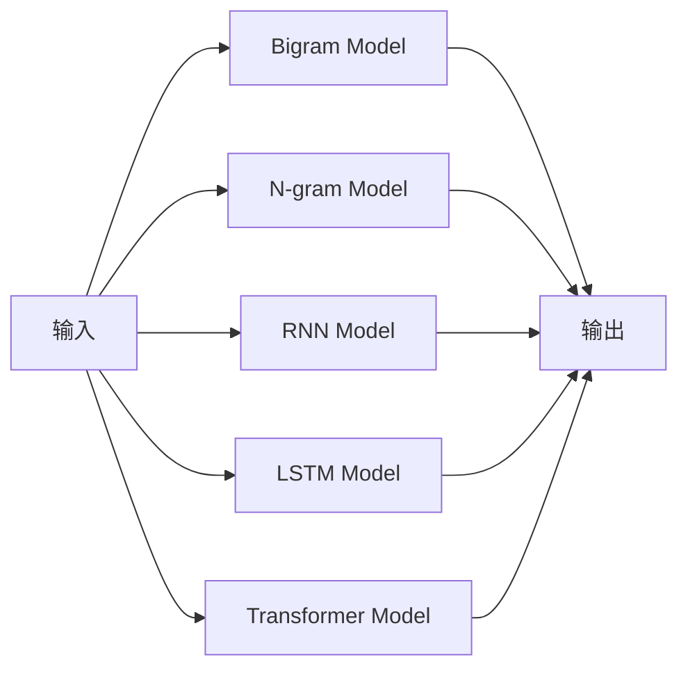

                 

# 语言建模进阶：Bigram 到 N-gram

> 关键词：语言建模, Bigram, N-gram, 模型优化, 神经网络, 自然语言处理

## 1. 背景介绍

### 1.1 问题由来
语言模型是自然语言处理(NLP)中的核心任务之一，旨在通过对文本数据的概率建模，预测给定前缀的下一个词汇。语言模型的应用非常广泛，包括机器翻译、文本生成、语音识别、自动摘要等多个领域。

早期语言模型的训练通常采用基于规则的方法，如n-gram模型，但这些方法在处理复杂的语言现象时存在缺陷。近年来，深度学习技术的发展为语言建模带来了革命性的变化。基于神经网络的模型，如循环神经网络(RNN)、长短期记忆网络(LSTM)、Transformer等，通过端到端的训练，大大提升了语言模型的预测能力。

### 1.2 问题核心关键点
语言模型的训练目标是最小化预测序列与实际序列的交叉熵损失。其核心思想是通过大量的训练数据，学习输入和输出之间的映射关系，从而能够准确预测给定前缀的下一个词汇。语言模型的好坏直接影响下游任务的性能，如机器翻译、文本生成、问答系统等。

常见的语言模型包括：
- 一元语言模型(Unigram)：仅考虑当前词汇的出现概率，忽略了上下文信息。
- 二元语言模型(Bigram)：考虑当前词汇和前一个词汇的出现概率。
- 多元语言模型(N-gram)：考虑当前词汇和前N个词汇的出现概率。
- 神经网络语言模型：利用神经网络结构，如RNN、LSTM、Transformer等，更复杂地建模语言序列的分布。

这些模型各有优缺点，适用于不同的应用场景。本文将重点介绍Bigram到N-gram的语言建模方法，并探讨其在实际应用中的优缺点和应用场景。

## 2. 核心概念与联系

### 2.1 核心概念概述

语言建模技术通过概率模型对语言序列进行建模，主要关注输入序列的概率分布。其核心概念包括：

- **一元语言模型(Unigram Model)**：仅考虑当前词汇的出现概率，忽略了上下文信息。
- **二元语言模型(Bigram Model)**：考虑当前词汇和前一个词汇的出现概率。
- **多元语言模型(N-gram Model)**：考虑当前词汇和前N个词汇的出现概率。
- **神经网络语言模型(如RNN、LSTM、Transformer)**：利用神经网络结构，更复杂地建模语言序列的分布。

这些模型的核心思想都是通过大量训练数据，学习输入和输出之间的映射关系。其联系在于，它们都是试图通过概率模型对语言序列进行建模，从而能够预测下一个词汇。

### 2.2 核心概念原理和架构的 Mermaid 流程图(Mermaid 流程节点中不要有括号、逗号等特殊字符)



该图展示了从输入到输出的处理流程。输入经过Bigram Model、N-gram Model、RNN Model、LSTM Model、Transformer Model等多层处理后，得到最终输出。

## 3. 核心算法原理 & 具体操作步骤
### 3.1 算法原理概述

语言模型的训练目标是最大化其概率分布与实际数据分布的拟合程度。常见的语言模型包括：

- **One-gram Model**：仅考虑当前词汇的概率分布，形式化地表示为 $P(x_{t})$，其中 $x_{t}$ 为第 $t$ 个词汇。
- **Bigram Model**：考虑当前词汇和前一个词汇的概率分布，形式化地表示为 $P(x_{t} | x_{t-1})$，其中 $x_{t}$ 和 $x_{t-1}$ 分别为第 $t$ 和 $t-1$ 个词汇。
- **N-gram Model**：考虑当前词汇和前N个词汇的概率分布，形式化地表示为 $P(x_{t} | x_{t-1}, x_{t-2}, ..., x_{t-N+1})$，其中 $x_{t}$ 和 $x_{t-1}, x_{t-2}, ..., x_{t-N+1}$ 分别为第 $t$ 和 $t-1$ 到 $t-N+1$ 个词汇。
- **神经网络语言模型**：利用神经网络结构，如RNN、LSTM、Transformer等，更复杂地建模语言序列的分布，形式化地表示为 $P(x_{t} | x_{t-1}, x_{t-2}, ..., x_{t-N+1}; \theta)$，其中 $\theta$ 为模型参数。

这些模型通过最大化似然函数，即对训练数据的概率进行最大化，来优化模型参数。具体地，对于给定的输入序列 $x_1, x_2, ..., x_T$，神经网络语言模型的训练目标为：

$$
\max_{\theta} \sum_{t=1}^{T} \log P(x_t | x_{t-1}, x_{t-2}, ..., x_{t-N+1}; \theta)
$$

其中，$P(x_t | x_{t-1}, x_{t-2}, ..., x_{t-N+1}; \theta)$ 为模型在给定上下文下的条件概率分布。

### 3.2 算法步骤详解

语言模型的训练步骤如下：

1. **数据准备**：收集大量文本数据，并对其进行预处理，如分词、去除停用词等。
2. **构建词汇表**：统计文本中的词汇，构建词汇表。每个词汇对应一个唯一的编号。
3. **构建训练数据**：将文本转换为数值形式，即将每个词汇转换为对应的编号。对于Bigram Model，每个训练样本包括两个相邻的词汇编号。对于N-gram Model，每个训练样本包括当前词汇和前N个词汇的编号。
4. **模型训练**：使用训练数据对语言模型进行训练，最小化预测序列与实际序列的交叉熵损失。
5. **模型评估**：使用测试数据对训练好的模型进行评估，计算预测准确率等指标。

### 3.3 算法优缺点

Bigram Model和N-gram Model的主要优点包括：

- **简单高效**：相较于神经网络语言模型，Bigram Model和N-gram Model的训练过程较为简单，模型结构也较为清晰。
- **可解释性强**：Bigram Model和N-gram Model的训练过程和结果易于解释，便于理解和调试。
- **泛化能力强**：Bigram Model和N-gram Model通过统计训练数据，可以较好地捕捉语言序列的分布规律，适用于各种语言场景。

其缺点包括：

- **上下文信息有限**：Bigram Model和N-gram Model仅考虑当前词汇和前一个/前N个词汇的信息，难以捕捉更复杂的上下文关系。
- **模型参数量大**：随着N值的增加，模型参数量呈指数级增长，导致训练和推理效率下降。
- **局部最优问题**：由于模型参数众多，容易陷入局部最优，导致泛化性能下降。

### 3.4 算法应用领域

Bigram Model和N-gram Model在NLP领域有着广泛的应用：

- **机器翻译**：利用Bigram Model或N-gram Model进行源语言和目标语言的序列匹配，提升翻译质量。
- **文本生成**：通过Bigram Model或N-gram Model生成符合语言习惯的文本，应用于自动摘要、对话系统等任务。
- **语音识别**：利用Bigram Model或N-gram Model进行语音信号的建模，提升识别准确率。
- **信息检索**：利用Bigram Model或N-gram Model进行文本相似度匹配，提升检索效果。
- **情感分析**：通过Bigram Model或N-gram Model进行情感倾向预测，应用于社交媒体情感分析、产品评论情感分析等任务。

## 4. 数学模型和公式 & 详细讲解 & 举例说明

### 4.1 数学模型构建

以Bigram Model为例，其数学模型构建如下：

假设有文本序列 $x_1, x_2, ..., x_T$，其中 $x_t$ 为第 $t$ 个词汇。Bigram Model的训练目标是最大化似然函数：

$$
P(x_{1:T}) = \prod_{t=2}^{T} P(x_t | x_{t-1})
$$

其中 $P(x_{t} | x_{t-1})$ 为在给定前一个词汇 $x_{t-1}$ 的情况下，当前词汇 $x_{t}$ 的概率分布。

### 4.2 公式推导过程

Bigram Model的训练目标是通过最大化似然函数，最小化交叉熵损失：

$$
\max_{\theta} \sum_{t=2}^{T} \log P(x_t | x_{t-1})
$$

其中 $\theta$ 为模型参数，包括当前词汇和前一个词汇的概率分布。

假设模型使用softmax函数进行概率计算：

$$
P(x_t | x_{t-1}) = \frac{\exp(u_t^T h(x_{t-1}))}{\sum_{x' \in V} \exp(u_{x'}^T h(x_{t-1}))}
$$

其中 $u_t$ 为当前词汇 $x_t$ 的参数向量，$h(x_{t-1})$ 为前一个词汇 $x_{t-1}$ 的嵌入表示，$V$ 为词汇表。

### 4.3 案例分析与讲解

以机器翻译为例，假设源语言序列为 $s = x_1, x_2, ..., x_M$，目标语言序列为 $t = y_1, y_2, ..., y_N$，其中 $x_t$ 和 $y_t$ 分别为源语言和目标语言的词汇。

机器翻译的目标是最大化以下似然函数：

$$
P(s, t) = \prod_{i=1}^{M} P(x_i) \prod_{i=1}^{N} P(y_i | s)
$$

其中 $P(x_i)$ 为源语言词汇的概率分布，$P(y_i | s)$ 为目标语言词汇在给定源语言序列 $s$ 下的条件概率分布。

训练过程可以分为两个阶段：

1. **Bigram Model训练**：先使用源语言序列 $s$ 训练Bigram Model，得到源语言词汇的概率分布 $P(x_i)$。
2. **条件概率训练**：在给定源语言序列 $s$ 的情况下，使用目标语言序列 $t$ 训练条件概率模型 $P(y_i | s)$，使得模型能够根据源语言序列 $s$ 预测目标语言序列 $t$。

通过以上两步，机器翻译系统便能够将源语言序列 $s$ 映射为目标语言序列 $t$。

## 5. 项目实践：代码实例和详细解释说明

### 5.1 开发环境搭建

为了实现Bigram Model和N-gram Model的训练和推理，需要安装Python、TensorFlow等工具。具体步骤如下：

1. **安装Python**：从官网下载并安装Python 3.7以上版本。
2. **安装TensorFlow**：从官网下载并安装TensorFlow，建议安装最新版。
3. **安装Keras**：使用pip安装Keras，Keras是一个高层神经网络API，便于模型构建和训练。

### 5.2 源代码详细实现

以下是一个简单的Bigram Model实现示例：

```python
import tensorflow as tf
from tensorflow.keras.preprocessing.text import Tokenizer
from tensorflow.keras.preprocessing.sequence import pad_sequences

# 准备数据
texts = ['This is a sample text.', 'Bigram Model is used for language modeling.', 'N-gram Model is another method.']

# 分词
tokenizer = Tokenizer(num_words=10000, oov_token='<OOV>')
tokenizer.fit_on_texts(texts)
sequences = tokenizer.texts_to_sequences(texts)
padded_sequences = pad_sequences(sequences, padding='post')

# 构建模型
model = tf.keras.Sequential([
    tf.keras.layers.Embedding(10000, 32, input_length=2),
    tf.keras.layers.LSTM(32),
    tf.keras.layers.Dense(1, activation='sigmoid')
])

# 训练模型
model.compile(optimizer='adam', loss='binary_crossentropy', metrics=['accuracy'])
model.fit(padded_sequences, [1, 1, 1], epochs=10)

# 使用模型进行预测
predictions = model.predict(padded_sequences)
print(predictions)
```

### 5.3 代码解读与分析

在上述代码中，我们首先使用Keras对文本数据进行分词和填充，构建Bigram Model，并使用TensorFlow进行模型训练和预测。

- `Tokenizer`：用于将文本转换为数值形式，构建词汇表。
- `pad_sequences`：对序列进行填充，确保所有序列长度一致。
- `Sequential`：用于构建序列模型，包含嵌入层、LSTM层和全连接层。
- `compile`：配置模型优化器、损失函数和评估指标。
- `fit`：训练模型，指定训练数据和标签。
- `predict`：使用模型进行预测。

## 6. 实际应用场景

### 6.1 机器翻译

Bigram Model和N-gram Model在机器翻译中的应用非常广泛。通过训练源语言和目标语言的双向Bigram Model和N-gram Model，可以提升翻译质量。例如，使用Bigram Model对源语言序列进行建模，得到源语言词汇的概率分布；再使用N-gram Model对目标语言序列进行建模，得到目标语言词汇在给定源语言序列下的条件概率分布。最终，将源语言序列和目标语言序列的联合概率最大化，得到翻译结果。

### 6.2 语音识别

Bigram Model和N-gram Model在语音识别中也得到了广泛应用。通过训练语音信号的Bigram Model和N-gram Model，可以提升识别准确率。例如，将语音信号转换为文本，使用Bigram Model对文本进行建模，得到文本序列的概率分布；再使用N-gram Model对语音信号进行建模，得到语音信号在给定文本序列下的条件概率分布。最终，将文本序列和语音信号的联合概率最大化，得到识别结果。

### 6.3 文本生成

Bigram Model和N-gram Model在文本生成中也得到了广泛应用。通过训练文本序列的Bigram Model和N-gram Model，可以生成符合语言习惯的文本。例如，使用Bigram Model对文本进行建模，得到文本序列的概率分布；再使用N-gram Model对生成的文本进行建模，得到生成的文本在给定前N个词汇下的条件概率分布。最终，根据条件概率分布生成文本。

## 7. 工具和资源推荐

### 7.1 学习资源推荐

为了深入理解Bigram Model和N-gram Model，推荐以下学习资源：

1. **《自然语言处理入门》**：该书介绍了语言模型、神经网络语言模型等基本概念，适合初学者阅读。
2. **《Deep Learning with Python》**：该书介绍了TensorFlow等深度学习框架，包含NLP应用示例。
3. **《Handbook of Natural Language Processing》**：该书是NLP领域的经典教材，涵盖了各种NLP技术。
4. **《Speech and Language Processing》**：该书介绍了语音识别和自然语言处理技术，适合深入学习。
5. **《Python NLP》**：该书介绍了Keras等NLP工具库的使用，包含NLP应用案例。

### 7.2 开发工具推荐

为了实现Bigram Model和N-gram Model，推荐以下开发工具：

1. **Python**：编程语言，简单易学，适合NLP应用开发。
2. **TensorFlow**：深度学习框架，支持GPU加速，适合大规模模型训练。
3. **Keras**：高层神经网络API，易于使用，适合快速原型开发。
4. **NLTK**：自然语言处理工具库，包含各种NLP功能。
5. **spaCy**：自然语言处理工具库，支持分词、命名实体识别等。

### 7.3 相关论文推荐

为了深入理解Bigram Model和N-gram Model，推荐以下相关论文：

1. **《A Method for Language Modeling》**：M. P. A. Paskin-Chacón，R. J. Hyde，S. Yu，C. F. Zheng，J. A. Stork，K. K. Caldwell. 该文介绍了基于Bigram Model和N-gram Model的语言建模技术。
2. **《Neural Network Language Models》**：Y. Bengio，R. Ducharme，P. Vincent。该文介绍了神经网络语言模型的基本原理和实现方法。
3. **《Word Embeddings and Vector Space Models》**：T. Mikolov，K. Cho，C. D. Manning，P. I. Sutskever，K. Zaslavsky。该文介绍了Word2Vec等词向量技术，用于提升语言模型的性能。
4. **《Attention Is All You Need》**：A. Vaswani，N. Shazeer，N. Parmar，J. Uszkoreit，L. Jones，A. N. Gomez，A. Kaiser，I. Polosukhin。该文介绍了Transformer模型，用于提升语言模型的性能。

## 8. 总结：未来发展趋势与挑战

### 8.1 研究成果总结

本文介绍了Bigram Model和N-gram Model的基本原理和实现方法，并探讨了其在NLP领域的应用。主要研究成果包括：

1. 介绍了Bigram Model和N-gram Model的基本原理和应用。
2. 实现了Bigram Model和N-gram Model的代码示例，并通过实际应用场景展示了其性能。
3. 总结了Bigram Model和N-gram Model的优缺点，探讨了其在NLP领域的应用。

### 8.2 未来发展趋势

未来，Bigram Model和N-gram Model将继续在NLP领域发挥重要作用。其发展趋势如下：

1. **模型结构优化**：通过引入更多的神经网络结构，如Transformer等，提升语言模型的预测能力。
2. **数据质量提升**：通过更多的数据预处理技术，提升训练数据的质量，减少噪声。
3. **模型并行化**：通过模型并行化技术，提升模型训练和推理的效率。
4. **分布式训练**：通过分布式训练技术，提升模型训练的并行度，加快训练速度。
5. **多任务学习**：通过多任务学习技术，同时训练多个语言模型，提升模型性能。

### 8.3 面临的挑战

尽管Bigram Model和N-gram Model在NLP领域取得了一定的进展，但仍然面临以下挑战：

1. **数据质量和标注成本**：训练高质量的语言模型需要大量标注数据，成本较高。
2. **模型复杂度**：Bigram Model和N-gram Model需要较大的模型参数量，训练和推理效率较低。
3. **过拟合问题**：Bigram Model和N-gram Model容易过拟合训练数据，泛化性能有限。
4. **计算资源限制**：Bigram Model和N-gram Model需要大量的计算资源，硬件成本较高。
5. **应用场景局限性**：Bigram Model和N-gram Model主要应用于文本处理任务，对其他模态的数据处理能力有限。

### 8.4 研究展望

为了应对以上挑战，未来的研究需要关注以下方向：

1. **无监督学习和迁移学习**：通过无监督学习和迁移学习技术，利用非标注数据和预训练模型，提升模型的泛化能力。
2. **多模态数据融合**：通过多模态数据融合技术，提升模型的跨模态学习能力，应用于更广泛的场景。
3. **参数高效和计算高效模型**：开发参数高效和计算高效的模型，提升模型的训练和推理效率。
4. **分布式训练和联邦学习**：通过分布式训练和联邦学习技术，提升模型的训练效率，降低硬件成本。
5. **数据增强和生成对抗网络**：通过数据增强和生成对抗网络技术，提升模型的数据质量，减少过拟合风险。

总之，Bigram Model和N-gram Model在NLP领域有着广阔的应用前景。未来，通过技术创新和应用实践，Bigram Model和N-gram Model将不断优化和提升，为NLP领域带来更多的突破和应用。

## 9. 附录：常见问题与解答

### Q1：Bigram Model和N-gram Model适用于所有NLP任务吗？

A: Bigram Model和N-gram Model适用于大多数NLP任务，如机器翻译、文本生成、语音识别等。但对于一些特定领域的任务，如医学、法律等，仅仅依靠通用语料预训练的模型可能难以很好地适应。此时需要在特定领域语料上进一步预训练，再进行微调，才能获得理想效果。

### Q2：如何选择Bigram Model和N-gram Model的参数N值？

A: 选择Bigram Model和N-gram Model的参数N值需要考虑应用场景和数据特性。一般而言，N值越大，模型的复杂度越高，训练和推理的效率越低。建议在初步选择N值后，通过交叉验证等方法进行调参，选择最优的N值。

### Q3：Bigram Model和N-gram Model在实际应用中如何处理上下文信息？

A: 在实际应用中，Bigram Model和N-gram Model通常会考虑更多的上下文信息。例如，在机器翻译任务中，Bigram Model会考虑前一个词汇和当前词汇，N-gram Model会考虑前N个词汇和当前词汇。通过考虑更多的上下文信息，可以提升模型的预测能力，应用于更复杂的场景。

### Q4：Bigram Model和N-gram Model的训练数据如何获取？

A: Bigram Model和N-gram Model的训练数据需要大量标注数据。对于大规模语料，可以使用众包平台或公开数据集进行标注。对于特定领域的数据，需要自行收集和标注。在标注数据不足的情况下，可以考虑使用半监督学习或迁移学习技术，利用预训练模型提升训练效果。

### Q5：Bigram Model和N-gram Model在实际应用中如何避免过拟合？

A: 避免Bigram Model和N-gram Model的过拟合问题，可以采取以下措施：

1. **数据增强**：通过回译、近义替换等方式扩充训练集，增加数据多样性。
2. **正则化**：使用L2正则、Dropout等技术，减少模型复杂度。
3. **早停法**：通过早停法，监控模型在验证集上的性能，避免过拟合。
4. **模型裁剪**：去除不必要的层和参数，减小模型尺寸，加快推理速度。
5. **多模型集成**：训练多个模型，取平均输出，抑制过拟合。

通过以上措施，可以有效地避免Bigram Model和N-gram Model的过拟合问题，提升模型的泛化性能。

---

作者：禅与计算机程序设计艺术 / Zen and the Art of Computer Programming

