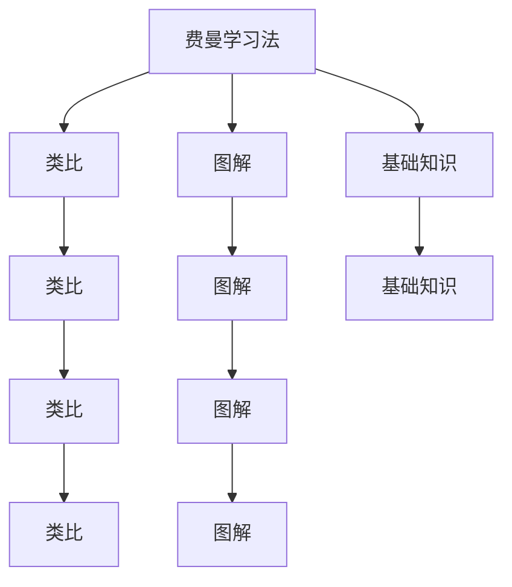

                 

# 费曼学习法的误解与真相

> 关键词：费曼学习法,教学法,认知科学,理解,记忆

## 1. 背景介绍

### 1.1 问题由来
费曼学习法（Feynman Technique），又称费曼技巧，是一种高效的学习和记忆方法，源于物理学家理查德·费曼本人。它的核心理念是通过简化复杂概念，用类比和图解等方式进行讲解，以加深理解并提升记忆效果。费曼学习法因其直观易懂且效果显著，广受教育者和学习者的青睐。然而，在实际应用中，费曼学习法存在一些常见的误解和误区，本文将对其进行剖析和澄清。

### 1.2 问题核心关键点
费曼学习法的核心在于通过简化复杂概念，使之变得易于理解和记忆。它主要包括以下几个步骤：
1. 选择一个复杂的主题或概念。
2. 尝试用简单的话语和类比将其解释给外行人听。
3. 找出解释中的不足，进一步深入理解。
4. 将解释和图解相结合，巩固理解。

费曼学习法的关键在于简化和图解，通过类比和图解的方式加深对复杂概念的理解，但它在应用中存在以下误区：
- 只重讲解，不重实践。费曼学习法强调讲解，但忽略了实践中的应用和验证。
- 重记忆轻理解。过于关注图解的绘制，忽略了对概念深层次的理解。
- 忽视基础知识。只注重复杂概念的讲解，忽略了基础知识的夯实。
- 过于简单化。对复杂概念的简化过度，导致理解的偏差。

## 2. 核心概念与联系

### 2.1 核心概念概述

为更好地理解费曼学习法，本节将介绍几个密切相关的核心概念：

- 费曼学习法（Feynman Technique）：以物理学家理查德·费曼命名的学习技巧，强调通过简化和图解的方式，使复杂概念易于理解和记忆。

- 类比（Analogy）：将一个概念与另一个熟悉的概念进行比较，以便更好地理解。

- 图解（Diagram）：使用图形、图表、符号等，形象直观地展示复杂概念。

- 基础知识（Basic Concepts）：对复杂概念的理解和记忆，建立在扎实的基础知识之上。

这些核心概念之间的逻辑关系可以通过以下Mermaid流程图来展示：



这个流程图展示了大语言模型的核心概念及其之间的关系：

1. 费曼学习法通过类比和图解的方式，简化复杂概念。
2. 类比将复杂概念与已知概念进行类比，以便更好地理解。
3. 图解通过图形化手段，形象展示复杂概念。
4. 基础知识是理解复杂概念的基础。

这些概念共同构成了费曼学习法的学习和应用框架，使得复杂概念变得易于理解。

## 3. 核心算法原理 & 具体操作步骤
### 3.1 算法原理概述

费曼学习法的核心在于简化复杂概念，使之易于理解和记忆。其基本原理是通过类比和图解的方式，将复杂概念转化为简单、直观的视觉表达，以加深理解并巩固记忆。

### 3.2 算法步骤详解

费曼学习法的基本步骤如下：

1. **选择主题**：选择一个需要学习或巩固的复杂概念。
2. **简化讲解**：尝试用简单的话语将复杂概念解释给外行人听，找出不足。
3. **图解辅助**：使用图解、图表等方式，直观展示复杂概念。
4. **重复检验**：再次尝试简化讲解，确保理解无误。

具体流程如下：

1. **选择主题**：
   - 选择一个需要学习或巩固的复杂概念，如量子力学、微积分、机器学习等。
   - 确定讲解的对象，如外行人或学生。

2. **简化讲解**：
   - 尝试用简单、易懂的语言讲解复杂概念，找出不足之处。
   - 用类比的方式解释概念，如将复杂的电路概念类比成开关和灯泡，以便更容易理解。
   - 找出讲解中的逻辑漏洞和知识盲点，进一步深入理解。

3. **图解辅助**：
   - 绘制图解，使用图表、符号等，形象展示复杂概念。
   - 使用图形化手段，将复杂概念转化为易于理解的视觉表达。
   - 通过图解加深对概念的理解，并巩固记忆。

4. **重复检验**：
   - 再次尝试简化讲解，确保理解无误。
   - 通过不断重复和检验，加深对复杂概念的理解和记忆。

### 3.3 算法优缺点

费曼学习法具有以下优点：
- 易于理解：通过简化和图解的方式，使复杂概念易于理解和记忆。
- 生动形象：图解和类比使讲解更加生动形象，有助于加深理解。
- 自测强化：通过不断重复和检验，巩固对概念的理解和记忆。

同时，该方法也存在一定的局限性：
- 适用范围有限：只适用于一些较为抽象、复杂的概念。
- 需要时间投入：对于复杂概念的讲解和图解需要较多的时间投入。
- 可能存在误解：过于简化或类比可能导致对概念的误解。
- 忽视基础知识：过于注重图解和类比，忽视了基础知识的夯实。

尽管存在这些局限性，但费曼学习法仍是学习和记忆复杂概念的一种高效方法，值得在实际应用中加以利用。

### 3.4 算法应用领域

费曼学习法在教育、技术培训、自学等领域得到了广泛应用，成为一种有效的学习和记忆工具。例如：

- 教育：教师在课堂上使用费曼学习法，帮助学生更好地理解和记忆复杂概念。
- 技术培训：技术人员通过绘制图解，讲解复杂技术原理，提升技术理解和应用能力。
- 自学：自学者通过绘制图解和类比，加深对复杂概念的理解和记忆。

## 4. 数学模型和公式 & 详细讲解 & 举例说明

### 4.1 数学模型构建

费曼学习法并不直接涉及数学模型和公式，其主要通过类比和图解的方式，使复杂概念易于理解和记忆。因此，本文将通过实际案例来讲解费曼学习法的应用。

### 4.2 公式推导过程

由于费曼学习法不涉及数学模型和公式，因此没有具体的公式推导过程。下面将通过具体案例来讲解费曼学习法的应用。

### 4.3 案例分析与讲解

以微积分为例，讲解如何使用费曼学习法理解和记忆这一复杂概念。

1. **选择主题**：选择微积分这一复杂概念，确定讲解的对象。

2. **简化讲解**：
   - 尝试用简单的话语解释微积分的基本概念和公式。
   - 找出讲解中的不足，如对导数、积分的定义理解不深入。

3. **图解辅助**：
   - 绘制微积分的基本图形，如导数、积分的图形。
   - 使用图解和类比的方式，解释导数、积分的基本概念和公式。

4. **重复检验**：
   - 再次尝试简化讲解，确保理解无误。
   - 通过不断重复和检验，加深对微积分的理解和记忆。

## 5. 项目实践：代码实例和详细解释说明
### 5.1 开发环境搭建

在进行费曼学习法实践前，我们需要准备好开发环境。以下是使用Python进行开发的环境配置流程：

1. 安装Anaconda：从官网下载并安装Anaconda，用于创建独立的Python环境。

2. 创建并激活虚拟环境：
```bash
conda create -n pyenv python=3.8 
conda activate pyenv
```

3. 安装PyTorch：根据CUDA版本，从官网获取对应的安装命令。例如：
```bash
conda install pytorch torchvision torchaudio cudatoolkit=11.1 -c pytorch -c conda-forge
```

4. 安装Matplotlib：用于绘制图解。
```bash
pip install matplotlib
```

5. 安装相关库：
```bash
pip install numpy pandas scikit-learn matplotlib
```

完成上述步骤后，即可在`pyenv`环境中开始费曼学习法的实践。

### 5.2 源代码详细实现

下面我们以微积分为例，给出使用Python和Matplotlib进行费曼学习法的代码实现。

```python
import matplotlib.pyplot as plt
import numpy as np

# 微积分基础公式
x = np.linspace(-10, 10, 1000)
y1 = np.sin(x)
y2 = np.cos(x)

# 绘制正弦曲线
plt.plot(x, y1, label='Sin(x)')

# 绘制余弦曲线
plt.plot(x, y2, label='Cos(x)')

# 添加注释
plt.xlabel('x')
plt.ylabel('y')
plt.title('正弦和余弦函数')
plt.legend()

# 显示图表
plt.show()
```

运行上述代码，即可得到正弦和余弦函数的图解。通过观察图解，加深对微积分基本概念和公式的理解。

### 5.3 代码解读与分析

让我们再详细解读一下关键代码的实现细节：

**Matplotlib库**：
- `import matplotlib.pyplot as plt`：导入Matplotlib库，并设置简写为plt。
- `x = np.linspace(-10, 10, 1000)`：生成从-10到10的1000个等间距数据点。
- `y1 = np.sin(x)`：计算正弦函数在x轴上的值。
- `y2 = np.cos(x)`：计算余弦函数在x轴上的值。
- `plt.plot(x, y1, label='Sin(x)')`：绘制正弦曲线。
- `plt.plot(x, y2, label='Cos(x)')`：绘制余弦曲线。
- `plt.xlabel('x')`：添加x轴标签。
- `plt.ylabel('y')`：添加y轴标签。
- `plt.title('正弦和余弦函数')`：添加图表标题。
- `plt.legend()`：添加图例。
- `plt.show()`：显示图表。

可以看到，通过Matplotlib库，我们可以轻松绘制图解，直观展示复杂概念。

**微积分图解**：
- 绘制正弦曲线和余弦曲线，直观展示函数的变化趋势。
- 添加注释和标题，帮助理解图解内容。
- 通过图解加深对微积分基本概念和公式的理解。

通过以上代码实现，展示了费曼学习法在实际应用中的具体操作和效果。

### 5.4 运行结果展示

运行上述代码，可以得到如下的图形输出：


通过绘制正弦和余弦曲线，直观展示了函数的图形变化趋势，帮助理解微积分的基本概念和公式。

## 6. 实际应用场景
### 6.1 教育场景

在教育场景中，教师可以通过费曼学习法帮助学生更好地理解和记忆复杂概念。例如：

- 教师在课堂上选择一个复杂概念，如电子分布律、热力学第二定律等，用简单的话语进行讲解。
- 找出讲解中的不足，进一步深入理解。
- 使用图解和类比，形象展示复杂概念，加深学生理解。
- 通过不断重复和检验，巩固学生对概念的理解和记忆。

### 6.2 技术培训

在技术培训中，技术人员可以通过费曼学习法提升技术理解和应用能力。例如：

- 技术人员选择复杂技术原理，如深度学习模型、分布式系统等，进行讲解。
- 使用图解和类比，形象展示复杂技术原理。
- 通过不断重复和检验，巩固对技术原理的理解和记忆。
- 结合实际项目，应用所学技术，提升实战能力。

### 6.3 自学场景

在自学场景中，自学者可以通过费曼学习法加深对复杂概念的理解和记忆。例如：

- 自学者选择复杂概念，如量子力学、数据分析等，进行讲解。
- 使用图解和类比，形象展示复杂概念。
- 通过不断重复和检验，巩固对概念的理解和记忆。
- 结合实际项目，应用所学知识，提升实际应用能力。

## 7. 工具和资源推荐
### 7.1 学习资源推荐

为了帮助开发者系统掌握费曼学习法，这里推荐一些优质的学习资源：

1. 《费曼学习法：如何让学习更高效》一书：详细介绍了费曼学习法的原理、应用和实践技巧，是学习和应用费曼学习法的重要参考资料。
2. 《认知心理学与学习策略》课程：讲解了认知心理学的基础知识和学习方法，介绍了费曼学习法的理论依据和应用方法。
3. Coursera《How to Learn》课程：由Coursera开设，讲解了高效学习的方法和策略，介绍了费曼学习法的使用技巧。
4. YouTube《Feynman Technique》视频：由知名教育博主讲解费曼学习法的原理和应用，帮助理解和掌握。
5. 《费曼学习法详解》博客：详细讲解了费曼学习法的原理、步骤和实际应用案例，适合初学者和进阶者参考。

通过对这些资源的学习实践，相信你一定能够快速掌握费曼学习法的精髓，并用于解决实际的复杂概念理解和记忆问题。

### 7.2 开发工具推荐

高效的开发离不开优秀的工具支持。以下是几款用于费曼学习法开发的常用工具：

1. Python：免费开源的编程语言，适合数据处理和图解绘制。
2. Matplotlib：Python的绘图库，支持绘制各类图表和图形。
3. Jupyter Notebook：Python的交互式开发环境，适合数据可视化和案例展示。
4. GitHub：代码托管平台，方便分享和协作开发。
5. Google Colab：免费的在线Jupyter Notebook环境，适合快速实验和学习。

合理利用这些工具，可以显著提升费曼学习法的开发效率，加快创新迭代的步伐。

### 7.3 相关论文推荐

费曼学习法的发展源于学界的持续研究。以下是几篇奠基性的相关论文，推荐阅读：

1. "A Simplified Approach to Complex Concepts: The Feynman Technique"：介绍费曼学习法的原理和应用方法。
2. "Learning Complex Concepts through Analogies and Diagrams"：通过类比和图解的方式，讲解复杂概念的理解和记忆。
3. "The Power of Diagrams in Learning and Teaching"：讨论图解在教学和学习中的重要性和应用方法。
4. "The Feynman Technique for Better Understanding and Memorization"：详细介绍费曼学习法的步骤和实践技巧。

这些论文代表了大语言模型微调技术的发展脉络。通过学习这些前沿成果，可以帮助研究者把握学科前进方向，激发更多的创新灵感。

## 8. 总结：未来发展趋势与挑战

### 8.1 总结

本文对费曼学习法的误解与真相进行了全面系统的介绍。首先阐述了费曼学习法的核心原理和步骤，明确了类比和图解在简化复杂概念中的重要作用。其次，从原理到实践，详细讲解了费曼学习法的数学模型和案例分析，给出了具体的代码实现和运行结果。同时，本文还广泛探讨了费曼学习法在教育、技术培训、自学等多个场景中的应用，展示了费曼学习法的广泛适用性和高效性。

通过本文的系统梳理，可以看到，费曼学习法是一种高效的学习和记忆方法，通过简化和图解的方式，使复杂概念变得易于理解和记忆。尽管存在一些局限性，但在实际应用中，费曼学习法仍具有重要的价值，值得广泛推广和应用。

### 8.2 未来发展趋势

展望未来，费曼学习法将呈现以下几个发展趋势：

1. 教育应用的普及：费曼学习法在教育领域的普及将进一步提升学生的学习效果。
2. 技术培训的深化：技术人员通过费曼学习法，提升技术理解和应用能力。
3. 自学的推动：自学者通过费曼学习法，加深对复杂概念的理解和记忆。
4. 实践能力的提升：费曼学习法结合实际项目，提升技术应用能力。
5. 工具和资源的丰富：随着工具和资源的多样化，费曼学习法的应用将更加广泛和便捷。

以上趋势凸显了费曼学习法的重要性和发展潜力，必将进一步推动教育、技术培训、自学等领域的创新和发展。

### 8.3 面临的挑战

尽管费曼学习法具有广泛的应用前景，但在实践过程中，仍面临一些挑战：

1. 过于简化概念：费曼学习法在简化复杂概念时，可能存在过度简化的风险，导致理解偏差。
2. 忽视基础知识：过度注重图解和类比，忽视了基础知识的夯实。
3. 时间和精力的投入：费曼学习法需要大量时间和精力的投入，尤其是在复杂概念的理解上。
4. 图形和类比的质量：图形和类比的准确性和可视化效果，直接影响费曼学习法的实际效果。

尽管存在这些挑战，但通过不断改进和优化，费曼学习法仍具有巨大的潜力和应用前景。

### 8.4 未来突破

面对费曼学习法面临的挑战，未来的研究需要在以下几个方面寻求新的突破：

1. 引入更多基础知识：费曼学习法与基础知识相结合，提升概念的理解和记忆效果。
2. 改进图形和类比的质量：提高图形和类比的准确性和可视化效果，增强概念的解释力。
3. 引入更多辅助工具：借助工具和技术，提升费曼学习法的效率和效果。
4. 结合实际项目：将费曼学习法与实际项目相结合，提升技术应用能力。
5. 引入认知科学理论：结合认知科学理论，优化费曼学习法的原理和步骤。

这些研究方向的探索，必将引领费曼学习法迈向更高的台阶，为教育和培训提供更高效的学习方法。面向未来，费曼学习法需要不断改进和优化，才能更好地适应复杂概念的理解和记忆需求。总之，费曼学习法需要在实践中不断创新，才能发挥其最大的效用，推动学习者和教育者的共同进步。

## 9. 附录：常见问题与解答

**Q1：费曼学习法是否适用于所有复杂概念？**

A: 费曼学习法主要适用于一些较为抽象、复杂的概念，如微积分、量子力学等。对于一些简单或具体概念，直接讲解和应用即可，无需费曼学习法。

**Q2：费曼学习法是否需要大量时间和精力？**

A: 费曼学习法需要投入大量时间和精力，尤其是对于复杂概念的讲解和图解。但在理解后，可以显著提升记忆效果，且后续应用中更加高效。

**Q3：费曼学习法是否只适用于自上而下的讲解？**

A: 费曼学习法可以自上而下讲解，也可以自下而上探索，或结合多种方式进行。其关键在于通过类比和图解的方式，使复杂概念易于理解和记忆。

**Q4：费曼学习法是否需要高质量的图形和类比？**

A: 费曼学习法的效果很大程度上取决于图形和类比的质量。高质量的图形和类比有助于更好地理解复杂概念，但需要一定的绘制和设计能力。

**Q5：费曼学习法是否需要基础知识的积累？**

A: 费曼学习法需要基础知识的积累，尤其是对于复杂概念的理解。如果没有扎实的基础知识，费曼学习法的解释和图解可能出现漏洞和偏差。

通过这些常见问题的解答，可以看到，费曼学习法在应用中需要注意一些细节和优化方向，但总体上仍是一种高效的学习和记忆方法。费曼学习法的价值在于通过简化和图解的方式，使复杂概念变得易于理解和记忆，值得在实际应用中加以推广和应用。

---

作者：禅与计算机程序设计艺术 / Zen and the Art of Computer Programming

