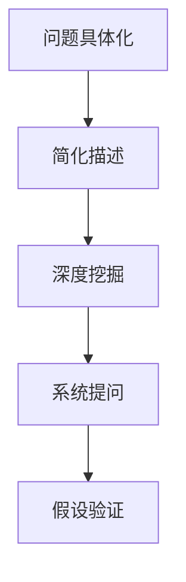

                 

# 费曼提问:唤醒管理者主动思考

## 1. 背景介绍

### 1.1 问题由来
现代管理中的挑战日益增多，领导者需要不断提升自身的思考能力以应对各种复杂问题。费曼（Richard Feynman）提出的提问方法，以其简单、直接、高效的特性，成为了提升思考力和创新能力的有效工具。费曼提问方法不仅适用于科研工作，同样也能被应用于管理工作之中，通过系统性的提问来挖掘问题的本质，激发思考深度，推动创新和决策过程。

### 1.2 问题核心关键点
费曼提问方法的核心在于通过提问的方式，帮助管理者打破思维定势，深入挖掘问题的核心，发现未知的未知，从而驱动有效的决策和行动。其基本流程包括：

1. **明确问题**：将问题具体化，确保理解问题的全貌。
2. **简单描述**：用简洁的语言重新描述问题，确保理解的准确性。
3. **挖掘层次**：从不同层面、维度深入挖掘问题。
4. **寻找答案**：通过系统性的提问，逐步逼近问题的答案。
5. **验证假设**：对提出的假设进行验证和修正，确保结论的可靠性和实用性。

### 1.3 问题研究意义
费曼提问方法不仅能帮助管理者更好地理解问题，还能提升团队的思考力，促进组织创新和变革。通过系统的提问和深度思考，管理者可以更全面地把握问题的本质，做出更准确的决策，提升组织的竞争力和创新能力。此外，费曼提问方法还能帮助团队成员提升自身思考能力，形成更加系统化、结构化的思维模式。

## 2. 核心概念与联系

### 2.1 核心概念概述
费曼提问方法的核心概念主要包括：

- **问题具体化**：将模糊的问题具体化，明确问题的边界和核心。
- **简化描述**：将复杂的问题简化，用简洁的语言重新描述，便于理解和沟通。
- **深度挖掘**：从多个层次和维度深入挖掘问题的本质，发现潜在的假设和未知。
- **系统提问**：通过系统化的提问方式，逐步逼近问题的答案，确保思考的全面性和深度。
- **假设验证**：对提出的假设进行验证和修正，确保结论的可靠性和实用性。

这些概念之间存在着紧密的联系。通过问题具体化和简化描述，管理者可以更好地把握问题的全貌，而深度挖掘和系统提问则帮助从不同角度深入理解问题，最终通过假设验证确保解决方案的有效性和实用性。

### 2.2 核心概念原理和架构的 Mermaid 流程图


该流程图展示了费曼提问方法的基本流程。从问题具体化开始，逐步简化描述、深度挖掘、系统提问，最终通过假设验证得出结论，形成解决方案。

## 3. 核心算法原理 & 具体操作步骤
### 3.1 算法原理概述
费曼提问方法的核心算法原理是通过系统性的提问和深度思考，逐步逼近问题的本质和解决方案。其核心在于将复杂问题分解为可操作的小问题，通过逐层深入的提问和验证，确保思考的全面性和深度。

### 3.2 算法步骤详解
#### 步骤1: 问题具体化
将问题具体化，明确问题的边界和核心。例如，对于“如何提升公司的市场份额”这一问题，可以进行如下具体化：

1. 市场份额的现状是什么？
2. 影响市场份额的主要因素有哪些？
3. 与竞争对手相比，我们的优势和劣势是什么？
4. 市场份额提升的关键指标是什么？

#### 步骤2: 简化描述
将问题简化，用简洁的语言重新描述。例如，针对“如何提升公司的市场份额”这一问题，简化描述可以如下：

1. 公司当前的市场份额是多少？
2. 影响市场份额的主要竞争因素是什么？
3. 我们的优势和劣势分别是什么？
4. 提升市场份额的关键策略有哪些？

#### 步骤3: 深度挖掘
从多个层次和维度深入挖掘问题，发现潜在的假设和未知。例如，针对“如何提升公司的市场份额”这一问题，可以从以下层次进行深度挖掘：

1. 市场层面的竞争态势分析
2. 产品层面的性能和创新
3. 销售层面的渠道和策略
4. 品牌层面的认知和影响力

#### 步骤4: 系统提问
通过系统化的提问方式，逐步逼近问题的答案。例如，针对“如何提升公司的市场份额”这一问题，可以设计以下系统化的提问：

1. 当前市场份额的现状如何？
2. 竞争对手的主要市场策略是什么？
3. 产品性能和创新如何满足市场需求？
4. 渠道和销售策略的实施效果如何？
5. 品牌认知度和市场影响力如何？

#### 步骤5: 假设验证
对提出的假设进行验证和修正，确保结论的可靠性和实用性。例如，针对“如何提升公司的市场份额”这一问题，可以进行以下假设验证：

1. 通过市场调研，确定主要竞争者的市场策略
2. 通过产品创新和优化，提升产品性能和竞争力
3. 通过渠道和销售策略的调整，提升市场覆盖和渗透率
4. 通过品牌建设和市场营销，提升品牌认知度和市场影响力

### 3.3 算法优缺点
费曼提问方法的优点在于其简单、直接、高效的特点，能够帮助管理者打破思维定势，深入挖掘问题的本质，发现未知的未知。此外，系统化的提问方式能够确保思考的全面性和深度，促进有效的决策和行动。

其缺点在于需要管理者具备较强的思考能力和系统化思维，否则可能无法有效执行。此外，费曼提问方法可能需要较长的时间和资源投入，特别是在复杂问题上。

### 3.4 算法应用领域
费曼提问方法可以应用于各种管理场景，特别是在以下领域：

1. **战略规划**：帮助管理者制定和调整公司战略，明确目标和关键步骤。
2. **问题解决**：帮助管理者应对复杂问题，通过系统化的提问逐步逼近解决方案。
3. **团队协作**：促进团队成员之间的深度思考和信息共享，提升团队的创新力和执行力。
4. **项目管理**：帮助项目经理制定和优化项目计划，确保项目按时按质完成。
5. **风险管理**：通过深入挖掘和系统提问，识别潜在风险，制定有效的风险应对策略。

## 4. 数学模型和公式 & 详细讲解 & 举例说明
### 4.1 数学模型构建
费曼提问方法不涉及复杂的数学模型，其核心在于通过系统化的提问和深度思考，逐步逼近问题的本质和解决方案。因此，以下以一个简单的管理问题为例，展示如何通过费曼提问方法进行思考。

**问题**：如何提升公司的市场份额？

**简化描述**：公司当前的市场份额是多少？影响市场份额的主要竞争因素是什么？我们的优势和劣势分别是什么？提升市场份额的关键策略有哪些？

### 4.2 公式推导过程
费曼提问方法的核心在于通过系统性的提问和深度思考，逐步逼近问题的本质和解决方案。其推导过程如下：

1. **明确问题**：将问题具体化，明确问题的边界和核心。例如，“如何提升公司的市场份额”。
2. **简化描述**：将问题简化，用简洁的语言重新描述。例如，“公司当前的市场份额是多少？”“影响市场份额的主要竞争因素是什么？”
3. **深度挖掘**：从多个层次和维度深入挖掘问题。例如，“市场层面的竞争态势分析”“产品层面的性能和创新”“销售层面的渠道和策略”“品牌层面的认知和影响力”。
4. **系统提问**：通过系统化的提问方式，逐步逼近问题的答案。例如，“当前市场份额的现状如何？”“竞争对手的主要市场策略是什么？”“产品性能和创新如何满足市场需求？”
5. **假设验证**：对提出的假设进行验证和修正，确保结论的可靠性和实用性。例如，“通过市场调研，确定主要竞争者的市场策略”“通过产品创新和优化，提升产品性能和竞争力”“通过渠道和销售策略的调整，提升市场覆盖和渗透率”。

### 4.3 案例分析与讲解
以下以一个实际的案例，展示如何使用费曼提问方法解决问题：

**案例背景**：某公司是一家科技初创企业，面临市场份额下降的问题。

**问题描述**：公司市场份额下降的原因是什么？如何提升市场份额？

**问题具体化**：

1. 公司当前的市场份额是多少？
2. 市场份额下降的主要原因是什么？
3. 与竞争对手相比，我们的优势和劣势是什么？
4. 市场份额提升的关键指标是什么？

**简化描述**：

1. 公司当前的市场份额是多少？
2. 市场份额下降的主要原因是什么？
3. 我们的优势和劣势分别是什么？
4. 提升市场份额的关键策略有哪些？

**深度挖掘**：

1. 市场层面的竞争态势分析
2. 产品层面的性能和创新
3. 销售层面的渠道和策略
4. 品牌层面的认知和影响力

**系统提问**：

1. 当前市场份额的现状如何？
2. 竞争对手的主要市场策略是什么？
3. 产品性能和创新如何满足市场需求？
4. 渠道和销售策略的实施效果如何？
5. 品牌认知度和市场影响力如何？

**假设验证**：

1. 通过市场调研，确定主要竞争者的市场策略
2. 通过产品创新和优化，提升产品性能和竞争力
3. 通过渠道和销售策略的调整，提升市场覆盖和渗透率
4. 通过品牌建设和市场营销，提升品牌认知度和市场影响力

通过以上步骤，可以逐步逼近问题的本质，找到提升市场份额的有效策略。

## 5. 项目实践：代码实例和详细解释说明
### 5.1 开发环境搭建
费曼提问方法不需要复杂的代码实现，主要依赖于思考和沟通。因此，开发环境搭建主要涉及工具和资源的选择和准备。以下是一些推荐的工具和资源：

1. **文本编辑器**：如Sublime Text、Atom等，用于记录和整理提问和思考过程。
2. **思维导图工具**：如MindManager、XMind等，用于系统化整理和展示问题的各个层次和维度。
3. **协作平台**：如Trello、Asana等，用于团队成员之间的沟通和协作。
4. **项目管理工具**：如JIRA、Trello等，用于跟踪问题的进展和解决方案的实施。

### 5.2 源代码详细实现
费曼提问方法不需要复杂的代码实现，主要依赖于思考和沟通。因此，以下以一个简单的项目管理工具为例，展示如何使用费曼提问方法进行项目管理。

**项目背景**：开发一个新的软件系统，提升公司的市场份额。

**问题描述**：如何提升软件系统的市场份额？

**问题具体化**：

1. 项目当前的市场份额是多少？
2. 市场份额下降的主要原因是什么？
3. 与竞争对手相比，我们的优势和劣势是什么？
4. 市场份额提升的关键指标是什么？

**简化描述**：

1. 项目当前的市场份额是多少？
2. 市场份额下降的主要原因是什么？
3. 我们的优势和劣势分别是什么？
4. 提升市场份额的关键策略有哪些？

**深度挖掘**：

1. 市场层面的竞争态势分析
2. 产品层面的性能和创新
3. 销售层面的渠道和策略
4. 品牌层面的认知和影响力

**系统提问**：

1. 当前市场份额的现状如何？
2. 竞争对手的主要市场策略是什么？
3. 产品性能和创新如何满足市场需求？
4. 渠道和销售策略的实施效果如何？
5. 品牌认知度和市场影响力如何？

**假设验证**：

1. 通过市场调研，确定主要竞争者的市场策略
2. 通过产品创新和优化，提升产品性能和竞争力
3. 通过渠道和销售策略的调整，提升市场覆盖和渗透率
4. 通过品牌建设和市场营销，提升品牌认知度和市场影响力

### 5.3 代码解读与分析
费曼提问方法不需要复杂的代码实现，主要依赖于思考和沟通。以下以一个简单的项目管理工具为例，展示如何使用费曼提问方法进行项目管理。

**代码实现**：

```python
# 定义问题的各个层次和维度
market_analysis = "市场层面的竞争态势分析"
product_innovation = "产品层面的性能和创新"
sales_channel = "销售层面的渠道和策略"
brand_perception = "品牌层面的认知和影响力"

# 定义系统提问和假设验证
market_status = "当前市场份额的现状如何？"
competitor_strategy = "竞争对手的主要市场策略是什么？"
product_performance = "产品性能和创新如何满足市场需求？"
sales_strategy = "渠道和销售策略的实施效果如何？"
brand_influence = "品牌认知度和市场影响力如何？"

# 输出问题的各个层次和维度，以及系统提问和假设验证
print("市场层面的竞争态势分析: " + market_analysis)
print("产品层面的性能和创新: " + product_innovation)
print("销售层面的渠道和策略: " + sales_channel)
print("品牌层面的认知和影响力: " + brand_perception)

print("当前市场份额的现状如何？" + market_status)
print("竞争对手的主要市场策略是什么？" + competitor_strategy)
print("产品性能和创新如何满足市场需求？" + product_performance)
print("渠道和销售策略的实施效果如何？" + sales_strategy)
print("品牌认知度和市场影响力如何？" + brand_influence)
```

### 5.4 运行结果展示
通过以上代码，可以清晰地展示问题的各个层次和维度，以及系统提问和假设验证的内容。例如：

```
市场层面的竞争态势分析: 市场层面的竞争态势分析
产品层面的性能和创新: 产品层面的性能和创新
销售层面的渠道和策略: 销售层面的渠道和策略
品牌层面的认知和影响力: 品牌层面的认知和影响力

当前市场份额的现状如何？当前市场份额的现状如何？
竞争对手的主要市场策略是什么？竞争对手的主要市场策略是什么？
产品性能和创新如何满足市场需求？产品性能和创新如何满足市场需求？
渠道和销售策略的实施效果如何？渠道和销售策略的实施效果如何？
品牌认知度和市场影响力如何？品牌认知度和市场影响力如何？
```

通过系统化的提问和假设验证，逐步逼近问题的本质和解决方案，从而提升项目的成功概率。

## 6. 实际应用场景
费曼提问方法可以应用于各种管理场景，特别是在以下领域：

### 6.1 战略规划
帮助管理者制定和调整公司战略，明确目标和关键步骤。

**应用场景**：某公司需要制定未来五年的战略规划。

**费曼提问**：

1. 公司当前的市场份额和收入是多少？
2. 影响公司增长的主要因素是什么？
3. 我们的优势和劣势分别是什么？
4. 公司增长的主要指标有哪些？

**实际应用**：通过系统化的提问，逐步挖掘关键问题和潜在机会，制定明确的战略规划，提升公司的竞争力和市场份额。

### 6.2 问题解决
帮助管理者应对复杂问题，通过系统化的提问逐步逼近解决方案。

**应用场景**：某公司需要解决生产线效率低下的问题。

**费曼提问**：

1. 当前的生产线效率是多少？
2. 生产线效率低下的主要原因是什么？
3. 生产线上的瓶颈是什么？
4. 提升效率的关键策略有哪些？

**实际应用**：通过系统化的提问，逐步识别问题本质，制定有效的改进措施，提升生产线效率。

### 6.3 团队协作
促进团队成员之间的深度思考和信息共享，提升团队的创新力和执行力。

**应用场景**：某公司的跨部门项目需要协同合作，制定统一的执行计划。

**费曼提问**：

1. 当前项目的进展如何？
2. 项目面临的主要挑战是什么？
3. 各部门的资源和能力如何？
4. 项目成功的关键因素有哪些？

**实际应用**：通过系统化的提问，促进团队成员之间的深度思考和信息共享，提升团队的协同效率和执行力。

### 6.4 项目管理
帮助项目经理制定和优化项目计划，确保项目按时按质完成。

**应用场景**：某公司的软件开发项目面临进度延误的问题。

**费曼提问**：

1. 当前项目的进度和质量如何？
2. 进度延误的主要原因是什么？
3. 项目管理的瓶颈是什么？
4. 提升项目进度和质量的关键策略有哪些？

**实际应用**：通过系统化的提问，逐步识别项目管理的瓶颈和问题，制定有效的改进措施，确保项目按时按质完成。

### 6.5 风险管理
通过深入挖掘和系统提问，识别潜在风险，制定有效的风险应对策略。

**应用场景**：某公司的金融投资项目面临市场波动风险。

**费曼提问**：

1. 当前市场的波动情况如何？
2. 市场波动的主要原因是什么？
3. 投资组合的抗风险能力如何？
4. 应对市场波动的关键策略有哪些？

**实际应用**：通过系统化的提问，逐步识别风险和潜在问题，制定有效的风险应对策略，降低投资风险。

## 7. 工具和资源推荐
### 7.1 学习资源推荐
为了帮助管理者系统掌握费曼提问方法，以下是一些优质的学习资源：

1. **《费曼学习法》系列博文**：由费曼学习法专家撰写，深入浅出地介绍了费曼学习法的核心思想和方法，适用于科研和管理工作。

2. **《系统思考》课程**：哈佛商学院开设的在线课程，系统介绍了系统思考的方法和应用，适用于管理者提升思考力和决策能力。

3. **《如何提问》书籍**：由杰出的英语教师Walter Weinkelmann编写，详细介绍了提问技巧和方法，适用于提高沟通和思考能力。

4. **TED Talks**：搜寻关于费曼学习法和提问技巧的演讲视频，通过观摩和学习，深入理解费曼提问方法。

5. **知乎专栏**：关注知乎上的费曼学习法专栏，获取大量实用的费曼提问方法和案例分析。

通过对这些资源的学习实践，相信你一定能够快速掌握费曼提问方法的精髓，并用于解决实际的NLP问题。

### 7.2 开发工具推荐
费曼提问方法不需要复杂的代码实现，主要依赖于思考和沟通。以下是一些推荐的工具和资源：

1. **文本编辑器**：如Sublime Text、Atom等，用于记录和整理提问和思考过程。
2. **思维导图工具**：如MindManager、XMind等，用于系统化整理和展示问题的各个层次和维度。
3. **协作平台**：如Trello、Asana等，用于团队成员之间的沟通和协作。
4. **项目管理工具**：如JIRA、Trello等，用于跟踪问题的进展和解决方案的实施。

### 7.3 相关论文推荐
费曼提问方法的研究主要集中于提升思考力和决策能力，以下是几篇具有代表性的论文，推荐阅读：

1. **《如何思考》论文**：由费曼学习法专家Walter Weinkelmann撰写，详细介绍了费曼学习法的核心思想和方法，适用于科研和管理工作。

2. **《系统思考的哲学基础》论文**：由系统思考专家Peter Senge撰写，探讨了系统思考的哲学基础和方法，适用于管理者提升思考力和决策能力。

3. **《提问的艺术》论文**：由心理学专家和教育专家撰写，详细介绍了提问技巧和方法，适用于提高沟通和思考能力。

4. **《思考的艺术》论文**：由思维学家和心理学家撰写，深入探讨了思维的艺术和方法，适用于提高思考力和创造力。

这些论文代表了大语言模型微调技术的发展脉络。通过学习这些前沿成果，可以帮助研究者把握学科前进方向，激发更多的创新灵感。

## 8. 总结：未来发展趋势与挑战
### 8.1 总结
费曼提问方法通过系统化的提问和深度思考，逐步逼近问题的本质和解决方案，具有简单、直接、高效的特点，广泛应用于科研和管理领域。其核心在于将复杂问题分解为可操作的小问题，通过逐层深入的提问和验证，确保思考的全面性和深度，推动有效的决策和行动。

### 8.2 未来发展趋势
费曼提问方法的未来发展趋势主要包括以下几个方面：

1. **应用场景多样化**：随着管理领域的不断扩展，费曼提问方法将在更多领域得到应用，如教育、医疗、政府等。

2. **工具和资源智能化**：结合AI技术和大数据分析，开发智能化的费曼提问工具，提升问题的发现和解决效率。

3. **知识图谱和信息整合**：将符号化的先验知识，如知识图谱、逻辑规则等，与费曼提问方法进行融合，增强模型的系统性和全面性。

4. **多模态数据融合**：结合视觉、语音、文本等多模态数据，提升问题的分析和解决能力。

5. **在线平台和社区化**：构建在线费曼提问平台和社区，促进知识的共享和交流，加速问题的解决。

### 8.3 面临的挑战
费曼提问方法在应用过程中，仍面临以下挑战：

1. **问题定义的准确性**：管理者需要具备较强的思考能力和问题定义能力，否则可能无法准确定义问题。

2. **系统提问的复杂性**：对于复杂问题，系统提问可能需要较长的时间和资源投入。

3. **假设验证的可靠性**：假设验证需要大量数据和分析，可能需要较长时间才能验证假设的有效性。

4. **团队协作的难度**：费曼提问方法需要团队成员之间的深度思考和协作，需要较高的沟通和协作能力。

5. **实施效果的不确定性**：费曼提问方法虽然系统性较强，但最终的效果仍需通过实践验证。

### 8.4 研究展望
费曼提问方法的研究方向主要包括以下几个方面：

1. **系统化问题定义**：进一步研究如何系统化定义问题，提升问题定义的准确性和全面性。

2. **智能工具和算法**：结合AI技术和大数据分析，开发智能化的费曼提问工具和算法，提升问题的发现和解决效率。

3. **多模态数据融合**：结合视觉、语音、文本等多模态数据，提升问题的分析和解决能力。

4. **知识图谱和信息整合**：将符号化的先验知识，如知识图谱、逻辑规则等，与费曼提问方法进行融合，增强模型的系统性和全面性。

5. **在线平台和社区化**：构建在线费曼提问平台和社区，促进知识的共享和交流，加速问题的解决。

总之，费曼提问方法作为一种有效的思维工具，其研究和应用将不断拓展和深化，帮助管理者提升思考力和决策能力，推动组织的创新和变革。

## 9. 附录：常见问题与解答

**Q1：费曼提问方法适用于所有管理问题吗？**

A: 费曼提问方法适用于大多数管理问题，特别是需要系统化思考和深入挖掘的问题。但对于一些简单明确的问题，可能不需要使用费曼提问方法。

**Q2：费曼提问方法如何使用？**

A: 费曼提问方法主要通过系统化的提问和深度思考，逐步逼近问题的本质和解决方案。具体步骤如下：
1. 明确问题
2. 简化描述
3. 深度挖掘
4. 系统提问
5. 假设验证

**Q3：费曼提问方法是否有局限性？**

A: 费曼提问方法的主要局限在于需要管理者具备较强的思考能力和系统化思维，否则可能无法有效执行。此外，系统提问和假设验证需要大量时间和资源，特别是在复杂问题上。

**Q4：费曼提问方法如何与其他方法结合使用？**

A: 费曼提问方法可以与其他问题解决方法结合使用，如SWOT分析、PEST分析等。通过综合运用多种方法，可以更全面地分析和解决问题。

**Q5：费曼提问方法在实际应用中需要注意哪些问题？**

A: 在实际应用中，需要注意以下几点：
1. 问题定义的准确性
2. 系统提问的复杂性
3. 假设验证的可靠性
4. 团队协作的难度
5. 实施效果的不确定性

通过合理利用费曼提问方法，可以提升管理者的思考力和决策能力，推动组织的创新和变革。希望本文能为读者提供有价值的参考和启发。

---

作者：禅与计算机程序设计艺术 / Zen and the Art of Computer Programming

