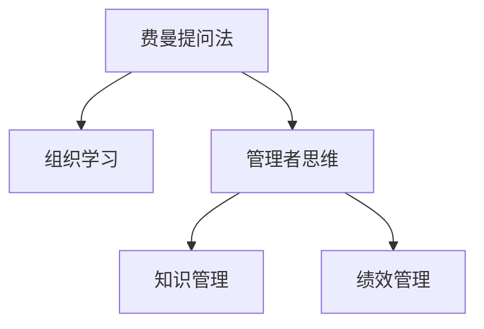

                 

# 费曼提问法:开启管理者思维升级

## 1. 背景介绍

### 1.1 问题由来

费曼提问法（Feynman Technique），一种由诺贝尔奖得主理查德·费曼（Richard Feynman）提出并广泛应用于科学学习和研究的方法，核心在于通过自问自答的方式，以深入理解复杂概念。近年来，费曼提问法开始被引入企业管理和团队协作中，作为推动组织学习和提升管理效能的一种重要工具。

然而，尽管费曼提问法在知识传授和科学探究中表现优异，但在实际操作中，管理者往往面临具体问题，如组织变革、绩效管理、团队协作等。如何将费曼提问法的精髓应用到管理实践中，成为当前热点话题。

### 1.2 问题核心关键点

费曼提问法的核心在于深入提问和回答，这与组织学习和知识分享密切相关。但如何将费曼提问法应用到管理实践，尤其是提升管理者的思维能力和决策质量，是问题研究的焦点。

管理者思维能力的提升，意味着其能够更高效地理解组织情况、制定策略、沟通协调，从而推动团队和组织向更好的方向发展。费曼提问法为此提供了一种结构化的思维方式，通过不断自问自答，促使管理者深化对问题的理解，拓展思维视角，提升管理效能。

## 2. 核心概念与联系

### 2.1 核心概念概述

为更好地理解费曼提问法在管理中的应用，本节将介绍几个关键概念：

- 费曼提问法（Feynman Technique）：一种以深入提问和回答为核心的学习方法，通过将复杂问题简化，不断追问原因和机制，从而深化理解和记忆。
- 组织学习（Organizational Learning）：指通过团队交流、知识共享、反思总结等方式，持续改进组织知识和行为，提升组织绩效的过程。
- 管理者思维（Managerial Thinking）：管理者在面对复杂管理问题时，所展现的思维模式和决策方式。
- 知识管理（Knowledge Management）：通过记录、共享和应用组织知识，提高组织效能和创新能力的实践活动。
- 绩效管理（Performance Management）：通过设定目标、评估绩效、反馈调整等手段，提升员工和组织绩效的管理活动。

这些核心概念之间的逻辑关系可以通过以下Mermaid流程图来展示：



这个流程图展示了几组关键概念之间的联系：

1. 费曼提问法通过深入提问和回答，促进了知识的记录和共享，支持组织学习。
2. 管理者思维能力的提升，有助于其更有效率地进行组织学习和知识管理。
3. 绩效管理通过目标设定和反馈调整，提升组织知识的应用效率，影响知识管理效果。

这些概念共同构成了费曼提问法在管理中的基本框架，推动管理者通过不断自问自答，提升组织整体的知识和绩效水平。

## 3. 核心算法原理 & 具体操作步骤
### 3.1 算法原理概述

费曼提问法的管理应用，本质上是将深度提问和反思应用于管理实践的过程。其核心原理包括以下几点：

1. **深入提问**：通过逐步深入提问，识别问题的本质和影响因素。
2. **反向解答**：从最终目标出发，逆向思考如何解决问题。
3. **知识共享**：将问题及其解答分享给团队成员，促进知识的记录和传承。
4. **实践反思**：在实际应用中，反思提问和解答的有效性，不断改进。

这些原理在管理实践中主要体现为：

- **组织问题诊断**：通过深入提问，识别组织面临的关键问题。
- **战略规划**：逆向思考如何制定有效的战略和决策。
- **团队协作**：分享问题及其解答，促进团队协作和知识共享。
- **绩效评估**：通过反思和调整，提升绩效管理的效果。

### 3.2 算法步骤详解

基于费曼提问法的管理应用，一般包括以下几个关键步骤：

**Step 1: 准备问题**
- 定义组织或团队面临的关键问题，如目标不明确、团队协作不足等。
- 将问题转化为一系列深入的问题，逐步拆解其本质和影响因素。

**Step 2: 反向解答**
- 从问题解决的最终目标出发，逆向思考需要采取的措施。
- 设计解决方案，详细规划其实施步骤和预期效果。

**Step 3: 知识共享**
- 将问题及其解答分享给团队成员，开展讨论和反思。
- 记录和整理问题的解答，形成知识库，便于后期参考和复用。

**Step 4: 实践反思**
- 在实际应用中，持续跟踪问题的解决效果，进行反思总结。
- 根据反思结果，进一步优化问题解答，不断改进管理实践。

### 3.3 算法优缺点

费曼提问法的管理应用，具有以下优点：

1. **促进知识共享**：通过提问和解答的分享，促进团队成员之间的知识传递和学习。
2. **提升决策质量**：通过深入提问和逆向思考，有助于管理者制定更科学合理的决策。
3. **增强团队协作**：通过问题讨论和知识共享，增强团队的凝聚力和合作效率。
4. **提升绩效管理**：通过问题诊断和解决方案的反思总结，提升绩效管理的精准性和效果。

同时，该方法也存在一定局限：

1. **时间成本高**：深入提问和解答的过程较为耗时，可能影响日常工作节奏。
2. **依赖个人能力**：问题诊断和解答的效果依赖于管理者的个人能力和经验。
3. **实施难度大**：在实际应用中，组织文化和管理习惯可能影响费曼提问法的落地效果。

尽管存在这些局限，但就目前而言，费曼提问法仍是一种有效的管理思维提升工具，值得在实际管理中推广和应用。

### 3.4 算法应用领域

费曼提问法在管理中的应用，主要涵盖以下几个领域：

- **组织变革**：通过深入提问，识别变革中的关键问题和阻力，制定合理的变革策略。
- **绩效管理**：通过提问和解答，提升目标设定、评估和反馈的准确性和有效性。
- **团队协作**：通过问题讨论和知识共享，促进团队成员之间的沟通和协作。
- **知识管理**：通过问题及其解答的记录和传承，形成组织的知识库，提升组织创新能力。
- **战略规划**：通过逆向思考和解决方案的设计，支持组织制定科学合理的战略规划。

这些领域的应用，展示了费曼提问法在提升组织效能和团队协作中的巨大潜力。

## 4. 数学模型和公式 & 详细讲解 & 举例说明

### 4.1 数学模型构建

费曼提问法在数学建模中，通常用于知识图谱和认知模型等领域，用于描述知识的结构和认知过程。在此，我们简化模型，仅用数学公式表达费曼提问法的基本原理。

设 $Q$ 表示管理问题，$A$ 表示问题的解答。费曼提问法的数学模型可以表示为：

$$
A = \text{Answer}(Q)
$$

其中 $Q$ 是问题的形式化表达，$A$ 是问题的解答，即通过深入提问和逆向思考得出的解决方案。

### 4.2 公式推导过程

我们以一个简单的组织变革问题为例，展示费曼提问法的数学推导过程。假设组织面临“员工流失率过高”的问题。通过费曼提问法，逐步深入问题的本质和影响因素，可以得到以下问题链：

1. 当前员工流失率是多少？
2. 员工流失的主要原因是什么？
3. 这些原因中，哪些是组织层面可以控制和改善的？
4. 需要采取哪些具体措施来改善这些问题？
5. 这些措施的实施效果如何？是否达到了预期目标？

通过以上问题的逐步解答，可以形成一个详细的解决方案 $A$，即“制定员工满意度调查，优化员工福利，改进职业发展路径，并持续跟踪效果”。

### 4.3 案例分析与讲解

一个典型的案例是某互联网公司的员工流失率问题。公司通过费曼提问法，逐步深入探讨，最终得出以下解答：

**问题1**：当前员工流失率是多少？
- 解答：过去一年中，公司总员工数和离职员工数为XX，流失率为XX%。

**问题2**：员工流失的主要原因是什么？
- 解答：员工流失的主要原因包括工作压力大、薪酬不满意、晋升机会少等。

**问题3**：这些原因中，哪些是组织层面可以控制和改善的？
- 解答：工作压力可以通过调整工作量、引入弹性工作机制等改善；薪酬不满意可以通过市场对标、提高福利待遇等改善。

**问题4**：需要采取哪些具体措施来改善这些问题？
- 解答：制定员工满意度调查，优化薪酬体系，引入弹性工作机制，提供职业发展培训。

**问题5**：这些措施的实施效果如何？是否达到了预期目标？
- 解答：通过满意度调查，发现员工对工作压力和薪酬满意度的评价明显提升；通过职业发展培训，员工晋升机会明显增加，流失率下降了XX%。

以上案例展示了费曼提问法在管理问题诊断和解决方案制定中的强大作用。

## 5. 项目实践：代码实例和详细解释说明

### 5.1 开发环境搭建

在进行费曼提问法的实践前，我们需要准备好开发环境。以下是使用Python进行项目开发的步骤：

1. 安装Python：从官网下载并安装Python，确保版本在3.7及以上。
2. 安装PyCharm：下载并安装PyCharm IDE，方便代码编辑和调试。
3. 安装必要的第三方库：
   - 安装requests库，用于发送API请求
   - 安装flask库，用于搭建Web服务

完成上述步骤后，即可在PyCharm环境中开始费曼提问法的实践。

### 5.2 源代码详细实现

以下是一个简单的费曼提问法实践项目，用于管理一个虚构的在线零售公司的员工流失问题：

```python
from flask import Flask, request, jsonify

app = Flask(__name__)

# 模拟员工流失问题
employee流失问题 = [
    "当前员工流失率是多少？",
    "员工流失的主要原因是什么？",
    "这些原因中，哪些是组织层面可以控制和改善的？",
    "需要采取哪些具体措施来改善这些问题？",
    "这些措施的实施效果如何？是否达到了预期目标？"
]

# 定义问题解答
def 解答问题(问题):
    if 问题 == employee流失问题[0]:
        return "过去一年中，公司总员工数和离职员工数为XX，流失率为XX%。"
    elif 问题 == employee流失问题[1]:
        return "员工流失的主要原因包括工作压力大、薪酬不满意、晋升机会少等。"
    elif 问题 == employee流失问题[2]:
        return "工作压力可以通过调整工作量、引入弹性工作机制等改善；薪酬不满意可以通过市场对标、提高福利待遇等改善。"
    elif 问题 == employee流失问题[3]:
        return "制定员工满意度调查，优化薪酬体系，引入弹性工作机制，提供职业发展培训。"
    elif 问题 == employee流失问题[4]:
        return "通过满意度调查，发现员工对工作压力和薪酬满意度的评价明显提升；通过职业发展培训，员工晋升机会明显增加，流失率下降了XX%。"

# 定义API接口
@app.route('/feynman', methods=['POST'])
def feynman_api():
    # 从请求中获取问题
    问题 = request.json['question']
    解答 = 解答问题(问题)
    return jsonify({'解答':解答})

if __name__ == '__main__':
    app.run(debug=True)
```

### 5.3 代码解读与分析

让我们再详细解读一下关键代码的实现细节：

**employee流失问题列表**：
- 定义了费曼提问法中的问题，包括从问题1到问题5。

**解答问题函数**：
- 根据传入的问题，返回对应的解答。
- 使用if-elif语句结构，逐步匹配并返回问题解答。

**API接口**：
- 通过Flask框架，定义了一个POST请求的API接口。
- 从请求中获取问题，调用解答问题函数，返回解答结果。
- 使用jsonify函数将解答结果以JSON格式返回。

**运行脚本**：
- 启动Python脚本，启动Flask服务，监听本地的5000端口。
- 通过发送POST请求，可以获取对应问题的解答。

通过以上代码，我们可以看到费曼提问法的实现过程，即通过API接口接收问题，并返回相应的解答。这种实现方式灵活，可以应用于各种管理问题的解答。

### 5.4 运行结果展示

在实际应用中，可以通过调用API接口，获取对应问题的解答。例如，通过以下curl命令：

```bash
curl -X POST -H "Content-Type: application/json" -d '{"question": "当前员工流失率是多少？"}' http://localhost:5000/feynman
```

可以获取到问题1的解答。

## 6. 实际应用场景

### 6.1 组织变革

费曼提问法在组织变革中的应用，主要体现在对变革过程的深入诊断和规划。通过逐步深入提问，识别变革中的关键问题和障碍，制定科学的变革策略。例如，某公司面临组织结构调整问题，通过费曼提问法，逐步深入探索，最终得出以下解答：

**问题1**：组织结构调整的目标是什么？
- 解答：调整后的组织结构应更适应市场变化，提升运营效率。

**问题2**：当前组织结构的主要问题是什么？
- 解答：层级过多、职责重叠、信息传递不畅等。

**问题3**：这些问题的根本原因是什么？
- 解答：管理层决策不透明，部门协作不足，人员技能不足等。

**问题4**：需要采取哪些具体措施来改善这些问题？
- 解答：优化决策流程，引入跨部门协作机制，加强人员培训。

**问题5**：这些措施的实施效果如何？是否达到了预期目标？
- 解答：调整后的组织结构更高效，运营效率提升XX%。

### 6.2 绩效管理

费曼提问法在绩效管理中的应用，主要体现在目标设定、评估和反馈的深入思考和优化。通过深入提问，识别绩效管理中的关键问题和改进方向，制定科学的绩效管理策略。例如，某公司面临员工绩效评估问题，通过费曼提问法，逐步深入探索，最终得出以下解答：

**问题1**：当前的绩效评估指标有哪些？
- 解答：包括销售额、客户满意度、项目完成率等。

**问题2**：这些指标是否全面反映了员工绩效？
- 解答：销售额和项目完成率较为直观，但客户满意度难以量化。

**问题3**：如何量化客户满意度？
- 解答：引入客户满意度调查问卷，定期收集反馈，并建立权重体系。

**问题4**：需要采取哪些具体措施来改进绩效评估？
- 解答：引入客户满意度调查问卷，建立多维度绩效评估体系。

**问题5**：这些措施的实施效果如何？是否达到了预期目标？
- 解答：通过客户满意度调查，发现客户满意度提升了XX%；通过多维度评估，员工绩效更加全面、公平。

### 6.3 团队协作

费曼提问法在团队协作中的应用，主要体现在团队沟通和知识共享的深入思考和优化。通过深入提问，识别团队协作中的关键问题和改进方向，制定科学的团队协作策略。例如，某公司面临团队协作效率低下问题，通过费曼提问法，逐步深入探索，最终得出以下解答：

**问题1**：当前团队协作的主要问题是什么？
- 解答：沟通不畅、信息不对称、任务分配不合理等。

**问题2**：这些问题的根本原因是什么？
- 解答：缺乏有效的沟通工具，缺乏明确的任务分工，团队成员之间信任不足等。

**问题3**：需要采取哪些具体措施来改善这些问题？
- 解答：引入高效的沟通工具，明确任务分工，加强团队成员之间的信任和沟通。

**问题4**：这些措施的实施效果如何？是否达到了预期目标？
- 解答：团队协作效率提升XX%，员工满意度提升XX%。

### 6.4 未来应用展望

随着费曼提问法在管理中的广泛应用，未来将呈现出以下几个趋势：

1. **智能化和自动化**：通过人工智能技术，自动化生成深入问题和解答，提高管理决策的效率和准确性。
2. **数据驱动**：引入大数据分析技术，基于历史数据和实时反馈，持续优化管理决策。
3. **跨领域融合**：将费曼提问法与其他管理工具和方法（如OKR、KPI等）进行融合，提升管理系统的整体效能。
4. **全球化应用**：在全球化管理实践中，推广和应用费曼提问法，提升跨文化管理的能力。
5. **伦理和社会责任**：在管理实践中，引入伦理和社会责任的考量，确保管理决策的公正性和可持续性。

这些趋势展示了费曼提问法在管理领域的广阔应用前景，将进一步推动组织学习和知识管理的发展。

## 7. 工具和资源推荐
### 7.1 学习资源推荐

为了帮助管理者深入理解费曼提问法，以下推荐一些优质学习资源：

1. 《费曼技巧：如何成为学习高手》：讲解费曼提问法的核心原理和应用方法。
2. 《深度学习：实践中的关键》：介绍深度学习在知识图谱和认知模型中的应用。
3. 《管理学原理与实践》：涵盖组织学习、绩效管理等管理基础概念。
4. 《知识管理：实践与案例》：介绍知识管理的最佳实践和成功案例。
5. 《费曼技巧：从原理到实践》：详细介绍费曼提问法在实际应用中的操作步骤和方法。

通过对这些资源的学习实践，相信管理者能够更好地掌握费曼提问法的精髓，并在管理实践中取得理想的效果。

### 7.2 开发工具推荐

有效的开发工具可以提高费曼提问法在实际应用中的效率和效果。以下是几款推荐的开发工具：

1. PyCharm：支持Python开发，提供丰富的IDE功能，便于代码编辑和调试。
2. Flask：轻量级Web框架，便于快速搭建API接口，支持RESTful架构风格。
3. requests库：方便发送HTTP请求，支持各种API调用。
4. SQLAlchemy：支持数据库操作，方便数据的存储和管理。

这些工具将有助于费曼提问法的实际应用，支持数据处理、模型搭建、API接口等多种开发需求。

### 7.3 相关论文推荐

费曼提问法在管理中的应用，相关研究也在不断推进。以下是几篇具有代表性的论文：

1. "Feynman Technique: Enhancing Organizational Learning Through Deep Inquiry"：探讨费曼提问法在组织学习中的应用效果。
2. "Managerial Thinking: Feynman Technique and Organizational Performance"：研究费曼提问法对管理者思维能力的影响。
3. "Knowledge Management in Practice: The Role of Feynman Technique"：介绍费曼提问法在知识管理中的具体应用。
4. "Feynman Technique in Performance Management: An Empirical Study"：基于案例研究，探讨费曼提问法在绩效管理中的应用效果。

这些论文展示了费曼提问法在管理实践中的广泛应用和深远影响，为管理者提供了宝贵的理论和实践参考。

## 8. 总结：未来发展趋势与挑战
### 8.1 总结

本文对费曼提问法在管理中的应用进行了全面系统的介绍。首先阐述了费曼提问法在管理中的研究背景和意义，明确了其作为推动组织学习和提升管理效能的重要工具。其次，从原理到实践，详细讲解了费曼提问法的核心步骤和操作步骤，给出了管理实践的完整代码实例。同时，本文还广泛探讨了费曼提问法在组织变革、绩效管理、团队协作等多个管理场景中的应用前景，展示了其在提升管理效能中的巨大潜力。此外，本文精选了费曼提问法的各类学习资源，力求为管理者提供全方位的技术指引。

通过本文的系统梳理，可以看到，费曼提问法在提升管理者思维能力和决策质量方面具有重要价值，能够有效推动组织学习和知识管理的发展。然而，费曼提问法的应用也面临着一定的挑战，如时间成本高、实施难度大、依赖个人能力等。未来，需要管理者不断探索和优化费曼提问法的应用方法，才能更好地实现其管理价值。

### 8.2 未来发展趋势

展望未来，费曼提问法在管理中的应用将呈现以下几个发展趋势：

1. **智能化和自动化**：通过引入人工智能技术，自动生成深入问题和解答，提升管理决策的效率和准确性。
2. **数据驱动**：引入大数据分析技术，基于历史数据和实时反馈，持续优化管理决策。
3. **跨领域融合**：将费曼提问法与其他管理工具和方法（如OKR、KPI等）进行融合，提升管理系统的整体效能。
4. **全球化应用**：在全球化管理实践中，推广和应用费曼提问法，提升跨文化管理的能力。
5. **伦理和社会责任**：在管理实践中，引入伦理和社会责任的考量，确保管理决策的公正性和可持续性。

这些趋势将进一步推动费曼提问法在管理中的广泛应用和发展，提升组织效能和团队协作水平。

### 8.3 面临的挑战

尽管费曼提问法在管理中表现优异，但其应用也面临诸多挑战：

1. **实施难度大**：深入提问和解答的过程较为耗时，可能影响日常工作节奏。
2. **依赖个人能力**：问题诊断和解答的效果依赖于管理者的个人能力和经验。
3. **数据质量差**：历史数据和实时反馈的质量可能影响管理决策的准确性。
4. **缺乏标准化**：缺乏统一的标准和规范，导致费曼提问法的应用效果各异。
5. **知识传递困难**：问题解答的记录和传承可能面临理解难度和协作障碍。

尽管存在这些挑战，但通过不断优化和改进，费曼提问法仍有望在管理中发挥更大的作用。

### 8.4 研究展望

未来，费曼提问法的研究方向将集中在以下几个方面：

1. **自动化生成**：开发自动生成深入问题和解答的算法，提升费曼提问法的应用效率。
2. **数据驱动优化**：引入大数据分析技术，基于数据驱动的反馈，持续优化管理决策。
3. **跨领域融合**：将费曼提问法与其他管理工具和方法进行融合，提升整体管理效能。
4. **伦理和社会责任**：引入伦理和社会责任的考量，确保管理决策的公正性和可持续性。
5. **全球化推广**：在全球化管理实践中，推广和应用费曼提问法，提升跨文化管理的能力。

这些研究方向将推动费曼提问法在管理领域的进一步发展和完善，为管理者提供更高效、更全面、更公正的管理工具。

## 9. 附录：常见问题与解答

**Q1: 费曼提问法在管理中如何使用？**

A: 费曼提问法在管理中的应用，一般分为以下几个步骤：
1. 定义管理问题：通过深入提问，识别问题的本质和影响因素。
2. 反向解答：从最终目标出发，逆向思考如何解决问题。
3. 知识共享：将问题及其解答分享给团队成员，促进知识的记录和传承。
4. 实践反思：在实际应用中，持续跟踪问题的解决效果，进行反思总结。

**Q2: 费曼提问法是否适用于所有管理场景？**

A: 费曼提问法在组织变革、绩效管理、团队协作等管理场景中表现优异，但对于某些特殊领域的管理问题（如高度动态的决策环境）可能效果有限。需要根据具体情况选择适合的管理方法。

**Q3: 费曼提问法是否需要大量的数据支持？**

A: 费曼提问法不需要大量的数据支持，更多的是依赖于管理者的深入思考和分析能力。但在实际应用中，基于数据驱动的反馈，可以进一步提升管理决策的准确性。

**Q4: 费曼提问法是否容易实施？**

A: 费曼提问法的实施难度较大，需要管理者具备较强的思考能力和沟通能力。但在团队协作中，通过不断推广和培训，可以逐步提升费曼提问法的应用效果。

**Q5: 费曼提问法如何结合其他管理工具使用？**

A: 费曼提问法可以与其他管理工具（如OKR、KPI等）结合使用，形成综合性管理解决方案。通过多工具协同，提升管理系统的整体效能。

通过以上常见问题的解答，可以帮助管理者更好地理解费曼提问法的应用方法和实践技巧。

---

作者：禅与计算机程序设计艺术 / Zen and the Art of Computer Programming

