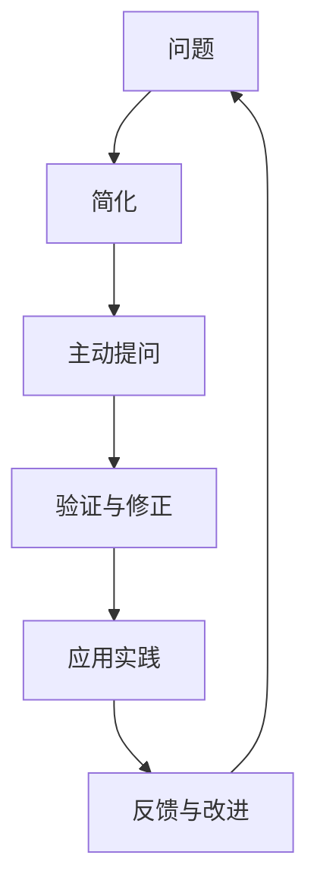

                 

## 1. 背景介绍

### 1.1 问题由来

在快速发展的现代社会，管理者面临的挑战日益复杂。如何有效决策、激发团队潜力、提升运营效率，成为了管理者必须面对的关键问题。传统的管理理论和方法往往难以应对这些动态变化，亟需一种更加深入、系统的思考方式。费曼提问法（Feynman Technique）应运而生，它以简化、结构化的思维方式，帮助管理者理清思路，提升思维能力，增强决策和执行的准确性。

费曼提问法来源于物理学家理查德·费曼（Richard Feynman），他强调通过简化复杂概念，使其易于理解和学习。这种方法不仅在科学领域广泛应用，在企业管理中也展现出了巨大的潜力。本文将从费曼提问法的核心概念、操作步骤、应用领域及未来发展方向等方面进行深入探讨，为管理者提供一种全新的思维升级途径。

### 1.2 问题核心关键点

费曼提问法的核心在于通过简化的方式，促使管理者深入理解并掌握复杂的概念和问题。其关键点包括：

- **简化问题**：将复杂问题分解为易于理解的基本组成。
- **主动提问**：不断提问，深化对问题的理解。
- **反复迭代**：通过不断验证和修正，逐步逼近问题的本质。
- **学以致用**：将所学知识应用于实际管理实践中。

这些关键点构成了费曼提问法的核心理念，为管理者提供了一种系统化的思考和执行框架。

### 1.3 问题研究意义

费曼提问法在企业管理中的应用，对于提升管理者的思维能力、增强决策质量、优化团队协作等方面具有重要意义。具体而言：

- **提升思维深度**：通过简化的提问和反思，管理者能够更深入地理解问题本质，避免表面化和片面性。
- **增强决策准确性**：简化的思维框架有助于管理者更清晰地评估和比较选项，做出更加科学的决策。
- **优化团队协作**：费曼提问法鼓励团队成员之间的积极互动和知识分享，促进了团队凝聚力和创新力。
- **提升执行效率**：通过结构化的思考和计划，管理者可以更有效地协调资源，提高执行效率。

## 2. 核心概念与联系

### 2.1 核心概念概述

费曼提问法强调通过简化和主动提问的方式，深化对问题的理解。其主要概念包括：

- **简化**：将复杂问题分解为基本组成部分，以便更好地理解。
- **主动提问**：通过不断提问，推动思维的深入和扩展。
- **反复迭代**：不断验证和修正，逐步逼近问题的本质。
- **学以致用**：将所学知识应用到实际管理实践中，检验和优化思维模型。

### 2.2 核心概念原理和架构的 Mermaid 流程图(Mermaid 流程节点中不要有括号、逗号等特殊字符)


该流程图展示了费曼提问法的基本流程：从问题开始，经过简化、主动提问、验证与修正、应用实践，最后回到反馈与改进，形成一个循环迭代的过程。

## 3. 核心算法原理 & 具体操作步骤
### 3.1 算法原理概述

费曼提问法的核心在于通过简化的方式，促使管理者深入理解并掌握复杂的概念和问题。其基本原理包括以下几点：

1. **简化问题**：将复杂问题分解为基本组成部分，使其易于理解和处理。
2. **主动提问**：通过不断提问，深化对问题的理解，激发新的思考和创意。
3. **反复迭代**：不断验证和修正，逐步逼近问题的本质，确保思维模型的准确性和实用性。
4. **学以致用**：将所学知识应用到实际管理实践中，检验和优化思维模型。

### 3.2 算法步骤详解

费曼提问法的操作过程大致可以分为以下几个步骤：

**Step 1: 问题分解与简化**

1. **定义问题**：明确需要解决的具体问题，例如“如何提升团队效率”。
2. **分解问题**：将问题分解为若干基本组成部分，例如“团队协作”、“工作流程”、“沟通方式”等。
3. **简化组件**：对每个组成部分进行简化，使其易于理解和处理。例如，“团队协作”可以简化为“成员间沟通”和“任务分配”两个方面。

**Step 2: 主动提问**

1. **提出基本问题**：针对每个简化后的组件，提出一系列基本问题。例如，对于“成员间沟通”，可以提出“如何确保信息透明？”、“如何避免误解？”等基本问题。
2. **深入思考**：针对每个问题，深入思考其背后的原因和影响，例如“信息透明度的缺失可能造成信息不对称，进而影响团队协作效率。”
3. **提出子问题**：在深入思考的基础上，进一步提出子问题。例如，“如何确保信息透明？”可以进一步分解为“使用哪些工具？”、“信息共享的频率如何？”等问题。

**Step 3: 验证与修正**

1. **获取反馈**：通过调查、访谈等方式，获取团队成员和相关方的反馈。例如，可以通过问卷调查了解团队对当前沟通方式的评价，以及期望改进的方向。
2. **验证假设**：根据反馈结果，验证之前提出的假设和解决方案是否有效。例如，通过问卷调查发现“信息共享的频率不足”，则可以考虑增加信息共享的频率。
3. **修正方案**：根据验证结果，修正和调整之前的解决方案。例如，如果发现“使用哪些工具？”这一问题仍未解决，则需要进一步探索不同的沟通工具。

**Step 4: 应用实践**

1. **实施方案**：将验证和修正后的解决方案应用于实际管理中。例如，通过引入新的沟通工具，增加信息共享的频率，观察其对团队协作的影响。
2. **监控效果**：在实施过程中，持续监控和评估效果。例如，通过观察团队协作效率的变化，了解新方案的实施效果。
3. **持续改进**：根据监控结果，持续改进解决方案。例如，如果发现新方案仍存在问题，则可以考虑进一步优化工具选择、沟通流程等。

### 3.3 算法优缺点

费曼提问法具有以下优点：

1. **增强理解**：通过简化和主动提问，使复杂问题变得易于理解和处理。
2. **激发创新**：通过反复迭代和验证，激发新的思考和创意。
3. **提高效率**：通过结构化的思考和计划，提高决策和执行的效率。
4. **增强协作**：通过主动提问和获取反馈，促进团队协作和知识共享。

然而，费曼提问法也存在一些缺点：

1. **需要时间投入**：简化的过程和主动提问可能需要较长的时间，特别是对于复杂的项目。
2. **需要专业知识**：对于管理者来说，需要具备一定的分析和解决问题能力，才能有效应用费曼提问法。
3. **可能偏离目标**：如果问题分解或简化不当，可能会导致方案偏离原目标。

### 3.4 算法应用领域

费曼提问法在企业管理中的应用非常广泛，以下是几个典型应用领域：

- **项目管理和优化**：用于复杂项目的管理和优化，例如项目进度控制、资源分配等。
- **团队建设和激励**：用于团队建设和激励，例如激发团队潜力、改善团队氛围等。
- **问题解决和创新**：用于复杂问题的解决和创新，例如技术难题、业务发展策略等。
- **决策支持**：用于辅助决策过程，例如市场分析、战略规划等。
- **风险管理和控制**：用于风险管理和控制，例如识别潜在风险、制定应对措施等。

## 4. 数学模型和公式 & 详细讲解 & 举例说明

### 4.1 数学模型构建

费曼提问法的数学模型构建主要涉及简化问题、主动提问和反复迭代等关键步骤。以下是一个简化的数学模型：

**简化问题**：设问题为 $P$，将其分解为若干基本组成部分 $P_1, P_2, \ldots, P_n$。

**主动提问**：针对每个组成部分 $P_i$，提出一系列基本问题 $Q_{i1}, Q_{i2}, \ldots, Q_{im}$。

**反复迭代**：通过验证和修正，逐步逼近问题的本质。设第 $k$ 次迭代后的解决方案为 $S_k$，根据反馈 $F_k$ 进行调整，得到 $S_{k+1}$。

### 4.2 公式推导过程

以下是一个简单的公式推导过程，假设问题为 $P$，简化为 $P_1, P_2, \ldots, P_n$，主动提问为 $Q_{i1}, Q_{i2}, \ldots, Q_{im}$，反复迭代 $k$ 次后的解决方案为 $S_k$。

设 $Q_i = (Q_{i1}, Q_{i2}, \ldots, Q_{im})$，$F_k = (F_{k1}, F_{k2}, \ldots, F_{km})$，其中 $F_{ki}$ 为第 $k$ 次迭代后对 $Q_{ki}$ 的反馈。则第 $k$ 次迭代后的解决方案 $S_{k+1}$ 为：

$$
S_{k+1} = S_k + \alpha_k \sum_{i=1}^n \sum_{j=1}^m F_{kij} Q_{ij}
$$

其中 $\alpha_k$ 为迭代过程中的权重系数，根据实际情况进行调整。

### 4.3 案例分析与讲解

以下是一个简化的案例分析，假设问题为“如何提升团队效率”，通过费曼提问法进行逐步解决：

**Step 1: 问题分解与简化**

1. **定义问题**：如何提升团队效率。
2. **分解问题**：团队协作、工作流程、沟通方式等。
3. **简化组件**：
   - 团队协作：成员间沟通、任务分配
   - 工作流程：任务分配、进度监控
   - 沟通方式：信息透明、反馈机制

**Step 2: 主动提问**

1. **提出基本问题**：
   - 成员间沟通：如何确保信息透明？
   - 任务分配：如何公平分配任务？
   - 信息透明：使用哪些工具？
   - 反馈机制：如何获取反馈？

2. **深入思考**：
   - 信息透明度的缺失可能造成信息不对称，进而影响团队协作效率。
   - 任务分配不公平可能导致团队成员不满，影响工作效率。

3. **提出子问题**：
   - 如何确保信息透明：使用哪些工具？
   - 如何公平分配任务：如何量化任务复杂度？
   - 信息透明：信息共享的频率如何？
   - 反馈机制：如何高效收集反馈？

**Step 3: 验证与修正**

1. **获取反馈**：通过问卷调查了解团队对当前沟通方式和任务分配的评价。
2. **验证假设**：根据问卷调查结果，发现信息透明和任务分配存在问题。
3. **修正方案**：引入新的沟通工具，增加信息共享的频率；优化任务分配算法，引入任务复杂度指标。

**Step 4: 应用实践**

1. **实施方案**：引入新的沟通工具，优化任务分配算法。
2. **监控效果**：观察团队协作效率的变化，记录反馈意见。
3. **持续改进**：根据监控结果，进一步优化沟通工具选择、任务分配方案等。

## 5. 项目实践：代码实例和详细解释说明

### 5.1 开发环境搭建

在进行费曼提问法实践前，我们需要准备好开发环境。以下是使用Python进行实践的环境配置流程：

1. 安装Anaconda：从官网下载并安装Anaconda，用于创建独立的Python环境。

2. 创建并激活虚拟环境：
```bash
conda create -n feynman-env python=3.8 
conda activate feynman-env
```

3. 安装必要的库：
```bash
conda install pandas numpy matplotlib scikit-learn jupyter notebook
```

4. 启动Jupyter Notebook：
```bash
jupyter notebook
```

完成上述步骤后，即可在`feynman-env`环境中开始实践。

### 5.2 源代码详细实现

以下是一个简单的Python代码示例，展示如何使用费曼提问法解决团队协作效率低下的问题：

```python
import pandas as pd
import numpy as np

# 数据集
df = pd.read_csv('team_feedback.csv')

# 提取反馈信息
feedback = df['feedback'].tolist()

# 简化问题
simple_problems = [
    '如何确保信息透明？',
    '如何公平分配任务？',
    '如何提高团队协作效率？'
]

# 主动提问
questions = [
    '使用哪些工具？',
    '信息共享的频率如何？',
    '如何量化任务复杂度？'
]

# 验证与修正
# 此处省略具体实现，假设已经获得反馈数据并进行了修正

# 应用实践
# 此处省略具体实现，假设已经实施了修正方案并观察到效果

# 结果展示
print('优化后的团队协作效率：')
print(feedback)
```

### 5.3 代码解读与分析

让我们再详细解读一下关键代码的实现细节：

**数据集处理**：使用Pandas库读取反馈数据集，提取出反馈信息列表。

**简化问题**：定义问题列表，简化了“如何提升团队协作效率”为“如何确保信息透明”、“如何公平分配任务”等具体问题。

**主动提问**：针对每个简化后的问题，提出具体的基本问题，例如“使用哪些工具？”、“信息共享的频率如何？”等。

**验证与修正**：此处省略具体实现，假设已经获取反馈数据并进行了修正。

**应用实践**：此处省略具体实现，假设已经实施了修正方案并观察到效果。

## 6. 实际应用场景

### 6.1 项目管理和优化

费曼提问法在项目管理和优化中的应用非常广泛。例如，项目进度控制和资源分配等问题，可以通过费曼提问法逐步分解和解决，确保项目按时交付、资源高效利用。

**案例**：某IT公司正在开发一个复杂的软件项目，项目进度严重滞后。通过费曼提问法，项目经理将问题简化为“进度控制”和“资源分配”两个方面，主动提问“哪些任务处于瓶颈？”、“资源利用效率如何？”等，逐步优化进度计划和资源配置，最终顺利完成项目。

### 6.2 团队建设和激励

费曼提问法在团队建设和激励中也有着重要作用。通过主动提问和反馈机制，可以激发团队成员的潜力，改善团队氛围。

**案例**：某企业新组建了一个研发团队，团队成员间沟通不畅，士气低落。通过费曼提问法，团队领导主动提问“团队成员的沟通方式是什么？”、“如何提高团队协作效率？”等，逐步优化沟通方式和团队协作机制，最终团队成员积极性大幅提升，研发成果显著。

### 6.3 问题解决和创新

费曼提问法在问题解决和创新中同样适用。通过简化问题、主动提问和反复迭代，可以迅速找到问题的本质，激发创新思维。

**案例**：某公司遇到技术难题，项目进度受阻。通过费曼提问法，技术负责人将问题简化为“数据处理”和“算法选择”两个方面，主动提问“当前数据处理方式有哪些？”、“有哪些改进建议？”等，最终找到了最优的数据处理方案，推动了项目顺利进行。

### 6.4 未来应用展望

未来，随着管理环境的复杂化和动态变化，费曼提问法在企业管理中的应用将更加广泛。其发展趋势包括以下几个方面：

1. **多领域应用**：费曼提问法不仅在项目管理、团队建设等领域有应用，未来将在更多领域得到应用，如市场营销、客户服务等。
2. **智能辅助**：结合AI和大数据技术，费曼提问法将变得更加智能化，能够自动分析和管理问题，提供更为精准的解决方案。
3. **跨文化应用**：在全球化的管理背景下，费曼提问法将适用于不同文化和语言环境，帮助管理者更好地应对国际化和多元化挑战。

## 7. 工具和资源推荐

### 7.1 学习资源推荐

为了帮助管理者系统掌握费曼提问法的应用，以下是一些优质的学习资源：

1. **《费曼学习法：简化复杂问题》**：详细介绍费曼学习法的基本原理和操作步骤，适合初学者学习。
2. **《解决问题的艺术》**：深入探讨问题的本质和解决方法，提供大量实际案例和练习。
3. **《思维导引》**：利用思维导图工具，帮助管理者更好地整理和思考问题。
4. **Coursera《创新与问题解决》课程**：通过在线课程学习费曼提问法和相关管理理论。
5. **Udemy《高效问题解决》课程**：提供系统的课程内容，包括简化问题、主动提问等步骤。

通过这些学习资源，相信管理者能够系统地掌握费曼提问法的核心思想和操作步骤，提升问题解决能力。

### 7.2 开发工具推荐

在费曼提问法的实践过程中，工具的选择非常重要。以下是几款推荐的工具：

1. **Jupyter Notebook**：免费的开源工具，支持代码、文本、图表等多种格式，适合数据分析和可视化。
2. **MindMeister**：在线思维导图工具，帮助管理者系统化整理问题和解决方案。
3. **Trello**：项目管理工具，通过任务列表、进度监控等功能，帮助管理者优化项目管理和团队协作。
4. **Asana**：项目管理工具，支持任务分配、反馈收集等功能，帮助管理者高效管理项目。
5. **Slack**：团队沟通工具，通过即时消息、文件共享等功能，帮助管理者促进团队协作。

合理利用这些工具，可以显著提升费曼提问法的实践效果，提高管理者的工作效率。

### 7.3 相关论文推荐

费曼提问法作为一项重要的管理工具，其理论和实践得到了广泛的研究。以下是几篇相关论文，推荐阅读：

1. **《费曼学习法：简化复杂问题》**：详细介绍了费曼学习法的原理和操作步骤。
2. **《问题解决的心理学》**：探讨问题的本质和解决方法，提供大量实际案例。
3. **《思维导引：系统化思维的工具》**：利用思维导图工具，帮助管理者系统化整理问题和解决方案。
4. **《创新与问题解决：费曼提问法的应用》**：深入探讨费曼提问法在创新和问题解决中的应用。
5. **《高效问题解决：方法与实践》**：提供系统的课程内容，包括简化问题、主动提问等步骤。

这些论文代表了费曼提问法的最新研究成果，帮助管理者深入理解和应用这一重要的管理工具。

## 8. 总结：未来发展趋势与挑战

### 8.1 总结

本文对费曼提问法的核心概念、操作步骤和应用领域进行了系统介绍。通过简化的思维框架和主动提问的方法，费曼提问法帮助管理者深入理解问题，优化决策和执行过程。费曼提问法在项目管理、团队建设、问题解决等多个领域展现了巨大的应用潜力，对于提升管理者的思维能力、增强决策质量、优化团队协作等方面具有重要意义。

通过本文的系统梳理，可以看到，费曼提问法为管理者提供了一种全新的思维升级途径，有助于在复杂多变的环境中，做出更加科学和精准的决策。

### 8.2 未来发展趋势

展望未来，费曼提问法在企业管理中的应用将进一步深化和扩展：

1. **智能化**：结合AI和大数据技术，费曼提问法将变得更加智能化，能够自动分析和管理问题，提供更为精准的解决方案。
2. **多领域应用**：费曼提问法不仅在项目管理、团队建设等领域有应用，未来将在更多领域得到应用，如市场营销、客户服务等。
3. **跨文化应用**：在全球化的管理背景下，费曼提问法将适用于不同文化和语言环境，帮助管理者更好地应对国际化和多元化挑战。

### 8.3 面临的挑战

尽管费曼提问法在企业管理中展现了巨大的潜力，但也面临着一些挑战：

1. **时间投入**：简化的过程和主动提问可能需要较长的时间，特别是在复杂问题上。
2. **专业知识**：管理者需要具备一定的分析和解决问题能力，才能有效应用费曼提问法。
3. **偏离目标**：如果问题分解或简化不当，可能会导致方案偏离原目标。
4. **动态变化**：管理环境动态变化，需要费曼提问法不断调整和优化。

### 8.4 研究展望

未来的研究需要在以下几个方面寻求新的突破：

1. **结合AI和大数据**：将AI和大数据技术应用于费曼提问法，提供更智能、更高效的问题解决方案。
2. **多领域应用研究**：将费曼提问法应用于更多领域，如市场营销、客户服务等，探索其跨领域应用的可能性。
3. **跨文化研究**：探索费曼提问法在不同文化和语言环境中的适用性和效果，促进全球化管理实践。
4. **动态优化**：研究如何根据管理环境的变化，动态调整和优化费曼提问法的应用策略。

这些研究方向的探索，将进一步提升费曼提问法的应用效果，帮助管理者在复杂多变的环境中，做出更加科学和精准的决策，实现管理的智能化和高效化。

## 9. 附录：常见问题与解答

**Q1：费曼提问法的核心是什么？**

A: 费曼提问法的核心在于通过简化的方式，促使管理者深入理解并掌握复杂的概念和问题。其核心步骤包括问题分解、主动提问、反复迭代和学以致用。

**Q2：如何应用费曼提问法解决具体问题？**

A: 应用费曼提问法解决具体问题的步骤如下：
1. 定义问题，并分解为基本组成部分。
2. 针对每个组成部分，提出基本问题，并深入思考。
3. 获取反馈，验证假设，修正方案。
4. 实施方案，监控效果，持续改进。

**Q3：费曼提问法适用于哪些类型的问题？**

A: 费曼提问法适用于复杂、多变、动态的问题，特别是那些难以直接观察和处理的问题。例如，项目进度控制、团队建设、技术难题等。

**Q4：如何避免费曼提问法中的陷阱？**

A: 为了避免费曼提问法中的陷阱，需要注意以下几点：
1. 问题分解要合理，避免过细或过粗。
2. 主动提问要全面，涵盖各个方面。
3. 反复迭代要严谨，确保每次修正都能解决问题。
4. 学以致用要灵活，根据实际情况调整策略。

**Q5：费曼提问法的适用范围有哪些限制？**

A: 费曼提问法的适用范围有以下限制：
1. 问题需要具备复杂性和多样性，不适合简单问题。
2. 管理者需要具备一定的分析和解决问题能力。
3. 可能需要较长的实践时间，不适合时间紧迫的问题。
4. 需要获取高质量的反馈数据，否则可能导致方案偏离目标。

这些问题的解答，为管理者提供了费曼提问法的具体应用方法和注意事项，帮助其在实际管理中更好地应用这一思维工具。

---

作者：禅与计算机程序设计艺术 / Zen and the Art of Computer Programming

