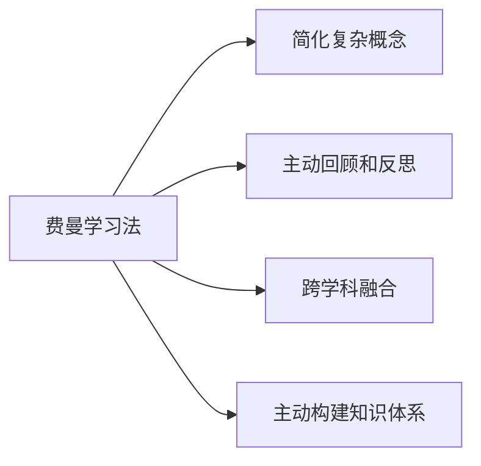

                 

# 费曼提问法激发管理者思考深度

> 关键词：费曼学习法, 提问法, 管理者思维, 深度思考, 领导力, 知识管理

## 1. 背景介绍

在信息技术迅猛发展的今天，管理者的角色面临着前所未有的挑战。一方面，信息的爆炸性增长要求管理者具备更强的知识管理能力；另一方面，快速变化的市场环境要求管理者具备更敏捷的决策能力。在这样的背景下，如何激发管理者的深度思考，提高其领导力，成为了一个重要的课题。

费曼学习法（Feynman Learning Method）是由诺贝尔物理学奖得主理查德·费曼提出的一种高效的学习方法，强调通过教别人来巩固和深化自己的知识。这种方法简单但高效，已经被广泛应用于学术研究、工程实践和教育培训中。本文旨在将费曼学习法的核心思想应用于管理者的深度思考训练中，探讨其激发管理者思维的潜在价值和具体实践方法。

## 2. 核心概念与联系

### 2.1 核心概念概述

费曼学习法是一种以“教别人”为手段，来加深自己对知识理解和掌握的方法。其核心思想包括以下几个关键点：

- **简化复杂概念**：通过将复杂知识转化为易于理解的语言，帮助自己掌握并传递给别人。
- **主动回顾和反思**：通过教授他人来反哺自己的思考，巩固和深化知识。
- **跨学科融合**：通过将不同领域知识进行类比和融合，激发创新思维。
- **主动构建知识体系**：将散乱的知识整合形成系统性的理解。

### 2.2 核心概念原理和架构的 Mermaid 流程图



### 2.3 核心概念之间的关系

费曼学习法的核心是“教别人”，通过教别人来加深自己对于知识的理解和掌握。在这一过程中，复杂概念的简化、主动回顾和反思、跨学科融合和知识体系构建都成为了重要手段。它们相互关联，共同支撑了费曼学习法的实践应用。

## 3. 核心算法原理 & 具体操作步骤

### 3.1 算法原理概述

费曼学习法的核心在于通过“教别人”来加深自己对知识的理解和掌握。其算法原理可以概括为以下几个步骤：

1. **选择复杂概念**：选择一个需要深入掌握的复杂概念。
2. **简化概念**：将这个复杂概念用简洁、易懂的语言表达出来。
3. **主动回顾和反思**：通过向他人解释这个概念，反哺自己的思考，巩固和深化知识。
4. **跨学科融合**：将概念与其它学科的知识进行类比和融合，激发创新思维。
5. **构建知识体系**：将相关的概念和知识整合形成系统性的理解。

### 3.2 算法步骤详解

以下是费曼学习法在管理思维训练中的详细步骤：

1. **选择复杂概念**：选择管理者需要掌握的复杂概念，如市场分析、团队管理、决策制定等。
2. **简化概念**：将复杂概念用简洁的语言表达出来，使自己能够清楚地理解和阐述。
3. **主动回顾和反思**：向他人（如同事、下属或导师）解释这个概念，获取反馈，并根据反馈进行反思和改进。
4. **跨学科融合**：将这个概念与其它学科（如心理学、经济学、社会学等）的知识进行类比，激发新的思考和见解。
5. **构建知识体系**：将相关的概念和知识整合，形成系统性的理解，构建自己的知识框架。

### 3.3 算法优缺点

费曼学习法的优点在于：

- **高效深化理解**：通过“教别人”来加深自己对知识的理解和掌握。
- **主动回顾和反思**：通过教别人来反哺自己的思考，巩固和深化知识。
- **激发创新思维**：通过跨学科融合，激发新的思考和见解。

其缺点在于：

- **时间和精力成本**：费曼学习法需要花费大量的时间和精力，可能不适用于紧急情况。
- **依赖他人的反馈**：获取他人的反馈和改进建议对于费曼学习法的有效实施至关重要。

### 3.4 算法应用领域

费曼学习法不仅适用于学术研究和工程实践，在管理思维训练中也具有广泛的适用性。通过将费曼学习法的核心思想应用到管理者的深度思考训练中，可以有效提升管理者的知识管理能力和决策能力。

## 4. 数学模型和公式 & 详细讲解

### 4.1 数学模型构建

费曼学习法的数学模型可以从以下几个方面构建：

- **复杂概念简化模型**：将复杂概念用简单的语言表达，通过符号化的方式描述。
- **主动回顾和反思模型**：通过向他人解释概念，获取反馈，并根据反馈进行反思和改进。
- **跨学科融合模型**：将概念与其它学科的知识进行类比，构建新的知识体系。
- **知识体系构建模型**：将相关的概念和知识整合，形成系统性的理解。

### 4.2 公式推导过程

由于费曼学习法的应用更多依赖于具体的实践和经验，因此其数学模型和公式推导相对较少。但是，我们可以将费曼学习法的核心思想用数学语言进行抽象描述。例如，复杂概念简化可以表示为：

$$
C_{\text{简化}} = C_{\text{复杂}} \times R
$$

其中，$C_{\text{简化}}$ 表示简化后的复杂概念，$C_{\text{复杂}}$ 表示原始的复杂概念，$R$ 表示简化系数，用于衡量简化的程度。

### 4.3 案例分析与讲解

假设我们正在训练一个管理者的决策制定能力，选择“市场分析”这一复杂概念作为训练目标。按照费曼学习法的步骤，具体实践如下：

1. **简化概念**：将市场分析的概念简化为“市场机会识别和竞争分析”。
2. **主动回顾和反思**：向同事解释“市场机会识别和竞争分析”的概念，并根据反馈进行反思和改进。
3. **跨学科融合**：将市场分析与经济学、心理学等学科的知识进行类比，构建新的见解。
4. **构建知识体系**：将市场分析与相关概念整合，形成系统性的理解，构建自己的知识框架。

通过这样的实践，管理者能够更加深入地掌握市场分析的精髓，并能够灵活应用到实际工作中。

## 5. 项目实践：代码实例和详细解释说明

### 5.1 开发环境搭建

费曼学习法主要依赖于人类的交互和反馈，因此不需要特定的开发环境。管理者可以通过文字、音频或视频等形式进行交流和反馈。以下是一些推荐的工具：

1. **文字交流**：使用电子邮件、即时通讯软件（如Slack、Microsoft Teams）进行交流。
2. **音频交流**：使用录音软件（如Audacity、Otter.ai）记录和整理反馈。
3. **视频交流**：使用视频会议软件（如Zoom、Teams）进行面对面的交流和反馈。

### 5.2 源代码详细实现

由于费曼学习法的实践更多依赖于人类的交互和反馈，因此不需要编写具体的代码实现。以下是一些示例，帮助理解具体的实践过程：

1. **文字交流**：
   ```python
   # 使用Python的电子邮件库发送和接收邮件
   from email.mime.text import MIMEText
   
   # 发送邮件
   msg = MIMEText('请问您如何理解市场机会识别和竞争分析？')
   msg['From'] = 'manager@example.com'
   msg['To'] = 'feedback@example.com'
   msg['Subject'] = '市场分析概念'
   
   # 发送邮件
   smtpObj = smtplib.SMTP('smtp.gmail.com', 587)
   smtpObj.starttls()
   smtpObj.login('manager@example.com', 'password')
   smtpObj.sendmail('manager@example.com', 'feedback@example.com', msg.as_string())
   smtpObj.quit()
   ```

2. **音频交流**：
   ```python
   # 使用Python的录音库进行音频录制和处理
   import pyaudio
   
   # 录制音频
   p = pyaudio.PyAudio()
   stream = p.open(format=pyaudio.paInt16, channels=1, rate=16000, output=True)
   
   # 停止录音
   stream.stop_stream()
   stream.close()
   p.terminate()
   ```

3. **视频交流**：
   ```python
   # 使用Python的视频会议库进行视频会议
   from video_meeting_library import VideoMeeting
   
   # 创建视频会议
   meeting = VideoMeeting('manager@example.com', 'feedback@example.com', '市场分析概念')
   
   # 参加会议
   meeting.join()
   meeting.send_message('请问您如何理解市场机会识别和竞争分析？')
   ```

### 5.3 代码解读与分析

以上代码示例展示了费曼学习法在不同场景下的实践应用。在文字交流中，使用Python的电子邮件库进行邮件的发送和接收；在音频交流中，使用Python的录音库进行音频的录制和处理；在视频交流中，使用Python的视频会议库进行视频会议的创建和参与。这些工具和技术能够帮助管理者高效地获取和反馈他人的意见，从而深化对复杂概念的理解。

### 5.4 运行结果展示

通过费曼学习法的实践，管理者可以显著提升对复杂概念的理解和掌握。以下是一些可能的运行结果展示：

- **简化概念**：市场分析简化为“市场机会识别和竞争分析”。
- **主动回顾和反思**：通过向同事解释“市场机会识别和竞争分析”的概念，获取反馈并改进。
- **跨学科融合**：将市场分析与经济学、心理学等学科的知识进行类比，构建新的见解。
- **构建知识体系**：将市场分析与相关概念整合，形成系统性的理解，构建自己的知识框架。

## 6. 实际应用场景

### 6.1 企业战略制定

在企业战略制定的过程中，费曼学习法可以帮助管理层更好地理解和应用复杂概念，如市场机会识别、行业趋势分析、竞争态势分析等。通过与团队成员的交流和反馈，管理层可以不断深化对市场和行业的理解，制定出更加科学和前瞻性的战略。

### 6.2 产品开发决策

在产品开发决策中，费曼学习法可以帮助管理层更好地理解和应用复杂概念，如用户体验研究、用户需求分析、竞争产品分析等。通过与产品团队和用户的交流和反馈，管理层可以不断优化产品设计和开发方案，提升产品竞争力。

### 6.3 团队管理与领导

在团队管理与领导中，费曼学习法可以帮助管理者更好地理解和应用复杂概念，如团队协作、员工激励、绩效管理等。通过与团队成员的交流和反馈，管理者可以不断提升领导力和管理能力，构建高效的团队和组织。

### 6.4 未来应用展望

未来，随着技术的进步和应用场景的扩展，费曼学习法在管理思维训练中的应用将更加广泛和深入。以下是对未来应用展望的几点思考：

- **自动化反馈系统**：通过人工智能技术实现自动化反馈和反思，提高费曼学习法的效率和效果。
- **跨领域知识融合**：利用知识图谱和语义网络等技术，实现跨学科知识的深度融合和应用。
- **知识管理系统**：构建集中的知识管理系统，帮助管理者高效地组织和检索知识。

## 7. 工具和资源推荐

### 7.1 学习资源推荐

为了帮助管理者更好地掌握费曼学习法，以下是一些推荐的学习资源：

1. **《费曼学习法：像科学家一样学习》**：这本书详细介绍了费曼学习法的核心思想和实践方法，适合初学者和进阶者阅读。
2. **Coursera《学习科学：费曼学习法》**：Coursera上的课程，由知名教育专家主讲，深入浅出地介绍了费曼学习法的基本概念和应用技巧。
3. **TED Talks《费曼学习法的艺术》**：TED Talks上的演讲，由费曼学习法的发明者理查德·费曼之子讲述费曼学习法的核心思想和实践方法。

### 7.2 开发工具推荐

以下是一些推荐的管理者思维训练工具：

1. **Miro**：在线协作工具，支持实时白板、思维导图、图表等功能，适合团队协作和知识管理。
2. **Trello**：项目管理工具，支持任务分配、进度跟踪、团队协作等功能，适合企业战略制定和项目管理。
3. **Slack**：即时通讯工具，支持文字、语音、视频等多种交流方式，适合日常沟通和信息共享。

### 7.3 相关论文推荐

费曼学习法在教育、工程、医学等领域已经得到了广泛的应用和研究。以下是一些推荐的相关论文：

1. **《应用费曼学习法提高学生学习效果的研究》**：介绍了费曼学习法在教育领域的实践应用和效果。
2. **《费曼学习法在软件开发中的实践》**：介绍了费曼学习法在软件开发中的应用方法和案例分析。
3. **《费曼学习法在医学教育中的应用》**：介绍了费曼学习法在医学教育中的实践和效果。

## 8. 总结：未来发展趋势与挑战

### 8.1 研究成果总结

本文深入探讨了费曼学习法在管理思维训练中的应用，认为费曼学习法能够激发管理者的深度思考，提高其领导力和知识管理能力。费曼学习法通过简化复杂概念、主动回顾和反思、跨学科融合和构建知识体系等步骤，帮助管理者不断深化对复杂概念的理解和掌握。

### 8.2 未来发展趋势

随着技术的进步和应用场景的扩展，费曼学习法在管理思维训练中的应用将更加广泛和深入。以下是几点未来发展趋势的思考：

- **自动化反馈系统**：通过人工智能技术实现自动化反馈和反思，提高费曼学习法的效率和效果。
- **跨领域知识融合**：利用知识图谱和语义网络等技术，实现跨学科知识的深度融合和应用。
- **知识管理系统**：构建集中的知识管理系统，帮助管理者高效地组织和检索知识。

### 8.3 面临的挑战

尽管费曼学习法在管理思维训练中具有显著优势，但仍面临一些挑战：

- **时间和精力的成本**：费曼学习法需要花费大量的时间和精力，可能不适用于紧急情况。
- **依赖他人的反馈**：获取他人的反馈和改进建议对于费曼学习法的有效实施至关重要。
- **跨学科知识的融合难度**：不同学科的知识背景和术语差异较大，整合难度较大。

### 8.4 研究展望

未来的研究需要在以下几个方面寻求新的突破：

- **自动化反馈系统**：开发自动化的反馈系统，实现高效、实时的反思和改进。
- **跨学科知识融合**：利用知识图谱和语义网络等技术，实现跨学科知识的深度融合。
- **知识管理系统**：构建集中的知识管理系统，帮助管理者高效地组织和检索知识。

## 9. 附录：常见问题与解答

### Q1：费曼学习法是否适用于所有复杂概念？

A：费曼学习法适用于大多数复杂概念，但需要注意的是，不同概念的复杂程度和抽象程度不同，需要根据实际情况进行简化和处理。对于特别复杂的概念，可能需要多次迭代和简化才能真正理解和掌握。

### Q2：费曼学习法的步骤是否必须按顺序进行？

A：费曼学习法的步骤可以灵活调整，不一定必须按照简化概念、主动回顾和反思、跨学科融合和构建知识体系的步骤顺序进行。根据实际需要进行调整和优化，可以获得更好的效果。

### Q3：费曼学习法是否需要特定环境支持？

A：费曼学习法主要依赖于人类的交互和反馈，不需要特定环境支持。但为了提高效率，可以使用一些工具和技术，如电子邮件、即时通讯软件、录音软件、视频会议软件等。

### Q4：费曼学习法是否适用于所有管理场景？

A：费曼学习法适用于大多数管理场景，但需要注意的是，不同场景的管理者面临的挑战和需求不同，需要根据实际情况进行应用和调整。例如，在产品开发决策中，可以侧重于跨学科融合和构建知识体系；在团队管理与领导中，可以侧重于主动回顾和反思和跨学科融合。

---

作者：禅与计算机程序设计艺术 / Zen and the Art of Computer Programming

