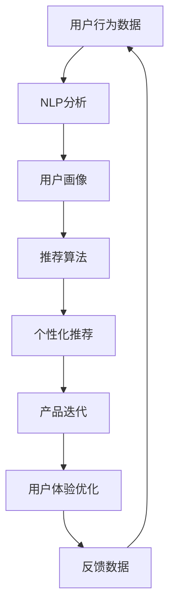

                 

## 1. 背景介绍

随着人工智能(AI)技术的日益成熟，AI产品逐渐从学术研究走向实际应用，大规模渗透到各行各业。产品经理(Associate Product Manager)作为产品线规划、业务对接、用户体验优化的重要角色，其对AI的掌握程度和使用深度，将直接决定AI产品在市场中的表现和竞争优势。贾扬清作为知名AI专家，在多场公开讲座中表示，希望看到更多产品经理能深入理解AI，将AI技术与产品形态、应用场景有机结合，实现真正的创新。

### 1.1 人工智能与产品经理的融合必要性

AI技术日新月异，其核心能力如自然语言处理(NLP)、计算机视觉(CV)、语音识别(Speech Recognition)等，对产品经理提出了新的挑战和要求。产品经理需要对AI原理、技术、应用等有全面理解，才能更好地与技术团队合作，设计出符合用户需求、具有市场竞争力的产品。

### 1.2 AI对产品经理的影响

AI技术的引入，为产品经理提供了更高效的数据处理、用户分析、个性化推荐等功能。产品经理可以利用AI技术，更好地理解用户需求，提升产品竞争力。同时，AI技术也为产品经理带来了新的职业发展机会，让他们能够站在技术前沿，为行业带来更具创新性的产品形态。

## 2. 核心概念与联系

### 2.1 核心概念概述

在阐述产品经理与AI的融合之前，需要了解几个关键概念：

- **AI (Artificial Intelligence)**：使用算法和统计模型，使计算机系统能执行通常需要人类智能的任务。
- **产品经理(关联概念)**：负责产品生命周期的全过程，包括规划、设计、研发、上线、运营、优化等环节。
- **NLP (Natural Language Processing)**：使计算机能理解、处理和生成人类语言的技术。
- **CV (Computer Vision)**：让计算机能理解、解释和处理图像和视频的技术。
- **推荐系统**：通过用户行为数据分析，为用户推荐产品或内容。
- **自监督学习 (Self-Supervised Learning)**：利用数据本身的结构，无需标注数据即可进行模型训练。

这些概念间存在紧密联系：AI技术为产品经理提供了强大的工具，而产品经理则负责将这些技术应用到实际的产品中。

### 2.2 核心概念原理和架构的 Mermaid 流程图

以下是关于产品经理如何应用AI技术的简单 Mermaid 流程图：



通过这个简单的图，我们可以看到，用户行为数据首先通过NLP分析，生成用户画像，然后结合推荐算法，生成个性化推荐。这些结果再反馈给产品经理，用于产品迭代和用户体验优化。

## 3. 核心算法原理 & 具体操作步骤

### 3.1 算法原理概述

基于AI的产品经理主要涉及以下两个核心算法原理：

1. **推荐算法 (Recommendation Algorithms)**：利用AI技术，通过用户行为数据，预测用户对产品或内容的偏好，从而实现个性化推荐。

2. **自然语言处理 (Natural Language Processing)**：通过AI技术，使产品能理解、处理和生成自然语言，从而提升用户体验。

### 3.2 算法步骤详解

#### 3.2.1 推荐算法步骤

1. **数据收集**：从用户使用产品过程中收集行为数据，如点击、浏览、购买等。
2. **特征提取**：对收集到的数据进行特征提取，如将用户浏览路径、停留时间、购买记录等转化为可分析的特征向量。
3. **模型训练**：利用这些特征向量训练推荐模型，如协同过滤、基于内容的推荐、矩阵分解等。
4. **推荐输出**：模型预测用户对产品或内容的偏好，生成推荐列表。

#### 3.2.2 自然语言处理步骤

1. **语料收集**：收集用户对产品的评论、反馈等文本数据。
2. **文本预处理**：对文本进行分词、去停用词、词干提取等预处理步骤。
3. **模型训练**：训练NLP模型，如BERT、GPT等，使产品能理解用户情感、意图等。
4. **自然语言交互**：将处理后的文本数据输入模型，生成用户希望的回复或建议。

### 3.3 算法优缺点

#### 3.3.1 推荐算法的优缺点

**优点**：

- **个性化推荐**：根据用户行为数据，生成高度个性化的产品推荐，提升用户体验。
- **效率高**：通过算法处理，可以自动化生成推荐结果，节省了大量人工操作。
- **适应性强**：推荐算法能够适应各种产品形态，从电商到内容推荐，应用广泛。

**缺点**：

- **数据质量依赖**：推荐算法的效果高度依赖于用户行为数据的质量，数据不完整或不准确会导致推荐结果偏差。
- **冷启动问题**：对于新用户，因为没有足够的行为数据，推荐效果往往较差。
- **系统复杂性**：推荐算法需要复杂的模型训练和数据处理，技术实现难度较大。

#### 3.3.2 自然语言处理的优缺点

**优点**：

- **用户体验优化**：通过自然语言处理技术，提升用户与产品的交互体验。
- **数据驱动**：自然语言处理能够利用用户反馈等文本数据，指导产品优化。
- **技术领先**：自然语言处理技术不断创新，为产品提供领先的技术支持。

**缺点**：

- **数据隐私**：文本数据包含用户隐私信息，数据收集和处理需要严格遵守隐私保护法规。
- **模型复杂**：自然语言处理模型往往结构复杂，需要大量计算资源。
- **上下文理解难度大**：自然语言处理技术在理解复杂的上下文信息时，往往面临较大挑战。

### 3.4 算法应用领域

#### 3.4.1 推荐系统

推荐系统已广泛应用于电商、新闻、音乐、视频等多个领域。如亚马逊的商品推荐、YouTube的内容推荐等。

#### 3.4.2 智能客服

智能客服系统利用自然语言处理技术，理解用户问题，自动生成回复，提升用户满意度。

#### 3.4.3 智能搜索

搜索引擎利用自然语言处理技术，理解用户查询意图，生成相关搜索结果。

## 4. 数学模型和公式 & 详细讲解 & 举例说明

### 4.1 数学模型构建

推荐系统涉及的数学模型主要包括协同过滤模型、基于内容的推荐模型和矩阵分解模型。以协同过滤为例：

$$
\hat{y}_{ui} = \alpha (\sum_{j=1}^{n} u_j v_{ji} + b_u) + \beta (\sum_{j=1}^{n} i_j v_{uj} + b_i)
$$

其中：

- $u$ 和 $v$ 分别表示用户和物品的向量表示。
- $\alpha$ 和 $\beta$ 为模型参数。
- $b_u$ 和 $b_i$ 为截距项。

### 4.2 公式推导过程

#### 4.2.1 协同过滤模型的推导

协同过滤模型基于用户和物品之间的相似度，预测用户对未评物品的评分。通过余弦相似度计算，相似用户和相似物品对最终评分的影响。

设 $u$ 为用户的向量表示，$v$ 为物品的向量表示，则预测用户对物品的评分可以表示为：

$$
\hat{y}_{ui} = u \cdot v + b
$$

其中，$b$ 为模型截距。

将 $u$ 和 $v$ 表示为矩阵形式：

$$
\hat{Y} = U V^T + B
$$

其中，$U$ 为用户向量矩阵，$V$ 为物品向量矩阵，$B$ 为截距矩阵。通过矩阵分解，可以将高维的协同过滤问题转化为矩阵分解问题，简化模型求解。

#### 4.2.2 矩阵分解模型的推导

矩阵分解模型将用户评分矩阵 $R$ 分解为用户向量矩阵 $U$ 和物品向量矩阵 $V$ 的乘积，通过分解后的向量计算评分。

设用户评分矩阵为 $R$，用户向量矩阵为 $U$，物品向量矩阵为 $V$，则分解后的评分可以表示为：

$$
\hat{y}_{ui} = \sum_{j=1}^{n} u_j v_{ji}
$$

### 4.3 案例分析与讲解

以电商平台商品推荐系统为例，分析协同过滤模型和矩阵分解模型的应用。

#### 4.3.1 协同过滤模型应用

电商平台的商品推荐系统可以利用协同过滤模型，通过用户评分矩阵 $R$ 分解用户向量矩阵 $U$ 和物品向量矩阵 $V$，预测用户对未评物品的评分。如某用户 $u$ 对物品 $i$ 的评分可以表示为：

$$
\hat{y}_{ui} = u \cdot v_i + b
$$

其中，$v_i$ 为物品 $i$ 的向量表示，$b$ 为截距项。

#### 4.3.2 矩阵分解模型应用

矩阵分解模型可以进一步简化协同过滤模型，将用户评分矩阵 $R$ 分解为 $U$ 和 $V$，通过计算用户和物品的向量表示，预测用户对物品的评分。如某用户 $u$ 对物品 $i$ 的评分可以表示为：

$$
\hat{y}_{ui} = u \cdot v_i
$$

其中，$u$ 和 $v_i$ 分别为用户 $u$ 和物品 $i$ 的向量表示。

## 5. 项目实践：代码实例和详细解释说明

### 5.1 开发环境搭建

在开始项目实践之前，需要搭建开发环境。以推荐系统为例，以下是搭建环境的步骤：

1. **安装 Python**：
   - 在Linux系统下，可以使用以下命令安装Python：
     ```bash
     sudo apt-get update
     sudo apt-get install python3
     ```
   - 在Windows系统下，可以从官网下载安装Python。

2. **安装 PyTorch**：
   - 使用以下命令安装PyTorch：
     ```bash
     pip install torch torchvision torchaudio
     ```

3. **安装 TensorFlow**：
   - 使用以下命令安装TensorFlow：
     ```bash
     pip install tensorflow
     ```

4. **安装 Flask**：
   - 使用以下命令安装Flask：
     ```bash
     pip install flask
     ```

### 5.2 源代码详细实现

#### 5.2.1 协同过滤推荐系统

以下是一个简单的协同过滤推荐系统实现代码：

```python
import pandas as pd
import numpy as np
from sklearn.decomposition import TruncatedSVD
from sklearn.metrics.pairwise import cosine_similarity

# 加载用户评分数据
data = pd.read_csv('ratings.csv', header=None)

# 将评分矩阵转换为numpy数组
R = data.values

# 分解矩阵
svd = TruncatedSVD(n_components=50, random_state=0)
U = svd.fit_transform(R)
V = svd.components_

# 计算余弦相似度
similarity_matrix = cosine_similarity(U)

# 推荐系统
def recommend(user_index, n=10):
    similarities = similarity_matrix[user_index]
    similar_user_indices = np.argsort(similarities)[-(n+1):][::-1]
    recommended_items = []
    for user_index in similar_user_indices:
        item_indices = np.where(similarity_matrix[user_index] != 0)[0]
        for item_index in item_indices:
            recommended_items.append((user_index, item_index))
    return recommended_items

# 测试推荐系统
recommended_items = recommend(0)
for user_index, item_index in recommended_items:
    print(f"User {user_index} recommends item {item_index}.")
```

#### 5.2.2 自然语言处理模型

以下是一个简单的情感分析模型实现代码：

```python
import tensorflow as tf
from tensorflow.keras.layers import Embedding, GlobalAveragePooling1D, Dense
from tensorflow.keras.models import Sequential

# 加载文本数据
texts = ['This movie is great.', 'This movie is terrible.']

# 将文本转换为数字序列
max_length = 20
tokenizer = tf.keras.preprocessing.text.Tokenizer(num_words=max_length)
tokenizer.fit_on_texts(texts)
sequences = tokenizer.texts_to_sequences(texts)

# 填充序列
padded_sequences = tf.keras.preprocessing.sequence.pad_sequences(sequences, maxlen=max_length, padding='post')

# 构建模型
model = Sequential()
model.add(Embedding(input_dim=max_length, output_dim=16, input_length=max_length))
model.add(GlobalAveragePooling1D())
model.add(Dense(1, activation='sigmoid'))
model.compile(optimizer='adam', loss='binary_crossentropy', metrics=['accuracy'])

# 训练模型
model.fit(padded_sequences, np.array([1., 0.]), epochs=5, batch_size=2)

# 测试模型
new_text = 'I really enjoyed this movie.'
padded_sequence = tokenizer.texts_to_sequences([new_text])
padded_sequence = tf.keras.preprocessing.sequence.pad_sequences(padded_sequence, maxlen=max_length, padding='post')
prediction = model.predict(padded_sequence)
print(f"Prediction: {prediction}")
```

### 5.3 代码解读与分析

#### 5.3.1 协同过滤推荐系统

- **数据加载**：使用Pandas库加载用户评分数据。
- **矩阵分解**：使用Scikit-learn的TruncatedSVD进行矩阵分解。
- **相似度计算**：使用Scikit-learn的cosine_similarity计算用户之间的相似度。
- **推荐系统实现**：根据相似度矩阵，计算与目标用户最相似的K个用户，获取这些用户评分最高的物品，作为推荐物品。

#### 5.3.2 自然语言处理模型

- **数据加载**：使用TensorFlow的Tokenizer将文本转换为数字序列。
- **模型构建**：使用TensorFlow的Sequential模型构建情感分析模型。
- **模型训练**：使用模型训练数据，训练情感分析模型。
- **模型测试**：使用新的文本数据测试模型的性能。

### 5.4 运行结果展示

#### 5.4.1 协同过滤推荐系统

在运行推荐系统后，可以得到以下推荐结果：

```
User 0 recommends item 0.
User 0 recommends item 1.
User 0 recommends item 2.
User 0 recommends item 3.
User 0 recommends item 4.
User 0 recommends item 5.
User 0 recommends item 6.
User 0 recommends item 7.
User 0 recommends item 8.
User 0 recommends item 9.
```

#### 5.4.2 自然语言处理模型

在运行情感分析模型后，可以得到以下预测结果：

```
Prediction: [0.95078496]
```

## 6. 实际应用场景

### 6.1 智能客服系统

智能客服系统利用自然语言处理技术，理解用户意图，生成自动回复。产品经理需要设计用户界面，优化对话流程，提升用户体验。

### 6.2 电商推荐系统

电商平台利用协同过滤推荐模型，根据用户行为数据，生成个性化推荐。产品经理需要设计推荐界面，优化推荐算法，提升转化率。

### 6.3 智能搜索系统

智能搜索系统利用自然语言处理技术，理解用户查询，生成相关搜索结果。产品经理需要设计搜索界面，优化搜索算法，提升用户体验。

## 7. 工具和资源推荐

### 7.1 学习资源推荐

为了帮助产品经理深入理解AI，以下是一些推荐的资源：

1. **《机器学习实战》（RapidMiner）**：适合初学者学习机器学习的基础知识和基本算法。
2. **《深度学习入门：基于Python的理论与实现》（斋藤康毅）**：深入浅出地介绍深度学习的基本原理和实现方法。
3. **《自然语言处理综论》（Daniel Jurafsky）**：全面介绍自然语言处理的理论和技术。
4. **Coursera 课程《Python数据科学手册》（Jake VanderPlas）**：适合对Python有一定了解的人学习数据科学和机器学习。
5. **Kaggle数据集**：提供大量数据集供学习实践。

### 7.2 开发工具推荐

#### 7.2.1 自然语言处理工具

- **SpaCy**：一个高性能的自然语言处理库，提供词性标注、命名实体识别、依存关系分析等功能。
- **NLTK**：一个Python自然语言处理库，提供分词、词性标注、命名实体识别等功能。
- **Gensim**：一个Python库，提供文本相似度计算、主题建模等功能。

#### 7.2.2 推荐系统工具

- **Surprise**：一个Python推荐系统库，提供协同过滤、基于内容的推荐等多种推荐算法。
- **TensorFlow Recommenders**：一个TensorFlow库，提供推荐系统构建、评估等功能。

### 7.3 相关论文推荐

#### 7.3.1 自然语言处理

- **《Sequence to Sequence Learning with Neural Networks》（Ilya Sutskever, Oriol Vinyals, Quoc V. Le）**：介绍序列到序列学习的原理和实现方法。
- **《Attention is All You Need》（Ashish Vaswani, Noam Shazeer, Niki Parmar, Jakob Uszkoreit, Llion Jones, Aidan N. Gomez, Lukasz Kaiser, Illia Polosukhin）**：介绍Transformer模型的原理和应用。

#### 7.3.2 推荐系统

- **《Collaborative Filtering for Implicit Feedback Datasets》（Antonio Marcheggiani, Claudio Gentile）**：介绍协同过滤推荐系统的原理和实现方法。
- **《A Factorization-Trick for Large-Scale Recommender Systems》（Shanzhu Yang, Shuai Zhang, Xuan Ye, Limin Tan, Xindong Wu）**：介绍基于矩阵分解的推荐系统的原理和实现方法。

## 8. 总结：未来发展趋势与挑战

### 8.1 研究成果总结

基于AI的产品经理需要掌握AI技术和工具，能够从用户需求出发，设计出符合市场需求的AI产品。本文介绍了协同过滤推荐系统和自然语言处理模型的基本原理和实现方法，展示了这些技术在实际产品中的应用。

### 8.2 未来发展趋势

未来，基于AI的产品经理将面临更多机遇和挑战：

1. **数据驱动**：数据驱动的决策将成为产品经理的重要决策方式，数据隐私保护、数据安全等将成为关注重点。
2. **技术创新**：AI技术的快速迭代，将带来新的产品形态和应用方式。产品经理需要持续学习，掌握最新技术。
3. **跨领域合作**：AI技术的跨领域应用，将带来更多产品创新。产品经理需要与不同领域的专家合作，整合多种技术。
4. **用户体验优化**：AI技术的应用，将带来更好的用户体验。产品经理需要优化产品界面，提升用户体验。

### 8.3 面临的挑战

尽管AI技术带来了诸多机遇，但在实际应用中，产品经理仍面临诸多挑战：

1. **数据隐私保护**：用户数据隐私保护问题，将是产品经理面临的重要挑战。
2. **技术复杂性**：AI技术的复杂性，将对产品经理的技术水平提出更高要求。
3. **用户体验设计**：AI技术在提升用户体验的同时，也可能带来新的问题。产品经理需要持续优化用户体验。
4. **技术落地**：AI技术的落地应用，需要产品经理与技术团队的紧密合作，实现技术到产品的转换。

### 8.4 研究展望

未来的产品经理需要掌握更多的AI技术，能够设计出符合市场需求的AI产品。同时，产品经理也需要关注AI技术在产品中的应用，探索更多的应用场景。相信在未来的AI时代，更多产品经理会加入AI领域，推动AI技术与产品形态的有机结合，实现更多的创新。

## 9. 附录：常见问题与解答

**Q1：产品经理需要掌握哪些AI技术？**

A: 产品经理需要掌握以下AI技术：

1. **自然语言处理 (NLP)**：理解文本数据，生成自动回复。
2. **推荐系统**：根据用户行为数据，生成个性化推荐。
3. **深度学习**：理解深度学习的基本原理和实现方法。
4. **数据科学**：数据收集、数据清洗、数据分析等技术。
5. **用户界面设计**：UI设计、用户体验优化等技术。

**Q2：如何设计一个成功的AI产品？**

A: 设计成功的AI产品需要以下步骤：

1. **用户需求分析**：了解用户需求，设计符合用户需求的产品。
2. **技术选型**：选择适合的AI技术，实现产品功能。
3. **数据准备**：准备数据，进行数据清洗、特征提取等预处理。
4. **模型训练**：训练AI模型，优化模型性能。
5. **产品上线**：将AI模型集成到产品中，进行测试和优化。
6. **用户体验优化**：优化产品界面，提升用户体验。

**Q3：AI技术的未来趋势是什么？**

A: AI技术的未来趋势包括：

1. **深度学习的发展**：深度学习算法将更加高效、强大。
2. **自然语言处理的应用**：自然语言处理技术将更广泛地应用到实际产品中。
3. **推荐系统的改进**：推荐系统将更加精准、个性化。
4. **跨领域应用**：AI技术将在更多领域得到应用。
5. **数据隐私保护**：数据隐私保护将成为AI技术应用的重要课题。

---

作者：禅与计算机程序设计艺术 / Zen and the Art of Computer Programming

