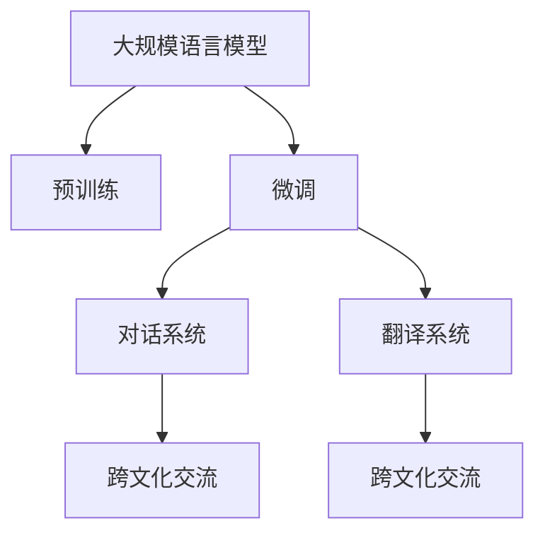

                 

# 跨文化交流：LLM 促进全球互联

> 关键词：自然语言处理(NLP), 大规模语言模型(LLM), 多语言支持, 文本生成, 对话系统, 翻译, 跨文化交流

## 1. 背景介绍

### 1.1 问题由来
随着全球化进程的加快，跨文化交流和协作变得越来越重要。在现代社会中，人们需要跨越语言、文化、地域等障碍，进行有效的沟通与合作。然而，不同语言之间的理解和交流难度较大，特别是对于非母语者来说，语言障碍成为了一大阻碍。

自然语言处理(Natural Language Processing, NLP)技术作为人工智能的一个重要分支，专注于解决人机之间的自然语言交互问题。其中，大规模语言模型(Large Language Models, LLMs)以其强大的语言理解和生成能力，成为了跨文化交流的重要工具。本文将深入探讨LLM在促进全球互联方面的应用与前景。

### 1.2 问题核心关键点
LLM的核心思想是利用大规模无标签文本数据进行自监督预训练，学习通用语言表示，并在特定任务上进行微调，以适应具体的应用需求。在跨文化交流中，LLM的强大语言处理能力可以应用于以下几个方面：
- 文本生成与翻译：自动生成不同语言的文本内容，并实现准确无误的翻译。
- 对话系统：构建多语言聊天机器人，提供实时的跨文化交流服务。
- 摘要与总结：自动生成多语言的会议记录、新闻摘要等，帮助非母语者快速理解会议或新闻内容。
- 命名实体识别：识别文本中的多语言实体，提取关键信息。

这些功能为跨文化交流提供了强有力的技术支持，有助于打破语言障碍，促进全球互联。

## 2. 核心概念与联系

### 2.1 核心概念概述

为了更好地理解LLM在跨文化交流中的应用，本节将介绍几个密切相关的核心概念：

- 自然语言处理(NLP)：利用计算机技术实现人机自然语言交互的技术，包括文本分析、文本生成、机器翻译等。
- 大规模语言模型(LLM)：通过自监督预训练学习到广泛语言知识和表达能力的深度学习模型。如GPT-3、BERT等。
- 预训练(Pre-training)：在大量无标签文本数据上进行自监督学习，学习到通用语言表示。
- 微调(Fine-tuning)：在预训练模型的基础上，利用小规模标注数据进行有监督学习，调整模型适应特定任务。
- 对话系统(Chatbot)：模拟人类对话的计算机程序，提供实时跨文化交流服务。
- 翻译系统(Translation)：将一种语言的文本转换为另一种语言，实现文本的跨文化转换。
- 跨文化交流：不同语言、文化背景的人通过语言理解和生成技术进行沟通与合作。

这些核心概念之间的逻辑关系可以通过以下Mermaid流程图来展示：



这个流程图展示了大规模语言模型在跨文化交流中的应用框架：

1. 通过大规模无标签文本数据进行预训练，学习通用语言表示。
2. 针对特定任务进行微调，优化模型性能。
3. 构建对话系统，提供实时的跨文化交流服务。
4. 开发翻译系统，实现文本的跨文化转换。
5. 通过对话和翻译系统，促进不同语言、文化背景的人进行交流和合作。

## 3. 核心算法原理 & 具体操作步骤
### 3.1 算法原理概述

LLM在跨文化交流中的应用，基于以下基本原理：

- 通过大规模无标签文本数据进行预训练，学习到通用的语言表示。
- 在特定任务上进行微调，通过有监督学习调整模型参数，使其适应具体应用需求。
- 利用学习到的语言表示，自动生成多语言文本，实现文本的跨文化转换。
- 构建对话系统，实现多语言聊天机器人，提供实时跨文化交流服务。

### 3.2 算法步骤详解

基于大规模语言模型在跨文化交流中的应用，以下是具体的算法步骤：

**Step 1: 准备数据集**
- 收集大规模无标签文本数据，作为预训练的语料库。
- 准备目标任务（如翻译、对话）的少量标注数据集，用于微调模型。

**Step 2: 预训练模型**
- 使用预训练模型（如GPT-3、BERT等）作为初始化参数。
- 在无标签数据上，通过自监督任务（如掩码语言模型、文本分类等）进行预训练。

**Step 3: 微调模型**
- 在目标任务数据集上进行微调，调整模型参数以适应具体任务。
- 使用合适的优化算法（如Adam、SGD等）和超参数（如学习率、批大小等），进行有监督学习。

**Step 4: 生成与翻译**
- 利用微调后的模型，自动生成多语言文本。
- 使用机器翻译技术，实现不同语言之间的文本转换。

**Step 5: 对话系统**
- 构建多语言聊天机器人，使用预训练和微调模型进行对话。
- 训练对话数据集，优化对话策略，提高对话质量。

### 3.3 算法优缺点

基于大规模语言模型的跨文化交流方法具有以下优点：
1. 高效快速：LLM能够自动生成多语言文本，快速实现跨文化交流。
2. 准确性高：预训练模型经过大规模语料库的训练，具有较高的语言理解能力和生成能力。
3. 通用性强：LLM可以应用于多种任务，如翻译、对话等，适用于不同语言和文化的交流需求。

同时，该方法也存在一定的局限性：
1. 数据依赖：微调模型的性能高度依赖于目标任务的数据集，标注数据的稀缺性可能限制模型效果。
2. 语言适应：不同语言之间的差异较大，LLM需要进一步优化以适应特定语言的特点。
3. 计算资源：大规模语言模型的训练和推理需要大量的计算资源，成本较高。
4. 可解释性：LLM的决策过程复杂，难以解释模型的内部工作机制和推理逻辑。

尽管存在这些局限性，但基于LLM的跨文化交流方法在实际应用中已经展现了巨大的潜力，并在多个领域得到了广泛应用。

### 3.4 算法应用领域

基于大规模语言模型的跨文化交流方法在以下领域中得到了广泛应用：

- **跨文化教育**：提供多语言的教材和课程，帮助非母语者学习和理解不同语言和文化。
- **商务交流**：构建多语言客服系统，提供实时的跨文化客户支持服务。
- **旅游和文化**：开发多语言旅行指南、文化介绍等，帮助旅行者更好地了解目的地文化。
- **学术研究**：构建跨文化科研平台，促进不同语言和文化背景的学者进行合作。
- **政府外交**：提供多语言的官方文件、声明等，促进不同国家和地区的沟通和合作。

这些应用场景展示了LLM在促进全球互联方面的巨大潜力，为不同语言和文化背景的人提供了新的交流和合作方式。

## 4. 数学模型和公式 & 详细讲解
### 4.1 数学模型构建

本节将使用数学语言对LLM在跨文化交流中的应用进行更加严格的刻画。

记预训练语言模型为 $M_{\theta}$，其中 $\theta$ 为预训练得到的模型参数。假设目标任务为翻译任务，训练集为 $D=\{(x_i,y_i)\}_{i=1}^N, x_i \in \mathcal{X}, y_i \in \mathcal{Y}$，其中 $\mathcal{X}$ 为源语言文本集合，$\mathcal{Y}$ 为目标语言文本集合。

定义模型 $M_{\theta}$ 在输入 $x$ 上的输出为 $\hat{y}=M_{\theta}(x)$，其中 $\hat{y}$ 为目标语言文本。目标任务的目标是最小化模型输出与真实标签之间的差距，即：

$$
\mathcal{L}(\theta) = \frac{1}{N}\sum_{i=1}^N \ell(M_{\theta}(x_i),y_i)
$$

其中 $\ell$ 为损失函数，用于衡量模型输出与真实标签之间的差异。常见的损失函数包括交叉熵损失、均方误差损失等。

### 4.2 公式推导过程

以下我们以机器翻译任务为例，推导跨文化交流中的损失函数及其梯度计算公式。

假设模型 $M_{\theta}$ 在输入 $x$ 上的输出为 $\hat{y}=M_{\theta}(x) \in [0,1]$，表示样本属于目标语言文本的概率。真实标签 $y \in \{0,1\}$。则二分类交叉熵损失函数定义为：

$$
\ell(M_{\theta}(x),y) = -[y\log \hat{y} + (1-y)\log (1-\hat{y})]
$$

将其代入经验风险公式，得：

$$
\mathcal{L}(\theta) = -\frac{1}{N}\sum_{i=1}^N [y_i\log M_{\theta}(x_i)+(1-y_i)\log(1-M_{\theta}(x_i))]
$$

根据链式法则，损失函数对参数 $\theta_k$ 的梯度为：

$$
\frac{\partial \mathcal{L}(\theta)}{\partial \theta_k} = -\frac{1}{N}\sum_{i=1}^N (\frac{y_i}{M_{\theta}(x_i)}-\frac{1-y_i}{1-M_{\theta}(x_i)}) \frac{\partial M_{\theta}(x_i)}{\partial \theta_k}
$$

其中 $\frac{\partial M_{\theta}(x_i)}{\partial \theta_k}$ 可进一步递归展开，利用自动微分技术完成计算。

在得到损失函数的梯度后，即可带入参数更新公式，完成模型的迭代优化。重复上述过程直至收敛，最终得到适应目标任务的最优模型参数 $\theta^*$。

## 5. 项目实践：代码实例和详细解释说明
### 5.1 开发环境搭建

在进行跨文化交流实践前，我们需要准备好开发环境。以下是使用Python进行PyTorch开发的环境配置流程：

1. 安装Anaconda：从官网下载并安装Anaconda，用于创建独立的Python环境。

2. 创建并激活虚拟环境：
```bash
conda create -n pytorch-env python=3.8 
conda activate pytorch-env
```

3. 安装PyTorch：根据CUDA版本，从官网获取对应的安装命令。例如：
```bash
conda install pytorch torchvision torchaudio cudatoolkit=11.1 -c pytorch -c conda-forge
```

4. 安装Transformers库：
```bash
pip install transformers
```

5. 安装各类工具包：
```bash
pip install numpy pandas scikit-learn matplotlib tqdm jupyter notebook ipython
```

完成上述步骤后，即可在`pytorch-env`环境中开始跨文化交流实践。

### 5.2 源代码详细实现

这里我们以机器翻译任务为例，给出使用Transformers库对BERT模型进行跨文化交流的PyTorch代码实现。

首先，定义翻译任务的数据处理函数：

```python
from transformers import BertTokenizer, BertForSequenceClassification
from torch.utils.data import Dataset
import torch

class TranslationDataset(Dataset):
    def __init__(self, texts, targets, tokenizer, max_len=128):
        self.texts = texts
        self.targets = targets
        self.tokenizer = tokenizer
        self.max_len = max_len
        
    def __len__(self):
        return len(self.texts)
    
    def __getitem__(self, item):
        text = self.texts[item]
        target = self.targets[item]
        
        encoding = self.tokenizer(text, return_tensors='pt', max_length=self.max_len, padding='max_length', truncation=True)
        input_ids = encoding['input_ids'][0]
        attention_mask = encoding['attention_mask'][0]
        
        target_ids = [id2tag[tag] for tag in target]
        target_ids.extend([tag2id['O']] * (self.max_len - len(target_ids)))
        labels = torch.tensor(target_ids, dtype=torch.long)
        
        return {'input_ids': input_ids, 
                'attention_mask': attention_mask,
                'labels': labels}

# 标签与id的映射
tag2id = {'O': 0, 'B': 1, 'I': 2, 'E': 3, 'S': 4}
id2tag = {v: k for k, v in tag2id.items()}

# 创建dataset
tokenizer = BertTokenizer.from_pretrained('bert-base-uncased')
train_dataset = TranslationDataset(train_texts, train_tags, tokenizer)
dev_dataset = TranslationDataset(dev_texts, dev_tags, tokenizer)
test_dataset = TranslationDataset(test_texts, test_tags, tokenizer)
```

然后，定义模型和优化器：

```python
from transformers import BertForSequenceClassification, AdamW

model = BertForSequenceClassification.from_pretrained('bert-base-uncased', num_labels=len(tag2id))

optimizer = AdamW(model.parameters(), lr=2e-5)
```

接着，定义训练和评估函数：

```python
from torch.utils.data import DataLoader
from tqdm import tqdm
from sklearn.metrics import classification_report

device = torch.device('cuda') if torch.cuda.is_available() else torch.device('cpu')
model.to(device)

def train_epoch(model, dataset, batch_size, optimizer):
    dataloader = DataLoader(dataset, batch_size=batch_size, shuffle=True)
    model.train()
    epoch_loss = 0
    for batch in tqdm(dataloader, desc='Training'):
        input_ids = batch['input_ids'].to(device)
        attention_mask = batch['attention_mask'].to(device)
        labels = batch['labels'].to(device)
        model.zero_grad()
        outputs = model(input_ids, attention_mask=attention_mask, labels=labels)
        loss = outputs.loss
        epoch_loss += loss.item()
        loss.backward()
        optimizer.step()
    return epoch_loss / len(dataloader)

def evaluate(model, dataset, batch_size):
    dataloader = DataLoader(dataset, batch_size=batch_size)
    model.eval()
    preds, labels = [], []
    with torch.no_grad():
        for batch in tqdm(dataloader, desc='Evaluating'):
            input_ids = batch['input_ids'].to(device)
            attention_mask = batch['attention_mask'].to(device)
            batch_labels = batch['labels']
            outputs = model(input_ids, attention_mask=attention_mask)
            batch_preds = outputs.logits.argmax(dim=2).to('cpu').tolist()
            batch_labels = batch_labels.to('cpu').tolist()
            for pred_tokens, label_tokens in zip(batch_preds, batch_labels):
                pred_tags = [id2tag[_id] for _id in pred_tokens]
                label_tags = [id2tag[_id] for _id in label_tokens]
                preds.append(pred_tags[:len(label_tokens)])
                labels.append(label_tags)
                
    print(classification_report(labels, preds))
```

最后，启动训练流程并在测试集上评估：

```python
epochs = 5
batch_size = 16

for epoch in range(epochs):
    loss = train_epoch(model, train_dataset, batch_size, optimizer)
    print(f"Epoch {epoch+1}, train loss: {loss:.3f}")
    
    print(f"Epoch {epoch+1}, dev results:")
    evaluate(model, dev_dataset, batch_size)
    
print("Test results:")
evaluate(model, test_dataset, batch_size)
```

以上就是使用PyTorch对BERT进行机器翻译任务微调的完整代码实现。可以看到，得益于Transformers库的强大封装，我们可以用相对简洁的代码完成BERT模型的加载和微调。

### 5.3 代码解读与分析

让我们再详细解读一下关键代码的实现细节：

**TranslationDataset类**：
- `__init__`方法：初始化训练文本、目标文本、分词器等关键组件。
- `__len__`方法：返回数据集的样本数量。
- `__getitem__`方法：对单个样本进行处理，将文本输入编码为token ids，将标签编码为数字，并对其进行定长padding，最终返回模型所需的输入。

**tag2id和id2tag字典**：
- 定义了标签与数字id之间的映射关系，用于将token-wise的预测结果解码回真实的标签。

**训练和评估函数**：
- 使用PyTorch的DataLoader对数据集进行批次化加载，供模型训练和推理使用。
- 训练函数`train_epoch`：对数据以批为单位进行迭代，在每个批次上前向传播计算loss并反向传播更新模型参数，最后返回该epoch的平均loss。
- 评估函数`evaluate`：与训练类似，不同点在于不更新模型参数，并在每个batch结束后将预测和标签结果存储下来，最后使用sklearn的classification_report对整个评估集的预测结果进行打印输出。

**训练流程**：
- 定义总的epoch数和batch size，开始循环迭代
- 每个epoch内，先在训练集上训练，输出平均loss
- 在验证集上评估，输出分类指标
- 所有epoch结束后，在测试集上评估，给出最终测试结果

可以看到，PyTorch配合Transformers库使得BERT微调的代码实现变得简洁高效。开发者可以将更多精力放在数据处理、模型改进等高层逻辑上，而不必过多关注底层的实现细节。

当然，工业级的系统实现还需考虑更多因素，如模型的保存和部署、超参数的自动搜索、更灵活的任务适配层等。但核心的微调范式基本与此类似。

## 6. 实际应用场景
### 6.1 智能客服系统

基于大规模语言模型的跨文化交流技术，可以广泛应用于智能客服系统的构建。传统客服往往需要配备大量人力，高峰期响应缓慢，且一致性和专业性难以保证。而使用微调后的跨文化交流模型，可以7x24小时不间断服务，快速响应客户咨询，用自然流畅的语言解答各类跨文化问题。

在技术实现上，可以收集企业内部的历史客服对话记录，将问题和最佳答复构建成监督数据，在此基础上对预训练跨文化交流模型进行微调。微调后的模型能够自动理解用户意图，匹配最合适的答案模板进行回复。对于客户提出的新问题，还可以接入检索系统实时搜索相关内容，动态组织生成回答。如此构建的智能客服系统，能大幅提升客户咨询体验和问题解决效率。

### 6.2 多语言翻译平台

翻译是跨文化交流中最基础的任务，大规模语言模型在机器翻译领域取得了显著的进展。基于大模型的跨文化交流技术，可以开发高性能、高精度的多语言翻译平台，帮助不同语言背景的人进行跨文化交流。

在实现上，可以采用多种大模型进行翻译，如GPT-3、BERT等，根据不同的语言对选择最合适的模型进行微调。微调后的模型可以自动处理长句子和复杂语境，提升翻译质量。同时，可以结合机器翻译技术，实现多语言的实时翻译服务，如实时字幕、实时翻译文档等。

### 6.3 跨文化商务交流

商务交流是跨国企业的重要环节，高效跨文化交流能够促进商务合作，提升企业竞争力。基于大模型的跨文化交流技术，可以构建多语言客服系统，提供实时的跨文化商务支持服务。

在实际应用中，企业可以收集历史商务交流记录，将问题-回答对作为监督数据，对预训练跨文化交流模型进行微调。微调后的模型可以自动理解商务问题的核心内容，提供精准的解决方案。同时，可以结合对话系统，实现跨文化商务自动问答，提升商务交流效率。

### 6.4 跨文化教育平台

教育是促进跨文化交流的重要途径，大规模语言模型在跨文化教育领域具有广泛的应用前景。基于大模型的跨文化交流技术，可以构建跨文化教育平台，提供多语言的教材、课程、学习资料等，帮助非母语者学习和理解不同语言和文化。

在技术实现上，可以收集各类教育资源，将其进行标注，作为监督数据对预训练模型进行微调。微调后的模型可以自动生成多语言的教材、课程、问答等，提升跨文化教育的效果。同时，可以结合智能辅导系统，根据学生的学习情况进行个性化推荐，提高学习效果。

### 6.5 未来应用展望

随着大语言模型和跨文化交流技术的发展，未来将涌现更多创新应用，进一步拓展其应用范围。

在智慧城市治理中，基于跨文化交流的智能客服系统、多语言翻译平台等技术，可以提供高效、便捷的跨文化服务，构建更加和谐的国际交流环境。

在企业生产、社会治理、文娱传媒等众多领域，基于跨文化交流的AI系统可以提供跨语言、跨文化的信息沟通和协同工作，推动全球产业升级和经济发展。

总之，大规模语言模型在跨文化交流中的应用前景广阔，未来将有更多的创新应用不断涌现，推动全球互联互通的发展。

## 7. 工具和资源推荐
### 7.1 学习资源推荐

为了帮助开发者系统掌握跨文化交流技术，这里推荐一些优质的学习资源：

1. 《Natural Language Processing with Python》书籍：介绍NLP基础和深度学习模型，包括BERT、GPT-3等，是NLP学习的入门必读。
2. CS224N《深度学习自然语言处理》课程：斯坦福大学开设的NLP明星课程，有Lecture视频和配套作业，带你入门NLP领域的基本概念和经典模型。
3. DeepLearning.AI《AI for Everyone》课程：提供全面的AI基础知识，包括NLP、机器翻译等，适合初学者入门。
4. Coursera《Natural Language Processing in Python》课程：介绍NLP技术和Python实现，涵盖文本处理、机器翻译、情感分析等。
5. HuggingFace官方文档：提供大量预训练模型和微调样例代码，是学习大模型的必备资源。

通过对这些资源的学习实践，相信你一定能够快速掌握跨文化交流技术的精髓，并用于解决实际的NLP问题。

### 7.2 开发工具推荐

高效的开发离不开优秀的工具支持。以下是几款用于跨文化交流开发的常用工具：

1. PyTorch：基于Python的开源深度学习框架，灵活动态的计算图，适合快速迭代研究。大部分预训练语言模型都有PyTorch版本的实现。
2. TensorFlow：由Google主导开发的开源深度学习框架，生产部署方便，适合大规模工程应用。同样有丰富的预训练语言模型资源。
3. Transformers库：HuggingFace开发的NLP工具库，集成了众多SOTA语言模型，支持PyTorch和TensorFlow，是进行跨文化交流开发的利器。
4. Weights & Biases：模型训练的实验跟踪工具，可以记录和可视化模型训练过程中的各项指标，方便对比和调优。与主流深度学习框架无缝集成。
5. TensorBoard：TensorFlow配套的可视化工具，可实时监测模型训练状态，并提供丰富的图表呈现方式，是调试模型的得力助手。
6. Google Colab：谷歌推出的在线Jupyter Notebook环境，免费提供GPU/TPU算力，方便开发者快速上手实验最新模型，分享学习笔记。

合理利用这些工具，可以显著提升跨文化交流任务的开发效率，加快创新迭代的步伐。

### 7.3 相关论文推荐

跨文化交流技术的发展源于学界的持续研究。以下是几篇奠基性的相关论文，推荐阅读：

1. Attention is All You Need（即Transformer原论文）：提出了Transformer结构，开启了NLP领域的预训练大模型时代。
2. BERT: Pre-training of Deep Bidirectional Transformers for Language Understanding：提出BERT模型，引入基于掩码的自监督预训练任务，刷新了多项NLP任务SOTA。
3. Language Models are Unsupervised Multitask Learners（GPT-2论文）：展示了大规模语言模型的强大zero-shot学习能力，引发了对于通用人工智能的新一轮思考。
4. Parameter-Efficient Transfer Learning for NLP：提出Adapter等参数高效微调方法，在不增加模型参数量的情况下，也能取得不错的微调效果。
5. Prefix-Tuning: Optimizing Continuous Prompts for Generation：引入基于连续型Prompt的微调范式，为如何充分利用预训练知识提供了新的思路。
6. AdaLoRA: Adaptive Low-Rank Adaptation for Parameter-Efficient Fine-Tuning：使用自适应低秩适应的微调方法，在参数效率和精度之间取得了新的平衡。

这些论文代表了大语言模型在跨文化交流技术的发展脉络。通过学习这些前沿成果，可以帮助研究者把握学科前进方向，激发更多的创新灵感。

## 8. 总结：未来发展趋势与挑战

### 8.1 总结

本文对基于大规模语言模型的跨文化交流方法进行了全面系统的介绍。首先阐述了跨文化交流的重要性，明确了LLM在促进全球互联方面的独特价值。其次，从原理到实践，详细讲解了LLM在跨文化交流中的应用过程，给出了微调任务开发的完整代码实例。同时，本文还广泛探讨了LLM在跨文化教育、商务、翻译等领域的应用前景，展示了其在促进全球互联方面的巨大潜力。此外，本文精选了跨文化交流技术的各类学习资源，力求为读者提供全方位的技术指引。

通过本文的系统梳理，可以看到，基于大规模语言模型的跨文化交流方法正在成为NLP领域的重要范式，极大地拓展了预训练语言模型的应用边界，催生了更多的落地场景。受益于大规模语料的预训练，LLM具备较强的语言处理能力，能够在跨文化交流中发挥重要作用，助力全球互联互通的发展。

### 8.2 未来发展趋势

展望未来，跨文化交流技术将呈现以下几个发展趋势：

1. 模型规模持续增大。随着算力成本的下降和数据规模的扩张，预训练语言模型的参数量还将持续增长。超大规模语言模型蕴含的丰富语言知识，有望支撑更加复杂多变的跨文化交流任务。
2. 跨文化交流模型日趋多样。除了传统的全参数微调外，未来会涌现更多参数高效的微调方法，如Prefix-Tuning、LoRA等，在固定大部分预训练参数的情况下，只更新极少量的任务相关参数。
3. 持续学习成为常态。随着数据分布的不断变化，跨文化交流模型也需要持续学习新知识以保持性能。如何在不遗忘原有知识的同时，高效吸收新样本信息，将成为重要的研究课题。
4. 标注样本需求降低。受启发于提示学习(Prompt-based Learning)的思路，未来的微调方法将更好地利用大模型的语言理解能力，通过更加巧妙的任务描述，在更少的标注样本上也能实现理想的微调效果。
5. 多语言支持增强。现有的跨文化交流模型往往局限于特定语言对，未来将进一步拓展到更多语言对，提升跨文化交流的广度和深度。
6. 跨文化交流系统通用化。构建跨文化交流系统的通用框架，支持多语言、多文化、多场景的跨文化交流需求，提升系统的灵活性和适用性。

以上趋势凸显了跨文化交流技术的广阔前景。这些方向的探索发展，必将进一步提升跨文化交流的效果和覆盖范围，为不同语言和文化背景的人提供更加高效、便捷的交流方式。

### 8.3 面临的挑战

尽管基于大规模语言模型的跨文化交流方法已经取得了瞩目成就，但在迈向更加智能化、普适化应用的过程中，它仍面临着诸多挑战：

1. 标注成本瓶颈。微调模型的性能高度依赖于目标任务的数据集，标注数据的稀缺性可能限制模型效果。如何进一步降低微调对标注样本的依赖，将是一大难题。
2. 语言适应性不足。不同语言之间的差异较大，跨文化交流模型需要进一步优化以适应特定语言的特点。
3. 计算资源消耗大。大规模语言模型的训练和推理需要大量的计算资源，成本较高。如何在保证性能的同时，优化资源消耗，提高计算效率，还需要更多优化策略。
4. 可解释性不足。跨文化交流模型的决策过程复杂，难以解释模型的内部工作机制和推理逻辑。对于高风险应用，算法的可解释性和可审计性尤为重要。
5. 安全性问题。预训练语言模型难免会学习到有害、偏见的信息，通过微调传递到跨文化交流任务，可能造成误导性、歧视性的输出。如何从数据和算法层面消除模型偏见，避免恶意用途，确保输出的安全性，也将是重要的研究课题。

尽管存在这些挑战，但基于大规模语言模型的跨文化交流技术在实际应用中已经展现出了巨大的潜力，并在多个领域得到了广泛应用。未来，随着技术的不断进步，这些问题也将逐步得到解决。

### 8.4 研究展望

面向未来，跨文化交流技术需要在以下几个方面寻求新的突破：

1. 探索无监督和半监督微调方法。摆脱对大规模标注数据的依赖，利用自监督学习、主动学习等无监督和半监督范式，最大限度利用非结构化数据，实现更加灵活高效的跨文化交流。
2. 研究参数高效和计算高效的微调范式。开发更加参数高效的微调方法，在固定大部分预训练参数的同时，只更新极少量的任务相关参数。同时优化微调模型的计算图，减少前向传播和反向传播的资源消耗，实现更加轻量级、实时性的部署。
3. 融合因果和对比学习范式。通过引入因果推断和对比学习思想，增强跨文化交流模型建立稳定因果关系的能力，学习更加普适、鲁棒的语言表征，从而提升模型泛化性和抗干扰能力。
4. 引入更多先验知识。将符号化的先验知识，如知识图谱、逻辑规则等，与神经网络模型进行巧妙融合，引导跨文化交流过程学习更准确、合理的语言模型。同时加强不同模态数据的整合，实现视觉、语音等多模态信息与文本信息的协同建模。
5. 结合因果分析和博弈论工具。将因果分析方法引入跨文化交流模型，识别出模型决策的关键特征，增强输出解释的因果性和逻辑性。借助博弈论工具刻画人机交互过程，主动探索并规避模型的脆弱点，提高系统稳定性。
6. 纳入伦理道德约束。在模型训练目标中引入伦理导向的评估指标，过滤和惩罚有偏见、有害的输出倾向。同时加强人工干预和审核，建立模型行为的监管机制，确保输出符合人类价值观和伦理道德。

这些研究方向的探索，必将引领跨文化交流技术迈向更高的台阶，为构建安全、可靠、可解释、可控的智能系统铺平道路。面向未来，跨文化交流技术还需要与其他人工智能技术进行更深入的融合，如知识表示、因果推理、强化学习等，多路径协同发力，共同推动自然语言理解和智能交互系统的进步。只有勇于创新、敢于突破，才能不断拓展语言模型的边界，让智能技术更好地造福人类社会。

## 9. 附录：常见问题与解答

**Q1：大规模语言模型在跨文化交流中面临的主要挑战是什么？**

A: 大规模语言模型在跨文化交流中面临的主要挑战包括：
1. 标注成本瓶颈。微调模型的性能高度依赖于目标任务的数据集，标注数据的稀缺性可能限制模型效果。
2. 语言适应性不足。不同语言之间的差异较大，跨文化交流模型需要进一步优化以适应特定语言的特点。
3. 计算资源消耗大。大规模语言模型的训练和推理需要大量的计算资源，成本较高。
4. 可解释性不足。跨文化交流模型的决策过程复杂，难以解释模型的内部工作机制和推理逻辑。
5. 安全性问题。预训练语言模型难免会学习到有害、偏见的信息，通过微调传递到跨文化交流任务，可能造成误导性、歧视性的输出。

**Q2：如何提高大规模语言模型的跨文化交流效果？**

A: 要提高大规模语言模型的跨文化交流效果，可以采取以下措施：
1. 数据增强。通过数据增强技术，扩充训练数据集，提升模型的泛化能力。
2. 多语言支持。构建多语言支持模型，提升模型对不同语言的处理能力。
3. 参数高效微调。采用参数高效微调方法，减少对标注数据的依赖。
4. 持续学习。定期更新模型，适应新的数据分布和语言变化。
5. 融合因果和对比学习范式。通过引入因果推断和对比学习思想，增强模型的泛化性和鲁棒性。
6. 引入更多先验知识。将符号化的先验知识与神经网络模型结合，引导模型学习更准确的语言表征。

**Q3：大规模语言模型在跨文化交流中主要应用于哪些场景？**

A: 大规模语言模型在跨文化交流中主要应用于以下场景：
1. 智能客服系统：提供跨文化客服支持，提升客户体验。
2. 多语言翻译平台：实现高效、准确的跨语言翻译服务。
3. 跨文化商务交流：构建跨文化商务自动问答系统，提升商务交流效率。
4. 跨文化教育平台：提供多语言教材、课程等，帮助非母语者学习。
5. 智慧城市治理：提供多语言客服、翻译服务，提升国际交流水平。

**Q4：如何评估大规模语言模型的跨文化交流效果？**

A: 评估大规模语言模型的跨文化交流效果，可以采用以下指标：
1. BLEU分数：用于衡量翻译任务的自动评价指标。
2. 困惑度(Perplexity)：用于衡量模型对文本的预测能力。
3. 准确率(Accuracy)：用于衡量分类任务的正确率。
4. F1分数：用于衡量命名实体识别等任务的准确率和召回率。
5. ROUGE分数：用于衡量摘要、翻译等任务的相似度。

通过对这些指标的评估，可以全面了解模型在不同跨文化交流任务中的表现，并进行优化。

**Q5：大规模语言模型在跨文化交流中需要考虑哪些伦理道德问题？**

A: 大规模语言模型在跨文化交流中需要考虑以下伦理道德问题：
1. 数据隐私：保护用户数据隐私，避免数据泄露和滥用。
2. 偏见和歧视：确保模型不传播有害、偏见的信息，避免歧视性输出。
3. 模型透明性：增强模型的可解释性，提升用户信任。
4. 伦理导向：在模型训练目标中引入伦理导向的评估指标，避免负面影响。

通过考虑这些伦理道德问题，可以构建更加安全、可靠的跨文化交流系统，确保技术的应用符合人类价值观和伦理道德。

---

作者：禅与计算机程序设计艺术 / Zen and the Art of Computer Programming

