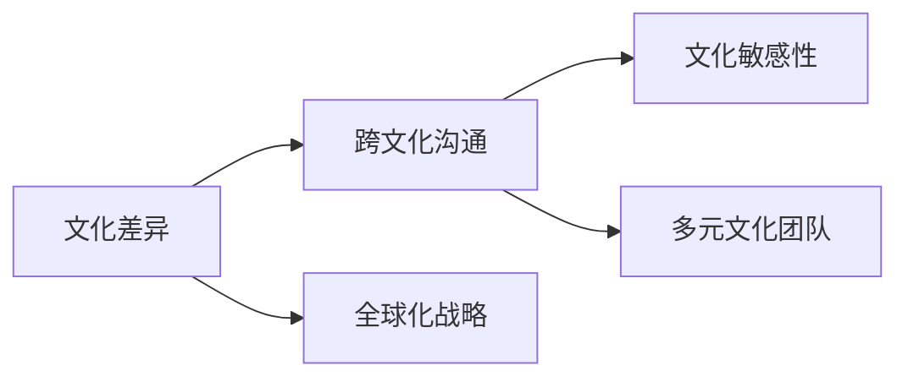

                 

# 跨文化管理：全球化时代的领导挑战

## 1. 背景介绍

随着全球化的加速和互联网的普及，跨文化管理成为了现代企业不可回避的现实挑战。在全球化背景下，企业需要在不同的文化环境中运营，面临语言差异、价值观差异、工作习惯差异等多方面的管理问题。对于管理者而言，如何跨越文化鸿沟，实现高效沟通与协同，是一项复杂而艰巨的任务。本文将探讨跨文化管理的基本原理、核心概念和实践方法，帮助全球化时代的企业领导者提升跨文化管理能力。

## 2. 核心概念与联系

### 2.1 核心概念概述

在跨文化管理中，以下几个核心概念扮演了关键角色：

- **文化差异**：不同国家或地区在语言、价值观、行为习惯等方面存在显著差异。
- **跨文化沟通**：不同文化背景的员工之间进行有效沟通的能力。
- **文化敏感性**：对他人文化差异的感知、尊重和理解。
- **多元文化团队**：由来自不同文化背景的成员组成的团队。
- **全球化战略**：企业在跨国经营中采取的战略规划和行动。

这些概念之间存在紧密联系，共同构成了跨文化管理的基础框架。如下图所示，文化差异是跨文化沟通的前提，文化敏感性和多元文化团队是跨文化沟通的保障，而全球化战略则是跨文化管理的目标和方向。



### 2.2 核心概念原理和架构的 Mermaid 流程图

下图展示了跨文化管理的整体流程，从理解文化差异到制定全球化战略，每个环节都需要精心设计和执行。


## 3. 核心算法原理 & 具体操作步骤

### 3.1 算法原理概述

跨文化管理的核心算法原理是基于对文化差异的理解和尊重，通过设计和实施有效的跨文化沟通策略，实现不同文化背景员工之间的协同工作。这一过程包括以下几个关键步骤：

1. **文化差异分析**：识别并分析不同文化之间的差异，包括语言、价值观、工作习惯等方面。
2. **跨文化沟通策略设计**：根据文化差异分析结果，设计适当的跨文化沟通策略，确保信息的准确传递和理解。
3. **文化敏感性培养**：通过培训和实践，提升团队成员对文化差异的感知和尊重。
4. **多元文化团队建设**：通过多样化的招聘和团队构建，形成多元文化团队，促进跨文化合作。
5. **全球化战略实施**：根据企业战略目标，制定并实施全球化战略，实现跨文化管理的目标。

### 3.2 算法步骤详解

以下是跨文化管理的具体操作步骤：

**Step 1: 文化差异分析**

1. **数据收集**：通过问卷调查、访谈等方式，收集不同文化背景员工的数据。
2. **文化维度分析**：利用Hofstede的文化维度理论（如个人主义与集体主义、权力距离、不确定性规避等）对收集到的数据进行分析。
3. **文化差异识别**：识别文化差异的主要维度，确定需要重点关注和解决的问题。

**Step 2: 设计跨文化沟通策略**

1. **沟通渠道选择**：根据文化差异选择合适的沟通渠道，如面对面会议、电子邮件、即时通讯工具等。
2. **语言支持**：为非母语员工提供语言培训和翻译服务，确保信息传递的准确性。
3. **文化适应性培训**：为团队成员提供文化适应性培训，增强对不同文化背景的理解和尊重。

**Step 3: 培养文化敏感性**

1. **跨文化团队建设**：在团队构建过程中，注重成员的多样性和文化匹配度。
2. **文化敏感性培训**：通过讲座、工作坊等形式，提升团队成员的文化敏感性。
3. **实践与反思**：鼓励团队成员在实际工作中反思和调整自己的行为，以更好地适应多元文化环境。

**Step 4: 实施全球化战略**

1. **跨文化管理策略**：根据文化差异和沟通策略，制定跨文化管理策略。
2. **全球化绩效评估**：通过关键绩效指标（KPIs）评估全球化战略的实施效果。
3. **调整和优化**：根据评估结果，对跨文化管理策略进行调整和优化。

**Step 5: 评估跨文化管理效果**

1. **绩效评估**：通过问卷调查、访谈等方式，评估跨文化管理的效果。
2. **团队反馈**：收集团队成员对跨文化管理策略的反馈，了解其改进空间。
3. **调整和优化**：根据评估结果和团队反馈，对跨文化管理策略进行调整和优化。

### 3.3 算法优缺点

跨文化管理的优势在于：

1. **提升国际竞争力**：跨文化管理能够提升企业在全球市场的竞争力，帮助企业更好地理解和适应不同文化环境。
2. **促进创新**：多元文化背景的团队能够带来不同的视角和思维方式，促进创新和问题解决。
3. **增强员工满意度**：通过尊重和理解不同文化，提升员工的归属感和满意度。

其缺点包括：

1. **管理复杂度增加**：跨文化管理需要更多的协调和沟通，管理复杂度增加。
2. **文化冲突风险**：不同文化背景的员工可能存在价值观和行为习惯的冲突，需要谨慎处理。
3. **成本较高**：跨文化管理需要投入更多的资源，如语言培训、文化敏感性培训等。

### 3.4 算法应用领域

跨文化管理广泛应用于跨国企业和多国分支机构的管理实践中，特别是在以下领域：

- **国际人力资源管理**：招聘、培训、绩效评估等方面的跨文化管理。
- **国际市场营销**：产品定位、广告宣传、客户关系管理等领域的跨文化策略。
- **跨文化团队协作**：项目管理和团队协作中的跨文化沟通和协调。
- **国际客户服务**：跨国客户服务中的跨文化沟通和支持。
- **全球化品牌建设**：在全球范围内推广品牌，提升品牌国际影响力。

## 4. 数学模型和公式 & 详细讲解 & 举例说明

### 4.1 数学模型构建

跨文化管理的数学模型可以基于文化维度理论构建。例如，Hofstede的文化维度模型包括六个维度：个人主义与集体主义、权力距离、不确定性规避、男性化与女性化、长期导向与短期导向、规范性。我们可以通过构建线性回归模型，预测文化差异对跨文化管理效果的影响。

### 4.2 公式推导过程

以权力距离（Power Distance）为例，推导跨文化管理效果与其之间的线性关系。

假设权力距离的取值为 $PD$，跨文化管理效果 $CM$ 可以通过线性回归模型预测，模型的形式为：

$$
CM = \alpha_0 + \alpha_1 PD + \epsilon
$$

其中 $\alpha_0$ 为截距，$\alpha_1$ 为权力距离的系数，$\epsilon$ 为误差项。通过最小二乘法估计模型参数，可以得到最佳的 $\alpha_0$ 和 $\alpha_1$ 值。

### 4.3 案例分析与讲解

某跨国公司在不同文化背景的国家设有分支机构。通过收集各国的文化维度数据和跨文化管理效果的问卷调查数据，建立线性回归模型，预测跨文化管理效果。

假设得到的回归方程为：

$$
CM = 0.5 + 0.3 PD - 0.2 MA
$$

其中 $MA$ 为男性化与女性化的系数。根据该模型，可以预测不同文化背景国家的跨文化管理效果，并据此调整管理策略。

## 5. 项目实践：代码实例和详细解释说明

### 5.1 开发环境搭建

在跨文化管理项目中，Python 是常用的编程语言。以下是搭建 Python 开发环境的步骤：

1. **安装 Python**：从官网下载并安装最新版本的 Python。
2. **安装相关库**：使用pip安装必要的库，如numpy、pandas、scikit-learn等。
3. **设置开发环境**：创建虚拟环境，安装必要的依赖包，设置代码编辑器。

### 5.2 源代码详细实现

以下是一个基于线性回归模型的跨文化管理效果预测代码示例：

```python
import pandas as pd
from sklearn.linear_model import LinearRegression

# 加载数据
data = pd.read_csv('culture_data.csv')

# 提取文化维度数据
power_distance = data['PD'].values
male_female = data['MA'].values

# 建立线性回归模型
model = LinearRegression()
model.fit(power_distance.reshape(-1, 1), male_female)

# 预测跨文化管理效果
test_data = pd.read_csv('test_data.csv')['PD'].values
predicted效果的 = model.predict(test_data.reshape(-1, 1))

# 输出预测结果
print(predicted效果的)
```

### 5.3 代码解读与分析

- **数据加载**：使用 pandas 库读取文化数据和测试数据。
- **模型建立**：使用 scikit-learn 库建立线性回归模型。
- **模型训练**：将文化维度数据作为训练集，训练线性回归模型。
- **预测跨文化管理效果**：使用训练好的模型对测试数据进行预测，得到跨文化管理效果的预测值。
- **结果输出**：输出预测结果，分析其与实际效果的一致性。

### 5.4 运行结果展示

运行上述代码，可以得到不同文化背景下跨文化管理效果的预测值。通过比较预测值与实际效果，可以评估模型的准确性，进而优化管理策略。

## 6. 实际应用场景

### 6.1 跨国企业的人力资源管理

跨国企业在全球招聘和培训过程中，面临不同文化背景的员工管理问题。通过跨文化管理，企业能够更好地理解员工的需求和期望，制定合适的激励措施，提升员工满意度和工作效率。

### 6.2 国际市场营销

在国际市场营销中，了解目标市场的文化特征，制定适当的市场推广策略，可以有效提升品牌在国际市场的影响力。通过跨文化管理，企业能够更好地与本地消费者沟通，增加市场适应性。

### 6.3 跨文化团队协作

在跨文化团队中，文化差异可能影响团队协作效率。通过跨文化管理，团队能够更好地理解和尊重彼此的文化背景，减少冲突，提升团队凝聚力和合作效率。

### 6.4 全球化品牌建设

在全球化品牌建设过程中，了解不同文化背景消费者的需求和偏好，制定全球化的品牌推广策略，可以有效提升品牌国际影响力。跨文化管理能够帮助企业更好地理解不同文化市场的特性，优化品牌形象。

## 7. 工具和资源推荐

### 7.1 学习资源推荐

- **《跨文化管理》**：一本系统介绍跨文化管理的经典书籍，涵盖跨文化沟通、文化敏感性、多元文化团队等多个方面。
- **《全球化战略》**：一本关于企业全球化战略的经典书籍，介绍了全球化战略的制定和实施过程。
- **Coursera《跨文化管理》课程**：由知名大学和专家开设的在线课程，系统讲解跨文化管理理论和实践。
- **Hofstede的文化维度理论**：了解文化维度的理论框架，是跨文化管理的基础。

### 7.2 开发工具推荐

- **GitHub**：代码托管平台，便于团队协作和代码版本控制。
- **Jupyter Notebook**：交互式编程环境，方便数据分析和模型验证。
- **Google Colab**：免费在线 Jupyter Notebook 环境，支持GPU和TPU加速。
- **PyTorch**：深度学习框架，支持高效的模型训练和推理。

### 7.3 相关论文推荐

- **《跨文化管理理论研究》**：系统回顾跨文化管理的理论框架和研究进展。
- **《全球化战略：理论和实践》**：介绍全球化战略的理论基础和实践案例。
- **《文化差异对跨文化管理效果的影响》**：通过实证研究，分析文化差异对跨文化管理效果的影响。

## 8. 总结：未来发展趋势与挑战

### 8.1 研究成果总结

本文详细探讨了跨文化管理的原理、策略和实践方法，强调了文化敏感性和多元文化团队的重要性。跨文化管理能够帮助企业在全球化背景下更好地运营和发展。

### 8.2 未来发展趋势

未来，跨文化管理将呈现以下几个发展趋势：

1. **数字化转型**：借助数字化工具和平台，提升跨文化沟通和协作效率。
2. **人工智能应用**：利用AI技术，实现跨文化沟通的自动化和智能化。
3. **跨文化培训**：通过虚拟现实和模拟场景，提升团队成员的文化敏感性和跨文化沟通能力。
4. **文化融合**：通过多元文化团队的建设，促进不同文化背景员工的融合和协作。
5. **全球化领导力**：培养具备跨文化管理能力的全球化领导人才。

### 8.3 面临的挑战

尽管跨文化管理具有重要意义，但仍面临以下挑战：

1. **文化冲突**：不同文化背景的员工可能存在价值观和行为习惯的冲突，需要谨慎处理。
2. **语言障碍**：语言差异可能影响跨文化沟通的效率和准确性。
3. **管理复杂度**：跨文化管理需要更多的协调和沟通，管理复杂度增加。
4. **资源投入**：跨文化管理需要投入更多的资源，如培训、工具等。
5. **文化适应性**：不同文化背景的员工可能需要较长的时间来适应跨文化环境。

### 8.4 研究展望

未来，跨文化管理研究需要在以下几个方面进行深入探索：

1. **跨文化沟通机制**：研究跨文化沟通的理论和实践，提升沟通效率和效果。
2. **文化融合策略**：研究多元文化团队的建设和管理，促进不同文化背景员工的融合。
3. **文化适应性培训**：开发有效的文化适应性培训课程，提升团队成员的文化敏感性。
4. **全球化领导力培养**：培养具备跨文化管理能力的全球化领导人才，推动企业全球化发展。

## 9. 附录：常见问题与解答

**Q1: 如何提高跨文化团队的有效沟通？**

A: 提高跨文化团队的有效沟通可以从以下几个方面入手：
1. **选择合适的沟通工具**：根据团队成员的语言和文化背景，选择合适的沟通工具，如视频会议、即时通讯、协作平台等。
2. **建立共同语言**：在沟通中尽可能使用简单明了的语言，避免使用文化特定或专业术语。
3. **文化敏感性培训**：定期组织跨文化沟通培训，提升团队成员的文化敏感性。
4. **反馈机制**：建立有效的反馈机制，及时收集和改进跨文化沟通的实际效果。

**Q2: 如何设计跨文化管理策略？**

A: 设计跨文化管理策略需要考虑以下几个步骤：
1. **文化差异分析**：识别并分析不同文化之间的差异，确定文化维度。
2. **沟通渠道选择**：根据文化差异选择合适的沟通渠道。
3. **文化适应性培训**：为团队成员提供文化适应性培训，提升文化敏感性。
4. **多样化的团队构建**：在团队构建过程中注重成员的多样性和文化匹配度。
5. **全球化绩效评估**：通过KPIs评估跨文化管理效果，根据评估结果调整和优化管理策略。

**Q3: 如何应对文化冲突？**

A: 应对文化冲突可以从以下几个方面入手：
1. **文化敏感性培训**：提升团队成员的文化敏感性，增加对不同文化的理解和尊重。
2. **建立沟通渠道**：建立正式和非正式的沟通渠道，及时解决文化冲突。
3. **文化融合活动**：组织文化融合活动，促进不同文化背景员工的互动和交流。
4. **领导者的引导**：领导者应以身作则，示范跨文化沟通和协作的正面行为。

**Q4: 如何评估跨文化管理的效果？**

A: 评估跨文化管理的效果可以从以下几个方面入手：
1. **问卷调查**：通过问卷调查收集团队成员对跨文化管理策略的反馈。
2. **绩效指标**：通过关键绩效指标（KPIs）评估跨文化管理的效果。
3. **团队满意度**：通过团队满意度调查，了解团队成员对跨文化管理的认可度。
4. **沟通效率**：通过沟通效率指标，评估跨文化沟通的效果。
5. **冲突解决**：通过冲突解决的情况，评估跨文化管理的效果。

通过上述问题的解答，相信读者能够更深入地理解跨文化管理的原理和实践方法，提升全球化时代的领导挑战应对能力。

---

作者：禅与计算机程序设计艺术 / Zen and the Art of Computer Programming

