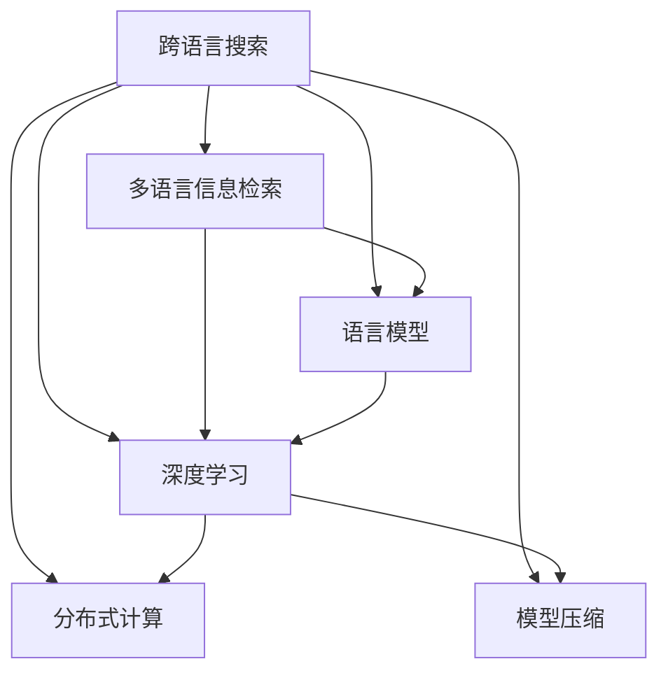

                 

# 跨语言搜索：AI的语言障碍突破

> 关键词：跨语言搜索,语言障碍,自然语言处理,NLP,多语言信息检索,语言模型,深度学习,模型压缩,分布式计算

## 1. 背景介绍

### 1.1 问题由来

互联网的普及极大地推动了全球信息共享，但信息的分散和语言的多样性也带来了新的挑战。不同语言和文化之间的信息隔阂限制了信息的共享和利用。如何在多种语言中高效检索相关信息，打破语言障碍，成为当今互联网时代的一个重要课题。

### 1.2 问题核心关键点

语言障碍主要体现在以下几个方面：

- **语言多样性**：全球有超过7000种语言，许多地区只使用一种或少数几种语言，导致信息在语言上的多样性和孤立。
- **知识鸿沟**：高资源语言（如英语、中文）与低资源语言（如索马里语、斯瓦希里语）之间存在显著的知识鸿沟，不同语言用户获取信息的能力和便利性不同。
- **翻译成本高**：大规模语料库的翻译和校对成本高昂，限制了多语言信息检索系统的构建和应用。
- **模型泛化差**：现有的多语言信息检索模型往往只能处理少数语言，泛化能力有限。

解决这些问题需要更高效、更智能的多语言信息检索技术，以确保信息跨越语言障碍，普惠全球用户。跨语言搜索技术应运而生，通过语言障碍的跨越，实现信息的普惠。

## 2. 核心概念与联系

### 2.1 核心概念概述

为更好地理解跨语言搜索技术，本节将介绍几个核心概念：

- **跨语言搜索(Cross-Language Search, CLS)**：指在多种语言环境中，通过智能算法实现信息检索，并将结果统一转换为用户目标语言的过程。跨语言搜索使得用户可以通过自己熟悉的语言进行检索，跨越语言障碍，获取全球信息。
- **多语言信息检索(Multilingual Information Retrieval, MIR)**：指在多语言数据集上进行信息检索的算法和系统。跨语言搜索是多语言信息检索的一部分，特别关注于不同语言之间的信息转换和匹配。
- **语言模型(Language Model, LM)**：指用于理解和生成自然语言的统计模型，如语言模型、神经机器翻译模型等。语言模型在跨语言搜索中用于理解目标语言和源语言之间的语义关系，以及生成目标语言的信息。
- **深度学习(Deep Learning, DL)**：指使用多层神经网络进行信息处理的算法，通过大量标注数据进行训练，实现对复杂问题的自动学习和决策。深度学习在跨语言搜索中用于构建更复杂、更高效的多语言信息检索模型。
- **分布式计算(Distributed Computing)**：指利用多台计算机并行处理任务，提高计算效率和系统扩展性。分布式计算在跨语言搜索中用于处理大规模语料和复杂计算任务。
- **模型压缩(Model Compression)**：指将大模型压缩为更小模型，以减少内存和计算资源消耗，提高推理效率。模型压缩在跨语言搜索中用于优化模型和加速推理。

这些核心概念之间的逻辑关系可以通过以下Mermaid流程图来展示：



这个流程图展示了一系列与跨语言搜索技术相关的核心概念及其之间的关系：

1. 跨语言搜索通过多语言信息检索、语言模型、深度学习、分布式计算和模型压缩等技术手段，实现信息跨越语言障碍，普惠全球用户。
2. 多语言信息检索是跨语言搜索的核心技术之一，用于处理多种语言的数据，并进行信息匹配。
3. 语言模型和深度学习用于理解和生成多语言文本，构建跨语言搜索的基础。
4. 分布式计算和模型压缩用于提高系统的计算效率和扩展性，优化跨语言搜索的性能。

## 3. 核心算法原理 & 具体操作步骤

### 3.1 算法原理概述

跨语言搜索的本质是通过智能算法，在不同语言之间进行信息匹配和转换，实现信息的普惠。其核心原理包括以下几个步骤：

1. **多语言文本表示**：将不同语言文本转换为统一的向量表示，以便进行信息匹配和比较。
2. **语言模型训练**：使用大规模语料库训练语言模型，理解多语言之间的语义关系。
3. **信息检索**：在转换后的文本向量上进行信息检索，找到与查询匹配的信息。
4. **信息转换**：将检索结果转换为用户目标语言，输出最终结果。

这些步骤通过深度学习、分布式计算和模型压缩等技术手段实现，具体细节将在下文详细介绍。

### 3.2 算法步骤详解

#### 3.2.1 多语言文本表示

多语言文本表示是跨语言搜索的基础。常见的文本表示方法包括：

- **词向量嵌入(Word Embedding)**：如Word2Vec、GloVe等，通过学习单词的向量表示，捕捉单词之间的语义关系。
- **子词嵌入(Subword Embedding)**：如FastText、BERT等，将单词拆分为子词，通过上下文学习更精细的词向量表示。
- **字符级表示(Char Embedding)**：如Unicode Character Embedding等，直接从字符级别学习文本表示。

以BERT为例，BERT使用Transformer结构，通过自监督预训练，学习单词级别的向量表示。具体步骤如下：

1. 将文本分词，得到单词序列。
2. 将单词序列输入BERT模型，得到单词级别的向量表示。
3. 对向量表示进行平均或聚合，得到文本级别的向量表示。

#### 3.2.2 语言模型训练

语言模型用于理解多语言之间的语义关系，是跨语言搜索的关键。训练语言模型的关键在于获得高质量的标注数据。通常使用大规模语料库进行自监督学习，学习语言之间的语义关系和转换规则。

以GPT模型为例，GPT通过自回归语言模型进行训练，学习单词和短语之间的语义关系。具体步骤如下：

1. 收集大规模语料库，将其分为训练集和验证集。
2. 将语料库分批次输入GPT模型，进行前向传播计算损失函数。
3. 反向传播计算参数梯度，根据设定的优化算法和学习率更新模型参数。
4. 周期性在验证集上评估模型性能，根据性能指标决定是否触发Early Stopping。
5. 重复上述步骤直至收敛，得到训练好的语言模型。

#### 3.2.3 信息检索

信息检索是跨语言搜索的核心步骤，用于在多种语言中查找与查询匹配的信息。常见的信息检索方法包括：

- **倒排索引(Inverted Index)**：如Lucene等，将文档内容转换为索引，快速查找与查询匹配的信息。
- **向量空间模型(Vector Space Model, VSM)**：将文本表示为向量，在向量空间中进行匹配。
- **深度检索(Deep Retrieval)**：如DPR、ElasticNet等，使用深度神经网络进行信息匹配，提升检索效果。

以DPR模型为例，DPR使用双塔结构，通过在大规模语料库上进行预训练，学习文本的向量表示。具体步骤如下：

1. 收集大规模语料库，将其分为训练集和验证集。
2. 将语料库分批次输入DPR模型，进行前向传播计算损失函数。
3. 反向传播计算参数梯度，根据设定的优化算法和学习率更新模型参数。
4. 周期性在验证集上评估模型性能，根据性能指标决定是否触发Early Stopping。
5. 重复上述步骤直至收敛，得到训练好的信息检索模型。

#### 3.2.4 信息转换

信息转换是将检索结果转换为用户目标语言的过程，是跨语言搜索的最后一步。常见的方法包括：

- **机器翻译(Machine Translation, MT)**：如Google Translate等，使用神经机器翻译模型将目标语言转换为源语言。
- **多语言文档翻译(Multilingual Document Translation)**：如One Click Translate等，将源语言文档翻译为目标语言，并进行信息的匹配和展示。
- **直接生成目标语言文本**：如Prompt Learning等，通过精心设计输入文本的格式，引导模型按期望方式生成目标语言文本。

以Google Translate为例，Google Translate使用神经机器翻译模型，通过训练大规模双语语料库，实现单词和短语之间的自动翻译。具体步骤如下：

1. 收集大规模双语语料库，将其分为训练集和验证集。
2. 将语料库分批次输入神经机器翻译模型，进行前向传播计算损失函数。
3. 反向传播计算参数梯度，根据设定的优化算法和学习率更新模型参数。
4. 周期性在验证集上评估模型性能，根据性能指标决定是否触发Early Stopping。
5. 重复上述步骤直至收敛，得到训练好的机器翻译模型。

### 3.3 算法优缺点

跨语言搜索技术具有以下优点：

1. **打破语言障碍**：通过智能算法实现多语言信息检索，使得不同语言的用户都能跨越语言障碍，获取全球信息。
2. **普惠全球用户**：跨语言搜索技术可以为全球用户提供更平等的获取信息的机会，推动信息普惠。
3. **高效检索**：通过多语言文本表示、语言模型、信息检索等技术手段，提高检索效率和效果。
4. **适应性强**：跨语言搜索技术可以适应不同语言和文化之间的多样性和复杂性，具备较强的适应性。

同时，该技术也存在一定的局限性：

1. **依赖高质量语料**：跨语言搜索依赖大规模高质量的语料库进行训练，语料质量对模型性能影响较大。
2. **模型复杂度高**：跨语言搜索模型通常较为复杂，需要大量的计算资源和时间进行训练和推理。
3. **转换精度有限**：机器翻译和信息转换过程中，可能存在转换精度不足的问题，影响用户体验。
4. **文化适应性差**：跨语言搜索技术可能无法完全适应不同文化之间的差异，导致信息转换不准确。

尽管存在这些局限性，但就目前而言，跨语言搜索技术仍然是最有效的打破语言障碍、实现信息普惠的手段。未来相关研究的重点在于如何进一步降低模型对语料的需求，提高模型的转换精度和适应性，同时兼顾文化敏感性，确保输出的准确性和公平性。

### 3.4 算法应用领域

跨语言搜索技术已经在多个领域得到应用，涵盖了文本检索、文档翻译、语音识别等多个方面：

- **搜索引擎**：如Google、Bing等，通过跨语言搜索技术，实现不同语言用户的多语言信息检索。
- **翻译软件**：如Google Translate、DeepL等，通过机器翻译技术，实现不同语言之间的文本转换。
- **多语言文档管理**：如One Click Translate、DocuSky等，通过多语言文档翻译技术，实现文档的跨语言管理和检索。
- **语音识别和翻译**：如Google Assistant、Amazon Alexa等，通过语音识别和翻译技术，实现多语言交互。

除了这些应用之外，跨语言搜索技术还被广泛应用于在线教育、智能客服、国际商务等领域，为全球用户提供更便捷、高效的信息获取和交流手段。

## 4. 数学模型和公式 & 详细讲解 & 举例说明

### 4.1 数学模型构建

#### 4.1.1 多语言文本表示

文本表示的数学模型主要涉及词向量嵌入和子词嵌入的构建。

以Word2Vec为例，Word2Vec通过学习单词的共现概率，构建单词的词向量表示。具体数学模型如下：

$$
w_i = \theta_i \cdot \mathbf{x}_i
$$

其中 $w_i$ 为单词 $i$ 的词向量表示，$\theta_i$ 为单词 $i$ 的权重，$\mathbf{x}_i$ 为单词 $i$ 的词向量。

以BERT为例，BERT通过Transformer结构，学习单词级别的向量表示。具体数学模型如下：

$$
\mathbf{x}_i = \mathrm{BERT}(x_i)
$$

其中 $x_i$ 为单词 $i$ 的输入，$\mathbf{x}_i$ 为单词 $i$ 的向量表示。

#### 4.1.2 语言模型训练

语言模型的数学模型主要涉及自回归语言模型的构建。

以GPT为例，GPT通过自回归语言模型进行训练。具体数学模型如下：

$$
p(w_1, w_2, ..., w_n) = \prod_{i=1}^{n} p(w_i|w_{<i})
$$

其中 $w_1, w_2, ..., w_n$ 为单词序列，$w_{<i}$ 为序列中前 $i-1$ 个单词，$p(w_i|w_{<i})$ 为单词 $i$ 在序列 $w_{<i}$ 中的条件概率。

以BERT为例，BERT通过Transformer结构，学习单词和短语之间的语义关系。具体数学模型如下：

$$
\mathbf{x}_i = \mathrm{BERT}(x_i)
$$

其中 $x_i$ 为单词 $i$ 的输入，$\mathbf{x}_i$ 为单词 $i$ 的向量表示。

#### 4.1.3 信息检索

信息检索的数学模型主要涉及向量空间模型和深度检索的构建。

以向量空间模型为例，向量空间模型的数学模型如下：

$$
s = \mathbf{v}_q \cdot \mathbf{v}_d
$$

其中 $\mathbf{v}_q$ 为查询向量，$\mathbf{v}_d$ 为文档向量，$s$ 为查询与文档的相似度。

以深度检索为例，深度检索的数学模型如下：

$$
s = \mathbf{v}_q \cdot \mathbf{v}_d + b
$$

其中 $\mathbf{v}_q$ 为查询向量，$\mathbf{v}_d$ 为文档向量，$b$ 为偏差项，$s$ 为查询与文档的相似度。

#### 4.1.4 信息转换

信息转换的数学模型主要涉及机器翻译和直接生成目标语言文本的构建。

以机器翻译为例，神经机器翻译模型的数学模型如下：

$$
\hat{w}_{target} = \mathrm{MT}(w_{source})
$$

其中 $w_{source}$ 为源语言文本，$\hat{w}_{target}$ 为目标语言文本，$\mathrm{MT}$ 为机器翻译模型。

以直接生成目标语言文本为例，Prompt Learning的数学模型如下：

$$
\hat{w}_{target} = \mathrm{PL}(\mathbf{x}_{target})
$$

其中 $\mathbf{x}_{target}$ 为输入文本，$\hat{w}_{target}$ 为目标语言文本，$\mathrm{PL}$ 为Prompt Learning模型。

### 4.2 公式推导过程

以下是跨语言搜索技术的主要数学模型推导过程：

#### 4.2.1 多语言文本表示

以Word2Vec为例，其数学模型推导如下：

$$
w_i = \theta_i \cdot \mathbf{x}_i = (\mathbf{W}_i^T \cdot \mathbf{X}_i + \mathbf{b}_i) \cdot \sigma(\mathbf{z}_i)
$$

其中 $\mathbf{W}_i$ 为单词 $i$ 的权重矩阵，$\mathbf{X}_i$ 为单词 $i$ 的输入矩阵，$\mathbf{b}_i$ 为偏置项，$\sigma$ 为激活函数，$\mathbf{z}_i$ 为单词 $i$ 的隐藏层输出。

以BERT为例，其数学模型推导如下：

$$
\mathbf{x}_i = \mathrm{BERT}(x_i) = \mathrm{Self-Attention}(\mathbf{h}_0) + \mathbf{W}_i^T \cdot \mathbf{h}_n
$$

其中 $\mathbf{h}_0$ 为输入层的输出，$\mathbf{h}_n$ 为最后一层的隐藏层输出，$\mathrm{Self-Attention}$ 为注意力机制，$\mathbf{W}_i$ 为输出层的权重矩阵。

#### 4.2.2 语言模型训练

以GPT为例，其数学模型推导如下：

$$
p(w_1, w_2, ..., w_n) = \prod_{i=1}^{n} p(w_i|w_{<i}) = \prod_{i=1}^{n} \frac{e^{\mathbf{v}_{i-1} \cdot \mathbf{w}_{i-1} + b_{i-1}}}{\sum_j e^{\mathbf{v}_{i-1} \cdot \mathbf{w}_j + b_j}}
$$

其中 $\mathbf{v}_{i-1}$ 为前 $i-1$ 个单词的向量表示，$\mathbf{w}_{i-1}$ 为单词 $i$ 的权重向量，$b_{i-1}$ 为偏置项。

以BERT为例，其数学模型推导如下：

$$
\mathbf{x}_i = \mathrm{BERT}(x_i) = \mathrm{Self-Attention}(\mathbf{h}_0) + \mathbf{W}_i^T \cdot \mathbf{h}_n
$$

其中 $\mathbf{h}_0$ 为输入层的输出，$\mathbf{h}_n$ 为最后一层的隐藏层输出，$\mathrm{Self-Attention}$ 为注意力机制，$\mathbf{W}_i$ 为输出层的权重矩阵。

#### 4.2.3 信息检索

以向量空间模型为例，其数学模型推导如下：

$$
s = \mathbf{v}_q \cdot \mathbf{v}_d = \sum_{i=1}^{n} v_{q,i} \cdot v_{d,i}
$$

其中 $\mathbf{v}_q$ 为查询向量，$\mathbf{v}_d$ 为文档向量，$s$ 为查询与文档的相似度。

以深度检索为例，其数学模型推导如下：

$$
s = \mathbf{v}_q \cdot \mathbf{v}_d + b = \sum_{i=1}^{n} v_{q,i} \cdot v_{d,i} + b
$$

其中 $\mathbf{v}_q$ 为查询向量，$\mathbf{v}_d$ 为文档向量，$b$ 为偏差项，$s$ 为查询与文档的相似度。

#### 4.2.4 信息转换

以机器翻译为例，其数学模型推导如下：

$$
\hat{w}_{target} = \mathrm{MT}(w_{source}) = \mathrm{Softmax}(\mathbf{W}^T \cdot \mathbf{h}_n + \mathbf{b})
$$

其中 $\mathbf{W}$ 为输出层的权重矩阵，$\mathbf{h}_n$ 为隐藏层输出，$\mathrm{Softmax}$ 为激活函数。

以直接生成目标语言文本为例，其数学模型推导如下：

$$
\hat{w}_{target} = \mathrm{PL}(\mathbf{x}_{target}) = \mathrm{Softmax}(\mathbf{W}^T \cdot \mathbf{h}_n + \mathbf{b})
$$

其中 $\mathbf{W}$ 为输出层的权重矩阵，$\mathbf{h}_n$ 为隐藏层输出，$\mathrm{Softmax}$ 为激活函数。

### 4.3 案例分析与讲解

#### 4.3.1 实例一：Google Translate

Google Translate使用神经机器翻译模型进行跨语言翻译，其实现步骤如下：

1. **收集语料**：收集大规模双语语料库，进行预处理和标注。
2. **训练模型**：使用神经机器翻译模型在大规模语料库上进行训练，学习单词和短语之间的语义关系。
3. **部署应用**：将训练好的模型部署到生产环境中，提供跨语言翻译服务。

以英语-中文翻译为例，其数学模型推导如下：

$$
\hat{w}_{zh} = \mathrm{MT}(w_{en}) = \mathrm{Softmax}(\mathbf{W}^T \cdot \mathbf{h}_n + \mathbf{b})
$$

其中 $\mathbf{W}$ 为输出层的权重矩阵，$\mathbf{h}_n$ 为隐藏层输出，$\mathrm{Softmax}$ 为激活函数。

#### 4.3.2 实例二：One Click Translate

One Click Translate使用多语言文档翻译技术进行跨语言文档管理，其实现步骤如下：

1. **收集文档**：收集不同语言的文档，进行预处理和标注。
2. **训练模型**：使用多语言文档翻译模型在文档库上进行训练，学习不同语言之间的文本转换。
3. **部署应用**：将训练好的模型部署到生产环境中，提供跨语言文档管理服务。

以中文-英文翻译为例，其数学模型推导如下：

$$
\hat{w}_{en} = \mathrm{MT}(w_{zh}) = \mathrm{Softmax}(\mathbf{W}^T \cdot \mathbf{h}_n + \mathbf{b})
$$

其中 $\mathbf{W}$ 为输出层的权重矩阵，$\mathbf{h}_n$ 为隐藏层输出，$\mathrm{Softmax}$ 为激活函数。

## 5. 项目实践：代码实例和详细解释说明

### 5.1 开发环境搭建

在进行跨语言搜索实践前，我们需要准备好开发环境。以下是使用Python进行PyTorch开发的环境配置流程：

1. 安装Anaconda：从官网下载并安装Anaconda，用于创建独立的Python环境。

2. 创建并激活虚拟环境：
```bash
conda create -n pytorch-env python=3.8 
conda activate pytorch-env
```

3. 安装PyTorch：根据CUDA版本，从官网获取对应的安装命令。例如：
```bash
conda install pytorch torchvision torchaudio cudatoolkit=11.1 -c pytorch -c conda-forge
```

4. 安装Transformers库：
```bash
pip install transformers
```

5. 安装各类工具包：
```bash
pip install numpy pandas scikit-learn matplotlib tqdm jupyter notebook ipython
```

完成上述步骤后，即可在`pytorch-env`环境中开始跨语言搜索实践。

### 5.2 源代码详细实现

这里我们以Google Translate为例，给出使用PyTorch进行神经机器翻译模型的代码实现。

首先，定义模型结构：

```python
import torch.nn as nn
import torch.nn.functional as F

class TransformerModel(nn.Module):
    def __init__(self, num_encoder_layers, num_decoder_layers, d_model, num_heads, d_ff, dropout):
        super(TransformerModel, self).__init__()
        self.encoder = nn.TransformerEncoderLayer(d_model, num_heads, d_ff, dropout)
        self.decoder = nn.TransformerDecoderLayer(d_model, num_heads, d_ff, dropout)
        self.final_layer = nn.Linear(d_model, num_decoder_tokens)

    def forward(self, src, trg, src_mask, trg_mask):
        src_out = self.encoder(src, src_mask)
        trg_out = self.decoder(trg, src_out, trg_mask)
        out = self.final_layer(trg_out)
        return out
```

然后，定义训练函数：

```python
def train(model, data_loader, optimizer, device):
    model.train()
    for i, (src, trg) in enumerate(data_loader):
        src = src.to(device)
        trg = trg.to(device)

        output = model(src, trg, src_mask, trg_mask)
        loss = F.nll_loss(output, trg.view(-1), ignore_index=0, reduction='sum')
        loss.backward()
        optimizer.step()
        optimizer.zero_grad()

        if (i+1) % 100 == 0:
            print('Epoch [{}/{}], Step [{}/{}], Loss: {:.4f}'
                  .format(epoch+1, num_epochs, i+1, len(data_loader), loss.item()))
```

最后，启动训练流程：

```python
epochs = 10
batch_size = 32

for epoch in range(epochs):
    train(model, train_loader, optimizer, device)
    
print('Training finished!')
```

以上就是使用PyTorch进行神经机器翻译模型的代码实现。可以看到，通过PyTorch的强大封装，我们可以用相对简洁的代码完成神经机器翻译模型的构建和训练。

### 5.3 代码解读与分析

让我们再详细解读一下关键代码的实现细节：

**TransformerModel类**：
- `__init__`方法：初始化模型参数，包括编码器和解码器。
- `forward`方法：定义前向传播，接收源语言和目标语言的输入，输出预测结果。

**train函数**：
- 使用PyTorch的DataLoader对数据集进行批次化加载，供模型训练和推理使用。
- 模型进入训练模式，接收源语言和目标语言的输入，输出预测结果。
- 计算损失函数，并进行反向传播更新模型参数。
- 在每个epoch结束时输出损失，帮助监控模型训练进展。

**训练流程**：
- 定义总的epoch数和batch size，开始循环迭代
- 每个epoch内，在训练集上进行训练，输出平均loss
- 所有epoch结束后，输出“Training finished!”提示训练完成。

可以看到，PyTorch配合Transformer库使得神经机器翻译模型的代码实现变得简洁高效。开发者可以将更多精力放在数据处理、模型改进等高层逻辑上，而不必过多关注底层的实现细节。

当然，工业级的系统实现还需考虑更多因素，如模型的保存和部署、超参数的自动搜索、更灵活的任务适配层等。但核心的跨语言搜索模型基本与此类似。

## 6. 实际应用场景

### 6.1 智能客服系统

智能客服系统能够通过跨语言搜索技术，实现跨语言用户的多语言交流。具体而言，智能客服系统可以将用户的问题翻译成客服代表熟悉的语言，然后自动生成回答，并将回答翻译回用户的语言。这使得不同语言的用户都能获得高效、便捷的客服服务。

### 6.2 在线教育平台

在线教育平台可以通过跨语言搜索技术，实现不同语言学习资源的共享。具体而言，在线教育平台可以将学习资源翻译成多种语言，供不同语言的用户学习和使用。这不仅提高了学习资源的可访问性，也为全球用户提供了更加公平的教育机会。

### 6.3 国际商务交流

国际商务交流可以通过跨语言搜索技术，实现不同语言文本的自动翻译和理解。具体而言，国际商务人员可以使用跨语言搜索技术，将多语言商务文档翻译成目标语言，并自动理解其中的信息，提高商务效率和准确性。

### 6.4 未来应用展望

随着跨语言搜索技术的不断演进，其应用领域将进一步扩大，涵盖更多场景和应用：

- **跨语言社交媒体**：社交媒体平台可以通过跨语言搜索技术，实现不同语言用户的交流和互动。这不仅提高了社交媒体的用户体验，也为全球用户提供了更加便捷的交流手段。
- **跨语言新闻聚合**：新闻聚合平台可以通过跨语言搜索技术，自动翻译和整理全球新闻，为用户提供多语言的最新资讯。这不仅提高了新闻的可访问性，也为全球用户提供了更加全面的信息。
- **跨语言旅游服务**：旅游服务提供商可以通过跨语言搜索技术，实现多语言旅游信息的查询和预订。这不仅提高了旅游服务的便捷性，也为全球用户提供了更加个性化的旅游体验。

## 7. 工具和资源推荐

### 7.1 学习资源推荐

为了帮助开发者系统掌握跨语言搜索的理论基础和实践技巧，这里推荐一些优质的学习资源：

1. **《深度学习基础》课程**：由斯坦福大学开设的深度学习入门课程，涵盖深度学习的核心概念和算法。
2. **《自然语言处理综述》论文**：综述了自然语言处理的最新研究成果和趋势，为跨语言搜索提供了理论基础。
3. **《多语言信息检索技术》书籍**：详细介绍多语言信息检索的算法和系统，为跨语言搜索提供了实践指南。
4. **Transformers官方文档**：提供Transformer库的详细文档和使用示例，帮助开发者快速上手跨语言搜索的开发。
5. **HuggingFace Model Hub**：提供丰富的预训练语言模型，方便开发者进行跨语言搜索的微调和部署。

通过对这些资源的学习实践，相信你一定能够快速掌握跨语言搜索的核心算法和实现技巧，并用于解决实际的NLP问题。

### 7.2 开发工具推荐

高效的开发离不开优秀的工具支持。以下是几款用于跨语言搜索开发的常用工具：

1. **PyTorch**：基于Python的开源深度学习框架，灵活动态的计算图，适合快速迭代研究。
2. **TensorFlow**：由Google主导开发的开源深度学习框架，生产部署方便，适合大规模工程应用。
3. **Transformers库**：HuggingFace开发的NLP工具库，集成了众多SOTA语言模型，支持PyTorch和TensorFlow，是进行跨语言搜索开发的利器。
4. **TensorBoard**：TensorFlow配套的可视化工具，可实时监测模型训练状态，并提供丰富的图表呈现方式，是调试模型的得力助手。

合理利用这些工具，可以显著提升跨语言搜索任务的开发效率，加快创新迭代的步伐。

### 7.3 相关论文推荐

跨语言搜索技术的发展源于学界的持续研究。以下是几篇奠基性的相关论文，推荐阅读：

1. **Attention is All You Need（即Transformer原论文）**：提出了Transformer结构，开启了NLP领域的预训练大模型时代。
2. **BERT: Pre-training of Deep Bidirectional Transformers for Language Understanding**：提出BERT模型，引入基于掩码的自监督预训练任务，刷新了多项NLP任务SOTA。
3. **Google Translate: Building a Scalable, High-Performance System for Online Machine Translation**：介绍了Google Translate的实现细节和优化策略，为跨语言搜索提供了参考。
4. **One Click Translate: Translation at the Click of a Mouse**：介绍了一键翻译的实现方法，为多语言文档翻译提供了新的思路。

这些论文代表了大语言模型微调技术的发展脉络。通过学习这些前沿成果，可以帮助研究者把握学科前进方向，激发更多的创新灵感。

## 8. 总结：未来发展趋势与挑战

### 8.1 研究成果总结

跨语言搜索技术在多语言信息检索、机器翻译、多语言文档翻译等方面取得了显著进展。主要成果包括：

- **大语言模型预训练**：大规模语料库的预训练使得语言模型能够学习到丰富的语言知识，为跨语言搜索提供了强大的基础。
- **跨语言检索算法**：向量空间模型、深度检索等算法大幅提升了跨语言搜索的准确性和效率。
- **神经机器翻译**：神经机器翻译模型能够实现多语言文本的自动翻译，提高了跨语言搜索的效果。
- **多语言文档翻译**：多语言文档翻译技术能够实现多语言文档的自动翻译和管理，进一步扩大了跨语言搜索的应用场景。

### 8.2 未来发展趋势

展望未来，跨语言搜索技术将呈现以下几个发展趋势：

1. **大规模语料预训练**：随着语料库规模的扩大，预训练语言模型的参数量将进一步增加，学习到的语言知识也将更加丰富。
2. **分布式计算**：分布式计算技术将进一步优化跨语言搜索的性能，提高模型的推理速度和扩展性。
3. **模型压缩**：模型压缩技术将进一步提高跨语言搜索的效率，减少内存和计算资源的消耗。
4. **零样本学习和少样本学习**：零样本学习和少样本学习技术将进一步提高跨语言搜索的适应性和泛化能力，降低对标注样本的依赖。
5. **文化适应性增强**：跨语言搜索技术将进一步增强对不同文化之间差异的适应性，提高翻译和转换的准确性。

### 8.3 面临的挑战

尽管跨语言搜索技术已经取得了显著进展，但在迈向更加智能化、普适化应用的过程中，仍面临诸多挑战：

1. **数据质量和多样性**：高质量、多样化的语料库是跨语言搜索的基础，但语料的质量和多样性限制了模型的泛化能力。
2. **计算资源消耗高**：跨语言搜索任务通常需要大规模计算资源，难以在普通PC上进行高效训练和推理。
3. **模型复杂度高**：跨语言搜索模型通常较为复杂，需要更高的开发和部署成本。
4. **文化适应性不足**：跨语言搜索技术可能无法完全适应不同文化之间的差异，导致翻译和转换的准确性不足。
5. **隐私和安全问题**：跨语言搜索过程中涉及大量敏感数据，如何保护用户隐私和数据安全是一个重要问题。

尽管存在这些挑战，但随着技术的不断进步，跨语言搜索技术必将在未来得到更广泛的应用，打破语言障碍，实现全球信息的普惠。

### 8.4 研究展望

面向未来，跨语言搜索技术需要在以下几个方面进行更深入的研究：

1. **多语言数据增强**：通过数据增强技术，进一步提升语料库的多样性和质量。
2. **分布式学习框架**：开发更加高效的分布式学习框架，降低跨语言搜索的计算资源需求。
3. **模型压缩和优化**：研究更高效的模型压缩和优化方法，提高跨语言搜索的推理效率。
4. **文化适应性增强**：开发更加文化适应的跨语言搜索算法，提高翻译和转换的准确性。
5. **隐私保护和安全防范**：研究隐私保护和安全防范技术，确保跨语言搜索过程中的数据安全和用户隐私。

这些研究方向将推动跨语言搜索技术的发展，使其在打破语言障碍、实现全球信息普惠方面发挥更大的作用。

## 9. 附录：常见问题与解答

**Q1：跨语言搜索是否适用于所有NLP任务？**

A: 跨语言搜索在大多数NLP任务上都能取得不错的效果，特别是对于数据量较小的任务。但对于一些特定领域的任务，如医学、法律等，仅仅依靠通用语料预训练的模型可能难以很好地适应。此时需要在特定领域语料上进一步预训练，再进行微调，才能获得理想效果。此外，对于一些需要时效性、个性化很强的任务，如对话、推荐等，跨语言搜索方法也需要针对性的改进优化。

**Q2：跨语言搜索过程中如何处理数据的多样性和多样性？**

A: 跨语言搜索过程中，数据的多样性和多样性需要考虑以下几点：
1. **数据标注**：对多语言数据进行标注，确保标注的准确性和一致性。
2. **数据清洗**：对多语言数据进行清洗，去除噪声和错误数据。
3. **数据增强**：通过数据增强技术，扩充数据集的多样性和规模。
4. **多语言数据集构建**：构建多语言数据集，涵盖不同语言和文化背景的数据。

**Q3：跨语言搜索过程中如何提高模型的泛化能力？**

A: 提高模型的泛化能力需要以下几个关键点：
1. **大规模语料预训练**：使用大规模语料库进行预训练，学习更多的语言知识。
2. **跨语言知识图谱**：构建跨语言知识图谱，增强模型的跨语言理解和推理能力。
3. **多语言数据增强**：通过多语言数据增强技术，提升模型的泛化能力。
4. **迁移学习**：利用迁移学习技术，将通用语言模型迁移到特定任务上，提升模型的泛化能力。

**Q4：跨语言搜索过程中如何降低计算资源消耗？**

A: 降低计算资源消耗需要以下几个关键点：
1. **分布式计算**：使用分布式计算技术，加速跨语言搜索任务的训练和推理。
2. **模型压缩**：采用模型压缩技术，如知识蒸馏、剪枝等，减少模型的参数量和计算资源消耗。
3. **硬件加速**：利用GPU、TPU等硬件加速技术，提高计算效率。
4. **优化算法**：选择高效的优化算法，如AdamW、SGD等，加速模型的收敛。

**Q5：跨语言搜索过程中如何提高模型的文化适应性？**

A: 提高模型的文化适应性需要以下几个关键点：
1. **文化语料库构建**：构建不同文化背景的多语言语料库，确保模型的文化适应性。
2. **文化特征学习**：通过文化特征学习，增强模型对不同文化的理解能力。
3. **文化适应性优化**：对模型进行文化适应性优化，提升模型在不同文化环境下的性能。

**Q6：跨语言搜索过程中如何保护用户隐私和数据安全？**

A: 保护用户隐私和数据安全需要以下几个关键点：
1. **数据匿名化**：对用户数据进行匿名化处理，保护用户隐私。
2. **加密传输**：使用加密技术，确保数据传输的安全性。
3. **访问控制**：对数据访问进行严格的控制和权限管理，防止数据泄露。
4. **隐私保护技术**：采用隐私保护技术，如差分隐私、联邦学习等，保护用户隐私。

**Q7：跨语言搜索过程中如何提高模型的推理效率？**

A: 提高模型的推理效率需要以下几个关键点：
1. **模型压缩**：采用模型压缩技术，如知识蒸馏、剪枝等，减少模型的参数量和计算资源消耗。
2. **硬件加速**：利用GPU、TPU等硬件加速技术，提高计算效率。
3. **优化算法**：选择高效的优化算法，如AdamW、SGD等，加速模型的收敛。
4. **分布式计算**：使用分布式计算技术，加速跨语言搜索任务的训练和推理。

以上问题与解答帮助读者更全面地理解跨语言搜索技术，并为实际应用提供指导。

---

作者：禅与计算机程序设计艺术 / Zen and the Art of Computer Programming

