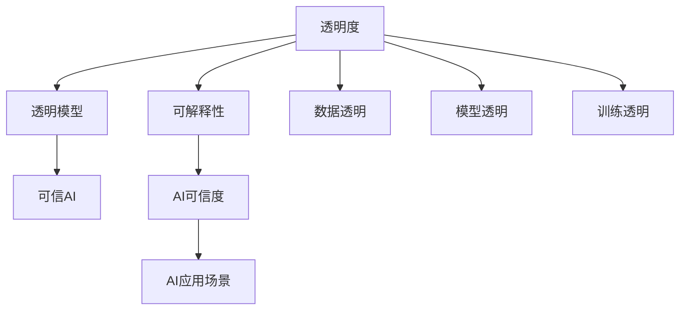

                 

# 透明度与可解释性：增强人工智能的可信

> 关键词：人工智能(AI)可信度, 可解释性(Explainability), 透明度(Transparency), 透明模型(Transparent Model), 可信AI(Trustworthy AI), 公平性(Fairness)

## 1. 背景介绍

### 1.1 问题由来
在人工智能(AI)技术蓬勃发展的今天，人们对其的期待也日益增高。无论是在医疗、金融、教育等传统领域，还是在自动驾驶、智能制造等新兴行业，AI技术的广泛应用极大地提升了效率和准确性。然而，随着AI系统的复杂性和智能度的提升，公众对其决策过程的透明性和可解释性提出了更高的要求。

**透明度**和**可解释性**是AI可信性的重要组成部分。透明度指模型决策过程的公开性和可理解性，可解释性指模型预测结果的可理解性和合理性。在诸如医疗诊断、金融风控、自动驾驶等高风险领域，模型的透明性和可解释性尤为重要，直接影响到决策的正确性和公众信任度。

## 2. 核心概念与联系

### 2.1 核心概念概述

要深入理解透明度和可解释性，首先需要明确以下几个核心概念：

- **透明度(Transparency)**：指模型的决策过程、参数和训练方法是否公开透明，能否被用户理解和验证。透明度是构建可信AI的基础。

- **可解释性(Explainability)**：指模型的预测结果和决策依据是否能够被用户理解和接受，即是否具有可解释性。可解释性是提升AI系统可信度的关键。

- **透明模型(Transparent Model)**：指模型内部结构、参数和训练过程可以被公开查看和理解的模型。透明模型在保证透明度的同时，能够兼顾性能。

- **可信AI(Trustworthy AI)**：指在安全性、公正性、透明性、可靠性等维度上可信的AI系统，能够被用户信任和依赖。

这些概念之间的联系可以通过以下Mermaid流程图来展示：



这个流程图展示了大语言模型微调的关键概念及其之间的关系：

1. 透明度和可解释性是构建可信AI的基础。
2. 透明模型是保证透明度的重要手段，同时能够实现较好的性能。
3. 可信AI需要同时在多个维度（安全性、公正性、透明性、可靠性）上达到高标准。
4. 数据透明、模型透明和训练透明是保证透明度的关键措施。

## 3. 核心算法原理 & 具体操作步骤
### 3.1 算法原理概述

透明度和可解释性的提升，通常依赖于对模型决策过程的分析和理解。具体而言，可以从以下几个方面入手：

1. **模型输出可解释**：通过定义明确的输出规则和可解释性指标，使用户能够理解模型的预测结果。
2. **模型参数可解释**：通过分析模型参数和特征权重，揭示模型的内在规律和决策依据。
3. **模型训练可解释**：通过训练数据的来源和选择，训练过程的控制和调整，确保模型决策的透明和公正。

### 3.2 算法步骤详解

以下是提升模型透明度和可解释性的详细步骤：

**Step 1: 数据透明**
- 确保数据来源可靠、无偏见。
- 数据标注和清洗规范、准确。
- 提供数据集分样本的统计信息。

**Step 2: 模型透明**
- 使用透明模型架构（如决策树、线性模型、神经网络等）。
- 尽量减少模型复杂度，避免"黑箱"结构。
- 公开模型参数和结构，允许用户查看。

**Step 3: 训练透明**
- 定义明确的训练目标和指标。
- 使用公开的训练方法和流程。
- 记录训练过程中的各项指标和超参数调整。

**Step 4: 可解释性分析**
- 定义可解释性指标，如特征重要性、局部可解释性等。
- 使用可解释性方法，如LIME、SHAP、Attention机制等。
- 生成可解释性报告，向用户展示模型决策依据。

### 3.3 算法优缺点

提升透明度和可解释性的方法，具有以下优点：
1. 提升用户信任度：清晰透明的模型更容易获得用户信任，从而增强AI系统的可信度。
2. 提高决策质量：通过深入分析模型决策依据，可以发现和纠正错误决策，提升AI系统的性能。
3. 促进公平性：透明和可解释的AI系统更容易发现和纠正偏见，确保决策公正。

同时，这些方法也存在一些局限：
1. 模型性能下降：过于复杂的模型可能无法完全解释，牺牲部分性能。
2. 解释方法复杂：可解释性分析方法复杂，需要专业知识，难以大规模推广。
3. 数据隐私问题：在公开数据和模型参数时，可能涉及用户隐私和数据安全问题。

尽管存在这些局限，但为了构建可信的AI系统，提升透明度和可解释性是必要的。在实际应用中，需要根据具体情况进行取舍，权衡模型性能和透明度的关系。

### 3.4 算法应用领域

透明度和可解释性在多个AI应用领域中具有重要意义：

- **医疗诊断**：医疗AI系统需要解释其诊断过程和结果，以获得医生的信任和患者的理解。透明性高的模型能够更好地融入医疗团队，提升诊疗效果。
- **金融风控**：金融风控AI系统需要对决策过程和依据进行解释，确保决策公正、透明，避免金融风险。
- **自动驾驶**：自动驾驶系统需要解释其决策过程，确保行车安全和可靠。透明性高的模型能够增强乘客和社会的信任。
- **智能客服**：智能客服系统需要对用户问题和回答过程进行解释，提升用户满意度和信任度。

## 4. 数学模型和公式 & 详细讲解 & 举例说明

### 4.1 数学模型构建

为了更好地理解透明性和可解释性的数学模型，这里将介绍几个关键模型及其构建方法：

- **线性模型**：假设输入为 $x=(x_1,x_2,...,x_n)$，输出为 $y$，线性模型可以表示为 $y = \theta_0 + \sum_{i=1}^n \theta_i x_i$。其中 $\theta_0$ 和 $\theta_i$ 为模型参数。

- **决策树模型**：通过树形结构将输入特征分割成不同类别，每个节点表示一个特征，每条路径表示一种分类规则。模型输出为路径上特征取值的加权和。

- **神经网络模型**：通过多层神经元实现复杂的非线性映射，每个神经元的输出作为下一层输入。模型参数包括权重和偏置。

### 4.2 公式推导过程

以线性模型为例，推导其可解释性指标。

假设线性模型为 $y = \theta_0 + \sum_{i=1}^n \theta_i x_i$，其中 $\theta_0$ 和 $\theta_i$ 为模型参数，$x_i$ 为输入特征。定义特征权重向量 $\boldsymbol{\theta}$，则：

$$
\boldsymbol{\theta} = \begin{bmatrix} \theta_0 \\ \theta_1 \\ \vdots \\ \theta_n \end{bmatrix}
$$

模型的预测输出为 $y = \boldsymbol{\theta}^T \boldsymbol{x}$，其中 $\boldsymbol{x} = \begin{bmatrix} 1 \\ x_1 \\ \vdots \\ x_n \end{bmatrix}$。特征权重 $\theta_i$ 表示特征 $x_i$ 对输出的贡献度，可以作为可解释性指标。

### 4.3 案例分析与讲解

下面以一个简单的金融风控案例，说明如何通过数学模型提升透明度和可解释性。

假设有一项金融风控任务，目标是预测借款人是否会违约。数据集包含多个特征，如收入、年龄、职业等。使用线性模型进行预测，模型参数为 $\boldsymbol{\theta}$。

**Step 1: 数据透明**

- 确保数据来源可靠，无偏见。
- 数据标注规范，标注者通过标准协议进行标注。
- 提供数据集的样本分布统计信息，如年龄、收入、职业等的分布。

**Step 2: 模型透明**

- 使用线性模型，参数为 $\boldsymbol{\theta}$。
- 模型结构简单透明，易于理解和解释。

**Step 3: 训练透明**

- 定义明确的训练目标，如最小化违约率。
- 使用公开的训练方法，如随机梯度下降。
- 记录训练过程中的各项指标，如损失函数、准确率、召回率等。

**Step 4: 可解释性分析**

- 使用可解释性方法，如LIME，对模型进行可解释性分析。
- 输出特征权重，表示各特征对预测结果的影响程度。
- 生成可解释性报告，向用户展示模型的决策依据。

## 5. 项目实践：代码实例和详细解释说明
### 5.1 开发环境搭建

在进行透明度和可解释性实践前，需要先搭建开发环境。以下是使用Python进行TensorFlow开发的完整环境配置流程：

1. 安装Anaconda：从官网下载并安装Anaconda，用于创建独立的Python环境。

2. 创建并激活虚拟环境：
```bash
conda create -n tf-env python=3.8 
conda activate tf-env
```

3. 安装TensorFlow：从官网获取对应的安装命令。例如：
```bash
conda install tensorflow
```

4. 安装TensorBoard：
```bash
conda install tensorboard
```

5. 安装TensorFlow Addons：
```bash
conda install tensorflow-addons
```

6. 安装相关库：
```bash
pip install numpy pandas scikit-learn jupyter notebook
```

完成上述步骤后，即可在`tf-env`环境中开始透明性和可解释性的实现。

### 5.2 源代码详细实现

接下来，我们以一个简单的线性回归任务为例，给出使用TensorFlow实现透明度和可解释性的完整代码实现。

首先，定义数据集：

```python
import tensorflow as tf
import numpy as np

# 定义训练数据
x_train = np.array([[1.0], [2.0], [3.0], [4.0], [5.0]])
y_train = np.array([[0.0], [1.0], [2.0], [3.0], [4.0]])

# 定义测试数据
x_test = np.array([[6.0], [7.0]])
y_test = np.array([[5.0], [6.0]])

# 定义特征和标签
x_train = x_train[:, np.newaxis]
x_test = x_test[:, np.newaxis]
```

然后，定义线性模型和优化器：

```python
# 定义线性模型
model = tf.keras.Sequential([
    tf.keras.layers.Dense(units=1, input_shape=[1])
])

# 定义优化器
optimizer = tf.keras.optimizers.Adam(learning_rate=0.01)
```

接着，定义训练和评估函数：

```python
def train_model(model, x_train, y_train, epochs):
    # 定义损失函数和评估指标
    loss_fn = tf.keras.losses.MeanSquaredError()
    metrics = [tf.keras.metrics.MeanAbsoluteError()]

    # 训练模型
    model.compile(optimizer=optimizer, loss=loss_fn, metrics=metrics)
    model.fit(x_train, y_train, epochs=epochs, verbose=0)

def evaluate_model(model, x_test, y_test):
    # 评估模型
    loss, mae = model.evaluate(x_test, y_test)
    print(f"Test loss: {loss:.3f}, MAE: {mae:.3f}")
```

最后，启动训练流程并在测试集上评估：

```python
epochs = 100

train_model(model, x_train, y_train, epochs)
evaluate_model(model, x_test, y_test)
```

以上就是使用TensorFlow实现透明性和可解释性的完整代码实现。可以看到，TensorFlow提供了丰富的工具和库，使透明度和可解释性的实现变得相对简单高效。

### 5.3 代码解读与分析

让我们再详细解读一下关键代码的实现细节：

**线性模型定义**：
- 使用`tf.keras.Sequential`定义线性模型，包含一个`Dense`层，表示线性回归。

**训练过程**：
- 使用`model.compile`方法定义损失函数和评估指标，如均方误差损失和平均绝对误差。
- 使用`model.fit`方法进行模型训练，指定训练数据、迭代次数和训练模式。

**评估过程**：
- 使用`model.evaluate`方法进行模型评估，返回损失和评估指标。

这些代码实现展示了如何使用TensorFlow进行简单的透明度和可解释性实验。在实际应用中，还需要结合更多的数据处理和模型优化技术，才能得到理想的效果。

## 6. 实际应用场景
### 6.1 医疗诊断系统

在医疗领域，透明性和可解释性对于构建可信的诊断系统至关重要。患者和医生对AI系统的诊断结果和过程需要清晰、透明的理解，以便做出准确的决策。

以医学影像分析为例，AI系统可以通过对影像特征的提取和分类，预测病灶的类型和位置。在训练和推理过程中，可以通过输出特征权重和可视化解释图，帮助医生理解模型的决策依据。

### 6.2 金融风控系统

金融风控系统需要对客户的信用风险进行评估，透明性和可解释性可以帮助用户理解风险评估过程和依据。AI系统可以通过对历史数据的分析，预测客户的违约概率。在训练和推理过程中，可以使用可解释性方法，如LIME，生成可解释性报告，展示模型对不同特征的依赖程度。

### 6.3 自动驾驶系统

自动驾驶系统需要高透明性和可解释性，以确保行车安全和可靠。AI系统可以通过对传感器数据的分析，预测路面的障碍物和交通状况。在训练和推理过程中，可以通过输出特征权重和可视化解释图，帮助用户理解模型的决策依据。

### 6.4 智能客服系统

智能客服系统需要透明性和可解释性，以增强用户信任。AI系统可以通过对用户问题的理解，提供相关的回答和建议。在训练和推理过程中，可以使用可解释性方法，如LIME，生成可解释性报告，展示模型对不同问题的依赖程度。

## 7. 工具和资源推荐
### 7.1 学习资源推荐

为了帮助开发者系统掌握透明度和可解释性的理论基础和实践技巧，这里推荐一些优质的学习资源：

1. **《机器学习透明性与可解释性》**：本书深入浅出地介绍了透明性和可解释性的基本概念和常见方法。

2. **Kaggle的机器学习竞赛**：Kaggle上有许多涉及透明性和可解释性的竞赛，可以帮助开发者实践和提升。

3. **Google AI博客**：Google AI博客提供了许多关于透明度和可解释性的前沿研究成果和实践经验。

4. **NIPS 2017研讨会**：该研讨会聚焦于机器学习的透明性和可解释性，汇集了许多学界的最新研究进展。

5. **机器学习课程**：如Coursera上的《机器学习》课程，涵盖了许多透明性和可解释性的重要内容。

通过对这些资源的学习实践，相信你一定能够快速掌握透明度和可解释性的精髓，并用于解决实际的AI问题。

### 7.2 开发工具推荐

高效的开发离不开优秀的工具支持。以下是几款用于透明度和可解释性开发的常用工具：

1. **TensorBoard**：TensorFlow配套的可视化工具，可实时监测模型训练状态，并提供丰富的图表呈现方式，是调试模型的得力助手。

2. **SHAP**：提供可解释性分析方法，通过输出特征贡献度，帮助用户理解模型的决策依据。

3. **LIME**：提供局部可解释性方法，生成解释性图表，展示模型在每个样本上的预测过程。

4. **TabNet**：一种高效的可解释性决策树算法，支持模型的透明性和可解释性。

5. **OpenAI的d3rlab**：提供基于深度学习的强化学习算法的透明性和可解释性分析。

合理利用这些工具，可以显著提升透明度和可解释性任务的开发效率，加快创新迭代的步伐。

### 7.3 相关论文推荐

透明性和可解释性在AI研究中得到了广泛关注，以下是几篇奠基性的相关论文，推荐阅读：

1. **《A Few Useful Things to Know About Model Interpretability》**：论文从理论和实践两方面详细介绍了模型可解释性的基本概念和方法。

2. **《Interpretable Machine Learning》**：由学家Pedro Domingos撰写，系统介绍了透明性和可解释性的重要性和常见方法。

3. **《Explainable Artificial Intelligence: Impacts, Challenges, and Methods》**：综述了当前透明性和可解释性的研究成果和应用场景。

4. **《From Complexity to Comprehension: Visualization and Explanation for Deep Networks》**：介绍了可视化技术在模型解释中的应用。

5. **《Making Black Box Deep Learning Models Explainable》**：探讨了黑箱模型可解释性的方法和工具，提供了大量的实用技巧。

这些论文代表了大语言模型微调技术的发展脉络。通过学习这些前沿成果，可以帮助研究者把握学科前进方向，激发更多的创新灵感。

## 8. 总结：未来发展趋势与挑战

### 8.1 总结

本文对透明度和可解释性进行了全面系统的介绍。首先阐述了透明性和可解释性的研究背景和意义，明确了透明性和可解释性在构建可信AI中的重要性。其次，从原理到实践，详细讲解了透明度和可解释性的数学原理和关键步骤，给出了透明性和可解释性任务开发的完整代码实例。同时，本文还广泛探讨了透明性和可解释性在医疗、金融、自动驾驶等众多领域的应用前景，展示了其巨大的潜力和价值。最后，本文精选了透明性和可解释性的各类学习资源，力求为读者提供全方位的技术指引。

通过本文的系统梳理，可以看到，透明性和可解释性是大语言模型微调技术的重要组成部分，对于构建可信的AI系统至关重要。这些技术的深入研究和应用，将为AI技术的发展带来更加光明的未来。

### 8.2 未来发展趋势

展望未来，透明度和可解释性将呈现以下几个发展趋势：

1. **多模态融合**：未来的AI系统将融合多种数据源和模态，如视觉、语音、文本等，提高系统的复杂性和可解释性。

2. **自动化可解释性**：随着自动化可解释性技术的发展，模型将能够自动生成可解释性报告，减少人工干预。

3. **跨领域应用**：透明性和可解释性将在更多领域得到应用，如医疗、金融、自动驾驶等，提升这些领域的智能化水平。

4. **模型压缩和优化**：未来的AI系统需要高效、轻量，透明性和可解释性方法需要结合模型压缩和优化技术，提升系统的性能和可解释性。

5. **伦理和隐私保护**：透明性和可解释性方法需要考虑伦理和隐私保护问题，确保数据和模型安全。

以上趋势凸显了透明度和可解释性技术的广阔前景。这些方向的探索发展，必将进一步提升AI系统的性能和应用范围，为构建安全、可靠、可解释、可控的智能系统铺平道路。

### 8.3 面临的挑战

尽管透明性和可解释性技术已经取得了一定的进展，但在迈向更加智能化、普适化应用的过程中，它仍面临诸多挑战：

1. **模型复杂度**：过于复杂的模型可能难以完全解释，牺牲部分性能。

2. **解释方法复杂**：可解释性分析方法复杂，需要专业知识，难以大规模推广。

3. **数据隐私问题**：在公开数据和模型参数时，可能涉及用户隐私和数据安全问题。

4. **解释结果可理解性**：生成的可解释性报告是否易于理解，是否符合用户需求，仍需进一步优化。

5. **多模型融合问题**：在多模型融合场景中，如何生成统一的解释性报告，仍然是一大挑战。

尽管存在这些挑战，但为了构建可信的AI系统，透明性和可解释性技术仍然需要持续推进。未来研究需要在更多领域进行深入探索，提升模型的透明性和可解释性。

### 8.4 研究展望

面对透明性和可解释性所面临的挑战，未来的研究需要在以下几个方面寻求新的突破：

1. **多模态可解释性**：开发适用于多种数据源和模态的可解释性方法，提升模型的复杂性和可解释性。

2. **自动化可解释性**：探索自动化可解释性技术，自动生成可解释性报告，减少人工干预。

3. **伦理和隐私保护**：结合伦理和隐私保护技术，确保数据和模型安全。

4. **模型压缩和优化**：结合模型压缩和优化技术，提升系统的性能和可解释性。

5. **多模型融合**：开发适用于多模型融合的可解释性方法，生成统一的解释性报告。

这些研究方向的探索，必将引领透明性和可解释性技术迈向更高的台阶，为构建安全、可靠、可解释、可控的智能系统铺平道路。面向未来，透明性和可解释性技术还需要与其他人工智能技术进行更深入的融合，如知识表示、因果推理、强化学习等，多路径协同发力，共同推动自然语言理解和智能交互系统的进步。只有勇于创新、敢于突破，才能不断拓展语言模型的边界，让智能技术更好地造福人类社会。

## 9. 附录：常见问题与解答

**Q1：透明度和可解释性是否适用于所有AI任务？**

A: 透明度和可解释性在大多数AI任务上都有重要应用，特别是对于高风险、高影响的任务，如医疗诊断、金融风控、自动驾驶等。但对于一些简单、低风险的任务，透明度和可解释性可能并不是必要条件。

**Q2：如何选择合适的透明性和可解释性方法？**

A: 选择合适的透明性和可解释性方法，需要根据具体任务和数据特点进行评估。一般而言，可以从以下几个方面考虑：
1. 模型的复杂度和可解释性需求。
2. 数据的类型和特征分布。
3. 用户对可解释性的需求和期望。

**Q3：如何平衡模型性能和透明性？**

A: 在模型设计和训练过程中，需要权衡模型性能和透明性。一般来说，可以通过以下方法平衡两者：
1. 简化模型结构，减少复杂度。
2. 使用特征选择方法，提取关键特征。
3. 结合可解释性方法，生成可解释性报告。

**Q4：在实际应用中，如何处理隐私和安全问题？**

A: 在实际应用中，需要综合考虑隐私和安全问题，采取以下措施：
1. 数据匿名化处理，避免个人隐私泄露。
2. 访问控制和权限管理，确保数据和模型安全。
3. 定期审计和监控，及时发现和修复安全漏洞。

**Q5：如何提升透明性和可解释性分析的可理解性？**

A: 提升透明性和可解释性分析的可理解性，可以从以下几个方面入手：
1. 使用可视化工具，生成易于理解的图表。
2. 简明扼要地解释分析结果，避免使用过于专业化的术语。
3. 在报告中引入示例数据，帮助用户理解分析结果。

这些措施将有助于提升透明性和可解释性分析的可理解性，增强用户信任和接受度。

---

作者：禅与计算机程序设计艺术 / Zen and the Art of Computer Programming

