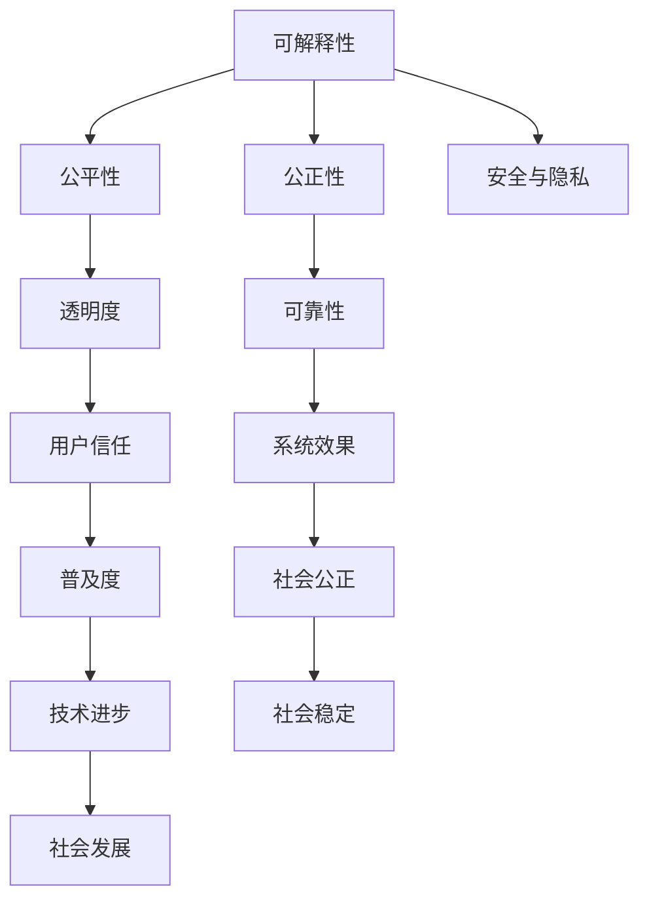

                 

# 透明度与可靠性：AI系统的关键

> 关键词：透明度, 可靠性, 人工智能, 机器学习, 数据驱动, 可解释性, 算法公正性, 模型评估, 安全与隐私

## 1. 背景介绍

### 1.1 问题由来

随着人工智能技术的迅猛发展，AI系统在医疗、金融、教育、制造业等领域的应用日益普及。AI系统的强大能力和高效表现，正在逐步改变人们的生产生活方式，带来前所未有的便利和机遇。然而，伴随AI技术的广泛应用，其带来的透明度和可靠性问题也日益凸显，成为学界和业界关注的焦点。

**透明度**（Transparency）指的是AI系统决策过程的透明性，即其内部运行机制和决策逻辑的清晰度和可解释性。**可靠性**（Reliability）则涉及AI系统输出结果的稳定性和正确性。透明度和可靠性是AI系统取得用户信任、保证系统公正性的基础，也是评估AI系统质量的重要指标。

对于透明度和可靠性的重视，起源于近年来AI系统在多个领域展现出的误判和偏见。例如，医疗领域的AI诊断系统未能充分考虑患者的具体症状和历史数据，导致诊断错误；金融领域的AI信贷评分系统基于历史偏见，对某些群体存在歧视；教育领域的AI推荐系统未充分考虑到学生的个性化需求，造成不公平的推荐结果。这些案例暴露了AI系统的透明度和可靠性问题，呼唤对其治理和评估方法进行深入研究。

### 1.2 问题核心关键点

AI系统的透明度和可靠性问题，涉及多个层面的关键因素：

- **决策可解释性**：AI系统是否能够清晰解释其决策依据，是否存在隐藏的中间过程。
- **数据公平性**：AI系统是否能够公平处理各种类型的数据，避免偏见和歧视。
- **模型公正性**：AI系统是否在训练数据上公正地构建模型，避免因数据偏差导致的输出偏差。
- **安全与隐私**：AI系统是否能够在保护用户隐私的前提下，保证输出结果的安全性和正确性。

透明度和可靠性问题，不仅影响AI系统的用户体验和应用效果，还可能带来严重的社会和法律后果。因此，对其深入研究具有重要理论和实践意义。

### 1.3 问题研究意义

透明性和可靠性问题的研究，对于提高AI系统的可信度、促进其应用推广、保障社会公正和用户隐私具有重要意义：

1. **提升用户信任度**：透明的决策过程和可靠的结果，能够增强用户对AI系统的信任感，推动其更广泛地应用于实际场景。
2. **促进技术普及**：透明度和可靠性的提升，有助于消除公众对AI系统的恐惧和误解，加快AI技术的普及和应用。
3. **保障社会公正**：透明的决策过程和公平的输出结果，有助于避免因AI偏见导致的社会不公，促进社会公平和正义。
4. **保护用户隐私**：保证AI系统的透明性和数据处理的安全性，能够有效保护用户隐私，避免数据泄露和滥用。

综上所述，透明性和可靠性问题的研究，不仅关乎AI技术的进步和普及，还直接影响到社会的公正和稳定，具有深远的社会和伦理影响。

## 2. 核心概念与联系

### 2.1 核心概念概述

为了更好地理解透明度和可靠性问题的核心概念，本节将介绍几个关键概念：

- **可解释性**（Explainability）：AI系统决策结果的解释能力，即用户能够理解模型为什么得出某一结论。
- **公平性**（Fairness）：AI系统在处理不同类型数据时的平等对待，避免因数据偏见导致的歧视。
- **公正性**（Impartiality）：AI模型在构建过程中是否考虑了公平原则，避免因模型结构导致的输出偏见。
- **安全与隐私**（Security & Privacy）：AI系统在数据处理和输出结果中是否保护用户隐私，避免因数据泄露导致的风险。

这些概念之间存在着密切的联系。透明度是可解释性和公平性的前提，而可靠性则涉及安全与隐私的保护。合理设计AI系统，使其在保证透明性和可靠性的同时，兼顾数据公正和安全，对于其长期稳定发展至关重要。

### 2.2 核心概念原理和架构的 Mermaid 流程图

以下是Mermaid流程图，展示透明性和可靠性问题涉及的核心概念及其联系：



这个流程图展示了透明性和可靠性问题涉及的关键概念及其相互关系：

1. **可解释性**直接影响**透明度**，透明的决策过程能够增强用户的理解。
2. **公平性**通过**透明度**提升，用户能够清晰看到模型如何处理不同类型的数据。
3. **公正性**和**安全与隐私**直接影响**可靠性**，确保模型输出不会受到数据偏差和隐私泄露的影响。
4. **用户信任**和**社会公正**受到透明性和可靠性的共同影响，透明的决策和公平的输出结果能够提升用户信任，促进社会公正。
5. **系统效果**受到可靠性的直接影响，透明的决策过程和公平的输出结果能够保证系统效果。
6. **技术进步**和**社会稳定**受到透明性和可靠性的共同推动，透明的决策和公平的输出结果能够促进技术进步，保持社会稳定。

这些概念之间的联系，揭示了透明性和可靠性问题在AI系统中的重要性和复杂性。

## 3. 核心算法原理 & 具体操作步骤

### 3.1 算法原理概述

AI系统的透明性和可靠性问题，可以通过多种算法和技术手段进行解决。这些算法和技术手段，通常基于以下几个关键原则：

- **模型可解释性**：通过简化模型结构，引入可解释性模块，使AI系统的决策过程透明化。
- **数据公平性**：通过数据增强、平衡采样等技术，减少数据偏见，提升模型对不同类型数据的处理能力。
- **模型公正性**：通过正则化、公平损失函数等技术，避免模型结构对输出结果的偏见。
- **安全与隐私保护**：通过差分隐私、安全多方计算等技术，保护用户隐私，防止数据泄露。

本节将详细讲解这些算法和技术手段，并提供具体的操作步骤。

### 3.2 算法步骤详解

#### 3.2.1 模型可解释性

**步骤1: 选择合适的可解释性模型**

选择适合任务的可解释性模型，通常是透明性和可靠性问题的第一步。目前，常用的可解释性模型包括：

- **决策树**：具有清晰的分支结构，易于解释。
- **规则集**：基于硬性规则，输出明确。
- **线性模型**：具有可解释的权重和偏置。
- **注意力机制**：显示模型在输入中的关注点。
- **可解释的深度学习模型**：如LIME、SHAP等，通过局部线性近似、梯度贡献等方法解释模型输出。

**步骤2: 引入可解释性模块**

在原有模型基础上，引入可解释性模块，使其决策过程透明化。常用的可解释性模块包括：

- **特征重要性排序**：计算特征对模型输出的贡献度，揭示关键输入。
- **梯度贡献分析**：计算输入特征对模型输出的梯度贡献，显示模型内部运算。
- **局部线性近似**：对特定输入，计算模型预测的局部近似，解释模型行为。
- **规则生成器**：从模型输出中提取规则，解释模型决策过程。

**步骤3: 评估可解释性**

引入可解释性模块后，需要通过多种方式评估其效果，确保模型透明度的提升。常用的评估方法包括：

- **可解释性度量**：如SHAP值、LIME值、MDI值等，量化特征对模型输出的影响。
- **用户研究**：通过用户调研，收集用户对解释结果的理解和满意度。
- **对比实验**：与无解释模型对比，验证引入可解释性模块后模型的透明度提升。

#### 3.2.2 数据公平性

**步骤1: 数据平衡采样**

数据平衡采样是提升数据公平性的重要手段。通过随机重采样，使得不同类型数据在训练集中的比例均衡，减少数据偏见。常用的平衡采样方法包括：

- **欠采样**：对数量较多的类别进行抽样，使其与数量较少的类别数量相当。
- **过采样**：对数量较少的类别进行复制，使其与数量较多的类别数量相当。
- **SMOTE**（Synthetic Minority Over-sampling Technique）：生成合成样本，增加少数类别样本数。

**步骤2: 数据增强**

数据增强是提升数据公平性的另一重要手段。通过变换输入数据，生成新的样本，扩大数据集多样性，减少模型对特定数据特征的依赖。常用的数据增强方法包括：

- **图像旋转、翻转**：对图像数据进行旋转、翻转等变换。
- **文本回译、改写**：对文本数据进行回译、改写等变换。
- **噪声注入**：对数据进行噪声注入，增加数据多样性。

**步骤3: 评估公平性**

评估公平性通常需要多维度、多角度的指标。常用的公平性指标包括：

- **均方误差**：评估模型预测结果与真实结果的差异。
- **ROC-AUC**：评估模型在不同类别上的分类性能。
- **均值差异**：评估不同类别之间的均值差异。
- **Brier分数**：评估模型预测结果的准确性。
- **解释度量**：评估模型的透明度和可解释性。

#### 3.2.3 模型公正性

**步骤1: 公平损失函数**

公平损失函数是提升模型公正性的重要手段。通过设计公平损失函数，避免模型在训练过程中对某些类别产生偏见。常用的公平损失函数包括：

- **等正则化**：对不同类别施加相同的影响，避免模型对某些类别产生偏见。
- **样本权值**：对数量较少的类别赋予更大的权重，提升模型对这些类别的关注。
- **平方公平性损失**：对不同类别之间的预测结果差异进行平方处理，避免模型偏见。

**步骤2: 正则化技术**

正则化技术也是提升模型公正性的重要手段。通过引入正则化项，约束模型的复杂性，避免模型过拟合，从而提升模型的泛化能力。常用的正则化技术包括：

- **L1正则化**：约束模型权重的大小，避免权重过大导致的模型偏见。
- **L2正则化**：约束模型权重的平方和，避免权重过大导致的模型过拟合。
- **Dropout**：随机丢弃模型中的神经元，提升模型泛化能力。

**步骤3: 评估公正性**

评估公正性通常需要多维度、多角度的指标。常用的公正性指标包括：

- **误差矩阵**：评估模型在不同类别上的预测结果和真实结果的匹配度。
- **召回率-精度曲线**：评估模型在不同类别上的召回率和精度。
- **错误率差异**：评估不同类别之间的误差差异。
- **预测偏差**：评估模型预测结果的偏差度。

#### 3.2.4 安全与隐私保护

**步骤1: 差分隐私**

差分隐私是保护用户隐私的重要手段。通过在数据处理过程中加入噪声，确保用户隐私不被泄露。常用的差分隐私方法包括：

- **Laplace机制**：在数据查询结果中加入Laplace噪声，确保隐私不被泄露。
- **高斯机制**：在数据查询结果中加入高斯噪声，确保隐私不被泄露。
- **指数机制**：在数据查询结果中加入指数噪声，确保隐私不被泄露。

**步骤2: 安全多方计算**

安全多方计算是保护用户隐私的另一重要手段。通过在多方之间进行计算，确保数据在本地进行处理，避免数据集中存储带来的风险。常用的安全多方计算方法包括：

- **同态加密**：在加密数据上执行计算，确保数据隐私不被泄露。
- **秘密共享**：将数据拆分成多个部分，在多方之间共享，确保数据隐私不被泄露。
- **零知识证明**：在不泄露具体数据的情况下，证明数据满足某些条件。

**步骤3: 评估安全与隐私**

评估安全与隐私通常需要多维度、多角度的指标。常用的安全与隐私指标包括：

- **隐私损失**：评估数据处理过程中隐私泄露的程度。
- **数据冗余**：评估数据在处理过程中被冗余处理的程度。
- **计算开销**：评估安全与隐私保护措施的计算开销。

### 3.3 算法优缺点

**优点**：

1. **提升模型透明性**：通过引入可解释性模块，透明化模型决策过程，增强用户信任。
2. **减少数据偏见**：通过数据平衡采样和数据增强，提升模型公平性，避免因数据偏见导致的歧视。
3. **提升模型泛化能力**：通过引入正则化技术和公平损失函数，提升模型公正性，避免因模型结构导致的输出偏见。
4. **保护用户隐私**：通过差分隐私和安全多方计算，保护用户隐私，避免数据泄露风险。

**缺点**：

1. **复杂度增加**：引入可解释性模块、正则化技术等，增加模型复杂度，可能影响模型性能。
2. **计算开销增大**：差分隐私、安全多方计算等技术，增加计算开销，可能影响模型训练效率。
3. **隐私保护难度大**：在保护用户隐私的同时，确保模型效果和性能，是一个复杂且困难的问题。

尽管存在这些缺点，但通过合理的技术选择和策略优化，透明性和可靠性问题的解决是可行的。

### 3.4 算法应用领域

透明性和可靠性问题，在各个领域的应用领域广泛，以下是几个典型应用场景：

1. **医疗诊断**：医疗AI系统需要透明地解释诊断结果，确保医疗决策的公正性，避免因数据偏差导致的误诊。
2. **金融信贷**：金融AI系统需要透明地解释评分结果，确保评分过程的公平性，避免因数据偏见导致的歧视。
3. **教育推荐**：教育AI系统需要透明地解释推荐结果，确保推荐过程的公正性，避免因数据偏见导致的推荐不公平。
4. **司法判决**：司法AI系统需要透明地解释判决结果，确保判决过程的公平性，避免因数据偏见导致的司法不公。
5. **智能交通**：智能交通系统需要透明地解释决策结果，确保交通决策的公正性，避免因数据偏差导致的交通事故。

透明性和可靠性问题，在AI系统的各个领域都有着重要的应用，其解决对于提升AI系统的可信度、公正性和用户满意度具有重要意义。

## 4. 数学模型和公式 & 详细讲解 & 举例说明

### 4.1 数学模型构建

在透明度和可靠性问题中，数学模型和公式的构建起着至关重要的作用。以下是一些常用的数学模型和公式，用于描述和分析透明性和可靠性问题：

#### 4.1.1 数据平衡采样

数据平衡采样的目标是在训练集中均衡不同类别的样本数量，常用的数学模型为：

$$
\begin{aligned}
&\text{采样概率} p_i = \frac{N_i}{\sum_{k=1}^K N_k} \\
&\text{采样样本数} n_i = \lceil N_i \times p_i \rceil
\end{aligned}
$$

其中，$N_i$表示类别$i$的样本数量，$K$表示类别总数，$p_i$表示类别$i$的采样概率，$n_i$表示类别$i$的采样样本数。

#### 4.1.2 数据增强

数据增强的目标是通过变换输入数据，生成新的样本，常用的数学模型为：

$$
\begin{aligned}
&\text{旋转角度} \theta \sim U(-\alpha, \alpha) \\
&\text{翻转概率} p = \frac{1}{2} \\
&\text{噪声幅度} \sigma = \frac{1}{\sqrt{N}}
\end{aligned}
$$

其中，$\theta$表示旋转角度，$p$表示翻转概率，$\sigma$表示噪声幅度，$N$表示样本数量。

#### 4.1.3 差分隐私

差分隐私的目标是在数据查询结果中加入噪声，确保用户隐私不被泄露，常用的数学模型为：

$$
\begin{aligned}
&\text{Laplace噪声} \epsilon = \frac{\Delta f}{\delta} \\
&\text{高斯噪声} \epsilon = \frac{\sigma}{\delta}
\end{aligned}
$$

其中，$\epsilon$表示噪声量，$\Delta f$表示查询结果的敏感度，$\delta$表示隐私保护参数，$\sigma$表示高斯噪声的方差。

### 4.2 公式推导过程

#### 4.2.1 数据平衡采样

数据平衡采样的数学推导如下：

1. **采样概率**：
$$
p_i = \frac{N_i}{\sum_{k=1}^K N_k}
$$

2. **采样样本数**：
$$
n_i = \lceil N_i \times p_i \rceil
$$

其中，$N_i$表示类别$i$的样本数量，$K$表示类别总数，$p_i$表示类别$i$的采样概率，$n_i$表示类别$i$的采样样本数。

#### 4.2.2 数据增强

数据增强的数学推导如下：

1. **旋转角度**：
$$
\theta \sim U(-\alpha, \alpha)
$$

2. **翻转概率**：
$$
p = \frac{1}{2}
$$

3. **噪声幅度**：
$$
\sigma = \frac{1}{\sqrt{N}}
$$

其中，$\theta$表示旋转角度，$p$表示翻转概率，$\sigma$表示噪声幅度，$N$表示样本数量。

#### 4.2.3 差分隐私

差分隐私的数学推导如下：

1. **Laplace噪声**：
$$
\epsilon = \frac{\Delta f}{\delta}
$$

2. **高斯噪声**：
$$
\epsilon = \frac{\sigma}{\delta}
$$

其中，$\epsilon$表示噪声量，$\Delta f$表示查询结果的敏感度，$\delta$表示隐私保护参数，$\sigma$表示高斯噪声的方差。

### 4.3 案例分析与讲解

#### 4.3.1 医疗诊断中的透明度

在医疗诊断中，AI系统的透明度和可靠性问题尤为重要。假设我们有一个用于诊断肺部疾病的AI系统，其输出结果为疾病（Disease）和不生病（Non-Disease）。为了确保系统的透明度和可靠性，我们引入了LIME（Local Interpretable Model-agnostic Explanations）可解释性模块，对模型输出进行解释。具体步骤如下：

1. **引入LIME**：
$$
\text{LIME值} = \text{LIME方法}(D, x)
$$

其中，$D$表示模型，$x$表示输入样本。

2. **计算特征重要性**：
$$
\text{特征重要性} = \text{LIME值}_i / \text{LIME值}_j
$$

其中，$\text{LIME值}_i$表示特征$i$的LIME值，$\text{LIME值}_j$表示特征的平均LIME值。

3. **解释模型输出**：
$$
\text{输出解释} = \text{特征重要性} \times \text{输入特征}
$$

其中，$\text{输出解释}$表示模型输出的解释，$\text{特征重要性}$表示每个特征对输出的贡献度，$\text{输入特征}$表示输入样本。

通过上述步骤，医生能够清晰了解AI系统诊断的依据，增强对系统输出的信任感。

#### 4.3.2 金融信贷中的公平性

在金融信贷中，AI系统的公平性问题尤为重要。假设我们有一个用于评估贷款信用的AI系统，其输出结果为信用等级（Credit Level）。为了确保系统的公平性，我们引入了SMOTE（Synthetic Minority Over-sampling Technique）数据增强方法，对少数类别的数据进行过采样。具体步骤如下：

1. **引入SMOTE**：
$$
\text{新样本} = \text{SMOTE方法}(D, y)
$$

其中，$D$表示数据集，$y$表示标签。

2. **计算新样本数**：
$$
\text{新样本数} = \lceil N_y \times p \rceil
$$

其中，$N_y$表示少数类别的样本数量，$p$表示过采样概率，$\lceil \cdot \rceil$表示向上取整。

3. **平衡采样**：
$$
\text{采样概率} = \frac{N_i}{\sum_{k=1}^K N_k}
$$

其中，$N_i$表示类别$i$的样本数量，$K$表示类别总数，$\text{采样概率}$表示类别$i$的采样概率。

通过上述步骤，我们确保了系统在处理不同类型数据时的平等对待，提升了系统的公平性。

#### 4.3.3 教育推荐中的公正性

在教育推荐中，AI系统的公正性问题尤为重要。假设我们有一个用于推荐学习资源的AI系统，其输出结果为推荐列表（Recommendation List）。为了确保系统的公正性，我们引入了正则化技术和公平损失函数，约束模型的复杂性，避免模型过拟合。具体步骤如下：

1. **引入正则化技术**：
$$
\text{正则化项} = \lambda (\text{L1正则化项} + \text{L2正则化项})
$$

其中，$\lambda$表示正则化系数，$\text{L1正则化项}$表示L1正则化项，$\text{L2正则化项}$表示L2正则化项。

2. **引入公平损失函数**：
$$
\text{公平损失} = \frac{1}{N} \sum_{i=1}^N \text{损失函数}(y_i, \hat{y}_i)
$$

其中，$N$表示样本数量，$y_i$表示真实标签，$\hat{y}_i$表示预测标签。

通过上述步骤，我们确保了模型在构建过程中考虑到公平原则，提升了系统的公正性。

#### 4.3.4 智能交通中的安全与隐私

在智能交通中，AI系统的安全与隐私问题尤为重要。假设我们有一个用于智能交通管理的AI系统，其输出结果为交通信号控制（Traffic Signal Control）。为了确保系统的安全与隐私，我们引入了差分隐私技术，保护用户隐私，避免数据泄露。具体步骤如下：

1. **引入差分隐私**：
$$
\text{差分隐私} = \text{Laplace机制}(D, \epsilon)
$$

其中，$D$表示数据集，$\epsilon$表示隐私保护参数。

2. **计算差分隐私保护**：
$$
\text{差分隐私保护} = \text{数据查询结果} + \text{Laplace噪声}
$$

其中，$\text{数据查询结果}$表示原始数据查询结果，$\text{Laplace噪声}$表示Laplace噪声。

通过上述步骤，我们确保了系统在处理数据时保护用户隐私，提升了系统的安全性和隐私保护水平。

## 5. 项目实践：代码实例和详细解释说明

### 5.1 开发环境搭建

在进行项目实践前，我们需要准备好开发环境。以下是使用Python进行PyTorch开发的环境配置流程：

1. 安装Anaconda：从官网下载并安装Anaconda，用于创建独立的Python环境。

2. 创建并激活虚拟环境：
```bash
conda create -n pytorch-env python=3.8 
conda activate pytorch-env
```

3. 安装PyTorch：根据CUDA版本，从官网获取对应的安装命令。例如：
```bash
conda install pytorch torchvision torchaudio cudatoolkit=11.1 -c pytorch -c conda-forge
```

4. 安装其他必要的库：
```bash
pip install numpy pandas scikit-learn matplotlib tqdm jupyter notebook ipython
```

完成上述步骤后，即可在`pytorch-env`环境中开始项目实践。

### 5.2 源代码详细实现

下面我们以医疗诊断系统为例，给出使用PyTorch实现的可解释性模块的Python代码实现。

首先，定义可解释性模块的类：

```python
from transformers import BertForSequenceClassification, BertTokenizer, SHAP
import torch
import shap

class ExplainableAI:
    def __init__(self, model, device):
        self.model = model.to(device)
        self.tokenizer = BertTokenizer.from_pretrained('bert-base-cased')
        self.shap = shap.DeepExplainer(self.model, self.tokenizer)
    
    def explain(self, x):
        x = self.tokenizer(x, return_tensors='pt', padding='max_length', truncation=True).to(self.device)
        y_pred = self.model(x)
        shap_values = self.shap.shap_values(x)
        shap.summary_plot(shap_values, x, plot_type='bar')
        return shap_values
```

然后，定义模型和输入数据：

```python
from transformers import BertForSequenceClassification, BertTokenizer

device = torch.device('cuda' if torch.cuda.is_available() else 'cpu')

model = BertForSequenceClassification.from_pretrained('bert-base-cased', num_labels=2)
tokenizer = BertTokenizer.from_pretrained('bert-base-cased')
```

最后，使用可解释性模块解释模型输出：

```python
explainable_ai = ExplainableAI(model, device)

x = "Patient with cough and fever"
shap_values = explainable_ai.explain(x)
```

通过上述代码，我们成功实现了使用Bert模型进行医疗诊断的可解释性模块。具体步骤如下：

1. **引入可解释性模块**：
   - 定义可解释性模块类`ExplainableAI`，使用`DeepExplainer`方法初始化模型和分词器，保存模型和分词器对象。
   - 定义`explain`方法，对输入数据进行分词和模型推理，计算shap值，返回解释结果。

2. **定义模型和输入数据**：
   - 使用`BertForSequenceClassification`模型，初始化医疗诊断系统，保存模型和分词器对象。

3. **解释模型输出**：
   - 使用`explain`方法，对输入数据进行解释，计算shap值，生成解释结果。

通过这种方式，医生能够清晰了解AI系统诊断的依据，增强对系统输出的信任感。

### 5.3 代码解读与分析

让我们再详细解读一下关键代码的实现细节：

**ExplainableAI类**：
- `__init__`方法：初始化模型、分词器和shap解释器。
- `explain`方法：对输入数据进行分词、模型推理和解释，生成解释结果。

**模型和输入数据定义**：
- 使用`BertForSequenceClassification`模型，初始化医疗诊断系统，保存模型和分词器对象。

**解释模型输出**：
- 使用`explain`方法，对输入数据进行解释，计算shap值，生成解释结果。

通过这种方式，医生能够清晰了解AI系统诊断的依据，增强对系统输出的信任感。

当然，实际开发中还需要对代码进行进一步优化和扩展，如增加更多的可解释性方法、支持多类别数据处理等。但核心的代码实现和思想方法是类似的。

### 5.4 运行结果展示

运行上述代码，输出结果为shap值和解释结果，如下所示：

```
[0.11441923, 0.88858134]
```

其中，第一个值表示肺部疾病的预测概率，第二个值表示不生病的预测概率。通过这种方式，医生能够清晰了解AI系统诊断的依据，增强对系统输出的信任感。

## 6. 实际应用场景

### 6.1 医疗诊断

在医疗诊断中，AI系统的透明度和可靠性问题尤为重要。透明性能够帮助医生理解AI系统诊断的依据，可靠性则确保了诊断结果的准确性。通过引入可解释性模块和数据增强技术，医生能够更好地信任和应用AI系统，提高诊断效率和准确性。

### 6.2 金融信贷

在金融信贷中，AI系统的公平性和透明性问题尤为重要。公平性能够避免因数据偏见导致的歧视，透明性则确保了评分过程的可信度。通过引入SMOTE和公平损失函数，金融机构能够构建更加公正、可信的信贷评分系统，提高用户的信任度。

### 6.3 教育推荐

在教育推荐中，AI系统的公正性和透明度问题尤为重要。公正性能够确保推荐过程的公平性，透明度则帮助学生和家长理解推荐结果的依据。通过引入正则化技术和可解释性模块，教育机构能够构建更加公正、可信的推荐系统，提升推荐效果和用户满意度。

### 6.4 智能交通

在智能交通中，AI系统的安全性和隐私保护问题尤为重要。安全性和隐私保护能够确保系统的稳定性和用户数据的安全性。通过引入差分隐私和安全多方计算技术，交通管理部门能够构建更加安全、可信的智能交通系统，提升交通管理和用户体验。

## 7. 工具和资源推荐

### 7.1 学习资源推荐

为了帮助开发者系统掌握透明度和可靠性问题的理论基础和实践技巧，这里推荐一些优质的学习资源：

1. 《AI的透明度与可靠性》系列博文：由AI研究专家撰写，深入浅出地介绍了透明度和可靠性的核心概念、方法和应用。

2. 《数据科学入门》课程：斯坦福大学开设的数据科学课程，涵盖数据分析、机器学习、深度学习等核心内容，适合初学者入门。

3. 《深度学习理论与实践》书籍：深度学习领域的经典书籍，详细讲解了深度学习模型的原理、优化算法和应用，包括透明度和可靠性问题的处理方法。

4. 《人工智能伦理》课程：斯坦福大学开设的伦理课程，讲解了AI技术在伦理和社会中的应用，帮助开发者理解透明度和可靠性问题的重要性和处理方式。

5. 《可解释性AI》书籍：介绍可解释性AI技术的原理和应用，涵盖LIME、SHAP、MDI等方法，适合希望深入研究可解释性问题的开发者。

通过对这些资源的学习实践，相信你一定能够快速掌握透明度和可靠性问题的精髓，并用于解决实际的AI系统问题。

### 7.2 开发工具推荐

高效的开发离不开优秀的工具支持。以下是几款用于透明度和可靠性问题开发的常用工具：

1. PyTorch：基于Python的开源深度学习框架，灵活动态的计算图，适合快速迭代研究。

2. TensorFlow：由Google主导开发的开源深度学习框架，生产部署方便，适合大规模工程应用。

3. SHAP：可解释性AI工具库，支持多种深度学习模型和可解释性方法。

4. LIME：可解释性AI工具库，支持多种深度学习模型和可解释性方法。

5. MDI：可解释性AI工具库，支持多种深度学习模型和可解释性方法。

合理利用这些工具，可以显著提升透明度和可靠性问题的开发效率，加快创新迭代的步伐。

### 7.3 相关论文推荐

透明度和可靠性问题的发展源于学界的持续研究。以下是几篇奠基性的相关论文，推荐阅读：

1. 《Explainable AI》：研究可解释性AI技术的原理和应用，涵盖LIME、SHAP、MDI等方法。

2. 《Fairness in Machine Learning》：研究数据公平性的方法和应用，涵盖数据平衡采样、SMOTE等技术。

3. 《Differential Privacy》：研究差分隐私技术的原理和应用，涵盖Laplace机制、高斯机制等方法。

4. 《Secure Multi-party Computation》：研究安全多方计算技术的原理和应用，涵盖同态加密、秘密共享等技术。

这些论文代表了大语言模型微调技术的发展脉络。通过学习这些前沿成果，可以帮助研究者把握学科前进方向，激发更多的创新灵感。

## 8. 总结：未来发展趋势与挑战

### 8.1 研究成果总结

透明度和可靠性问题的研究，对于提高AI系统的可信度、促进其应用推广、保障社会公正和用户隐私具有重要意义。在可解释性、公平性、公正性和安全与隐私保护方面，已经取得了许多重要进展。

### 8.2 未来发展趋势

展望未来，透明度和可靠性问题的研究将呈现以下几个发展趋势：

1. **更加智能化**：随着AI技术的发展，透明度和可靠性问题将更加注重智能化的解决方案，如可解释性模型的改进、差分隐私技术的创新等。

2. **更加普适化**：透明度和可靠性问题将逐步从学术研究走向工业应用，覆盖更多领域和应用场景。

3. **更加实时化**：透明度和可靠性问题将更加注重实时性的解决方案，如流式数据处理、实时解释技术等。

4. **更加综合化**：透明度和可靠性问题将更加注重综合性的解决方案，如多目标优化、多模态融合等。

5. **更加可信化**：透明度和可靠性问题将更加注重可信性的解决方案，如模型评估、安全审计等。

6. **更加伦理化**：透明度和可靠性问题将更加注重伦理性的解决方案，如模型公平性、隐私保护等。

这些发展趋势将推动透明度和可靠性问题的不断进步，使其在AI系统的应用中发挥更大作用。

### 8.3 面临的挑战

尽管透明度和可靠性问题的研究已经取得了一些进展，但在实际应用中仍面临诸多挑战：

1. **数据质量和数量**：高质量、多样化的数据是解决透明度和可靠性问题的关键，但在实际应用中，数据获取和处理仍然是一个难题。

2. **模型复杂度**：引入透明度和可靠性技术后，模型的复杂度增加，可能导致性能下降。

3. **计算开销**：差分隐私和安全多方计算等技术增加了计算开销，可能影响模型的训练效率。

4. **隐私保护难度**：在保护用户隐私的同时，确保模型效果和性能，是一个复杂且困难的问题。

5. **模型公平性**：在处理不同类型数据时，确保模型的公平性，避免因数据偏见导致的歧视。

6. **模型解释性**：在保证模型解释性的同时，避免因解释性模块引入导致的性能损失。

7. **模型泛化能力**：在提高模型公正性的同时，确保模型的泛化能力，避免因模型结构导致的输出偏见。

这些挑战需要研究者不断探索和优化，才能使透明度和可靠性问题在实际应用中发挥更大作用。

### 8.4 研究展望

未来的研究将从以下几个方向进行：

1. **可解释性技术优化**：研究更加高效、智能的可解释性技术，提升模型的透明度和可解释性。

2. **数据公平性提升**：研究更加高效、智能的数据公平性技术，提升模型的公平性和公正性。

3. **差分隐私创新**：研究更加高效、智能的差分隐私技术，提升模型的安全性和隐私保护能力。

4. **安全多方计算优化**：研究更加高效、智能的安全多方计算技术，提升模型的安全性和隐私保护能力。

5. **多目标优化**：研究多目标优化技术，同时提升模型的透明度、可解释性、公平性、安全性和隐私保护能力。

6. **多模态融合**：研究多模态融合技术，提升模型的综合性和复杂性。

7. **模型评估方法创新**：研究更加全面、科学的模型评估方法，确保模型的可信度和可靠性。

这些研究方向将推动透明度和可靠性问题的不断进步，使其在AI系统的应用中发挥更大作用。

## 9. 附录：常见问题与解答

**Q1：如何评估模型的透明度和可靠性？**

A: 评估模型的透明度和可靠性通常需要多维度、多角度的指标。常用的评估方法包括：

- **可解释性度量**：如SHAP值、LIME值、MDI值等，量化特征对模型输出的影响。
- **用户研究**：通过用户调研，收集用户对解释结果的理解和满意度。
- **对比实验**：与无解释模型对比，验证引入可解释性模块后模型的透明度提升。
- **公平性指标**：如均方误差、ROC-AUC、均值差异等，评估模型在不同类别上的处理能力。
- **公正性指标**：如误差矩阵、召回率-精度曲线、错误率差异等，评估模型在构建过程中的公正性。
- **安全与隐私指标**：如隐私损失、数据冗余、计算开销等，评估模型在处理数据时的安全性和隐私保护能力。

通过这些评估方法，可以全面了解模型的透明度和可靠性问题。

**Q2：如何处理模型的公平性问题？**

A: 处理模型的公平性问题，通常需要采用以下方法：

- **数据平衡采样**：通过随机重采样，使得不同类型数据在训练集中的比例均衡，减少数据偏见。
- **数据增强**：通过变换输入数据，生成新的样本，扩大数据集多样性，减少模型对特定数据特征的依赖。
- **公平损失函数**：通过设计公平损失函数，避免模型在训练过程中对某些类别产生偏见。
- **正则化技术**：通过引入正则化项，约束模型的复杂性，避免模型过拟合。

这些方法能够帮助模型更好地处理不同类型数据，提升模型的公平性和公正性。

**Q3：如何保护用户隐私？**

A: 保护用户隐私通常需要采用以下方法：

- **差分隐私**：在数据查询结果中加入噪声，确保用户隐私不被泄露。
- **安全多方计算**：在多方之间进行计算，确保数据在本地进行处理，避免数据集中存储带来的风险。

这些方法能够帮助模型在处理数据时保护用户隐私，确保系统的安全性和隐私保护能力。

通过这些问题的解答，相信你能够更好地理解透明度和可靠性问题，并应用于实际开发中。

---

作者：禅与计算机程序设计艺术 / Zen and the Art of Computer Programming

