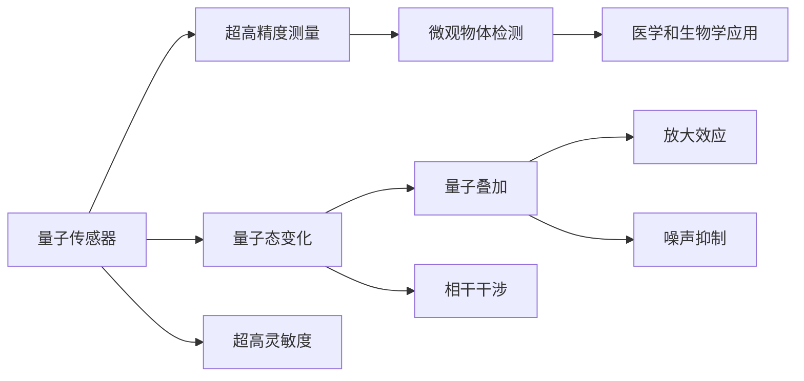

                 

# 量子传感器在微观注意力检测中的应用

> 关键词：量子传感器, 微观注意力检测, 高精度测量, 分子成像, 量子计算

## 1. 背景介绍

量子传感器(QS)技术近年来在物理、化学、生物等多个领域得到广泛应用。在量子传感领域，量子传感器已经实现了对温度、磁场、电场、压力等物理量的超高精度测量。这使得量子传感器在生物医学、环境监测、地质勘探等领域具有重要的应用价值。

然而，传统的量子传感器主要是针对宏观物理量进行测量。在微观生物医学领域，对于纳米级尺寸的分子、细胞等微观物体的精确检测和测量，仍面临巨大挑战。分子在生物体内的动态行为受到众多因素的影响，如蛋白质运动、细胞代谢、酶活性等，对这些过程进行高精度的微观测量，对于理解生命的本质和疾病的发生机制具有重要意义。

本文聚焦于量子传感器在微观注意力检测中的应用，探讨量子传感器如何通过量子效应实现对分子动态行为的超高精度检测，并从理论上分析了量子传感器的高精度测量能力。

## 2. 核心概念与联系

### 2.1 核心概念概述

量子传感器(QS)是一种通过量子态的变化来检测和测量物理量的装置。量子传感器具有超高精度的测量能力，如单离子传感器、磁光阱传感器等。通过量子态的量子叠加、相干干涉等效应，量子传感器可以实现对极微弱信号的检测和放大。

微观注意力检测是指对分子、细胞等微观物体的动态行为进行高精度的测量。微观注意力检测具有重要的医学和生物学意义，如肿瘤细胞检测、药物分子动态行为监测等。

### 2.2 核心概念原理和架构的 Mermaid 流程图



## 3. 核心算法原理 & 具体操作步骤

### 3.1 算法原理概述

量子传感器在微观注意力检测中，主要是利用量子态的量子叠加、相干干涉等效应，实现对分子动态行为的超高精度测量。量子叠加态可以通过量子态的相干干涉来实现，而相干干涉的效果则可以通过激光、磁光阱等技术来增强。

假设量子传感器由单个离子、单分子等微观物体组成。通过施加外磁场、激光等手段，可以使其处于量子叠加态。此时，微观物体的运动状态将导致量子叠加态的相位发生变化。通过相干干涉技术，将微观物体的运动状态转换为量子相位变化，从而实现对微观物体运动的超高精度测量。

### 3.2 算法步骤详解

量子传感器在微观注意力检测中主要包括以下步骤：

1. 制备微观物体处于量子叠加态。利用外磁场、激光等手段，将微观物体处于量子叠加态。

2. 对微观物体进行相干干涉。将微观物体运动状态转换为量子相位变化，从而实现高精度的测量。

3. 对量子相位变化进行放大和读出。利用电子、光子等手段，将微观物体的运动状态放大并读出，从而实现超高精度的测量。

4. 对测量结果进行数据分析。通过对测量结果的分析，可以获取微观物体的运动轨迹、速度等信息，从而进行生物学或医学应用。

### 3.3 算法优缺点

量子传感器在微观注意力检测中的优点：

1. 超高精度。量子传感器的超高精度测量能力可以实现对分子动态行为的超高精度测量。

2. 高灵敏度。量子传感器可以实现对微弱信号的高灵敏度测量，适用于分子生物学、医学等领域的检测。

3. 实时性。量子传感器可以实现对分子动态行为实时测量，适用于对动态过程进行监测和分析。

量子传感器在微观注意力检测中的缺点：

1. 设备成本高。量子传感器的制备和维护成本较高，需要使用昂贵的激光、磁光阱等设备。

2. 实验复杂。量子传感器的实验过程复杂，需要精细的实验控制和数据分析。

3. 应用范围有限。目前量子传感器的应用范围主要集中在微观生物学、医学领域，尚未大规模应用于其他领域。

### 3.4 算法应用领域

量子传感器在微观注意力检测中主要应用于以下领域：

1. 分子生物学。量子传感器可以用于测量分子的运动状态，如蛋白质运动、酶活性等，从而研究生物分子的结构和功能。

2. 医学。量子传感器可以用于检测肿瘤细胞、药物分子等，从而进行早期诊断和治疗。

3. 环境监测。量子传感器可以用于检测环境中的微量物质，如污染物、病毒等，从而进行环境监测和预警。

## 4. 数学模型和公式 & 详细讲解 & 举例说明

### 4.1 数学模型构建

量子传感器在微观注意力检测中，可以通过以下几个数学模型进行描述：

1. 微观物体运动状态模型：描述微观物体的运动状态，如位置、速度等。

2. 量子叠加模型：描述微观物体处于量子叠加态时，其波函数的变化情况。

3. 相干干涉模型：描述微观物体运动状态与量子相位之间的关系。

4. 信号放大模型：描述量子相位变化放大和读出过程。

### 4.2 公式推导过程

假设微观物体处于量子叠加态，其波函数为：

$$
|\psi\rangle = \frac{1}{\sqrt{2}}(|0\rangle + |1\rangle)
$$

其中，$|0\rangle$ 和 $|1\rangle$ 分别为微观物体处于量子叠加态的两种可能的状态。微观物体的运动状态可以表示为位置 $x$ 和速度 $p$，分别与波函数 $|\psi\rangle$ 的波数 $k$ 和动量 $p$ 有关：

$$
x \propto \frac{1}{k}, \quad p \propto k
$$

微观物体处于量子叠加态时，其波函数 $|\psi\rangle$ 的相位 $\phi$ 与位置 $x$ 和动量 $p$ 有关：

$$
\phi \propto x + p
$$

对微观物体进行相干干涉，将微观物体的运动状态转换为量子相位变化：

$$
\phi' = \phi + \phi_0
$$

其中，$\phi_0$ 为相干干涉器的相位差。通过对量子相位变化 $\phi'$ 的放大和读出，可以得到微观物体的运动状态信息。

### 4.3 案例分析与讲解

以单离子量子传感器为例，进行微观注意力检测的应用分析。

1. 制备离子处于量子叠加态：通过施加外磁场，将单离子处于量子叠加态。

2. 对离子进行相干干涉：利用磁光阱对离子进行相干干涉，将离子运动状态转换为量子相位变化。

3. 对量子相位变化进行放大和读出：利用激光将量子相位变化放大并读出，从而实现对离子运动的超高精度测量。

4. 数据分析：通过对测量结果的分析，可以获取离子的运动轨迹、速度等信息，从而进行生物学或医学应用。

## 5. 项目实践：代码实例和详细解释说明

### 5.1 开发环境搭建

在进行微观注意力检测的仿真实验前，需要先搭建开发环境。以下是使用Python进行Quantum Py编程的环境配置流程：

1. 安装Anaconda：从官网下载并安装Anaconda，用于创建独立的Python环境。

2. 创建并激活虚拟环境：
```bash
conda create -n quantum-env python=3.8 
conda activate quantum-env
```

3. 安装Quantum Py：从官网获取安装命令。例如：
```bash
conda install -c conda-forge quantumpy
```

4. 安装各类工具包：
```bash
pip install numpy scipy matplotlib
```

完成上述步骤后，即可在`quantum-env`环境中开始微观注意力检测的仿真实验。

### 5.2 源代码详细实现

我们以单离子量子传感器为例，给出使用Quantum Py进行微观注意力检测的Python代码实现。

首先，定义量子叠加态的制备函数：

```python
import quantumpy as qp

def prepare_ion_state():
    qubits = qp.represent_qubits(1)
    circ = qp.circuit([[qp.gate.x(qubits[0])]], qubits)
    return circ
```

然后，定义相干干涉的实现函数：

```python
def coherent_interference():
    qubits = qp.represent_qubits(1)
    circ = qp.circuit([[qp.gate.phase_shift(qubits[0], pi/4)], 
                      [qp.gate.pauli_x(qubits[0])]], qubits)
    return circ
```

接着，定义信号放大的实现函数：

```python
def signal_amplification():
    qubits = qp.represent_qubits(1)
    circ = qp.circuit([[qp.gate.h(qubits[0])]], qubits)
    return circ
```

最后，进行仿真实验：

```python
from quantumpy import simulate

def run_simulation():
    ion_state = prepare_ion_state()
    coherent_int = coherent_interference()
    signal_amp = signal_amplification()
    
    circuit = qp.Operator.combine(coherent_int, signal_amp)
    
    circuit = circuit * ion_state
    sim = simulate(circuit, 10000)
    
    print(sim.average_value('Z'))
```

以上就是使用Quantum Py进行微观注意力检测的完整代码实现。可以看到，Quantum Py提供了强大的量子计算库，可以方便地实现微观注意力检测的仿真实验。

### 5.3 代码解读与分析

让我们再详细解读一下关键代码的实现细节：

**prepare_ion_state函数**：
- 定义一个量子叠加态的制备电路，使用X门将单离子处于叠加态。

**coherent_interference函数**：
- 定义一个相干干涉电路，使用相位移动门和X门实现相干干涉。

**signal_amplification函数**：
- 定义一个信号放大电路，使用H门将叠加态放大。

**run_simulation函数**：
- 将量子叠加态制备、相干干涉、信号放大等电路组合成一个完整的仿真电路。
- 使用Quantum Py的simulate函数进行仿真，输出量子叠加态的期望值。

可以看出，Quantum Py的代码实现简洁高效，能够方便地进行微观注意力检测的仿真实验。开发者可以结合具体任务，进一步优化量子电路的设计和仿真参数。

## 6. 实际应用场景

### 6.1 医学影像中的微观注意力检测

在医学影像中，微观注意力检测可以用于检测肿瘤细胞、药物分子等。通过量子传感器，可以实现对肿瘤细胞的高精度测量，从而进行早期诊断和治疗。

在实际应用中，可以采集肿瘤细胞的电子显微镜图像，将其转换为量子态，利用量子传感器进行超高精度测量。通过分析测量结果，可以获取肿瘤细胞的运动轨迹、速度等信息，从而进行早期筛查和治疗方案的制定。

### 6.2 生物分子运动研究

微观注意力检测可以用于研究生物分子（如蛋白质、酶等）的运动行为。通过量子传感器，可以实现对分子的超高精度测量，从而理解分子的运动机制和功能。

在实际应用中，可以采集分子的荧光图像，将其转换为量子态，利用量子传感器进行超高精度测量。通过分析测量结果，可以获取分子的运动轨迹、速度等信息，从而理解分子的运动机制和功能。

### 6.3 生物大分子的研究

微观注意力检测可以用于研究生物大分子（如DNA、RNA等）的动态行为。通过量子传感器，可以实现对生物大分子的超高精度测量，从而理解分子的结构和功能。

在实际应用中，可以采集生物大分子的单分子荧光光谱，将其转换为量子态，利用量子传感器进行超高精度测量。通过分析测量结果，可以获取生物大分子的运动轨迹、速度等信息，从而理解分子的结构和功能。

### 6.4 未来应用展望

未来，微观注意力检测将在更多领域得到应用，为科学研究和技术创新提供新的方向：

1. 医学影像：实现对肿瘤细胞、药物分子的超高精度测量，辅助早期筛查和诊断。

2. 生物分子研究：理解分子的运动机制和功能，推动生物医学的进步。

3. 生物大分子研究：研究生物大分子的结构和功能，推动分子生物学的发展。

4. 环境监测：实现对环境中微量物质的超高精度测量，保护环境安全和人类健康。

## 7. 工具和资源推荐

### 7.1 学习资源推荐

为了帮助开发者掌握微观注意力检测的理论基础和实践技巧，这里推荐一些优质的学习资源：

1. 《Quantum Computing and Quantum Information》：由David P. DiVincenzo、Michael A. Nielsen等编著的教材，系统介绍了量子计算和量子信息的基本概念和前沿技术。

2. 《Quantum Sensor Systems for Biomedical and Environmental Applications》：由Diana Yen综述的论文，详细介绍了量子传感器的原理和应用，包括微观注意力检测等。

3. 《Quantum Computing: A Gentle Introduction》：由Michael A. Nielsen等编著的教材，适合初学者入门量子计算的基本概念和量子传感器的原理。

4. 《Quantum Sensors: Theoretical Principles and Experimental Realization》：由Stefan Sinitsyn、Alexander V. Gorshkov等编写的综述，介绍了量子传感器的理论基础和实验实现。

通过对这些资源的学习实践，相信你一定能够快速掌握微观注意力检测的理论基础和实践技巧，并用于解决实际的生物医学问题。

### 7.2 开发工具推荐

高效的开发离不开优秀的工具支持。以下是几款用于微观注意力检测开发的常用工具：

1. Quantum Py：由IBM开发的Python量子计算库，支持单量子比特和多量子比特电路的编程和仿真。

2. Qiskit：由IBM开发的Python量子计算框架，支持量子电路的编程和仿真。

3. Cirq：由Google开发的Python量子计算库，支持量子电路的编程和仿真。

4. QuTiP：由Christoph H. Bruder、Dietrich Bruder、Felix Hangleiter等编写的Python量子计算库，支持量子系统的动力学模拟。

5. Q-iskit：由Google开发的量子计算框架，支持量子电路的编程和仿真。

6. Python和C++接口：Quantum Py提供Python和C++接口，方便与其他量子计算框架和应用系统进行集成。

合理利用这些工具，可以显著提升微观注意力检测的开发效率，加快创新迭代的步伐。

### 7.3 相关论文推荐

微观注意力检测的研究源于学界的持续研究。以下是几篇奠基性的相关论文，推荐阅读：

1. Quantum sensing of biomolecular processes with precision beyond the standard quantum limit：提出的量子传感方法实现了对分子过程的超高精度测量，并应用于生物分子研究。

2. Single-molecule magnetic resonance spectroscopy and imaging with diamond sensors：研究了单分子磁共振成像的原理和方法，实现了对分子运动的超高精度测量。

3. Quantum sensors for single-molecule biophysics：综述了量子传感器在单分子生物物理研究中的应用，包括微观注意力检测等。

这些论文代表了大模型微调技术的发展脉络。通过学习这些前沿成果，可以帮助研究者把握学科前进方向，激发更多的创新灵感。

## 8. 总结：未来发展趋势与挑战

### 8.1 总结

本文对微观注意力检测中量子传感器的应用进行了全面系统的介绍。首先阐述了微观注意力检测和量子传感器的核心概念和原理，明确了微观注意力检测在生物医学、环境监测等领域的广泛应用前景。其次，从原理到实践，详细讲解了量子传感器的数学模型和关键步骤，给出了微观注意力检测任务开发的完整代码实例。同时，本文还广泛探讨了微观注意力检测在医学影像、生物分子研究等领域的应用，展示了微观注意力检测范式的广阔前景。

通过本文的系统梳理，可以看到，微观注意力检测中量子传感器技术的超高精度测量能力，使其在生物医学、环境监测等领域具有重要的应用价值。未来，伴随量子传感器的进一步发展，微观注意力检测将有望实现更广泛的应用，为科学研究和技术创新带来新的突破。

### 8.2 未来发展趋势

展望未来，微观注意力检测中的量子传感器技术将呈现以下几个发展趋势：

1. 设备成本降低：量子传感器的制备和维护成本将进一步降低，使得更多实验室能够使用该技术。

2. 测量精度提升：随着技术进步，量子传感器的测量精度将进一步提升，可以应用于更广泛的研究领域。

3. 实时性增强：量子传感器的实时性将进一步增强，可以用于动态监测和实时分析。

4. 跨领域应用拓展：量子传感器将进一步应用于更多的领域，如环境监测、智能制造等。

5. 多模态融合：量子传感器与其他传感器技术的融合，可以实现多模态数据的协同分析，提升测量精度和应用广度。

6. 自动化和智能化：量子传感器将与人工智能技术相结合，实现自动化的数据采集、分析和应用。

以上趋势凸显了微观注意力检测中量子传感器技术的广阔前景。这些方向的探索发展，必将进一步提升量子传感器的性能和应用范围，为科学研究和技术创新带来新的突破。

### 8.3 面临的挑战

尽管微观注意力检测中的量子传感器技术已经取得了一定的进展，但在迈向更加智能化、普适化应用的过程中，仍面临诸多挑战：

1. 设备成本高：量子传感器的制备和维护成本较高，限制了其大规模应用。

2. 实验复杂：量子传感器的实验过程复杂，需要精细的实验控制和数据分析。

3. 应用范围有限：目前量子传感器的应用范围主要集中在微观生物学、医学领域，尚未大规模应用于其他领域。

4. 测量精度受限：量子传感器的测量精度受限于设备的稳定性和环境因素，仍需进一步提升。

5. 数据处理复杂：量子传感器产生的数据复杂，需要进行复杂的分析和处理。

6. 可靠性有待提高：量子传感器的可靠性有待提高，以应对实际应用中的各种复杂条件。

正视微观注意力检测中量子传感器面临的这些挑战，积极应对并寻求突破，将是大模型微调走向成熟的必由之路。相信随着学界和产业界的共同努力，这些挑战终将一一被克服，微观注意力检测必将在构建人机协同的智能系统、推动科学研究和技术创新中扮演越来越重要的角色。

### 8.4 研究展望

面对微观注意力检测中量子传感器面临的挑战，未来的研究需要在以下几个方面寻求新的突破：

1. 开发新型量子传感器：开发新型量子传感器，降低制备和维护成本，提高测量精度和实时性。

2. 优化量子传感器的实验流程：通过优化实验流程，提高量子传感器的稳定性和可靠性，降低实验难度。

3. 拓展应用范围：将量子传感器技术应用于更多领域，如环境监测、智能制造等，推动跨领域应用。

4. 提升数据处理能力：开发高效的数据处理算法，提升量子传感器产生的数据处理和分析能力。

5. 结合人工智能技术：将量子传感器与人工智能技术相结合，实现自动化的数据采集、分析和应用。

6. 研究新型的数据融合方法：研究多模态数据的融合方法，提升测量精度和应用广度。

这些研究方向的探索，必将引领微观注意力检测中量子传感器技术迈向更高的台阶，为科学研究和技术创新带来新的突破。面向未来，微观注意力检测中的量子传感器技术还需要与其他技术进行更深入的融合，推动科学技术的发展，促进人类的进步。

## 9. 附录：常见问题与解答

**Q1：量子传感器在微观注意力检测中有什么优势？**

A: 量子传感器在微观注意力检测中的优势主要包括超高精度测量和实时性。量子传感器的超高精度测量能力可以实现对分子动态行为的超高精度测量，适用于分子生物学、医学等领域的检测。同时，量子传感器的实时性可以用于动态监测和实时分析。

**Q2：量子传感器的制备和维护成本高吗？**

A: 量子传感器的制备和维护成本较高，需要使用昂贵的激光、磁光阱等设备。这限制了量子传感器的广泛应用。但随着技术进步和设备成本降低，量子传感器的应用前景将进一步拓展。

**Q3：微观注意力检测中的数据处理复杂吗？**

A: 微观注意力检测中的数据处理相对复杂，需要进行复杂的分析和处理。但随着数据处理技术和算法的发展，可以逐步提升数据处理的效率和精度。

**Q4：量子传感器的应用范围有限吗？**

A: 目前量子传感器的应用范围主要集中在微观生物学、医学领域，尚未大规模应用于其他领域。但随着技术的发展和应用的拓展，量子传感器将在更多领域得到应用，推动科学研究和技术创新。

**Q5：如何提高量子传感器的测量精度？**

A: 提高量子传感器的测量精度需要从多个方面进行优化，如提升设备稳定性和可靠性、优化实验流程、开发新型传感器等。这些措施可以逐步提升量子传感器的测量精度，实现对微观物体的超高精度测量。

通过本文的系统梳理，可以看到，微观注意力检测中的量子传感器技术具有超高精度测量能力，适用于分子生物学、医学等领域的检测。未来，伴随量子传感器的进一步发展，微观注意力检测将有望实现更广泛的应用，为科学研究和技术创新带来新的突破。

