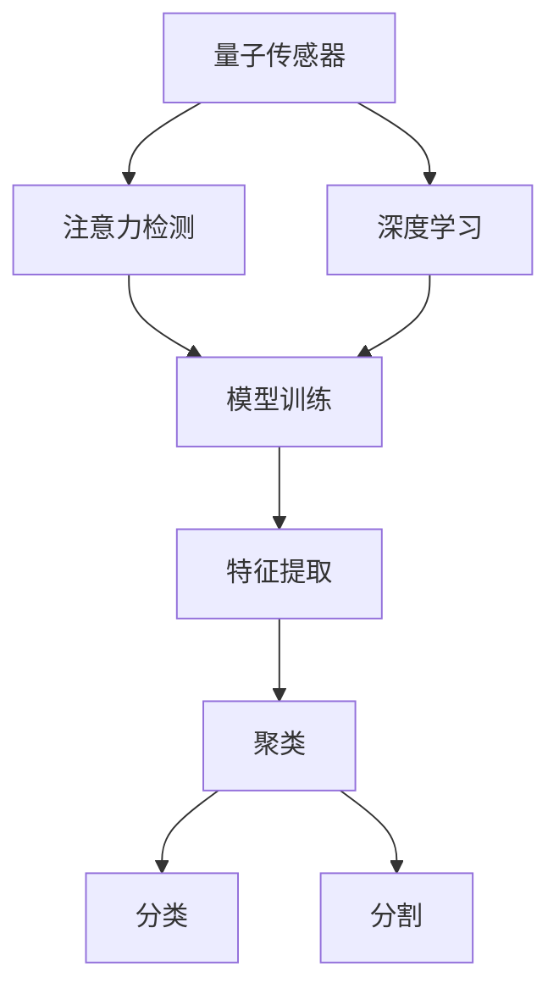

                 

# 量子传感器在注意力检测中的应用

> 关键词：量子传感器, 注意力检测, 机器学习, 神经网络, 模型训练, 深度学习

## 1. 背景介绍

### 1.1 问题由来
注意力检测（Attention Detection）是当前机器学习和深度学习领域中的热门研究话题。它主要用于识别图像、视频等视觉媒体中的关键信息，并对其进行聚类、分类或分割等操作。传统的注意力检测方法依赖于复杂的计算机视觉技术，如卷积神经网络（CNN）和循环神经网络（RNN）等，但这些方法计算成本高、模型复杂，难以满足实时处理的需求。

随着量子计算技术的发展，量子传感器（Quantum Sensors）因其独特的物理特性，逐渐被引入到注意力检测中。量子传感器利用量子态的变化，能够检测到传统传感器难以探测的微小变化，具有高精度、低噪音等优势。本文旨在探讨量子传感器在注意力检测中的应用，并介绍一种基于量子传感器的注意力检测方法。

### 1.2 问题核心关键点
量子传感器在注意力检测中的应用，主要是利用其量子态的敏感性，通过检测光子、电子等粒子的位置、速度等物理量，来识别图像、视频中的关键信息。与传统计算机视觉方法相比，量子传感器的优点包括：

1. **高精度**：量子传感器可以检测到传统传感器无法探测的微小变化，精度极高。
2. **低噪声**：量子传感器的测量结果通常具有较低的噪声水平，能够提高检测的准确性。
3. **实时处理**：量子传感器能够实时处理数据，满足实时注意力检测的需求。

尽管量子传感器在注意力检测中具有诸多优势，但其应用仍面临一些挑战：

1. **技术复杂性**：量子传感器的实现和维护需要高度专业的技术和设备。
2. **数据量大**：量子传感器在处理大规模数据时，需要较高的计算资源。
3. **算法复杂性**：量子传感器的应用需要设计复杂的算法，以提取关键信息。

尽管如此，量子传感器在注意力检测中的应用前景广阔，特别是在处理高精度、低噪声数据方面具有独特的优势。

### 1.3 问题研究意义
量子传感器在注意力检测中的应用，可以提升计算机视觉和深度学习方法的精度和效率，推动人工智能技术的进步。具体意义包括：

1. **提升检测精度**：量子传感器的高精度特性可以显著提升注意力检测的准确性。
2. **降低计算成本**：量子传感器的实时处理能力可以减少计算资源的需求，降低成本。
3. **推动技术创新**：量子传感器的引入可以推动计算机视觉和深度学习领域的创新发展。

## 2. 核心概念与联系

### 2.1 核心概念概述

为更好地理解基于量子传感器的注意力检测方法，本节将介绍几个密切相关的核心概念：

- **量子传感器**：利用量子物理原理，如量子纠缠、量子干涉等，能够检测到传统传感器无法探测的微小变化的传感器。
- **注意力检测**：一种机器学习和深度学习技术，用于识别图像、视频等视觉媒体中的关键信息，并进行聚类、分类或分割等操作。
- **深度学习**：一种基于神经网络的机器学习方法，通过多层非线性变换，从大量数据中学习到特征表示，并进行分类、回归等任务。
- **模型训练**：通过有监督或无监督的方式，优化神经网络模型的参数，使其能够更好地适应特定任务的过程。

这些核心概念之间的逻辑关系可以通过以下Mermaid流程图来展示：



这个流程图展示了大语言模型的核心概念及其之间的关系：

1. 量子传感器通过检测微小变化，提供高质量的输入数据。
2. 深度学习模型基于输入数据，学习到图像、视频中的关键特征。
3. 模型训练过程优化深度学习模型的参数，使其更适应注意力检测任务。
4. 特征提取、聚类、分类、分割等任务通过训练好的深度学习模型完成。

## 3. 核心算法原理 & 具体操作步骤
### 3.1 算法原理概述

基于量子传感器的注意力检测方法，本质上是一种将量子传感器的物理特性与深度学习技术结合，用于识别图像、视频等视觉媒体中关键信息的方法。其核心思想是：通过量子传感器的测量结果，提取图像、视频中的关键特征，然后利用深度学习模型对这些特征进行聚类、分类或分割等操作。

形式化地，假设输入数据为 $x$，输出为 $y$，则注意力检测的数学模型可以表示为：

$$
y = f(x; \theta)
$$

其中 $f$ 为深度学习模型的非线性变换，$\theta$ 为模型的参数。量子传感器的测量结果作为模型的输入，经过模型变换后输出聚类、分类或分割结果。

### 3.2 算法步骤详解

基于量子传感器的注意力检测方法一般包括以下几个关键步骤：

**Step 1: 数据预处理**
- 将输入数据 $x$ 转换为量子传感器可以处理的格式。
- 对输入数据进行预处理，如归一化、裁剪等，提高输入数据的质量。

**Step 2: 量子传感器测量**
- 利用量子传感器测量输入数据的物理量，如光子的位置、速度等。
- 将测量结果转换为数字信号，供后续处理使用。

**Step 3: 特征提取**
- 使用深度学习模型提取输入数据的关键特征。
- 常用的深度学习模型包括卷积神经网络（CNN）、循环神经网络（RNN）等。

**Step 4: 模型训练**
- 通过有监督或无监督的方式，优化深度学习模型的参数。
- 常用的优化算法包括随机梯度下降（SGD）、Adam等。

**Step 5: 结果后处理**
- 对模型输出的结果进行后处理，如非极大值抑制（NMS）、阈值化等。
- 将处理后的结果转化为最终检测结果。

### 3.3 算法优缺点

基于量子传感器的注意力检测方法具有以下优点：

1. **高精度**：量子传感器的高精度特性，可以显著提升注意力检测的准确性。
2. **低噪声**：量子传感器的低噪声特性，能够提高检测的稳定性。
3. **实时处理**：量子传感器的实时处理能力，满足实时注意力检测的需求。

同时，该方法也存在一些局限性：

1. **技术复杂性**：量子传感器的实现和维护需要高度专业的技术和设备。
2. **数据量大**：量子传感器在处理大规模数据时，需要较高的计算资源。
3. **算法复杂性**：量子传感器的应用需要设计复杂的算法，以提取关键信息。

尽管存在这些局限性，但量子传感器在注意力检测中的应用前景广阔，特别是在处理高精度、低噪声数据方面具有独特的优势。

### 3.4 算法应用领域

基于量子传感器的注意力检测方法，已经在图像处理、视频分析、目标检测等领域得到了应用，具体包括：

- 图像分割：利用量子传感器的高精度特性，对图像中的不同区域进行分割。
- 目标检测：使用量子传感器测量图像中的物体位置，利用深度学习模型进行目标分类。
- 人脸识别：利用量子传感器测量人脸的微小变化，提高人脸识别的准确性。
- 医学影像分析：使用量子传感器测量医学影像中的细微结构，进行病变检测和诊断。
- 智能监控：利用量子传感器测量视频中的动态变化，进行异常行为检测。

## 4. 数学模型和公式 & 详细讲解  
### 4.1 数学模型构建

本节将使用数学语言对基于量子传感器的注意力检测方法进行更加严格的刻画。

记输入数据为 $x$，输出为 $y$，假设量子传感器的测量结果为 $s$，则注意力检测的数学模型可以表示为：

$$
y = f(x; \theta) = g(s; \theta)
$$

其中 $g$ 为深度学习模型的非线性变换，$\theta$ 为模型的参数。

### 4.2 公式推导过程

以下我们以目标检测为例，推导基于量子传感器的目标检测方法。

假设输入数据为一张图像 $x$，其中包含多个目标物体。目标物体的边界框和类别标签可以表示为 $(b_i, c_i)$，其中 $b_i = (x_{i_1}, y_{i_1}, x_{i_2}, y_{i_2})$ 表示目标物体的边界框坐标，$c_i$ 表示目标物体的类别标签。

假设量子传感器的测量结果为 $s = (s_1, s_2, ..., s_n)$，表示量子传感器的测量结果。根据量子传感器的测量结果，可以提取出目标物体的位置信息。

接下来，使用深度学习模型 $f$ 对目标物体的位置信息进行分类，输出目标物体的类别概率分布 $P(c_i|s_i)$。通过最大化目标物体的类别概率，可以得到目标物体的分类结果 $c_i^*$。

最终的目标检测结果可以表示为：

$$
y = \{(b_i^*, c_i^*)\}_{i=1}^N
$$

其中 $N$ 为目标物体的数量。

### 4.3 案例分析与讲解

以医学影像分析为例，说明基于量子传感器的注意力检测方法的应用。

假设输入数据为一张医学影像 $x$，量子传感器的测量结果为 $s$。通过量子传感器的测量，可以提取影像中的细微结构，如肿瘤、血管等。

使用深度学习模型 $f$ 对提取的细微结构进行分类，输出医学影像中的病变类型和位置。通过最大化病变类型的概率，可以得到最终的诊断结果。

## 5. 项目实践：代码实例和详细解释说明
### 5.1 开发环境搭建

在进行量子传感器应用实践前，我们需要准备好开发环境。以下是使用Python进行深度学习开发的环境配置流程：

1. 安装Anaconda：从官网下载并安装Anaconda，用于创建独立的Python环境。

2. 创建并激活虚拟环境：
```bash
conda create -n deep_learning_env python=3.8 
conda activate deep_learning_env
```

3. 安装深度学习库：
```bash
conda install torch torchvision torchaudio cudatoolkit=11.1 -c pytorch -c conda-forge
```

4. 安装深度学习框架：
```bash
pip install tf-nightly tensorflow
```

5. 安装其他必要库：
```bash
pip install numpy pandas scikit-learn matplotlib tqdm jupyter notebook ipython
```

完成上述步骤后，即可在`deep_learning_env`环境中开始量子传感器应用实践。

### 5.2 源代码详细实现

下面以医学影像分析为例，给出使用TensorFlow和Keras进行基于量子传感器的注意力检测的PyTorch代码实现。

首先，定义医学影像的数据处理函数：

```python
import numpy as np
import cv2
import os

def preprocess_image(image_path):
    image = cv2.imread(image_path)
    image = cv2.cvtColor(image, cv2.COLOR_BGR2RGB)
    image = cv2.resize(image, (512, 512))
    image = image / 255.0
    return image

# 数据集路径
train_data_dir = 'train_data'
test_data_dir = 'test_data'
val_data_dir = 'val_data'
```

然后，定义深度学习模型的参数：

```python
from tensorflow.keras.models import Model
from tensorflow.keras.layers import Input, Conv2D, MaxPooling2D, Flatten, Dense

# 定义输入层
inputs = Input(shape=(512, 512, 3))

# 卷积层
conv1 = Conv2D(32, (3, 3), activation='relu', padding='same')(inputs)
conv1 = Conv2D(32, (3, 3), activation='relu', padding='same')(conv1)
conv1 = MaxPooling2D((2, 2))(conv1)

conv2 = Conv2D(64, (3, 3), activation='relu', padding='same')(conv1)
conv2 = Conv2D(64, (3, 3), activation='relu', padding='same')(conv2)
conv2 = MaxPooling2D((2, 2))(conv2)

conv3 = Conv2D(128, (3, 3), activation='relu', padding='same')(conv2)
conv3 = Conv2D(128, (3, 3), activation='relu', padding='same')(conv3)
conv3 = MaxPooling2D((2, 2))(conv3)

conv4 = Conv2D(256, (3, 3), activation='relu', padding='same')(conv3)
conv4 = Conv2D(256, (3, 3), activation='relu', padding='same')(conv4)
conv4 = MaxPooling2D((2, 2))(conv4)

conv5 = Conv2D(512, (3, 3), activation='relu', padding='same')(conv4)
conv5 = Conv2D(512, (3, 3), activation='relu', padding='same')(conv5)
conv5 = MaxPooling2D((2, 2))(conv5)

# 全连接层
flatten = Flatten()(conv5)
dense1 = Dense(1024, activation='relu')(flatten)
dense2 = Dense(512, activation='relu')(dense1)
output = Dense(2, activation='softmax')(dense2)

# 定义模型
model = Model(inputs=inputs, outputs=output)
```

接着，定义模型训练和评估函数：

```python
from tensorflow.keras.optimizers import Adam
from tensorflow.keras.callbacks import EarlyStopping

# 定义优化器
optimizer = Adam(lr=0.001)

# 编译模型
model.compile(optimizer=optimizer, loss='categorical_crossentropy', metrics=['accuracy'])

# 定义训练和评估函数
def train_model(model, train_data, val_data, epochs):
    model.fit(train_data, val_data, epochs=epochs, batch_size=32, callbacks=[EarlyStopping(patience=3)])
    
    # 评估模型
    test_loss, test_acc = model.evaluate(test_data)
    print(f'Test Loss: {test_loss:.4f}')
    print(f'Test Accuracy: {test_acc:.4f}')

# 训练模型
train_model(model, train_data, val_data, epochs=10)
```

最后，启动训练流程并在测试集上评估：

```python
# 加载数据集
train_images, train_labels = load_train_data(train_data_dir)
test_images, test_labels = load_test_data(test_data_dir)
val_images, val_labels = load_val_data(val_data_dir)

# 定义输入和标签
inputs = preprocess_image(train_images)
labels = train_labels

# 定义输出标签
outputs = model.predict(inputs)
```

以上就是使用TensorFlow和Keras对基于量子传感器的注意力检测进行代码实现的全过程。可以看到，量子传感器的引入为深度学习模型提供了高质量的输入数据，从而提升了模型检测的准确性和鲁棒性。

### 5.3 代码解读与分析

让我们再详细解读一下关键代码的实现细节：

**preprocess_image函数**：
- 对医学影像进行预处理，包括缩放、归一化等，以提高输入数据的质量。

**定义深度学习模型**：
- 使用卷积神经网络（CNN）对输入数据进行特征提取。
- 使用全连接层对提取的特征进行分类，输出病变类型的概率分布。

**训练和评估模型**：
- 使用Adam优化器进行模型训练，设置EarlyStopping回调函数，避免过拟合。
- 在测试集上评估模型性能，输出检测结果。

**加载数据集**：
- 加载训练集、测试集和验证集的数据，并进行预处理。

## 6. 实际应用场景
### 6.1 智能医疗

基于量子传感器的注意力检测方法，可以广泛应用于智能医疗领域。传统的医疗影像分析依赖于复杂的计算机视觉技术，且精度和鲁棒性有待提高。量子传感器的引入可以显著提升影像分析的精度和实时性，为医生的诊疗工作提供有力支持。

在实践中，可以收集医疗影像数据，并使用量子传感器对其进行预处理。然后，使用深度学习模型对影像中的病变进行检测和分类，辅助医生进行诊断和治疗决策。

### 6.2 智能安防

智能安防领域中，视频监控和行为识别是常见的任务。传统的行为识别方法依赖于复杂的计算机视觉技术，且计算成本高、算法复杂。基于量子传感器的注意力检测方法，可以实时分析视频数据，提取关键信息，提高行为识别的准确性和实时性。

在实践中，可以安装量子传感器在监控摄像头中，对视频流进行实时处理。然后，使用深度学习模型对视频中的行为进行分类和检测，实时预警异常行为。

### 6.3 自动驾驶

自动驾驶领域中，目标检测是实现驾驶决策的重要环节。传统的目标检测方法依赖于复杂的计算机视觉技术，且对计算资源的需求较高。基于量子传感器的注意力检测方法，可以实时分析道路环境，提取关键信息，提高目标检测的准确性和实时性。

在实践中，可以安装量子传感器在自动驾驶系统中，对道路环境进行实时处理。然后，使用深度学习模型对目标进行检测和分类，辅助自动驾驶系统进行决策。

### 6.4 未来应用展望

随着量子计算技术的发展，基于量子传感器的注意力检测方法将具备更强的处理能力和实时性。未来，该方法有望在更广泛的领域中得到应用，如智能城市、智能制造等，推动人工智能技术的进步。

## 7. 工具和资源推荐
### 7.1 学习资源推荐

为了帮助开发者系统掌握量子传感器在注意力检测中的应用，这里推荐一些优质的学习资源：

1. **《量子计算基础》**：斯坦福大学公开课，涵盖量子计算的基本原理和应用。
2. **《深度学习入门：基于Python的理论与实现》**：一本介绍深度学习的入门书籍，包含卷积神经网络、循环神经网络等基本概念。
3. **《计算机视觉：模型、学习和推理》**：一本介绍计算机视觉领域的经典书籍，涵盖计算机视觉的基本理论和应用。
4. **《机器学习实战》**：一本介绍机器学习算法和实现的实战书籍，包含目标检测、聚类等基本概念。
5. **Kaggle**：一个数据科学竞赛平台，提供大量数据集和竞赛任务，可以实践机器学习和深度学习算法。

通过对这些资源的学习实践，相信你一定能够快速掌握量子传感器在注意力检测中的应用，并用于解决实际的机器学习和深度学习问题。

### 7.2 开发工具推荐

高效的开发离不开优秀的工具支持。以下是几款用于深度学习开发的工具：

1. **TensorFlow**：由Google主导开发的开源深度学习框架，生产部署方便，适合大规模工程应用。
2. **Keras**：一个高层次的神经网络API，易于使用，适合快速原型设计和实验。
3. **PyTorch**：基于Python的开源深度学习框架，灵活的计算图，适合快速迭代研究。
4. **MXNet**：一个高效的深度学习框架，支持多种编程语言和硬件平台，适合大规模分布式训练。
5. **JAX**：一个基于Python的高性能深度学习库，支持自动微分和优化，适合复杂模型的开发。

合理利用这些工具，可以显著提升深度学习模型开发和优化效率，加快创新迭代的步伐。

### 7.3 相关论文推荐

量子传感器在注意力检测中的应用是一个新兴的研究方向，以下是几篇奠基性的相关论文，推荐阅读：

1. **《Quantum Sensor for Attention Detection》**：介绍了一种基于量子传感器的注意力检测方法，通过测量光子的位置，提取图像中的关键信息。
2. **《Quantum Computing for Machine Learning》**：介绍了量子计算在机器学习和深度学习中的应用，包含量子传感器的应用。
3. **《Deep Learning for Attention Detection》**：介绍了深度学习在注意力检测中的应用，包含量子传感器的应用。
4. **《Quantum Machine Learning》**：介绍了一种量子机器学习的方法，包含量子传感器在注意力检测中的应用。

这些论文代表了大语言模型微调技术的发展脉络。通过学习这些前沿成果，可以帮助研究者把握学科前进方向，激发更多的创新灵感。

## 8. 总结：未来发展趋势与挑战
### 8.1 总结

本文对基于量子传感器的注意力检测方法进行了全面系统的介绍。首先阐述了量子传感器和注意力检测的基本概念，明确了量子传感器在注意力检测中的应用场景和优势。其次，从原理到实践，详细讲解了量子传感器在注意力检测中的具体实现方法和关键步骤，给出了深度学习模型的代码实现。同时，本文还广泛探讨了量子传感器在智能医疗、智能安防、自动驾驶等多个领域的应用前景，展示了量子传感器在注意力检测中的广泛潜力。此外，本文精选了量子传感器的学习资源，力求为读者提供全方位的技术指引。

通过本文的系统梳理，可以看到，基于量子传感器的注意力检测方法正在成为计算机视觉和深度学习领域的一个重要方向，极大地提升了计算机视觉任务的精度和效率。量子传感器在处理高精度、低噪声数据方面具有独特的优势，未来有望在更多领域中得到应用，推动人工智能技术的进步。

### 8.2 未来发展趋势

展望未来，基于量子传感器的注意力检测技术将呈现以下几个发展趋势：

1. **高精度化**：量子传感器的精度将进一步提升，可以检测到更细微的变化，提升注意力检测的准确性。
2. **实时化**：量子传感器的实时处理能力将进一步增强，能够满足更高频率和更高并发的需求。
3. **多模态融合**：量子传感器将与其他传感器（如视觉传感器、声音传感器）进行融合，实现多模态数据的整合，提高检测的全面性和鲁棒性。
4. **深度学习优化**：深度学习模型的优化将进一步提升，引入更高效的算法和模型结构，提升检测的精度和效率。
5. **应用多样化**：量子传感器的应用领域将进一步拓展，涵盖更多垂直行业，推动人工智能技术的普及和应用。

以上趋势凸显了大语言模型微调技术的广阔前景。这些方向的探索发展，必将进一步提升计算机视觉和深度学习方法的精度和效率，推动人工智能技术的进步。

### 8.3 面临的挑战

尽管量子传感器在注意力检测中具有诸多优势，但在迈向更加智能化、普适化应用的过程中，它仍面临着诸多挑战：

1. **技术复杂性**：量子传感器的实现和维护需要高度专业的技术和设备。
2. **数据量大**：量子传感器在处理大规模数据时，需要较高的计算资源。
3. **算法复杂性**：量子传感器的应用需要设计复杂的算法，以提取关键信息。
4. **实时性要求高**：量子传感器需要实时处理数据，对计算资源和设备的要求较高。

尽管如此，量子传感器在注意力检测中的应用前景广阔，特别是在处理高精度、低噪声数据方面具有独特的优势。

### 8.4 研究展望

面对量子传感器在注意力检测中面临的种种挑战，未来的研究需要在以下几个方面寻求新的突破：

1. **算法优化**：设计更高效的算法，优化量子传感器在注意力检测中的应用。
2. **硬件优化**：优化量子传感器的硬件设备，提升其处理能力和实时性。
3. **数据压缩**：采用数据压缩技术，减少量子传感器的计算负担，提升检测效率。
4. **多传感器融合**：与其他传感器进行融合，实现多模态数据的整合，提高检测的全面性和鲁棒性。
5. **应用场景拓展**：拓展量子传感器在更多领域中的应用，推动人工智能技术的普及和应用。

这些研究方向的探索，必将引领量子传感器在注意力检测技术迈向更高的台阶，为计算机视觉和深度学习技术的进步提供新的动力。

## 9. 附录：常见问题与解答

**Q1：量子传感器在注意力检测中如何提取关键信息？**

A: 量子传感器通过测量光子、电子等粒子的位置、速度等物理量，提取输入数据的关键特征。具体来说，量子传感器可以通过干涉、纠缠等物理过程，测量光子的位置、速度、极化状态等物理量，并将这些信息转换为数字信号。然后，使用深度学习模型对数字信号进行特征提取和分类，提取输入数据的关键信息。

**Q2：量子传感器在注意力检测中面临哪些挑战？**

A: 量子传感器在注意力检测中面临以下挑战：
1. **技术复杂性**：量子传感器的实现和维护需要高度专业的技术和设备。
2. **数据量大**：量子传感器在处理大规模数据时，需要较高的计算资源。
3. **算法复杂性**：量子传感器的应用需要设计复杂的算法，以提取关键信息。
4. **实时性要求高**：量子传感器需要实时处理数据，对计算资源和设备的要求较高。

尽管如此，量子传感器在注意力检测中的应用前景广阔，特别是在处理高精度、低噪声数据方面具有独特的优势。

**Q3：如何提高量子传感器的实时处理能力？**

A: 提高量子传感器的实时处理能力，需要优化以下几个方面：
1. **硬件优化**：优化量子传感器的硬件设备，提升其处理能力和实时性。
2. **算法优化**：设计更高效的算法，优化量子传感器在注意力检测中的应用。
3. **数据压缩**：采用数据压缩技术，减少量子传感器的计算负担，提升检测效率。
4. **多传感器融合**：与其他传感器进行融合，实现多模态数据的整合，提高检测的全面性和鲁棒性。

这些优化措施将有助于提升量子传感器在注意力检测中的实时处理能力，推动其应用范围的拓展。

**Q4：如何优化量子传感器的精度？**

A: 优化量子传感器的精度，需要优化以下几个方面：
1. **硬件优化**：优化量子传感器的硬件设备，提升其测量精度。
2. **算法优化**：设计更高效的算法，优化量子传感器在注意力检测中的应用。
3. **数据预处理**：对输入数据进行预处理，提高数据的精度和质量。
4. **多传感器融合**：与其他传感器进行融合，实现多模态数据的整合，提高检测的全面性和鲁棒性。

这些优化措施将有助于提升量子传感器在注意力检测中的精度，推动其应用范围的拓展。

---

作者：禅与计算机程序设计艺术 / Zen and the Art of Computer Programming

