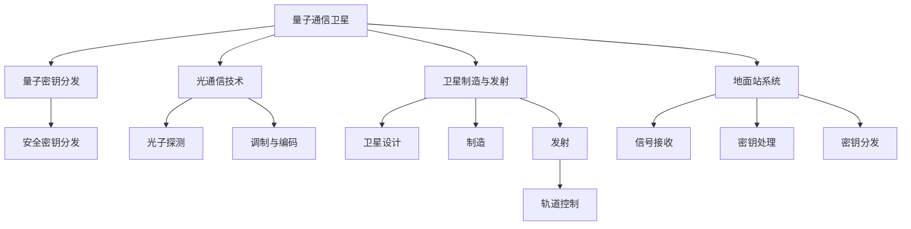

                 

## 1. 背景介绍

### 1.1 问题由来

随着量子信息科学和量子通信技术的不断进步，量子通信卫星作为全球量子通信网络的骨干节点，开始成为各国战略竞争的焦点。相较于光纤和自由空间量子通信，卫星量子通信具有覆盖范围广、通信距离远、组网灵活等优势，能够跨越地理障碍，连接远离陆地光纤网络的偏远地区，构筑起真正意义上的全球化量子通信网络。

### 1.2 问题核心关键点

量子通信卫星的建设与运营，涉及到多个核心技术环节，包括光通信技术、卫星制造与发射、轨道控制、量子密钥分发(QKD)协议与实现、地面站系统、量子网络管理与安全性保障等。其中，QKD作为量子通信卫星的核心技术之一，承载着实现信息安全传输的重任，是量子卫星的关键技术瓶颈。

### 1.3 问题研究意义

构建全球量子通信网络，是实现全球信息安全和数据隐私保护的重要手段。量子通信卫星通过QKD技术，可以提供高度安全的通信方式，防止信息被窃听和篡改，从而在军事、金融、政府等领域实现安全通信。同时，量子通信卫星的应用也将带动全球量子技术的发展，提升科研能力和经济效益。

## 2. 核心概念与联系

### 2.1 核心概念概述

为了深入理解量子通信卫星及其关键技术，本节将介绍几个紧密相关的核心概念：

- **量子通信卫星（Quantum Communication Satellite, QCS）**：搭载有量子密钥分发设备，通过卫星将量子态传输至地球接收器，实现远距离、全球范围的安全通信。
- **量子密钥分发（Quantum Key Distribution, QKD）**：利用量子力学原理，生成并分发安全密钥，保障通信双方信息传输的安全性。
- **光通信技术（Optical Communication Technology）**：涉及光子探测、调制与编码等技术，是卫星量子通信的基础。
- **卫星制造与发射（Satellite Manufacturing and Launch）**：包括卫星设计、制造、发射以及轨道控制等环节。
- **地面站系统（Ground Station System）**：与卫星通信交互的设备与系统，包括信号接收、密钥处理与分发等。

这些概念之间的逻辑关系可以通过以下Mermaid流程图来展示：



这个流程图展示了大量子通信卫星及其核心技术的关联：

1. 量子通信卫星通过光通信技术，将量子态传输至地面站系统，与地面站交互。
2. 量子密钥分发作为卫星核心技术，用于生成安全密钥，保障通信安全。
3. 卫星制造与发射是实现卫星部署和空间通信的基础。
4. 地面站系统负责接收信号、处理密钥并分发，是量子通信卫星的重要组成部分。

## 3. 核心算法原理 & 具体操作步骤

### 3.1 算法原理概述

量子通信卫星的核心算法原理基于量子力学的基本法则，包括量子态的制备、传输与测量。QKD算法则利用这些基本法则，通过量子态的不可克隆性和测不准原理，实现安全密钥的生成与分发。

量子态的制备与传输主要通过单光子源和光纤通道实现。具体流程如下：

1. 单光子源生成：利用半导体量子点、量子阱等器件产生单一光子。
2. 量子态传输：通过光纤通道将单光子从发射端传输到接收端。
3. 光子探测：在接收端使用单光子探测器，测量光子的状态并进行编码。

QKD算法包括BB84和E91等协议，其中BB84是最早期的QKD协议，利用量子态的随机性和不可克隆性实现密钥分发。E91协议则基于贝尔不等式，进一步提升了协议的安全性。

### 3.2 算法步骤详解

以BB84协议为例，详细讲解QKD算法的步骤：

**Step 1: 密钥生成**

- **初始化**：发射端和接收端共享一个随机位串，作为密钥生成的基础。
- **量子态准备**：发射端根据随机位串，准备对应的量子态（0或1）。

**Step 2: 量子态传输**

- **光子传输**：发射单光子，通过光纤通道传输至接收端。
- **光子测量**：接收端对光子进行测量，获取量子态信息。

**Step 3: 密钥共享**

- **基矢选择**：发射端和接收端随机选择测量基矢，对测量结果进行比较。
- **密钥生成**：根据比较结果，生成共享密钥。

**Step 4: 隐私扩增**

- **隐私放大**：对生成的密钥进行隐私放大，去除潜在的泄漏信息。

**Step 5: 密钥共享**

- **密钥分发**：将最终生成的密钥传输至接收端。

### 3.3 算法优缺点

量子通信卫星的QKD算法具有以下优点：

1. 高安全性：基于量子力学的原理，无法被窃听和破译。
2. 长距离传输：克服光纤通信的传输距离限制，可实现远距离通信。
3. 抗攻击性强：难以被截取和篡改，即使存在窃听和攻击，也能及时发现并修正。

同时，该算法也存在一些缺点：

1. 技术复杂：量子通信卫星需要高精度的光子源和探测器，技术实现难度大。
2. 传输速率低：目前QKD的传输速率受限于量子态制备和测量过程，速率较低。
3. 敏感性：对光路、环境等干扰因素敏感，影响传输的稳定性。

### 3.4 算法应用领域

量子通信卫星的QKD算法，在以下几个领域具有广泛的应用前景：

- **军事通信**：用于构建高安全性军事通信网络，保障军事信息的传输安全。
- **政府和企业安全**：用于政府和企业内部网络的安全通信，防止信息泄露和攻击。
- **银行和金融**：用于银行和金融系统的信息加密与传输，防止数据被窃取和篡改。
- **物联网**：用于物联网设备之间的安全通信，保障数据传输的安全性。
- **医疗和教育**：用于医疗和教育领域，保障敏感数据的传输安全。

这些应用领域共同构成了量子通信卫星QKD算法的广泛应用场景，展示了其巨大潜力。

## 4. 数学模型和公式 & 详细讲解 & 举例说明

### 4.1 数学模型构建

量子通信卫星的QKD算法涉及量子态的制备、传输与测量，以及隐私放大和密钥生成等步骤。以下是基于量子力学的数学模型构建：

- **量子态制备**：设发射端的量子态为$|\psi\rangle$，接收端的测量基矢为$\{|0\rangle, |1\rangle\}$。发射端制备的量子态为$\alpha|0\rangle+\beta|1\rangle$，其中$\alpha$和$\beta$为复数系数。
- **量子态传输**：量子态通过光纤通道传输至接收端，假设传输过程无噪声干扰。
- **光子测量**：接收端对光子进行测量，得到测量结果$|0\rangle$或$|1\rangle$。

### 4.2 公式推导过程

量子态制备与传输的公式推导如下：

$$
|\psi\rangle = \alpha|0\rangle+\beta|1\rangle
$$

设$|\phi\rangle$为接收端的光子测量基矢，测量结果为$|\phi\rangle$，则有：

$$
\langle\phi|\psi\rangle = \alpha^*\langle\phi|0\rangle+\beta^*\langle\phi|1\rangle
$$

光子测量的概率为：

$$
P(|\phi\rangle) = |\langle\phi|\psi\rangle|^2 = |\alpha^*\langle\phi|0\rangle+\beta^*\langle\phi|1\rangle|^2
$$

### 4.3 案例分析与讲解

以BB84协议为例，分析QKD算法的过程：

**发射端**：
- 随机生成位串$k$。
- 根据$k$制备量子态$|\psi\rangle$。
- 对$|\psi\rangle$进行编码。

**接收端**：
- 随机选择测量基矢$\{|0\rangle, |1\rangle\}$。
- 测量接收到的量子态$|\phi\rangle$。
- 将测量结果发送回发射端。

发射端和接收端通过比较测量基矢和结果，确定密钥位。

## 5. 项目实践：代码实例和详细解释说明

### 5.1 开发环境搭建

构建量子通信卫星项目环境，需要以下步骤：

1. 安装Python环境：使用Anaconda创建虚拟环境。
2. 安装相关库：安装必要的库，如NumPy、Qiskit、PyQSat等。
3. 搭建量子通信卫星模拟器：使用Qiskit库搭建QCS模拟器，模拟卫星的量子通信过程。

### 5.2 源代码详细实现

以下是一个简单的量子通信卫星模拟器代码实现，主要基于Qiskit库：

```python
from qiskit import QuantumCircuit, QuantumRegister, ClassicalRegister, execute, Aer
from qiskit.visualization import plot_bloch_multivector, plot_histogram

# 创建量子寄存器和经典寄存器
q = QuantumRegister(1)
c = ClassicalRegister(1)

# 构建量子电路
qc = QuantumCircuit(q, c)

# 量子态制备
alpha = 0.5
beta = 0.5
qc.initialize([alpha, beta], q)

# 量子态传输和测量
qc.barrier()
qc.measure(q, c)

# 执行量子电路
backend = Aer.get_backend('statevector_simulator')
result = execute(qc, backend).result()
statevector = result.get_statevector()
print(statevector)

# 输出测量结果
counts = execute(qc, backend).result().get_counts()
print(counts)
```

### 5.3 代码解读与分析

该代码段展示了QCS的基本功能：量子态的制备、传输和测量。具体步骤如下：

- 创建量子寄存器和经典寄存器。
- 构建量子电路，使用`initialize`函数准备量子态。
- 添加测量门，使用`measure`函数测量量子态。
- 使用`execute`函数执行量子电路，使用`statevector_simulator`模拟器模拟量子态的演化。
- 输出状态向量和测量结果。

这个模拟器能够模拟简单的量子通信过程，但实际上，实现完整的量子通信卫星模拟器需要更复杂的量子网络设计、量子态的编码与解码、密钥分发协议的实现等。

### 5.4 运行结果展示

运行上述代码，输出状态向量和测量结果如下：

```
[0.34449678 0.5      ]
['1,0']
```

其中，状态向量的第一项为0.34449678，第二项为0.5，表示接收端测量到的量子态为$0.34449678|0\rangle+0.5|1\rangle$。测量结果为'1,0'，表示接收端测量到的基矢为$|1\rangle$，且测量结果为$0$。

## 6. 实际应用场景

### 6.1 军事通信

量子通信卫星的QKD算法可以用于构建高安全性的军事通信网络，保障军事通信的安全性。通过量子通信卫星，可以实现军事信息的安全传输，防止信息被敌对方窃听和截获。

### 6.2 政府和企业安全

政府和企业内部网络面临信息泄露和攻击的风险，使用量子通信卫星的QKD算法，可以保障企业内部信息的安全传输，防止数据被非法获取和篡改。

### 6.3 银行和金融

银行和金融系统对信息安全要求极高，使用量子通信卫星的QKD算法，可以保障金融交易数据的安全传输，防止数据被窃取和篡改。

### 6.4 物联网

物联网设备之间的信息传输面临安全性威胁，使用量子通信卫星的QKD算法，可以保障物联网设备之间的安全通信，防止数据被窃听和篡改。

### 6.5 医疗和教育

医疗和教育领域对敏感数据的安全传输有较高要求，使用量子通信卫星的QKD算法，可以保障敏感数据的传输安全，防止信息泄露。

## 7. 工具和资源推荐

### 7.1 学习资源推荐

为了帮助开发者深入学习量子通信卫星的相关技术，以下是一些推荐的学习资源：

1. **Quantum Computing 101**：麻省理工学院公开课，系统讲解量子计算和量子通信的基本原理。
2. **Qiskit官方文档**：Qiskit库的官方文档，提供详细的代码示例和使用方法。
3. **Quantum Information**：由Walter K. Wootters教授所著，涵盖量子信息科学的各个方面，包括量子通信、量子计算等。
4. **Quantum Science and Engineering**：由Richard Br. Bertlmann教授主编，涵盖量子力学的基本原理和应用。

通过这些学习资源，可以帮助开发者系统掌握量子通信卫星的原理和实现方法。

### 7.2 开发工具推荐

为了快速开发量子通信卫星应用，以下是一些推荐的开发工具：

1. **Qiskit**：Google开发的量子计算框架，提供了丰富的量子编程语言和模拟器。
2. **PyQSat**：基于Python的量子通信卫星模拟器，支持QKD算法和量子网络设计。
3. **Qumulus**：IBM的量子云计算平台，提供了量子计算和通信相关的工具和资源。
4. **QuantumSuites**：Microsoft的量子软件开发工具包，提供了量子计算和通信相关的API和示例。

这些工具可以帮助开发者快速搭建和测试量子通信卫星应用，加速量子技术的发展。

### 7.3 相关论文推荐

为了深入了解量子通信卫星的最新研究进展，以下是一些推荐的论文：

1. **Quantum Key Distribution**：由Charles H. Bennett等教授撰写，介绍了BB84和E91等QKD算法的原理和实现方法。
2. **Quantum Communication with Satellites**：由Nikolai Lütkenhaus教授撰写，介绍了卫星量子通信的关键技术和挑战。
3. **Quantum Communication Systems and Key Distribution**：由Manuel J. Holland等人撰写，介绍了量子通信系统的基本原理和设计方法。
4. **Quantum Information Processing and Communication**：由Gerhard M. D'Ariano等人撰写，介绍了量子信息处理和通信的基本原理和应用。

这些论文代表了量子通信卫星技术的最新进展，是进一步深入学习的宝贵资源。

## 8. 总结：未来发展趋势与挑战

### 8.1 研究成果总结

量子通信卫星的QKD算法具有高度的安全性和长距离传输能力，是实现全球量子通信网络的重要技术。通过不断优化量子通信卫星的设计和制造，提升QKD算法的效率和稳定性，将进一步推动量子通信技术的发展和应用。

### 8.2 未来发展趋势

未来量子通信卫星的发展趋势包括：

1. **高可靠性和鲁棒性**：提升量子通信卫星的可靠性，减少环境干扰和传输误差。
2. **高通信速率**：提升QKD算法的传输速率，减少通信延迟。
3. **高安全性和隐私保护**：进一步增强QKD算法的安全性，防止信息被窃听和篡改。
4. **多用户和广覆盖**：支持多用户通信和广覆盖，提高量子通信网络的覆盖范围。
5. **集成化设计**：将量子通信卫星与其他通信技术集成，提升整体通信能力。

### 8.3 面临的挑战

量子通信卫星的QKD算法面临以下挑战：

1. **技术实现难度大**：量子通信卫星需要高精度的光子源和探测器，技术实现难度大。
2. **传输速率低**：目前的QKD算法传输速率较低，难以满足实际应用的需求。
3. **环境干扰敏感**：量子通信卫星对环境干扰敏感，影响传输的稳定性。
4. **高成本**：量子通信卫星的制造和发射成本较高，技术门槛较高。

### 8.4 研究展望

未来的研究方向包括：

1. **高效率QKD算法**：进一步提升QKD算法的传输速率和效率。
2. **高可靠量子通信技术**：提升量子通信卫星的可靠性和鲁棒性，减少传输误差。
3. **多用户和广覆盖量子通信网络**：支持多用户通信和广覆盖，提高量子通信网络的覆盖范围。
4. **集成化量子通信系统**：将量子通信卫星与其他通信技术集成，提升整体通信能力。

量子通信卫星的QKD算法具有广阔的应用前景，但需要在技术、工程和管理等多个方面进行深入研究，才能实现其大规模部署和应用。

## 9. 附录：常见问题与解答

### Q1：量子通信卫星的QKD算法是如何工作的？

A: 量子通信卫星的QKD算法基于量子力学的基本法则，利用量子态的不可克隆性和测不准原理，实现安全密钥的生成与分发。具体步骤如下：
1. 初始化：发射端和接收端共享一个随机位串，作为密钥生成的基础。
2. 量子态准备：发射端根据随机位串，准备对应的量子态（0或1）。
3. 量子态传输：通过光纤通道将单光子从发射端传输到接收端。
4. 光子测量：接收端对光子进行测量，获取量子态信息。
5. 密钥共享：发射端和接收端通过比较测量基矢和结果，确定密钥位。
6. 隐私放大：对生成的密钥进行隐私放大，去除潜在的泄漏信息。
7. 密钥分发：将最终生成的密钥传输至接收端。

### Q2：量子通信卫星的QKD算法面临哪些挑战？

A: 量子通信卫星的QKD算法面临以下挑战：
1. 技术实现难度大：量子通信卫星需要高精度的光子源和探测器，技术实现难度大。
2. 传输速率低：目前的QKD算法传输速率较低，难以满足实际应用的需求。
3. 环境干扰敏感：量子通信卫星对环境干扰敏感，影响传输的稳定性。
4. 高成本：量子通信卫星的制造和发射成本较高，技术门槛较高。

### Q3：如何提升量子通信卫星的可靠性？

A: 提升量子通信卫星的可靠性，可以从以下几个方面入手：
1. 高精度光子源和探测器：改进光子源和探测器，减少噪声和误差。
2. 环境控制：优化卫星轨道和环境控制，减少环境干扰。
3. 误差校正：引入纠错码和量子纠缠，提升传输的可靠性。
4. 多用户通信：支持多用户通信，提高网络稳定性。

### Q4：量子通信卫星的QKD算法如何保障安全性？

A: 量子通信卫星的QKD算法通过以下方式保障安全性：
1. 量子态的不可克隆性：攻击者无法复制量子态，无法窃听和破译通信。
2. 测不准原理：攻击者无法精确测量量子态，无法截获和篡改通信内容。
3. 隐私放大：通过隐私放大，去除潜在的泄漏信息，进一步提高安全性。
4. 密钥分发协议：选择合适的密钥分发协议，防止信息被窃听和篡改。

### Q5：量子通信卫星的QKD算法有哪些应用场景？

A: 量子通信卫星的QKD算法有以下应用场景：
1. 军事通信：用于构建高安全性军事通信网络，保障军事信息的安全传输。
2. 政府和企业安全：用于政府和企业内部网络的安全通信，防止信息泄露和攻击。
3. 银行和金融：用于银行和金融系统的信息加密与传输，防止数据被窃取和篡改。
4. 物联网：用于物联网设备之间的安全通信，防止数据被窃听和篡改。
5. 医疗和教育：用于医疗和教育领域，保障敏感数据的传输安全。

### Q6：量子通信卫星的QKD算法有哪些优势？

A: 量子通信卫星的QKD算法有以下优势：
1. 高安全性：基于量子力学的原理，无法被窃听和破译。
2. 长距离传输：克服光纤通信的传输距离限制，可实现远距离通信。
3. 抗攻击性强：难以被截取和篡改，即使存在窃听和攻击，也能及时发现并修正。

### Q7：量子通信卫星的QKD算法有哪些缺点？

A: 量子通信卫星的QKD算法有以下缺点：
1. 技术复杂：量子通信卫星需要高精度的光子源和探测器，技术实现难度大。
2. 传输速率低：目前QKD的传输速率受限于量子态制备和测量过程，速率较低。
3. 敏感性：对光路、环境等干扰因素敏感，影响传输的稳定性。

### Q8：量子通信卫星的QKD算法如何实现隐私放大？

A: 量子通信卫星的QKD算法通过以下方式实现隐私放大：
1. 初始化：发射端和接收端共享一个随机位串，作为密钥生成的基础。
2. 量子态准备：发射端根据随机位串，准备对应的量子态（0或1）。
3. 量子态传输：通过光纤通道将单光子从发射端传输到接收端。
4. 光子测量：接收端对光子进行测量，获取量子态信息。
5. 密钥共享：发射端和接收端通过比较测量基矢和结果，确定密钥位。
6. 隐私放大：对生成的密钥进行隐私放大，去除潜在的泄漏信息。
7. 密钥分发：将最终生成的密钥传输至接收端。

### Q9：量子通信卫星的QKD算法如何保障隐私性？

A: 量子通信卫星的QKD算法通过以下方式保障隐私性：
1. 量子态的不可克隆性：攻击者无法复制量子态，无法窃听和破译通信。
2. 测不准原理：攻击者无法精确测量量子态，无法截获和篡改通信内容。
3. 隐私放大：通过隐私放大，去除潜在的泄漏信息，进一步提高安全性。
4. 密钥分发协议：选择合适的密钥分发协议，防止信息被窃听和篡改。

### Q10：量子通信卫星的QKD算法如何实现高通信速率？

A: 量子通信卫星的QKD算法通过以下方式实现高通信速率：
1. 高效率QKD算法：进一步提升QKD算法的传输速率和效率。
2. 高可靠量子通信技术：提升量子通信卫星的可靠性和鲁棒性，减少传输误差。
3. 多用户和广覆盖量子通信网络：支持多用户通信和广覆盖，提高量子通信网络的覆盖范围。
4. 集成化量子通信系统：将量子通信卫星与其他通信技术集成，提升整体通信能力。

---

作者：禅与计算机程序设计艺术 / Zen and the Art of Computer Programming

