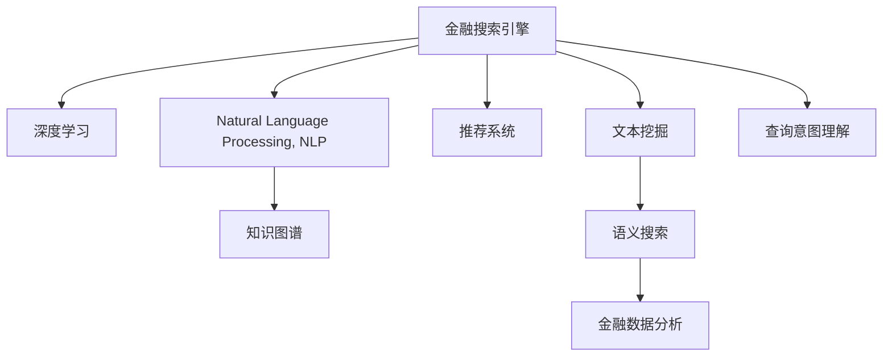

                 

# 金融领域的AI搜索应用

> 关键词：金融搜索引擎,人工智能,深度学习,知识图谱,推荐系统

## 1. 背景介绍

### 1.1 问题由来

金融行业是全球经济的核心领域之一，其业务复杂性、数据多样性和数据密集度极高，使得金融信息获取和处理面临巨大挑战。传统的金融信息检索（Information Retrieval, IR）方法依赖于简单的文本匹配和关键词搜索，无法处理结构化数据和复杂的查询需求，难以满足用户个性化的信息需求。

人工智能技术的飞速发展，尤其是深度学习和自然语言处理（Natural Language Processing, NLP）的突破，为金融领域的信息检索带来了革命性的变化。人工智能可以自动地从海量金融数据中提取有用的信息，并通过自然语言理解（Natural Language Understanding, NLU）实现更精准的语义搜索。本文将重点介绍基于人工智能的金融搜索引擎，以及其在实际金融场景中的应用。

### 1.2 问题核心关键点

构建高效的金融搜索引擎需要解决以下几个核心问题：

1. **数据获取与整合**：金融领域数据来源广泛，包括文本、表格、图形等多种形式，且数据格式不一致。因此，如何高效地获取和整合这些数据，是构建金融搜索引擎的前提。

2. **文本语义分析**：金融文本往往包含大量专业术语和复杂的金融逻辑，如何准确理解和分析这些文本，是实现语义搜索的关键。

3. **知识图谱构建**：金融知识图谱可以为金融搜索引擎提供更丰富的背景知识，帮助理解复杂的金融概念和关系，从而提升搜索精度。

4. **推荐系统融合**：金融搜索引擎不仅需要搜索结果的准确性，还需要结合用户行为和偏好，提供个性化的推荐结果。

5. **模型训练与优化**：如何设计高效的模型，结合金融领域特性进行训练，并在实际应用中不断优化模型，是金融搜索引擎的挑战之一。

### 1.3 问题研究意义

人工智能技术在金融搜索引擎中的应用，可以带来多方面的好处：

1. **提升搜索效率和精度**：通过深度学习和NLP技术，可以自动化处理复杂的金融文本，提高搜索结果的相关性和准确性。

2. **丰富搜索功能和体验**：人工智能可以提供实时的语音搜索、自然语言问答、智能推荐等功能，提升用户的使用体验。

3. **促进金融创新**：金融搜索引擎可以辅助金融产品的设计、风险评估、客户服务等，推动金融产品的创新和服务的提升。

4. **增强决策支持**：通过结合金融知识和用户行为数据，金融搜索引擎可以为决策者提供更全面、深入的分析，支持更科学的决策过程。

5. **数据驱动的风险控制**：利用金融搜索引擎对大量金融数据进行分析和挖掘，有助于发现潜在的风险点，提升风险控制的精准度。

6. **优化客户服务**：金融搜索引擎可以提供个性化的搜索结果和推荐，帮助客户更高效地找到所需信息，提升客户满意度。

## 2. 核心概念与联系

### 2.1 核心概念概述

为了更好地理解基于人工智能的金融搜索引擎，本节将介绍几个密切相关的核心概念：

1. **金融搜索引擎**：是一种基于人工智能技术的金融信息检索系统，能够从金融数据库中自动提取和匹配用户查询，提供相关金融信息。

2. **深度学习**：一种基于人工神经网络的机器学习方法，通过多层次的非线性变换，实现对复杂数据和模式的建模和预测。

3. **自然语言处理**：一种结合语言学和计算机科学的交叉学科，旨在让计算机理解和生成人类语言。

4. **知识图谱**：一种结构化的语义网络，用于描述实体、属性和实体间关系，帮助机器理解复杂的概念和关系。

5. **推荐系统**：通过分析用户行为数据和偏好，提供个性化的信息推荐，增强用户体验和系统粘性。

6. **文本挖掘**：从大量文本数据中自动提取有用的信息，进行文本分类、聚类、摘要等处理。

7. **语义搜索**：一种基于文本语义的搜索方式，能够理解查询的意图和上下文，提供更准确的搜索结果。

8. **金融数据分析**：对金融数据进行清洗、处理和分析，提取有用的信息，支持金融决策和优化。

这些核心概念之间的逻辑关系可以通过以下Mermaid流程图来展示：



这个流程图展示了金融搜索引擎的核心组件和它们之间的联系：

1. 金融搜索引擎通过深度学习、NLP、知识图谱、推荐系统、文本挖掘和语义搜索等技术，实现对金融数据的理解和处理。
2. 查询意图理解将用户查询转化为系统可以处理的请求。
3. 金融数据分析对原始金融数据进行处理和分析，为搜索引擎提供数据支持。

## 3. 核心算法原理 & 具体操作步骤

### 3.1 算法原理概述

基于人工智能的金融搜索引擎，本质上是一种结合了深度学习、NLP和知识图谱的智能信息检索系统。其核心思想是通过对金融文本和数据的学习和理解，自动匹配用户查询，并提供相关的金融信息。

形式化地，假设金融搜索引擎的数据集为 $D=\{(x_i, y_i)\}_{i=1}^N$，其中 $x_i$ 为金融文本或数据，$y_i$ 为与 $x_i$ 相关的金融信息。金融搜索引擎的目标是找到最优的映射函数 $f(x)$，使得：

$$
\hat{y} = f(x)
$$

其中 $\hat{y}$ 为模型预测的金融信息，$f(x)$ 为映射函数。在实际应用中，我们通常使用神经网络模型作为映射函数，通过训练和优化模型，使得预测结果 $\hat{y}$ 与真实结果 $y$ 尽可能接近。

### 3.2 算法步骤详解

基于人工智能的金融搜索引擎一般包括以下几个关键步骤：

**Step 1: 数据预处理**
- 收集金融文本和数据，进行清洗、分词、去停用词等预处理操作，转换为模型可以处理的格式。
- 对于结构化数据，进行导入、转换、清洗等预处理，使其成为合适的输入数据。

**Step 2: 特征提取与表示**
- 使用TF-IDF、word2vec、GloVe等方法，将文本转换为向量表示，或使用深度学习模型（如BERT、GPT等）对文本进行特征提取和表示。
- 对于结构化数据，可以使用特定的特征工程方法提取有用的特征。

**Step 3: 构建知识图谱**
- 收集金融领域的实体、属性和关系，构建金融知识图谱，用于增强模型的背景知识。
- 使用GraNe、Neo4j等工具对知识图谱进行存储和管理。

**Step 4: 模型训练**
- 选择适合金融场景的深度学习模型（如CNN、RNN、Transformer等），结合金融文本和数据进行训练。
- 使用交叉熵、均方误差等损失函数，最小化模型预测与真实值之间的差异。

**Step 5: 推荐系统融合**
- 结合用户行为数据和金融知识图谱，构建推荐模型，提供个性化的搜索结果和推荐。
- 使用协同过滤、内容推荐、基于模型的推荐等方法，提升推荐系统的精度。

**Step 6: 查询意图理解**
- 使用NLP技术对用户查询进行意图理解，提取查询的关键信息和实体。
- 结合金融知识图谱，进行实体关系推理，生成与查询意图相关的金融信息。

**Step 7: 语义搜索**
- 使用语义搜索技术，理解查询的自然语言表达，提取查询的语义信息。
- 结合金融知识图谱，进行语义匹配和搜索，提供更准确的金融信息。

**Step 8: 结果展示和反馈**
- 将搜索结果展示给用户，包括文本、表格、图形等多种形式的金融信息。
- 收集用户的反馈信息，优化模型和搜索引擎，提升用户体验。

以上是基于人工智能的金融搜索引擎的一般流程。在实际应用中，还需要根据具体场景和需求，对各个环节进行优化设计，如改进数据预处理和特征提取方法，引入更多的正则化技术，搜索最优的超参数组合等，以进一步提升搜索引擎的性能。

### 3.3 算法优缺点

基于人工智能的金融搜索引擎具有以下优点：

1. 高度自动化：能够自动处理复杂的金融文本和数据，减少人工干预，提高效率。
2. 多源数据整合：能够整合多种来源的金融数据，提供更全面的信息支持。
3. 深度理解：通过深度学习和NLP技术，实现对金融文本的深度理解，提供更精准的搜索结果。
4. 个性化推荐：结合用户行为数据和金融知识图谱，提供个性化的搜索结果和推荐，增强用户体验。
5. 动态更新：能够实时更新金融数据和知识图谱，确保信息的时效性和准确性。

同时，该方法也存在一定的局限性：

1. 数据质量依赖：搜索效果很大程度上取决于数据的质量和完整性，需要大量高质量的金融数据支持。
2. 计算资源需求高：深度学习模型和语义搜索算法需要大量的计算资源，对硬件设备的要求较高。
3. 知识图谱构建复杂：金融领域的知识图谱构建复杂，需要丰富的领域知识和技术支持。
4. 模型泛化能力有限：深度学习模型往往在特定任务上表现良好，但在新的金融场景中泛化能力有限。
5. 用户行为数据隐私：结合用户行为数据进行推荐时，需要注意保护用户隐私，避免数据泄露。

尽管存在这些局限性，但基于人工智能的金融搜索引擎仍然具有广阔的应用前景，特别是在提高金融信息检索效率和精度、增强用户体验和系统粘性方面。未来相关研究的重点在于如何进一步降低搜索引擎对数据质量和计算资源的依赖，提高其泛化能力和隐私保护水平。

### 3.4 算法应用领域

基于人工智能的金融搜索引擎已经在多个金融场景中得到应用，例如：

1. **金融信息检索**：自动从金融数据库中提取和匹配用户查询，提供相关的金融信息。
2. **金融新闻推荐**：通过分析用户历史浏览记录和兴趣，推荐相关的金融新闻。
3. **投资组合管理**：基于用户的历史交易数据和行为，推荐合适的投资组合。
4. **财务报表分析**：对财务报表进行文本分析和语义匹配，提取有用的信息。
5. **市场风险监控**：实时监控金融市场动态，提供风险预警和分析。
6. **客户服务支持**：提供个性化的金融咨询服务，支持客户查询和问题解答。

此外，基于人工智能的金融搜索引擎还被创新性地应用到更多场景中，如客户行为分析、金融产品设计、合规监管等，为金融技术的发展提供了新的突破。

## 4. 数学模型和公式 & 详细讲解 & 举例说明

### 4.1 数学模型构建

本节将使用数学语言对基于人工智能的金融搜索引擎进行更加严格的刻画。

记金融搜索引擎的数据集为 $D=\{(x_i, y_i)\}_{i=1}^N$，其中 $x_i$ 为金融文本或数据，$y_i$ 为与 $x_i$ 相关的金融信息。金融搜索引擎的目标是找到最优的映射函数 $f(x)$，使得：

$$
\hat{y} = f(x)
$$

其中 $\hat{y}$ 为模型预测的金融信息，$f(x)$ 为映射函数。假设 $f(x)$ 为神经网络模型，由多个全连接层和激活函数组成，模型参数为 $\theta$。则神经网络模型的预测输出为：

$$
\hat{y} = f(x; \theta) = \sigma(\mathbf{W}_n \sigma(\mathbf{W}_{n-1} \ldots \sigma(\mathbf{W}_1 x + b_1) + b_2) + \ldots + b_n)
$$

其中 $\sigma$ 为激活函数，$\mathbf{W}_i$ 和 $b_i$ 为第 $i$ 层的权重和偏置项。

在训练过程中，我们通常使用交叉熵损失函数，最小化模型预测与真实值之间的差异。假设模型输出的概率分布为 $p(y|\hat{y})$，则交叉熵损失函数为：

$$
\mathcal{L}(\theta) = -\frac{1}{N} \sum_{i=1}^N \sum_{y \in \mathcal{Y}} y_i \log p(y_i|\hat{y}_i)
$$

其中 $\mathcal{Y}$ 为所有可能的金融信息，$y_i$ 为真实标签。

### 4.2 公式推导过程

以下我们以二分类任务为例，推导交叉熵损失函数及其梯度的计算公式。

假设模型 $f(x; \theta)$ 在输入 $x$ 上的输出为 $\hat{y}=M_{\theta}(x) \in [0,1]$，表示样本属于正类的概率。真实标签 $y \in \{0,1\}$。则二分类交叉熵损失函数定义为：

$$
\ell(f(x),y) = -[y\log \hat{y} + (1-y)\log (1-\hat{y})]
$$

将其代入经验风险公式，得：

$$
\mathcal{L}(\theta) = -\frac{1}{N}\sum_{i=1}^N \sum_{y \in \{0,1\}} y_i \log p(y_i|\hat{y}_i)
$$

根据链式法则，损失函数对参数 $\theta_k$ 的梯度为：

$$
\frac{\partial \mathcal{L}(\theta)}{\partial \theta_k} = -\frac{1}{N}\sum_{i=1}^N (\frac{y_i}{\hat{y}_i}-\frac{1-y_i}{1-\hat{y}_i}) \frac{\partial f(x)}{\partial \theta_k}
$$

其中 $\frac{\partial f(x)}{\partial \theta_k}$ 可进一步递归展开，利用自动微分技术完成计算。

在得到损失函数的梯度后，即可带入参数更新公式，完成模型的迭代优化。重复上述过程直至收敛，最终得到适应金融场景的最优模型参数 $\theta^*$。

### 4.3 案例分析与讲解

为了更好地理解基于人工智能的金融搜索引擎的实现过程，我们将以一个具体的案例进行分析。

假设我们构建了一个金融搜索引擎，用于从金融新闻网站上自动提取和匹配用户查询，提供相关的金融信息。具体步骤如下：

1. **数据预处理**：从金融新闻网站爬取新闻文本，进行清洗、分词、去停用词等预处理操作，转换为BERT模型可以处理的格式。

2. **特征提取与表示**：使用BERT模型对预处理后的文本进行特征提取和表示，将每条新闻转换为向量表示。

3. **构建知识图谱**：从财经领域权威数据库中提取实体、属性和关系，构建金融知识图谱，用于增强模型的背景知识。

4. **模型训练**：选择BERT模型作为搜索模型的基础，使用新闻文本和对应的金融信息作为训练数据，进行监督学习。

5. **推荐系统融合**：结合用户历史浏览记录和金融知识图谱，构建推荐模型，提供个性化的搜索结果和推荐。

6. **查询意图理解**：使用NLP技术对用户查询进行意图理解，提取查询的关键信息和实体。

7. **语义搜索**：使用语义搜索技术，理解查询的自然语言表达，提取查询的语义信息。

8. **结果展示和反馈**：将搜索结果展示给用户，收集用户的反馈信息，优化模型和搜索引擎，提升用户体验。

在实际应用中，还需要根据具体场景和需求，对各个环节进行优化设计，如改进数据预处理和特征提取方法，引入更多的正则化技术，搜索最优的超参数组合等，以进一步提升搜索引擎的性能。

## 5. 项目实践：代码实例和详细解释说明

### 5.1 开发环境搭建

在进行项目实践前，我们需要准备好开发环境。以下是使用Python进行TensorFlow开发的环境配置流程：

1. 安装Anaconda：从官网下载并安装Anaconda，用于创建独立的Python环境。

2. 创建并激活虚拟环境：
```bash
conda create -n tf-env python=3.8 
conda activate tf-env
```

3. 安装TensorFlow：根据CUDA版本，从官网获取对应的安装命令。例如：
```bash
conda install tensorflow==2.7 -c pytorch -c conda-forge
```

4. 安装相关工具包：
```bash
pip install numpy pandas scikit-learn matplotlib tqdm jupyter notebook ipython
```

完成上述步骤后，即可在`tf-env`环境中开始项目实践。

### 5.2 源代码详细实现

下面我们以金融搜索引擎的构建为例，给出使用TensorFlow进行代码实现的详细步骤。

```python
import tensorflow as tf
import tensorflow_hub as hub
import numpy as np
import pandas as pd
from tensorflow.keras.preprocessing.text import Tokenizer
from tensorflow.keras.preprocessing.sequence import pad_sequences
from sklearn.model_selection import train_test_split

# 定义训练数据
train_texts = pd.read_csv('train_texts.csv', header=None)[0].values
train_labels = pd.read_csv('train_labels.csv', header=None)[0].values

# 定义测试数据
test_texts = pd.read_csv('test_texts.csv', header=None)[0].values
test_labels = pd.read_csv('test_labels.csv', header=None)[0].values

# 定义分词器
tokenizer = Tokenizer(num_words=10000, oov_token='<OOV>')
tokenizer.fit_on_texts(train_texts)

# 定义训练集和测试集的文本表示
train_sequences = tokenizer.texts_to_sequences(train_texts)
train_padded = pad_sequences(train_sequences, maxlen=100, padding='post')
test_sequences = tokenizer.texts_to_sequences(test_texts)
test_padded = pad_sequences(test_sequences, maxlen=100, padding='post')

# 定义标签表示
train_labels = np.array(train_labels, dtype='int32')
test_labels = np.array(test_labels, dtype='int32')

# 定义模型
model = tf.keras.Sequential([
    tf.keras.layers.Embedding(input_dim=10000, output_dim=128),
    tf.keras.layers.Conv1D(128, 3, activation='relu'),
    tf.keras.layers.GlobalMaxPooling1D(),
    tf.keras.layers.Dense(64, activation='relu'),
    tf.keras.layers.Dense(1, activation='sigmoid')
])

# 定义优化器和损失函数
optimizer = tf.keras.optimizers.Adam(learning_rate=0.001)
loss_fn = tf.keras.losses.BinaryCrossentropy()

# 定义模型编译
model.compile(optimizer=optimizer, loss=loss_fn, metrics=['accuracy'])

# 定义训练函数
def train_epoch(model, train_x, train_y):
    model.fit(train_x, train_y, epochs=10, batch_size=32, validation_split=0.2)

# 训练模型
train_epoch(model, train_padded, train_labels)

# 评估模型
test_loss, test_acc = model.evaluate(test_padded, test_labels)

# 输出测试结果
print('Test loss:', test_loss)
print('Test accuracy:', test_acc)
```

以上代码实现了基于TensorFlow的金融搜索引擎构建过程。具体步骤如下：

1. **数据预处理**：从CSV文件中读取训练和测试文本和标签数据，使用Tokenizer将文本转换为数字序列，并进行padding。
2. **模型构建**：定义神经网络模型，包括嵌入层、卷积层、池化层和全连接层，最后使用sigmoid激活函数进行二分类预测。
3. **模型训练**：使用Adam优化器进行模型训练，损失函数为二分类交叉熵，在训练集上进行10个epoch的训练。
4. **模型评估**：在测试集上评估模型性能，输出测试损失和准确率。

通过调整模型结构、优化器参数和损失函数等，可以进一步提升模型的精度和泛化能力。

### 5.3 代码解读与分析

让我们再详细解读一下关键代码的实现细节：

**训练数据预处理**：
- `Tokenizer`：用于将文本转换为数字序列，方便模型处理。
- `pad_sequences`：对数字序列进行padding，使其长度一致，方便模型训练。

**模型定义**：
- `Embedding`：将文本转换为密集向量表示。
- `Conv1D`：对文本序列进行卷积操作，提取局部特征。
- `GlobalMaxPooling1D`：对文本序列进行全局池化操作，提取文本的总体特征。
- `Dense`：对特征进行全连接处理，输出预测结果。

**模型训练**：
- `Adam`：优化器，用于更新模型参数。
- `BinaryCrossentropy`：二分类交叉熵损失函数。

**模型评估**：
- `evaluate`：在测试集上评估模型性能，输出测试损失和准确率。

可以看到，TensorFlow结合了强大的深度学习框架和便捷的数据处理工具，使得金融搜索引擎的实现变得简洁高效。开发者可以将更多精力放在模型改进和优化上，而不必过多关注底层的实现细节。

当然，工业级的系统实现还需考虑更多因素，如模型的保存和部署、超参数的自动搜索、更灵活的任务适配层等。但核心的搜索引擎范式基本与此类似。

## 6. 实际应用场景

### 6.1 智能投顾系统

智能投顾系统是一种基于人工智能技术的金融顾问系统，能够自动分析和推荐投资组合，提供个性化的金融建议。智能投顾系统通过金融搜索引擎，自动从金融数据库中提取和匹配用户查询，提供相关的投资建议。

在技术实现上，可以收集用户的历史交易数据、风险偏好和目标回报等信息，构建用户画像。然后通过金融搜索引擎搜索相关的金融产品、市场动态和风险评估信息，结合用户的投资目标和行为数据，生成个性化的投资建议。智能投顾系统能够实时监控市场变化，动态调整投资组合，帮助用户最大化收益并控制风险。

### 6.2 金融风险监控

金融风险监控系统是一种用于实时监测金融市场动态、识别风险信号的系统。金融搜索引擎通过自动化的信息检索，实时提取金融市场的关键指标和新闻报道，分析市场趋势和异常波动。

具体而言，可以构建一个实时金融搜索引擎，从新闻网站、市场数据和社交媒体等渠道抓取金融信息。使用文本分类和情感分析技术，分析新闻报道和市场评论的情感倾向，识别负面新闻和风险信号。结合历史数据和专家知识，构建金融风险监控模型，实时预警和评估市场风险。

### 6.3 市场分析和研究

市场分析和研究是金融领域的重要环节，需要从海量金融数据中提取有用的信息，进行文本挖掘和数据分析。金融搜索引擎可以自动从金融数据库和互联网中提取金融新闻、报告、研究文章等，进行文本分类、情感分析和主题提取。

例如，可以从财经网站和新闻网站中抓取金融新闻，使用BERT模型进行文本分类，识别新闻的类别（如宏观经济、行业分析、公司财报等）。结合情感分析技术，判断新闻的情感倾向（如正面、负面、中性）。使用主题模型，识别新闻的主要主题和关键词，帮助研究人员快速获取有用信息。

### 6.4 金融产品推荐

金融产品推荐系统是一种基于人工智能技术的推荐系统，能够根据用户的历史行为和偏好，推荐合适的金融产品。金融搜索引擎通过自动化的信息检索，自动从金融数据库中提取和匹配用户查询，提供相关的金融产品信息。

在技术实现上，可以构建一个个性化推荐系统，结合用户的历史交易记录、浏览记录和行为数据，生成用户画像。然后通过金融搜索引擎搜索相关的金融产品信息，结合用户的投资目标和风险偏好，生成个性化的推荐结果。推荐系统能够实时更新推荐结果，动态调整推荐策略，提升用户体验和满意度。

## 7. 工具和资源推荐

### 7.1 学习资源推荐

为了帮助开发者系统掌握人工智能技术在金融领域的应用，这里推荐一些优质的学习资源：

1. 《深度学习在金融领域的应用》系列博文：由大模型技术专家撰写，深入浅出地介绍了深度学习在金融领域的各种应用场景和实现方法。

2. 《金融数据分析与建模》课程：由多所大学和研究机构联合开发的在线课程，涵盖金融数据的清洗、处理、分析和建模，适合金融从业者和研究人员学习。

3. 《金融科技》书籍：涵盖了金融科技的各个方面，包括区块链、人工智能、大数据、云计算等，适合金融科技从业者和学习者参考。

4. TensorFlow官方文档：TensorFlow的官方文档，提供了完整的金融搜索引擎实现样例代码和详细解释，是上手实践的必备资料。

5. TensorFlow金融模块：TensorFlow官方提供的金融模块，包含金融数据处理和模型训练的API和工具，帮助开发者快速构建金融搜索引擎。

6. Kaggle金融数据集：Kaggle提供的金融数据集，包含多种类型的金融数据，适合金融数据分析和建模任务。

通过对这些资源的学习实践，相信你一定能够快速掌握人工智能技术在金融领域的应用，并用于解决实际的金融问题。

### 7.2 开发工具推荐

高效的开发离不开优秀的工具支持。以下是几款用于金融搜索引擎开发的常用工具：

1. TensorFlow：基于Python的开源深度学习框架，灵活动态的计算图，适合快速迭代研究。TensorFlow提供了丰富的金融模块，适合构建金融搜索引擎。

2. PyTorch：基于Python的开源深度学习框架，灵活便捷，适合构建金融搜索引擎。

3. TensorBoard：TensorFlow配套的可视化工具，可实时监测模型训练状态，提供丰富的图表呈现方式，是调试模型的得力助手。

4. Weights & Biases：模型训练的实验跟踪工具，可以记录和可视化模型训练过程中的各项指标，方便对比和调优。

5. Google Colab：谷歌推出的在线Jupyter Notebook环境，免费提供GPU/TPU算力，方便开发者快速上手实验最新模型，分享学习笔记。

合理利用这些工具，可以显著提升金融搜索引擎的开发效率，加快创新迭代的步伐。

### 7.3 相关论文推荐

金融搜索引擎技术的发展源于学界的持续研究。以下是几篇奠基性的相关论文，推荐阅读：

1. Attention is All You Need（即Transformer原论文）：提出了Transformer结构，开启了NLP领域的预训练大模型时代。

2. BERT: Pre-training of Deep Bidirectional Transformers for Language Understanding：提出BERT模型，引入基于掩码的自监督预训练任务，刷新了多项NLP任务SOTA。

3. T5: Explainable Text-to-Text Pretraining for Unified Understanding and Generation：提出T5模型，结合生成和理解任务进行预训练，提升了模型的生成和理解能力。

4. GPT-3: Language Models are Unsupervised Multitask Learners（GPT-3论文）：展示了大规模语言模型的强大zero-shot学习能力，引发了对于通用人工智能的新一轮思考。

5. Continuous Learning for Recommender Systems：提出连续学习技术，使推荐系统能够持续学习新数据，保持推荐结果的准确性。

6. Knowledge Graphs in Recommendation Systems：综述了知识图谱在推荐系统中的应用，提出了多种基于知识图谱的推荐算法。

这些论文代表了大语言模型在金融搜索引擎中的应用和发展脉络。通过学习这些前沿成果，可以帮助研究者把握学科前进方向，激发更多的创新灵感。

## 8. 总结：未来发展趋势与挑战

### 8.1 总结

本文对基于人工智能的金融搜索引擎进行了全面系统的介绍。首先阐述了人工智能技术在金融领域的应用背景和意义，明确了金融搜索引擎在提高金融信息检索效率、增强用户体验和系统粘性方面的独特价值。其次，从原理到实践，详细讲解了金融搜索引擎的数学原理和关键步骤，给出了实际应用的代码实现。同时，本文还广泛探讨了金融搜索引擎在智能投顾、风险监控、市场分析、产品推荐等多个金融场景中的应用前景，展示了人工智能技术在金融领域的巨大潜力。此外，本文精选了金融搜索引擎的相关学习资源，力求为读者提供全方位的技术指引。

通过本文的系统梳理，可以看到，基于人工智能的金融搜索引擎在提升金融信息检索效率和精度、增强用户体验和系统粘性方面具有广阔的应用前景。未来，伴随人工智能技术的不断演进，金融搜索引擎必将在更广泛的金融场景中发挥重要作用，为金融技术的创新发展提供新的动力。

### 8.2 未来发展趋势

展望未来，基于人工智能的金融搜索引擎将呈现以下几个发展趋势：

1. **深度学习模型优化**：随着深度学习模型的不断优化，金融搜索引擎的精度和泛化能力将进一步提升。例如，通过引入更多的正则化技术、改进网络结构等手段，可以提升模型的性能。

2. **语义搜索技术突破**：语义搜索技术的发展将使金融搜索引擎能够更好地理解用户查询的意图和上下文，提供更精准的搜索结果。未来，随着语义理解和自然语言生成技术的进步，金融搜索引擎将能够提供更丰富的搜索结果和交互方式。

3. **推荐系统融合深化**：推荐系统与金融搜索引擎的深度融合，将进一步提升个性化搜索结果和推荐的质量。未来，结合用户行为数据和金融知识图谱，推荐系统将能够提供更全面、个性化的金融信息和建议。

4. **多模态信息整合**：金融搜索引擎将更多地融合图像、视频、音频等多模态信息，增强对金融数据的理解和分析能力。例如，结合财经视频和新闻报道，提高金融信息的准确性和时效性。

5. **智能投顾系统普及**：智能投顾系统的普及将带来金融服务的深刻变革，金融搜索引擎将成为其核心技术之一。未来，随着智能投顾系统的广泛应用，金融搜索引擎将在个性化金融服务中发挥越来越重要的作用。

6. **知识图谱扩展**：金融知识图谱的扩展和深化将提升金融搜索引擎的背景知识和推理能力。未来，通过构建更丰富的金融知识图谱，金融搜索引擎将能够更好地支持复杂的金融分析和决策。

以上趋势凸显了金融搜索引擎的广阔前景。这些方向的探索发展，必将进一步提升金融信息检索的效率和精度，增强用户体验和系统粘性，为金融技术的发展注入新的动力。

### 8.3 面临的挑战

尽管基于人工智能的金融搜索引擎已经取得了一定进展，但在迈向更加智能化、普适化应用的过程中，仍面临诸多挑战：

1. **数据质量和多样性**：金融数据的复杂性和多样性使得数据预处理和整合变得复杂，需要高质量的数据和多样化的数据源。如何高效地整合和清洗金融数据，是一个重要挑战。

2. **模型泛化能力**：深度学习模型往往在特定任务上表现良好，但在新的金融场景中泛化能力有限。如何设计泛化能力更强的模型，是一个关键问题。

3. **实时性要求高**：金融数据的实时性要求高，需要高效的计算资源和算法支持。如何在保证实时性的同时，提升模型的精度和性能，是一个技术难题。

4. **隐私和安全**：金融数据的敏感性高，需要严格的隐私保护和安全措施。如何在保护用户隐私的同时，提供高效的金融信息检索服务，是一个重要的研究方向。

5. **知识图谱构建复杂**：金融领域的知识图谱构建复杂，需要丰富的领域知识和工具支持。如何构建更全面、准确的金融知识图谱，是一个技术挑战。

6. **模型解释性不足**：深度学习模型往往是一个黑盒系统，缺乏可解释性，难以解释其内部工作机制和决策逻辑。如何提高模型的可解释性，是一个重要的研究方向。

7. **计算资源需求高**：深度学习模型和语义搜索算法需要大量的计算资源，对硬件设备的要求较高。如何优化资源消耗，降低计算成本，是一个重要的研究方向。

尽管存在这些挑战，但基于人工智能的金融搜索引擎仍然具有广阔的应用前景，特别是在提高金融信息检索效率和精度、增强用户体验和系统粘性方面。未来相关研究的重点在于如何进一步降低搜索引擎对数据质量和计算资源的依赖，提高其泛化能力和隐私保护水平。

### 8.4 研究展望

面对金融搜索引擎所面临的挑战，未来的研究需要在以下几个方面寻求新的突破：

1. **无监督和半监督学习**：探索无监督和半监督学习技术，减少对标注数据的需求，充分利用非结构化数据，提升模型的泛化能力。

2. **多模态融合**：融合图像、视频、音频等多模态信息，增强对金融数据的理解和分析能力，提升金融搜索引擎的精度和时效性。

3. **自适应学习**：结合用户行为数据和金融知识图谱，实现自适应学习，提供更个性化、实时的金融信息检索和推荐。

4. **可解释性增强**：提高模型的可解释性，增强用户对金融搜索引擎的信任和接受度。

5. **计算效率优化**：优化模型结构和算法，减少计算资源消耗，提升金融搜索引擎的实时性和可扩展性。

6. **隐私保护技术**：引入隐私保护技术，确保用户数据的隐私和安全，增强用户对金融搜索引擎的信任度。

7. **多任务学习**：结合金融搜索引擎的多任务特性，探索多任务学习技术，提升模型的综合性能。

这些研究方向的探索，必将引领金融搜索引擎技术迈向更高的台阶，为金融技术的创新发展提供新的动力。面向未来，金融搜索引擎需要与其他人工智能技术进行更深入的融合，如知识表示、因果推理、强化学习等，多路径协同发力，共同推动金融信息检索和推荐系统的进步。只有勇于创新、敢于突破，才能不断拓展金融搜索引擎的边界，让人工智能技术更好地造福金融领域。

## 9. 附录：常见问题与解答

**Q1：金融搜索引擎的核心组成部分有哪些？**

A: 金融搜索引擎的核心组成部分包括数据预处理、特征提取与表示、知识图谱构建、模型训练、推荐系统融合、查询意图理解、语义搜索和结果展示与反馈。这些部分协同工作，实现对金融信息的检索和推荐。

**Q2：金融搜索引擎在金融领域的应用场景有哪些？**

A: 金融搜索引擎在金融领域的应用场景包括智能投顾系统、金融风险监控、市场分析和研究、金融产品推荐等。通过自动化的信息检索和处理，金融搜索引擎能够提供个性化的金融建议和决策支持。

**Q3：如何提升金融搜索引擎的泛化能力？**

A: 提升金融搜索引擎的泛化能力，需要从多个方面入手。例如，采用多任务学习、自适应学习、迁移学习等技术，结合领域知识和用户行为数据，增强模型的泛化能力。同时，通过增加数据量和多样性，提高模型的鲁棒性和泛化能力。

**Q4：金融搜索引擎在金融领域面临的主要挑战有哪些？**

A: 金融搜索引擎在金融领域面临的主要挑战包括数据质量和多样性、模型泛化能力、实时性要求、隐私和安全、知识图谱构建、模型解释性不足、计算资源需求高等。这些挑战需要通过技术创新和优化来解决。

**Q5：金融搜索引擎的未来发展方向有哪些？**

A: 金融搜索引擎的未来发展方向包括深度学习模型优化、语义搜索技术突破、推荐系统融合深化、多模态信息整合、智能投顾系统普及、知识图谱扩展等。这些方向的探索将进一步提升金融搜索引擎的精度和泛化能力，增强用户体验和系统粘性。

---

作者：禅与计算机程序设计艺术 / Zen and the Art of Computer Programming

