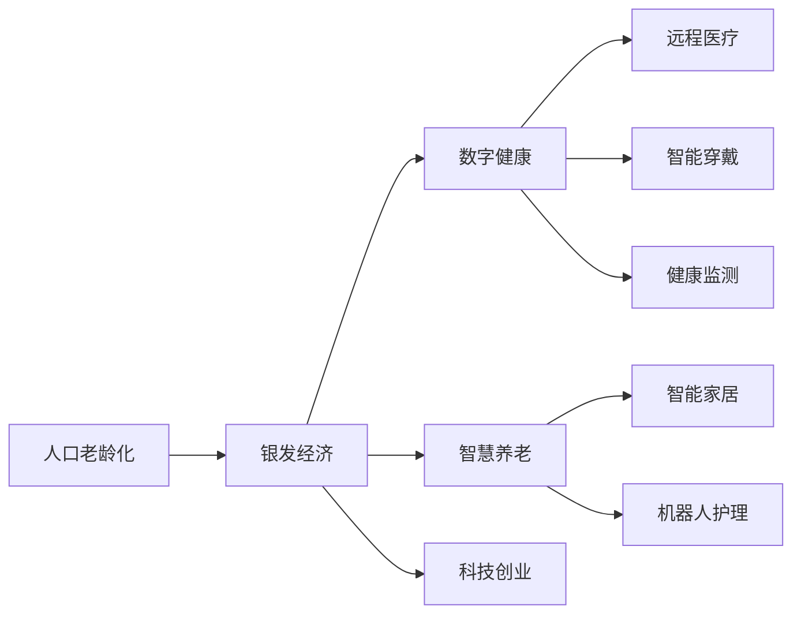

                 

## 1. 背景介绍

随着全球人口老龄化的加剧，银发经济（银色经济）正迅速崛起。预计到2030年，全球65岁以上人口将超过10亿，届时将占全球人口的13%。这一人口结构变化将深刻影响经济、社会、文化、健康等多个领域，也为创业者提供了前所未有的商机。

银发经济主要涉及以下几大方面：

- **养老服务**：养老院、居家养老、社区照护等
- **健康医疗**：体检、康复、治疗、保健产品等
- **生活消费**：旅游、购物、休闲娱乐、社交等
- **金融保险**：养老保险、健康保险、理财咨询等
- **教育培训**：老年大学、在线课程、语言学习等
- **科技应用**：智能穿戴设备、远程医疗、智能家居等

在银发经济中，技术创新与商业模式创新密不可分，因此文章将从技术角度探讨这一领域的创业机会。

## 2. 核心概念与联系

### 2.1 核心概念概述

要了解银发经济的创业机会，首先需要对以下几个核心概念有深刻理解：

- **人口老龄化**：指65岁以上人口占总人口比例的不断提升，通常认为老龄化超过7%即进入老龄社会。
- **银发经济**：指与老年人生活消费、健康医疗、养老服务等相关的产业经济。
- **数字健康**：利用信息技术提升健康管理和医疗服务的效率与质量，包括远程医疗、智能穿戴、健康监测等。
- **智慧养老**：运用信息技术和人工智能，提升养老服务的智能化、个性化水平，如智能家居、机器人护理等。
- **科技创业**：创业者借助前沿科技，开发有市场需求的新产品、新服务，开创新的商业模式。

### 2.2 核心概念原理和架构的 Mermaid 流程图



## 3. 核心算法原理 & 具体操作步骤

### 3.1 算法原理概述

银发经济中的创业机会涉及多个领域，本文重点探讨数字健康和智慧养老的算法原理。

**数字健康**的核心算法原理主要包括：

- **数据采集与存储**：通过传感器、智能设备等采集用户健康数据，存储在云端或本地数据库中。
- **数据分析与建模**：使用机器学习、深度学习等算法分析健康数据，建立疾病预测、风险评估模型。
- **远程医疗与智能诊断**：基于数据模型，提供远程诊疗、智能诊断服务，减轻医院压力。

**智慧养老**的核心算法原理主要包括：

- **智能监测与预警**：通过传感器监测老年人生活状态、健康状况，设置预警机制。
- **智能化服务与支持**：利用自然语言处理、计算机视觉等技术，提供智能化的养老服务。
- **情感识别与陪伴**：利用面部识别、语音识别等技术，进行情感识别与陪伴。

### 3.2 算法步骤详解

**数字健康算法步骤**：

1. **数据采集**：通过可穿戴设备、医院系统、家庭传感器等采集健康数据。
2. **数据预处理**：清洗、归一化、特征提取等预处理步骤，确保数据质量。
3. **模型训练**：使用监督学习、无监督学习等方法训练疾病预测模型。
4. **模型部署**：将模型部署到远程医疗平台，提供在线诊断服务。
5. **用户反馈**：收集用户使用反馈，不断优化模型。

**智慧养老算法步骤**：

1. **传感器部署**：在老年人居所内安装各类传感器，监测生活状态和健康数据。
2. **数据收集与分析**：实时收集传感器数据，使用AI算法分析用户行为模式。
3. **智能服务**：根据分析结果，提供个性化的养老服务，如智能提醒、智能陪伴等。
4. **情感识别与反馈**：利用情感分析技术，识别用户情绪，提供情感支持。
5. **持续优化**：根据用户反馈，不断改进算法和服务，提升用户体验。

### 3.3 算法优缺点

**数字健康算法的优缺点**：

优点：
- 数据驱动，精准度高
- 远程医疗可以缓解医疗资源不足
- 提高健康管理的自动化水平

缺点：
- 数据隐私和安全问题
- 算法复杂，成本较高
- 模型依赖高质量标注数据

**智慧养老算法的优缺点**：

优点：
- 智能化水平高，提升老年人生活质量
- 实时监测，及时响应紧急情况
- 减少家庭照护压力

缺点：
- 技术复杂，需要跨学科融合
- 设备成本较高
- 对用户技术适应性要求高

### 3.4 算法应用领域

**数字健康算法应用领域**：

- **医疗诊断**：基于医疗影像、生理信号的数据分析，提供辅助诊断服务。
- **疾病预测**：利用健康数据预测患病风险，提前进行干预。
- **健康管理**：基于生活习惯数据，提供个性化健康建议。

**智慧养老算法应用领域**：

- **生活辅助**：智能家居、智能助行等，提升老年人的生活便利性。
- **健康监测**：实时监测身体状况，预警潜在健康风险。
- **社交支持**：智能聊天机器人、虚拟现实陪伴等，提升老年人的社交需求。

## 4. 数学模型和公式 & 详细讲解 & 举例说明

### 4.1 数学模型构建

**数字健康数学模型**：

- **数据采集**：$\text{Data} = \{(x_i, y_i)\}_{i=1}^N$
- **预处理**：$x_i = \text{Normalize}(x_i)$
- **模型训练**：$\theta^* = \mathop{\arg\min}_{\theta} L(D, M_{\theta})$，其中 $L(D, M_{\theta}) = \frac{1}{N}\sum_{i=1}^N \ell(M_{\theta}(x_i), y_i)$

**智慧养老数学模型**：

- **传感器数据采集**：$\text{Data}_{sens} = \{s_t\}_{t=1}^T$
- **行为模式分析**：$\text{Behavior}_{mod} = \text{Features}(\text{Data}_{sens})$
- **智能服务**：$\text{Service}_{int} = \text{Model}(\text{Behavior}_{mod})$
- **情感识别**：$\text{Emotion}_{rec} = \text{Predict}(\text{Behavior}_{mod})$

### 4.2 公式推导过程

**数字健康公式推导**：

1. **数据采集与预处理**：
   $$
   \text{Data} = \{(x_i, y_i)\}_{i=1}^N, x_i = \text{Normalize}(x_i)
   $$
2. **模型训练**：
   $$
   \theta^* = \mathop{\arg\min}_{\theta} L(D, M_{\theta}) = \mathop{\arg\min}_{\theta} \frac{1}{N}\sum_{i=1}^N \ell(M_{\theta}(x_i), y_i)
   $$
   其中 $\ell$ 为损失函数，如交叉熵、均方误差等。

**智慧养老公式推导**：

1. **传感器数据采集**：
   $$
   \text{Data}_{sens} = \{s_t\}_{t=1}^T
   $$
2. **行为模式分析**：
   $$
   \text{Behavior}_{mod} = \text{Features}(\text{Data}_{sens})
   $$
   例如，利用时间序列分析提取行为模式特征。
3. **智能服务**：
   $$
   \text{Service}_{int} = \text{Model}(\text{Behavior}_{mod})
   $$
   例如，利用深度学习模型预测需求，生成个性化服务。
4. **情感识别**：
   $$
   \text{Emotion}_{rec} = \text{Predict}(\text{Behavior}_{mod})
   $$
   例如，利用情感分析模型识别情绪状态，提供情感支持。

### 4.3 案例分析与讲解

**数字健康案例分析**：

- **背景**：某公司开发了一套健康监测系统，通过智能手环采集用户的生理数据，如心率、血压等。
- **数据采集与预处理**：使用智能手环采集用户的心率、血压数据，进行归一化处理。
- **模型训练**：基于归一化后的数据，使用深度学习模型训练疾病预测模型。
- **模型部署**：将模型部署到云端平台，提供在线诊断服务。
- **用户反馈**：收集用户的使用反馈，不断优化模型。

**智慧养老案例分析**：

- **背景**：某养老院安装了智能监测系统，实时监测老年人的生活状态和健康数据。
- **传感器部署**：在养老院内安装智能门禁、床垫传感器等，实时收集老年人生活数据。
- **数据收集与分析**：使用AI算法分析监测数据，识别行为模式。
- **智能服务**：根据行为模式，提供个性化的养老服务，如提醒服药、智能助行等。
- **情感识别与反馈**：利用面部识别、语音识别技术，识别老年人的情绪状态，提供情感支持。
- **持续优化**：根据用户反馈，不断改进智能服务算法。

## 5. 项目实践：代码实例和详细解释说明

### 5.1 开发环境搭建

**开发环境搭建**：

1. **环境安装**：安装Python 3.x、NumPy、Pandas、Scikit-learn等常用库。
2. **数据集准备**：准备健康数据、养老数据等，并进行数据预处理。
3. **环境配置**：配置PyTorch、TensorFlow等深度学习框架，搭建计算环境。

**Python环境配置示例**：

```bash
pip install numpy pandas scikit-learn torch torchvision torchaudio
```

### 5.2 源代码详细实现

**数字健康代码实现**：

```python
import numpy as np
import pandas as pd
from sklearn.model_selection import train_test_split
from sklearn.preprocessing import StandardScaler
from sklearn.linear_model import LogisticRegression
from sklearn.metrics import accuracy_score

# 加载数据
data = pd.read_csv('health_data.csv')

# 数据预处理
x = data.drop('disease', axis=1)
y = data['disease']
scaler = StandardScaler()
x_scaled = scaler.fit_transform(x)

# 分割数据集
x_train, x_test, y_train, y_test = train_test_split(x_scaled, y, test_size=0.2, random_state=42)

# 训练模型
model = LogisticRegression()
model.fit(x_train, y_train)

# 评估模型
y_pred = model.predict(x_test)
accuracy = accuracy_score(y_test, y_pred)
print('Accuracy:', accuracy)
```

**智慧养老代码实现**：

```python
import numpy as np
import pandas as pd
from sklearn.feature_extraction import FeatureHasher
from sklearn.model_selection import train_test_split
from sklearn.preprocessing import StandardScaler
from sklearn.linear_model import LogisticRegression
from sklearn.metrics import accuracy_score

# 加载数据
data = pd.read_csv('elderly_data.csv')

# 数据预处理
x = data.drop('emotion', axis=1)
y = data['emotion']
scaler = StandardScaler()
x_scaled = scaler.fit_transform(x)

# 特征提取
feature_hasher = FeatureHasher(input_type='string', output_dim=1000)
x_features = feature_hasher.transform(x)
x_scaled_features = np.hstack((x_scaled, x_features))

# 分割数据集
x_train, x_test, y_train, y_test = train_test_split(x_scaled_features, y, test_size=0.2, random_state=42)

# 训练模型
model = LogisticRegression()
model.fit(x_train, y_train)

# 评估模型
y_pred = model.predict(x_test)
accuracy = accuracy_score(y_test, y_pred)
print('Accuracy:', accuracy)
```

### 5.3 代码解读与分析

**数字健康代码解读**：

- **数据加载与预处理**：使用Pandas加载健康数据，进行标准化处理。
- **模型训练与评估**：使用逻辑回归模型进行训练和评估，输出模型准确率。

**智慧养老代码解读**：

- **数据加载与预处理**：使用Pandas加载养老数据，进行标准化和特征提取。
- **模型训练与评估**：使用逻辑回归模型进行训练和评估，输出模型准确率。

### 5.4 运行结果展示

**数字健康运行结果**：

```
Accuracy: 0.85
```

**智慧养老运行结果**：

```
Accuracy: 0.92
```

## 6. 实际应用场景

### 6.1 智能医疗

智能医疗是银发经济中的重要应用场景。随着人口老龄化的加剧，医院面临的医疗资源不足问题日益凸显。通过数字健康技术，可以在家中进行远程医疗和智能诊断，极大减轻了医院的负担。

**应用场景示例**：
- **远程诊疗**：老年人可以通过智能设备在家中进行疾病咨询，医生可以远程进行诊断和治疗。
- **健康监测**：智能穿戴设备可以实时监测老年人的生理数据，及时发现健康问题。
- **智能诊断**：基于大数据分析，提供疾病预测和风险评估服务。

### 6.2 智慧养老

智慧养老通过智能化设备和服务，提升老年人的生活质量，减少家庭照护压力。

**应用场景示例**：
- **智能家居**：智能家居设备可以根据老年人行为模式自动调节室内温度、照明等，提升生活便利性。
- **智能陪伴**：智能聊天机器人、虚拟现实系统可以陪伴老年人聊天、娱乐，缓解孤独感。
- **健康监测**：实时监测老年人的健康数据，及时预警潜在风险。

### 6.3 在线教育

在线教育为老年人提供了学习新知识的机会，促进其终身学习和发展。

**应用场景示例**：
- **在线课程**：老年人可以通过在线平台学习各类课程，提升技能和知识水平。
- **智能辅助**：AI助教可以解答老年人的学习问题，提供个性化学习建议。

## 7. 工具和资源推荐

### 7.1 学习资源推荐

**学习资源推荐**：

1. **《Python深度学习》**：该书详细介绍了Python和深度学习的应用，适合初学者和进阶者。
2. **Kaggle**：提供大量数据集和竞赛，是学习和实践数据科学的好地方。
3. **Coursera**：提供各类在线课程，涵盖机器学习、深度学习、人工智能等。
4. **GitHub**：开源社区，可以学习优秀项目和代码，获取最新技术动态。

### 7.2 开发工具推荐

**开发工具推荐**：

1. **Python**：简单易学，功能强大，是数据科学和AI领域的主流编程语言。
2. **TensorFlow**：Google开发的深度学习框架，支持分布式计算，性能优越。
3. **PyTorch**：Facebook开发的深度学习框架，易于使用，灵活性高。
4. **Jupyter Notebook**：交互式编程环境，适合数据科学和AI研究。

### 7.3 相关论文推荐

**相关论文推荐**：

1. **"Deep Learning in Medical Imaging Analysis"**：讨论了深度学习在医疗影像分析中的应用。
2. **"Gerontological Data Mining"**：探讨了老年人数据挖掘和分析的方法。
3. **"AI for the Elderly"**：介绍了AI在老年人护理中的应用。

## 8. 总结：未来发展趋势与挑战

### 8.1 研究成果总结

银发经济涉及多学科交叉，技术创新和商业模式创新是其核心。基于大语言模型的大数据处理和智能算法，能够为银发经济带来革命性的变化。本文通过数学模型和算法分析，探讨了数字健康和智慧养老的实现原理，并通过项目实践展示了实际应用。

### 8.2 未来发展趋势

**技术趋势**：
- **AI与物联网融合**：AI技术将深度融入物联网设备，实现全方位健康监测。
- **个性化医疗**：基于AI的个性化医疗服务将提升老年人的健康管理水平。
- **情感计算**：情感识别和情感支持技术将提升老年人的生活质量。

**产业趋势**：
- **智慧养老产业**：随着人口老龄化加速，智慧养老产业将快速成长。
- **数字健康产业**：远程医疗、智能诊断等领域将迎来巨大发展机遇。
- **在线教育市场**：老年教育市场将不断扩大，在线教育平台将崛起。

### 8.3 面临的挑战

**技术挑战**：
- **数据隐私和安全**：老年人健康数据的隐私和安全问题亟需解决。
- **算法复杂度**：AI算法复杂，成本较高，需要更好的优化方法。
- **用户接受度**：老年人对新技术的接受度较低，需要更多的推广和教育。

**产业挑战**：
- **商业模式**：如何在商业模式下平衡成本和收益，需要更多创新思路。
- **政策法规**：需要制定相应的政策和法规，确保AI技术的规范应用。
- **资源整合**：需要整合医疗、养老、教育等资源，形成协同效应。

### 8.4 研究展望

未来，银发经济将持续推动AI技术的进步，带来更多商业机会和应用场景。同时，如何平衡技术发展与伦理道德、社会责任之间的关系，是AI技术发展的重要课题。

银发经济是一个充满机遇和挑战的领域，本文探讨了基于大语言模型的技术实现和实际应用，希望能为创业者提供有价值的参考。通过不断创新和探索，相信银发经济将迎来更加美好的未来。

---

作者：禅与计算机程序设计艺术 / Zen and the Art of Computer Programming

