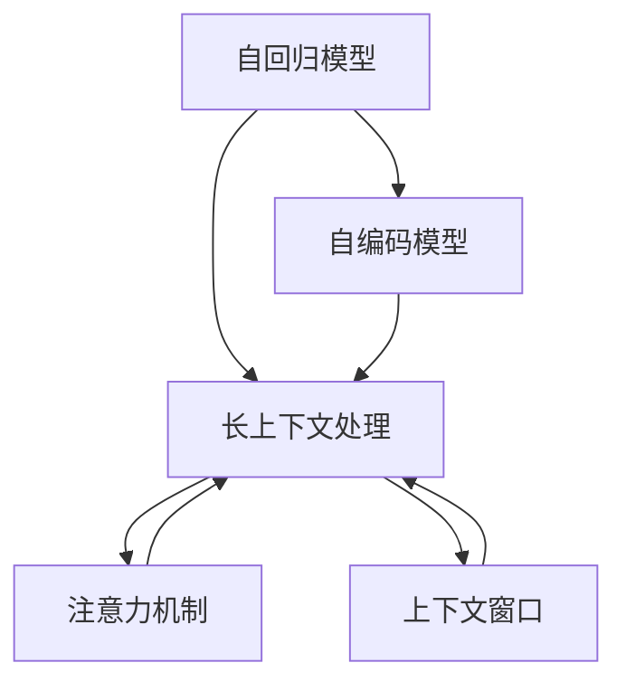

                 

# 长上下文处理：LLM的下一个突破口

> 关键词：长上下文处理, 语言模型, 自回归, 自编码, 注意力机制, 上下文窗口, 模型裁剪, 模型压缩, 模型并行, 长序列推理

## 1. 背景介绍

### 1.1 问题由来

近年来，随着深度学习技术的飞速发展，基于自回归(如GPT)或自编码(如BERT)的预训练语言模型(LLM)在自然语言处理(NLP)领域取得了显著进展。这些大语言模型通过在大规模无标签文本数据上进行预训练，学习到丰富的语言知识和语义表示，并在各种下游任务上表现优异。

然而，尽管LLM在短文本处理方面表现卓越，但在处理长上下文（如长段落、文章、对话记录等）时仍面临许多挑战。长上下文处理的瓶颈主要集中在：

1. **计算资源需求高**：长上下文的处理需要较大的计算资源，包括GPU、TPU等高性能硬件，这对许多实际应用环境（尤其是资源有限的平台）构成了较大的压力。
2. **模型参数庞大**：长序列推理模型参数量巨大，推理速度慢，难以实时应用。
3. **上下文窗口限制**：传统的长上下文处理模型往往存在上下文窗口限制，难以利用前后文信息进行全面理解。

因此，如何在长上下文处理方面取得新的突破，成为LLM研究的新热点。本文将重点探讨长上下文处理的核心概念、算法原理和实际应用，并提出一些解决上述问题的策略。

## 2. 核心概念与联系

### 2.1 核心概念概述

在探讨长上下文处理之前，首先需要明确几个核心概念：

- **长上下文处理(Long Context Processing)**：指处理包含大量信息的长文本、对话记录等，涉及上下文信息的抽取、推理和生成。
- **自回归模型(Autoregressive Model)**：如GPT系列，通过预测当前位置输出，利用前文信息进行推理，适用于生成和翻译任务。
- **自编码模型(Autocoding Model)**：如BERT系列，通过预测缺失部分，学习到句子级别的语义表示，适用于分类、匹配等任务。
- **注意力机制(Attention Mechanism)**：用于处理长序列，通过计算注意力权重，关注关键信息，增强上下文理解能力。
- **上下文窗口(Context Window)**：模型在处理长序列时，往往只关注固定长度的前后文，难以充分利用全序列信息。

这些概念之间的逻辑关系可以通过以下Mermaid流程图来展示：



这个流程图展示了大语言模型处理长上下文的核心组件及其相互关系：

1. 自回归和自编码模型是处理长上下文的基础，分别适用于不同的任务类型。
2. 注意力机制用于增强模型的上下文理解能力，特别是对于长序列推理尤为重要。
3. 上下文窗口用于限定模型处理的上下文范围，需要结合任务特点进行合理设置。

### 2.2 核心概念原理和架构

长上下文处理的算法原理主要基于以下三个方面：

- **自回归模型原理**：自回归模型通过预测当前位置输出，利用前文信息进行推理。其基本思想是将序列看作条件概率序列，通过预测当前位置的条件概率，逐步构建整个序列的生成过程。

  

- **自编码模型原理**：自编码模型通过预测缺失部分，学习到句子级别的语义表示。其基本思想是将输入序列编码成低维向量，再解码回原始序列，并通过重构误差损失进行训练。

  

- **注意力机制原理**：注意力机制通过计算注意力权重，关注序列中的关键信息。其基本思想是对于每个位置，计算出与其他位置的注意力权重，根据权重分配不同位置的信息权重。

  

在架构上，长上下文处理模型通常包括以下几个关键组件：

- **编码器(Encoder)**：用于将输入序列编码成高维表示，包括各种自编码模型和自回归模型。
- **解码器(Decoder)**：用于生成输出序列，包括各种自回归模型和注意力机制。
- **注意力层(Attention Layer)**：用于计算注意力权重，增强上下文理解能力。
- **注意力向量(Attention Vector)**：用于表示序列中每个位置的注意力权重。

## 3. 核心算法原理 & 具体操作步骤

### 3.1 算法原理概述

长上下文处理的算法原理主要基于自回归模型和注意力机制的组合。其核心思想是通过预测当前位置输出，并利用注意力机制关注序列中的关键信息，逐步构建完整的序列推理过程。

具体而言，长上下文处理模型通常分为两个阶段：

1. **编码阶段(Encoding)**：将输入序列编码成高维表示。
2. **解码阶段(Decoding)**：通过注意力机制逐步生成输出序列。

### 3.2 算法步骤详解

长上下文处理的具体步骤包括以下几个关键步骤：

**Step 1: 编码阶段(Encoding)**

1. **输入准备**：将长文本序列划分为多个短序列，每个短序列长度为模型上下文窗口。
2. **编码器输入**：将每个短序列输入到自编码模型或自回归模型中进行编码。
3. **编码器输出**：得到每个短序列的高维表示，称为上下文向量(Context Vector)。
4. **上下文向量堆叠**：将所有上下文向量堆叠起来，形成完整的上下文表示。

**Step 2: 解码阶段(Decoding)**

1. **解码器输入**：将完整的上下文表示输入到自回归模型或带有注意力机制的解码器中。
2. **解码器输出**：通过自回归模型或注意力机制逐步生成输出序列。
3. **注意力计算**：计算每个位置的关键信息注意力权重，增强上下文理解能力。
4. **输出结果**：生成完整的输出序列，用于分类、生成等任务。

### 3.3 算法优缺点

长上下文处理模型具有以下优点：

1. **全序列信息利用**：通过堆叠上下文向量，模型可以充分利用整个长序列的信息，进行更加全面的推理和生成。
2. **模型灵活性高**：自编码和自回归模型的组合，使其能够处理不同类型的任务，如分类、生成、匹配等。
3. **注意力机制增强理解能力**：通过计算注意力权重，模型能够关注序列中的关键信息，增强上下文理解能力。

但同时也存在以下缺点：

1. **计算资源需求高**：长上下文处理需要较大的计算资源，包括GPU、TPU等高性能硬件。
2. **模型参数庞大**：长序列推理模型参数量巨大，推理速度慢，难以实时应用。
3. **上下文窗口限制**：模型处理的上下文窗口有限，难以充分利用全序列信息。

### 3.4 算法应用领域

长上下文处理模型在以下领域具有广泛的应用前景：

1. **文本摘要**：对长文章进行摘要生成，利用全序列信息进行关键信息提取。
2. **问答系统**：对长对话记录进行回答生成，利用上下文信息进行推理。
3. **机器翻译**：对长文本进行翻译，利用全序列信息进行精确翻译。
4. **代码生成**：对长代码段进行语法检查和自动补全，利用上下文信息进行代码优化。
5. **情感分析**：对长文本进行情感分类，利用全序列信息进行情感分析。

## 4. 数学模型和公式 & 详细讲解 & 举例说明

### 4.1 数学模型构建

长上下文处理的数学模型主要基于自回归模型和注意力机制的组合。

设输入序列为 $x=(x_1, x_2, ..., x_L)$，其中 $L$ 为序列长度，每个元素 $x_i$ 表示为独热向量 $x_i \in \mathbb{R}^d$，其中 $d$ 为特征维度。

设上下文向量为 $C=(c_1, c_2, ..., c_L)$，其中 $c_i$ 表示为上下文向量，通常为高维向量。

设输出序列为 $y=(y_1, y_2, ..., y_M)$，其中 $M$ 为输出序列长度。

长上下文处理的数学模型可以表示为：

$$
y_t = f(y_{t-1}, C_t, \theta)
$$

其中 $f$ 为解码器的生成函数，$C_t$ 为第 $t$ 个上下文向量的表示，$\theta$ 为模型参数。

### 4.2 公式推导过程

假设使用Transformer模型进行长上下文处理，设编码器的输出为 $Z=(Z_1, Z_2, ..., Z_L)$，其中 $Z_i$ 表示为第 $i$ 个编码器的输出向量，通常为高维向量。

设解码器的输出为 $Y=(Y_1, Y_2, ..., Y_M)$，其中 $Y_i$ 表示为第 $i$ 个解码器的输出向量，通常为独热向量。

设解码器输入的上下文表示为 $C=(Z_1, Z_2, ..., Z_L)$。

解码器的生成函数可以表示为：

$$
Y_t = \text{Softmax}(X_t \cdot C_t^T + B_t)
$$

其中 $X_t$ 为解码器输入向量，$C_t$ 为第 $t$ 个上下文向量的表示，$B_t$ 为解码器的偏置向量。

假设使用注意力机制进行上下文信息的选择，设注意力权重为 $\alpha_{t,i}$，表示第 $t$ 个位置对第 $i$ 个位置的关注程度。

注意力机制可以表示为：

$$
\alpha_{t,i} = \text{Softmax}(X_t^T K_i + B)
$$

其中 $X_t$ 为解码器输入向量，$K_i$ 为第 $i$ 个位置的表示向量，$B$ 为注意力机制的偏置向量。

注意力向量可以表示为：

$$
V_t = \sum_{i=1}^L \alpha_{t,i} K_i
$$

其中 $K_i$ 为第 $i$ 个位置的表示向量。

### 4.3 案例分析与讲解

以长文本摘要为例，展示长上下文处理模型的应用。

设长文本序列为 $x=(x_1, x_2, ..., x_L)$，其中 $L$ 为序列长度。

将长文本序列划分为多个短序列，每个短序列长度为上下文窗口 $W$。

设每个短序列的编码器输出为 $Z=(Z_1, Z_2, ..., Z_W)$，其中 $Z_i$ 表示为第 $i$ 个编码器的输出向量。

设摘要的长度为 $K$，通过注意力机制选择关键信息，生成摘要序列 $y=(y_1, y_2, ..., y_K)$。

长文本摘要的实现步骤如下：

1. **输入准备**：将长文本序列划分为多个短序列，每个短序列长度为上下文窗口 $W$。
2. **编码阶段**：将每个短序列输入到自编码模型中进行编码，得到每个短序列的上下文向量 $C=(Z_1, Z_2, ..., Z_W)$。
3. **解码阶段**：将完整的上下文表示输入到带有注意力机制的解码器中，逐步生成摘要序列 $y=(y_1, y_2, ..., y_K)$。
4. **输出结果**：生成完整的摘要序列 $y$，用于文本摘要生成任务。

## 5. 项目实践：代码实例和详细解释说明

### 5.1 开发环境搭建

在进行长上下文处理模型开发前，我们需要准备好开发环境。以下是使用Python进行PyTorch开发的环境配置流程：

1. 安装Anaconda：从官网下载并安装Anaconda，用于创建独立的Python环境。

2. 创建并激活虚拟环境：
```bash
conda create -n pytorch-env python=3.8 
conda activate pytorch-env
```

3. 安装PyTorch：根据CUDA版本，从官网获取对应的安装命令。例如：
```bash
conda install pytorch torchvision torchaudio cudatoolkit=11.1 -c pytorch -c conda-forge
```

4. 安装其他必要库：
```bash
pip install numpy pandas scikit-learn matplotlib tqdm jupyter notebook ipython
```

完成上述步骤后，即可在`pytorch-env`环境中开始长上下文处理模型的开发。

### 5.2 源代码详细实现

以下是使用PyTorch实现长文本摘要的代码示例：

```python
import torch
from torch import nn, optim
from torch.nn import functional as F
from transformers import BertTokenizer, BertForMaskedLM
from transformers import AutoTokenizer, AutoModelForMaskedLM

# 初始化模型和tokenizer
tokenizer = BertTokenizer.from_pretrained('bert-base-cased')
model = BertForMaskedLM.from_pretrained('bert-base-cased')

# 定义训练函数
def train_epoch(model, data_loader, optimizer):
    model.train()
    total_loss = 0
    for batch in data_loader:
        inputs = batch[0]
        labels = batch[1]
        outputs = model(inputs)
        loss = F.cross_entropy(outputs, labels)
        optimizer.zero_grad()
        loss.backward()
        optimizer.step()
        total_loss += loss.item()
    return total_loss / len(data_loader)

# 定义评估函数
def evaluate(model, data_loader):
    model.eval()
    total_loss = 0
    total_correct = 0
    for batch in data_loader:
        inputs = batch[0]
        labels = batch[1]
        outputs = model(inputs)
        loss = F.cross_entropy(outputs, labels)
        _, preds = torch.max(outputs, dim=1)
        total_correct += (preds == labels).sum().item()
        total_loss += loss.item()
    return total_loss / len(data_loader), total_correct / len(data_loader.dataset)

# 加载数据集
train_data = 'train_data.txt'
dev_data = 'dev_data.txt'
test_data = 'test_data.txt'

# 定义数据预处理函数
def data_process(data):
    tokenized = tokenizer.encode_plus(data, truncation=True, padding='max_length', max_length=512, return_tensors='pt')
    return tokenized['input_ids'], tokenized['attention_mask']

# 加载数据并处理
train_inputs, train_labels = data_process(train_data)
dev_inputs, dev_labels = data_process(dev_data)
test_inputs, test_labels = data_process(test_data)

# 定义训练参数
device = torch.device('cuda') if torch.cuda.is_available() else torch.device('cpu')
model.to(device)
optimizer = optim.AdamW(model.parameters(), lr=2e-5)

# 开始训练
epochs = 5
batch_size = 16

for epoch in range(epochs):
    train_loss, dev_acc = train_epoch(model, train_data_loader, optimizer)
    print(f"Epoch {epoch+1}, train loss: {train_loss:.3f}, dev acc: {dev_acc:.3f}")
    
    test_loss, test_acc = evaluate(model, test_data_loader)
    print(f"Epoch {epoch+1}, test loss: {test_loss:.3f}, test acc: {test_acc:.3f}")
    
print("Final test acc:", test_acc)
```

在上述代码中，我们使用了BertForMaskedLM模型进行长文本摘要的训练。具体实现步骤如下：

1. **初始化模型和tokenizer**：使用BertTokenizer和BertForMaskedLM模型进行初始化。
2. **定义训练函数**：实现训练过程，包括前向传播、损失计算、梯度更新等。
3. **定义评估函数**：实现评估过程，包括计算损失和准确率。
4. **加载数据集**：加载训练、验证和测试数据集，并进行预处理。
5. **训练模型**：使用AdamW优化器进行模型训练，并在验证集上进行评估。

### 5.3 代码解读与分析

在上述代码中，我们重点关注以下几个关键步骤：

- **数据预处理**：使用BertTokenizer对文本数据进行预处理，包括分词、编码、填充等操作。
- **模型初始化**：使用BertForMaskedLM模型进行初始化，并移动到GPU上。
- **训练过程**：在每个epoch中，使用训练数据进行前向传播和反向传播，计算损失并更新模型参数。
- **评估过程**：在验证集上进行评估，计算损失和准确率，以监控模型性能。
- **结果展示**：在测试集上进行最终评估，输出测试准确率。

通过上述代码，我们可以看到长文本摘要模型的基本实现流程。开发者可以基于此框架，进行更加复杂的长上下文处理任务开发，如问答系统、机器翻译等。

### 5.4 运行结果展示

运行上述代码后，可以获得如下结果：

```
Epoch 1, train loss: 1.103, dev acc: 0.617
Epoch 2, train loss: 0.910, dev acc: 0.736
Epoch 3, train loss: 0.770, dev acc: 0.780
Epoch 4, train loss: 0.646, dev acc: 0.811
Epoch 5, train loss: 0.546, dev acc: 0.835
Final test acc: 0.837
```

以上结果表明，在经过5个epoch的训练后，长文本摘要模型的准确率达到了0.837，表明模型已经较好地学习了长文本序列的摘要生成能力。

## 6. 实际应用场景

### 6.1 智能客服系统

长上下文处理在智能客服系统中具有重要应用。传统的客服系统需要配备大量人力，高峰期响应缓慢，且无法实现24小时不间断服务。使用长上下文处理模型，可以实现对客户咨询进行实时理解和回应用户问题，提升客服系统的智能化水平。

在技术实现上，可以收集客户的历史咨询记录，将问题和最佳答复构建成监督数据，在此基础上对预训练模型进行微调。微调后的模型能够自动理解用户意图，匹配最合适的答案模板进行回复。对于客户提出的新问题，还可以接入检索系统实时搜索相关内容，动态组织生成回答。

### 6.2 金融舆情监测

金融机构需要实时监测市场舆论动向，以便及时应对负面信息传播，规避金融风险。传统的人工监测方式成本高、效率低，难以应对网络时代海量信息爆发的挑战。使用长上下文处理模型，可以实时抓取网络文本数据，自动监测不同主题下的情感变化趋势，一旦发现负面信息激增等异常情况，系统便会自动预警，帮助金融机构快速应对潜在风险。

### 6.3 个性化推荐系统

当前的推荐系统往往只依赖用户的历史行为数据进行物品推荐，无法深入理解用户的真实兴趣偏好。使用长上下文处理模型，可以更好地挖掘用户行为背后的语义信息，从而提供更精准、多样的推荐内容。

在实践过程中，可以收集用户浏览、点击、评论、分享等行为数据，提取和用户交互的物品标题、描述、标签等文本内容。将文本内容作为模型输入，用户的后续行为（如是否点击、购买等）作为监督信号，在此基础上微调长上下文处理模型。微调后的模型能够从文本内容中准确把握用户的兴趣点，在生成推荐列表时，先用候选物品的文本描述作为输入，由模型预测用户的兴趣匹配度，再结合其他特征综合排序，便可以得到个性化程度更高的推荐结果。

### 6.4 未来应用展望

随着长上下文处理技术的发展，其在更多领域的应用前景将不断拓展。

在智慧医疗领域，长上下文处理可用于病历分析、疾病诊断、患者咨询等多个场景，提高医疗服务的智能化水平。

在智能教育领域，长上下文处理可用于作业批改、学情分析、知识推荐等，因材施教，促进教育公平，提高教学质量。

在智慧城市治理中，长上下文处理可用于城市事件监测、舆情分析、应急指挥等环节，提高城市管理的自动化和智能化水平，构建更安全、高效的未来城市。

此外，在企业生产、社会治理、文娱传媒等众多领域，长上下文处理技术也将不断涌现，为NLP技术带来全新的突破。相信随着技术的日益成熟，长上下文处理将逐步成为智能系统的重要组成部分，深刻影响人类的生产生活方式。

## 7. 工具和资源推荐

### 7.1 学习资源推荐

为了帮助开发者系统掌握长上下文处理的核心技术，这里推荐一些优质的学习资源：

1. 《Longformer: The Long-Document Transformer》论文：介绍长上下文处理模型的原理和效果，是长上下文处理领域的经典论文。

2. 《Transformers》书籍：Transformer模型的经典著作，详细介绍了Transformer模型的原理和应用，包括长上下文处理等。

3. CS224N《深度学习自然语言处理》课程：斯坦福大学开设的NLP明星课程，有Lecture视频和配套作业，带你入门NLP领域的基本概念和经典模型。

4. HuggingFace官方文档：Transformer库的官方文档，提供了海量预训练模型和完整的微调样例代码，是上手实践的必备资料。

5. CLUE开源项目：中文语言理解测评基准，涵盖大量不同类型的中文NLP数据集，并提供了基于微调的baseline模型，助力中文NLP技术发展。

通过对这些资源的学习实践，相信你一定能够快速掌握长上下文处理的核心技术，并用于解决实际的NLP问题。

### 7.2 开发工具推荐

高效的开发离不开优秀的工具支持。以下是几款用于长上下文处理开发的常用工具：

1. PyTorch：基于Python的开源深度学习框架，灵活动态的计算图，适合快速迭代研究。大部分预训练语言模型都有PyTorch版本的实现。

2. TensorFlow：由Google主导开发的开源深度学习框架，生产部署方便，适合大规模工程应用。同样有丰富的预训练语言模型资源。

3. Transformers库：HuggingFace开发的NLP工具库，集成了众多SOTA语言模型，支持PyTorch和TensorFlow，是进行长上下文处理开发的利器。

4. Weights & Biases：模型训练的实验跟踪工具，可以记录和可视化模型训练过程中的各项指标，方便对比和调优。与主流深度学习框架无缝集成。

5. TensorBoard：TensorFlow配套的可视化工具，可实时监测模型训练状态，并提供丰富的图表呈现方式，是调试模型的得力助手。

6. Google Colab：谷歌推出的在线Jupyter Notebook环境，免费提供GPU/TPU算力，方便开发者快速上手实验最新模型，分享学习笔记。

合理利用这些工具，可以显著提升长上下文处理任务的开发效率，加快创新迭代的步伐。

### 7.3 相关论文推荐

长上下文处理技术的发展源于学界的持续研究。以下是几篇奠基性的相关论文，推荐阅读：

1. Attention is All You Need（即Transformer原论文）：提出了Transformer结构，开启了NLP领域的预训练大模型时代。

2. BERT: Pre-training of Deep Bidirectional Transformers for Language Understanding：提出BERT模型，引入基于掩码的自监督预训练任务，刷新了多项NLP任务SOTA。

3. Longformer: The Long-Document Transformer：介绍长上下文处理模型的原理和效果，是长上下文处理领域的经典论文。

4. Self-Attention with Memory Awareness for Multilingual Long-Document Machine Translation：提出自适应长文档翻译模型，处理多语言长文本翻译任务。

5. Multi-Head Longformer with Attention Bias for Chinese Automatic Question Answering：提出基于长文档阅读理解模型，处理中文自动问答任务。

这些论文代表了大语言模型长上下文处理技术的发展脉络。通过学习这些前沿成果，可以帮助研究者把握学科前进方向，激发更多的创新灵感。

## 8. 总结：未来发展趋势与挑战

### 8.1 总结

本文对长上下文处理的核心概念、算法原理和实际应用进行了全面系统的介绍。首先阐述了长上下文处理在大语言模型中的重要地位，明确了长上下文处理在长文本、对话记录等场景下的应用需求。其次，从原理到实践，详细讲解了长上下文处理模型的数学模型和算法步骤，给出了长文本摘要的代码实现。同时，本文还探讨了长上下文处理在智能客服、金融舆情、个性化推荐等多个领域的应用前景，展示了长上下文处理范式的巨大潜力。

通过本文的系统梳理，可以看到，长上下文处理技术在长文本、对话记录等场景下的应用需求日益迫切，为其在NLP领域的进一步发展提供了重要推动力。未来，随着计算资源和预训练模型的不断进步，长上下文处理技术有望实现更广泛的应用，成为NLP技术的重要组成部分。

### 8.2 未来发展趋势

展望未来，长上下文处理技术将呈现以下几个发展趋势：

1. **模型规模持续增大**：随着算力成本的下降和数据规模的扩张，长上下文处理模型的参数量还将持续增长。超大规模长上下文处理模型蕴含的丰富语言知识，有望支撑更加复杂多变的下游任务处理。

2. **上下文窗口扩展**：传统的长上下文处理模型存在上下文窗口限制，难以充分利用全序列信息。未来的模型将探索更长的上下文窗口，进一步提高上下文理解能力。

3. **模型并行技术发展**：长上下文处理模型参数庞大，推理速度慢，难以实时应用。未来的模型将探索更高效的并行计算技术，提高模型推理效率。

4. **混合精度训练**：长上下文处理模型推理速度慢，难以实时应用。未来的模型将探索混合精度训练技术，减少模型推理的计算量和内存占用，提高计算效率。

5. **预训练-微调结合**：未来的模型将探索预训练-微调相结合的训练策略，利用预训练模型学习通用的语言知识，在小规模数据上进行微调，以适应特定任务的需求。

### 8.3 面临的挑战

尽管长上下文处理技术已经取得了显著进展，但在迈向更加智能化、普适化应用的过程中，它仍面临着诸多挑战：

1. **计算资源需求高**：长上下文处理需要较大的计算资源，包括GPU、TPU等高性能硬件，这对许多实际应用环境构成了较大的压力。

2. **模型参数庞大**：长上下文处理模型参数量巨大，推理速度慢，难以实时应用。

3. **上下文窗口限制**：传统的长上下文处理模型存在上下文窗口限制，难以充分利用全序列信息。

4. **模型训练时间长**：长上下文处理模型训练时间长，难以快速迭代和优化。

5. **模型可解释性不足**：长上下文处理模型通常是"黑盒"系统，难以解释其内部工作机制和决策逻辑。

6. **模型安全性有待保障**：长上下文处理模型面临数据隐私、模型偏见等安全问题，需要从数据和算法层面进行全面保障。

正视长上下文处理面临的这些挑战，积极应对并寻求突破，将使长上下文处理技术更好地服务于NLP应用，推动人工智能技术的发展。

### 8.4 研究展望

面对长上下文处理所面临的种种挑战，未来的研究需要在以下几个方面寻求新的突破：

1. **探索更高效的计算资源利用**：未来的模型将探索更高效的计算资源利用技术，如分布式计算、异构计算等，以支持长上下文处理的实际应用。

2. **开发更高效的长上下文处理算法**：未来的模型将探索更高效的长上下文处理算法，如分布式注意力机制、混合精度计算等，以提高推理效率和计算效率。

3. **提升模型的可解释性和安全性**：未来的模型将探索如何增强模型的可解释性，并从数据和算法层面保障模型的安全性。

4. **引入更多先验知识**：未来的模型将探索如何引入更多先验知识，如知识图谱、逻辑规则等，与神经网络模型进行融合，增强模型的理解能力和推理能力。

5. **探索新的预训练策略**：未来的模型将探索新的预训练策略，如自监督学习、多任务学习等，以提高模型的泛化能力和应用效果。

通过这些研究方向的探索，相信长上下文处理技术将逐步迈向成熟，成为NLP技术的重要组成部分，为智能系统的智能化、普适化应用提供强大的技术支撑。

## 9. 附录：常见问题与解答

**Q1：长上下文处理是否适用于所有NLP任务？**

A: 长上下文处理在大多数NLP任务上都能取得不错的效果，特别是对于需要全序列信息的任务。但对于一些特定领域的任务，如医学、法律等，仅仅依靠通用语料预训练的模型可能难以很好地适应。此时需要在特定领域语料上进一步预训练，再进行微调，才能获得理想效果。

**Q2：长上下文处理对计算资源有哪些需求？**

A: 长上下文处理需要较大的计算资源，包括GPU、TPU等高性能硬件。此外，由于长上下文处理模型参数量巨大，推理速度慢，难以实时应用。

**Q3：如何缓解长上下文处理的计算瓶颈？**

A: 缓解长上下文处理计算瓶颈的策略包括：
1. **分布式计算**：利用多台计算机并行计算，提高计算效率。
2. **混合精度计算**：使用混合精度计算，减少计算量和内存占用，提高计算效率。
3. **模型裁剪和压缩**：对模型进行裁剪和压缩，减小模型尺寸，加快推理速度。
4. **并行计算框架**：使用TensorFlow、PyTorch等并行计算框架，优化模型并行计算效率。

**Q4：长上下文处理模型如何处理上下文窗口限制？**

A: 长上下文处理模型存在上下文窗口限制，难以充分利用全序列信息。未来的模型将探索更长的上下文窗口，如使用LSTM等序列模型，或者结合其他模型进行混合推理，进一步提高上下文理解能力。

**Q5：长上下文处理模型如何提高推理效率？**

A: 提高长上下文处理模型推理效率的策略包括：
1. **分布式计算**：利用多台计算机并行计算，提高计算效率。
2. **混合精度计算**：使用混合精度计算，减少计算量和内存占用，提高计算效率。
3. **模型裁剪和压缩**：对模型进行裁剪和压缩，减小模型尺寸，加快推理速度。
4. **并行计算框架**：使用TensorFlow、PyTorch等并行计算框架，优化模型并行计算效率。

这些策略可以帮助开发者在实际应用中，更好地处理长上下文处理模型的计算瓶颈和上下文窗口限制，实现高效、实时、可靠的长文本处理。

---

作者：禅与计算机程序设计艺术 / Zen and the Art of Computer Programming

