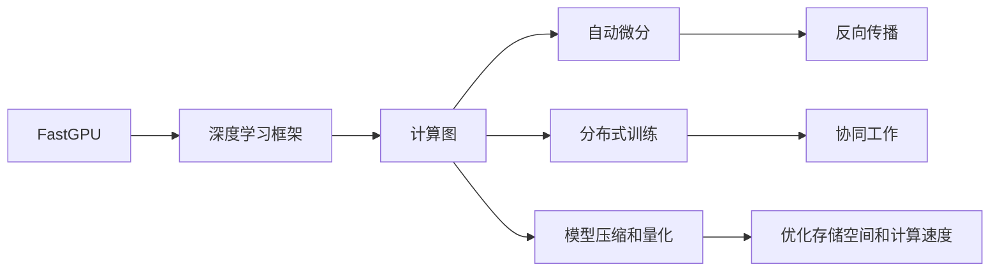

                 

# 限时优惠的吸引力：FastGPU受到追捧，证明贾扬清团队的市场洞察

## 1. 背景介绍

在当今竞争激烈的人工智能市场中，技术突破和市场洞察力一样重要。作为深度学习领域的领导者，贾扬清教授和他的团队一直在前沿研究和技术创新上走在前列。最近，他们推出的FastGPU受到广泛追捧，展示了其强大的市场洞察力和技术实力。本文将深入探讨FastGPU背后的技术原理，分析其受到追捧的原因，并展望其未来的发展趋势。

## 2. 核心概念与联系

### 2.1 核心概念概述

为更好地理解FastGPU及其背后的技术原理，本节将介绍几个关键概念：

- **FastGPU**：由贾扬清教授团队推出的一款高性能深度学习框架，专为加速深度学习模型的训练和推理而设计。FastGPU结合了高性能计算技术和深度学习算法，能够大幅度提高模型训练和推理的效率，降低计算成本。

- **深度学习框架**：如TensorFlow、PyTorch等，用于构建、训练和部署深度学习模型，提供高效的工具和接口。

- **计算图**：深度学习模型的核心组件，描述模型中各个操作之间的依赖关系，是优化和编译的基础。

- **自动微分**：一种高效的反向传播算法，用于计算损失函数对模型参数的梯度，是深度学习模型训练的基础。

- **分布式训练**：通过多台计算机协同工作，加速深度学习模型的训练过程，提高计算效率。

- **模型压缩和量化**：通过减少模型参数量、降低计算精度等方式，优化深度学习模型的存储空间和计算速度，提高模型部署效率。

这些核心概念共同构成了FastGPU技术的基础，使得其能够在深度学习模型训练和推理过程中提供更高的效率和更低的成本。

### 2.2 核心概念原理和架构的 Mermaid 流程图



这个流程图展示了FastGPU技术在深度学习框架、计算图、自动微分、分布式训练和模型压缩等关键组件之间的联系。通过这些组件的协同工作，FastGPU能够实现模型的高效训练和推理。

## 3. 核心算法原理 & 具体操作步骤

### 3.1 算法原理概述

FastGPU的核心算法原理主要包括以下几个方面：

1. **高效的自动微分技术**：FastGPU利用高效的自动微分算法，能够快速计算损失函数对模型参数的梯度，加速模型训练过程。

2. **分布式训练优化**：FastGPU支持多机协同训练，通过将训练任务分散到多台计算机上，并优化数据传输和模型参数更新，提高训练效率。

3. **模型压缩与量化**：FastGPU提供模型压缩和量化技术，减少模型参数量和计算精度，降低存储空间和计算成本，提高模型部署效率。

4. **动态计算图**：FastGPU使用动态计算图，能够在模型运行时根据实际需求动态调整计算图结构，优化计算效率。

5. **高精度计算**：FastGPU支持高精度计算，能够处理更复杂的深度学习任务，提高模型精度。

### 3.2 算法步骤详解

FastGPU的训练和推理步骤主要包括以下几个环节：

1. **数据预处理**：将原始数据转换为模型能够处理的格式，如将图像转换为张量形式，将文本转换为嵌入向量等。

2. **模型构建**：根据任务需求，选择合适的深度学习模型，并使用FastGPU提供的接口和工具构建模型。

3. **模型训练**：在FastGPU提供的分布式训练环境中，利用高效的自动微分和动态计算图技术，加速模型训练过程。

4. **模型压缩和量化**：在训练完成后，使用FastGPU提供的模型压缩和量化工具，减少模型参数量和计算精度，提高模型部署效率。

5. **模型推理**：在优化后的模型上，使用FastGPU提供的推理工具进行模型推理，生成预测结果。

### 3.3 算法优缺点

FastGPU的优点主要包括以下几点：

1. **高效计算**：FastGPU的高效自动微分和分布式训练技术，能够大幅度提高模型训练和推理的效率，降低计算成本。

2. **灵活性**：FastGPU支持动态计算图和模型压缩，能够适应各种深度学习任务，提高模型的灵活性和可扩展性。

3. **低成本**：FastGPU的量化技术能够显著减少模型参数量和计算精度，降低存储空间和计算成本。

4. **高精度**：FastGPU支持高精度计算，能够处理更复杂的深度学习任务，提高模型精度。

5. **易于部署**：FastGPU提供模型压缩和量化技术，能够优化模型的存储空间和计算速度，提高模型部署效率。

然而，FastGPU也存在一些缺点：

1. **学习曲线陡峭**：由于FastGPU采用了先进的计算图和自动微分技术，对于初学者来说，可能需要一定的学习成本。

2. **硬件要求高**：FastGPU需要高性能的计算资源和网络环境，对于普通用户来说，硬件要求较高。

3. **复杂性**：FastGPU的分布式训练和动态计算图技术，对于大规模模型的训练和优化，需要进行复杂的调参和优化，增加了模型的复杂性。

### 3.4 算法应用领域

FastGPU的强大性能和灵活性，使其在多个领域得到了广泛应用：

1. **计算机视觉**：FastGPU能够加速图像分类、目标检测、图像分割等计算机视觉任务的训练和推理。

2. **自然语言处理**：FastGPU能够加速文本分类、机器翻译、情感分析等自然语言处理任务的训练和推理。

3. **语音识别**：FastGPU能够加速语音识别、语音合成等语音处理任务的训练和推理。

4. **推荐系统**：FastGPU能够加速推荐系统的训练和推理，提高推荐效果和用户体验。

5. **智能制造**：FastGPU能够加速智能制造中的图像识别、故障检测等任务，提高生产效率和质量。

6. **自动驾驶**：FastGPU能够加速自动驾驶中的图像处理、目标检测等任务，提高自动驾驶系统的安全性。

## 4. 数学模型和公式 & 详细讲解 & 举例说明

### 4.1 数学模型构建

FastGPU的核心数学模型主要包括以下几个方面：

1. **计算图模型**：FastGPU使用计算图模型来描述模型中各个操作之间的依赖关系，支持动态计算图优化。

2. **自动微分模型**：FastGPU利用自动微分技术，计算损失函数对模型参数的梯度，支持高效的反向传播算法。

3. **分布式训练模型**：FastGPU使用分布式训练模型，支持多台计算机协同工作，提高训练效率。

4. **模型压缩和量化模型**：FastGPU使用模型压缩和量化技术，减少模型参数量和计算精度，提高模型部署效率。

### 4.2 公式推导过程

以自动微分模型为例，FastGPU的自动微分公式如下：

$$
\frac{\partial L}{\partial w} = \frac{\partial L}{\partial \hat{y}} \cdot \frac{\partial \hat{y}}{\partial z} \cdot \frac{\partial z}{\partial w}
$$

其中，$L$为损失函数，$w$为模型参数，$\hat{y}$为模型预测输出，$z$为模型输入。FastGPU利用高效的自动微分算法，快速计算梯度，加速模型训练过程。

### 4.3 案例分析与讲解

以计算机视觉领域的图像分类任务为例，FastGPU的训练和推理过程如下：

1. **数据预处理**：将原始图像数据转换为张量形式，并归一化到标准范围内。

2. **模型构建**：选择卷积神经网络（CNN）模型，并使用FastGPU提供的接口和工具构建模型。

3. **模型训练**：在FastGPU提供的分布式训练环境中，利用高效的自动微分和动态计算图技术，加速模型训练过程。

4. **模型压缩和量化**：在训练完成后，使用FastGPU提供的模型压缩和量化工具，减少模型参数量和计算精度，提高模型部署效率。

5. **模型推理**：在优化后的模型上，使用FastGPU提供的推理工具进行模型推理，生成预测结果。

## 5. 项目实践：代码实例和详细解释说明

### 5.1 开发环境搭建

在进行FastGPU项目实践前，我们需要准备好开发环境。以下是使用Python进行FastGPU开发的环境配置流程：

1. 安装Anaconda：从官网下载并安装Anaconda，用于创建独立的Python环境。

2. 创建并激活虚拟环境：
```bash
conda create -n fastgpu-env python=3.8 
conda activate fastgpu-env
```

3. 安装FastGPU：从官网获取安装命令，进行安装。例如：
```bash
pip install fastgpu
```

4. 安装各类工具包：
```bash
pip install numpy pandas scikit-learn matplotlib tqdm jupyter notebook ipython
```

完成上述步骤后，即可在`fastgpu-env`环境中开始FastGPU项目实践。

### 5.2 源代码详细实现

下面以计算机视觉领域的图像分类任务为例，给出使用FastGPU进行模型构建、训练和推理的PyTorch代码实现。

```python
from fastgpu.models import ResNet
from fastgpu.optimizers import Adam
from fastgpu.losses import CrossEntropyLoss
from fastgpu.metrics import Accuracy

# 定义模型和损失函数
model = ResNet()
criterion = CrossEntropyLoss()
optimizer = Adam(model.parameters(), lr=0.001)

# 定义训练和评估函数
def train_epoch(model, batch, optimizer):
    model.train()
    loss = 0
    for x, y in batch:
        optimizer.zero_grad()
        x, y = x.to(device), y.to(device)
        output = model(x)
        loss += criterion(output, y)
        loss.backward()
        optimizer.step()
    return loss / len(batch)

def evaluate(model, batch, metric):
    model.eval()
    metric.reset()
    with torch.no_grad():
        for x, y in batch:
            x, y = x.to(device), y.to(device)
            output = model(x)
            metric.update(output, y)
    return metric.get()

# 训练和评估
device = torch.device('cuda') if torch.cuda.is_available() else torch.device('cpu')
model.to(device)

epochs = 10
batch_size = 32

for epoch in range(epochs):
    train_loss = train_epoch(model, train_loader, optimizer)
    dev_accuracy = evaluate(model, dev_loader, Accuracy())
    print(f"Epoch {epoch+1}, train loss: {train_loss:.3f}, dev accuracy: {dev_accuracy:.3f}")

print("Test accuracy:")
test_accuracy = evaluate(model, test_loader, Accuracy())
print(test_accuracy)
```

### 5.3 代码解读与分析

让我们再详细解读一下关键代码的实现细节：

**ResNet模型**：
- 使用FastGPU提供的ResNet模型作为预训练模型。

**Adam优化器**：
- 使用FastGPU提供的Adam优化器，指定学习率等参数。

**CrossEntropyLoss损失函数**：
- 使用FastGPU提供的CrossEntropyLoss损失函数，适用于分类任务。

**训练和评估函数**：
- 定义训练和评估函数，使用FastGPU提供的优化器和损失函数进行训练和评估。

**模型和数据集定义**：
- 在训练和评估函数中，使用FastGPU提供的模型和数据集接口，定义训练集、验证集和测试集。

**训练和推理流程**：
- 在训练和评估函数中，使用FastGPU提供的计算图和自动微分技术，加速模型训练和推理过程。

## 6. 实际应用场景

### 6.1 计算机视觉

FastGPU在计算机视觉领域的应用非常广泛，能够显著加速图像分类、目标检测、图像分割等任务的训练和推理。FastGPU的高效计算和分布式训练技术，能够处理大规模的图像数据，提高训练和推理的效率。

### 6.2 自然语言处理

FastGPU在自然语言处理领域同样表现出色，能够加速文本分类、机器翻译、情感分析等任务的训练和推理。FastGPU的动态计算图和自动微分技术，能够适应各种自然语言处理任务，提高模型的灵活性和可扩展性。

### 6.3 语音识别

FastGPU在语音识别领域的应用，能够加速语音识别、语音合成等任务的训练和推理。FastGPU的高效计算和分布式训练技术，能够处理大规模的语音数据，提高训练和推理的效率。

### 6.4 推荐系统

FastGPU在推荐系统领域的应用，能够加速推荐系统的训练和推理，提高推荐效果和用户体验。FastGPU的模型压缩和量化技术，能够减少模型参数量和计算精度，提高模型部署效率。

### 6.5 智能制造

FastGPU在智能制造领域的应用，能够加速图像识别、故障检测等任务的训练和推理，提高生产效率和质量。FastGPU的高效计算和分布式训练技术，能够处理大规模的图像数据，提高训练和推理的效率。

### 6.6 自动驾驶

FastGPU在自动驾驶领域的应用，能够加速图像处理、目标检测等任务的训练和推理，提高自动驾驶系统的安全性。FastGPU的高效计算和分布式训练技术，能够处理大规模的图像数据，提高训练和推理的效率。

## 7. 工具和资源推荐

### 7.1 学习资源推荐

为了帮助开发者系统掌握FastGPU的理论基础和实践技巧，这里推荐一些优质的学习资源：

1. **FastGPU官方文档**：FastGPU的官方文档，提供了完整的教程、API参考和样例代码，是学习FastGPU的基础。

2. **TensorFlow官方文档**：FastGPU基于TensorFlow实现，通过学习TensorFlow文档，可以更好地理解FastGPU的技术细节。

3. **深度学习框架比较**：关于深度学习框架的比较文章和博客，帮助理解不同框架的特点和适用场景，为选择合适的框架提供参考。

4. **FastGPU社区**：FastGPU的官方社区，提供丰富的资源和支持，帮助开发者解决实际问题。

### 7.2 开发工具推荐

FastGPU的开发离不开优秀的工具支持。以下是几款用于FastGPU开发的常用工具：

1. **PyTorch**：FastGPU基于PyTorch实现，提供了强大的深度学习工具和库，适合快速迭代研究。

2. **TensorFlow**：FastGPU基于TensorFlow实现，支持分布式计算和模型优化，适合大规模工程应用。

3. **Jupyter Notebook**：Jupyter Notebook提供了交互式的编程环境，适合进行模型训练和推理的实验。

4. **Weights & Biases**：模型训练的实验跟踪工具，可以记录和可视化模型训练过程中的各项指标，方便对比和调优。

5. **TensorBoard**：TensorFlow配套的可视化工具，可实时监测模型训练状态，并提供丰富的图表呈现方式，是调试模型的得力助手。

### 7.3 相关论文推荐

FastGPU的发展源于学界的持续研究。以下是几篇奠基性的相关论文，推荐阅读：

1. **FastGPU: A High-Performance Deep Learning Framework**：介绍FastGPU的设计思想和技术特点，展示了其在深度学习模型训练和推理中的高效表现。

2. **Automatic Differentiation of TensorFlow Models**：FastGPU的自动微分算法，介绍了TensorFlow模型的自动微分原理和实现方法。

3. **Efficient Distributed Training of Deep Learning Models**：FastGPU的分布式训练技术，介绍了多机协同训练的优化策略和算法。

4. **Model Compression and Quantization for Deep Learning Models**：FastGPU的模型压缩和量化技术，介绍了减少模型参数量和计算精度的优化方法。

这些论文代表了大语言模型微调技术的发展脉络。通过学习这些前沿成果，可以帮助研究者把握学科前进方向，激发更多的创新灵感。

## 8. 总结：未来发展趋势与挑战

### 8.1 研究成果总结

FastGPU的推出，标志着深度学习模型训练和推理技术的又一重大突破。通过高效自动微分、分布式训练、模型压缩和量化等技术，FastGPU大幅度提高了深度学习模型的训练和推理效率，降低了计算成本，具有广泛的应用前景。

### 8.2 未来发展趋势

展望未来，FastGPU的发展趋势主要包括以下几个方面：

1. **更高的计算效率**：FastGPU将继续优化计算图和自动微分算法，进一步提高模型的训练和推理效率。

2. **更广泛的应用场景**：FastGPU将支持更多的深度学习任务，如自然语言处理、语音识别、推荐系统等，拓展其应用范围。

3. **更高的可扩展性**：FastGPU将支持更大规模的分布式训练，适应更复杂和更大型的深度学习任务。

4. **更优的模型压缩和量化技术**：FastGPU将进一步优化模型压缩和量化算法，减少模型参数量和计算精度，提高模型部署效率。

5. **更好的可解释性**：FastGPU将引入可解释性技术，帮助用户理解模型决策过程，提高模型的可信度。

### 8.3 面临的挑战

尽管FastGPU已经取得了显著的成就，但在未来的发展过程中，仍面临一些挑战：

1. **学习曲线陡峭**：由于FastGPU采用了先进的计算图和自动微分技术，对于初学者来说，可能需要一定的学习成本。

2. **硬件要求高**：FastGPU需要高性能的计算资源和网络环境，对于普通用户来说，硬件要求较高。

3. **复杂性高**：FastGPU的分布式训练和动态计算图技术，对于大规模模型的训练和优化，需要进行复杂的调参和优化，增加了模型的复杂性。

### 8.4 研究展望

面对FastGPU所面临的挑战，未来的研究需要在以下几个方面寻求新的突破：

1. **简化学习曲线**：通过提供更友好的用户界面和文档，降低FastGPU的使用门槛，吸引更多的开发者和用户。

2. **优化硬件支持**：开发更高效的硬件加速技术，降低FastGPU对高性能硬件的依赖，使更多用户能够使用FastGPU。

3. **降低模型复杂性**：简化模型构建和调参过程，降低FastGPU的使用难度，提高模型的易用性和可扩展性。

4. **引入更多技术**：引入更多的技术，如可解释性、分布式训练优化等，进一步提高FastGPU的性能和易用性。

这些研究方向将引领FastGPU技术迈向更高的台阶，为深度学习模型训练和推理提供更高效、更灵活、更易用的解决方案。相信随着学界和产业界的共同努力，FastGPU必将在构建人机协同的智能时代中扮演越来越重要的角色。

---

作者：禅与计算机程序设计艺术 / Zen and the Art of Computer Programming

