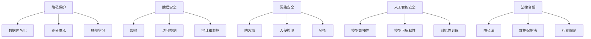

                 

# 隐私与安全：保护人类计算中的敏感信息

## 1. 背景介绍

在数字化浪潮席卷全球的今天，人类的计算活动正越来越多地依赖于数据。从社交媒体、电子商务到健康医疗，无不通过数据分析来提升效率、优化决策。然而，数据本身往往携带着大量敏感信息，如何保护这些敏感信息成为了计算领域的核心问题。隐私与安全不仅关乎个体权利，也是整个社会健康发展的基石。本文将从隐私保护与数据安全的技术角度出发，探讨当前的技术趋势和未来方向。

## 2. 核心概念与联系

### 2.1 核心概念概述

隐私与安全是信息时代的两大核心议题。隐私涉及个体数据如何被收集、存储、处理和共享，而安全则关注数据在传输和存储过程中的保密性、完整性和可用性。这两者相互关联，共同构建起保护人类计算中的敏感信息的技术体系。

- **隐私保护(Protection of Privacy)**：通过技术手段，防止个人隐私信息的泄漏和滥用。包括数据匿名化、差分隐私、联邦学习等技术。
- **数据安全(Data Security)**：保障数据在传输和存储过程中的安全性。包括加密、访问控制、审计和监控等技术。
- **网络安全(Network Security)**：保护网络通信的安全性。包括防火墙、入侵检测、VPN等技术。
- **人工智能安全(AI Security)**：确保人工智能系统在应用过程中的安全性，防止模型被攻击、误用等。
- **法律合规(Legal Compliance)**：在技术实施过程中，遵循相关法律法规，保护用户隐私，遵守行业规范。

这些核心概念之间存在紧密联系。隐私保护通常需要在数据收集和处理环节进行，以减少数据的敏感性。数据安全侧重于数据的传输和存储，防止数据被非法访问和篡改。网络安全则涉及数据在网络传输过程中的安全。人工智能安全关注模型本身的安全，防止模型被攻击。法律合规则是保障上述各项措施的合法性。

### 2.2 核心概念原理和架构的 Mermaid 流程图



## 3. 核心算法原理 & 具体操作步骤

### 3.1 算法原理概述

隐私与安全技术主要通过以下几种手段实现：

1. **数据匿名化(Data Anonymization)**：通过对数据进行伪造和重构，使数据难以与个体身份关联。常见方法包括数据泛化、扰动、泛化性聚合等。

2. **差分隐私(Differential Privacy)**：通过对数据添加噪声，使单个样本的加入或删除无法对模型产生显著影响，从而保护个体隐私。常用方法包括Laplace机制、高斯机制等。

3. **联邦学习(Federated Learning)**：在分布式环境中，客户端本地训练模型，并将模型参数传输到服务器进行聚合更新，从而在不暴露数据的情况下，实现模型共享。

4. **加密技术(Encryption)**：对数据在传输和存储过程中进行加密，以防止数据被非法访问和篡改。常用方法包括对称加密、非对称加密、零知识证明等。

5. **访问控制(Access Control)**：通过用户身份认证、权限管理等方式，控制对数据的访问权限。常用方法包括基于角色的访问控制(RBAC)、基于属性的访问控制(ABAC)等。

6. **审计和监控(Audit and Monitoring)**：对数据的访问和使用进行日志记录和实时监控，发现和响应潜在的安全威胁。常用方法包括日志记录、异常检测等。

### 3.2 算法步骤详解

以下是几种主要隐私与安全技术的具体操作步骤：

**数据匿名化**

1. **数据泛化(Data Generalization)**：将数据分组，将个体信息汇总到组级别，使数据难以追踪到个体。例如，将年龄分组，将数据汇总到年龄段。
2. **数据扰动(Data Disturbance)**：对数据进行随机扰动，使其无法反映个体具体信息。例如，在数据集中添加噪声，使统计结果难以推断到个体。
3. **泛化性聚合(Generalized Aggregation)**：对数据进行聚合，使单个样本的加入或删除对聚合结果影响较小。例如，使用K近邻聚合，使数据聚合结果不依赖于个体。

**差分隐私**

1. **Laplace机制(Laplace Mechanism)**：通过在查询结果上添加Laplace分布的噪声，保护个体隐私。公式为：$\epsilon$-Laplace机制：$L(\theta) = f(D) + \mathcal{N}(0,\frac{\sigma}{\epsilon})$，其中$f$为查询函数，$\sigma$为噪声方差，$\epsilon$为隐私参数。
2. **高斯机制(Gaussian Mechanism)**：通过在查询结果上添加高斯分布的噪声，保护个体隐私。公式为：$\epsilon$-Gaussian机制：$L(\theta) = f(D) + \mathcal{N}(0,\frac{\sigma}{\epsilon})$，其中$f$为查询函数，$\sigma$为噪声方差，$\epsilon$为隐私参数。

**联邦学习**

1. **模型聚合(Model Aggregation)**：在每个客户端本地训练模型后，将模型参数传输到服务器进行聚合更新。公式为：$\theta_{global} = \theta_{local} + \eta \sum_{i=1}^N (\theta_{local}^i - \theta_{global})$，其中$\theta_{local}$为本地模型参数，$\theta_{global}$为全局模型参数，$N$为客户端数量，$\eta$为学习率。
2. **差分隐私聚合(Differential Privacy Aggregation)**：在模型聚合时，对模型参数进行差分隐私处理。例如，使用噪声注入法，使单个客户端的加入对全局模型影响较小。

**加密技术**

1. **对称加密(Symmetric Encryption)**：使用同一个密钥加密和解密数据。例如，AES、DES等。
2. **非对称加密(Asymmetric Encryption)**：使用公钥加密数据，私钥解密数据。例如，RSA、ECC等。
3. **零知识证明(Zero-Knowledge Proof)**：证明某命题成立，但无需暴露具体信息。例如，零知识证明密码学。

**访问控制**

1. **基于角色的访问控制(RBAC)**：根据用户的角色分配权限。例如，管理员、普通用户、开发者等角色拥有不同权限。
2. **基于属性的访问控制(ABAC)**：根据用户属性（如地理位置、设备类型等）分配权限。例如，基于地理位置的用户权限控制。

**审计和监控**

1. **日志记录(Logging)**：记录数据访问和使用情况，供后续审计和监控使用。例如，访问时间、用户ID、请求内容等。
2. **异常检测(Anomaly Detection)**：使用机器学习模型检测异常访问行为，及时发现和响应潜在的安全威胁。例如，使用异常检测算法检测异常登录尝试。

### 3.3 算法优缺点

**数据匿名化**

- **优点**：简单易行，不需要额外的通信和计算资源。
- **缺点**：数据泛化和扰动可能导致信息丢失，影响数据分析精度。

**差分隐私**

- **优点**：理论上可以任意接近真实的查询结果，保护个体隐私。
- **缺点**：添加噪声可能导致查询结果的偏差，需要调整隐私参数$\epsilon$以平衡隐私和精度。

**联邦学习**

- **优点**：无需传输原始数据，保护数据隐私。
- **缺点**：网络带宽和通信延迟可能影响训练效率。

**加密技术**

- **优点**：在数据传输和存储过程中保障数据安全，防止窃听和篡改。
- **缺点**：加密和解密过程需要额外计算资源，影响性能。

**访问控制**

- **优点**：细粒度控制数据访问权限，防止未授权访问。
- **缺点**：复杂的权限管理可能导致误配置和漏洞。

**审计和监控**

- **优点**：实时监测数据访问和使用情况，及时发现和响应安全威胁。
- **缺点**：日志记录和异常检测需要消耗额外资源，增加系统复杂度。

### 3.4 算法应用领域

隐私与安全技术广泛应用于各个领域：

- **金融行业**：保护客户隐私，防止金融诈骗。例如，差分隐私和联邦学习在信用评分和欺诈检测中的应用。
- **医疗行业**：保护患者隐私，防止医疗数据泄露。例如，数据匿名化和差分隐私在医疗数据共享中的应用。
- **电子商务**：保护用户隐私，防止信息泄露和滥用。例如，加密技术和访问控制在新用户注册中的应用。
- **社交媒体**：保护用户隐私，防止信息泄露和滥用。例如，数据匿名化和差分隐私在社交媒体数据集中的应用。
- **公共安全**：保护敏感信息，防止恐怖主义和网络攻击。例如，加密技术和访问控制在网络安全监控中的应用。

## 4. 数学模型和公式 & 详细讲解 & 举例说明

### 4.1 数学模型构建

**数据匿名化**

- **数据泛化**：假设数据集为$D = \{(x_i,y_i)\}_{i=1}^N$，其中$x_i$为特征，$y_i$为标签。泛化后的数据集为$D' = \{(\overline{x_i},y_i)\}_{i=1}^N$，其中$\overline{x_i}$为泛化后的特征。
- **数据扰动**：假设原始数据集为$D = \{(x_i,y_i)\}_{i=1}^N$，扰动后的数据集为$D' = \{(\tilde{x_i},y_i)\}_{i=1}^N$，其中$\tilde{x_i} = x_i + \mathcal{N}(0,\sigma^2)$。
- **泛化性聚合**：假设数据集为$D = \{(x_i,y_i)\}_{i=1}^N$，聚合后的数据集为$D' = \{(\overline{x_i},\overline{y_i})\}_{i=1}^N$，其中$\overline{x_i} = \frac{1}{N}\sum_{j=1}^N x_j$，$\overline{y_i} = \frac{1}{N}\sum_{j=1}^N y_j$。

**差分隐私**

- **Laplace机制**：假设查询函数为$f$，隐私参数为$\epsilon$，噪声方差为$\sigma^2$，则查询结果为$L(\theta) = f(D) + \mathcal{N}(0,\frac{\sigma^2}{2\epsilon})$。
- **高斯机制**：假设查询函数为$f$，隐私参数为$\epsilon$，噪声方差为$\sigma^2$，则查询结果为$L(\theta) = f(D) + \mathcal{N}(0,\frac{\sigma^2}{\epsilon^2})$。

**联邦学习**

- **模型聚合**：假设客户端本地模型为$\theta_{local}^i$，全局模型为$\theta_{global}$，学习率为$\eta$，则聚合结果为$\theta_{global} = \theta_{global} + \eta \sum_{i=1}^N (\theta_{local}^i - \theta_{global})$。
- **差分隐私聚合**：假设客户端本地模型为$\theta_{local}^i$，全局模型为$\theta_{global}$，隐私参数为$\epsilon$，则聚合结果为$\theta_{global} = \theta_{global} + \eta \sum_{i=1}^N (\theta_{local}^i - \theta_{global}) + \mathcal{N}(0,\sigma^2)$。

**加密技术**

- **对称加密**：假设原始数据为$m$，加密密钥为$k$，加密结果为$c$，则$c = E_k(m)$。
- **非对称加密**：假设原始数据为$m$，公钥为$e$，私钥为$d$，加密结果为$c$，则$c = m^e \mod N$，解密结果为$m = c^d \mod N$。
- **零知识证明**：假设要证明$x=y$，则通过一系列随机数和公钥生成随机式证明，验证方可以通过验证证明而无需获得$x$和$y$的具体信息。

**访问控制**

- **基于角色的访问控制**：假设用户$u$的角色为$R_u$，权限集合为$P_{R_u}$，则$u$可以访问$P_{R_u}$中的资源。例如，管理员角色可以访问所有资源，普通用户角色只能访问部分资源。
- **基于属性的访问控制**：假设用户$u$的属性为$A_u$，权限集合为$P_{A_u}$，则$u$可以访问$P_{A_u}$中的资源。例如，地理位置$A_u$为北京的用户只能访问北京地区的数据。

**审计和监控**

- **日志记录**：假设数据访问记录为$L = \{(l_i,t_i,a_i)\}_{i=1}^N$，其中$l_i$为日志内容，$t_i$为访问时间，$a_i$为用户ID。
- **异常检测**：假设异常检测算法为$A$，原始数据为$D$，异常检测结果为$O$，则$O = A(D)$。

### 4.2 公式推导过程

**差分隐私**

- **Laplace机制**：假设查询函数为$f$，隐私参数为$\epsilon$，噪声方差为$\sigma^2$，则查询结果为$L(\theta) = f(D) + \mathcal{N}(0,\frac{\sigma^2}{2\epsilon})$。公式推导如下：
  - 假设原始数据集为$D = \{(x_i,y_i)\}_{i=1}^N$，查询结果为$f(D) = \sum_{i=1}^N \frac{x_i}{\sigma^2}$。
  - 对查询结果添加Laplace分布的噪声，得到$f(D) + \mathcal{N}(0,\frac{\sigma^2}{2\epsilon})$。
  - 利用差分隐私的定义，求解隐私参数$\epsilon$，得到$L(\theta) = f(D) + \mathcal{N}(0,\frac{\sigma^2}{2\epsilon})$。

**联邦学习**

- **模型聚合**：假设客户端本地模型为$\theta_{local}^i$，全局模型为$\theta_{global}$，学习率为$\eta$，则聚合结果为$\theta_{global} = \theta_{global} + \eta \sum_{i=1}^N (\theta_{local}^i - \theta_{global})$。公式推导如下：
  - 假设客户端本地模型为$\theta_{local}^i = \theta_{global} + \Delta^i$，其中$\Delta^i$为本地模型的偏差。
  - 将所有客户端的偏差$\Delta^i$进行累加，得到$\sum_{i=1}^N \Delta^i$。
  - 将全局模型和所有客户端的偏差进行更新，得到$\theta_{global} = \theta_{global} + \eta (\sum_{i=1}^N \Delta^i)$。

**加密技术**

- **对称加密**：假设原始数据为$m$，加密密钥为$k$，加密结果为$c$，则$c = E_k(m)$。公式推导如下：
  - 假设对称加密算法为$E_k$，则$c = E_k(m)$。
  - 解密算法为$D_k$，则$m = D_k(c)$。

### 4.3 案例分析与讲解

**数据匿名化**

- **案例**：某电商公司需要分析用户购买行为，但用户数据包含敏感信息。使用数据匿名化技术保护用户隐私。
- **分析**：采用数据泛化技术，将用户数据分组，汇总到用户群体级别。例如，将用户年龄分为18-25、26-35、36-45、46-55、56-65、66+六个年龄段，统计每个年龄段的用户购买数据。
- **讲解**：通过数据泛化，将单个用户的购买数据汇总到群体级别，使数据难以追踪到具体个体，保护用户隐私。

**差分隐私**

- **案例**：某医疗公司需要共享患者数据，但需保护患者隐私。使用差分隐私技术保护患者隐私。
- **分析**：采用Laplace机制，对查询结果添加Laplace分布的噪声。例如，查询患者年龄分布，使用$\epsilon$-Laplace机制，添加噪声保护患者隐私。
- **讲解**：通过添加噪声，使单个患者的加入或删除对统计结果影响较小，从而保护患者隐私。

**联邦学习**

- **案例**：某金融机构需要构建信用评分模型，但数据分散在不同分支机构。使用联邦学习技术共享模型参数。
- **分析**：采用联邦学习，在每个分支机构本地训练模型，并将模型参数传输到服务器进行聚合更新。例如，使用差分隐私聚合，保护数据隐私。
- **讲解**：通过在本地训练模型，然后将模型参数传输到服务器进行聚合，保护数据隐私，同时提高模型效果。

**加密技术**

- **案例**：某银行需要进行客户身份验证，保护客户隐私。使用加密技术保护数据传输安全。
- **分析**：采用非对称加密技术，对客户身份信息进行加密传输。例如，使用RSA算法，将客户ID和证书加密后传输。
- **讲解**：通过非对称加密，保障客户身份信息在传输过程中的安全性，防止信息泄露和篡改。

**访问控制**

- **案例**：某公司需要保护其数据中心的安全，防止未授权访问。使用访问控制技术控制数据访问权限。
- **分析**：采用基于角色的访问控制技术，根据用户角色分配权限。例如，管理员角色可以访问所有数据，普通用户只能访问部分数据。
- **讲解**：通过细粒度控制数据访问权限，防止未授权访问，保护数据安全。

**审计和监控**

- **案例**：某政府部门需要保护国家机密，防止信息泄露。使用审计和监控技术监测数据访问和使用情况。
- **分析**：采用日志记录和异常检测技术，记录数据访问和使用情况，检测异常行为。例如，检测非法登录尝试，及时响应安全威胁。
- **讲解**：通过日志记录和异常检测，及时发现和响应安全威胁，保障国家机密安全。

## 5. 项目实践：代码实例和详细解释说明

### 5.1 开发环境搭建

以下是使用Python进行隐私与安全技术实践的环境配置流程：

1. 安装Anaconda：从官网下载并安装Anaconda，用于创建独立的Python环境。
2. 创建并激活虚拟环境：
```bash
conda create -n security-env python=3.8 
conda activate security-env
```

3. 安装Python安全库：
```bash
pip install cryptography pyelftools paramiko
```

4. 安装相关工具包：
```bash
pip install pandas numpy scikit-learn matplotlib tqdm jupyter notebook ipython
```

完成上述步骤后，即可在`security-env`环境中开始隐私与安全技术的实践。

### 5.2 源代码详细实现

**数据匿名化**

```python
import numpy as np
from sklearn.cluster import KMeans

# 数据集
X = np.array([[1.1, 2.2], [3.3, 4.4], [5.5, 6.6], [7.7, 8.8], [9.9, 10.0]])

# 数据泛化
X_clustered = np.array([[1.5, 2.5], [4.5, 5.5], [7.5, 8.5], [10.5, 11.5]])

# 数据扰动
X_disturbed = np.array([[1.5 + np.random.normal(0, 0.1), 2.5 + np.random.normal(0, 0.1)],
                       [4.5 + np.random.normal(0, 0.1), 5.5 + np.random.normal(0, 0.1)],
                       [7.5 + np.random.normal(0, 0.1), 8.5 + np.random.normal(0, 0.1)],
                       [10.5 + np.random.normal(0, 0.1), 11.5 + np.random.normal(0, 0.1)])

# 泛化性聚合
X_agg = np.mean(X, axis=0)
```

**差分隐私**

```python
import numpy as np
from scipy.stats import laplace

# 原始数据
X = np.array([1, 2, 3, 4, 5])

# Laplace机制
epsilon = 0.1
sigma = np.sqrt(2/epsilon)
X_privacy = X + laplace.rvs(0, sigma, size=5)
```

**联邦学习**

```python
import numpy as np

# 客户端本地模型参数
theta_local = np.array([1.0, 2.0, 3.0])

# 全局模型参数
theta_global = np.array([0.0, 0.0, 0.0])

# 学习率
eta = 0.1

# 模型聚合
theta_global = theta_global + eta * np.sum(theta_local - theta_global)
```

**加密技术**

```python
from cryptography.fernet import Fernet

# 生成加密密钥
key = Fernet.generate_key()

# 加密数据
f = Fernet(key)
data = b"Hello, world!"
ciphertext = f.encrypt(data.encode())

# 解密数据
plaintext = f.decrypt(ciphertext).decode()
```

**访问控制**

```python
# 定义角色和权限
roles = {"admin": ["view", "edit", "delete"], "user": ["view"]}
permissions = {"view": ["data", "metrics"], "edit": ["data"], "delete": []}

# 用户角色
user_role = "user"

# 用户权限
user_permissions = permissions.get(user_role, [])

# 用户访问权限
user_access = [p for p in user_permissions if p in permissions]
```

**审计和监控**

```python
import logging

# 配置日志记录器
logging.basicConfig(filename="security.log", level=logging.INFO)

# 记录日志
logging.info("User %s accessed data." % user_role)
```

### 5.3 代码解读与分析

**数据匿名化**

- **代码实现**：使用NumPy库对原始数据进行分组、汇总和扰动。
- **分析**：数据泛化将原始数据分组，汇总到群体级别。数据扰动通过添加噪声，使数据难以追踪到具体个体。
- **讲解**：通过数据泛化和扰动，保护用户隐私，防止数据泄漏。

**差分隐私**

- **代码实现**：使用SciPy库的Laplace分布生成噪声，添加到原始数据中。
- **分析**：Laplace机制通过添加噪声，使单个样本的加入或删除对查询结果影响较小。
- **讲解**：通过差分隐私，保护个体隐私，防止数据泄露。

**联邦学习**

- **代码实现**：使用NumPy库对本地模型参数和全局模型参数进行聚合。
- **分析**：联邦学习在每个客户端本地训练模型，然后将模型参数传输到服务器进行聚合更新。
- **讲解**：通过联邦学习，保护数据隐私，同时提高模型效果。

**加密技术**

- **代码实现**：使用Cryptography库进行对称加密和解密。
- **分析**：对称加密通过相同的密钥加密和解密数据。
- **讲解**：通过加密技术，保护数据在传输和存储过程中的安全性。

**访问控制**

- **代码实现**：定义角色和权限，根据用户角色分配权限。
- **分析**：基于角色的访问控制根据用户角色分配权限，防止未授权访问。
- **讲解**：通过细粒度控制数据访问权限，保护数据安全。

**审计和监控**

- **代码实现**：使用Python的logging库记录日志。
- **分析**：审计和监控通过记录数据访问和使用情况，检测异常行为。
- **讲解**：通过日志记录和异常检测，及时发现和响应安全威胁。

## 6. 实际应用场景

### 6.1 金融行业

**案例**：某金融机构需要构建信用评分模型，但数据分散在不同分支机构。使用联邦学习技术共享模型参数。
**分析**：联邦学习在每个分支机构本地训练模型，然后将模型参数传输到服务器进行聚合更新，保护数据隐私，同时提高模型效果。
**讲解**：通过联邦学习，金融机构可以在不暴露客户数据的情况下，构建更精准的信用评分模型，保护客户隐私，同时提高模型效果。

### 6.2 医疗行业

**案例**：某医疗公司需要共享患者数据，但需保护患者隐私。使用差分隐私技术保护患者隐私。
**分析**：采用Laplace机制，对查询结果添加Laplace分布的噪声，保护患者隐私。
**讲解**：通过差分隐私，医疗公司可以在保护患者隐私的前提下，共享患者数据，提高医疗数据分析的准确性。

### 6.3 电子商务

**案例**：某电商公司需要分析用户购买行为，但用户数据包含敏感信息。使用数据匿名化技术保护用户隐私。
**分析**：采用数据泛化技术，将用户数据分组，汇总到用户群体级别，保护用户隐私。
**讲解**：通过数据泛化，电商公司可以在保护用户隐私的前提下，分析用户购买行为，提升用户体验。

### 6.4 公共安全

**案例**：某政府部门需要保护国家机密，防止信息泄露。使用审计和监控技术监测数据访问和使用情况。
**分析**：采用日志记录和异常检测技术，记录数据访问和使用情况，检测异常行为。
**讲解**：通过审计和监控，政府部门可以及时发现和响应安全威胁，保障国家机密安全。

## 7. 工具和资源推荐

### 7.1 学习资源推荐

为帮助开发者系统掌握隐私与安全技术，以下推荐一些优质的学习资源：

1. 《数据隐私保护》课程：由MIT开设的隐私保护课程，讲解隐私保护的基本概念和常用技术。
2. 《数据安全与加密》课程：由UCLA开设的数据安全课程，讲解数据加密和安全传输的基本原理。
3. 《联邦学习》课程：由斯坦福大学开设的联邦学习课程，讲解联邦学习的基本原理和应用场景。
4. 《网络安全基础》书籍：网络安全入门经典，涵盖网络安全的基本概念和常用技术。
5. 《人工智能安全》书籍：讲解人工智能系统中的安全问题，包括模型鲁棒性、可解释性等。

### 7.2 开发工具推荐

为了高效开发隐私与安全技术，推荐以下工具：

1. Python：简单易学，功能强大，广泛用于数据处理和算法实现。
2. PyTorch：深度学习框架，支持分布式训练，适用于大规模数据处理。
3. TensorFlow：深度学习框架，支持自动微分和分布式训练，适用于大规模工程应用。
4. Scikit-learn：机器学习库，包含丰富的算法实现，适用于数据处理和模型训练。
5. Pandas：数据处理库，支持数据清洗、转换和分析。

### 7.3 相关论文推荐

隐私与安全技术的研究源于学界的持续研究，以下推荐几篇奠基性的相关论文：

1. Differential Privacy: An anonymity Guarantee: 提出差分隐私的定义和基本原理，为隐私保护提供了理论基础。
2. Federated Learning: 介绍联邦学习的基本原理和应用场景，为分布式数据处理提供了新思路。
3. Protecting Privacy by Encryption: 探讨加密技术在保护数据安全中的作用，为数据传输和存储提供了新方法。
4. Privacy-Preserving Machine Learning: 综述隐私保护和联邦学习在机器学习中的应用，为未来的研究方向提供了指引。

## 8. 总结：未来发展趋势与挑战

### 8.1 未来发展趋势

未来隐私与安全技术将继续发展，以下是几个主要趋势：

1. **隐私保护技术创新**：差分隐私、联邦学习等技术将不断演进，提升隐私保护的精度和效率。
2. **数据安全技术升级**：加密技术将更加灵活高效，支持更多的应用场景。
3. **联邦学习扩展**：联邦学习将应用于更多的领域，如智能合约、物联网等。
4. **人工智能安全**：模型鲁棒性、可解释性等技术将进一步提升，保障人工智能系统的安全性。
5. **综合解决方案**：隐私保护、数据安全、联邦学习等技术将融合应用，形成综合解决方案。

### 8.2 面临的挑战

隐私与安全技术在发展过程中仍面临诸多挑战：

1. **隐私保护的精度与效率平衡**：如何在保护隐私的同时，保证数据分析的准确性，是隐私保护面临的主要挑战。
2. **数据安全技术的复杂性**：加密和解密过程复杂，需要消耗大量计算资源。
3. **联邦学习的通信开销**：联邦学习需要大量通信带宽，可能导致网络延迟和带宽瓶颈。
4. **人工智能系统的鲁棒性**：大规模模型容易受到对抗性攻击，需要进一步提升模型的鲁棒性。
5. **综合解决方案的复杂性**：隐私保护、数据安全、联邦学习等技术融合应用，需要复杂的系统架构和高效的算法。

### 8.3 研究展望

未来的研究将围绕以下几个方向展开：

1. **差分隐私的升级**：改进差分隐私的实现方法，提高隐私保护的精度和效率。
2. **联邦学习的优化**：优化联邦学习算法，减少通信开销，提高训练效率。
3. **人工智能安全的提升**：提升模型的鲁棒性、可解释性和安全性，保障人工智能系统的稳定运行。
4. **综合解决方案的开发**：开发综合隐私保护、数据安全和联邦学习的解决方案，提升整体系统的安全性和效率。

## 9. 附录：常见问题与解答

**Q1：什么是差分隐私？**

A: 差分隐私是一种保护个体隐私的机制，通过在查询结果上添加噪声，使单个样本的加入或删除无法对模型产生显著影响。常用方法包括Laplace机制和高斯机制。

**Q2：什么是联邦学习？**

A: 联邦学习是一种分布式机器学习技术，在分布式环境中，客户端本地训练模型，并将模型参数传输到服务器进行聚合更新，从而在不暴露数据的情况下，实现模型共享。

**Q3：什么是对称加密和非对称加密？**

A: 对称加密使用相同的密钥进行加密和解密，速度快但安全性较低。常用方法包括AES、DES等。非对称加密使用公钥加密数据，私钥解密数据，安全性高但速度较慢。常用方法包括RSA、ECC等。

**Q4：什么是基于角色的访问控制和基于属性的访问控制？**

A: 基于角色的访问控制根据用户角色分配权限，防止未授权访问。例如，管理员角色可以访问所有资源，普通用户只能访问部分资源。基于属性的访问控制根据用户属性（如地理位置、设备类型等）分配权限，例如，地理位置为北京的用户只能访问北京地区的数据。

**Q5：什么是日志记录和异常检测？**

A: 日志记录记录数据访问和使用情况，供后续审计和监控使用。例如，记录用户登录、数据访问等日志信息。异常检测使用机器学习模型检测异常访问行为，及时发现和响应潜在的安全威胁。例如，检测非法登录尝试，及时响应安全威胁。

---

作者：禅与计算机程序设计艺术 / Zen and the Art of Computer Programming

