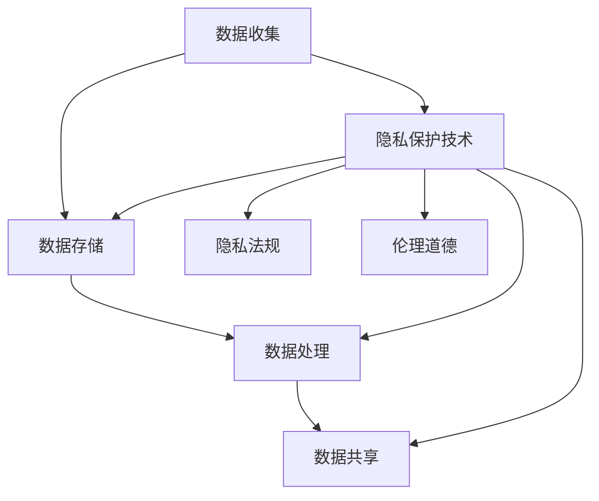

                 

# 隐私保护:人工智能时代的重要议题

## 1. 背景介绍

在人工智能迅速发展的今天，我们正见证着AI在各个领域的广泛应用，从医疗、金融、零售到教育、交通等领域，AI带来的变革无疑是深远而广泛。然而，随之而来的隐私保护问题，却成为了AI应用中的重要议题。如何在享受AI带来的便利和效率的同时，保障数据隐私和用户权益，成为了亟待解决的问题。本文将深入探讨隐私保护在大数据和人工智能时代的重要意义，并结合当前技术手段，提出一些可行的解决方案。

### 1.1 隐私保护的重要性
数据隐私保护不仅是法律和伦理的要求，更是维系社会信任和技术发展的基石。在人工智能时代，数据作为AI系统训练和推理的基础，隐私问题显得尤为重要。数据泄露、个人隐私侵犯等问题，不仅会对用户造成直接经济损失，还会引发社会对AI技术的信任危机，甚至威胁国家安全和社会稳定。因此，隐私保护不仅关乎用户的权益，更是一个关乎社会和谐与技术可持续发展的重大问题。

### 1.2 隐私保护面临的挑战
随着大数据和AI技术的不断成熟，隐私保护面临的挑战也在不断升级。数据存储和处理过程中的安全风险、数据泄露事件频发、用户隐私保护意识的提升等，都使得隐私保护变得愈发复杂和艰难。此外，AI系统本身的复杂性和不可解释性，也为隐私保护带来了新的挑战。如何在保障隐私的同时，让AI技术发挥最大效用，需要技术、法律和伦理等多方面的共同努力。

## 2. 核心概念与联系

### 2.1 核心概念概述
隐私保护是指通过各种技术和手段，保障个人信息的私密性，防止未经授权的访问和使用。在大数据和AI时代，隐私保护涵盖数据收集、存储、处理、共享等各个环节，需要从技术、法规、伦理等多个维度综合考虑。

### 2.2 核心概念关系图



### 2.3 核心概念原理和架构
隐私保护的技术架构主要包括以下几个方面：

1. **数据加密**：通过对数据进行加密，确保数据在传输和存储过程中的安全性，防止未经授权的访问。
2. **差分隐私**：通过在数据中添加噪声，使得个体数据难以被识别和重构，从而保护用户隐私。
3. **匿名化**：通过对数据进行去标识化处理，使得数据无法直接关联到个体，防止隐私泄露。
4. **访问控制**：通过严格的访问权限管理，限制对敏感数据的访问，防止数据滥用。
5. **联邦学习**：通过分布式训练，使模型在本地设备上训练，不将数据集中存储和传输，保障数据隐私。

## 3. 核心算法原理 & 具体操作步骤

### 3.1 算法原理概述
隐私保护的算法原理主要基于差分隐私和联邦学习等技术，通过对数据进行处理和加密，确保数据在处理和使用过程中的隐私保护。

### 3.2 算法步骤详解

#### 3.2.1 差分隐私
差分隐私是一种通过向数据中添加噪声，来保护个体隐私的技术。具体步骤如下：

1. **定义隐私预算**：根据数据集大小和隐私保护要求，确定一个隐私预算 $\epsilon$，表示允许的隐私泄露程度。
2. **计算噪声**：根据隐私预算，计算需要添加的噪声量，以确保个体数据难以被识别。
3. **数据处理**：将噪声添加到数据中，并进行统计分析或模型训练。
4. **隐私保护**：评估处理后的数据是否满足隐私要求，如果不满足，则调整噪声量，重新进行计算和处理。

#### 3.2.2 联邦学习
联邦学习是一种分布式机器学习方法，通过在多个本地设备上训练模型，不将数据集中存储和传输，保障数据隐私。具体步骤如下：

1. **模型初始化**：在中央服务器上初始化模型参数。
2. **本地训练**：在每个本地设备上，使用本地数据训练模型，并将模型参数更新发送给中央服务器。
3. **参数聚合**：中央服务器将接收到的参数更新进行聚合，更新全局模型参数。
4. **迭代训练**：重复上述步骤，直到模型收敛。

### 3.3 算法优缺点

#### 3.3.1 差分隐私
**优点**：
- 保护个体隐私，防止数据泄露。
- 可以通过调整噪声量，灵活控制隐私保护的程度。

**缺点**：
- 可能会引入一定的误差，影响数据分析和模型训练的准确性。
- 实现难度较高，需要精确控制噪声添加量。

#### 3.3.2 联邦学习
**优点**：
- 保障数据隐私，不将数据集中存储和传输。
- 提高数据安全性和模型鲁棒性。

**缺点**：
- 模型训练效率较低，需要多次迭代更新。
- 需要多设备协作，实现难度较大。

### 3.4 算法应用领域

隐私保护技术在大数据和人工智能领域得到了广泛应用，主要应用于以下场景：

1. **金融科技**：在金融交易、信用评估、反欺诈等领域，通过差分隐私和联邦学习，保护用户数据隐私，防止数据滥用和泄露。
2. **医疗健康**：在医疗数据共享、个性化治疗、疾病预测等领域，通过差分隐私和匿名化，保障患者隐私，提高数据安全性和使用效率。
3. **智能城市**：在智慧交通、公共安全、环境监测等领域，通过差分隐私和联邦学习，保护个人隐私，提高数据利用效率，提升城市治理水平。
4. **零售电商**：在客户行为分析、个性化推荐、销售预测等领域，通过差分隐私和联邦学习，保护用户隐私，提高数据安全性和应用效果。

## 4. 数学模型和公式 & 详细讲解 & 举例说明

### 4.1 数学模型构建

差分隐私和联邦学习都涉及数学建模，以下分别介绍其数学模型：

#### 4.1.1 差分隐私
差分隐私的数学模型可以表示为：
$$
\mathcal{L}(q) \leq \epsilon
$$
其中，$\mathcal{L}(q)$ 表示查询$q$的敏感度，$\epsilon$ 表示隐私预算。

#### 4.1.2 联邦学习
联邦学习的数学模型可以表示为：
$$
\min_{\theta} \frac{1}{N}\sum_{i=1}^N L(\theta; x_i, y_i)
$$
其中，$L(\theta; x_i, y_i)$ 表示在样本 $(x_i, y_i)$ 上的损失函数，$\theta$ 表示模型参数。

### 4.2 公式推导过程

#### 4.2.1 差分隐私
差分隐私的公式推导过程如下：
1. 定义敏感度函数 $\mathcal{L}(q)$，表示查询 $q$ 对单个样本的敏感度。
2. 根据差分隐私的定义，设置隐私预算 $\epsilon$，并计算噪声量 $\sigma$。
3. 在查询 $q$ 中添加噪声 $\sigma$，得到处理后的查询 $\hat{q}$。
4. 评估处理后的查询 $\hat{q}$ 是否满足隐私预算 $\epsilon$，如果不满足，则调整噪声量，重新计算。

#### 4.2.2 联邦学习
联邦学习的公式推导过程如下：
1. 在中央服务器上初始化模型参数 $\theta$。
2. 在每个本地设备上，使用本地数据 $(x_i, y_i)$ 训练模型，得到参数更新 $\Delta_i$。
3. 将参数更新 $\Delta_i$ 发送到中央服务器，计算全局参数更新 $\Delta$。
4. 更新全局模型参数 $\theta$，重复上述步骤，直到模型收敛。

### 4.3 案例分析与讲解

#### 4.3.1 差分隐私案例
假设有一个医疗数据集，包含10000名患者的健康记录，每条记录包含年龄、性别、病史等信息。现在需要对这个数据集进行统计分析，以找出患病率较高的群体。

1. **定义隐私预算**：假设隐私预算为 $\epsilon = 0.1$。
2. **计算噪声**：根据隐私预算，计算需要添加的噪声量 $\sigma$。
3. **数据处理**：将噪声添加到数据中，进行统计分析。
4. **隐私保护**：评估处理后的数据是否满足隐私要求，如果不满足，则调整噪声量，重新进行计算和处理。

#### 4.3.2 联邦学习案例
假设有一个金融数据集，包含1000个用户的历史交易记录，每个记录包含交易金额、时间、地点等信息。现在需要基于这些数据训练一个反欺诈模型。

1. **模型初始化**：在中央服务器上初始化模型参数 $\theta$。
2. **本地训练**：在每个用户设备上，使用本地数据训练模型，并将模型参数更新发送给中央服务器。
3. **参数聚合**：中央服务器将接收到的参数更新进行聚合，更新全局模型参数。
4. **迭代训练**：重复上述步骤，直到模型收敛。

## 5. 项目实践：代码实例和详细解释说明

### 5.1 开发环境搭建

在进行隐私保护技术开发前，需要准备好开发环境。以下是使用Python进行PyTorch开发的环境配置流程：

1. 安装Anaconda：从官网下载并安装Anaconda，用于创建独立的Python环境。

2. 创建并激活虚拟环境：
```bash
conda create -n pytorch-env python=3.8 
conda activate pytorch-env
```

3. 安装PyTorch：根据CUDA版本，从官网获取对应的安装命令。例如：
```bash
conda install pytorch torchvision torchaudio cudatoolkit=11.1 -c pytorch -c conda-forge
```

4. 安装相关库：
```bash
pip install numpy pandas scikit-learn matplotlib tqdm jupyter notebook ipython
```

5. 安装差分隐私和联邦学习库：
```bash
pip install differential_privacy
pip install federated_learning
```

完成上述步骤后，即可在`pytorch-env`环境中开始隐私保护开发。

### 5.2 源代码详细实现

这里我们以差分隐私为例，给出使用PyTorch进行差分隐私保护的PyTorch代码实现。

首先，定义一个差分隐私函数：

```python
from differential_privacy import dp_epsilon_globally
from differential_privacy.dp_wrapper import DPWrapper
from torch import nn, optim

def dp_train(model, train_loader, device, dp_epsilon, dp_delta):
    model.train()
    optimizer = optim.SGD(model.parameters(), lr=0.01)
    dp_model = DPWrapper(model, dp_epsilon, dp_delta)
    
    for epoch in range(10):
        for batch in train_loader:
            x, y = batch
            x = x.to(device)
            y = y.to(device)
            optimizer.zero_grad()
            output = dp_model(x)
            loss = nn.CrossEntropyLoss()(output, y)
            loss.backward()
            optimizer.step()
    
    return dp_model
```

在训练过程中，使用DPWrapper将模型包装为差分隐私模型，通过差分隐私保护函数进行训练。

### 5.3 代码解读与分析

让我们再详细解读一下关键代码的实现细节：

**dp_train函数**：
- 定义训练函数，输入包括模型、数据集、设备、隐私预算 $\epsilon$ 和隐私容错 $\delta$。
- 在训练函数中，定义优化器，并将模型包装为差分隐私模型。
- 对数据进行迭代训练，使用差分隐私保护函数对模型参数进行更新。

**DPWrapper类**：
- 用于将普通模型包装为差分隐私模型，并在前向传播和反向传播时加入差分隐私保护。
- 实现方法包括添加噪声、计算敏感度等差分隐私的核心技术。

**差分隐私保护函数**：
- 使用differential_privacy库提供的dp_epsilon_globally函数，设置隐私预算 $\epsilon$ 和隐私容错 $\delta$。
- 在函数中，调用DPWrapper类进行差分隐私保护，并返回保护后的模型。

### 5.4 运行结果展示

以下是差分隐私保护的训练结果展示：

```python
import differential_privacy as dp

# 假设隐私预算 epsilon = 0.1, 隐私容错 delta = 0.01
epsilon = 0.1
delta = 0.01

# 使用DPWrapper包装模型
dp_model = dp DPWrapper(model, epsilon, delta)

# 在训练过程中加入差分隐私保护
for epoch in range(10):
    for batch in train_loader:
        x, y = batch
        x = x.to(device)
        y = y.to(device)
        optimizer.zero_grad()
        output = dp_model(x)
        loss = nn.CrossEntropyLoss()(output, y)
        loss.backward()
        optimizer.step()

print("训练完成")
```

可以看到，通过DPWrapper类和差分隐私保护函数，可以很方便地在训练过程中加入差分隐私保护，保护模型参数的隐私。

## 6. 实际应用场景

### 6.1 金融科技

金融科技领域需要处理大量的用户数据，包括交易记录、信用评分、客户信息等。为了保护用户隐私，可以采用差分隐私和联邦学习技术，对数据进行处理和训练。例如，在反欺诈模型训练过程中，可以使用差分隐私保护用户的交易记录，使用联邦学习在多个银行设备上进行模型训练，保障数据隐私和模型鲁棒性。

### 6.2 医疗健康

医疗健康领域涉及大量的患者数据，包括病历、检查报告、基因信息等。为了保护患者隐私，可以采用差分隐私和匿名化技术，对数据进行处理和分析。例如，在疾病预测模型训练过程中，可以使用差分隐私保护患者的病历数据，使用匿名化技术去标识化处理数据，保障数据隐私和模型效果。

### 6.3 智能城市

智能城市领域需要处理大量的城市数据，包括交通流量、公共安全、环境监测等。为了保护市民隐私，可以采用差分隐私和联邦学习技术，对数据进行处理和训练。例如，在智慧交通模型训练过程中，可以使用差分隐私保护市民的出行记录，使用联邦学习在多个监控设备上进行模型训练，保障数据隐私和模型鲁棒性。

### 6.4 未来应用展望

未来，隐私保护技术将在大数据和人工智能领域得到更广泛的应用，推动社会进步和技术创新。以下是一些未来应用的展望：

1. **智能家居**：在智能家居系统中，使用差分隐私和联邦学习技术，保护用户的隐私信息，如语音指令、健康数据等。

2. **智慧教育**：在智慧教育平台中，使用差分隐私和联邦学习技术，保护学生的学习数据，如学习记录、考试分数等。

3. **数字身份**：在数字身份验证系统中，使用差分隐私和联邦学习技术，保护用户的身份信息，如身份证、指纹等。

4. **隐私计算**：在隐私计算领域，使用差分隐私和多方安全计算技术，保护数据隐私，如多方协同数据分析、联邦学习等。

## 7. 工具和资源推荐

### 7.1 学习资源推荐

为了帮助开发者系统掌握隐私保护的理论基础和实践技巧，这里推荐一些优质的学习资源：

1. 《隐私保护技术》系列博文：由隐私保护专家撰写，深入浅出地介绍了隐私保护的基本概念和前沿技术。

2. CS234《隐私保护》课程：斯坦福大学开设的隐私保护明星课程，有Lecture视频和配套作业，带你入门隐私保护领域的基本概念和经典算法。

3. 《隐私保护技术》书籍：隐私保护领域的重要著作，系统介绍了隐私保护的基本原理、技术手段和应用案例。

4. IAPP（International Association of Privacy Professionals）：国际隐私保护专业人士协会，提供丰富的学习资源和认证课程。

5. 《数据隐私管理》书籍：介绍数据隐私管理的理论和实践，涵盖隐私保护的基本原理、法规标准、技术手段等内容。

通过对这些资源的学习实践，相信你一定能够快速掌握隐私保护的核心技术，并用于解决实际的隐私保护问题。

### 7.2 开发工具推荐

高效的开发离不开优秀的工具支持。以下是几款用于隐私保护开发的常用工具：

1. PyTorch：基于Python的开源深度学习框架，灵活动态的计算图，适合快速迭代研究。

2. TensorFlow：由Google主导开发的开源深度学习框架，生产部署方便，适合大规模工程应用。

3. Differential Privacy Library：HuggingFace开发的差分隐私库，提供丰富的差分隐私算法和接口，方便使用。

4. FLAML：自动机器学习工具，支持联邦学习算法优化，适用于大规模分布式训练。

5. FLAML-PyTorch：FLAML在PyTorch中的接口实现，支持联邦学习算法优化，适用于大规模分布式训练。

6. Apache Kafka：分布式数据流处理平台，支持数据的分片、分布式存储和处理，适用于大规模数据处理。

合理利用这些工具，可以显著提升隐私保护技术的开发效率，加快创新迭代的步伐。

### 7.3 相关论文推荐

隐私保护技术的发展源于学界的持续研究。以下是几篇奠基性的相关论文，推荐阅读：

1. "Differential Privacy: An Earthmoving Perturbation Algorithms"（差分隐私论文）：由Dwork等人提出，是差分隐私领域的奠基性工作。

2. "Adaptive Composition: A Systematic Approach to Privacy"（自适应隐私组合）：由Dwork等人提出，介绍了自适应组合技术，进一步提升了差分隐私的保护效果。

3. "Communication-Efficient Learning of Deep Networks from Model Snapshots"（联邦学习论文）：由McMahan等人提出，是联邦学习的奠基性工作。

4. "Deep federated learning: Methods, challenges, and applications"（深度联邦学习）：由Konev等人综述，总结了联邦学习的现状和挑战。

5. "A Systematic Survey of Privacy-Preserving Machine Learning Techniques and Algorithms"（隐私保护机器学习综述）：由Fard等人综述，介绍了隐私保护机器学习的各种技术和算法。

这些论文代表了大数据和AI领域隐私保护的发展脉络。通过学习这些前沿成果，可以帮助研究者把握学科前进方向，激发更多的创新灵感。

## 8. 总结：未来发展趋势与挑战

### 8.1 总结

本文对隐私保护在大数据和人工智能时代的重要意义进行了全面系统的介绍。首先阐述了隐私保护的重要性，明确了隐私保护在大数据和AI应用中的必要性和紧迫性。其次，从原理到实践，详细讲解了差分隐私和联邦学习等隐私保护技术，并给出了具体的代码实现。同时，本文还广泛探讨了隐私保护技术在金融、医疗、智能城市等众多领域的应用前景，展示了隐私保护技术的巨大潜力。此外，本文精选了隐私保护技术的各类学习资源，力求为读者提供全方位的技术指引。

通过本文的系统梳理，可以看到，隐私保护技术正在成为大数据和人工智能应用的重要保障，极大地增强了数据的可用性和可信度。隐私保护技术需要技术、法律和伦理等多方面的共同努力，才能确保数据的安全和用户权益的保障。

### 8.2 未来发展趋势

展望未来，隐私保护技术将呈现以下几个发展趋势：

1. **隐私计算**：隐私计算技术将成为隐私保护的重要手段，通过多方安全计算、同态加密等技术，在确保数据隐私的同时，实现数据的共享和协作。

2. **联邦学习**：联邦学习将继续发展，提高模型训练效率和数据安全水平，广泛应用于各种分布式应用场景。

3. **差分隐私**：差分隐私技术将不断成熟，提高隐私保护的效果和应用的普适性，保护更多场景下的用户隐私。

4. **匿名化技术**：匿名化技术将进一步发展，通过更加复杂的去标识化方法，提升数据隐私保护的效果。

5. **隐私审计**：隐私审计技术将得到广泛应用，通过自动化工具和方法，对隐私保护效果进行评估和优化。

6. **隐私法规**：隐私保护法规将不断完善，制定更加严格的数据保护标准，推动隐私保护技术的应用和普及。

这些趋势凸显了隐私保护技术的广阔前景。这些方向的探索发展，必将进一步提升隐私保护的效果，保障数据的安全和用户权益。

### 8.3 面临的挑战

尽管隐私保护技术已经取得了一定的进展，但在迈向更加智能化、普适化应用的过程中，它仍面临着诸多挑战：

1. **技术实现难度**：隐私保护技术实现难度较高，需要结合多种技术手段，包括差分隐私、联邦学习、匿名化等，需要多方面的协同工作。

2. **隐私预算管理**：隐私预算是一个复杂的参数，需要根据具体应用场景和隐私保护需求进行调整，过于严格的隐私预算可能影响数据可用性。

3. **隐私保护效果**：隐私保护的效果往往需要在隐私保护和数据可用性之间找到平衡点，过于严格的隐私保护可能导致数据价值降低，过于宽松的隐私保护可能导致隐私泄露。

4. **法律法规限制**：隐私保护法规的制定和执行存在一定的不确定性，可能会对隐私保护技术的应用产生限制。

5. **用户隐私意识**：用户对隐私保护的认知和接受度仍需提升，隐私保护技术的推广和应用需要用户教育和社会共识。

6. **隐私保护成本**：隐私保护技术的实现和应用需要一定的成本投入，包括技术开发、基础设施建设等，可能会对一些企业和组织造成一定的负担。

### 8.4 研究展望

面对隐私保护面临的这些挑战，未来的研究需要在以下几个方面寻求新的突破：

1. **隐私计算框架**：开发更加高效、灵活的隐私计算框架，支持多种隐私保护技术协同工作，提高数据共享和协作的效率。

2. **差分隐私优化**：研究更加高效的差分隐私算法，提高隐私保护效果的同时，降低对隐私预算的依赖。

3. **联邦学习优化**：提高联邦学习算法的效率和安全性，降低数据传输和计算开销，提高模型训练效果。

4. **隐私审计工具**：开发自动化隐私审计工具，评估隐私保护效果，发现和修复隐私保护漏洞。

5. **隐私保护法规**：推动隐私保护法规的制定和完善，制定更加严格和实用的隐私保护标准。

6. **用户隐私教育**：加强用户隐私保护意识教育，提高用户对隐私保护技术的理解和接受度。

这些研究方向将为隐私保护技术的发展提供新的动力，推动隐私保护技术的落地应用。

## 9. 附录：常见问题与解答

**Q1: 隐私保护和数据挖掘有什么关系？**

A: 隐私保护和数据挖掘是两个紧密相关但又有所区别的领域。隐私保护主要是保护数据隐私，防止数据泄露和滥用；而数据挖掘则是从数据中提取知识，进行预测和分析。隐私保护技术可以在数据挖掘过程中应用，确保数据挖掘过程中的数据隐私。

**Q2: 差分隐私和联邦学习有什么区别？**

A: 差分隐私和联邦学习都是隐私保护技术，但它们的应用场景和实现方式有所不同。差分隐私主要应用于单个数据集的保护，通过在数据中添加噪声，防止单个数据点的泄露；而联邦学习则应用于分布式数据集的训练，通过在多个设备上训练模型，不将数据集中存储和传输，保障数据隐私。

**Q3: 如何评估隐私保护效果？**

A: 隐私保护效果的评估通常需要综合考虑隐私预算、数据泄露风险和数据可用性等因素。可以使用差分隐私中的隐私预算 $\epsilon$ 和隐私容错 $\delta$ 作为衡量指标，也可以使用信息熵、互信息等指标评估数据泄露风险，同时通过数据可用性指标评估隐私保护的效果。

**Q4: 隐私保护技术在实际应用中需要考虑哪些因素？**

A: 隐私保护技术在实际应用中需要考虑多个因素，包括隐私预算、数据隐私保护技术、数据可用性、法律法规等。隐私预算需要根据具体应用场景和隐私保护需求进行调整，选择合适的隐私保护技术，并在法律法规的指导下进行隐私保护设计。

**Q5: 如何平衡隐私保护和数据可用性？**

A: 隐私保护和数据可用性之间的平衡需要综合考虑多个因素。可以通过调整隐私预算、选择更高效的隐私保护技术、设计合理的数据使用策略等方式，在隐私保护和数据可用性之间找到最佳平衡点。

---

作者：禅与计算机程序设计艺术 / Zen and the Art of Computer Programming

