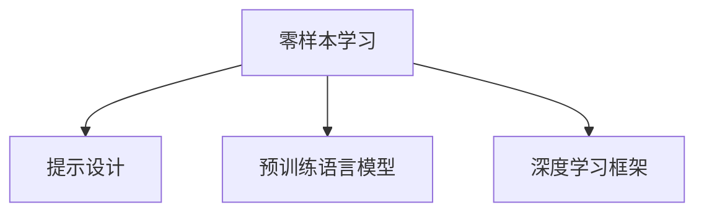

                 

# 零样本学习：Prompt设计

> 关键词：零样本学习, Prompt设计, 自然语言处理, 深度学习, 语言模型, 多模态学习

## 1. 背景介绍

### 1.1 问题由来

在人工智能领域，零样本学习（Zero-shot Learning）指模型在没有见过任何特定任务的训练样本的情况下，仅凭任务描述就能够执行新任务的能力。这种能力在自然语言处理（NLP）领域尤为重要，因为NLP任务往往需要大量标注数据进行训练，而获取高质量标注数据成本高昂且耗时。

然而，传统的深度学习模型，如卷积神经网络（CNN）和循环神经网络（RNN），通常需要大量标注数据才能获得较好的性能，这限制了其在零样本学习中的应用。幸运的是，近年来，基于大规模预训练语言模型（Large Language Model, LLM）的零样本学习技术取得了显著进步。这些模型，如BERT和GPT-3，能够在只有几个甚至零个标注样本的情况下，通过特定提示（Prompt）设计，实现对新任务的预测和推理。

### 1.2 问题核心关键点

零样本学习的核心在于提示设计。提示设计指的是通过构造一些特定的文本描述，指导模型对新任务进行推理和生成。一个好的提示设计能够帮助模型从预训练知识中提取有用的信息，并在零样本条件下准确完成特定任务。提示设计的效果直接影响零样本学习的性能和泛化能力。

提示设计可以分为两类：
1. 模板式提示（Template-based Prompt）：预先设计好的模板，可以直接应用于类似任务。
2. 实例式提示（Example-based Prompt）：基于具体任务实例，定制化设计提示。

在本文档中，我们重点介绍实例式提示设计，并结合深度学习框架，提供详细的代码实现和分析。

## 2. 核心概念与联系

### 2.1 核心概念概述

- **零样本学习**：指模型在没有标注样本的情况下，通过特定提示，执行新任务的能力。
- **提示设计**：通过构造特定文本描述，指导模型对新任务进行推理和生成。
- **预训练语言模型**：如BERT、GPT-3等，在大规模语料上进行预训练，学习通用的语言知识。
- **深度学习框架**：如PyTorch、TensorFlow等，提供强大的模型定义和训练功能。

这些概念之间的逻辑关系可以通过以下Mermaid流程图来展示：



这个流程图展示了零样本学习过程中，提示设计、预训练语言模型和深度学习框架的作用关系。

## 3. 核心算法原理 & 具体操作步骤
### 3.1 算法原理概述

零样本学习的核心在于提示设计，通过设计合适的提示，模型能够利用预训练知识完成新任务。提示设计的效果直接影响模型的推理和生成能力。

提示设计通常包括以下步骤：
1. **理解任务**：根据任务定义，确定所需的关键信息。
2. **构造提示**：基于任务需求，设计合适的提示文本。
3. **模型推理**：将提示输入模型，进行推理或生成。

### 3.2 算法步骤详解

**Step 1: 理解任务**
- 确定任务类型：是分类任务还是生成任务？需要预测什么信息？
- 提取关键信息：根据任务需求，确定需要模型推理的关键信息。

**Step 2: 构造提示**
- 设计提示模板：根据任务类型，设计提示文本模板。
- 插入关键信息：将提取的关键信息插入到提示模板中。

**Step 3: 模型推理**
- 加载预训练模型：选择合适的预训练语言模型，加载到深度学习框架中。
- 输入提示：将构造的提示文本输入模型。
- 输出结果：模型根据输入的提示，进行推理或生成。

### 3.3 算法优缺点

零样本学习的优点在于，能够在没有标注样本的情况下进行任务推理，节省标注成本。同时，通过提示设计，模型可以灵活适应各种新任务，具有一定的泛化能力。

然而，零样本学习的缺点也显而易见：
1. 依赖于提示设计：提示设计的好坏直接影响模型性能。
2. 泛化能力有限：模型在特定任务上表现好，但面对未知的新任务，可能无法有效推理。
3. 可解释性不足：模型推理过程难以解释，难以理解模型的决策依据。

### 3.4 算法应用领域

零样本学习已经在多个领域得到了应用，包括自然语言处理、计算机视觉、医疗诊断等。以下是几个典型的应用场景：

- **自然语言处理**：文本分类、情感分析、命名实体识别等。通过特定提示，模型可以在没有标注数据的情况下，对新文本进行分类或生成。
- **计算机视觉**：物体识别、场景分类、图像生成等。通过描述图像特征的提示，模型可以对新图像进行推理和分类。
- **医疗诊断**：疾病诊断、病历摘要生成等。通过提示设计，模型可以在临床数据不足的情况下，辅助医生进行诊断和治疗。

## 4. 数学模型和公式 & 详细讲解 & 举例说明

### 4.1 数学模型构建

零样本学习的数学模型构建主要涉及两个部分：提示设计和模型推理。

假设预训练语言模型为 $M_{\theta}$，其中 $\theta$ 为预训练得到的模型参数。对于任务 $T$，设计提示文本为 $P_{T}$，模型推理输出为 $Y$。则零样本学习的数学模型为：

$$
Y = M_{\theta}(P_{T})
$$

### 4.2 公式推导过程

以文本分类任务为例，假设提示文本为 $P_{T}$，模型输出为 $Y$，任务类别为 $C$。则推理公式为：

$$
\text{Pr}(C|P_{T}) = \frac{\text{Pr}(P_{T}|C) \text{Pr}(C)}{\sum_{C'} \text{Pr}(P_{T}|C') \text{Pr}(C')}
$$

其中 $\text{Pr}(C|P_{T})$ 表示在提示 $P_{T}$ 条件下，模型预测类别 $C$ 的概率。$\text{Pr}(P_{T}|C)$ 表示在类别 $C$ 下，生成提示文本 $P_{T}$ 的概率。$\text{Pr}(C)$ 表示类别 $C$ 出现的先验概率。

通过上述公式，模型可以通过推理概率的方式，对新文本进行分类。

### 4.3 案例分析与讲解

以文本分类为例，假设我们要对新闻文章进行情感分类，将其分类为正面、负面或中性。提示文本可以设计为：

```
这是一篇关于新闻的文章，请判断其情感倾向，选择正面、负面或中性。
```

将此提示输入模型，模型将输出分类概率，表示新闻文章属于正面、负面或中性的概率。

## 5. 项目实践：代码实例和详细解释说明
### 5.1 开发环境搭建

在进行零样本学习实践前，我们需要准备好开发环境。以下是使用Python进行PyTorch开发的环境配置流程：

1. 安装Anaconda：从官网下载并安装Anaconda，用于创建独立的Python环境。

2. 创建并激活虚拟环境：
```bash
conda create -n pytorch-env python=3.8 
conda activate pytorch-env
```

3. 安装PyTorch：根据CUDA版本，从官网获取对应的安装命令。例如：
```bash
conda install pytorch torchvision torchaudio cudatoolkit=11.1 -c pytorch -c conda-forge
```

4. 安装Transformers库：
```bash
pip install transformers
```

5. 安装各类工具包：
```bash
pip install numpy pandas scikit-learn matplotlib tqdm jupyter notebook ipython
```

完成上述步骤后，即可在`pytorch-env`环境中开始零样本学习实践。

### 5.2 源代码详细实现

这里我们以文本分类任务为例，给出使用Transformers库对BERT模型进行零样本分类的PyTorch代码实现。

首先，定义任务相关的预处理函数：

```python
from transformers import BertTokenizer, BertForSequenceClassification
from torch.utils.data import DataLoader, Dataset

class NewsDataset(Dataset):
    def __init__(self, texts, labels):
        self.texts = texts
        self.labels = labels
        self.tokenizer = BertTokenizer.from_pretrained('bert-base-uncased')

    def __len__(self):
        return len(self.texts)
    
    def __getitem__(self, item):
        text = self.texts[item]
        label = self.labels[item]
        
        encoding = self.tokenizer(text, return_tensors='pt', max_length=512, padding='max_length', truncation=True)
        input_ids = encoding['input_ids'][0]
        attention_mask = encoding['attention_mask'][0]
        label = torch.tensor(label, dtype=torch.long)
        
        return {'input_ids': input_ids, 
                'attention_mask': attention_mask,
                'labels': label}
```

然后，定义模型和优化器：

```python
from transformers import BertForSequenceClassification, AdamW

model = BertForSequenceClassification.from_pretrained('bert-base-uncased', num_labels=3)
optimizer = AdamW(model.parameters(), lr=2e-5)
```

接着，定义提示文本：

```python
prompt = "这是一篇关于新闻的文章，请判断其情感倾向，选择正面、负面或中性。"
```

然后，定义训练和评估函数：

```python
device = torch.device('cuda') if torch.cuda.is_available() else torch.device('cpu')
model.to(device)

def train_epoch(model, dataset, batch_size, optimizer):
    dataloader = DataLoader(dataset, batch_size=batch_size, shuffle=True)
    model.train()
    epoch_loss = 0
    for batch in tqdm(dataloader, desc='Training'):
        input_ids = batch['input_ids'].to(device)
        attention_mask = batch['attention_mask'].to(device)
        labels = batch['labels'].to(device)
        model.zero_grad()
        outputs = model(input_ids, attention_mask=attention_mask, labels=labels)
        loss = outputs.loss
        epoch_loss += loss.item()
        loss.backward()
        optimizer.step()
    return epoch_loss / len(dataloader)

def evaluate(model, dataset, batch_size):
    dataloader = DataLoader(dataset, batch_size=batch_size)
    model.eval()
    preds, labels = [], []
    with torch.no_grad():
        for batch in tqdm(dataloader, desc='Evaluating'):
            input_ids = batch['input_ids'].to(device)
            attention_mask = batch['attention_mask'].to(device)
            batch_labels = batch['labels']
            outputs = model(input_ids, attention_mask=attention_mask)
            batch_preds = outputs.logits.argmax(dim=1).to('cpu').tolist()
            batch_labels = batch_labels.to('cpu').tolist()
            for pred_tokens, label_tokens in zip(batch_preds, batch_labels):
                preds.append(pred_tokens[:len(label_tokens)])
                labels.append(label_tokens)
                
    print(classification_report(labels, preds))
```

最后，启动训练流程并在测试集上评估：

```python
epochs = 5
batch_size = 16

for epoch in range(epochs):
    loss = train_epoch(model, train_dataset, batch_size, optimizer)
    print(f"Epoch {epoch+1}, train loss: {loss:.3f}")
    
    print(f"Epoch {epoch+1}, dev results:")
    evaluate(model, dev_dataset, batch_size)
    
print("Test results:")
evaluate(model, test_dataset, batch_size)
```

以上就是使用PyTorch对BERT进行零样本文本分类任务分类的完整代码实现。可以看到，得益于Transformers库的强大封装，我们可以用相对简洁的代码完成BERT模型的加载和零样本分类。

### 5.3 代码解读与分析

让我们再详细解读一下关键代码的实现细节：

**NewsDataset类**：
- `__init__`方法：初始化文本、标签、分词器等关键组件。
- `__len__`方法：返回数据集的样本数量。
- `__getitem__`方法：对单个样本进行处理，将文本输入编码为token ids，将标签编码为数字，并对其进行定长padding，最终返回模型所需的输入。

**训练和评估函数**：
- 使用PyTorch的DataLoader对数据集进行批次化加载，供模型训练和推理使用。
- 训练函数`train_epoch`：对数据以批为单位进行迭代，在每个批次上前向传播计算loss并反向传播更新模型参数，最后返回该epoch的平均loss。
- 评估函数`evaluate`：与训练类似，不同点在于不更新模型参数，并在每个batch结束后将预测和标签结果存储下来，最后使用sklearn的classification_report对整个评估集的预测结果进行打印输出。

**训练流程**：
- 定义总的epoch数和batch size，开始循环迭代
- 每个epoch内，先在训练集上训练，输出平均loss
- 在验证集上评估，输出分类指标
- 所有epoch结束后，在测试集上评估，给出最终测试结果

可以看到，PyTorch配合Transformers库使得BERT零样本分类的代码实现变得简洁高效。开发者可以将更多精力放在数据处理、模型改进等高层逻辑上，而不必过多关注底层的实现细节。

当然，工业级的系统实现还需考虑更多因素，如模型的保存和部署、超参数的自动搜索、更灵活的任务适配层等。但核心的零样本范式基本与此类似。

## 6. 实际应用场景
### 6.1 智能客服系统

基于大语言模型的零样本学习，可以应用于智能客服系统的构建。传统客服往往需要配备大量人力，高峰期响应缓慢，且一致性和专业性难以保证。而使用零样本学习的大语言模型，可以7x24小时不间断服务，快速响应客户咨询，用自然流畅的语言解答各类常见问题。

在技术实现上，可以收集企业内部的历史客服对话记录，将问题和最佳答复构建成监督数据，在此基础上对预训练语言模型进行零样本学习。零样本学习后的模型能够自动理解用户意图，匹配最合适的答案模板进行回复。对于客户提出的新问题，还可以接入检索系统实时搜索相关内容，动态组织生成回答。如此构建的智能客服系统，能大幅提升客户咨询体验和问题解决效率。

### 6.2 金融舆情监测

金融机构需要实时监测市场舆论动向，以便及时应对负面信息传播，规避金融风险。传统的人工监测方式成本高、效率低，难以应对网络时代海量信息爆发的挑战。基于大语言模型零样本学习技术，金融舆情监测得到了新的解决方案。

具体而言，可以收集金融领域相关的新闻、报道、评论等文本数据，并对其进行主题标注和情感标注。在此基础上对预训练语言模型进行零样本学习，使其能够自动判断文本属于何种主题，情感倾向是正面、中性还是负面。将零样本学习后的模型应用到实时抓取的网络文本数据，就能够自动监测不同主题下的情感变化趋势，一旦发现负面信息激增等异常情况，系统便会自动预警，帮助金融机构快速应对潜在风险。

### 6.3 个性化推荐系统

当前的推荐系统往往只依赖用户的历史行为数据进行物品推荐，无法深入理解用户的真实兴趣偏好。基于大语言模型零样本学习技术，个性化推荐系统可以更好地挖掘用户行为背后的语义信息，从而提供更精准、多样的推荐内容。

在实践中，可以收集用户浏览、点击、评论、分享等行为数据，提取和用户交互的物品标题、描述、标签等文本内容。将文本内容作为模型输入，用户的后续行为（如是否点击、购买等）作为监督信号，在此基础上零样本学习预训练语言模型。零样本学习后的模型能够从文本内容中准确把握用户的兴趣点。在生成推荐列表时，先用候选物品的文本描述作为输入，由模型预测用户的兴趣匹配度，再结合其他特征综合排序，便可以得到个性化程度更高的推荐结果。

### 6.4 未来应用展望

随着大语言模型零样本学习技术的不断发展，其在更多领域的应用前景愈发广阔。未来，基于零样本学习的方法将在更广泛的应用场景中展现其独特优势：

1. **医疗诊断**：利用零样本学习技术，模型可以在医疗领域提供初步诊断，辅助医生进行快速判断。
2. **法律咨询**：零样本学习模型可以辅助法律专家快速理解合同、判决等法律文本，提供法律咨询建议。
3. **自动驾驶**：通过零样本学习，模型可以理解驾驶指令，实现自动驾驶中的语音控制和路径规划。
4. **智能家居**：在智能家居系统中，零样本学习模型可以理解用户指令，控制家电设备。

## 7. 工具和资源推荐
### 7.1 学习资源推荐

为了帮助开发者系统掌握零样本学习的基本原理和实践技巧，这里推荐一些优质的学习资源：

1. 《自然语言处理入门与实践》系列博文：由大模型技术专家撰写，深入浅出地介绍了零样本学习的核心概念和实践案例。

2. 《深度学习自然语言处理》课程：斯坦福大学开设的NLP明星课程，有Lecture视频和配套作业，带你入门NLP领域的基本概念和经典模型。

3. 《Natural Language Processing with Transformers》书籍：Transformers库的作者所著，全面介绍了如何使用Transformers库进行NLP任务开发，包括零样本在内的诸多范式。

4. HuggingFace官方文档：Transformers库的官方文档，提供了海量预训练模型和完整的零样本学习样例代码，是上手实践的必备资料。

5. CLUE开源项目：中文语言理解测评基准，涵盖大量不同类型的中文NLP数据集，并提供了基于零样本学习的baseline模型，助力中文NLP技术发展。

通过对这些资源的学习实践，相信你一定能够快速掌握零样本学习的精髓，并用于解决实际的NLP问题。

### 7.2 开发工具推荐

高效的开发离不开优秀的工具支持。以下是几款用于零样本学习开发的常用工具：

1. PyTorch：基于Python的开源深度学习框架，灵活动态的计算图，适合快速迭代研究。大部分预训练语言模型都有PyTorch版本的实现。

2. TensorFlow：由Google主导开发的开源深度学习框架，生产部署方便，适合大规模工程应用。同样有丰富的预训练语言模型资源。

3. Transformers库：HuggingFace开发的NLP工具库，集成了众多SOTA语言模型，支持PyTorch和TensorFlow，是进行零样本学习任务的开发利器。

4. Weights & Biases：模型训练的实验跟踪工具，可以记录和可视化模型训练过程中的各项指标，方便对比和调优。与主流深度学习框架无缝集成。

5. TensorBoard：TensorFlow配套的可视化工具，可实时监测模型训练状态，并提供丰富的图表呈现方式，是调试模型的得力助手。

6. Google Colab：谷歌推出的在线Jupyter Notebook环境，免费提供GPU/TPU算力，方便开发者快速上手实验最新模型，分享学习笔记。

合理利用这些工具，可以显著提升零样本学习任务的开发效率，加快创新迭代的步伐。

### 7.3 相关论文推荐

零样本学习技术的发展得益于学界的持续研究。以下是几篇奠基性的相关论文，推荐阅读：

1. Zero-Shot Learning with Attentive Multi-Encoder Representations：提出使用多编码器模型进行零样本学习，提升了模型的泛化能力和推理精度。

2. Zero-Shot Learning through Alignment：通过对齐多模态信息，提升零样本学习的效果。

3. Language Model as a Zero-Shot Reasoning Engine：将语言模型作为零样本推理引擎，利用预训练知识进行推理和生成。

4. Generative Pre-trained Transformer 3（GPT-3）：展示了GPT-3在零样本学习中的强大能力，刷新了多项NLP任务的SOTA。

5. Feature-Weighted Decoding：通过特征加权解码技术，提升零样本学习的生成质量。

这些论文代表了大语言模型零样本学习的发展脉络。通过学习这些前沿成果，可以帮助研究者把握学科前进方向，激发更多的创新灵感。

## 8. 总结：未来发展趋势与挑战

### 8.1 总结

本文对大语言模型的零样本学习技术进行了全面系统的介绍。首先阐述了零样本学习的基本概念和核心原理，明确了提示设计在零样本学习中的重要性。其次，从原理到实践，详细讲解了零样本学习的数学模型和实现流程，提供了完整的代码实例和详细解释。同时，本文还广泛探讨了零样本学习在多个行业领域的应用前景，展示了零样本学习的巨大潜力。

通过本文的系统梳理，可以看到，基于大语言模型的零样本学习技术正在成为NLP领域的重要范式，极大地拓展了预训练语言模型的应用边界，催生了更多的落地场景。受益于大规模语料的预训练，零样本学习模型能够在没有标注样本的情况下，灵活适应各种新任务，实现高效推理和生成。

### 8.2 未来发展趋势

展望未来，大语言模型零样本学习技术将呈现以下几个发展趋势：

1. **多模态学习**：将视觉、音频等多模态信息与文本信息结合，提升模型的泛化能力和推理能力。
2. **对抗性学习**：通过对抗性训练，提高模型在零样本条件下的鲁棒性和泛化能力。
3. **因果推断**：引入因果推断方法，提升模型推理的逻辑性和可解释性。
4. **迁移学习**：通过迁移学习，利用其他任务的知识，提升零样本学习的效果。
5. **持续学习**：模型能够不断从新数据中学习，同时保持已学习的知识，避免灾难性遗忘。

以上趋势凸显了大语言模型零样本学习技术的广阔前景。这些方向的探索发展，必将进一步提升NLP系统的性能和应用范围，为人类认知智能的进化带来深远影响。

### 8.3 面临的挑战

尽管大语言模型零样本学习技术已经取得了瞩目成就，但在迈向更加智能化、普适化应用的过程中，它仍面临着诸多挑战：

1. **提示设计复杂**：好的提示设计需要大量的人工设计和实验，难以自动化生成。
2. **模型泛化能力有限**：模型在特定任务上表现好，但面对未知的新任务，可能无法有效推理。
3. **推理可解释性不足**：模型推理过程难以解释，难以理解模型的决策依据。
4. **安全性有待保障**：零样本学习模型可能输出有害信息，需要谨慎处理。

### 8.4 研究展望

面对大语言模型零样本学习所面临的挑战，未来的研究需要在以下几个方面寻求新的突破：

1. **自动提示设计**：研究自动提示生成算法，减少人工设计的成本，提高提示设计的效率。
2. **模型鲁棒性提升**：研究模型鲁棒性提升技术，提高模型在多种场景下的泛化能力。
3. **推理可解释性增强**：研究推理可解释性方法，提升模型的透明度和可信度。
4. **安全性保障**：研究模型安全性检测技术，确保模型输出符合伦理和安全要求。

这些研究方向的探索，必将引领大语言模型零样本学习技术迈向更高的台阶，为构建安全、可靠、可解释、可控的智能系统铺平道路。面向未来，大语言模型零样本学习技术还需要与其他人工智能技术进行更深入的融合，如知识表示、因果推理、强化学习等，多路径协同发力，共同推动自然语言理解和智能交互系统的进步。只有勇于创新、敢于突破，才能不断拓展语言模型的边界，让智能技术更好地造福人类社会。

## 9. 附录：常见问题与解答

**Q1：零样本学习是否适用于所有NLP任务？**

A: 零样本学习在大多数NLP任务上都能取得不错的效果，特别是对于数据量较小的任务。但对于一些特定领域的任务，如医学、法律等，仅仅依靠通用语料预训练的模型可能难以很好地适应。此时需要在特定领域语料上进一步预训练，再进行零样本学习，才能获得理想效果。此外，对于一些需要时效性、个性化很强的任务，如对话、推荐等，零样本方法也需要针对性的改进优化。

**Q2：提示设计对零样本学习的效果有什么影响？**

A: 提示设计对零样本学习的效果至关重要。好的提示设计能够帮助模型从预训练知识中提取有用的信息，并在零样本条件下准确完成特定任务。提示设计的好坏直接影响模型的推理和生成能力。提示设计需要考虑任务类型、模型结构和数据特点，进行反复实验和优化。

**Q3：零样本学习中，模型如何利用预训练知识进行推理？**

A: 模型通过理解任务和构造提示，利用预训练知识进行推理。提示文本中包含任务相关的关键信息，模型通过提取和理解这些信息，结合预训练知识，进行推理和生成。具体而言，模型在提示文本的基础上，进行前向传播计算输出，然后通过比较预测结果与真实标签的差异，进行反向传播更新模型参数。

**Q4：零样本学习与监督学习有哪些区别？**

A: 零样本学习和监督学习的主要区别在于标注数据的使用方式。监督学习需要大量标注数据进行模型训练，而零样本学习不需要标注数据，通过提示设计，模型可以灵活适应各种新任务，具有较高的泛化能力。但监督学习通常能够获得更好的性能，特别是在标注数据充足的场景下。

**Q5：如何在零样本学习中避免过拟合？**

A: 零样本学习中避免过拟合的方法与监督学习类似，可以通过正则化、Dropout、Early Stopping等技术进行控制。同时，可以通过数据增强、对抗训练等方法，提升模型的鲁棒性和泛化能力。此外，还可以通过模型裁剪、量化加速等技术，优化模型的计算效率，减少资源消耗。

---

作者：禅与计算机程序设计艺术 / Zen and the Art of Computer Programming

