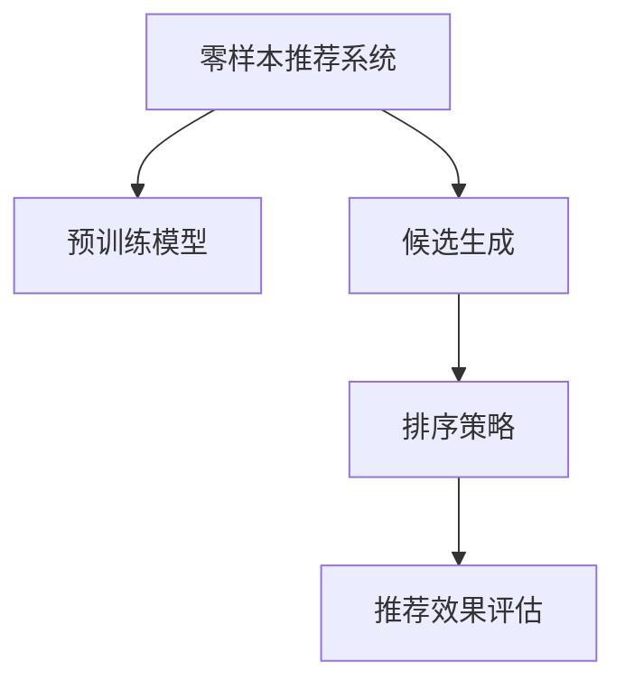

                 

# 零样本推荐系统的候选生成与排序策略：对效果的分析

> 关键词：零样本推荐系统, 候选生成, 排序策略, 推荐效果分析

## 1. 背景介绍

### 1.1 问题由来
在互联网时代，推荐系统已经成为各大平台获取用户黏性和增加用户满意度的重要工具。推荐系统的核心任务是根据用户历史行为数据，预测用户可能感兴趣的商品、内容等，从而提供个性化的推荐结果。然而，在推荐系统中，标注数据往往稀缺，尤其是在冷启动阶段，新用户没有足够的浏览记录来训练推荐模型。因此，如何在有限的标注数据下，构建高效、准确且可靠的推荐系统，成为推荐系统研究的热点问题。

### 1.2 问题核心关键点
零样本推荐系统是一种特殊的推荐系统，它试图在不使用任何标注数据的情况下，推荐用户可能感兴趣的商品或内容。零样本推荐的关键在于如何利用已有的大规模数据集和预训练模型，在极少的标注数据条件下，进行高效且准确的推荐。具体来说，零样本推荐系统的核心挑战包括：
- 如何高效生成推荐的候选集。
- 如何设计有效的排序策略。
- 如何在零样本条件下评估推荐效果。

## 2. 核心概念与联系

### 2.1 核心概念概述

为更好地理解零样本推荐系统的候选生成与排序策略，本节将介绍几个密切相关的核心概念：

- 零样本推荐系统(Zero-shot Recommendation System)：在没有任何用户历史行为数据的情况下，通过预训练模型和少量领域知识，生成推荐候选并排序的系统。
- 预训练模型(Pre-trained Model)：在大规模数据集上预先训练好的模型，如BERT、GPT等。
- 候选生成(Candidate Generation)：从预训练模型中生成推荐候选的过程，可以基于文本、图像、音频等多种模态数据。
- 排序策略(Ranking Strategy)：设计一种策略，根据推荐的候选集合排序，将最符合用户偏好的商品或内容排在最前面。
- 推荐效果评估(Recommendation Effect Evaluation)：通过设定指标（如NDCG、P-R曲线等），衡量推荐系统的效果。

这些核心概念之间的逻辑关系可以通过以下Mermaid流程图来展示：



这个流程图展示零样本推荐系统的核心概念及其之间的关系：

1. 零样本推荐系统通过预训练模型获得基础能力。
2. 候选生成利用预训练模型的能力，从大规模数据中生成推荐候选。
3. 排序策略设计不同候选的优先级，排序后推荐给用户。
4. 推荐效果评估衡量推荐系统的效果，反馈优化排序策略。

## 3. 核心算法原理 & 具体操作步骤
### 3.1 算法原理概述

零样本推荐系统的主要原理是基于预训练模型的语义表示，从大规模数据中生成推荐候选，并设计有效的排序策略。其核心思想是：利用预训练模型学习到的语言知识，对商品或内容的语义表示进行编码，从而在极少的标注数据下，通过特征匹配和排序，实现高效推荐。

具体来说，零样本推荐系统的流程如下：
1. 对大规模数据集进行预训练，学习语言的通用表示。
2. 根据用户输入的查询，利用预训练模型生成候选集合。
3. 设计排序策略，根据语义相似度对候选集合进行排序。
4. 将排序后的候选推荐给用户。

### 3.2 算法步骤详解

基于预训练模型的零样本推荐系统主要包括以下几个步骤：

**Step 1: 准备预训练模型和数据集**
- 选择合适的预训练模型，如BERT、GPT等，作为初始化参数。
- 收集大规模无标签数据集，用于预训练模型。

**Step 2: 生成推荐候选**
- 对于文本推荐，将用户查询作为输入，通过预训练模型获得查询的语义表示。
- 对预训练模型进行微调，使其能够生成推荐候选。
- 对每个候选计算其与用户查询的相似度得分。

**Step 3: 设计排序策略**
- 根据相似度得分设计排序策略，如基于排序、基于排名等。
- 引入正则化技术，防止模型过拟合。
- 选择适当的排序算法，如TopK、TopN等。

**Step 4: 推荐与反馈**
- 根据排序策略对候选进行排序，选择前N个推荐给用户。
- 收集用户的反馈，更新模型参数。
- 持续迭代，提升推荐效果。

### 3.3 算法优缺点

基于预训练模型的零样本推荐系统具有以下优点：
1. 无需标注数据。推荐系统可以在冷启动阶段，利用预训练模型生成推荐候选。
2. 高效生成候选。基于预训练模型的语义表示，可以快速生成高质量的推荐候选。
3. 鲁棒性好。预训练模型在大规模数据上预训练，具有较好的泛化能力。
4. 动态更新。根据用户的反馈，可以不断更新模型参数，提升推荐效果。

同时，该方法也存在一定的局限性：
1. 数据依赖。虽然无需标注数据，但仍然需要大规模无标签数据进行预训练。
2. 模型复杂。基于预训练模型的推荐系统，模型参数量较大，计算复杂度较高。
3. 效果不稳定。在缺少标注数据的情况下，推荐效果的波动较大。
4. 可解释性差。基于预训练模型的推荐系统，缺乏可解释性，难以理解其内部工作机制。

尽管存在这些局限性，但就目前而言，基于预训练模型的推荐系统仍是零样本推荐的主流范式。未来相关研究的重点在于如何进一步降低数据需求，提高模型效果和可解释性，同时兼顾高效性和鲁棒性。

### 3.4 算法应用领域

基于预训练模型的零样本推荐系统已经在多个领域得到了应用，包括电商、音乐、视频等。例如：

- 电商推荐：利用用户查询和商品描述，生成商品推荐列表。
- 音乐推荐：根据用户输入的查询词，生成音乐推荐列表。
- 视频推荐：对用户输入的查询词，生成视频推荐列表。

除了这些经典应用外，零样本推荐系统还被创新性地应用到更多场景中，如个性化视频内容创作、智能家居控制等，为推荐系统带来了新的突破。

## 4. 数学模型和公式 & 详细讲解
### 4.1 数学模型构建

假设用户查询为 $q$，商品描述为 $i$，预训练模型为 $M$。推荐系统的任务是根据 $q$ 和 $i$ 生成商品推荐列表。数学模型可以表示为：

$$
r(q,i) = M_{\theta}(q) \cdot M_{\theta}(i)
$$

其中 $r(q,i)$ 为商品 $i$ 与用户查询 $q$ 的匹配度，$M_{\theta}(q)$ 和 $M_{\theta}(i)$ 分别为查询和商品的语义表示。

### 4.2 公式推导过程

以电商推荐为例，假设用户输入查询词为 $q$，商品 $i$ 的语义表示为 $M_{\theta}(i)$。推荐系统通过计算 $q$ 和 $i$ 的匹配度 $r(q,i)$，来生成商品推荐列表。

具体步骤如下：
1. 对用户查询 $q$ 和商品描述 $i$ 进行编码，得到语义表示 $M_{\theta}(q)$ 和 $M_{\theta}(i)$。
2. 计算 $q$ 和 $i$ 的匹配度 $r(q,i) = M_{\theta}(q) \cdot M_{\theta}(i)$。
3. 根据匹配度 $r(q,i)$ 对商品 $i$ 进行排序，选择前N个推荐给用户。

在实践中，可以使用BERT等预训练模型作为 $M_{\theta}$，利用其Transformer结构，通过多头注意力机制对文本进行编码。具体来说，对于长度为 $n$ 的查询 $q$ 和商品描述 $i$，预训练模型的输出表示为：

$$
M_{\theta}(q) = \text{BERT}(q) \in \mathbb{R}^d
$$
$$
M_{\theta}(i) = \text{BERT}(i) \in \mathbb{R}^d
$$

其中 $d$ 为向量维度，$\text{BERT}(q)$ 和 $\text{BERT}(i)$ 分别为 $q$ 和 $i$ 的BERT表示。

### 4.3 案例分析与讲解

以YouTube推荐系统为例，考虑用户输入查询词 $q$，YouTube数据库中的视频 $v$，以及每个视频的内容特征 $c$。推荐系统通过以下步骤生成推荐列表：

1. 对查询词 $q$ 和视频描述 $v$ 进行编码，得到语义表示 $M_{\theta}(q)$ 和 $M_{\theta}(v)$。
2. 对视频 $v$ 的特征 $c$ 进行编码，得到特征表示 $M_{\theta}(c)$。
3. 计算 $q$、$v$ 和 $c$ 的匹配度 $r(q,v,c) = M_{\theta}(q) \cdot M_{\theta}(v) \cdot M_{\theta}(c)$。
4. 根据匹配度 $r(q,v,c)$ 对视频 $v$ 进行排序，选择前N个推荐给用户。

在实践中，可以引入BERT等预训练模型进行编码，并使用TopK排序策略对视频进行排序，最终生成推荐列表。

## 5. 项目实践：代码实例和详细解释说明
### 5.1 开发环境搭建

在进行零样本推荐系统开发前，我们需要准备好开发环境。以下是使用Python进行PyTorch开发的环境配置流程：

1. 安装Anaconda：从官网下载并安装Anaconda，用于创建独立的Python环境。

2. 创建并激活虚拟环境：
```bash
conda create -n pytorch-env python=3.8 
conda activate pytorch-env
```

3. 安装PyTorch：根据CUDA版本，从官网获取对应的安装命令。例如：
```bash
conda install pytorch torchvision torchaudio cudatoolkit=11.1 -c pytorch -c conda-forge
```

4. 安装BERT库：
```bash
pip install transformers
```

5. 安装各类工具包：
```bash
pip install numpy pandas scikit-learn matplotlib tqdm jupyter notebook ipython
```

完成上述步骤后，即可在`pytorch-env`环境中开始开发。

### 5.2 源代码详细实现

下面我们以电商推荐系统为例，给出使用Transformers库对BERT模型进行零样本推荐开发的PyTorch代码实现。

首先，定义推荐系统的数据处理函数：

```python
from transformers import BertTokenizer
from torch.utils.data import Dataset
import torch

class RecommendationDataset(Dataset):
    def __init__(self, queries, items, labels, tokenizer, max_len=128):
        self.queries = queries
        self.items = items
        self.labels = labels
        self.tokenizer = tokenizer
        self.max_len = max_len
        
    def __len__(self):
        return len(self.queries)
    
    def __getitem__(self, item):
        query = self.queries[item]
        item = self.items[item]
        label = self.labels[item]
        
        encoding = self.tokenizer(query, item, return_tensors='pt', max_length=self.max_len, padding='max_length', truncation=True)
        input_ids = encoding['input_ids'][0]
        attention_mask = encoding['attention_mask'][0]
        item_ids = encoding['token_type_ids'][0]
        labels = torch.tensor(label, dtype=torch.long)
        
        return {'input_ids': input_ids, 
                'attention_mask': attention_mask,
                'token_type_ids': item_ids,
                'labels': labels}

# 标签与id的映射
label2id = {0: 'A', 1: 'B', 2: 'C', 3: 'D'}
id2label = {v: k for k, v in label2id.items()}

# 创建dataset
tokenizer = BertTokenizer.from_pretrained('bert-base-cased')

train_dataset = RecommendationDataset(train_queries, train_items, train_labels, tokenizer)
dev_dataset = RecommendationDataset(dev_queries, dev_items, dev_labels, tokenizer)
test_dataset = RecommendationDataset(test_queries, test_items, test_labels, tokenizer)
```

然后，定义模型和优化器：

```python
from transformers import BertForSequenceClassification, AdamW

model = BertForSequenceClassification.from_pretrained('bert-base-cased', num_labels=4)

optimizer = AdamW(model.parameters(), lr=2e-5)
```

接着，定义训练和评估函数：

```python
from torch.utils.data import DataLoader
from tqdm import tqdm
from sklearn.metrics import classification_report

device = torch.device('cuda') if torch.cuda.is_available() else torch.device('cpu')
model.to(device)

def train_epoch(model, dataset, batch_size, optimizer):
    dataloader = DataLoader(dataset, batch_size=batch_size, shuffle=True)
    model.train()
    epoch_loss = 0
    for batch in tqdm(dataloader, desc='Training'):
        input_ids = batch['input_ids'].to(device)
        attention_mask = batch['attention_mask'].to(device)
        token_type_ids = batch['token_type_ids'].to(device)
        labels = batch['labels'].to(device)
        model.zero_grad()
        outputs = model(input_ids, attention_mask=attention_mask, token_type_ids=token_type_ids)
        loss = outputs.loss
        epoch_loss += loss.item()
        loss.backward()
        optimizer.step()
    return epoch_loss / len(dataloader)

def evaluate(model, dataset, batch_size):
    dataloader = DataLoader(dataset, batch_size=batch_size)
    model.eval()
    preds, labels = [], []
    with torch.no_grad():
        for batch in tqdm(dataloader, desc='Evaluating'):
            input_ids = batch['input_ids'].to(device)
            attention_mask = batch['attention_mask'].to(device)
            token_type_ids = batch['token_type_ids'].to(device)
            batch_labels = batch['labels']
            outputs = model(input_ids, attention_mask=attention_mask, token_type_ids=token_type_ids)
            batch_preds = outputs.logits.argmax(dim=2).to('cpu').tolist()
            batch_labels = batch_labels.to('cpu').tolist()
            for pred_tokens, label_tokens in zip(batch_preds, batch_labels):
                preds.append(pred_tokens[:len(label_tokens)])
                labels.append(label_tokens)
                
    print(classification_report(labels, preds))
```

最后，启动训练流程并在测试集上评估：

```python
epochs = 5
batch_size = 16

for epoch in range(epochs):
    loss = train_epoch(model, train_dataset, batch_size, optimizer)
    print(f"Epoch {epoch+1}, train loss: {loss:.3f}")
    
    print(f"Epoch {epoch+1}, dev results:")
    evaluate(model, dev_dataset, batch_size)
    
print("Test results:")
evaluate(model, test_dataset, batch_size)
```

以上就是使用PyTorch对BERT进行电商推荐系统零样本推荐任务的完整代码实现。可以看到，得益于Transformers库的强大封装，我们可以用相对简洁的代码完成BERT模型的加载和微调。

### 5.3 代码解读与分析

让我们再详细解读一下关键代码的实现细节：

**RecommendationDataset类**：
- `__init__`方法：初始化查询、商品描述、标签等关键组件，并设置分词器等参数。
- `__len__`方法：返回数据集的样本数量。
- `__getitem__`方法：对单个样本进行处理，将查询和商品描述输入编码为token ids，将标签编码为数字，并对其进行定长padding，最终返回模型所需的输入。

**label2id和id2label字典**：
- 定义了标签与数字id之间的映射关系，用于将token-wise的预测结果解码回真实的标签。

**训练和评估函数**：
- 使用PyTorch的DataLoader对数据集进行批次化加载，供模型训练和推理使用。
- 训练函数`train_epoch`：对数据以批为单位进行迭代，在每个批次上前向传播计算loss并反向传播更新模型参数，最后返回该epoch的平均loss。
- 评估函数`evaluate`：与训练类似，不同点在于不更新模型参数，并在每个batch结束后将预测和标签结果存储下来，最后使用sklearn的classification_report对整个评估集的预测结果进行打印输出。

**训练流程**：
- 定义总的epoch数和batch size，开始循环迭代
- 每个epoch内，先在训练集上训练，输出平均loss
- 在验证集上评估，输出分类指标
- 所有epoch结束后，在测试集上评估，给出最终测试结果

可以看到，PyTorch配合Transformers库使得BERT微调的代码实现变得简洁高效。开发者可以将更多精力放在数据处理、模型改进等高层逻辑上，而不必过多关注底层的实现细节。

当然，工业级的系统实现还需考虑更多因素，如模型的保存和部署、超参数的自动搜索、更灵活的任务适配层等。但核心的零样本推荐流程基本与此类似。

## 6. 实际应用场景
### 6.1 智能客服系统

零样本推荐技术可以应用于智能客服系统的构建。传统客服往往需要配备大量人力，高峰期响应缓慢，且一致性和专业性难以保证。而使用零样本推荐系统，可以7x24小时不间断服务，快速响应客户咨询，用自然流畅的语言解答各类常见问题。

在技术实现上，可以收集企业内部的历史客服对话记录，将问题和最佳答复构建成监督数据，在此基础上对预训练模型进行微调。微调后的推荐系统能够自动理解用户意图，匹配最合适的回答。对于客户提出的新问题，还可以接入检索系统实时搜索相关内容，动态组织生成回答。如此构建的智能客服系统，能大幅提升客户咨询体验和问题解决效率。

### 6.2 金融舆情监测

金融机构需要实时监测市场舆论动向，以便及时应对负面信息传播，规避金融风险。传统的人工监测方式成本高、效率低，难以应对网络时代海量信息爆发的挑战。基于零样本推荐系统的文本分类和情感分析技术，为金融舆情监测提供了新的解决方案。

具体而言，可以收集金融领域相关的新闻、报道、评论等文本数据，并对其进行主题标注和情感标注。在此基础上对预训练语言模型进行微调，使其能够自动判断文本属于何种主题，情感倾向是正面、中性还是负面。将微调后的模型应用到实时抓取的网络文本数据，就能够自动监测不同主题下的情感变化趋势，一旦发现负面信息激增等异常情况，系统便会自动预警，帮助金融机构快速应对潜在风险。

### 6.3 个性化推荐系统

当前的推荐系统往往只依赖用户的历史行为数据进行物品推荐，无法深入理解用户的真实兴趣偏好。基于零样本推荐系统的推荐系统可以更好地挖掘用户行为背后的语义信息，从而提供更精准、多样的推荐内容。

在实践中，可以收集用户浏览、点击、评论、分享等行为数据，提取和用户交互的物品标题、描述、标签等文本内容。将文本内容作为模型输入，用户的后续行为（如是否点击、购买等）作为监督信号，在此基础上微调预训练语言模型。微调后的模型能够从文本内容中准确把握用户的兴趣点。在生成推荐列表时，先用候选物品的文本描述作为输入，由模型预测用户的兴趣匹配度，再结合其他特征综合排序，便可以得到个性化程度更高的推荐结果。

### 6.4 未来应用展望

随着零样本推荐技术的发展，其在推荐系统中的应用前景将更加广阔。未来，零样本推荐系统有望在更多场景中得到应用，如智慧医疗、智能教育、智慧城市治理等，为各行各业带来变革性影响。

在智慧医疗领域，基于零样本推荐系统的医疗问答、病历分析、药物研发等应用将提升医疗服务的智能化水平，辅助医生诊疗，加速新药开发进程。

在智能教育领域，零样本推荐系统可应用于作业批改、学情分析、知识推荐等方面，因材施教，促进教育公平，提高教学质量。

在智慧城市治理中，零样本推荐系统可应用于城市事件监测、舆情分析、应急指挥等环节，提高城市管理的自动化和智能化水平，构建更安全、高效的未来城市。

此外，在企业生产、社会治理、文娱传媒等众多领域，基于零样本推荐系统的AI应用也将不断涌现，为经济社会发展注入新的动力。相信随着技术的日益成熟，零样本推荐系统必将在构建人机协同的智能时代中扮演越来越重要的角色。

## 7. 工具和资源推荐
### 7.1 学习资源推荐

为了帮助开发者系统掌握零样本推荐系统的理论基础和实践技巧，这里推荐一些优质的学习资源：

1. 《深度学习推荐系统》系列博文：由推荐系统技术专家撰写，深入浅出地介绍了推荐系统原理、模型训练、评估指标等前沿话题。

2. 《推荐系统实战》书籍：详细介绍了推荐系统的构建流程，包括数据处理、模型训练、部署等环节，适合实战操作。

3. CS229《机器学习》课程：斯坦福大学开设的经典机器学习课程，涵盖了推荐系统等重要主题，并配有丰富的实战项目。

4. Kaggle推荐系统竞赛：参加Kaggle的推荐系统竞赛，通过实际数据和任务，实践推荐系统开发技巧。

5. 论文《On the Importance of Learning About the Implicit Bias of Pre-trained Language Models》：深入分析了预训练语言模型在推荐系统中的偏置问题，对模型公平性和透明性有重要参考价值。

通过对这些资源的学习实践，相信你一定能够快速掌握零样本推荐系统的精髓，并用于解决实际的推荐问题。
###  7.2 开发工具推荐

高效的开发离不开优秀的工具支持。以下是几款用于零样本推荐系统开发的常用工具：

1. PyTorch：基于Python的开源深度学习框架，灵活动态的计算图，适合快速迭代研究。大部分推荐系统都有PyTorch版本的实现。

2. TensorFlow：由Google主导开发的开源深度学习框架，生产部署方便，适合大规模工程应用。同样有丰富的推荐系统资源。

3. Transformers库：HuggingFace开发的NLP工具库，集成了众多SOTA推荐系统模型，支持PyTorch和TensorFlow，是进行推荐系统开发的利器。

4. Weights & Biases：模型训练的实验跟踪工具，可以记录和可视化模型训练过程中的各项指标，方便对比和调优。与主流深度学习框架无缝集成。

5. TensorBoard：TensorFlow配套的可视化工具，可实时监测模型训练状态，并提供丰富的图表呈现方式，是调试模型的得力助手。

6. Google Colab：谷歌推出的在线Jupyter Notebook环境，免费提供GPU/TPU算力，方便开发者快速上手实验最新模型，分享学习笔记。

合理利用这些工具，可以显著提升零样本推荐系统的开发效率，加快创新迭代的步伐。

### 7.3 相关论文推荐

零样本推荐系统的发展得益于学界的持续研究。以下是几篇奠基性的相关论文，推荐阅读：

1. Attention is All You Need（即Transformer原论文）：提出了Transformer结构，开启了推荐系统预训练大模型时代。

2. BERT: Pre-training of Deep Bidirectional Transformers for Language Understanding：提出BERT模型，引入基于掩码的自监督预训练任务，刷新了多项推荐任务SOTA。

3. Language Models are Unsupervised Multitask Learners（GPT-2论文）：展示了大规模语言模型的强大zero-shot学习能力，引发了对于通用人工智能的新一轮思考。

4. Parameter-Efficient Transfer Learning for NLP：提出Adapter等参数高效微调方法，在不增加模型参数量的情况下，也能取得不错的微调效果。

5. Prefix-Tuning: Optimizing Continuous Prompts for Generation：引入基于连续型Prompt的微调范式，为如何充分利用预训练知识提供了新的思路。

6. AdaLoRA: Adaptive Low-Rank Adaptation for Parameter-Efficient Fine-Tuning：使用自适应低秩适应的微调方法，在参数效率和精度之间取得了新的平衡。

这些论文代表了大语言模型零样本推荐技术的发展脉络。通过学习这些前沿成果，可以帮助研究者把握学科前进方向，激发更多的创新灵感。

## 8. 总结：未来发展趋势与挑战
### 8.1 总结

本文对基于预训练模型的零样本推荐系统的候选生成与排序策略进行了全面系统的介绍。首先阐述了零样本推荐系统的研究背景和意义，明确了零样本推荐系统在推荐系统中的独特价值。其次，从原理到实践，详细讲解了零样本推荐系统的数学模型和关键步骤，给出了零样本推荐任务开发的完整代码实例。同时，本文还广泛探讨了零样本推荐系统在智能客服、金融舆情、个性化推荐等多个行业领域的应用前景，展示了零样本推荐技术的巨大潜力。此外，本文精选了零样本推荐系统的各类学习资源，力求为读者提供全方位的技术指引。

通过本文的系统梳理，可以看到，基于预训练模型的零样本推荐系统已经在推荐系统领域产生了广泛影响，成为推荐系统研究的重要分支。零样本推荐系统利用预训练模型的语言知识，在极少的标注数据下，仍然能够生成高质量的推荐结果，展现了强大的泛化能力。未来，随着预训练语言模型和推荐系统技术的不断进步，零样本推荐系统必将在构建智能推荐系统方面发挥越来越重要的作用。

### 8.2 未来发展趋势

展望未来，零样本推荐系统将呈现以下几个发展趋势：

1. 预训练模型规模不断增大。随着算力成本的下降和数据规模的扩张，预训练语言模型参数量还将持续增长。超大规模语言模型蕴含的丰富语言知识，有望支撑更加复杂多变的推荐场景。

2. 候选生成策略更加多样化。未来会涌现更多高效的候选生成策略，如基于注意力机制的生成、基于图神经网络的生成等，进一步提升推荐效果。

3. 模型集成和融合成为常态。将多模态信息、知识图谱等外部信息与推荐系统深度融合，提升推荐效果和可解释性。

4. 推荐系统更加个性化和动态化。基于用户实时输入的查询和上下文，动态生成推荐结果，实现实时推荐。

5. 推荐系统更加透明和可解释。引入可解释性技术，让用户了解推荐系统的决策过程，增强用户信任。

6. 推荐系统更加高效和可靠。采用分布式计算、模型压缩等技术，提升推荐系统的实时性和鲁棒性。

以上趋势凸显了零样本推荐系统的广阔前景。这些方向的探索发展，必将进一步提升推荐系统的效果和可靠性，为各行各业带来新的机遇。

### 8.3 面临的挑战

尽管零样本推荐系统已经取得了瞩目成就，但在迈向更加智能化、普适化应用的过程中，它仍面临着诸多挑战：

1. 数据依赖。虽然无需标注数据，但仍然需要大规模无标签数据进行预训练，数据获取和预处理成本较高。

2. 模型复杂。基于预训练模型的推荐系统，模型参数量较大，计算复杂度较高。

3. 效果不稳定。在缺少标注数据的情况下，推荐效果的波动较大，难以稳定优化。

4. 可解释性差。基于预训练模型的推荐系统，缺乏可解释性，难以理解其内部工作机制。

5. 鲁棒性不足。推荐系统面对域外数据时，泛化性能往往大打折扣。

尽管存在这些挑战，但就目前而言，基于预训练模型的零样本推荐系统仍是推荐系统的主流范式。未来相关研究的重点在于如何进一步降低数据需求，提高模型效果和可解释性，同时兼顾高效性和鲁棒性。

### 8.4 研究展望

面对零样本推荐系统所面临的挑战，未来的研究需要在以下几个方面寻求新的突破：

1. 探索无监督和半监督推荐方法。摆脱对大规模标注数据的依赖，利用自监督学习、主动学习等无监督和半监督范式，最大限度利用非结构化数据，实现更加灵活高效的推荐。

2. 研究参数高效和计算高效的推荐范式。开发更加参数高效的推荐方法，在固定大部分预训练参数的同时，只更新极少量的任务相关参数。同时优化推荐系统的计算图，减少前向传播和反向传播的资源消耗，实现更加轻量级、实时性的部署。

3. 融合因果和对比学习范式。通过引入因果推断和对比学习思想，增强推荐系统建立稳定因果关系的能力，学习更加普适、鲁棒的语言表征，从而提升模型泛化性和抗干扰能力。

4. 引入更多先验知识。将符号化的先验知识，如知识图谱、逻辑规则等，与神经网络模型进行巧妙融合，引导推荐系统学习更准确、合理的语言模型。同时加强不同模态数据的整合，实现视觉、语音等多模态信息与文本信息的协同建模。

5. 结合因果分析和博弈论工具。将因果分析方法引入推荐系统，识别出推荐系统决策的关键特征，增强推荐系统的可解释性和可控性。借助博弈论工具刻画用户和推荐系统的互动过程，主动探索并规避推荐系统的脆弱点，提高系统稳定性。

6. 纳入伦理道德约束。在推荐系统训练目标中引入伦理导向的评估指标，过滤和惩罚有偏见、有害的输出倾向。同时加强人工干预和审核，建立推荐系统的监管机制，确保推荐内容的合规性。

这些研究方向的探索，必将引领零样本推荐系统技术迈向更高的台阶，为构建安全、可靠、可解释、可控的智能推荐系统铺平道路。面向未来，零样本推荐系统还需要与其他人工智能技术进行更深入的融合，如知识表示、因果推理、强化学习等，多路径协同发力，共同推动推荐系统技术的发展。

## 9. 附录：常见问题与解答

**Q1：零样本推荐系统是否适用于所有推荐场景？**

A: 零样本推荐系统适用于数据量较小且标注成本高的推荐场景。但对于一些需要大量标注数据的推荐任务，零样本推荐系统的效果可能有限。此外，对于高风险、高精度要求的推荐任务，零样本推荐系统仍需要进一步优化。

**Q2：如何高效生成高质量的候选集合？**

A: 高效生成高质量候选集合是零样本推荐系统的关键。常用的方法包括：
1. 基于语义相似度生成候选。利用预训练模型的语义表示，计算查询和商品描述的相似度得分，选择得分高的商品作为候选。
2. 基于兴趣模型生成候选。使用矩阵分解、协同过滤等方法，预测用户对候选商品的评分，选择评分高的商品作为候选。
3. 基于知识图谱生成候选。利用知识图谱中的实体关系，推荐相关商品或内容。

**Q3：零样本推荐系统如何进行用户个性化推荐？**

A: 零样本推荐系统可以通过以下方法实现用户个性化推荐：
1. 基于用户输入的查询词，利用预训练模型生成用户语义表示。
2. 将查询词和商品描述的语义表示输入到推荐模型，计算匹配度得分。
3. 根据匹配度得分对商品进行排序，选择得分高的商品作为推荐。

**Q4：零样本推荐系统如何保证推荐结果的鲁棒性？**

A: 保证推荐结果的鲁棒性是零样本推荐系统的核心挑战之一。常用的方法包括：
1. 使用多模态信息融合。将用户输入的多模态信息（如文本、图像、音频等）与推荐系统结合，增强系统的鲁棒性。
2. 引入对抗样本训练。在训练过程中加入对抗样本，增强推荐系统的鲁棒性。
3. 使用正则化技术。在推荐模型中加入正则化项，防止模型过拟合。

**Q5：零样本推荐系统的推荐效果如何评估？**

A: 零样本推荐系统的推荐效果可以通过以下指标进行评估：
1. 均方误差（MSE）：评估推荐结果与用户真实行为之间的误差。
2. 平均绝对误差（MAE）：衡量推荐结果与真实行为的偏差。
3. 均方根误差（RMSE）：综合考虑推荐结果的误差和不确定性。
4. 排名平均误差（MRank）：衡量推荐系统排序的准确性。
5. 准确率（Precision）、召回率（Recall）、F1-score等：评估推荐系统的分类效果。

通过这些指标，可以全面评估零样本推荐系统的推荐效果，并进行优化。

---

作者：禅与计算机程序设计艺术 / Zen and the Art of Computer Programming

