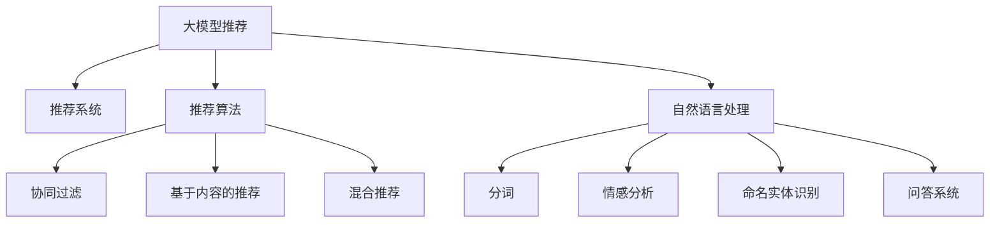

                 

# 面向不同推荐场景的大模型应用部署拆解

> 关键词：大模型推荐,推荐系统,推荐算法,深度学习,自然语言处理(NLP),推荐场景

## 1. 背景介绍

随着互联网和移动互联网的快速发展，推荐系统已成为各行各业用户获取信息和内容的重要工具。无论是电商、社交媒体、视频平台，还是新闻网站、音乐平台，都通过推荐系统向用户提供个性化的内容推荐。推荐系统不仅能够提高用户满意度和忠诚度，还能显著提升企业的运营效率和收入。

大模型技术的发展，为推荐系统的优化和创新带来了新的契机。利用预训练语言模型在自然语言处理(NLP)、图像处理、语音识别等领域的强大能力，推荐系统可以更好地理解用户兴趣、行为和偏好，从而提供更加精准、多样和个性化的推荐内容。

本文将从大模型推荐系统的背景和挑战出发，探讨不同推荐场景下大模型的应用部署策略，包括算法原理、具体操作步骤、数学模型推导、代码实践案例、实际应用场景和未来展望，为开发者和研究者提供参考。

## 2. 核心概念与联系

### 2.1 核心概念概述

为更好地理解大模型推荐系统，本节将介绍几个密切相关的核心概念：

- 大模型推荐：利用预训练语言模型在推荐场景中应用的范式，通常包括内容推荐、个性化推荐、广告推荐等。大模型能够从海量文本和数据中学习用户兴趣和行为，构建推荐模型。

- 推荐系统：通过分析用户历史行为和偏好，预测用户未来可能感兴趣的内容或商品，并为用户推荐。推荐系统包括协同过滤、基于内容的推荐、混合推荐等多种技术。

- 推荐算法：用于生成推荐结果的计算方法和技术。包括矩阵分解、模型回归、图神经网络等。

- 自然语言处理(NLP)：利用语言模型处理自然语言的技术，包括分词、词性标注、命名实体识别、情感分析、问答系统等。

- 推荐场景：不同业务场景下推荐系统的具体应用，如电商推荐、社交媒体推荐、新闻推荐等。

这些核心概念之间的逻辑关系可以通过以下Mermaid流程图来展示：



这个流程图展示了大模型推荐系统的核心概念及其之间的关系：

1. 大模型推荐通过自然语言处理技术，从文本数据中学习用户兴趣。
2. 推荐算法将学习到的兴趣与商品或内容进行匹配，生成推荐结果。
3. 协同过滤、基于内容、混合推荐等算法可以结合使用，提升推荐效果。
4. 推荐系统在电商、社交媒体、新闻等不同场景中应用，具有广泛的应用前景。

## 3. 核心算法原理 & 具体操作步骤

### 3.1 算法原理概述

大模型推荐系统的一般流程包括数据预处理、模型训练、推荐结果生成等步骤。核心算法原理为基于深度学习的推荐模型，通过从用户历史行为和兴趣中学习，预测未来行为，生成推荐结果。

假设用户序列数据为 $\{x_1,x_2,...,x_t\}$，用户的行为序列为 $\{a_1,a_2,...,a_t\}$，其中 $x_i$ 为第 $i$ 次用户行为，$a_i$ 为对应的行为标签，即用户对 $x_i$ 的评价（如点击、购买、浏览等）。基于大模型的推荐模型可以表示为：

$$
p(a_i|x_i;\theta) = \text{softmax}(W(x_i) + b)
$$

其中 $W$ 为预训练大模型的参数，$b$ 为偏置项，$\theta$ 为模型的超参数。目标是最小化负对数似然损失函数：

$$
\mathcal{L}(\theta) = -\sum_{i=1}^t a_i \log p(a_i|x_i;\theta)
$$

通过优化算法（如梯度下降、Adam等）更新模型参数 $\theta$，使得模型能够准确预测用户行为 $a_i$，从而生成推荐结果。

### 3.2 算法步骤详解

大模型推荐系统的具体操作步骤包括：

1. 数据预处理：收集用户历史行为数据，进行清洗、去重、归一化等预处理操作，形成用户-行为序列。

2. 特征提取：将用户序列数据转换为模型可用的特征表示，如使用Transformer等深度学习模型进行特征提取，生成用户兴趣向量 $v_u$。

3. 模型训练：在预处理后的数据集上，使用监督学习算法（如回归、分类等）训练推荐模型，生成模型参数 $\theta$。

4. 推荐结果生成：将用户输入行为序列 $x$ 通过模型计算，生成推荐结果 $y$，通常为多类标签形式。

5. 评估与优化：在测试集上评估模型性能，根据评估结果调整模型参数，进行迭代优化。

### 3.3 算法优缺点

大模型推荐系统具有以下优点：

1. 数据驱动：基于用户的长期行为，可以更准确地预测用户未来兴趣。

2. 处理大规模数据：能够处理海量用户行为数据，构建复杂的推荐模型。

3. 泛化能力强：预训练模型已经学习到丰富的知识，可以较好地迁移到新领域和新用户。

4. 深度学习能力强：大模型具备强大的特征表示能力，能够学习到复杂的用户兴趣和行为。

然而，大模型推荐系统也存在一些缺点：

1. 训练成本高：需要大量标注数据和强大的计算资源进行模型训练。

2. 数据隐私问题：用户行为数据涉及个人隐私，如何保护用户数据安全是一个重要挑战。

3. 模型复杂度高：大模型参数量较大，推理速度较慢。

4. 过拟合风险：模型复杂度较高，容易过拟合用户数据，影响泛化能力。

5. 依赖硬件：需要高性能计算硬件支持，如GPU、TPU等。

### 3.4 算法应用领域

大模型推荐系统在多个领域具有广泛的应用，包括但不限于：

- 电商推荐：为用户推荐商品、优惠券等，提高转化率和销售额。

- 社交媒体推荐：为用户推荐新闻、短视频、帖子等，增加用户粘性和平台活跃度。

- 视频推荐：为用户推荐电影、电视剧、综艺节目等，提高平台使用率和用户满意度。

- 新闻推荐：为用户推荐新闻、文章、专题等，增加阅读量和使用率。

- 音乐推荐：为用户推荐歌曲、歌单、专辑等，提升用户使用体验和粘性。

除了上述这些领域外，大模型推荐系统还在广告推荐、招聘推荐、旅游推荐等诸多场景中得到应用，极大地提升了各个行业的服务质量。

## 4. 数学模型和公式 & 详细讲解 & 举例说明

### 4.1 数学模型构建

本节将使用数学语言对大模型推荐系统的模型构建过程进行更加严格的刻画。

假设用户序列数据为 $\{x_1,x_2,...,x_t\}$，用户的行为序列为 $\{a_1,a_2,...,a_t\}$，其中 $x_i$ 为第 $i$ 次用户行为，$a_i$ 为对应的行为标签。设大模型为 $M$，输出为 $y_i$。

目标是最小化负对数似然损失函数：

$$
\mathcal{L}(M) = -\sum_{i=1}^t a_i \log p(a_i|x_i;M)
$$

其中 $p(a_i|x_i;M)$ 为模型在输入 $x_i$ 下的预测概率。

### 4.2 公式推导过程

以下我们以基于Transformer的大模型推荐系统为例，推导其模型构建和训练过程。

设用户序列数据为 $X=[x_1,x_2,...,x_t]$，其中 $x_i \in \mathcal{X}$，$\mathcal{X}$ 为用户行为向量空间。设行为序列为 $A=[a_1,a_2,...,a_t]$，其中 $a_i \in \{0,1\}$。

使用Transformer编码用户行为序列 $X$，生成用户兴趣向量 $v_u$。模型预测用户行为 $a_i$ 的概率为：

$$
p(a_i|x_i;M) = \text{softmax}(W^{(a)}(v_u \odot W^{(x)}(x_i))
$$

其中 $W^{(a)}$ 和 $W^{(x)}$ 分别为模型的行为表示和用户表示权重矩阵，$\odot$ 表示逐元素乘积。

目标是最小化负对数似然损失函数：

$$
\mathcal{L}(M) = -\sum_{i=1}^t a_i \log p(a_i|x_i;M)
$$

通过反向传播算法更新模型参数 $W^{(a)}$ 和 $W^{(x)}$。

### 4.3 案例分析与讲解

我们以电商平台推荐系统为例，解释大模型的推荐过程。

假设用户 $u$ 购买了商品 $x_1$，浏览了商品 $x_2$，点击了商品 $x_3$，则用户行为序列为 $[a_1,0,1]$。将行为序列输入Transformer模型，得到用户兴趣向量 $v_u$。模型预测用户点击商品 $x_4$ 的概率为：

$$
p(1|x_4;M) = \text{softmax}(W^{(a)}(v_u \odot W^{(x)}(x_4))
$$

通过反向传播算法更新模型参数，优化推荐结果。最终，平台可以根据用户的历史行为和兴趣，为用户推荐相关商品。

## 5. 项目实践：代码实例和详细解释说明

### 5.1 开发环境搭建

在进行大模型推荐系统的开发前，我们需要准备好开发环境。以下是使用Python进行PyTorch开发的环境配置流程：

1. 安装Anaconda：从官网下载并安装Anaconda，用于创建独立的Python环境。

2. 创建并激活虚拟环境：
```bash
conda create -n pytorch-env python=3.8 
conda activate pytorch-env
```

3. 安装PyTorch：根据CUDA版本，从官网获取对应的安装命令。例如：
```bash
conda install pytorch torchvision torchaudio cudatoolkit=11.1 -c pytorch -c conda-forge
```

4. 安装TensorFlow：
```bash
conda install tensorflow -c conda-forge
```

5. 安装Transformers库：
```bash
pip install transformers
```

6. 安装各类工具包：
```bash
pip install numpy pandas scikit-learn matplotlib tqdm jupyter notebook ipython
```

完成上述步骤后，即可在`pytorch-env`环境中开始推荐系统开发。

### 5.2 源代码详细实现

下面我们以电商推荐系统为例，给出使用Transformers库进行大模型推荐系统的PyTorch代码实现。

首先，定义推荐系统数据处理函数：

```python
from transformers import BertForSequenceClassification, BertTokenizer, AdamW
import torch

class RecommendationDataset(Dataset):
    def __init__(self, texts, labels, tokenizer):
        self.texts = texts
        self.labels = labels
        self.tokenizer = tokenizer
        self.max_len = 256
        
    def __len__(self):
        return len(self.texts)
    
    def __getitem__(self, item):
        text = self.texts[item]
        label = self.labels[item]
        
        encoding = self.tokenizer(text, return_tensors='pt', max_length=self.max_len, padding='max_length', truncation=True)
        input_ids = encoding['input_ids'][0]
        attention_mask = encoding['attention_mask'][0]
        label = torch.tensor(label, dtype=torch.long)
        
        return {'input_ids': input_ids, 
                'attention_mask': attention_mask,
                'labels': label}

# 数据集和标签
train_dataset = RecommendationDataset(train_texts, train_labels, tokenizer)
dev_dataset = RecommendationDataset(dev_texts, dev_labels, tokenizer)
test_dataset = RecommendationDataset(test_texts, test_labels, tokenizer)
```

然后，定义模型和优化器：

```python
model = BertForSequenceClassification.from_pretrained('bert-base-uncased', num_labels=1, output_attentions=False, output_hidden_states=False)

optimizer = AdamW(model.parameters(), lr=2e-5)
```

接着，定义训练和评估函数：

```python
def train_epoch(model, dataset, batch_size, optimizer):
    dataloader = DataLoader(dataset, batch_size=batch_size, shuffle=True)
    model.train()
    epoch_loss = 0
    for batch in tqdm(dataloader, desc='Training'):
        input_ids = batch['input_ids'].to(device)
        attention_mask = batch['attention_mask'].to(device)
        labels = batch['labels'].to(device)
        model.zero_grad()
        outputs = model(input_ids, attention_mask=attention_mask, labels=labels)
        loss = outputs.loss
        epoch_loss += loss.item()
        loss.backward()
        optimizer.step()
    return epoch_loss / len(dataloader)

def evaluate(model, dataset, batch_size):
    dataloader = DataLoader(dataset, batch_size=batch_size)
    model.eval()
    preds, labels = [], []
    with torch.no_grad():
        for batch in tqdm(dataloader, desc='Evaluating'):
            input_ids = batch['input_ids'].to(device)
            attention_mask = batch['attention_mask'].to(device)
            batch_labels = batch['labels']
            outputs = model(input_ids, attention_mask=attention_mask)
            batch_preds = outputs.logits.argmax(dim=2).to('cpu').tolist()
            batch_labels = batch_labels.to('cpu').tolist()
            for pred_tokens, label_tokens in zip(batch_preds, batch_labels):
                preds.append(pred_tokens[:len(label_tokens)])
                labels.append(label_tokens)
                
    return preds, labels

# 训练和评估
device = torch.device('cuda') if torch.cuda.is_available() else torch.device('cpu')
model.to(device)

epochs = 5
batch_size = 16

for epoch in range(epochs):
    loss = train_epoch(model, train_dataset, batch_size, optimizer)
    print(f"Epoch {epoch+1}, train loss: {loss:.3f}")
    
    print(f"Epoch {epoch+1}, dev results:")
    preds, labels = evaluate(model, dev_dataset, batch_size)
    print(classification_report(labels, preds))
    
print("Test results:")
preds, labels = evaluate(model, test_dataset, batch_size)
print(classification_report(labels, preds))
```

以上就是使用PyTorch对Bert模型进行电商推荐系统开发的全流程代码实现。

### 5.3 代码解读与分析

让我们再详细解读一下关键代码的实现细节：

**RecommendationDataset类**：
- `__init__`方法：初始化训练集、验证集和测试集的文本、标签、分词器等组件。
- `__len__`方法：返回数据集的样本数量。
- `__getitem__`方法：对单个样本进行处理，将文本输入编码为token ids，将标签转换为模型可用的形式。

**BertForSequenceClassification模型**：
- 使用Bert模型进行推荐任务，将输入文本映射为用户兴趣向量。
- 在输出层添加一个线性分类器，用于预测用户点击行为。
- 输出层的损失函数为交叉熵损失。

**训练和评估函数**：
- 使用PyTorch的DataLoader对数据集进行批次化加载，供模型训练和推理使用。
- 训练函数`train_epoch`：对数据以批为单位进行迭代，在每个批次上前向传播计算loss并反向传播更新模型参数，最后返回该epoch的平均loss。
- 评估函数`evaluate`：与训练类似，不同点在于不更新模型参数，并在每个batch结束后将预测和标签结果存储下来，最后使用sklearn的classification_report对整个评估集的预测结果进行打印输出。

**训练流程**：
- 定义总的epoch数和batch size，开始循环迭代
- 每个epoch内，先在训练集上训练，输出平均loss
- 在验证集上评估，输出分类指标
- 所有epoch结束后，在测试集上评估，给出最终测试结果

可以看到，PyTorch配合Transformers库使得Bert模型的推荐系统代码实现变得简洁高效。开发者可以将更多精力放在数据处理、模型改进等高层逻辑上，而不必过多关注底层的实现细节。

当然，工业级的系统实现还需考虑更多因素，如模型的保存和部署、超参数的自动搜索、更灵活的任务适配层等。但核心的推荐范式基本与此类似。

## 6. 实际应用场景

### 6.1 电商推荐系统

电商推荐系统是大模型推荐应用的典型场景。电商平台通过收集用户浏览、点击、购买等行为数据，构建用户画像，学习用户的兴趣偏好，生成个性化推荐结果。通过大模型推荐系统，电商平台能够大幅提升转化率和销售额，增加用户粘性和满意度。

在技术实现上，可以收集用户的历史浏览数据，将浏览记录作为推荐任务的数据输入。在预训练的Bert模型上微调，学习用户兴趣向量，构建推荐模型。微调后的模型能够根据用户浏览历史生成商品推荐结果，实现实时个性化推荐。

### 6.2 社交媒体推荐系统

社交媒体推荐系统通过分析用户的点赞、评论、分享等行为，为用户推荐新闻、短视频、帖子等内容。通过大模型推荐系统，社交媒体平台能够提升用户粘性和平台活跃度，增加广告投放的精准度。

在技术实现上，可以收集用户的社交行为数据，将点赞、评论、分享等行为作为推荐任务的数据输入。在预训练的Bert模型上微调，学习用户兴趣向量，构建推荐模型。微调后的模型能够根据用户社交行为生成内容推荐结果，实现实时个性化推荐。

### 6.3 视频推荐系统

视频推荐系统通过分析用户的观看历史、点赞、评论等行为，为用户推荐电影、电视剧、综艺节目等视频内容。通过大模型推荐系统，视频平台能够提升用户使用体验和满意度，增加广告投放的精准度。

在技术实现上，可以收集用户的视频观看数据，将观看记录作为推荐任务的数据输入。在预训练的Bert模型上微调，学习用户兴趣向量，构建推荐模型。微调后的模型能够根据用户观看历史生成视频推荐结果，实现实时个性化推荐。

### 6.4 新闻推荐系统

新闻推荐系统通过分析用户的阅读历史、点击、评论等行为，为用户推荐新闻、文章、专题等内容。通过大模型推荐系统，新闻平台能够提升用户阅读量和使用率，增加广告投放的精准度。

在技术实现上，可以收集用户的阅读历史数据，将阅读记录作为推荐任务的数据输入。在预训练的Bert模型上微调，学习用户兴趣向量，构建推荐模型。微调后的模型能够根据用户阅读历史生成新闻推荐结果，实现实时个性化推荐。

## 7. 工具和资源推荐

### 7.1 学习资源推荐

为了帮助开发者系统掌握大模型推荐系统的理论基础和实践技巧，这里推荐一些优质的学习资源：

1. 《深度学习理论与实践》系列博文：由大模型技术专家撰写，深入浅出地介绍了深度学习理论、推荐系统基础、大模型应用等前沿话题。

2. CS224W《深度学习与自然语言处理》课程：斯坦福大学开设的深度学习在自然语言处理中的高级课程，包括推荐系统、生成模型等。

3. 《Deep Learning for Recommendation Systems》书籍：详细介绍了深度学习在推荐系统中的应用，包括协同过滤、内容推荐、混合推荐等。

4. HuggingFace官方文档：包含众多预训练语言模型的推荐应用示例，适合上手实践。

5. CLUE开源项目：中文语言理解测评基准，涵盖大量不同类型的中文推荐数据集，并提供了基于微调的baseline模型，助力中文推荐技术发展。

通过对这些资源的学习实践，相信你一定能够快速掌握大模型推荐系统的精髓，并用于解决实际的推荐问题。

### 7.2 开发工具推荐

高效的开发离不开优秀的工具支持。以下是几款用于大模型推荐系统开发的常用工具：

1. PyTorch：基于Python的开源深度学习框架，灵活动态的计算图，适合快速迭代研究。

2. TensorFlow：由Google主导开发的开源深度学习框架，生产部署方便，适合大规模工程应用。

3. Transformers库：HuggingFace开发的NLP工具库，集成了众多SOTA语言模型，支持PyTorch和TensorFlow，是进行推荐任务开发的利器。

4. Weights & Biases：模型训练的实验跟踪工具，可以记录和可视化模型训练过程中的各项指标，方便对比和调优。

5. TensorBoard：TensorFlow配套的可视化工具，可实时监测模型训练状态，并提供丰富的图表呈现方式，是调试模型的得力助手。

6. Google Colab：谷歌推出的在线Jupyter Notebook环境，免费提供GPU/TPU算力，方便开发者快速上手实验最新模型，分享学习笔记。

合理利用这些工具，可以显著提升大模型推荐系统的开发效率，加快创新迭代的步伐。

### 7.3 相关论文推荐

大模型推荐技术的发展源于学界的持续研究。以下是几篇奠基性的相关论文，推荐阅读：

1. Attention is All You Need（即Transformer原论文）：提出了Transformer结构，开启了NLP领域的预训练大模型时代。

2. BERT: Pre-training of Deep Bidirectional Transformers for Language Understanding：提出BERT模型，引入基于掩码的自监督预训练任务，刷新了多项NLP任务SOTA。

3. Deep Coherent Recommendation with Multi-Aspect Dependency Embeddings：提出多维依赖嵌入推荐模型，在KDD Cup推荐竞赛中获得第一名。

4. Transformer for Click-Through Rate Prediction in Recommendation Systems：提出Transformer模型在点击率预测任务中的应用，取得了SOTA的效果。

5. Decoupled Attention Model for Multi-Aspect Recommendation：提出解耦注意力模型，提高了推荐系统的准确率和多样性。

这些论文代表了大模型推荐技术的发展脉络。通过学习这些前沿成果，可以帮助研究者把握学科前进方向，激发更多的创新灵感。

## 8. 总结：未来发展趋势与挑战

### 8.1 总结

本文对大模型推荐系统进行了全面系统的介绍。首先阐述了大模型推荐系统的背景和挑战，明确了推荐系统在大模型时代下的新机遇。其次，从原理到实践，详细讲解了大模型推荐系统的算法原理和操作步骤，给出了推荐任务开发的完整代码实例。同时，本文还广泛探讨了推荐系统在电商、社交媒体、视频、新闻等不同领域的应用场景，展示了大模型推荐系统的广阔前景。最后，本文精选了推荐系统的学习资源、开发工具和相关论文，力求为开发者和研究者提供全方位的技术指引。

通过本文的系统梳理，可以看到，大模型推荐系统正在成为推荐系统的重要范式，极大地拓展了推荐系统的应用边界，提升了推荐效果。随着大模型和推荐技术的不断发展，推荐系统必将在更广阔的应用领域大放异彩，为各行各业带来革命性变化。

### 8.2 未来发展趋势

展望未来，大模型推荐系统将呈现以下几个发展趋势：

1. 模型规模持续增大。随着算力成本的下降和数据规模的扩张，预训练语言模型的参数量还将持续增长。超大规模语言模型蕴含的丰富语言知识，有望支撑更加复杂多变的推荐场景。

2. 推荐算法日趋多样。除了传统的协同过滤、基于内容的推荐外，未来会涌现更多高效、鲁棒的推荐算法，如图神经网络、深度强化学习等。

3. 数据隐私保护加强。推荐系统处理大量用户数据，数据隐私问题日益受到关注。未来的推荐系统将更加注重数据隐私保护，通过差分隐私、联邦学习等技术，保障用户数据安全。

4. 个性化推荐更精准。大模型推荐系统能够从海量文本数据中学习用户兴趣，提升推荐精准度。未来将通过上下文理解、情感分析等技术，进一步提升推荐效果。

5. 推荐系统智能化增强。结合知识图谱、逻辑推理等技术，大模型推荐系统将具备更强的逻辑推理和知识整合能力，提升推荐系统的智能化水平。

以上趋势凸显了大模型推荐系统的广阔前景。这些方向的探索发展，必将进一步提升推荐系统的性能和应用范围，为各行各业带来更优质的服务体验。

### 8.3 面临的挑战

尽管大模型推荐系统已经取得了瞩目成就，但在迈向更加智能化、普适化应用的过程中，它仍面临着诸多挑战：

1. 训练成本高。需要大量标注数据和强大的计算资源进行模型训练。如何降低训练成本，是未来需要解决的重要问题。

2. 数据隐私问题。用户行为数据涉及个人隐私，如何保护用户数据安全，防止数据滥用，是一个重要挑战。

3. 模型鲁棒性不足。模型面对噪声、异常等数据时，泛化性能往往大打折扣。如何提高模型的鲁棒性，增强其抗干扰能力，是未来需要解决的重要问题。

4. 推荐系统冷启动问题。对于新用户或新商品，推荐系统往往难以找到足够的历史行为数据，如何解决冷启动问题，是未来需要解决的重要问题。

5. 系统复杂度高。大模型推荐系统涉及复杂的模型构建、训练和优化，如何降低系统复杂度，提高部署效率，是未来需要解决的重要问题。

6. 资源消耗大。大模型推荐系统涉及大量数据存储和计算资源消耗，如何优化资源使用，提升系统效率，是未来需要解决的重要问题。

### 8.4 研究展望

面对大模型推荐系统所面临的种种挑战，未来的研究需要在以下几个方面寻求新的突破：

1. 探索无监督和半监督推荐方法。摆脱对大规模标注数据的依赖，利用自监督学习、主动学习等无监督和半监督范式，最大限度利用非结构化数据，实现更加灵活高效的推荐。

2. 研究参数高效和计算高效的推荐算法。开发更加参数高效的推荐方法，在固定大部分预训练参数的同时，只更新极少量的任务相关参数。同时优化推荐模型的计算图，减少前向传播和反向传播的资源消耗，实现更加轻量级、实时性的部署。

3. 融合因果和对比学习范式。通过引入因果推断和对比学习思想，增强推荐系统建立稳定因果关系的能力，学习更加普适、鲁棒的用户兴趣和行为。

4. 引入更多先验知识。将符号化的先验知识，如知识图谱、逻辑规则等，与神经网络模型进行巧妙融合，引导推荐过程学习更准确、合理的用户兴趣和行为。

5. 结合因果分析和博弈论工具。将因果分析方法引入推荐模型，识别出推荐决策的关键特征，增强推荐结果的因果性和逻辑性。借助博弈论工具刻画人机交互过程，主动探索并规避推荐系统的脆弱点，提高系统稳定性。

6. 纳入伦理道德约束。在推荐系统的训练目标中引入伦理导向的评估指标，过滤和惩罚有偏见、有害的推荐结果，确保推荐系统的公平性和可解释性。

这些研究方向的探索，必将引领大模型推荐系统迈向更高的台阶，为构建安全、可靠、可解释、可控的智能推荐系统铺平道路。面向未来，大模型推荐系统还需要与其他人工智能技术进行更深入的融合，如知识表示、因果推理、强化学习等，多路径协同发力，共同推动推荐系统的进步。只有勇于创新、敢于突破，才能不断拓展推荐系统的边界，让智能推荐技术更好地造福人类社会。

## 9. 附录：常见问题与解答

**Q1：大模型推荐是否适用于所有推荐场景？**

A: 大模型推荐在大多数推荐场景上都能取得不错的效果，特别是对于数据量较大的推荐任务。但对于一些特定领域的推荐场景，如医疗、教育等，仍然需要进一步优化和调整。

**Q2：如何选择合适的学习率？**

A: 推荐系统的学习率一般要比预训练时小1-2个数量级，如果使用过大的学习率，容易破坏预训练权重，导致过拟合。一般建议从1e-5开始调参，逐步减小学习率，直至收敛。

**Q3：大模型推荐系统面临哪些资源瓶颈？**

A: 大模型推荐系统涉及大量数据存储和计算资源消耗，需要高性能计算硬件支持，如GPU、TPU等。同时，模型的推理速度较慢，需要优化资源使用，提高系统效率。

**Q4：推荐系统在冷启动问题上如何处理？**

A: 对于新用户或新商品，推荐系统往往难以找到足够的历史行为数据。常见的处理方式包括：
1. 利用上下文信息，通过文本分类、情感分析等技术，学习用户兴趣和行为。
2. 利用协同过滤，根据用户相似度推荐相似用户的行为数据。
3. 利用推荐模型预估推荐结果，再结合用户交互数据进行优化。

**Q5：推荐系统的冷启动问题如何处理？**

A: 对于新用户或新商品，推荐系统往往难以找到足够的历史行为数据。常见的处理方式包括：
1. 利用上下文信息，通过文本分类、情感分析等技术，学习用户兴趣和行为。
2. 利用协同过滤，根据用户相似度推荐相似用户的行为数据。
3. 利用推荐模型预估推荐结果，再结合用户交互数据进行优化。

这些技术手段能够在一定程度上缓解推荐系统的冷启动问题，提高推荐效果。

---

作者：禅与计算机程序设计艺术 / Zen and the Art of Computer Programming

