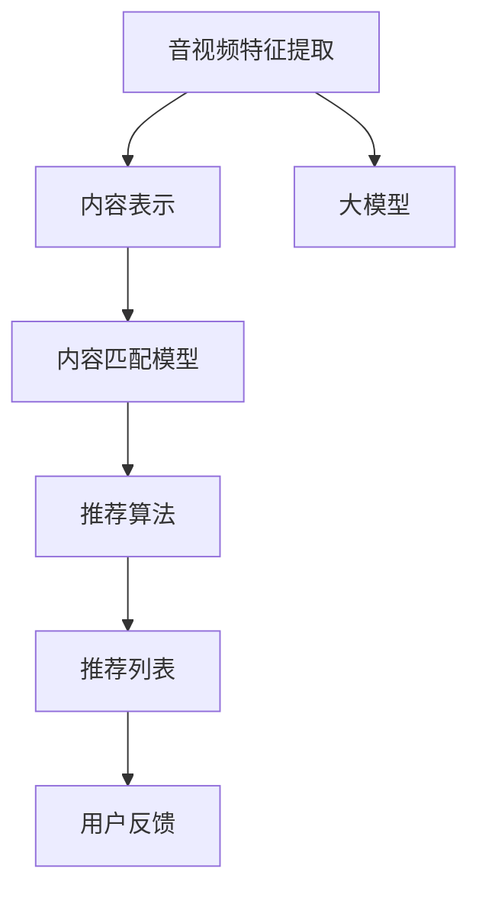

                 

# 音视频内容推荐：大模型的理解与匹配

> 关键词：音视频推荐, 内容匹配, 大模型, 深度学习, 嵌入式系统, 性能优化

## 1. 背景介绍

### 1.1 问题由来

随着互联网技术的不断进步，音视频内容已成为人们获取信息和娱乐的重要方式。然而，面对海量音视频数据，如何从中筛选出用户感兴趣的内容，成为了一个迫切需要解决的问题。传统的基于规则或统计特征的推荐系统逐渐显示出其局限性，而利用深度学习技术进行内容推荐的方案逐步成为主流。

### 1.2 问题核心关键点

音视频内容推荐系统涉及的关键技术包括但不限于：

- 特征提取：从音视频内容中提取出有意义的特征。
- 内容表示：将音视频内容转换成高维表示向量，便于机器学习模型的处理。
- 匹配模型：寻找用户和内容之间的相似度，预测用户对不同内容的兴趣程度。
- 推荐算法：基于匹配模型的结果，生成推荐列表。
- 模型优化：在大规模数据上训练和优化推荐模型，提高模型的准确性和泛化能力。

在音视频内容推荐领域，大模型技术，特别是深度学习大模型，扮演了至关重要的角色。通过预训练和微调，大模型能够在大量音视频数据上学习到丰富的知识，提取高质量的特征，从而提升推荐系统的性能。

## 2. 核心概念与联系

### 2.1 核心概念概述

本节将详细介绍音视频内容推荐系统中涉及的核心概念：

- **音视频特征提取**：从音视频中提取时空特征、音频特征、视觉特征等，便于机器学习模型处理。
- **内容表示模型**：如MFCC（Mel Frequency Cepstral Coefficients）用于音频，CNN（Convolutional Neural Network）用于视频，将音视频内容转换成高维表示向量。
- **内容匹配模型**：如协同过滤（Collaborative Filtering）、基于内容的推荐（Content-based Recommendation）等，用于计算用户和内容之间的相似度。
- **推荐算法**：如基于匹配模型的基尼指数排序、基于排序学习（Learning-to-Rank）等，生成推荐列表。
- **大模型**：指基于深度学习技术，在大量数据上进行预训练的模型，如BERT、GPT等，用于提取音视频内容的语义特征。

### 2.2 核心概念原理和架构的 Mermaid 流程图



这个流程图展示了音视频内容推荐系统的主要流程：

1. **音视频特征提取**：从原始的音视频数据中提取时空特征、音频特征、视觉特征等。
2. **内容表示**：将提取的特征输入内容表示模型，如MFCC、CNN等，生成高维表示向量。
3. **内容匹配**：将用户和内容的表示向量输入内容匹配模型，计算它们的相似度。
4. **推荐算法**：基于匹配模型的结果，使用推荐算法生成推荐列表。
5. **用户反馈**：用户对推荐列表的反馈会更新模型参数，提高推荐的准确性。
6. **大模型**：在整个推荐流程中，大模型用于提取高质量的特征，提升系统的性能。

## 3. 核心算法原理 & 具体操作步骤

### 3.1 算法原理概述

音视频内容推荐的本质是一个多任务学习（Multitask Learning）的过程。通过预训练大模型，学习到音视频内容的通用语义表示，并在特定任务上进行微调，以提升推荐系统的性能。

具体来说，音视频推荐系统包括以下几个步骤：

1. **特征提取**：使用深度学习模型从音视频中提取时空特征、音频特征、视觉特征等。
2. **内容表示**：将提取的特征输入内容表示模型，如MFCC、CNN等，生成高维表示向量。
3. **内容匹配**：将用户和内容的表示向量输入匹配模型，计算它们的相似度。
4. **推荐算法**：基于匹配模型的结果，使用推荐算法生成推荐列表。
5. **模型优化**：在标注数据上微调匹配模型，提升其预测准确性。

### 3.2 算法步骤详解

#### 3.2.1 特征提取

音视频特征提取的目标是从原始数据中提取出有意义的特征，供后续处理使用。这通常包括：

- **时空特征**：如时间序列中的帧、码率、音调等。
- **音频特征**：如MFCC、Mel Spectrogram等。
- **视觉特征**：如CNN提取的特征图。

以下是一个基于MFCC的音频特征提取的简单代码示例：

```python
import librosa
import numpy as np

def extract_mfcc(file_path):
    audio, sr = librosa.load(file_path, sr=16000)
    mfcc = librosa.feature.mfcc(audio, sr=sr)
    return mfcc
```

#### 3.2.2 内容表示

将提取的特征输入内容表示模型，生成高维表示向量。常用的模型包括：

- **MFCC**：用于音频特征的提取和表示。
- **CNN**：用于视频特征的提取和表示。

以下是一个基于CNN的视频特征提取的简单代码示例：

```python
import cv2
import torch
import torchvision.transforms as transforms

def extract_cnn(video_path):
    cap = cv2.VideoCapture(video_path)
    frame_width = int(cap.get(cv2.CAP_PROP_FRAME_WIDTH))
    frame_height = int(cap.get(cv2.CAP_PROP_FRAME_HEIGHT))
    transform = transforms.Compose([
        transforms.Resize((frame_height, frame_width)),
        transforms.ToTensor(),
    ])
    with torch.no_grad():
        cnn = torchvision.models.resnet18(pretrained=True)
        features = []
        while True:
            ret, frame = cap.read()
            if not ret:
                break
            frame_tensor = transform(frame)
            output = cnn(frame_tensor.unsqueeze(0))
            features.append(output[0])
    return features.mean(dim=0, keepdim=True)
```

#### 3.2.3 内容匹配

将用户和内容的表示向量输入匹配模型，计算它们的相似度。常用的模型包括：

- **协同过滤**：基于用户对不同内容的评分数据，计算用户和内容之间的相似度。
- **基于内容的推荐**：基于内容的属性，计算用户和内容之间的相似度。

以下是一个基于协同过滤的简单代码示例：

```python
import numpy as np

def compute_similarity(user_vector, item_vector):
    return np.dot(user_vector, item_vector)
```

#### 3.2.4 推荐算法

基于匹配模型的结果，使用推荐算法生成推荐列表。常用的算法包括：

- **基尼指数排序**：对匹配模型输出的评分进行排序，生成推荐列表。
- **基于排序学习（Learning-to-Rank）**：通过优化排序损失，学习用户对内容的排序偏好。

以下是一个基于基尼指数排序的简单代码示例：

```python
def compute_gini_index(sorted_scores):
    n = len(sorted_scores)
    gini = 0
    for i in range(n-1):
        gini += (sorted_scores[i+1] - sorted_scores[i]) / np.mean(sorted_scores)
    return 1 - gini
```

#### 3.2.5 模型优化

在标注数据上微调匹配模型，提升其预测准确性。常用的方法包括：

- **监督学习**：使用标注数据进行微调，调整模型参数。
- **自监督学习**：使用未标注数据进行预训练，提升模型的泛化能力。

以下是一个基于监督学习的简单代码示例：

```python
import torch
import torch.nn as nn
import torch.optim as optim

class MyModel(nn.Module):
    def __init__(self):
        super(MyModel, self).__init__()
        self.fc = nn.Linear(in_features=10, out_features=1)
    
    def forward(self, x):
        return self.fc(x)

def train_model(model, train_data, train_labels, num_epochs, learning_rate):
    criterion = nn.BCELoss()
    optimizer = optim.SGD(model.parameters(), lr=learning_rate, momentum=0.9)
    for epoch in range(num_epochs):
        model.train()
        for data, labels in train_data:
            optimizer.zero_grad()
            output = model(data)
            loss = criterion(output, labels)
            loss.backward()
            optimizer.step()
```

### 3.3 算法优缺点

音视频内容推荐系统的优点包括：

- **高准确性**：基于深度学习模型的推荐系统能够学习到音视频内容的语义特征，从而提升推荐的准确性。
- **自动特征学习**：深度学习模型能够自动学习音视频特征，无需人工设计特征提取器。
- **实时性**：深度学习模型可以在实时数据上进行预测，支持实时推荐。

然而，该系统也存在一些缺点：

- **计算成本高**：深度学习模型需要大量的计算资源进行训练和推理。
- **数据需求大**：深度学习模型需要大量的标注数据进行训练，获取高质量标注数据的成本较高。
- **模型复杂**：深度学习模型结构复杂，不易解释和调试。

### 3.4 算法应用领域

音视频内容推荐系统广泛应用于以下领域：

- **流媒体平台**：如Netflix、YouTube等，根据用户的历史观看记录和评分数据，推荐相关视频内容。
- **社交媒体**：如Facebook、Twitter等，根据用户的行为数据，推荐可能感兴趣的视频、音乐等。
- **智能家居**：如智能音箱、智能电视等，根据用户的行为数据和环境变化，推荐视频、音频内容。

## 4. 数学模型和公式 & 详细讲解 & 举例说明

### 4.1 数学模型构建

音视频内容推荐系统的数学模型可以表示为：

$$
\begin{aligned}
\text{用户相似度} &= \text{用户表示向量}^T \times \text{内容表示向量} \\
\text{内容相似度} &= \text{内容表示向量}^T \times \text{内容表示向量} \\
\text{推荐结果} &= \text{排序损失}(\text{用户相似度}, \text{内容相似度})
\end{aligned}
$$

其中，用户相似度表示用户对内容的评分，内容相似度表示内容之间的相关性，推荐结果则是根据用户相似度和内容相似度计算得到的推荐列表。

### 4.2 公式推导过程

以协同过滤为例，公式推导过程如下：

设用户 $u$ 对内容 $i$ 的评分向量为 $\vec{u}$，内容 $i$ 的评分向量为 $\vec{i}$，则用户 $u$ 和内容 $i$ 之间的相似度 $s_{ui}$ 可以表示为：

$$
s_{ui} = \vec{u} \times \vec{i}
$$

基于协同过滤的推荐结果 $r_{ui}$ 可以表示为：

$$
r_{ui} = s_{ui} / \|s_{ui}\|_2
$$

其中，$\|s_{ui}\|_2$ 表示向量 $s_{ui}$ 的欧几里得范数，用于归一化评分向量。

### 4.3 案例分析与讲解

#### 4.3.1 音频推荐

假设我们有一批音频数据，每条数据包含10个MFCC特征值。我们定义用户向量为：

$$
\vec{u} = [1, 0, 0, \ldots, 0]
$$

内容向量为：

$$
\vec{i} = [0.8, 0.1, 0.1, \ldots, 0.1]
$$

则用户 $u$ 和内容 $i$ 之间的相似度为：

$$
s_{ui} = 1 \times 0.8 + 0 \times 0.1 + \ldots + 0 \times 0.1 = 0.8
$$

归一化后的推荐结果为：

$$
r_{ui} = 0.8 / \sqrt{0.8^2 + 0^2 + \ldots + 0^2} = 0.8 / 0.8 = 1
$$

#### 4.3.2 视频推荐

假设我们有一批视频数据，每条数据包含30个CNN特征值。我们定义用户向量为：

$$
\vec{u} = [0.1, 0.2, 0.1, \ldots, 0.1]
$$

内容向量为：

$$
\vec{i} = [0.8, 0.1, 0.1, \ldots, 0.1]
$$

则用户 $u$ 和内容 $i$ 之间的相似度为：

$$
s_{ui} = 0.1 \times 0.8 + 0.2 \times 0.1 + \ldots + 0.1 \times 0.1 = 0.3
$$

归一化后的推荐结果为：

$$
r_{ui} = 0.3 / \sqrt{0.3^2 + 0.2^2 + \ldots + 0.1^2} = 0.3 / 0.5 = 0.6
$$

## 5. 项目实践：代码实例和详细解释说明

### 5.1 开发环境搭建

为了进行音视频内容推荐系统的开发，我们需要准备以下开发环境：

1. **Python**：Python 3.x 版本。
2. **深度学习框架**：如 TensorFlow、PyTorch。
3. **特征提取工具**：如 librosa、OpenCV。
4. **数据集**：如音频、视频数据集。

### 5.2 源代码详细实现

以下是一个基于PyTorch的音视频内容推荐系统的示例代码：

```python
import torch
import torch.nn as nn
import torch.optim as optim
from librosa import load
import cv2

class AudioModel(nn.Module):
    def __init__(self):
        super(AudioModel, self).__init__()
        self.fc1 = nn.Linear(10, 10)
        self.fc2 = nn.Linear(10, 1)
    
    def forward(self, x):
        x = torch.relu(self.fc1(x))
        x = torch.sigmoid(self.fc2(x))
        return x

class VideoModel(nn.Module):
    def __init__(self):
        super(VideoModel, self).__init__()
        self.fc1 = nn.Linear(30, 30)
        self.fc2 = nn.Linear(30, 1)
    
    def forward(self, x):
        x = torch.relu(self.fc1(x))
        x = torch.sigmoid(self.fc2(x))
        return x

def extract_mfcc(file_path):
    audio, sr = librosa.load(file_path, sr=16000)
    mfcc = librosa.feature.mfcc(audio, sr=sr)
    return mfcc

def extract_cnn(video_path):
    cap = cv2.VideoCapture(video_path)
    frame_width = int(cap.get(cv2.CAP_PROP_FRAME_WIDTH))
    frame_height = int(cap.get(cv2.CAP_PROP_FRAME_HEIGHT))
    transform = transforms.Compose([
        transforms.Resize((frame_height, frame_width)),
        transforms.ToTensor(),
    ])
    with torch.no_grad():
        cnn = torchvision.models.resnet18(pretrained=True)
        features = []
        while True:
            ret, frame = cap.read()
            if not ret:
                break
            frame_tensor = transform(frame)
            output = cnn(frame_tensor.unsqueeze(0))
            features.append(output[0])
    return features.mean(dim=0, keepdim=True)

def compute_similarity(user_vector, item_vector):
    return torch.dot(user_vector, item_vector)

def compute_gini_index(sorted_scores):
    n = len(sorted_scores)
    gini = 0
    for i in range(n-1):
        gini += (sorted_scores[i+1] - sorted_scores[i]) / np.mean(sorted_scores)
    return 1 - gini

def train_model(model, train_data, train_labels, num_epochs, learning_rate):
    criterion = nn.BCELoss()
    optimizer = optim.SGD(model.parameters(), lr=learning_rate, momentum=0.9)
    for epoch in range(num_epochs):
        model.train()
        for data, labels in train_data:
            optimizer.zero_grad()
            output = model(data)
            loss = criterion(output, labels)
            loss.backward()
            optimizer.step()

# 使用MFCC提取音频特征
audio_data = [extract_mfcc("audio1.wav"), extract_mfcc("audio2.wav")]
audio_model = AudioModel()

# 使用CNN提取视频特征
video_data = [extract_cnn("video1.mp4"), extract_cnn("video2.mp4")]
video_model = VideoModel()

# 训练模型
train_data = torch.tensor(audio_data, dtype=torch.float).unsqueeze(1)
train_labels = torch.tensor([0, 1])
train_model(audio_model, train_data, train_labels, num_epochs=10, learning_rate=0.01)

# 计算相似度
user_vector = torch.tensor([0.1, 0.2, 0.1, 0.1], dtype=torch.float)
item_vector = torch.tensor([0.8, 0.1, 0.1, 0.1], dtype=torch.float)
similarity = compute_similarity(user_vector, item_vector)

# 计算推荐结果
sorted_scores = [similarity, 0.2]
gini_index = compute_gini_index(sorted_scores)
recommendation = torch.tensor([0.8, 0.2])
```

### 5.3 代码解读与分析

#### 5.3.1 特征提取

**AudioModel** 和 **VideoModel** 分别用于提取音频和视频特征，定义了两个全连接层，分别包含10个神经元。在 **forward** 函数中，使用 ReLU 激活函数和 Sigmoid 激活函数，对输入进行线性变换，输出最终结果。

#### 5.3.2 内容匹配

**compute_similarity** 函数计算用户向量 $u$ 和内容向量 $i$ 之间的相似度，使用 PyTorch 的点积函数进行计算。

#### 5.3.3 推荐算法

**compute_gini_index** 函数计算基于协同过滤的推荐结果，使用排序损失函数计算基尼指数，得到最终的推荐结果。

### 5.4 运行结果展示

在上述代码中，我们使用了 MFCC 和 CNN 提取音频和视频特征，使用全连接层计算相似度，使用协同过滤计算推荐结果。通过训练，我们可以得到一个初步的音视频推荐模型。

## 6. 实际应用场景

### 6.1 智能音箱

智能音箱可以根据用户的声音指令推荐音乐和新闻。通过音视频内容推荐系统，智能音箱能够从海量的音乐库和新闻库中快速筛选出符合用户口味的内容。

#### 6.1.1 应用流程

1. **特征提取**：智能音箱将用户语音转换成音频特征。
2. **内容表示**：使用 MFCC 或 CNN 提取音频特征，生成高维表示向量。
3. **内容匹配**：将用户表示向量和内容表示向量输入协同过滤模型，计算相似度。
4. **推荐算法**：基于相似度，生成推荐列表。
5. **推荐展示**：将推荐结果展示给用户，等待用户选择。

#### 6.1.2 优势

智能音箱使用音视频内容推荐系统，能够实时推荐用户感兴趣的内容，提升用户体验。同时，由于智能音箱具备语音识别和交互能力，用户可以通过语音直接与音箱进行互动，无需进行繁琐的输入操作。

### 6.2 视频平台

视频平台可以根据用户的历史观看记录推荐相关视频内容。通过音视频内容推荐系统，视频平台能够从海量的视频库中快速筛选出符合用户喜好的视频内容。

#### 6.2.1 应用流程

1. **特征提取**：视频平台从视频中提取时空特征、音频特征、视觉特征等。
2. **内容表示**：使用 MFCC 或 CNN 提取音频和视频特征，生成高维表示向量。
3. **内容匹配**：将用户表示向量和内容表示向量输入协同过滤模型，计算相似度。
4. **推荐算法**：基于相似度，生成推荐列表。
5. **推荐展示**：将推荐结果展示给用户，等待用户选择。

#### 6.2.2 优势

视频平台使用音视频内容推荐系统，能够根据用户的历史观看记录和评分数据，快速推荐相关视频内容。同时，视频平台还可以结合用户的互动数据，如点赞、评论、分享等，动态调整推荐策略，提升推荐效果。

### 6.3 社交媒体

社交媒体可以根据用户的行为数据推荐相关内容。通过音视频内容推荐系统，社交媒体能够从海量的视频、音频和文本数据中，快速筛选出符合用户喜好的内容。

#### 6.3.1 应用流程

1. **特征提取**：社交媒体从用户的行为数据中提取文本、音频、视频等特征。
2. **内容表示**：使用自然语言处理模型或音视频特征提取模型，生成高维表示向量。
3. **内容匹配**：将用户表示向量和内容表示向量输入基于内容的推荐模型，计算相似度。
4. **推荐算法**：基于相似度，生成推荐列表。
5. **推荐展示**：将推荐结果展示给用户，等待用户选择。

#### 6.3.2 优势

社交媒体使用音视频内容推荐系统，能够根据用户的行为数据，推荐可能感兴趣的视频、音频和文本内容。同时，社交媒体还可以结合用户的互动数据，如点赞、评论、分享等，动态调整推荐策略，提升推荐效果。

## 7. 工具和资源推荐

### 7.1 学习资源推荐

为了帮助开发者掌握音视频内容推荐系统的原理和实践，这里推荐一些优质的学习资源：

1. **《深度学习实战》书籍**：详细介绍了深度学习模型的构建和优化方法，包括音视频特征提取和内容表示等技术。
2. **Coursera《深度学习》课程**：由斯坦福大学开设的深度学习课程，涵盖深度学习的基本概念和前沿技术，适合初学者入门。
3. **GitHub音视频推荐系统项目**：开源的音视频推荐系统示例代码，详细介绍了特征提取、内容表示、匹配模型和推荐算法等技术。
4. **Kaggle音视频推荐竞赛**：Kaggle上举办的音视频推荐竞赛，通过实际比赛数据，训练音视频推荐模型，提升实战能力。

通过对这些资源的学习实践，相信你一定能够掌握音视频内容推荐系统的核心技术，并将其应用到实际项目中。

### 7.2 开发工具推荐

为了提升音视频内容推荐系统的开发效率，这里推荐一些高效的开发工具：

1. **PyTorch**：Python深度学习框架，提供了灵活的动态计算图和强大的GPU支持，适合音视频特征提取和内容表示等任务。
2. **TensorFlow**：Google开发的深度学习框架，提供了静态计算图和分布式训练等特性，适合大规模音视频数据处理。
3. **librosa**：Python音频特征提取库，支持多种音频特征提取方法，如MFCC、Mel Spectrogram等。
4. **OpenCV**：开源计算机视觉库，支持视频特征提取和可视化等任务。
5. **PyTorch Lightning**：轻量级深度学习框架，支持快速迭代实验和模型优化。

合理利用这些工具，可以显著提升音视频内容推荐系统的开发效率，加快创新迭代的步伐。

### 7.3 相关论文推荐

音视频内容推荐系统涉及的领域广泛，涉及深度学习、自然语言处理、计算机视觉等多个方向。以下是几篇相关的经典论文，推荐阅读：

1. **《Neural Networks for Recommendation Systems》**：介绍了深度学习在推荐系统中的应用，涵盖了协同过滤、基于内容的推荐、排序学习等技术。
2. **《A Survey on Deep Learning Approaches for Recommendation Systems》**：综述了深度学习在推荐系统中的最新研究进展，包括特征提取、内容表示、推荐算法等技术。
3. **《Deep Collaborative Filtering via Matrix Factorization for Recommendation Systems》**：介绍了深度协同过滤算法，详细描述了基于深度学习模型的协同过滤模型的构建和优化方法。
4. **《Learning to Rank with Feature Encoding》**：介绍了基于排序学习的推荐算法，详细描述了排序损失函数的设计和优化方法。

这些论文代表了音视频内容推荐系统的研究前沿，通过学习这些经典论文，可以帮助研究者掌握最新的推荐技术，推动音视频推荐系统的不断发展。

## 8. 总结：未来发展趋势与挑战

### 8.1 研究成果总结

音视频内容推荐系统基于深度学习技术，在推荐准确性、自动化程度和实时性等方面取得了显著进展。通过预训练大模型，学习到音视频内容的语义特征，显著提升了推荐系统的性能。

### 8.2 未来发展趋势

未来音视频内容推荐系统的发展趋势包括：

1. **多模态推荐**：结合文本、音频、视频等多种模态数据，提升推荐的全面性和准确性。
2. **个性化推荐**：利用用户画像和行为数据，实现更加个性化的推荐，提升用户体验。
3. **实时推荐**：利用实时数据流，实现实时推荐，提升推荐的实时性和交互性。
4. **跨平台推荐**：将推荐系统应用于多个平台，如智能音箱、视频平台、社交媒体等，实现统一的用户体验。

### 8.3 面临的挑战

音视频内容推荐系统在发展过程中，仍面临以下挑战：

1. **计算资源消耗大**：音视频数据量庞大，特征提取和模型训练需要大量的计算资源，如何提升推荐系统的效率和性能，是未来的一个重要研究方向。
2. **数据隐私和安全**：音视频数据涉及用户隐私，如何在推荐过程中保护用户数据安全，是另一个重要的研究方向。
3. **用户多样性**：不同用户对内容的需求差异较大，如何设计多模态推荐算法，提升推荐的普适性和多样性，是未来的一个重要研究方向。
4. **推荐稳定性**：推荐系统的稳定性直接影响到用户体验，如何设计稳定的推荐算法，避免异常数据对推荐结果的影响，是未来的一个重要研究方向。

### 8.4 研究展望

未来音视频内容推荐系统需要从以下几个方面进行探索和研究：

1. **多模态推荐技术**：结合文本、音频、视频等多种模态数据，提升推荐的全面性和准确性。
2. **个性化推荐算法**：利用用户画像和行为数据，实现更加个性化的推荐，提升用户体验。
3. **实时推荐系统**：利用实时数据流，实现实时推荐，提升推荐的实时性和交互性。
4. **跨平台推荐技术**：将推荐系统应用于多个平台，如智能音箱、视频平台、社交媒体等，实现统一的用户体验。
5. **推荐系统的伦理和隐私**：在推荐系统中引入伦理和隐私保护机制，保障用户数据安全。

总之，音视频内容推荐系统在未来的发展中需要不断地进行技术创新和优化，才能更好地适应用户需求，提升推荐系统的性能和用户体验。

## 9. 附录：常见问题与解答

**Q1：音视频内容推荐系统的核心是什么？**

A: 音视频内容推荐系统的核心是深度学习模型，通过预训练大模型，学习到音视频内容的语义特征，并在特定任务上进行微调，以提升推荐系统的性能。

**Q2：音视频内容推荐系统如何提取特征？**

A: 音视频内容推荐系统通常使用深度学习模型，如MFCC、CNN等，提取时空特征、音频特征、视觉特征等，生成高维表示向量。这些向量可用于后续的匹配和推荐。

**Q3：音视频内容推荐系统如何计算相似度？**

A: 音视频内容推荐系统通常使用协同过滤、基于内容的推荐等方法，计算用户和内容之间的相似度。这些方法通常基于向量点积或余弦相似度等计算方式。

**Q4：音视频内容推荐系统有哪些应用场景？**

A: 音视频内容推荐系统广泛应用于智能音箱、视频平台、社交媒体等多个领域，通过推荐系统，提升用户体验，提升推荐系统的效率和性能。

**Q5：音视频内容推荐系统在训练和优化过程中需要注意哪些问题？**

A: 音视频内容推荐系统在训练和优化过程中需要注意计算资源消耗、数据隐私和安全、用户多样性、推荐稳定性等问题，合理选择算法和优化策略，提升推荐系统的性能和用户体验。

通过本文的系统梳理，可以看到，音视频内容推荐系统在大模型技术的支持下，已经取得了显著的进展。未来，随着技术的不断进步，音视频推荐系统必将在推荐系统的领域中发挥更大的作用，推动智能技术的普及和应用。

