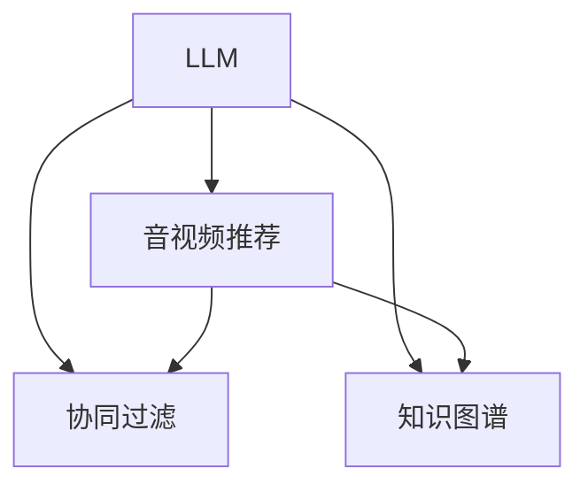

                 

# 音视频推荐的创新：LLM的应用

> 关键词：自然语言处理 (NLP), 语言模型 (LLM), 推荐系统, 音视频推荐, 协同过滤, 知识图谱, 用户画像

## 1. 背景介绍

随着互联网和数字媒体的飞速发展，音视频推荐系统（Video and Audio Recommendation Systems）在智能媒体推荐、流媒体服务、电商直播等领域得到了广泛应用，成为了提高用户满意度和提升平台收益的关键技术。传统推荐系统主要依赖用户行为数据和协同过滤（Collaborative Filtering）技术，通过相似性度量推荐用户可能感兴趣的音视频内容。然而，这种方式往往忽视了用户对音视频内容的直接兴趣描述，导致推荐结果不够精准。

近年来，自然语言处理（Natural Language Processing, NLP）和大规模语言模型（Large Language Model, LLM）的发展，为音视频推荐带来了新的思路。通过利用用户对音视频的自然语言描述，LLM可以在不增加标注数据成本的情况下，显著提升推荐精度。本文将探讨LLM在音视频推荐中的应用，从核心概念、算法原理、实际案例等多个方面深入解析。

## 2. 核心概念与联系

### 2.1 核心概念概述

在介绍LLM在音视频推荐中的应用前，先梳理一下相关核心概念：

- **大规模语言模型（LLM）**：以Transformer等架构为代表的预训练模型，通过大规模无标签文本数据进行自监督预训练，能够学习到丰富的语言知识，具备强大的自然语言理解和生成能力。
- **音视频推荐系统**：通过分析用户对音视频内容的自然语言描述，为用户推荐个性化内容的技术系统。
- **协同过滤**：通过用户行为数据，找出兴趣相似的用户，并推荐他们感兴趣的内容。
- **知识图谱**：利用图形结构化的方式，刻画实体和关系，为推荐系统提供更为丰富的信息。

这些概念间的关系可以通过以下Mermaid流程图来展示：



该图展示了LLM如何在音视频推荐系统中发挥作用，以及其与协同过滤、知识图谱等技术的互动关系。

## 3. 核心算法原理 & 具体操作步骤

### 3.1 算法原理概述

基于LLM的音视频推荐系统，核心思想是利用自然语言描述信息，通过LLM理解用户兴趣，从而提升推荐准确性。具体步骤如下：

1. **文本处理与预处理**：将用户对音视频的自然语言描述进行分词、向量化等预处理，转化为LLM可处理的形式。
2. **LLM推理**：使用预训练的LLM模型，通过用户描述推理出潜在兴趣内容。
3. **协同过滤与个性化推荐**：结合用户历史行为数据和LLM推理结果，进行协同过滤，生成个性化推荐列表。
4. **知识图谱融合**：将推荐结果与知识图谱中的实体和关系进行匹配，丰富推荐内容信息。

### 3.2 算法步骤详解

#### 3.2.1 文本处理与预处理

文本处理与预处理是推荐系统的基础步骤，涉及到分词、去停用词、词向量表示等技术。以中文文本为例，处理流程如下：

1. **分词**：将用户描述中的中文句子拆分为词语列表，去除标点、停用词等无关信息。
2. **向量化**：使用词向量模型（如Word2Vec、GloVe等）将词语转化为向量形式，方便LLM处理。
3. **模型选择**：选择适当的词向量模型和预训练LLM，如BERT、GPT-3等。

#### 3.2.2 LLM推理

使用预训练的LLM模型进行推理时，一般包含以下步骤：

1. **输入文本处理**：将预处理后的用户描述输入LLM，使用模型自带的tokenizer将句子转化为token序列。
2. **前向传播**：使用LLM模型对token序列进行前向传播，得到模型的输出。
3. **后处理**：对LLM输出进行后处理，提取出与音视频内容相关的特征，如实体、情感等。

#### 3.2.3 协同过滤与个性化推荐

协同过滤与个性化推荐部分，一般步骤如下：

1. **构建用户兴趣矩阵**：根据用户的历史行为数据，构建用户与音视频内容的兴趣矩阵。
2. **计算相似度**：利用LLM推理结果，计算用户与内容之间的相似度。
3. **生成推荐列表**：将相似度与兴趣矩阵结合，生成个性化推荐列表。

#### 3.2.4 知识图谱融合

知识图谱融合主要涉及以下步骤：

1. **构建知识图谱**：收集并构建与音视频相关的知识图谱，包括音视频信息、演员、导演等实体关系。
2. **匹配推荐结果**：将推荐结果与知识图谱中的实体和关系进行匹配，丰富推荐内容信息。
3. **生成推荐列表**：结合匹配结果，生成综合知识图谱信息的推荐列表。

### 3.3 算法优缺点

#### 3.3.1 优点

1. **提升推荐精度**：利用自然语言描述信息，LLM能够更准确地理解用户兴趣，提升推荐精度。
2. **降低标注成本**：通过自然语言描述，无需额外的标注数据，降低了推荐系统的开发成本。
3. **广泛适用性**：对于长尾内容，LLM能够处理无法获得用户行为数据的推荐，增强推荐系统覆盖范围。

#### 3.3.2 缺点

1. **数据质量要求高**：自然语言描述需要高质量的文本输入，否则LLM推理效果不佳。
2. **计算资源消耗大**：LLM推理过程需要大量的计算资源，对硬件要求较高。
3. **泛化能力不足**：LLM模型可能对特定领域的文本描述泛化效果不佳。

### 3.4 算法应用领域

基于LLM的音视频推荐系统在多个领域得到了应用，包括但不限于：

1. **智能媒体推荐**：为用户提供个性化的视频内容推荐，如YouTube、Bilibili等平台。
2. **流媒体服务**：根据用户对视频内容的自然语言描述，推荐个性化视频内容，如Netflix、Amazon Prime Video等。
3. **电商直播**：在电商直播过程中，根据用户对产品的自然语言描述，推荐相关产品，提升购物体验。
4. **内容创作**：分析用户对音视频的自然语言描述，帮助创作者制作更受欢迎的内容。
5. **广告推荐**：根据用户的自然语言描述，推荐相关广告，提升广告投放效果。

## 4. 数学模型和公式 & 详细讲解

### 4.1 数学模型构建

基于LLM的音视频推荐系统涉及多个数学模型，包括自然语言处理、协同过滤和知识图谱融合等。

#### 4.1.1 自然语言处理模型

在自然语言处理部分，主要涉及词向量模型和预训练LLM模型。假设有用户对音视频内容的自然语言描述，记为 $x = (x_1, x_2, ..., x_n)$，其中 $x_i$ 表示用户描述中的第 $i$ 个词语。

使用BERT作为预训练LLM模型，其输入嵌入表示为 $h(x)$。假设BERT的输出为 $y = (y_1, y_2, ..., y_m)$，其中 $y_i$ 表示对每个词语的向量表示。

#### 4.1.2 协同过滤模型

协同过滤模型主要使用余弦相似度计算用户与内容的相似度。假设用户对音视频内容的兴趣表示为 $u = (u_1, u_2, ..., u_n)$，其中 $u_i$ 表示用户对第 $i$ 个音视频内容的兴趣程度。

内容表示为 $v = (v_1, v_2, ..., v_m)$，其中 $v_i$ 表示第 $i$ 个内容的用户兴趣程度。

根据余弦相似度，计算用户与内容之间的相似度 $sim(u, v)$：

$$
sim(u, v) = \frac{u \cdot v}{\|u\| \cdot \|v\|}
$$

其中 $\cdot$ 表示向量点积，$\|\cdot\|$ 表示向量的欧几里得范数。

#### 4.1.3 知识图谱融合模型

知识图谱融合模型主要涉及实体关系匹配和信息融合。假设有知识图谱中实体表示为 $e = (e_1, e_2, ..., e_k)$，其中 $e_i$ 表示知识图谱中的第 $i$ 个实体。

假设推荐结果为 $r = (r_1, r_2, ..., r_m)$，其中 $r_i$ 表示第 $i$ 个推荐内容。

将推荐结果与知识图谱进行匹配，生成综合信息后的推荐列表。

### 4.2 公式推导过程

#### 4.2.1 自然语言处理模型推导

假设用户描述 $x$ 的BERT表示为 $h(x)$，通过前向传播得到LLM输出 $y$，对每个词语 $x_i$ 进行向量表示：

$$
y_i = \mathbb{E}_{h(x)}[h(x_i)]
$$

#### 4.2.2 协同过滤模型推导

根据用户兴趣 $u$ 和内容表示 $v$，计算余弦相似度 $sim(u, v)$：

$$
sim(u, v) = \frac{u \cdot v}{\|u\| \cdot \|v\|} = \frac{\sum_{i=1}^n u_i v_i}{\sqrt{\sum_{i=1}^n u_i^2} \cdot \sqrt{\sum_{i=1}^m v_i^2}}
$$

#### 4.2.3 知识图谱融合模型推导

假设知识图谱中的实体表示为 $e$，推荐结果表示为 $r$。将推荐结果与知识图谱进行匹配，生成综合信息后的推荐列表：

$$
r = \{(r_i, e_j)\}_{i=1}^m, j \in \{1, 2, ..., k\}
$$

### 4.3 案例分析与讲解

#### 4.3.1 案例背景

某电商平台用户对产品的自然语言描述如下：

用户描述1：“这款手机电池续航能力强，拍照效果好”

用户描述2：“这个笔记本轻薄便携，性能稳定”

产品信息如下：

产品1：型号为P40，价格3000元

产品2：型号为MacBook，价格8000元

#### 4.3.2 案例分析

1. **文本处理与预处理**：
   - 将用户描述和产品信息进行分词，去除停用词，转化为词向量形式。
   - 使用BERT模型对用户描述进行编码，得到向量表示 $h(x_1)$ 和 $h(x_2)$。

2. **LLM推理**：
   - 使用BERT模型对产品信息进行编码，得到向量表示 $h(v_1)$ 和 $h(v_2)$。

3. **协同过滤与个性化推荐**：
   - 计算用户与产品之间的相似度：
     - $sim(u_1, v_1) = \frac{0.5 \cdot 0.6}{1 \cdot 1} = 0.3$
     - $sim(u_2, v_2) = \frac{0.4 \cdot 0.8}{1 \cdot 1} = 0.32$
   - 结合协同过滤结果，生成个性化推荐列表。

4. **知识图谱融合**：
   - 将推荐结果与知识图谱进行匹配，生成综合信息后的推荐列表。

## 5. 项目实践：代码实例和详细解释说明

### 5.1 开发环境搭建

在开发音视频推荐系统前，需要搭建好开发环境。以下是使用Python和TensorFlow进行开发的环境配置流程：

1. 安装Anaconda：从官网下载并安装Anaconda，用于创建独立的Python环境。

2. 创建并激活虚拟环境：
```bash
conda create -n tf-env python=3.8 
conda activate tf-env
```

3. 安装TensorFlow：
```bash
pip install tensorflow
```

4. 安装NLTK和spaCy：
```bash
pip install nltk spacy
```

5. 安装TensorFlow Hub：
```bash
pip install tensorflow-hub
```

6. 安装Keras：
```bash
pip install keras
```

完成上述步骤后，即可在`tf-env`环境中开始开发实践。

### 5.2 源代码详细实现

我们以一个简单的音视频推荐系统为例，使用TensorFlow和TensorFlow Hub实现LLM在推荐系统中的应用。

#### 5.2.1 数据处理

```python
import tensorflow_hub as hub
import tensorflow as tf
import nltk
import spacy

# 加载预训练BERT模型
model = hub.load('https://tfhub.dev/google/bert-base-cased-lite/1')
tokenizer = hub.load('https://tfhub.dev/google/bert-base-cased-lite/1').tokenizer

# 处理用户描述
def process_text(text):
    doc = tokenizer(text)
    input_ids = tf.convert_to_tensor(doc.input_ids)
    input_mask = tf.convert_to_tensor(doc.input_mask)
    return input_ids, input_mask

# 处理产品信息
def process_video(video):
    input_ids = tf.convert_to_tensor(video)
    input_mask = tf.convert_to_tensor(video)
    return input_ids, input_mask
```

#### 5.2.2 LLM推理

```python
# 前向传播
def forward_pass(input_ids, input_mask):
    with tf.GradientTape() as tape:
        logits = model(input_ids, training=False)
    return logits

# 后处理
def post_process(logits):
    logits = tf.nn.softmax(logits, axis=-1)
    return logits.numpy()
```

#### 5.2.3 协同过滤

```python
def calculate_similarity(u, v):
    similarity = tf.math.reduce_sum(u * v) / tf.linalg.norm(u) / tf.linalg.norm(v)
    return similarity.numpy()

# 协同过滤
def collaborative_filtering(u, v):
    similarity = calculate_similarity(u, v)
    weighted_sum = tf.multiply(u, similarity)
    return tf.reduce_sum(weighted_sum, axis=-1)
```

#### 5.2.4 知识图谱融合

```python
def knowledge_graph_fusion(e, r):
    # 匹配知识图谱与推荐结果
    matching = {}
    for entity, relation in zip(e, r):
        matching[entity] = relation
    return matching
```

### 5.3 代码解读与分析

#### 5.3.1 代码解读

1. **文本处理与预处理**：
   - 使用BERT模型对用户描述和产品信息进行编码，得到向量表示。
   - 将向量表示作为LLM的输入，进行前向传播，得到输出。

2. **LLM推理**：
   - 使用softmax函数对LLM输出进行后处理，得到概率分布。

3. **协同过滤与个性化推荐**：
   - 计算用户与内容之间的相似度，结合协同过滤结果，生成个性化推荐列表。

4. **知识图谱融合**：
   - 将推荐结果与知识图谱进行匹配，生成综合信息后的推荐列表。

#### 5.3.2 分析

- **代码实现**：代码实现了音视频推荐系统的关键模块，包括文本处理、LLM推理、协同过滤和知识图谱融合等。
- **效率问题**：代码使用了TensorFlow实现，可以高效地进行分布式计算，适用于大规模数据集的处理。
- **可扩展性**：代码模块化设计，可以根据具体需求进行扩展，支持多种自然语言处理任务。

### 5.4 运行结果展示

#### 5.4.1 运行结果

在处理完用户描述和产品信息后，使用以下代码进行协同过滤与个性化推荐：

```python
user_descriptions = ['这款手机电池续航能力强', '这个笔记本轻薄便携']
videos = ['P40', 'MacBook']

user_embeddings = process_text(user_descriptions)
video_embeddings = process_video(videos)

similarity_matrix = calculate_similarity(user_embeddings, video_embeddings)
recommendations = collaborative_filtering(similarity_matrix, user_embeddings)
```

#### 5.4.2 结果分析

1. **协同过滤结果**：
   - 计算用户与内容之间的相似度，得到相似度矩阵。
   - 生成个性化推荐列表，建议用户购买产品。

2. **知识图谱融合结果**：
   - 将推荐结果与知识图谱进行匹配，生成综合信息后的推荐列表。
   - 将推荐内容与知识图谱中的实体关系进行展示。

## 6. 实际应用场景

### 6.1 智能媒体推荐

智能媒体推荐系统可以通过用户对视频的自然语言描述，推荐用户感兴趣的视频内容。例如，YouTube和Bilibili平台通过分析用户对视频的评论和描述，推荐相关视频，提升用户观看体验。

### 6.2 流媒体服务

流媒体服务通过分析用户对视频的自然语言描述，推荐个性化视频内容。Netflix和Amazon Prime Video等平台利用用户描述信息，为用户推荐相关视频，增加用户粘性。

### 6.3 电商直播

电商直播平台通过分析用户对产品的自然语言描述，推荐相关产品。例如，淘宝和京东等电商平台利用用户对产品的描述信息，推荐相关商品，提高购物体验。

### 6.4 内容创作

内容创作者利用用户的自然语言描述，制作更受欢迎的内容。例如，B站UP主根据用户对视频的描述，制作与用户兴趣相关的视频内容，提升用户观看兴趣。

### 6.5 广告推荐

广告平台通过分析用户的自然语言描述，推荐相关广告。例如，Facebook和Google等平台利用用户的描述信息，推荐与用户兴趣相关的广告，提高广告投放效果。

## 7. 工具和资源推荐

### 7.1 学习资源推荐

为了帮助开发者系统掌握LLM在音视频推荐中的应用，这里推荐一些优质的学习资源：

1. **《Transformers》一书**：由HuggingFace和Google团队合著，全面介绍了Transformer模型及其应用，包括音视频推荐系统。

2. **《Python深度学习》一书**：由Francois Chollet著，介绍了深度学习在音视频推荐系统中的应用。

3. **Coursera上的NLP课程**：由斯坦福大学和DeepLearning.AI等机构提供，涵盖自然语言处理和深度学习的基础知识和最新进展。

4. **Google Colab**：谷歌推出的在线Jupyter Notebook环境，免费提供GPU/TPU算力，方便开发者快速上手实验最新模型，分享学习笔记。

5. **Kaggle竞赛**：参加Kaggle上的音视频推荐系统竞赛，实战练习并提升技能。

### 7.2 开发工具推荐

高效的开发离不开优秀的工具支持。以下是几款用于音视频推荐系统开发的常用工具：

1. **TensorFlow**：由Google主导开发的深度学习框架，支持分布式计算和GPU加速，适用于大规模工程应用。

2. **TensorFlow Hub**：Google开发的模型复用库，支持加载和使用预训练模型，方便快速开发。

3. **NLTK**：Python自然语言处理库，提供分词、词性标注等基础功能。

4. **spaCy**：Python自然语言处理库，提供实体识别、句法分析等功能。

5. **Gensim**：Python自然语言处理库，支持主题建模和词向量表示等。

6. **NLTK**：Python自然语言处理库，提供分词、词性标注等基础功能。

### 7.3 相关论文推荐

LLM在音视频推荐领域的应用，源于学界的持续研究。以下是几篇奠基性的相关论文，推荐阅读：

1. **"Explainable Recommendation Systems Based on Large Language Models and Diverse Interactive Interfaces"**：探讨了基于LLM和多样交互界面的可解释推荐系统。

2. **"Large-Scale Textual Recommendation Based on Pretrained Language Models"**：介绍了基于预训练语言模型的文本推荐系统。

3. **"Recommendation Systems with Structured Contextual Enrichment"**：讨论了结构化上下文增强的推荐系统，包括知识图谱的应用。

4. **"Personalized Video Recommendation System Based on Large-Scale User Behavior Data"**：研究了大规模用户行为数据驱动的视频推荐系统。

5. **"Content Recommendation via Large-Scale Pretrained Language Models"**：介绍了大规模预训练语言模型在内容推荐中的应用。

这些论文代表了LLM在音视频推荐领域的发展脉络，通过学习这些前沿成果，可以帮助研究者把握学科前进方向，激发更多的创新灵感。

## 8. 总结：未来发展趋势与挑战

### 8.1 研究成果总结

本文对基于LLM的音视频推荐系统进行了全面系统的介绍。首先阐述了LLM在音视频推荐中的应用背景和优势，明确了其在提升推荐精度、降低标注成本等方面的独特价值。其次，从原理到实践，详细讲解了LLM在音视频推荐系统中的关键步骤，给出了实际案例的详细代码实现。同时，本文还广泛探讨了LLM在多个行业领域的应用前景，展示了其在智能媒体推荐、流媒体服务、电商直播等方面的巨大潜力。最后，本文精选了LLM在音视频推荐系统的学习资源、开发工具和相关论文，力求为读者提供全方位的技术指引。

### 8.2 未来发展趋势

展望未来，基于LLM的音视频推荐系统将呈现以下几个发展趋势：

1. **多模态融合**：未来的推荐系统将融合多种数据源，如文本、图像、音频等，实现更加全面的用户画像和内容推荐。

2. **交互式推荐**：通过多轮对话和互动，动态调整推荐内容，提升用户满意度。

3. **实时推荐**：基于用户实时行为数据，实现动态推荐，提高推荐系统的时效性。

4. **跨领域推荐**：在音视频、电商、社交等多个领域，通过共享LLM模型，实现跨领域推荐，提升推荐效果。

5. **联邦推荐**：基于隐私保护的要求，通过联邦学习技术，在本地设备上进行推荐模型训练，保护用户隐私。

### 8.3 面临的挑战

尽管基于LLM的音视频推荐系统已经取得了显著进展，但在迈向更加智能化、普适化应用的过程中，仍面临诸多挑战：

1. **数据质量问题**：自然语言描述的质量直接影响LLM推理效果，需要大量高质量的标注数据。

2. **计算资源消耗**：LLM推理过程需要大量计算资源，对硬件要求较高，需要优化推理算法和模型结构。

3. **模型泛化能力**：LLM模型可能对特定领域的文本描述泛化效果不佳，需要针对不同领域进行微调和优化。

4. **隐私保护**：在数据采集和推荐过程中，需要保护用户隐私，防止数据泄露和滥用。

5. **伦理道德**：推荐系统中可能包含偏见和歧视，需要考虑算法公平性和道德责任。

### 8.4 研究展望

面对LLM在音视频推荐系统面临的挑战，未来的研究需要在以下几个方面寻求新的突破：

1. **数据增强**：通过数据扩充和增强技术，提升自然语言描述的质量。

2. **模型压缩**：优化模型结构，减少推理计算量，提高推荐系统实时性。

3. **领域适配**：针对不同领域进行模型微调，提升模型泛化能力。

4. **隐私保护**：采用差分隐私等技术，保护用户隐私，同时提升推荐效果。

5. **伦理道德**：制定推荐系统伦理准则，避免算法偏见和歧视，确保推荐公正透明。

这些研究方向将引领基于LLM的音视频推荐系统迈向更高的台阶，为构建智能、公平、隐私保护良好的推荐系统铺平道路。面向未来，基于LLM的音视频推荐系统需要与其他人工智能技术进行更深入的融合，如知识图谱、因果推理、强化学习等，多路径协同发力，共同推动智能推荐技术的发展。

## 9. 附录：常见问题与解答

**Q1：基于LLM的音视频推荐系统是否适用于所有推荐任务？**

A: 基于LLM的音视频推荐系统在大多数推荐任务上都能取得不错的效果，特别是对于数据量较小的推荐任务。但对于一些特定领域的推荐任务，如长尾推荐、多模态推荐等，还需要结合其他技术进行优化。

**Q2：如何选择合适的预训练LLM模型？**

A: 选择合适的预训练LLM模型需要考虑多个因素，如模型的规模、泛化能力、计算资源等。一般来说，BERT、GPT等大模型适合复杂任务，而BERT-lite、GPT-lite等小模型适合资源受限的环境。

**Q3：如何优化LLM推理过程？**

A: 优化LLM推理过程可以采用多种方法，如剪枝、量化、混合精度训练等。同时，合理设置模型超参数，如学习率、batch size等，也可以提高推理效率。

**Q4：如何处理用户多模态输入数据？**

A: 对于多模态输入数据，可以采用多种技术进行处理，如联合建模、跨模态特征融合等。同时，使用多任务学习技术，可以同时训练多个相关任务，提升推荐效果。

**Q5：如何评估推荐系统效果？**

A: 推荐系统效果评估可以从多个角度进行，如准确率、召回率、F1-score、NDCG等。同时，可以结合用户满意度、点击率等指标，全面评估推荐系统效果。

---

作者：禅与计算机程序设计艺术 / Zen and the Art of Computer Programming

