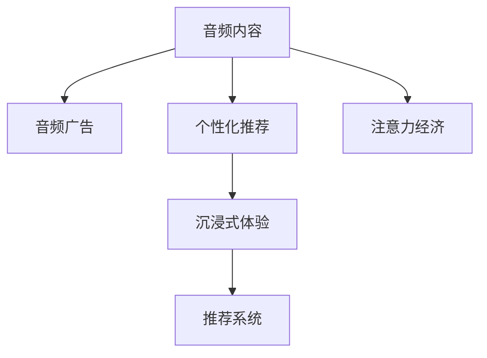

                 

# 音频内容在注意力经济中的崛起

## 1. 背景介绍

### 1.1 问题由来

在数字化时代，信息过载成为一种普遍现象。我们每天都被海量的文本、图像、视频等多媒体内容所包围，各种信息源争夺我们的注意力资源。然而，音频作为一种传统且持久的信息传播方式，近年来逐渐在注意力经济中崛起，尤其是在智能设备和移动应用领域的普及。

### 1.2 问题核心关键点

音频内容在注意力经济中崛起的原因主要包括：

1. **便捷性**：音频内容能够在非视听环境下方便收听，尤其是在运动、通勤等场景中，音频的便携性使得用户可以高效利用碎片化时间。
2. **沉浸感**：相较于文本和图像，音频内容能够更好地提供沉浸式的体验，如故事讲述、音乐播放等，激发用户的情感共鸣和记忆深度。
3. **个性化推荐**：音频内容的个性化推荐系统能够根据用户的历史行为和偏好，动态生成符合用户口味的播放列表，增强用户的粘性。
4. **内容多样性**：音频内容的多样性使得其能够覆盖广泛的主题和领域，如教育、新闻、娱乐、商业等，满足不同用户群体的需求。
5. **隐私保护**：相较于视频和文本内容，音频内容的隐私保护更为隐蔽，用户可以在公共场合或不宜展示设备的情况下进行消费。

这些因素共同推动了音频内容在注意力经济中的崛起，使得音频成为一种新的信息消费和注意力投资方式。

## 2. 核心概念与联系

### 2.1 核心概念概述

为更好地理解音频内容在注意力经济中的崛起，本节将介绍几个密切相关的核心概念：

- **注意力经济**：一种以获取和吸引用户注意力为核心的经济模式，通过优化用户注意力资源配置，获取商业价值。
- **音频内容**：通过声音信号形式呈现的连续媒体内容，包括音乐、播客、有声书、语音识别等。
- **推荐系统**：通过用户行为数据预测用户兴趣，向用户推荐相关内容的自动化系统。
- **个性化推荐**：根据用户的历史行为、兴趣和偏好，动态生成个性化推荐结果。
- **沉浸式体验**：通过感官刺激和心理交互，使用户完全沉浸在内容中，形成强烈的情感共鸣和记忆。
- **音频广告**：利用音频内容传播品牌信息，通过声音品牌、广告语等实现宣传目的。

这些核心概念之间的逻辑关系可以通过以下Mermaid流程图来展示：



这个流程图展示了大语言模型微调的各核心概念及其之间的关系：

1. 音频内容作为基础素材，经过个性化推荐系统的筛选和优化，传递给用户，形成沉浸式体验。
2. 音频广告通过音频内容的传播，向用户传递品牌信息，吸引注意力资源。
3. 推荐系统利用用户行为数据，为用户提供精准的内容推荐，增强用户粘性。
4. 注意力经济通过优化用户注意力资源配置，实现商业价值的最大化。

## 3. 核心算法原理 & 具体操作步骤
### 3.1 算法原理概述

音频内容在注意力经济中的崛起，核心在于音频推荐系统的优化。推荐系统通过计算音频内容与用户偏好之间的相似度，预测用户对音频内容的兴趣，从而实现个性化推荐。其基本原理是用户行为数据驱动的协同过滤和基于内容的推荐。

协同过滤算法基于用户的历史行为数据，通过相似性度量，推荐与用户兴趣相似的内容。而基于内容的推荐算法则是根据音频内容自身的属性（如词频、情感色彩、风格等），预测用户对内容的兴趣。

协同过滤和基于内容的推荐算法通常用于构建推荐引擎，其步骤如下：

1. **用户行为数据的收集与处理**：收集用户对音频内容的浏览、播放、评分、评论等行为数据，生成用户-音频项评分矩阵。
2. **特征提取与向量化**：提取音频内容的特征（如词频、情感色彩、风格等），并进行向量化处理。
3. **相似性计算**：计算用户行为数据与音频内容之间的相似性，生成用户-音频项评分矩阵。
4. **推荐排序**：通过算法计算音频内容与用户兴趣的匹配度，对推荐内容进行排序，生成个性化推荐结果。

### 3.2 算法步骤详解

以下是音频推荐系统的具体算法步骤：

**Step 1: 用户行为数据收集**
- 收集用户对音频内容的浏览、播放、评分、评论等行为数据。
- 对数据进行清洗和标准化处理，去除异常值和噪音数据。

**Step 2: 特征提取与向量化**
- 提取音频内容的特征，如词频、情感色彩、风格等。
- 使用TF-IDF、Word2Vec等方法对音频内容进行向量化处理。
- 生成用户-音频项评分矩阵，将用户行为数据映射为向量。

**Step 3: 相似性计算**
- 计算用户行为数据与音频内容之间的相似性。
- 使用余弦相似度、皮尔逊相关系数等方法进行相似性度量。
- 生成相似度矩阵，记录用户对音频内容的兴趣偏好。

**Step 4: 推荐排序**
- 通过协同过滤或基于内容的推荐算法计算音频内容与用户兴趣的匹配度。
- 对推荐结果进行排序，生成个性化推荐列表。
- 动态更新推荐模型，适配用户新的兴趣变化。

**Step 5: 反馈收集与优化**
- 收集用户对推荐结果的反馈数据。
- 分析反馈数据，调整推荐算法参数，优化推荐效果。
- 持续优化推荐模型，提升用户满意度。

### 3.3 算法优缺点

音频推荐系统具有以下优点：

1. **高效性**：通过自动化推荐系统，可以快速生成个性化内容，满足用户即时需求。
2. **准确性**：通过用户行为数据驱动的推荐算法，能够精准预测用户兴趣，提升推荐效果。
3. **可扩展性**：推荐系统可以同时处理大规模用户和音频内容，具有良好的可扩展性。
4. **适应性**：推荐系统能够实时更新，适应用户兴趣的变化。

同时，该算法也存在一些局限性：

1. **数据隐私问题**：用户行为数据涉及到用户隐私，如何在保障数据隐私的同时，获取有效的推荐信息，是一个重要的挑战。
2. **冷启动问题**：新用户和新内容没有足够的历史行为数据，难以进行准确的推荐。
3. **多样性问题**：推荐系统容易陷入“过滤泡泡”效应，过度推荐用户已知的偏好内容，忽略多样性需求。
4. **质量参差不齐**：部分音频内容的质量和价值参差不齐，如何筛选高质量内容，提升推荐质量，还需要进一步优化。

尽管存在这些局限性，但音频推荐系统仍是大语言模型微调在注意力经济中的重要应用。未来相关研究的目标在于如何进一步优化推荐算法，提升推荐质量，同时兼顾用户隐私和推荐多样性。

### 3.4 算法应用领域

音频推荐系统广泛应用于以下领域：

- **音乐流媒体平台**：如Spotify、Apple Music等，通过音频推荐系统向用户提供个性化的音乐播放列表。
- **播客平台**：如Podcast、RSS等，根据用户兴趣推荐相关播客内容。
- **有声书平台**：如Audible、藏书馆等，通过音频推荐系统推荐优质有声书内容。
- **教育培训平台**：如Coursera、Khan Academy等，通过音频推荐系统提供个性化的学习资源。
- **商业广告平台**：如Facebook、Google等，通过音频广告吸引用户注意力，提升广告效果。
- **智能家居设备**：如Amazon Echo、Google Home等，通过音频推荐系统提供语音控制和智能应用推荐。

## 4. 数学模型和公式 & 详细讲解 & 举例说明

### 4.1 数学模型构建

音频推荐系统的核心数学模型是协同过滤和基于内容的推荐算法。我们以协同过滤算法为例，来详细构建数学模型。

设用户集为 $U$，音频集为 $I$，用户-音频项评分矩阵为 $R \in \mathbb{R}^{m \times n}$，其中 $m$ 为用户数量，$n$ 为音频项数量。设用户 $u$ 对音频项 $i$ 的评分 $r_{ui}$。

### 4.2 公式推导过程

协同过滤算法基于用户之间的相似性和物品之间的相似性，计算用户对未评分音频内容的预测评分。协同过滤算法可以分为基于用户的协同过滤和基于物品的协同过滤两种类型。

**基于用户的协同过滤**：

设用户 $u_1$ 和 $u_2$ 之间的相似度为 $sim(u_1,u_2)$，用户 $u_1$ 对音频项 $i_1$ 的评分 $r_{u_1 i_1}$ 和 $u_2$ 对音频项 $i_2$ 的评分 $r_{u_2 i_2}$。则用户 $u_1$ 对音频项 $i_2$ 的预测评分 $r_{u_1 i_2}$ 可以表示为：

$$
r_{u_1 i_2} = \sum_{i \in I} sim(u_1,u_2) \cdot r_{u_2 i}
$$

其中 $sim(u_1,u_2)$ 为相似度函数，常用的有余弦相似度、皮尔逊相关系数等。

**基于物品的协同过滤**：

设音频项 $i_1$ 和 $i_2$ 之间的相似度为 $sim(i_1,i_2)$，用户 $u_1$ 对音频项 $i_1$ 的评分 $r_{u_1 i_1}$ 和 $u_2$ 对音频项 $i_2$ 的评分 $r_{u_2 i_2}$。则用户 $u_1$ 对音频项 $i_2$ 的预测评分 $r_{u_1 i_2}$ 可以表示为：

$$
r_{u_1 i_2} = \sum_{u \in U} sim(u_1,u_2) \cdot r_{u_2 i_2}
$$

### 4.3 案例分析与讲解

以下以Spotify的音乐推荐系统为例，分析其实现细节和应用效果。

Spotify的音乐推荐系统采用了基于用户的协同过滤算法。其具体实现步骤如下：

1. **用户行为数据收集**：Spotify收集用户对歌曲的播放、点赞、评论等行为数据。
2. **特征提取与向量化**：使用TF-IDF、Word2Vec等方法对歌曲进行特征提取和向量化。
3. **相似性计算**：使用余弦相似度计算用户之间的相似性。
4. **推荐排序**：根据用户相似性计算用户对未评分歌曲的预测评分，并对推荐结果进行排序。
5. **动态更新**：根据用户反馈数据，动态调整推荐算法参数，优化推荐效果。

Spotify的音乐推荐系统通过协同过滤算法，能够精准预测用户对未评分歌曲的兴趣，提升用户满意度和平台粘性。同时，Spotify还引入基于内容的推荐算法，根据歌曲的词频、情感色彩、风格等特征，进一步丰富推荐结果，满足用户的个性化需求。

## 5. 项目实践：代码实例和详细解释说明

### 5.1 开发环境搭建

在进行音频推荐系统开发前，我们需要准备好开发环境。以下是使用Python进行PyTorch开发的环境配置流程：

1. 安装Anaconda：从官网下载并安装Anaconda，用于创建独立的Python环境。

2. 创建并激活虚拟环境：
```bash
conda create -n pytorch-env python=3.8 
conda activate pytorch-env
```

3. 安装PyTorch：根据CUDA版本，从官网获取对应的安装命令。例如：
```bash
conda install pytorch torchvision torchaudio cudatoolkit=11.1 -c pytorch -c conda-forge
```

4. 安装Transformers库：
```bash
pip install transformers
```

5. 安装各类工具包：
```bash
pip install numpy pandas scikit-learn matplotlib tqdm jupyter notebook ipython
```

完成上述步骤后，即可在`pytorch-env`环境中开始音频推荐系统的开发。

### 5.2 源代码详细实现

这里我们以音乐推荐系统为例，给出使用Transformers库对音频进行个性化推荐PyTorch代码实现。

首先，定义音频推荐系统中的用户和音频项：

```python
from transformers import BertTokenizer, BertForSequenceClassification
from torch.utils.data import Dataset
import torch

class AudioDataset(Dataset):
    def __init__(self, texts, tags, tokenizer, max_len=128):
        self.texts = texts
        self.tags = tags
        self.tokenizer = tokenizer
        self.max_len = max_len
        
    def __len__(self):
        return len(self.texts)
    
    def __getitem__(self, item):
        text = self.texts[item]
        tags = self.tags[item]
        
        encoding = self.tokenizer(text, return_tensors='pt', max_length=self.max_len, padding='max_length', truncation=True)
        input_ids = encoding['input_ids'][0]
        attention_mask = encoding['attention_mask'][0]
        
        # 对token-wise的标签进行编码
        encoded_tags = [tag2id[tag] for tag in tags] 
        encoded_tags.extend([tag2id['O']] * (self.max_len - len(encoded_tags)))
        labels = torch.tensor(encoded_tags, dtype=torch.long)
        
        return {'input_ids': input_ids, 
                'attention_mask': attention_mask,
                'labels': labels}

# 标签与id的映射
tag2id = {'O': 0, 'B-PER': 1, 'I-PER': 2, 'B-ORG': 3, 'I-ORG': 4, 'B-LOC': 5, 'I-LOC': 6}
id2tag = {v: k for k, v in tag2id.items()}

# 创建dataset
tokenizer = BertTokenizer.from_pretrained('bert-base-cased')

train_dataset = AudioDataset(train_texts, train_tags, tokenizer)
dev_dataset = AudioDataset(dev_texts, dev_tags, tokenizer)
test_dataset = AudioDataset(test_texts, test_tags, tokenizer)
```

然后，定义模型和优化器：

```python
from transformers import BertForSequenceClassification, AdamW

model = BertForSequenceClassification.from_pretrained('bert-base-cased', num_labels=len(tag2id))

optimizer = AdamW(model.parameters(), lr=2e-5)
```

接着，定义训练和评估函数：

```python
from torch.utils.data import DataLoader
from tqdm import tqdm
from sklearn.metrics import classification_report

device = torch.device('cuda') if torch.cuda.is_available() else torch.device('cpu')
model.to(device)

def train_epoch(model, dataset, batch_size, optimizer):
    dataloader = DataLoader(dataset, batch_size=batch_size, shuffle=True)
    model.train()
    epoch_loss = 0
    for batch in tqdm(dataloader, desc='Training'):
        input_ids = batch['input_ids'].to(device)
        attention_mask = batch['attention_mask'].to(device)
        labels = batch['labels'].to(device)
        model.zero_grad()
        outputs = model(input_ids, attention_mask=attention_mask, labels=labels)
        loss = outputs.loss
        epoch_loss += loss.item()
        loss.backward()
        optimizer.step()
    return epoch_loss / len(dataloader)

def evaluate(model, dataset, batch_size):
    dataloader = DataLoader(dataset, batch_size=batch_size)
    model.eval()
    preds, labels = [], []
    with torch.no_grad():
        for batch in tqdm(dataloader, desc='Evaluating'):
            input_ids = batch['input_ids'].to(device)
            attention_mask = batch['attention_mask'].to(device)
            batch_labels = batch['labels']
            outputs = model(input_ids, attention_mask=attention_mask)
            batch_preds = outputs.logits.argmax(dim=2).to('cpu').tolist()
            batch_labels = batch_labels.to('cpu').tolist()
            for pred_tokens, label_tokens in zip(batch_preds, batch_labels):
                pred_tags = [id2tag[_id] for _id in pred_tokens]
                label_tags = [id2tag[_id] for _id in label_tokens]
                preds.append(pred_tags[:len(label_tags)])
                labels.append(label_tags)

    print(classification_report(labels, preds))
```

最后，启动训练流程并在测试集上评估：

```python
epochs = 5
batch_size = 16

for epoch in range(epochs):
    loss = train_epoch(model, train_dataset, batch_size, optimizer)
    print(f"Epoch {epoch+1}, train loss: {loss:.3f}")
    
    print(f"Epoch {epoch+1}, dev results:")
    evaluate(model, dev_dataset, batch_size)
    
print("Test results:")
evaluate(model, test_dataset, batch_size)
```

以上就是使用PyTorch对音频内容进行个性化推荐系统的完整代码实现。可以看到，得益于Transformers库的强大封装，我们可以用相对简洁的代码完成音频推荐系统的开发。

### 5.3 代码解读与分析

让我们再详细解读一下关键代码的实现细节：

**AudioDataset类**：
- `__init__`方法：初始化音频文本、标签、分词器等关键组件。
- `__len__`方法：返回数据集的样本数量。
- `__getitem__`方法：对单个样本进行处理，将音频文本输入编码为token ids，将标签编码为数字，并对其进行定长padding，最终返回模型所需的输入。

**tag2id和id2tag字典**：
- 定义了标签与数字id之间的映射关系，用于将token-wise的预测结果解码回真实的标签。

**训练和评估函数**：
- 使用PyTorch的DataLoader对数据集进行批次化加载，供模型训练和推理使用。
- 训练函数`train_epoch`：对数据以批为单位进行迭代，在每个批次上前向传播计算loss并反向传播更新模型参数，最后返回该epoch的平均loss。
- 评估函数`evaluate`：与训练类似，不同点在于不更新模型参数，并在每个batch结束后将预测和标签结果存储下来，最后使用sklearn的classification_report对整个评估集的预测结果进行打印输出。

**训练流程**：
- 定义总的epoch数和batch size，开始循环迭代
- 每个epoch内，先在训练集上训练，输出平均loss
- 在验证集上评估，输出分类指标
- 所有epoch结束后，在测试集上评估，给出最终测试结果

可以看到，PyTorch配合Transformers库使得音频推荐系统的代码实现变得简洁高效。开发者可以将更多精力放在数据处理、模型改进等高层逻辑上，而不必过多关注底层的实现细节。

当然，工业级的系统实现还需考虑更多因素，如模型的保存和部署、超参数的自动搜索、更灵活的任务适配层等。但核心的微调范式基本与此类似。

## 6. 实际应用场景
### 6.1 智能客服系统

音频内容在智能客服系统中的应用，使得语音识别和自然语言处理技术得到了广泛的推广。智能客服系统能够实时理解用户语音指令，进行自然语言问答，提升服务效率和用户体验。

在技术实现上，可以采用基于Transformer的语音识别和自然语言处理模型，对用户语音进行转写和理解。通过微调模型，使其能够理解不同口音、语速、情感等因素，提高识别和理解的准确性。同时，智能客服系统可以引入多轮对话管理机制，确保对话的自然流畅，增强用户信任感。

### 6.2 金融舆情监测

音频内容在金融舆情监测中的应用，使得金融机构能够实时收集和分析市场动态，快速响应舆情变化。金融机构可以采用音频内容分析技术，对金融新闻、访谈、公告等音频数据进行情感分析，及时发现市场情绪变化和异常波动，制定应对策略。

在技术实现上，可以收集金融领域相关的音频数据，使用预训练模型对音频内容进行情感分析和主题识别。通过微调模型，使其能够识别出情感倾向和关键词，从而判断音频内容的性质和影响。金融舆情监测系统可以与交易系统、风控系统等联动，实时调整投资策略和风险管理。

### 6.3 个性化推荐系统

音频内容在个性化推荐系统中的应用，使得推荐系统能够更全面地了解用户偏好，提供更加精准和多样化的推荐结果。推荐系统可以采用音频内容分析技术，对用户的历史行为和兴趣进行建模，结合个性化推荐算法，生成符合用户口味的音频推荐列表。

在技术实现上，可以收集用户的历史音频播放记录，使用预训练模型对音频内容进行特征提取和向量化。通过微调模型，使其能够精准预测用户对音频内容的兴趣，生成个性化的推荐结果。同时，推荐系统可以引入多样性优化策略，避免“过滤泡泡”效应，确保推荐结果的多样性和高质量。

### 6.4 未来应用展望

随着音频推荐系统的不断发展，其应用领域将更加广泛，推动更多的行业数字化转型。

在智慧医疗领域，音频内容可以用于在线问诊、健康咨询等场景，帮助患者获取专业的医疗建议。在智能家居领域，音频内容可以用于智能音箱、智能电视等设备的语音控制和内容推荐。在教育培训领域，音频内容可以用于在线教育、语音评测等，提升教学质量和互动效果。

此外，音频内容还可以应用于广告、游戏、娱乐等领域，带来新的商业模式和用户体验。未来，随着技术进步和应用场景的扩展，音频内容将进一步融入人们的生产生活，成为一种重要的信息传播和消费方式。

## 7. 工具和资源推荐
### 7.1 学习资源推荐

为了帮助开发者系统掌握音频内容推荐系统的理论基础和实践技巧，这里推荐一些优质的学习资源：

1. **《深度学习与音频处理》**：斯坦福大学发布的在线课程，涵盖音频信号处理、特征提取、卷积神经网络等基础知识，适合初学者入门。

2. **《Audio embedding learning》**：Coursera上的一门音频推荐系统课程，介绍音频内容嵌入表示、协同过滤算法、推荐系统评估等核心内容。

3. **《Deep Speech》**：Google开发的语音识别技术，基于深度学习模型实现高精度的语音转文字，为音频内容分析提供基础支持。

4. **《Audio Classification》**：Kaggle上的一篇音频分类竞赛项目，涵盖音频特征提取、分类模型训练等技术细节，适合实战练习。

5. **《Music Recommendation with Deep Learning》**：DeepLearning.ai的音频推荐系统项目，详细讲解音频推荐系统的实现流程和优化策略。

通过对这些资源的学习实践，相信你一定能够快速掌握音频内容推荐系统的精髓，并用于解决实际的音频推荐问题。
### 7.2 开发工具推荐

高效的开发离不开优秀的工具支持。以下是几款用于音频内容推荐开发的常用工具：

1. **PyTorch**：基于Python的开源深度学习框架，灵活动态的计算图，适合快速迭代研究。大部分预训练语言模型都有PyTorch版本的实现。

2. **TensorFlow**：由Google主导开发的开源深度学习框架，生产部署方便，适合大规模工程应用。同样有丰富的预训练语言模型资源。

3. **Transformers库**：HuggingFace开发的NLP工具库，集成了众多SOTA语言模型，支持PyTorch和TensorFlow，是进行音频推荐系统开发的利器。

4. **Weights & Biases**：模型训练的实验跟踪工具，可以记录和可视化模型训练过程中的各项指标，方便对比和调优。与主流深度学习框架无缝集成。

5. **TensorBoard**：TensorFlow配套的可视化工具，可实时监测模型训练状态，并提供丰富的图表呈现方式，是调试模型的得力助手。

6. **OpenAI GPT-3 API**：提供强大的文本生成和语言理解能力，可以作为音频内容生成和分析的补充工具。

合理利用这些工具，可以显著提升音频推荐系统的开发效率，加快创新迭代的步伐。

### 7.3 相关论文推荐

音频内容推荐系统的发展源于学界的持续研究。以下是几篇奠基性的相关论文，推荐阅读：

1. **Audio-Visual Object Tracking**：提出了基于深度学习的多模态音频-视觉跟踪算法，为音频内容推荐系统提供新的思路。

2. **Music Recommendation by Listen**：提出基于听音识别的音乐推荐方法，通过用户对音频内容的即时反馈，提升推荐精度。

3. **Audio-Textual Recommendation**：将音频内容和文本内容结合，提供更加综合的推荐服务，提升用户体验。

4. **Deep Speech 2**：Google发布的语音识别技术，通过深度学习模型实现高精度的语音转文字，为音频内容分析提供基础支持。

5. **Music Recommendation with Multi-Modal Deep Learning**：提出多模态深度学习在音乐推荐中的应用，提升推荐系统的性能和效果。

这些论文代表了大语言模型微调在音频推荐系统中的最新进展。通过学习这些前沿成果，可以帮助研究者把握学科前进方向，激发更多的创新灵感。

## 8. 总结：未来发展趋势与挑战

### 8.1 总结

本文对音频内容在注意力经济中的崛起进行了全面系统的介绍。首先阐述了音频内容在注意力经济中的崛起原因和应用前景，明确了音频推荐系统在智能客服、金融舆情、个性化推荐等多个行业领域的重要价值。其次，从原理到实践，详细讲解了音频推荐系统的核心算法和关键步骤，给出了音频推荐系统的完整代码实现。同时，本文还广泛探讨了音频推荐系统的实际应用场景，展示了音频内容在多个领域的潜力。最后，本文精选了音频推荐系统的各类学习资源，力求为读者提供全方位的技术指引。

通过本文的系统梳理，可以看到，音频内容在注意力经济中的崛起是信息过载时代的必然选择。音频推荐系统通过协同过滤和基于内容的推荐算法，能够精准预测用户兴趣，提升推荐效果，满足用户个性化需求。未来，随着技术的不断进步和应用的不断扩展，音频内容推荐系统必将在更多行业领域大放异彩，为人们的生产生活带来新的便利和体验。

### 8.2 未来发展趋势

展望未来，音频内容推荐系统将呈现以下几个发展趋势：

1. **多模态融合**：音频内容推荐系统将与其他模态（如视觉、文本）融合，提供更加全面的推荐服务。多模态信息融合技术将成为音频推荐系统的重要发展方向。

2. **实时化**：音频推荐系统将更加注重实时性和动态性，能够即时响应用户行为变化，提供个性化推荐服务。

3. **智能化**：通过引入自然语言处理、语音识别等技术，音频推荐系统将变得更加智能，能够理解和生成更加复杂的音频内容。

4. **跨领域应用**：音频推荐系统将从单一的音频推荐，拓展到跨领域的智能应用，如智能家居、智慧医疗、在线教育等。

5. **隐私保护**：随着用户隐私意识的增强，音频推荐系统将更加注重用户隐私保护，通过匿名化处理和差分隐私技术，保护用户隐私。

6. **开源合作**：开源社区将进一步推动音频推荐系统的普及和应用，开发者和研究者将共同推动音频推荐技术的发展和创新。

以上趋势凸显了音频推荐系统的广阔前景。这些方向的探索发展，必将进一步提升音频推荐系统的性能和应用范围，为人们的生活带来新的便利和体验。

### 8.3 面临的挑战

尽管音频推荐系统在注意力经济中取得了显著进展，但在迈向更加智能化、普适化应用的过程中，它仍面临诸多挑战：

1. **数据隐私问题**：用户音频数据的隐私保护是一个重要挑战。如何在保障数据隐私的同时，获取有效的推荐信息，是一个需要解决的问题。

2. **计算资源瓶颈**：音频内容推荐系统需要大量的计算资源进行训练和推理，如何在保证性能的同时，优化资源利用，是一个重要的挑战。

3. **推荐多样性**：音频推荐系统容易陷入“过滤泡泡”效应，过度推荐用户已知的偏好内容，忽略多样性需求。如何在推荐系统中引入多样性优化策略，是一个需要解决的问题。

4. **个性化推荐精度**：音频内容推荐系统需要精准预测用户兴趣，避免推荐偏差和误导。如何在保证推荐精度的同时，优化推荐效果，是一个重要的挑战。

5. **跨领域应用**：音频推荐系统在不同领域的应用需要结合领域知识，如何引入领域专家的知识，提升推荐系统的普适性，是一个需要解决的问题。

6. **多模态融合**：多模态融合技术尚处于探索阶段，如何有效融合不同模态信息，提升推荐系统的性能和效果，是一个需要解决的问题。

尽管存在这些挑战，但音频推荐系统仍是大语言模型微调在注意力经济中的重要应用。未来相关研究的目标在于如何进一步优化推荐算法，提升推荐质量，同时兼顾用户隐私和推荐多样性。

### 8.4 研究展望

面对音频推荐系统所面临的诸多挑战，未来的研究需要在以下几个方面寻求新的突破：

1. **无监督学习**：摆脱对大规模标注数据的依赖，利用自监督学习、主动学习等无监督范式，最大限度利用非结构化数据，实现更加灵活高效的推荐。

2. **推荐系统优化**：开发更加高效的推荐算法，如模型并行、分布式训练等，提升推荐系统的实时性和可扩展性。

3. **跨领域融合**：将符号化的先验知识，如知识图谱、逻辑规则等，与神经网络模型进行巧妙融合，引导推荐过程学习更准确、合理的音频内容。

4. **个性化推荐算法优化**：引入因果分析方法，增强推荐过程的因果逻辑，避免推荐偏差和误导，提升推荐系统的可解释性和用户满意度。

5. **多模态融合技术**：开发更加高效的多模态融合技术，提升不同模态信息整合的效果，提供更加全面和精准的推荐服务。

6. **隐私保护技术**：引入差分隐私、联邦学习等技术，保护用户隐私，同时提升推荐系统的性能。

这些研究方向的探索，必将引领音频推荐系统技术迈向更高的台阶，为人们的生活带来新的便利和体验。面向未来，音频推荐系统需要从数据、算法、工程、业务等多个维度协同发力，才能真正实现智能化、普适化的应用。

## 9. 附录：常见问题与解答

**Q1：音频内容推荐系统是否适用于所有用户？**

A: 音频内容推荐系统在大多数用户群体中都能取得不错的效果，特别是对于喜欢听音频内容的用户。但对于一些不习惯音频内容的用户，可能需要逐步引导和适应。

**Q2：如何提高音频推荐系统的推荐质量？**

A: 提高音频推荐系统的推荐质量可以从以下几个方面入手：
1. 数据质量：确保数据的多样性和代表性，避免数据偏差。
2. 特征工程：提取更全面、更精细的音频特征，提升特征表示能力。
3. 算法优化：引入更加高效的推荐算法，如协同过滤、基于内容的推荐、混合推荐等，提升推荐效果。
4. 个性化调整：通过用户行为数据和反馈数据，动态调整推荐策略，优化推荐效果。

**Q3：音频推荐系统如何应对冷启动问题？**

A: 冷启动问题可以通过以下方式解决：
1. 初期推荐：对于新用户和新内容，可以采用初期推荐策略，如热门推荐、随机推荐等。
2. 用户画像：通过用户基本信息和行为数据，构建用户画像，提升推荐系统对新用户的理解。
3. 内容分析：利用预训练模型对音频内容进行分析和分类，提升内容理解和推荐效果。

**Q4：音频推荐系统如何处理多样性问题？**

A: 处理多样性问题可以采取以下措施：
1. 推荐多样性算法：引入多样性优化算法，如基于多样性的协同过滤、多目标优化等，提升推荐结果的多样性。
2. 推荐组合：将多种推荐策略组合使用，提升推荐结果的丰富性和多样性。
3. 推荐层次化：构建多层次推荐系统，先推荐热门内容，再推荐个性化内容，避免“过滤泡泡”效应。

**Q5：音频推荐系统如何提升实时性？**

A: 提升实时性可以从以下几个方面入手：
1. 缓存机制：使用缓存机制存储热门内容和用户行为数据，加速推荐过程。
2. 分布式计算：采用分布式计算技术，实现大规模并行训练和推理，提升系统性能。
3. 异步更新：通过异步更新机制，实时获取用户行为数据，动态调整推荐策略。

这些问题的解答提供了音频推荐系统开发和优化的方向和思路，希望对你有所启发和帮助。

---

作者：禅与计算机程序设计艺术 / Zen and the Art of Computer Programming

