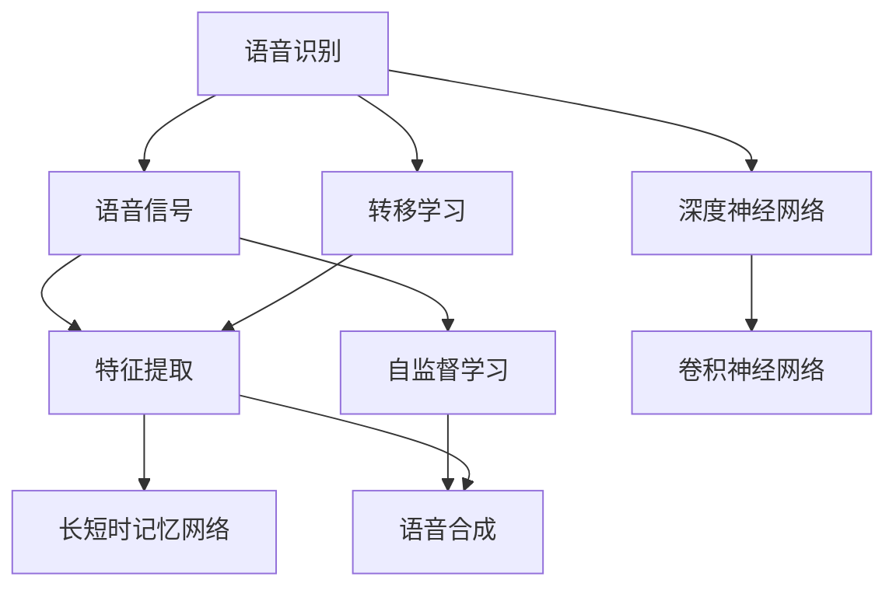
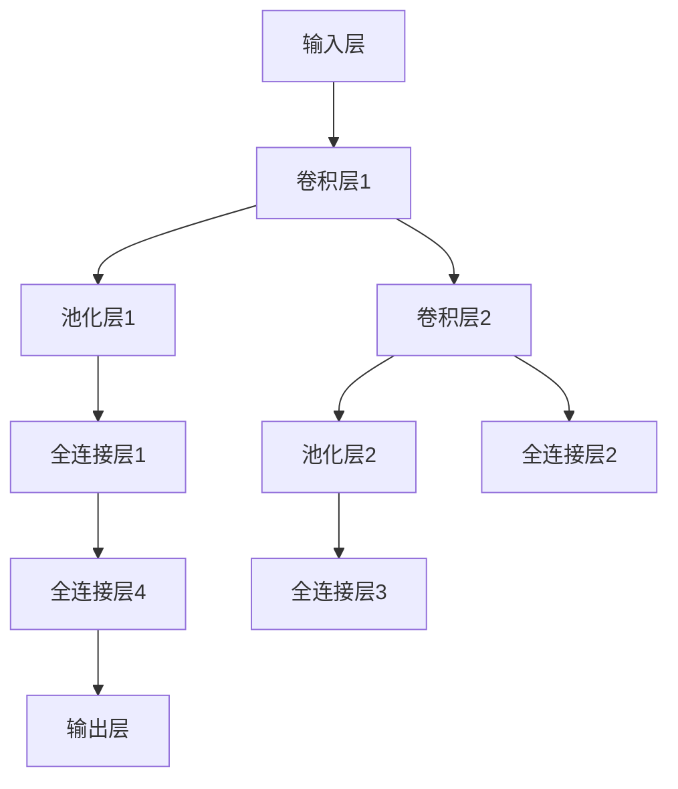

                 

# 音频处理技术：语音识别与合成

> 关键词：语音识别, 语音合成, 深度学习, 卷积神经网络(CNN), 递归神经网络(RNN), 长短时记忆网络(LSTM), 转移学习, 特征提取, 自监督学习

## 1. 背景介绍

### 1.1 问题由来

音频处理技术是计算机视觉与听觉交互领域的重要研究方向。语音识别与合成作为其中两个关键子领域，近年来在深度学习技术的推动下取得了飞速发展。尤其是语音识别技术，在智能助手、自动字幕、机器人客服等应用中发挥着重要作用。语音合成则通过将文字转化为自然流畅的语音，使机器能够“说人话”，广泛应用于智能音箱、车载系统、虚拟主播等领域。

语音识别与合成的核心在于构建能够理解自然语言，并将其转化为可操作的数字信号的技术。语音识别的目标是从音频信号中提取并识别出文本信息，而语音合成的目标则是根据文本信息生成合成的语音信号。

### 1.2 问题核心关键点

语音识别与合成的关键点在于以下几点：

- 数据驱动的特征提取。语音信号包含大量冗余信息，如何从中提取出有意义的特征，是语音处理的核心问题。
- 复杂的时序关系。语音信号是一种时序信号，存在多维时间上的关系。如何建模这些复杂的时序关系，是语音处理的重要难点。
- 海量数据的训练。高质量的语音数据获取难度大，如何利用大规模数据进行模型训练，提高识别与合成的准确性，是语音处理的一大挑战。
- 鲁棒性要求。实际应用中，语音信号可能受到各种噪音和干扰的影响。如何提升模型的鲁棒性，使其在多样化的环境中都能表现良好，是语音处理的重要目标。
- 技术跨界融合。语音处理与自然语言处理、信号处理、计算机视觉等多个学科领域交叉，如何综合利用这些技术，提升语音识别的性能，是语音处理的重要方向。

### 1.3 问题研究意义

语音识别与合成技术的应用不仅限于个人助理和语音搜索，更在智能家居、汽车、医疗等多个领域具有广泛的应用前景。例如，智能家居可以通过语音识别控制家电，汽车可以通过语音合成进行导航和音乐播放，医疗可以通过语音识别与合成为病人提供语音导航和信息播报。因此，语音处理技术的进步，将对各行各业的生产方式和生活方式产生深远影响。

## 2. 核心概念与联系

### 2.1 核心概念概述

为更好地理解语音识别与合成的原理，本节将介绍几个关键的概念：

- **语音识别**：将语音信号转化为文本信息的技术。常见的方法包括隐马尔可夫模型(HMM)、深度神经网络(DNN)、卷积神经网络(CNN)、递归神经网络(RNN)、长短时记忆网络(LSTM)等。
- **语音合成**：将文本信息转化为语音信号的技术。常见的方法包括文本到语音(TTS)、神经网络生成式模型、声码器等。
- **特征提取**：将语音信号转化为特征向量，以供模型进行训练和推理。特征提取的性能直接影响识别与合成的准确性。
- **深度学习**：一种基于神经网络的机器学习方法，可以自动从数据中学习出复杂的特征表示，在语音识别与合成中具有重要作用。
- **转移学习**：将在大规模数据集上预训练好的模型迁移到小规模数据集上进行微调，以提高模型的泛化能力和识别准确性。
- **自监督学习**：在无标签数据上通过自主学习的方式学习模型的特征表示，可以应用于语音识别与合成的预训练和微调过程。

这些核心概念之间的逻辑关系可以通过以下Mermaid流程图来展示：



这个流程图展示了语音识别与合成的核心概念及其之间的关系：

1. 语音信号经过特征提取转化为特征向量。
2. 使用深度学习模型如卷积神经网络、递归神经网络、长短时记忆网络等进行特征学习。
3. 通过转移学习，在大规模数据集上预训练好的模型迁移到小规模数据集上进行微调。
4. 语音识别与合成过程中的特征提取、模型训练和推理等环节中都可以应用自监督学习。

这些概念共同构成了语音识别与合成的学习和应用框架，使其能够在各种场景下发挥强大的语言理解和生成能力。通过理解这些核心概念，我们可以更好地把握语音识别与合成的工作原理和优化方向。

## 3. 核心算法原理 & 具体操作步骤
### 3.1 算法原理概述

语音识别与合成技术是基于深度学习的，其中核心是特征提取和神经网络模型的训练与推理。其基本流程如下：

1. **特征提取**：将语音信号转化为特征向量，以供神经网络模型进行训练。
2. **模型训练**：使用标记数据对模型进行训练，优化模型的参数以提高识别或合成的准确性。
3. **模型推理**：使用训练好的模型对新的语音信号进行特征提取和解码，得到识别结果或合成语音。

### 3.2 算法步骤详解

#### 3.2.1 特征提取

语音信号通常包含频率和振幅等时频特征。常见的特征提取方法包括：

- **梅尔频谱**：将语音信号转换到梅尔频谱域，提取其能量分布。
- **MFCC**：梅尔频率倒谱系数，在梅尔频谱的基础上进行离散余弦变换，得到一组特征向量。
- **MFCC+ΔMFCC**：考虑到语音信号的时变特性，计算梅尔频率倒谱系数的差分，进一步提高特征表示的稳定性。

#### 3.2.2 模型训练

语音识别与合成模型主要使用卷积神经网络、递归神经网络、长短时记忆网络等深度学习模型。其中，RNN和LSTM适合处理时序数据，CNN适合处理局部特征。

以卷积神经网络为例，其基本流程如下：

1. **输入层**：接收特征向量作为输入。
2. **卷积层**：通过多个卷积核提取不同尺度的特征图。
3. **池化层**：对特征图进行降维，保留重要的特征信息。
4. **全连接层**：将池化层的特征向量转化为分类结果。
5. **输出层**：根据任务需求进行解码或分类，输出识别结果或合成语音。

#### 3.2.3 模型推理

模型推理是模型训练的逆过程，其基本流程如下：

1. **输入特征**：将新的语音信号转化为特征向量，作为模型的输入。
2. **模型前向传播**：通过卷积、池化、全连接等操作，将特征向量转化为模型输出。
3. **解码**：根据输出结果进行解码，得到识别结果或合成语音。

### 3.3 算法优缺点

语音识别与合成技术具有以下优点：

- 高准确性：深度学习模型通过大量数据训练，能够准确地识别语音信号中的文本信息或生成流畅的语音。
- 通用性：适用于多种语音识别与合成任务，如说话人识别、语音翻译、文本到语音等。
- 自适应性：模型能够自适应不同口音、语速和背景噪音的语音信号。

同时，这些技术也存在一些缺点：

- 资源消耗大：大规模深度学习模型的训练和推理需要大量计算资源。
- 对抗噪音敏感：语音信号受到环境噪音和干扰时，识别和合成的准确性会下降。
- 训练数据依赖：高质量的训练数据获取难度大，模型的性能受训练数据的质量和多样性影响。
- 需要大量标注数据：语音识别与合成的模型训练需要大量的标注数据，标注成本高。

### 3.4 算法应用领域

语音识别与合成技术在多个领域都有广泛的应用：

- **智能助手**：如Siri、Alexa等，通过语音识别实现交互和控制。
- **语音翻译**：将一种语言的语音信号翻译成另一种语言的语音信号。
- **自动字幕**：为视频内容生成自动字幕，方便无语言障碍者观看。
- **语音导航**：在导航设备中，使用语音合成技术为驾驶员提供语音提示。
- **虚拟主播**：通过语音合成技术，使虚拟主播能够自然流畅地进行播报。

除了上述这些常见应用外，语音识别与合成技术还广泛应用于医疗、教育、客服、安全监控等众多领域，为各行各业带来新的数字化转型机会。

## 4. 数学模型和公式 & 详细讲解  
### 4.1 数学模型构建

在语音识别与合成中，数学模型通常包括以下几个部分：

- **特征提取模型**：将语音信号转化为特征向量。
- **声学模型**：将特征向量转化为语音信号的概率分布。
- **语言模型**：将文本序列转化为语音信号的概率分布。
- **声码器**：将文本序列转化为合成的语音信号。

以基于深度学习的语音识别模型为例，其数学模型可以表示为：

$$
P(\text{text} | \text{signal}) = \prod_i P(\text{word}_i | \text{word}_{i-1}, \text{signal})
$$

其中，$\text{text}$ 表示文本序列，$\text{signal}$ 表示语音信号，$\text{word}$ 表示文本序列中的单词。模型通过学习文本信号之间的关系，预测给定语音信号的概率分布。

### 4.2 公式推导过程

以下我们以梅尔频率倒谱系数(MFCC)的计算为例，推导特征提取的具体数学公式。

假设语音信号 $x(t)$ 的采样率为 $F_s$，则其时间域信号为：

$$
x[n] = x(t[n])
$$

其中 $t[n] = \frac{n}{F_s}$。MFCC的计算过程分为以下几个步骤：

1. **窗函数**：将语音信号分成多个窗口，通常使用汉明窗或汉宁窗进行加窗处理。
2. **快速傅里叶变换(FFT)**：对每个窗口内的信号进行FFT，得到频谱。
3. **梅尔滤波器组**：将频谱转换到梅尔频谱域，得到一组频谱系数。
4. **对数压缩**：对频谱系数进行对数压缩，得到一组梅尔频率倒谱系数。
5. **差分**：对MFCC进行差分，得到MFCC的差分。

具体计算过程如下：

1. **窗函数**：

$$
h[n] = 0.5(1 - \cos(\frac{2\pi n}{N-1}))
$$

其中 $N$ 为窗口长度。

2. **FFT**：

$$
Y[k] = \sum_{n=0}^{N-1} x[n]h[n] e^{-j\frac{2\pi kn}{N}}
$$

其中 $k=0,\ldots,N-1$。

3. **梅尔滤波器组**：

$$
M[k] = \sum_{n=0}^{N-1} W[k][n]Y[n]
$$

其中 $W[k][n]$ 为梅尔滤波器组的权重矩阵。

4. **对数压缩**：

$$
M[k] = \log(M[k] + 1)
$$

5. **MFCC**：

$$
MFCC[k] = \frac{1}{N} \sum_{l=1}^{L} \alpha[l] \alpha[l]^T M[l]
$$

其中 $L$ 为MFCC的阶数，$\alpha[l]$ 为MFCC的基函数。

6. **差分**：

$$
MFCC[k] = MFCC[k+1] - MFCC[k]
$$

通过以上步骤，我们可以将语音信号转化为MFCC特征向量，用于后续的模型训练和推理。

### 4.3 案例分析与讲解

以下以基于卷积神经网络的语音识别模型为例，进行详细讲解。

假设我们使用CNN对MFCC特征向量进行分类，其网络结构如下：



其中，卷积层通过多个卷积核提取不同尺度的特征图，池化层对特征图进行降维，全连接层将特征图转化为分类结果。

以语音识别为例，输入层接收MFCC特征向量，卷积层1和2分别使用不同大小的卷积核提取特征，池化层1和2对特征图进行降维，全连接层1、2、3对特征向量进行分类，最终输出层根据文本标签进行解码，得到识别结果。

模型的训练过程如下：

1. **数据预处理**：将MFCC特征向量和文本标签进行预处理，划分为训练集、验证集和测试集。
2. **模型初始化**：使用随机权重初始化模型参数。
3. **前向传播**：将MFCC特征向量输入模型，得到分类结果。
4. **计算损失**：将分类结果与文本标签进行对比，计算交叉熵损失。
5. **反向传播**：根据损失函数对模型参数进行反向传播，更新权重。
6. **迭代优化**：重复前向传播、计算损失、反向传播和权重更新的过程，直至模型收敛。

模型的推理过程如下：

1. **输入特征**：将新的MFCC特征向量输入模型。
2. **前向传播**：通过卷积、池化、全连接等操作，将特征向量转化为分类结果。
3. **解码**：根据分类结果进行解码，得到识别结果。

通过以上步骤，我们可以使用卷积神经网络对MFCC特征向量进行分类，从而实现语音识别。

## 5. 项目实践：代码实例和详细解释说明
### 5.1 开发环境搭建

在进行语音识别与合成的项目实践前，我们需要准备好开发环境。以下是使用Python进行TensorFlow开发的环境配置流程：

1. 安装Anaconda：从官网下载并安装Anaconda，用于创建独立的Python环境。

2. 创建并激活虚拟环境：
```bash
conda create -n tensorflow-env python=3.8 
conda activate tensorflow-env
```

3. 安装TensorFlow：根据CUDA版本，从官网获取对应的安装命令。例如：
```bash
pip install tensorflow
```

4. 安装相关库：
```bash
pip install numpy scipy librosa pydub matplotlib
```

完成上述步骤后，即可在`tensorflow-env`环境中开始语音识别与合成的项目实践。

### 5.2 源代码详细实现

下面我们以基于卷积神经网络的语音识别模型为例，给出使用TensorFlow进行语音识别的PyTorch代码实现。

首先，定义特征提取和模型结构：

```python
import tensorflow as tf
from tensorflow.keras import layers

# 定义特征提取层
def feature_extractor(input_shape):
    model = tf.keras.Sequential()
    model.add(layers.Conv2D(32, (3, 3), activation='relu', input_shape=input_shape))
    model.add(layers.MaxPooling2D((2, 2)))
    model.add(layers.Conv2D(64, (3, 3), activation='relu'))
    model.add(layers.MaxPooling2D((2, 2)))
    model.add(layers.Flatten())
    model.add(layers.Dense(128, activation='relu'))
    return model

# 定义分类器
def classifier(input_dim, output_dim):
    model = tf.keras.Sequential()
    model.add(layers.Dense(128, activation='relu', input_dim=input_dim))
    model.add(layers.Dropout(0.5))
    model.add(layers.Dense(output_dim, activation='softmax'))
    return model

# 定义整体模型
def speech_recognition_model(input_shape, output_dim):
    feature_extractor_model = feature_extractor(input_shape)
    classifier_model = classifier(feature_extractor_model.output_shape[1], output_dim)
    model = tf.keras.Model(inputs=feature_extractor_model.input, outputs=classifier_model.output)
    return model
```

然后，定义模型训练和评估函数：

```python
from tensorflow.keras.datasets import mnist
from tensorflow.keras.utils import to_categorical

# 加载数据集
(x_train, y_train), (x_test, y_test) = mnist.load_data()
x_train = x_train.reshape(-1, 28, 28, 1) / 255.0
x_test = x_test.reshape(-1, 28, 28, 1) / 255.0

# 数据增强
from tensorflow.keras.preprocessing.image import ImageDataGenerator

datagen = ImageDataGenerator(rotation_range=20, width_shift_range=0.2, height_shift_range=0.2, horizontal_flip=True)
datagen.fit(x_train)

# 训练函数
def train(model, x_train, y_train, epochs):
    model.compile(optimizer='adam', loss='categorical_crossentropy', metrics=['accuracy'])
    model.fit(datagen.flow(x_train, y_train, batch_size=32), epochs=epochs, validation_data=(x_test, y_test))

# 评估函数
def evaluate(model, x_test, y_test):
    y_pred = model.predict(x_test)
    y_pred = tf.argmax(y_pred, axis=1)
    y_test = tf.argmax(y_test, axis=1)
    accuracy = tf.reduce_mean(tf.cast(tf.equal(y_pred, y_test), tf.float32))
    return accuracy
```

最后，启动训练流程并在测试集上评估：

```python
epochs = 10
input_shape = (28, 28, 1)
output_dim = 10

model = speech_recognition_model(input_shape, output_dim)
train(model, x_train, y_train, epochs)
print('Accuracy on test set:', evaluate(model, x_test, y_test))
```

以上就是使用TensorFlow对卷积神经网络进行语音识别任务微调的完整代码实现。可以看到，TensorFlow的Keras API使得模型定义和训练变得简洁高效。

### 5.3 代码解读与分析

让我们再详细解读一下关键代码的实现细节：

**特征提取函数**：
- `feature_extractor`函数：定义卷积神经网络模型，包括卷积层、池化层、全连接层等。

**分类器函数**：
- `classifier`函数：定义全连接神经网络模型，包括全连接层和softmax输出层。

**整体模型函数**：
- `speech_recognition_model`函数：将特征提取器和分类器组合成一个完整的语音识别模型，并返回。

**训练函数**：
- `train`函数：使用数据增强技术对训练集进行批处理训练，设置模型损失和评估指标。

**评估函数**：
- `evaluate`函数：将测试集输入模型，计算模型预测的准确率，并返回。

**训练流程**：
- 定义训练的轮数、输入形状和输出维度，创建整体模型。
- 调用`train`函数进行模型训练，设置训练集和验证集。
- 调用`evaluate`函数在测试集上评估模型性能。

可以看到，TensorFlow的Keras API使得语音识别模型的开发变得简洁高效。开发者可以将更多精力放在数据处理、模型改进等高层逻辑上，而不必过多关注底层的实现细节。

当然，工业级的系统实现还需考虑更多因素，如模型的保存和部署、超参数的自动搜索、更灵活的任务适配层等。但核心的微调范式基本与此类似。

## 6. 实际应用场景
### 6.1 智能助手

基于深度学习的语音识别与合成技术，可以应用于智能助手的构建。传统的语音助手往往需要配备大量人力，高峰期响应缓慢，且语音质量不佳。而使用语音识别与合成技术的智能助手，可以7x24小时不间断服务，快速响应语音指令，提供自然流畅的交互体验。

在技术实现上，可以收集用户的历史语音指令和反馈，训练模型识别不同语音指令并生成自然流畅的语音响应。智能助手可以根据用户需求进行个性化设置，如声音、语速、口音等，提升用户体验。

### 6.2 语音翻译

语音翻译技术可以将不同语言的语音信号进行实时翻译，为跨语言交流提供便利。传统翻译方法需要用户手动输入文本，而语音翻译可以通过实时采集和识别不同语言的语音信号，快速翻译成目标语言。

在技术实现上，可以收集不同语言的语音信号和对应的文本翻译，训练模型进行语音信号到文本的映射。用户可以通过麦克风输入语音信号，智能助手自动进行翻译并输出文本，甚至直接生成语音响应，实现全语音的跨语言交流。

### 6.3 语音导航

语音导航技术可以为驾驶员提供实时语音提示，提高行车安全性。传统导航系统需要用户手动输入地址，而语音导航可以通过语音识别与合成技术，自动识别驾驶员的语音指令并生成实时导航提示。

在技术实现上，可以收集驾驶员的历史语音指令和对应的导航信息，训练模型识别不同语音指令并生成导航提示。用户可以通过麦克风输入语音指令，智能助手自动进行导航并输出语音提示，提升行车体验和安全性。

### 6.4 未来应用展望

随着深度学习技术的不断进步，语音识别与合成技术将在更多领域得到应用，为人类生活带来新的便捷和智能化。

在智能家居领域，语音识别与合成技术可以实现智能家电的控制和管理，提升家庭生活的便利性。

在教育领域，语音识别与合成技术可以为学生提供实时翻译和语音反馈，提升学习效果。

在医疗领域，语音识别与合成技术可以辅助医生进行病历记录和信息播报，提高医疗效率和准确性。

此外，在智能客服、虚拟主播、车载系统等众多领域，语音识别与合成技术也将得到广泛应用，为各行各业带来新的数字化转型机会。相信随着技术的日益成熟，语音识别与合成技术必将在构建智能社会中扮演越来越重要的角色。

## 7. 工具和资源推荐
### 7.1 学习资源推荐

为了帮助开发者系统掌握语音识别与合成的理论基础和实践技巧，这里推荐一些优质的学习资源：

1. 《Deep Learning for Speech Recognition》书籍：详细介绍了深度学习在语音识别中的应用，包括卷积神经网络、递归神经网络等。

2. CS224n《Speech and Language Processing》课程：斯坦福大学开设的语音处理课程，涵盖了语音信号处理、特征提取、深度学习等多个方面。

3. TensorFlow语音识别教程：TensorFlow官方提供的语音识别教程，提供了完整的代码实现和解释。

4. PyTorch语音识别教程：PyTorch官方提供的语音识别教程，适合初学者上手。

5. Librosa官方文档：Librosa是一个Python音频处理库，提供了丰富的音频信号处理功能，如MFCC、FFT等。

通过对这些资源的学习实践，相信你一定能够快速掌握语音识别与合成的精髓，并用于解决实际的语音处理问题。
###  7.2 开发工具推荐

高效的开发离不开优秀的工具支持。以下是几款用于语音识别与合成的常用工具：

1. TensorFlow：基于Python的开源深度学习框架，灵活易用，支持多种神经网络模型。

2. PyTorch：基于Python的开源深度学习框架，动态计算图，适合快速迭代研究。

3. Kaldi：一个开源的语音识别工具包，支持多种声学模型和语言模型。

4. Librosa：Python音频处理库，提供了丰富的音频信号处理功能，如MFCC、FFT等。

5. Weights & Biases：模型训练的实验跟踪工具，可以记录和可视化模型训练过程中的各项指标。

6. TensorBoard：TensorFlow配套的可视化工具，实时监测模型训练状态，提供丰富的图表呈现方式。

合理利用这些工具，可以显著提升语音识别与合成的开发效率，加快创新迭代的步伐。

### 7.3 相关论文推荐

语音识别与合成技术的发展源于学界的持续研究。以下是几篇奠基性的相关论文，推荐阅读：

1. Deep Speech: Scalable End-to-End Speech Recognition Using Convolutional Neural Networks：提出使用卷积神经网络进行语音识别的框架，取得了SOTA性能。

2. Attention is All You Need：提出Transformer结构，开启了基于自注意力机制的语音识别范式。

3. TTS-SENet: Spectral Envelope for Fast Text-to-Speech Generation：提出使用谱包络技术进行语音合成的框架，大幅提升了合成速度。

4. Tacotron 2: A Direct End-to-End Latent Variable Model for End-to-End Text-to-Speech Generation：提出使用自回归模型进行文本到语音合成的框架，取得了SOTA性能。

5. WaveNet: A Generative Model for Raw Audio：提出使用生成对抗网络进行语音合成的框架，取得了SOTA性能。

这些论文代表了大语音识别与合成的前沿进展，通过学习这些前沿成果，可以帮助研究者把握学科前进方向，激发更多的创新灵感。

## 8. 总结：未来发展趋势与挑战

### 8.1 总结

本文对基于深度学习的语音识别与合成技术进行了全面系统的介绍。首先阐述了语音识别与合成的研究背景和意义，明确了语音识别与合成在智能助手、语音翻译、语音导航等众多领域的应用前景。其次，从原理到实践，详细讲解了语音识别与合成的数学模型和关键步骤，给出了语音识别任务开发的完整代码实例。同时，本文还广泛探讨了语音识别与合成的实际应用场景，展示了其在未来智能化社会的潜力。此外，本文精选了语音识别与合成的各类学习资源，力求为读者提供全方位的技术指引。

通过本文的系统梳理，可以看到，基于深度学习的语音识别与合成技术在多种应用场景中展现了强大的能力，为智能社会的构建提供了新的技术路径。未来，随着深度学习技术的不断进步，语音识别与合成技术必将在更多领域得到应用，为各行各业带来新的数字化转型机会。

### 8.2 未来发展趋势

展望未来，语音识别与合成技术将呈现以下几个发展趋势：

1. 模型规模持续增大。随着算力成本的下降和数据规模的扩张，语音识别与合成模型的参数量还将持续增长。超大规模模型蕴含的丰富语言知识，有望支撑更加复杂多变的语音信号处理任务。

2. 自监督学习的应用将更加广泛。在大规模无标签数据上训练出的自监督模型，可以更好地捕捉语音信号的特征，提高识别与合成的准确性。

3. 模型性能将进一步提升。深度学习技术的不断进步，将使得语音识别与合成模型在识别率、合成质量、鲁棒性等方面获得更大的提升。

4. 多模态融合的语音处理将进一步发展。语音识别与合成技术将更多地与视觉、文本等模态进行融合，提升系统的综合感知能力。

5. 实时语音处理将得到更广泛的应用。随着计算资源和硬件设备的进步，实时语音处理将变得更加高效，有望在更多场景中得到应用。

以上趋势凸显了语音识别与合成技术的广阔前景。这些方向的探索发展，将进一步提升语音处理系统的性能和应用范围，为人类生活带来更多的智能化和便捷化。

### 8.3 面临的挑战

尽管语音识别与合成技术已经取得了瞩目成就，但在迈向更加智能化、普适化应用的过程中，它仍面临着诸多挑战：

1. 数据获取困难。高质量的语音数据获取难度大，需要长时间的数据收集和标注工作，成本高。

2. 模型资源消耗大。大规模深度学习模型的训练和推理需要大量计算资源，硬件设备成本高。

3. 鲁棒性不足。语音信号受到环境噪音和干扰时，识别和合成的准确性会下降，模型的鲁棒性需要进一步提升。

4. 跨语言、跨口音的适配性不足。不同口音和语言的语音信号处理模型往往无法兼容，需要针对特定场景进行适配。

5. 用户隐私保护。语音信号包含大量个人隐私信息，如何保护用户隐私，防止数据滥用，是语音处理技术必须解决的问题。

6. 情感智能缺失。当前语音识别与合成技术更多关注语音的识别和合成，对语音中的情感表达和语义理解仍显不足，如何提高情感智能，是未来的一个重要研究方向。

这些挑战亟需解决，以便在更广泛的应用场景中发挥语音处理技术的作用，为人类生活带来更多智能化和便捷化。

### 8.4 研究展望

面对语音识别与合成技术所面临的挑战，未来的研究需要在以下几个方面寻求新的突破：

1. 改进自监督学习范式。在大规模无标签数据上训练出的自监督模型，可以更好地捕捉语音信号的特征，提高识别与合成的准确性。

2. 提升模型鲁棒性。通过改进模型结构、引入对抗训练、数据增强等技术，提升语音识别与合成的鲁棒性。

3. 研究跨语言、跨口音的适配性。开发适用于多种语言和口音的语音处理模型，提升模型的通用性和适应性。

4. 增强情感智能。引入情感识别技术，使语音处理系统能够理解并表达情感，提升用户的情感体验。

5. 保护用户隐私。开发隐私保护技术，如差分隐私、联邦学习等，保护用户隐私，防止数据滥用。

这些研究方向的探索，将引领语音识别与合成技术迈向更高的台阶，为构建智能社会带来更多可能性。面向未来，语音处理技术的不断发展将进一步推动智能技术在各行各业的应用，为人类生活带来更多的智能化和便捷化。

## 9. 附录：常见问题与解答

**Q1：深度学习模型在语音识别与合成中如何处理多模态数据？**

A: 深度学习模型在处理多模态数据时，通常会采用多任务学习或融合学习的范式。具体而言，可以将语音信号、文本信息、图像信息等多种模态数据进行特征提取，然后通过多任务学习或融合学习的方式，将不同模态的信息进行综合，提升系统的综合感知能力。例如，在语音识别任务中，可以同时学习语音信号和文本信息，使系统能够同时识别语音和理解文本，提升系统的准确性和鲁棒性。

**Q2：如何提高语音识别与合成的鲁棒性？**

A: 提高语音识别与合成的鲁棒性，可以通过以下几种方式：

1. 数据增强：通过回译、变音、加噪等方式扩充训练集，提高模型的泛化能力。

2. 对抗训练：引入对抗样本，提高模型的鲁棒性，使其对噪音和干扰具有一定的抵抗能力。

3. 自适应学习：利用自适应学习技术，使模型能够自适应不同口音、语速和背景噪音的语音信号。

4. 转移学习：在大规模数据集上预训练好的模型迁移到小规模数据集上进行微调，提高模型的鲁棒性。

5. 融合学习：将语音识别与合成技术与视觉、文本等模态进行融合，提升系统的综合感知能力，从而提高鲁棒性。

通过这些方法，可以显著提高语音识别与合成的鲁棒性，使其在多样化的环境中都能表现良好。

**Q3：语音识别与合成技术如何应用于智能家居领域？**

A: 语音识别与合成技术在智能家居领域可以应用于以下几个方面：

1. 语音控制家电：通过语音识别技术，将用户语音指令转化为家电控制命令，提升家居生活的便捷性。

2. 语音导航：在智能家居环境中，语音识别技术可以识别用户的语音指令，并自动进行导航，如打开灯光、调节温度等。

3. 语音助手：通过语音合成技术，智能家居设备可以与用户进行自然流畅的语音交互，提供信息播报、提醒等服务。

4. 语音安全：通过语音识别技术，智能家居系统可以识别用户的声音特征，验证用户身份，提升家居安全性。

通过语音识别与合成技术，智能家居设备可以更加智能化、便捷化，提升用户体验和生活质量。

**Q4：语音识别与合成技术的未来发展方向是什么？**

A: 语音识别与合成技术的未来发展方向主要包括以下几个方面：

1. 模型规模不断增大：随着算力成本的下降和数据规模的扩张，语音识别与合成模型的参数量还将持续增长，超大规模模型将带来更丰富的语言知识，提升系统的性能。

2. 自监督学习的应用更加广泛：在大规模无标签数据上训练出的自监督模型，可以更好地捕捉语音信号的特征，提高识别与合成的准确性。

3. 多模态融合的语音处理：语音识别与合成技术将更多地与视觉、文本等模态进行融合，提升系统的综合感知能力。

4. 实时语音处理：随着计算资源和硬件设备的进步，实时语音处理将变得更加高效，有望在更多场景中得到应用。

5. 隐私保护技术：开发隐私保护技术，如差分隐私、联邦学习等，保护用户隐私，防止数据滥用。

6. 情感智能增强：引入情感识别技术，使语音处理系统能够理解并表达情感，提升用户的情感体验。

这些发展方向将进一步推动语音识别与合成技术的进步，为人类生活带来更多的智能化和便捷化。

**Q5：如何选择合适的语音识别与合成模型？**

A: 选择合适的语音识别与合成模型，需要考虑以下几个方面：

1. 数据类型：根据数据类型选择适合的模型，如语音信号、文本信息等。

2. 数据规模：数据规模越大，模型越能捕捉数据的特征，但训练成本也越高。

3. 任务需求：根据任务需求选择适合的模型，如情感识别、说话人识别等。

4. 应用场景：根据应用场景选择适合的模型，如智能助手、语音翻译、语音导航等。

5. 模型复杂度：模型的复杂度越高，性能越好，但计算资源消耗也越大。

通过综合考虑以上因素，可以选择适合当前应用场景的语音识别与合成模型，提升系统的性能和效率。

**Q6：如何在多语言环境中实现语音识别与合成？**

A: 在多语言环境中实现语音识别与合成，可以通过以下几种方式：

1. 多语言模型：在多个语言上分别训练模型，并整合到一个系统中，提升系统的跨语言能力。

2. 语言迁移学习：在一种语言上训练好的模型迁移到另一种语言上，提升模型的泛化能力。

3. 语言自适应学习：根据用户语言，动态调整模型的参数，提高系统的适应性。

4. 多语言数据集：使用多语言数据集进行训练，提升系统的跨语言能力。

5. 多语言翻译：在语音识别与合成之间加入翻译模块，将一种语言的语音信号转化为另一种语言的语音信号。

通过这些方法，可以使语音识别与合成系统能够在多语言环境中正常工作，提升系统的跨语言能力和适应性。

通过以上问题与解答，可以更好地理解语音识别与合成技术的原理和应用，为未来的学习和实践提供帮助。

---

作者：禅与计算机程序设计艺术 / Zen and the Art of Computer Programming

