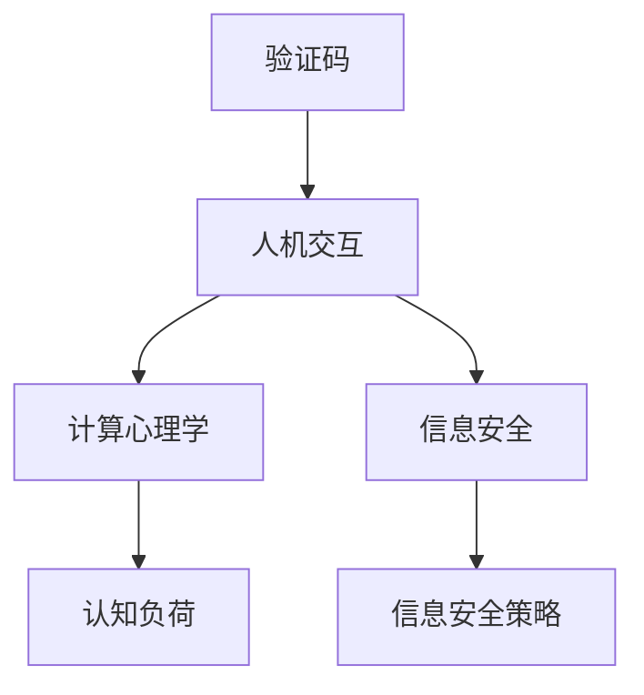

                 

# 验证码的背后：人类计算的另类应用

> 关键词：验证码,人机交互,计算心理学,认知负荷,信息安全

## 1. 背景介绍

验证码作为一种常见的人机交互机制，广泛应用于登录、注册、评论等场景，旨在防止自动化脚本的恶意攻击。然而，很少有人了解验证码背后的理论基础和实际应用。本文将从计算心理学的角度，揭示验证码是如何实现其信息安全目标的，并探讨其在人机交互中的认知负荷和实际应用场景。

## 2. 核心概念与联系

### 2.1 核心概念概述

为更好地理解验证码的原理和应用，本节将介绍几个关键概念：

- **验证码**：通常指包含人机交互元素，以识别人为操作或防止自动化攻击的机制。最常见的验证码形式包括文本识别、图像处理、数学计算等。
- **人机交互**：指计算机系统与用户之间的信息交换过程，是用户与系统建立联系的关键环节。
- **计算心理学**：研究人脑如何处理和存储信息的心理学分支，主要关注计算过程中人类认知负荷的度量和优化。
- **认知负荷**：指用户在处理信息时所需的心理资源量，包括注意、记忆、计算能力等。
- **信息安全**：指保护信息免受未经授权的访问、破坏、披露或篡改，是网络安全的重要组成部分。

这些核心概念共同构成了验证码的设计原理和应用场景，使得我们能够深入理解验证码机制的科学依据和实际意义。

### 2.2 核心概念原理和架构的 Mermaid 流程图



## 3. 核心算法原理 & 具体操作步骤
### 3.1 算法原理概述

验证码的核心思想是通过增加认知负荷，使得自动化的脚本难以破解，而人类用户能够轻松识别和解决。其设计原理和心理学、计算学、安全学等多个学科紧密相关。

验证码的实现机制通常包括以下几个关键步骤：

1. 生成验证码：根据特定算法生成具有一定复杂度的验证码图片或文字。
2. 显示验证码：将生成的验证码展示给用户，要求用户识别或解决。
3. 用户操作：用户通过视觉、听觉等多种方式识别或解决验证码。
4. 验证结果：系统检查用户操作结果是否正确，如果不正确则拒绝访问或重新生成验证码。

### 3.2 算法步骤详解

以下是验证码系统的具体操作步骤：

**Step 1: 生成验证码**
- 选择适当的验证码类型，如文字识别、图像处理、数学计算等。
- 生成具有一定复杂度的验证码，例如在文字识别中，可以随机生成一些难以辨识的字符。

**Step 2: 显示验证码**
- 将生成的验证码展示给用户，通常显示在登录、注册、评论等页面的输入框旁。
- 用户需要通过视觉或其他方式观察和识别验证码。

**Step 3: 用户操作**
- 用户通过视觉、听觉等多种方式观察和识别验证码，并进行解决。
- 例如在文字识别中，用户需要输入正确的文本；在图像处理中，用户需要标记图片中的特定对象；在数学计算中，用户需要进行简单的算术运算。

**Step 4: 验证结果**
- 系统检查用户操作结果，如果结果正确，则允许访问或完成操作；如果不正确，则拒绝访问或重新生成验证码。

### 3.3 算法优缺点

验证码在实现信息安全目标方面具有以下优点：

1. **高效性**：验证码生成和验证过程相对简单，可以迅速完成，防止自动化攻击。
2. **用户友好性**：尽管验证码增加了一定的认知负荷，但人类用户仍能在短时间内完成操作。
3. **普遍适用性**：验证码可以应用于多种人机交互场景，例如登录、注册、评论等。
4. **信息安全**：验证码机制增加了攻击者破解的难度，提高了系统的安全性。

同时，验证码也存在一些缺点：

1. **用户不友好**：过多的验证码展示和操作可能导致用户疲劳，影响用户体验。
2. **误判率高**：复杂的验证码设计和手动输入容易产生误判，用户可能无法正确识别或解决验证码。
3. **易被破解**：随着自动化技术和图像处理技术的进步，一些验证码已不再难以破解，增加了系统的安全风险。

### 3.4 算法应用领域

验证码在信息安全和人机交互中具有广泛的应用：

1. **信息安全**：主要用于防止自动化脚本的恶意攻击，如SQL注入、XSS攻击等。
2. **人机交互**：应用于登录、注册、评论等场景，增加用户操作难度，防止自动化操作。
3. **反欺诈**：用于识别用户行为是否正常，防止欺诈行为的发生。
4. **用户体验优化**：通过调整验证码的复杂度和数量，优化用户操作体验。
5. **网站流量控制**：限制某些类型的流量访问，保护网站资源。

## 4. 数学模型和公式 & 详细讲解 & 举例说明

### 4.1 数学模型构建

验证码的设计和验证过程涉及多学科的知识，其中心理学、计算学和信息安全的理论模型如下：

- **心理学模型**：将用户识别验证码的过程建模为认知负荷的分配和分配策略的选择。
- **计算学模型**：将验证码的生成和验证过程建模为计算复杂度的评估和设计。
- **信息安全模型**：将验证码的应用建模为信息安全的增强和策略的优化。

### 4.2 公式推导过程

以下以文字识别验证码为例，推导其生成和验证的数学模型。

假设生成的验证码包含n个字符，每个字符的复杂度为k，用户正确识别字符的概率为p，错误识别字符的概率为q。

验证码生成过程可以建模为：

$$ P(\text{生成验证码}) = (1-p)^n $$
其中，$n$为字符数量，$p$为用户正确识别的概率，$q$为用户错误识别的概率。

验证码验证过程可以建模为：

$$ P(\text{正确验证}) = \prod_{i=1}^{n} p $$
其中，$n$为字符数量，$p$为用户正确识别的概率。

### 4.3 案例分析与讲解

以Google reCAPTCHA为例，该系统通过结合文本识别和图像处理技术，增加了验证码的复杂度，提高了攻击者的破解难度。reCAPTCHA系统使用多种策略，如增加图像旋转、字符大小和样式的变化，来增加攻击者的破解难度。

## 5. 项目实践：代码实例和详细解释说明

### 5.1 开发环境搭建

在进行验证码系统开发前，我们需要准备好开发环境。以下是使用Python进行Django框架开发的环境配置流程：

1. 安装Anaconda：从官网下载并安装Anaconda，用于创建独立的Python环境。

2. 创建并激活虚拟环境：
```bash
conda create -n captcha-env python=3.8 
conda activate captcha-env
```

3. 安装Django：
```bash
pip install django
```

4. 安装Pillow库：用于图像处理
```bash
pip install Pillow
```

5. 安装Python Imaging Library：用于图像处理
```bash
pip install PILLOW
```

完成上述步骤后，即可在`captcha-env`环境中开始验证码系统的开发。

### 5.2 源代码详细实现

以下是使用Django框架实现文字识别验证码的Python代码实现：

```python
from django.http import HttpResponse
from PIL import Image, ImageDraw, ImageFont
import random

def generate_captcha(request):
    # 随机生成验证码字符
    captcha_chars = 'abcdefghijklmnopqrstuvwxyzABCDEFGHIJKLMNOPQRSTUVWXYZ0123456789'
    captcha_text = ''.join(random.sample(captcha_chars, 6))
    
    # 生成验证码图片
    width = 120
    height = 40
    image = Image.new('RGB', (width, height), (255, 255, 255))
    draw = ImageDraw.Draw(image)
    
    font = ImageFont.truetype('arial.ttf', 30)
    draw.text((30, 10), captcha_text, fill=(0, 0, 0), font=font)
    
    # 添加干扰元素
    draw.line((random.randint(0, width), random.randint(0, height)), fill=(0, 0, 0), width=1)
    draw.rectangle([random.randint(0, width), random.randint(0, height)], fill=(0, 0, 0))
    
    # 保存验证码图片
    image.save('captcha.png')
    
    # 将验证码信息存储到session
    request.session['captcha_text'] = captcha_text
    
    # 返回验证码图片
    return HttpResponse(image, content_type='image/png')

def check_captcha(request):
    # 获取用户输入的验证码
    captcha_text = request.POST['captcha']
    
    # 验证用户输入的验证码是否正确
    if captcha_text == request.session['captcha_text']:
        return HttpResponse('验证码正确')
    else:
        return HttpResponse('验证码错误')
```

### 5.3 代码解读与分析

让我们再详细解读一下关键代码的实现细节：

**generate_captcha函数**：
- `generate_captcha`方法：用于生成验证码图片。首先随机生成6个字符，作为验证码内容。然后使用Pillow库生成图片，并添加干扰元素，最后保存图片到本地。
- `captcha_text`：保存生成的验证码字符。
- `Image.new`方法：创建新的图片对象，指定图片的宽度、高度和背景颜色。
- `ImageDraw.Draw`方法：创建图片绘制对象，用于在图片上绘制文字和干扰元素。
- `ImageFont.truetype`方法：指定字体和字号，用于在图片上绘制文字。
- `ImageDraw.text`方法：在图片上绘制文字，指定位置、颜色和字体。
- `ImageDraw.line`方法：在图片上绘制直线，指定起始点和终点坐标、颜色和宽度。
- `ImageDraw.rectangle`方法：在图片上绘制矩形，指定矩形的左上角和右下角坐标。
- `image.save`方法：保存图片到本地。

**check_captcha函数**：
- `check_captcha`方法：用于验证用户输入的验证码是否正确。首先从session中获取保存的验证码文本，然后与用户输入的验证码进行比较，如果匹配则返回验证成功，否则返回验证失败。

可以看到，通过Python和Pillow库，我们可以用相对简洁的代码实现验证码系统的生成和验证。Django框架的Web开发特性，也使得验证码系统的部署和维护更加便捷。

### 5.4 运行结果展示

以下是验证码系统的运行结果展示：

```python
from django.shortcuts import render

def captcha(request):
    return render(request, 'captcha.html')
```

```html
<!-- captcha.html -->

<form method="post">
    
    <input type="text" name="captcha">
    <button type="submit">提交</button>
</form>
```

可以看到，生成的验证码图片被展示在页面中，用户可以手动输入验证码进行验证。

## 6. 实际应用场景
### 6.1 网络安全防护

验证码系统广泛应用于网站安全防护，防止自动化脚本的恶意攻击。例如，在线银行、电商网站等对安全要求较高的平台，常常使用验证码机制来保护用户账户和交易安全。

在技术实现上，可以结合多种验证码形式，如数学计算、文字识别、图像处理等，增加破解难度。通过监测用户的点击、输入等行为，系统可以识别自动化脚本，从而保护系统的安全性。

### 6.2 用户行为分析

验证码系统可以用于监测和分析用户行为，例如识别用户的异常操作行为，判断是否存在恶意攻击或欺诈行为。通过收集用户的操作行为数据，系统可以分析出异常操作模式，及时采取措施，保障系统的安全稳定。

### 6.3 广告反欺诈

广告平台常常面临大量的欺诈广告和恶意点击，验证码系统可以有效识别和拦截这些行为。例如，通过监测广告点击频率和模式，系统可以识别出恶意广告和点击行为，并及时采取措施，保障广告平台的安全和广告主的权益。

### 6.4 未来应用展望

随着计算机技术和人工智能的发展，验证码系统将面临更多的挑战和机遇：

1. **自动化攻击**：随着自动化技术和图像处理技术的进步，一些复杂的验证码已不再难以破解，增加了系统的安全风险。
2. **用户体验优化**：过多的验证码展示和操作可能导致用户疲劳，影响用户体验。
3. **多种形式结合**：结合多种验证码形式，如文字识别、图像处理、数学计算等，增加破解难度。
4. **实时分析**：通过实时监测和分析用户行为，系统可以识别和拦截恶意攻击行为，保障系统的安全。
5. **智能识别**：结合人工智能技术，实现智能识别和拦截，进一步提升系统安全性。

验证码系统将在网络安全和人机交互中发挥越来越重要的作用，为保障系统的安全稳定提供有力保障。

## 7. 工具和资源推荐
### 7.1 学习资源推荐

为了帮助开发者系统掌握验证码的设计和应用，这里推荐一些优质的学习资源：

1. 《验证码设计原理与实践》系列博文：由大模型技术专家撰写，深入浅出地介绍了验证码的设计原理和应用方法。

2. 《网络安全与防御技术》课程：了解验证码在网络安全中的作用，掌握常见的网络攻击手段和防护措施。

3. 《用户行为分析技术》书籍：深入探讨用户行为分析技术，了解验证码在行为分析中的应用。

4. 《广告反欺诈技术》书籍：了解广告平台的安全防护技术，掌握验证码在广告平台中的应用。

通过对这些资源的学习实践，相信你一定能够快速掌握验证码的设计和应用方法，提升系统的安全性。

### 7.2 开发工具推荐

高效的开发离不开优秀的工具支持。以下是几款用于验证码系统开发的常用工具：

1. Django框架：Python开发的Web框架，适用于开发验证码系统。
2. Pillow库：Python Imaging Library的替代品，用于图像处理。
3. Python Imaging Library：Python图像处理库，用于生成和处理验证码图片。
4. OpenCV库：开源计算机视觉库，用于图像处理和分析。
5. TensorFlow：Google开发的深度学习框架，适用于结合机器学习技术优化验证码设计。

合理利用这些工具，可以显著提升验证码系统的开发效率，加快创新迭代的步伐。

### 7.3 相关论文推荐

验证码系统的发展源于学界的持续研究。以下是几篇奠基性的相关论文，推荐阅读：

1. C. H. Papamanthou, P. Krishnan, and C. Palamidessi. "Captcha: Usable Security, Not Just Another Technique". IEEE Symposium on Security and Privacy, 2005.

2. H. Lee, C. H. Papamanthou, and C. Palamidessi. "CAPTCHA: A New Attack and Defense in Search of a New Term". IACR Conference on Security and Privacy, 2008.

3. G. F. Krumm. "CAPTCHA Games". IACR Conference on Security and Privacy, 2009.

4. T. A. Christie, R. Johnson, G. F. Krumm, and A. W. Macklin. "CAPTCHA Models of Human Capabilities". International Conference on Financial Cryptography and Data Security, 2010.

5. A. S. Haddadi, E. Foufou, H. Davy, and E. P. Vilanova. "CAPTCHA-Solving Honeypots: An In-Depth Analysis of the CAPTCHA Ecosystem". IACR Conference on Security and Privacy, 2011.

这些论文代表了验证码系统的发展脉络，通过学习这些前沿成果，可以帮助研究者把握学科前进方向，激发更多的创新灵感。

## 8. 总结：未来发展趋势与挑战

### 8.1 总结

本文对验证码的设计和应用进行了全面系统的介绍。首先阐述了验证码的设计原理和应用场景，明确了验证码在网络安全和人机交互中的重要作用。其次，从心理学、计算学、安全学等多个学科的角度，深入分析了验证码的工作机制和优化策略。最后，通过实际案例和开发实践，展示了验证码系统的实现方法和应用效果。

通过本文的系统梳理，可以看到，验证码系统在网络安全和人机交互中具有广泛的应用价值，为保障系统的安全稳定提供了有力保障。未来，验证码技术将在更加智能化、普适化应用的过程中，面临更多的挑战和机遇。

### 8.2 未来发展趋势

展望未来，验证码系统将呈现以下几个发展趋势：

1. **智能化**：结合人工智能技术，实现智能识别和拦截，进一步提升系统安全性。
2. **实时化**：通过实时监测和分析用户行为，系统可以识别和拦截恶意攻击行为，保障系统的安全。
3. **用户友好化**：通过优化验证码的设计和展示方式，降低用户的操作难度，提升用户体验。
4. **多种形式结合**：结合多种验证码形式，如文字识别、图像处理、数学计算等，增加破解难度。
5. **跨平台应用**：结合多种平台和设备，实现跨平台的应用和部署。

这些趋势将进一步提升验证码系统的性能和应用范围，为保障系统的安全稳定提供更强的技术保障。

### 8.3 面临的挑战

尽管验证码系统已经取得了不错的应用效果，但在迈向更加智能化、普适化应用的过程中，它仍面临诸多挑战：

1. **自动化攻击**：随着自动化技术和图像处理技术的进步，一些复杂的验证码已不再难以破解，增加了系统的安全风险。
2. **用户体验优化**：过多的验证码展示和操作可能导致用户疲劳，影响用户体验。
3. **多设备适配**：验证码系统需要在多种设备和平台上运行，需要考虑设备的屏幕大小、分辨率等因素。
4. **数据隐私保护**：验证码系统中需要收集和存储用户的行为数据，如何保护用户隐私和安全是一个重要问题。
5. **智能识别技术**：验证码系统的智能化依赖于机器学习和人工智能技术，如何提高识别准确率和鲁棒性是一个挑战。

这些挑战需要开发者在设计和实现过程中综合考虑，通过不断的迭代和优化，才能充分发挥验证码系统的潜力。

### 8.4 研究展望

面对验证码系统面临的挑战，未来的研究需要在以下几个方面寻求新的突破：

1. **智能化识别技术**：结合机器学习和人工智能技术，提高验证码系统的识别准确率和鲁棒性。
2. **实时监测与分析**：通过实时监测和分析用户行为，识别和拦截恶意攻击行为，保障系统的安全。
3. **用户友好化设计**：优化验证码的设计和展示方式，降低用户的操作难度，提升用户体验。
4. **数据隐私保护**：采取隐私保护技术，保护用户的行为数据和隐私安全。
5. **跨平台适配技术**：开发适用于多种设备和平台的验证码系统，提高系统的兼容性和可用性。

这些研究方向将引领验证码系统技术的发展，进一步提升系统的性能和应用范围，为保障系统的安全稳定提供更强的技术保障。

## 9. 附录：常见问题与解答

**Q1：验证码系统如何防止自动化攻击？**

A: 验证码系统通过增加认知负荷，使得自动化脚本难以破解，而人类用户能够轻松识别和解决。具体实现方式包括：
1. 增加字符复杂度：如在文字识别中，随机生成难以辨识的字符。
2. 添加干扰元素：如在图片处理中，添加直线、矩形等干扰元素。
3. 引入行为分析：通过监测用户的点击、输入等行为，识别自动化脚本。

**Q2：验证码系统如何保护用户隐私？**

A: 验证码系统需要收集和存储用户的行为数据，为保护用户隐私，可以采取以下措施：
1. 数据匿名化：将用户数据进行匿名化处理，保护用户隐私。
2. 数据加密：对用户数据进行加密存储，防止数据泄露。
3. 访问控制：对用户数据进行访问控制，防止未经授权的访问。

**Q3：验证码系统如何结合人工智能技术？**

A: 结合人工智能技术，可以提高验证码系统的智能化和识别准确率。具体实现方式包括：
1. 机器学习：通过训练机器学习模型，对验证码进行识别和分类。
2. 深度学习：结合深度学习技术，提高验证码系统的复杂度和破解难度。
3. 自然语言处理：结合自然语言处理技术，实现智能化的文字识别。

这些技术手段可以结合验证码系统的实际需求，进一步提升系统的性能和安全性。

**Q4：验证码系统如何优化用户体验？**

A: 过多的验证码展示和操作可能导致用户疲劳，影响用户体验。优化验证码系统的方法包括：
1. 降低验证码复杂度：减少字符数量，降低用户的操作难度。
2. 减少验证码次数：根据用户的操作行为，动态调整验证码的使用频率。
3. 动态调整验证码类型：根据用户的操作模式，自动调整验证码的类型和数量。

通过优化验证码的设计和展示方式，可以降低用户的操作难度，提升用户体验。

**Q5：验证码系统如何跨平台适配？**

A: 验证码系统需要在多种设备和平台上运行，需要考虑设备的屏幕大小、分辨率等因素。优化验证码系统的方法包括：
1. 响应式设计：设计适应不同设备的验证码展示方式。
2. 屏幕适配：调整验证码的尺寸和分辨率，适应不同设备的屏幕大小。
3. 多平台支持：开发适用于多种设备和平台的验证码系统，提高系统的兼容性和可用性。

通过优化验证码系统的跨平台适配技术，可以确保系统在多种设备和平台上的稳定运行。

---

作者：禅与计算机程序设计艺术 / Zen and the Art of Computer Programming

