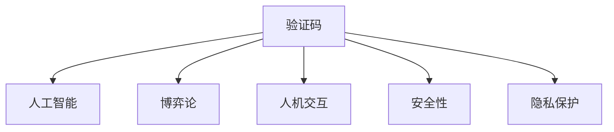

                 

# 验证码：人机交互中的智慧博弈

> 关键词：验证码, 人工智能, 人机交互, 博弈论, 安全, 隐私

## 1. 背景介绍

### 1.1 问题由来
随着互联网和移动互联网的普及，越来越多的应用场景需要用户进行身份验证。为了防范恶意攻击和自动化程序的非授权访问，验证码（CAPTCHA）成为了一种广泛应用的安全措施。验证码通过将复杂的算法隐藏在直观的图像或文字中，要求人类识别而机器难以识别，从而确保了系统访问的安全性和可靠性。

然而，随着技术的进步，验证码系统面临越来越多的挑战。自动化工具不断演进，能够识别并破解简单的验证码，导致验证码系统逐渐失效。因此，开发更加智能、高效的验证码系统，成为了亟待解决的问题。

### 1.2 问题核心关键点
验证码系统的主要目标是设计一种难以被自动化工具识别、同时又能被人类轻松识别的复杂系统。这一目标决定了验证码系统的设计必须综合考虑人机交互、算法设计、安全性等多个方面。

本文将围绕验证码系统的智能博弈设计进行详细探讨，通过博弈论的视角，解析验证码系统的人机交互特性，揭示验证码生成的算法原理，并提出未来的发展方向和挑战。

## 2. 核心概念与联系

### 2.1 核心概念概述

为更好地理解验证码系统的博弈设计，本节将介绍几个密切相关的核心概念：

- **验证码（CAPTCHA）**：一种用于验证用户身份的技术，要求用户通过识别、解答特定问题等方式证明自己是人类而非自动化工具。
- **博弈论**：研究多个参与者策略互动的数学理论，广泛应用于决策分析、优化问题等领域。
- **人机交互（HCI）**：研究人机之间信息交流、反馈机制的学科，验证码系统的设计离不开对用户认知、行为的理解。
- **安全性**：保障系统不受未经授权访问的保护机制，验证码系统设计的核心目标。
- **隐私保护**：确保个人信息在验证过程中不被泄露的措施，验证码系统需要平衡用户隐私与系统安全的需求。

这些核心概念之间的逻辑关系可以通过以下Mermaid流程图来展示：



这个流程图展示了大语言模型的核心概念及其之间的关系：

1. 验证码通过人工智能技术，设计复杂的识别难题。
2. 博弈论用于分析和设计验证码难题的复杂度。
3. 人机交互研究用户认知和行为，优化验证码系统的用户体验。
4. 安全性是验证码系统设计的首要目标，涉及多种防御机制。
5. 隐私保护是验证码系统设计中需要平衡的重要因素。

这些概念共同构成了验证码系统的设计框架，使得验证码在实现安全性的同时，尽可能提升用户体验。

## 3. 核心算法原理 & 具体操作步骤
### 3.1 算法原理概述

验证码系统的算法设计，本质上是一种博弈过程。系统（策略制定者）与攻击者（策略响应者）之间进行一种动态博弈，系统设计者需要通过不断调整验证码的难度和复杂性，使其在人类识别能力和自动化工具识别能力之间找到平衡点。

形式化地，假设验证码系统为 $G$，攻击工具为 $A$，其目标函数为 $f$，表示验证码的识别难度。最优策略为 $s^*$，表示系统设计者应采取的最佳策略，使得攻击者无法破解验证码。最终目标为最大化系统安全性和用户体验，即：

$$
\max_{s^*} \min_{A} f(s^*)
$$

在实践中，验证码系统通常通过以下几个步骤实现这一目标：

1. **问题生成**：设计一个需要人类识别、难以被自动化工具识别的复杂问题。
2. **规则设定**：规定攻击者破解验证码的规则，如最短时间、错误率等。
3. **策略优化**：调整问题生成和规则设定，优化验证码的复杂度和安全性。
4. **用户体验优化**：评估用户体验，调整问题和规则，使其更易于识别。

### 3.2 算法步骤详解

下面以图像验证码为例，详细说明验证码系统的算法步骤：

**Step 1: 问题生成**
- **背景图像**：从大量图片中随机选取一张作为验证码的背景。
- **文本生成**：随机生成一组文本字符，要求不同字符之间有足够的视觉区分度。
- **扭曲变换**：对文本进行旋转、缩放、扭曲等变换，增加识别难度。

**Step 2: 规则设定**
- **时间限制**：设置破解验证码的最短时间。
- **错误率限制**：设置允许的错误率，通常为1%。

**Step 3: 策略优化**
- **识别难度评估**：使用模拟破解程序测试验证码的破解难度，评估破解成功率和所需时间。
- **参数调整**：根据评估结果，调整文本生成、扭曲变换的参数，优化验证码的复杂度。

**Step 4: 用户体验优化**
- **反馈调查**：收集用户识别验证码的反馈，分析用户体验。
- **参数调整**：根据反馈，调整问题生成和规则设定，提升用户体验。

### 3.3 算法优缺点

验证码系统在实现人机交互和博弈平衡方面具有以下优点：
1. 安全性高。复杂的识别难题使得自动化工具难以破解，保障了系统安全。
2. 用户体验良好。系统设计者可以通过用户反馈不断优化验证码，提升用户体验。
3. 可扩展性强。系统可以根据实际需求，灵活调整验证码的复杂度和规则。

同时，验证码系统也存在以下局限性：
1. 用户识别难度高。过于复杂的验证码可能导致用户识别困难，降低用户体验。
2. 攻击工具不断进步。自动化工具逐渐突破验证码的复杂性，验证码系统的安全性和有效性受到威胁。
3. 用户体验和安全性平衡困难。过于简单的验证码容易被自动化工具破解，而复杂的验证码又可能影响用户体验。

尽管存在这些局限性，但验证码系统仍是一种有效的安全措施，适用于需要高安全性的场景，如银行登录、电子邮件注册等。

### 3.4 算法应用领域

验证码系统广泛应用于各种需要验证用户身份的场景，例如：

- 网站注册登录：通过验证码验证用户的身份，防止自动化机器人注册账号。
- 电子邮件注册：对新注册用户进行身份验证，避免垃圾邮件。
- 移动应用登录：防止自动化机器人登录，保障账户安全。
- 在线交易支付：通过验证码验证用户操作，防止钓鱼攻击。

此外，验证码系统还被应用于游戏、广告点击验证等多个领域，保障系统的公平性和安全性。

## 4. 数学模型和公式 & 详细讲解 & 举例说明

### 4.1 数学模型构建

本节将使用数学语言对验证码系统的算法原理进行更加严格的刻画。

记验证码系统为 $G$，攻击工具为 $A$，其目标函数为 $f$，表示验证码的识别难度。假设系统设计者为 $S$，攻击者为 $A$，设计过程为 $D$。则系统设计的优化目标为：

$$
\max_{S} \min_{A} f(D(S))
$$

其中 $D(S)$ 表示系统设计者 $S$ 设计的验证码，$A$ 表示攻击者，$f$ 表示验证码的识别难度。

假设系统设计者设计出的验证码由背景图像 $B$、扭曲变换 $T$ 和文本字符 $C$ 组成，则验证码可以表示为：

$$
D(S) = B \cdot T \cdot C
$$

其中 $B$、$T$、$C$ 分别为背景图像、扭曲变换、文本字符，它们均由系统设计者 $S$ 设计。

### 4.2 公式推导过程

以下我们以图像验证码为例，推导验证码识别难度 $f$ 的计算公式。

假设系统设计者设计了一个由背景图像 $B$、扭曲变换 $T$ 和文本字符 $C$ 组成的验证码，记为 $D(S)$。攻击者 $A$ 使用自动化工具识别验证码，其破解成功率记为 $p(A)$。假设破解时间 $t(A)$ 与破解成功率 $p(A)$ 成正比，即 $t(A) = k p(A)$，其中 $k$ 为常数。

根据上述假设，验证码的识别难度 $f$ 可以表示为破解时间和破解成功率的对数和，即：

$$
f(D(S)) = \log t(A) + \log p(A)
$$

将 $t(A) = k p(A)$ 代入上述公式，得：

$$
f(D(S)) = \log (k p(A)) + \log p(A) = \log k + 2\log p(A)
$$

因此，验证码的识别难度与破解成功率的对数成线性关系，破解成功率越高，识别难度越大。

### 4.3 案例分析与讲解

以一个简单的文本验证码为例，进行案例分析：

假设系统设计者随机生成一组文本字符 "ABCD"，并将其转换为斜体和粗体，得到验证码图像 "A**B_**C*D"。攻击者尝试使用OCR（Optical Character Recognition，光学字符识别）工具识别验证码，其破解成功率 $p(A)$ 与验证码的复杂度有关。

假设验证码的复杂度 $c$ 与文本字符的数量 $n$、字体变化的数量 $m$ 以及扭曲变换的复杂度 $d$ 成正比，即 $c = knm + kd$。因此，验证码的破解成功率可以表示为：

$$
p(A) = \frac{1}{1 + e^{-\alpha c}}
$$

其中 $\alpha$ 为常数。代入 $c = knm + kd$ 得：

$$
p(A) = \frac{1}{1 + e^{-\alpha (knm + kd)}}
$$

因此，验证码的识别难度 $f$ 可以表示为：

$$
f = \log k + 2\log \frac{1}{1 + e^{-\alpha (knm + kd)}}
$$

系统设计者可以通过调整文本字符的数量、字体变化和扭曲变换的复杂度，优化验证码的识别难度，达到安全性与用户体验的平衡。

## 5. 项目实践：代码实例和详细解释说明
### 5.1 开发环境搭建

在进行验证码系统开发前，我们需要准备好开发环境。以下是使用Python进行开发的环境配置流程：

1. 安装Anaconda：从官网下载并安装Anaconda，用于创建独立的Python环境。

2. 创建并激活虚拟环境：
```bash
conda create -n captcha-env python=3.8 
conda activate captcha-env
```

3. 安装必要的库：
```bash
pip install opencv-python numpy scikit-learn matplotlib
```

4. 下载并配置验证码库：
```bash
git clone https://github.com/google/captcha
cd captcha
python setup.py install
```

完成上述步骤后，即可在`captcha-env`环境中开始验证码系统开发。

### 5.2 源代码详细实现

我们以图像验证码系统为例，使用Python和OpenCV库实现。

```python
import cv2
import numpy as np
import random
import string
import skimage.transform

class CaptchaGenerator:
    def __init__(self, width=120, height=50, text_length=4):
        self.width = width
        self.height = height
        self.text_length = text_length

    def generate(self):
        # 生成随机文本
        text = ''.join(random.choices(string.ascii_uppercase + string.digits, k=self.text_length))
        # 生成背景图像
        background = cv2.imread('background.png')
        # 将文本转换为图像
        text_image = self._draw_text(text)
        # 将文本图像和背景图像合并
        captcha = self._merge_images(background, text_image)
        # 对图像进行扭曲变换
        captcha = self._rotate_image(captcha)
        captcha = self._scale_image(captcha)
        captcha = self._distort_image(captcha)
        # 返回验证码图像
        return captcha

    def _draw_text(self, text):
        # 将文本转换为像素数组
        font = cv2.FONT_HERSHEY_SIMPLEX
        font_size = 1 + random.randint(1, 3)
        text_color = (0, 255, 0)
        line_color = (0, 0, 0)
        text_size = cv2.getTextSize(text, font, font_size, 2)[0]
        text_image = np.zeros((self.height, self.width, 3), np.uint8)
        cv2.putText(text_image, text, (text_size[0] // 2, text_size[1] // 2), font, font_size, text_color, 2, line_color)
        return text_image

    def _merge_images(self, background, text_image):
        # 将文本图像和背景图像合并
        width = max(self.width, text_image.shape[1])
        height = max(self.height, text_image.shape[0])
        background = cv2.resize(background, (width, height))
        text_image = cv2.resize(text_image, (text_image.shape[1], text_image.shape[0]))
        captcha = np.zeros((height, width, 3), np.uint8)
        captcha[:text_image.shape[0], :text_image.shape[1]] = text_image
        captcha[text_image.shape[0]:, text_image.shape[1]:] = background
        return captcha

    def _rotate_image(self, captcha):
        # 对验证码图像进行旋转
        angle = random.randint(-15, 15)
        captcha = skimage.transform.rotate(captcha, angle)
        return captcha

    def _scale_image(self, captcha):
        # 对验证码图像进行缩放
        scale = random.uniform(0.8, 1.2)
        captcha = cv2.resize(captcha, None, fx=scale, fy=scale)
        return captcha

    def _distort_image(self, captcha):
        # 对验证码图像进行扭曲变换
        distortion_type = random.choice([cv2畸变形态函数.CV_畸变形态函数.CV_FOUR_POINT, cv2畸变形态函数.CV_RANDOM_RADIAL])
        if distortion_type == cv2畸变形态函数.CV_畸变形态函数.CV_FOUR_POINT:
            # 随机选择四个点进行畸变
            points = np.random.randint(0, captcha.shape[0], (4, 2))
            captcha = cv2畸变形态函数.four_point_transform(captcha, points)
        elif distortion_type == cv2畸变形态函数.CV_RANDOM_RADIAL:
            # 随机选择半径和中心点进行径向畸变
            center = (random.randint(0, captcha.shape[0] - 1), random.randint(0, captcha.shape[0] - 1))
            radius = random.uniform(0, captcha.shape[0] / 2)
            captcha = cv2畸变形态函数.radialDistortion(captcha, center, radius, None)
        return captcha
```

以上代码实现了基于图像验证码的生成。系统随机生成一段文本，转换为像素数组，并绘制在背景图像上。然后将文本图像和背景图像合并，并进行旋转、缩放、扭曲等变换，生成最终的验证码图像。

### 5.3 代码解读与分析

让我们再详细解读一下关键代码的实现细节：

**CaptchaGenerator类**：
- `__init__`方法：初始化验证码的宽度、高度和文本长度。
- `generate`方法：生成一个完整的验证码图像。
- `_draw_text`方法：将文本转换为像素数组，并绘制在黑色背景上。
- `_merge_images`方法：将文本图像和背景图像合并，生成最终的验证码图像。
- `_rotate_image`方法：对验证码图像进行随机角度旋转。
- `_scale_image`方法：对验证码图像进行随机比例缩放。
- `_distort_image`方法：对验证码图像进行随机扭曲变换。

**绘制文本**：
- `_draw_text`方法中，使用OpenCV的`putText`函数将文本绘制在黑色背景上，并设置字体、大小、颜色等参数。

**图像合并**：
- `_merge_images`方法中，将文本图像和背景图像进行合并，生成最终的验证码图像。

**变换操作**：
- `_rotate_image`方法中，使用`skimage.transform.rotate`函数对验证码图像进行随机角度旋转。
- `_scale_image`方法中，使用OpenCV的`resize`函数对验证码图像进行随机比例缩放。
- `_distort_image`方法中，使用OpenCV的`four_point_transform`和`radialDistortion`函数进行随机扭曲变换。

这些代码实现了验证码系统的基本功能，包括问题生成、规则设定、策略优化和用户体验优化。通过不断迭代和优化，验证码系统能够达到安全性与用户体验的平衡。

## 6. 实际应用场景
### 6.1 智能客服系统

验证码系统在智能客服系统中具有重要应用。通过验证码系统，客服系统能够有效区分自动化工具和人类用户，防止机器人恶意攻击，保障系统安全。

在技术实现上，智能客服系统可以通过集成验证码系统，实现对用户身份的有效验证。用户在登录系统时，需要输入验证码。系统通过验证码破解成功率判断用户是否为人类，只有成功破解验证码，才能进行下一步操作。

### 6.2 金融交易平台

金融交易平台需要高度的安全性和隐私保护，验证码系统是其重要的安全措施之一。通过验证码系统，平台能够有效防止恶意攻击，保护用户账户安全。

在技术实现上，金融交易平台可以通过验证码系统对用户登录、交易等敏感操作进行验证。用户登录时，需要输入验证码。系统通过验证码破解成功率判断用户是否为人类，只有成功破解验证码，才能进行下一步操作。

### 6.3 电商购物平台

电商购物平台需要处理大量用户的订单和支付信息，验证码系统是其重要的安全措施之一。通过验证码系统，平台能够有效防止自动化工具恶意攻击，保障用户账户和支付安全。

在技术实现上，电商购物平台可以通过验证码系统对用户登录、下单、支付等敏感操作进行验证。用户登录时，需要输入验证码。系统通过验证码破解成功率判断用户是否为人类，只有成功破解验证码，才能进行下一步操作。

## 7. 工具和资源推荐
### 7.1 学习资源推荐

为了帮助开发者系统掌握验证码系统的设计和实现，这里推荐一些优质的学习资源：

1. **《Python图像处理》**：这本书详细介绍了图像处理和计算机视觉的原理与实践，是学习图像验证码设计的基础。
2. **《自然语言处理与深度学习》**：这本书介绍了自然语言处理和深度学习的理论基础，包括验证码系统的设计思想。
3. **Coursera《深度学习》课程**：斯坦福大学开设的深度学习课程，涵盖了深度学习模型的设计、训练和优化，适合深入学习验证码系统的设计原理。
4. **Kaggle验证码挑战赛**：通过参与Kaggle验证码挑战赛，可以了解和学习当前最前沿的验证码生成技术和解决方案。

通过对这些资源的学习实践，相信你一定能够掌握验证码系统的核心技术，并用于解决实际的验证问题。

### 7.2 开发工具推荐

高效的开发离不开优秀的工具支持。以下是几款用于验证码系统开发的常用工具：

1. **OpenCV**：开源计算机视觉库，支持图像处理、图像识别、视频分析等，是验证码系统开发的基础工具。
2. **Pillow**：Python图像处理库，支持图像绘制、图像合成、图像转换等，是验证码系统开发的重要工具。
3. **Matplotlib**：Python绘图库，支持图像显示、图形绘制等，是验证码系统开发的重要工具。
4. **Skimage**：Python图像处理库，支持图像滤波、图像变换、图像分割等，是验证码系统开发的重要工具。

合理利用这些工具，可以显著提升验证码系统的开发效率，加快创新迭代的步伐。

### 7.3 相关论文推荐

验证码系统的研究源于学界的持续研究。以下是几篇奠基性的相关论文，推荐阅读：

1. **Captcha for example**：这篇论文介绍了验证码系统的基本原理和设计思想，是学习验证码系统的基础。
2. **A survey on the security and effectiveness of captcha**：这篇综述论文详细介绍了验证码系统的安全性、有效性和用户体验，适合全面了解验证码系统的设计。
3. **Defending against captcha breaking algorithms**：这篇论文介绍了验证码系统面临的攻击手段和防御策略，适合深入学习验证码系统的安全设计。
4. **Human-computer interaction in cognitive computing**：这篇论文介绍了人机交互的理论和实践，适合学习验证码系统的用户体验设计。

这些论文代表了大语言模型微调技术的发展脉络。通过学习这些前沿成果，可以帮助研究者把握学科前进方向，激发更多的创新灵感。

## 8. 总结：未来发展趋势与挑战
### 8.1 研究成果总结

本文对验证码系统的智能博弈设计进行了全面系统的介绍。首先阐述了验证码系统的背景和设计目标，明确了验证码系统在实现人机交互、博弈平衡方面的独特价值。其次，从原理到实践，详细讲解了验证码系统的数学模型和算法步骤，给出了验证码系统开发的完整代码实例。同时，本文还广泛探讨了验证码系统在智能客服、金融交易、电商购物等多个行业领域的应用前景，展示了验证码系统的巨大潜力。此外，本文精选了验证码系统的各类学习资源，力求为读者提供全方位的技术指引。

通过本文的系统梳理，可以看到，验证码系统在实现人机交互和博弈平衡方面具有独特的优势，在保障系统安全的同时，尽可能提升用户体验。随着技术的发展，验证码系统将面临更多的挑战和机遇，需要不断优化和创新，才能更好地应对未来的需求。

### 8.2 未来发展趋势

展望未来，验证码系统将呈现以下几个发展趋势：

1. **复杂度不断提高**：随着自动化工具的不断进步，验证码系统的复杂度也将不断提高，以应对新的攻击手段。
2. **智能化设计**：通过引入人工智能技术，验证码系统将更加智能，能够根据用户反馈动态调整复杂度，提升用户体验。
3. **多模态融合**：结合图像、文本、语音等多种模态，实现更加复杂、更加安全的验证码系统。
4. **隐私保护**：在保护用户隐私的同时，保障系统的安全性，平衡二者之间的关系。
5. **跨领域应用**：验证码系统将在更多领域得到应用，如医疗、法律、教育等，为各个行业带来新的安全解决方案。

以上趋势凸显了验证码系统的发展方向，通过不断优化和创新，验证码系统将更加智能、安全、高效，成为人机交互的重要保障。

### 8.3 面临的挑战

尽管验证码系统已经取得了一定的进展，但在迈向更加智能化、普适化应用的过程中，它仍面临诸多挑战：

1. **用户识别难度高**：过于复杂的验证码可能导致用户识别困难，降低用户体验。
2. **自动化工具不断进步**：自动化工具逐渐突破验证码的复杂性，验证码系统的安全性和有效性受到威胁。
3. **用户体验和安全性平衡困难**：过于简单的验证码容易被自动化工具破解，而复杂的验证码又可能影响用户体验。
4. **隐私保护问题**：验证码系统需要平衡用户隐私与系统安全的需求，避免在验证过程中泄露用户信息。

尽管存在这些挑战，但验证码系统仍是一种有效的安全措施，适用于需要高安全性的场景，如银行登录、电子邮件注册等。未来，验证码系统需要在安全性、用户体验、隐私保护等方面进行全面优化，才能更好地适应新的需求。

### 8.4 研究展望

面对验证码系统面临的挑战，未来的研究需要在以下几个方面寻求新的突破：

1. **自适应验证码设计**：根据用户行为动态调整验证码复杂度，提高用户体验。
2. **智能化验证码生成**：引入人工智能技术，生成更加复杂、更加安全的验证码。
3. **多模态验证码设计**：结合图像、文本、语音等多种模态，实现更加复杂、更加安全的验证码。
4. **隐私保护技术**：在保障用户隐私的同时，保障系统的安全性，平衡二者之间的关系。
5. **跨领域应用研究**：在更多领域应用验证码系统，为各个行业带来新的安全解决方案。

这些研究方向将引领验证码系统迈向新的高度，为构建安全、可靠、可解释、可控的智能系统铺平道路。面向未来，验证码系统还需要与其他人工智能技术进行更深入的融合，如知识表示、因果推理、强化学习等，多路径协同发力，共同推动自然语言理解和智能交互系统的进步。只有勇于创新、敢于突破，才能不断拓展验证码系统的边界，让智能技术更好地造福人类社会。

## 9. 附录：常见问题与解答

**Q1：验证码系统是否适用于所有网站和应用？**

A: 验证码系统适用于需要验证用户身份的场景，如银行登录、电子邮件注册等。但对于一些用户识别能力较差、复杂度要求不高的场景，可能不适合使用验证码系统。

**Q2：验证码系统能否防止所有自动化工具的攻击？**

A: 验证码系统能够有效防止大多数自动化工具的攻击，但并不能完全防止所有攻击。随着自动化工具的不断进步，验证码系统的复杂度也需要不断提升。

**Q3：验证码系统的用户体验如何？**

A: 验证码系统的用户体验取决于其复杂度和设计。过于简单的验证码容易被自动化工具破解，过于复杂的验证码又可能影响用户体验。通过不断优化验证码设计，可以提高用户体验。

**Q4：验证码系统如何应对大规模分布式攻击？**

A: 验证码系统可以通过分布式防御技术，如多因素验证、动态调整验证码复杂度等，提高系统安全性。同时，定期更新验证码系统，及时应对新的攻击手段。

**Q5：验证码系统如何应对移动设备上的挑战？**

A: 移动设备屏幕小，用户操作不便，验证码系统的设计和实现需要考虑这一点。可以通过手机短信验证码、人脸识别等多种方式，提高用户体验。

这些问题的解答将帮助开发者更好地理解和应用验证码系统，提升系统的安全性和用户体验。

---

作者：禅与计算机程序设计艺术 / Zen and the Art of Computer Programming

